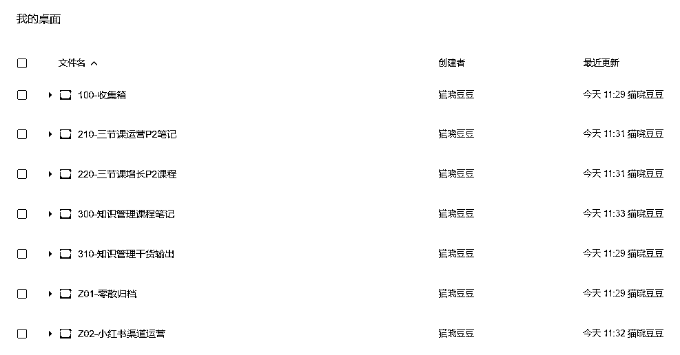

# 如何高效整理电脑的文件资料？

> 原文：[`www.yuque.com/for_lazy/thfiu8/kdd1afbag3ge5rs9`](https://www.yuque.com/for_lazy/thfiu8/kdd1afbag3ge5rs9)

## (71 赞)如何高效整理电脑的文件资料？

作者： 希平

日期：2023-08-24

一聊到整理电脑资料，这是很多人头疼的问题，子文件夹有四五层，文件这里一堆那里一堆，哪怕耗费一个下午，都只能清理了 D 盘，还有桌面、E 盘、F 盘等着自己，最后唯有备份到百度网盘，然后删除本地电脑的文件，眼不见心不烦。
长期以往，凡是能存储的地方，比如石墨文档、百度网盘等，都塞满了各种各样的文件，甚至一份文件的修改版占到了十几份。以至于你看到它就烦，想找一份文档时，耗费几十分钟都未必找得到。

但其实，你只需要花点时间，学一点整理规则，再配合一些软件，即可拥有一个干净的电脑桌面，文件也被安排得井然有序，就像请了生活管家，让你时刻有一个干净的着装。

图 1 是我的本地电脑↓，图 2 是我的百度网盘↓，图 3 是我的石墨文档↓
核心是借鉴杜威十进制图书分类法，将你的图片文档分类有序，通过文件夹+搜索，10 秒内能找到你所需的文件，如图 4 所示。

为给你更好的阅读体验，请移步语雀：[`www.yuque.com/maoxiaodd/knowledge/aukgha`](https://www.yuque.com/maoxiaodd/knowledge/aukgha)

* * *

评论区：

书豪 : 希平你真棒[呲牙][呲牙][呲牙]
希平 : 谢谢书豪哥
良辰美 : 以至于你看到它就烦，想找一份文档时，耗费几十分钟都未必找得到。

如果是本地电脑，一般我用 EVERYTHING。但确实现在线文档工具太多了，石墨腾讯云雀金山飞书谷歌 NOTION，现在我最主要是用飞书文档，又能当网盘又能记录沉淀
希平 : 嗯嗯，我这是喜欢整洁

* * *