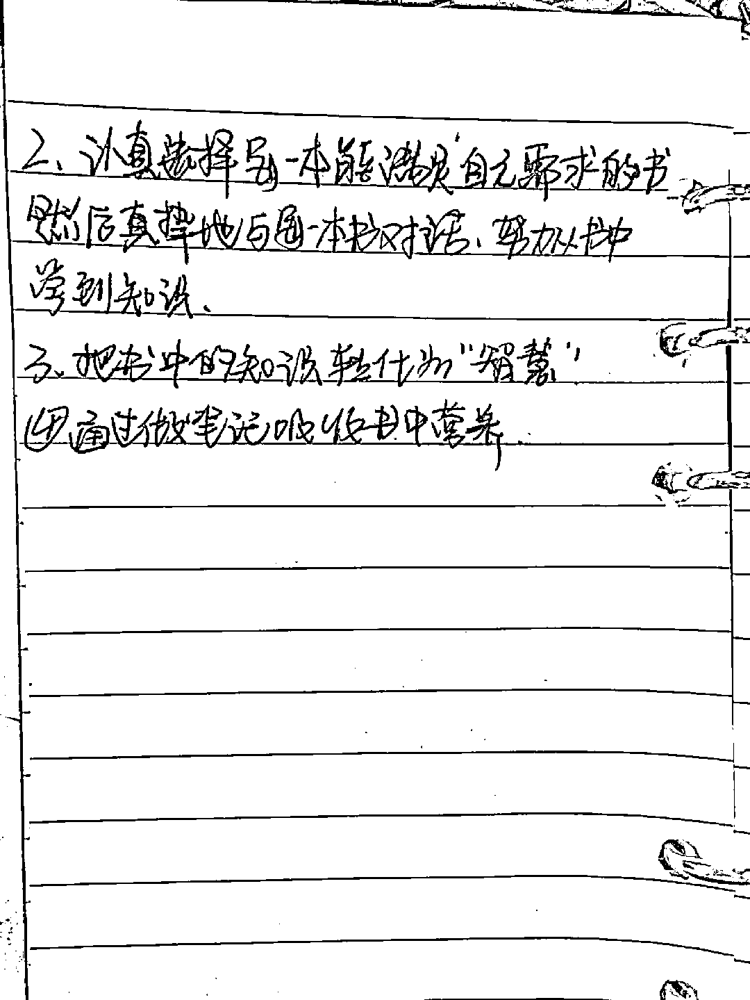
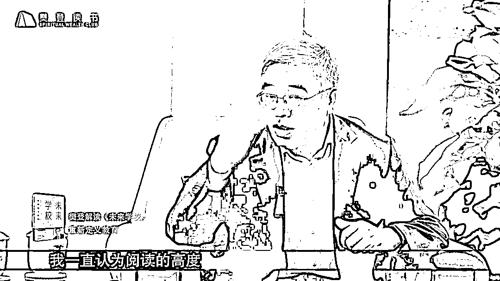
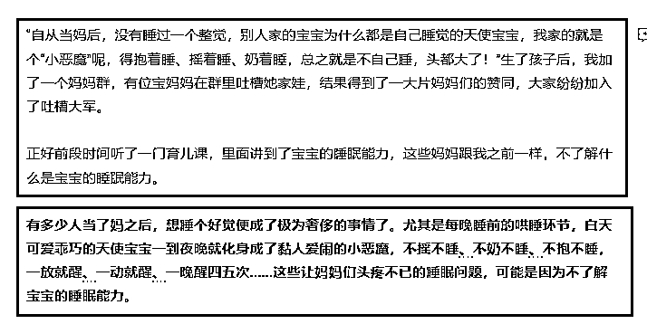
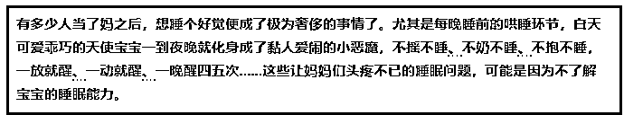
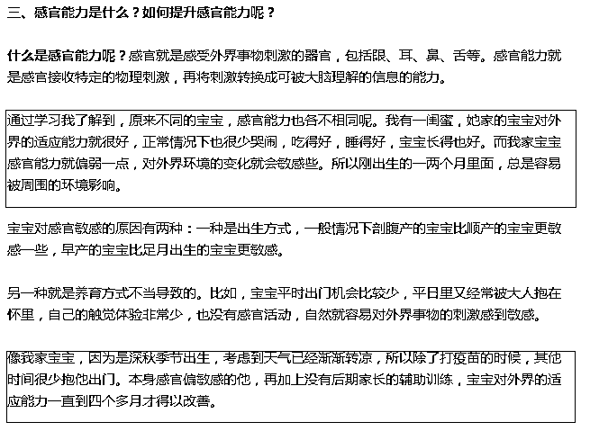

# 如何写出一篇对读者“有用”的文章？

> 原文：[`www.yuque.com/for_lazy/thfiu8/wewq7dzc0btk1ax6`](https://www.yuque.com/for_lazy/thfiu8/wewq7dzc0btk1ax6)

## (56 赞)如何写出一篇对读者“有用”的文章？

作者： 二丫吖

日期：2023-08-25

大家好吖，我是二丫～

我曾经写过一篇相关文章“如何从书中提炼观点，让你的文章更有深度”，有兴趣的可以右戳链接：：[《如何从书中提炼观点，让你的文章更有深度》](https://t.zsxq.com/11jkbp0BE)。

以下为正文。

**一**

**问题 1：**无从下手，不知道怎么表达。

** 目标：**能够很流畅表达自己，然后赚钱。

这个问题，我们第一步要做的就是要有读者思维，**你要时刻记得，你写些什么，才能对别人有用。**

所以，自媒体的内容，如果你没有粉丝基础，你就不能写：感想、感悟、个人成长日记等。

这样的内容，会显得很矫情。

**没有读者关心“你在想什么”读者只想知道“我花时间看了你的文章，我能得到什么”**

而，由于你的目标是赚钱。所以你就要考虑：**你的文章能让读者得到什么，你得写出“有用”的内容出来。**

如果你的目标不是赚钱，仅仅是想增强自己的文字表达能力，那可以的，你可以写感想、日记、感悟、你的认知等等，一切你想写的都可以。

**写作目的不一样，我们的写法就不一样。**

这是开启自媒体写作的第一步：**思维转换**

有了这样一个思维，还是无从下手怎么办？我不知道什么东西是对读者有用的？那我要怎么开始写呢？

这两张图请收好：

那么你就从你看过的书开始写，你把这几个问题的答案写下来：

1、这本书讲了什么内容；

2、你最喜欢这本书的哪一部分；

3、这本书对你有什么影响；

4、这本书的优点是什么。

这 4 个问题，对于新手小白来说，足以让你摆脱以往的日记式的写法，因为：**你介绍了书的内容、结合你的个人经历你表达了为什么喜欢这本书、最喜欢其中的哪一部分、这本书给你带来了哪些思维的转变、行为的转变、认知的提升？这本书的优点在哪里。**

按照这几个问题写出来的内容，就是对读者来说有用的，因为你在推荐一本书。

好，那么问题又来了，我选择这本书是因为别人推荐我看，我就看了，看完后我没有想法，怎么办？

其实有这样的问题是因为，自己的认知、消化能力较弱，本质上就是没有看懂。

**那你就需要外界有价值的东西来协助你看懂这本书：**

去搜：知乎搜、豆瓣搜、今日头条搜，看看别人对这本书是怎么样理解的，互联网平台用起来。

用纸和笔记下别人 10-20 个观点，再回过头来看这本书，你就会更加的理解了。

进而，也就有东西写了。

**正常一个人，只有自己理解一个事情，才能表达出来，自己不理解，是无法表达的。**

**阅读的高度，决定了精神的高度，精神的高度，决定了表达的高度。**

大家看，是不是这个理？

**所以，选书很重要，市面上烂书一大堆，你看书不对，选得不对，吸收的观点就不对。**

这就是为什么“鸡汤”类的书很受欢迎，容易成为爆款，因为看起来容易呀，没啥内容，就是情绪渲染，看着挺有道理，实际上没啥作用。

这类书籍，咱们一定要避免。

**我本人一直用的是樊登读书，推荐。**

**新用户是可以免费听 7 天的，现在不知道有没有这个活动了，有需要的可以扫码试一下。**

我之前用过喜马拉雅、得道，个人最喜欢樊登读书，因为所有的书，都是樊登本人在解读，毕竟人家是博士，表达清晰、逻辑清晰，听多了，慢慢地他讲书的思维方式也就能吸收一点了。

而得到和喜马拉雅就像今日头条一样，有点鱼龙混杂，有水平的没水平的都混在一起，难以分辨。

**看电子书的平台推荐：微信读书，好多免费的电子书可以找来看的。**

**总结一下：**

1、无从下手的话，需要先转换自己的思维，拥有读者思维；

2、可以选择从“书”开始写，写那 4 个问题的答案；

3、不知道看什么书的话，就从樊登读书上去找找，那上面也是分了领域的：育儿、情感、职场、文化等。

**如果真的有行动，做了以上几步一定会有收获的，100%的收获！**

怕就怕在，看完我这一篇后，心里想着“有道理”，然后就结束了。然后：**一边说自己没有进步，一边想要变现赚钱，一边又没有耐心一步步的操作。**

希望大家都能：**知行合一。**

**二**

**问题 2：**文章案例难找。 

​

**案例其实不是“找”出来的，而是根据自己的理解、然后再“添油加醋”的写出来的。**

案例形成的过程，就是你思考的过程，一篇文章的例子是这篇文章灵魂了可以说是。

你举什么样的例子才能让读者秒懂，这是非常重要的。

**如果你举不出例子，有两方面的原因：**

① 自己本身没有理解概念，你表达不出来对应的例子；

② 理解了，但是表达能力不好，所以感觉自己的例子写出来像流水账。

我以前干今日头条的时候有一篇 10W+的青云文，是模仿别人的文章写出来的，那篇不仅中青云了还是爆款。而且，是写关于：**升职加薪的内容的。**

最关键的是，这文章没有书上的东西，全是用个人的经历，写成的案例，然后连成的文章。

其实，每个人身上都有故事的。

但问题是，怎么将这些故事变成自己文章的案例，形成文章呢？

这是个问题。

写别人的经历用自己第一人称、或者用“我有个同事/朋友/闺蜜”等，也是一种办法，但这对于自己故事表达能力有要求。

**举个例子：**

这一段是某个育儿课程的开头，讲宝宝的睡眠能力的。那这就可以当成我们的一个输入。（非原创）

然后我们注意这个开头的关键词：当妈无法睡整觉、孩子要晚上要抱着睡、哄着睡、奶着睡。

有了这些关键词，其实我们自己就可以编一个故事出来了：

这个时候就有个问题：是洗稿吗？是抄袭吗？

咱们来看一下，这些关键词：当妈无法睡整觉、孩子要晚上要抱着睡、哄着睡、奶着睡。

你能说，这些现状是这个育儿课程“原创”吗？不能吧，这就是事实、现状、每个当妈的都会遇到的。

所以，**不管你这个故事怎么写，都不会涉及到所谓的抄袭和洗稿。**

所以，你的故事可以写成：

① 你自己当时的情况

② 你去看望坐月子的朋友，她的现状

③ 你某位同事跟你打电话抱怨这个情况...

④ 你家妹妹/姐姐/表姐跟你说她遇到了这个情况。

进而破题，写：“这其实涉及到了宝宝的睡眠能力……”

所以，怎么才能让自己的故事不写成流水线，你首先要知道：**你故事表达的关键词是什么？你的这个故事是用来干嘛的？**

像这个例子，关键词是：当妈无法睡整觉、孩子要晚上要抱着睡、哄着睡、奶着睡。

**为什么是这个关键词？**

因为这就是睡眠能力的表现形式。

**那么这个故事用来干嘛的？**

是用来作为整篇文章的破题的，读者不知道睡眠能力是个啥意思，所以你要讲个故事，人人几乎都知道的，孩子要奶水、睡不好的这个现状，便于读者“秒懂”。

**故事最后一句话破题：这就是宝宝的睡眠能力问题。**

**三**

我以前当写作班老师的时候，有个学员问我：下面这张图的案例有什么问题？

**她框出来的第一个例子，其实是为了替换“什么是感官能力呢”这段话。**

那我们来看一下，这段话的关键词是什么？**——感官能力。**

她写例子目的是什么？是为了解释清楚“感官能力”让读者秒懂。

**可是她的例子偏题了。**

那我们来看一下，她的例子的关键词是什么？

她的关键词是：不同宝宝的感官能力是不同的。

所以，她解释错了呀！她并没有讲**“什么是感官能力”**，她讲的是**“不同宝宝的感官能力是不同的”**。

**关键词变了！**

所以，**我们如果一篇文章的例子（故事），这里关键词偏一点，那边偏一点，最后这篇文章就会越写越尴尬了，偏离主题了。**

​

为什么说要提前列框架，有了框架，你就能确定，自己的故事到底要怎么讲。

**四**

再举个例子，比如我们要写一篇专栏，专栏其实就是为了售卖自己的知识，将文章付费，那么我们在写之前就要知道读者在意的点是什么，我们可以“以己推人”。

**我买专栏我在意的点是什么？**

1、这个作者有真材实料；

2、我买了后，能立马执行，并且也取得像这个作者这样的成绩。

**上实例：**

​

这一段，其实是非常好的履历，很有实力，可是这样表达的话，缺乏“吸引力”。

我们来换种表达方式：

第二种表达比第一种表达多了一种思考：

1、这个作者有真材实料  （我告诉你我的成绩）；

2、我买了后，能立马执行，并且也取得像这个作者这样的成绩（我告诉你，我的经验是可以被复制的，我用小号验证了，如果你学会了，你也可以复制的）。

这一段的目的就达到了。

关于文章案例不好找、故事如何写、怎么写出一篇对读者有用的文章，这都是同一个类型的问题。

分享完毕，最后总结一下：

**要多训练才有用哦~**

加油吖！

* * *

评论区：

青空明月 : 感谢分享，粗略拜读了一遍，就很有收获。等下班多磨几遍。[玫瑰][玫瑰]
不记年 : 很有收获，感谢分享！[玫瑰]
胖虎 : 有收获
书豪 : 牛逼
二丫吖 : [玫瑰][玫瑰]
二丫吖 : 有用就好，练习起来[爱心]
二丫吖 : [玫瑰]
二丫吖 : 写作能力是自媒体这行的基础能力[玫瑰]

* * *