# 小红书如何搜集笔记素材，解锁变现赛道选择自由度

> 原文：[`www.yuque.com/for_lazy/thfiu8/iu9kx81xggbgm5to`](https://www.yuque.com/for_lazy/thfiu8/iu9kx81xggbgm5to)

## (精华帖)(322 赞)小红书如何搜集笔记素材，解锁变现赛道选择自由度

作者： 梨云

日期：2023-08-25

生财的圈友们好，我是梨云，一个内容创业者。

在周二的生财实战直播中，作为嘉宾，和大家一睹了小红书的风口和机会。

我关注到评论区的圈友，做的赛道其实是特别多样化的：职场、家居、宠物、旅游、减肥……

这些赛道有一个共同的特点，就是非纯文字可以更好地变现。

想到之前很多人做定位，选来选去就是那几个码字的赛道，我结合最近自己在小红书做视频的经验，看到了新人入局小红书更多的可能性。

## **笔记可视化，选择更多元**

小红书，是内容种草平台，内容，离不开它的表现形式，我们刷到的笔记，通常是图文，或者视频。

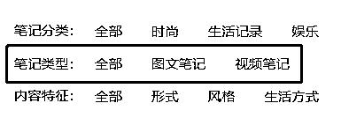

你不觉得，这个分类太简单粗暴了吗，如果我们对事物的了解颗粒度不够细，那么对它的认知就是模糊的，在执行的时候，就更容易遇到卡点。

于是，我大致分析了各个主流赛道 3 万条笔记之后，对形式做出了更进一步的细分。

[小红书爆款笔记数据](https://lvcj32c4z9.feishu.cn/sheets/ALCMspom0hrIv0t2Vaocdi1BnZK?from=from_copylink)

**图文形式**

文章图文：主要是文案区写文字，或者图片里写文字，就像公众号推文 mini 版。

实拍图文：不止是 plog（用照片记录生活），还有各种实拍图片为主配文字，都属于这一类，也是吸引品牌方的形式，毕竟产品要露出，文章图文加广告之后，就会成为实拍图文。

素材图文：不需要拍摄道具和技术，通过对素材的收集和处理，配合文字，实现笔记的输出。

**视频形式**

实拍视频：用手机或者相机拍摄的视频，这里强调内容由自己制作。

动画视频：用 An、剪映制作，素材自制或购买，这里强调内容由自己制作。

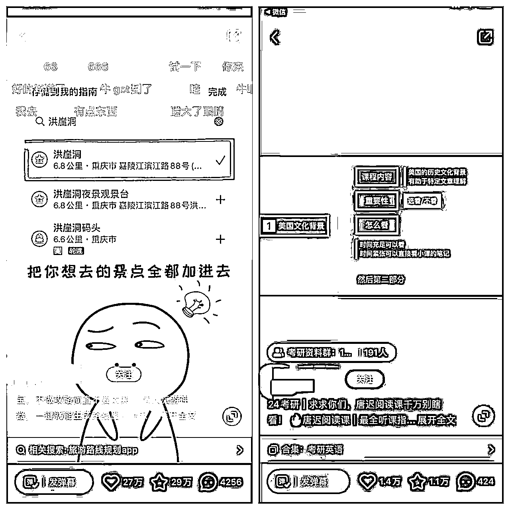

混剪视频：拿别人现成的素材直接进行二创，这里强调内容由自己加工。

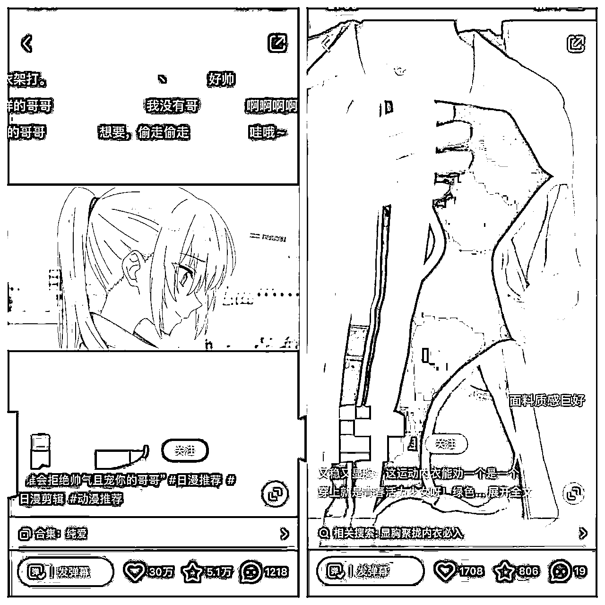

你可能会问，这么多形式，哪一种更好呢？

**其实，没有谁比谁更好，我们在做内容创作的时候，是需要追求内容和形式的统一的。**

写人生感悟、建议类干货方法论，用文字完成精准传达信息的目的，就是内容和形式的统一。

种草一个旅游景点，用纯文字，景点信息几乎无法传递，我们就说，这是形式阻碍了内容。

怎么优化？改成图片或者视频形式，就可以完成统一。

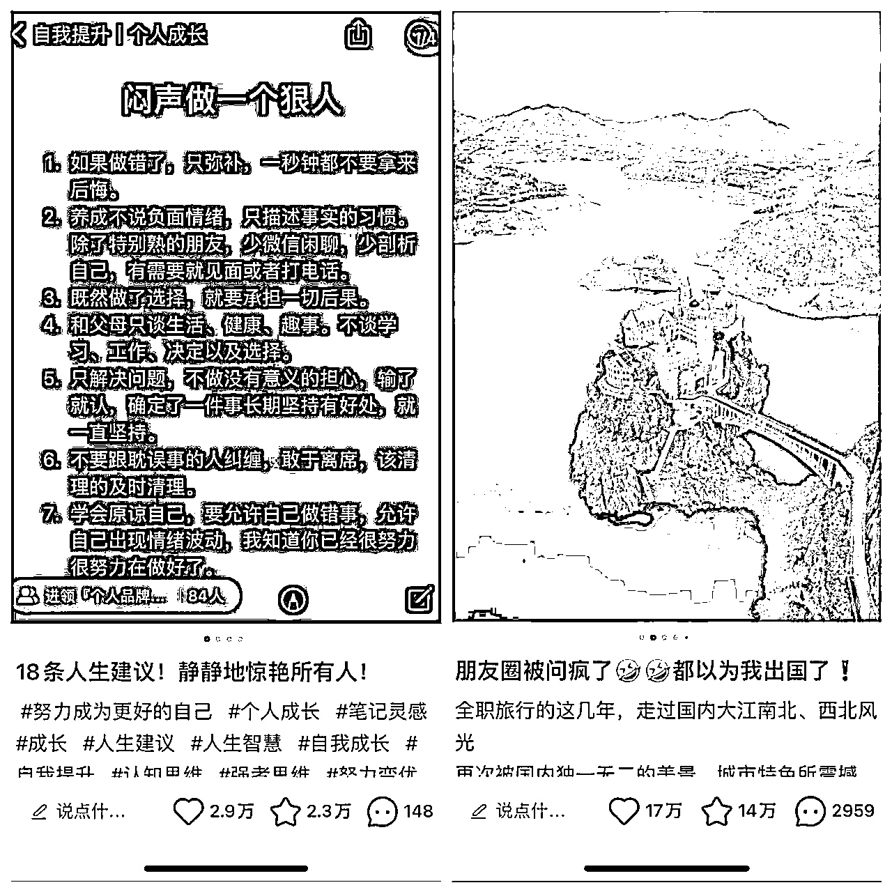

由此，我们可以知道，形式的选择，对内容的展示，会起到促进或者阻碍的效果。

选择什么形式，是由内容决定的。

我要种草一款口红，我就要用图片，来呈现它的外观、颜色，和搭配效果。

我要种草一种装修风格，我就要用图片，来呈现它的整个视觉效果。

这些内容，如果全部改成纯文字，是完全没有竞争优势的。

前段时间，我测试了一下，把教育赛道的纯文字笔记，改成实拍视频，硬是把停更一年的号数据原地拉起，拿下千赞爆款。

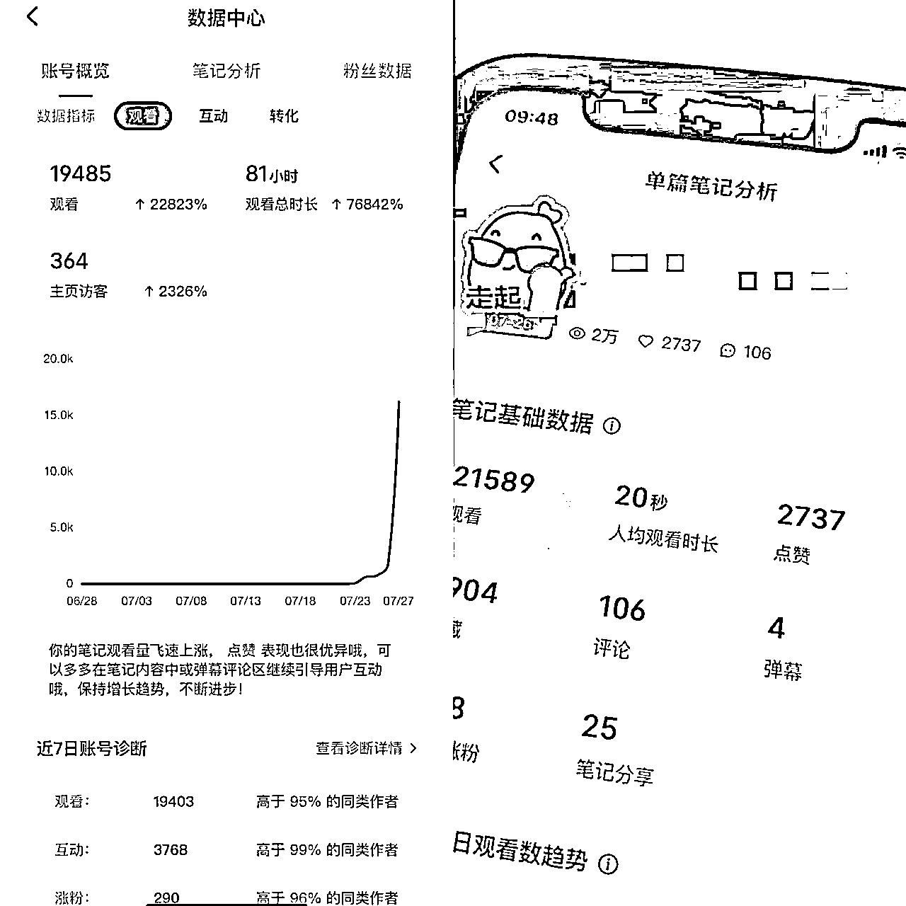

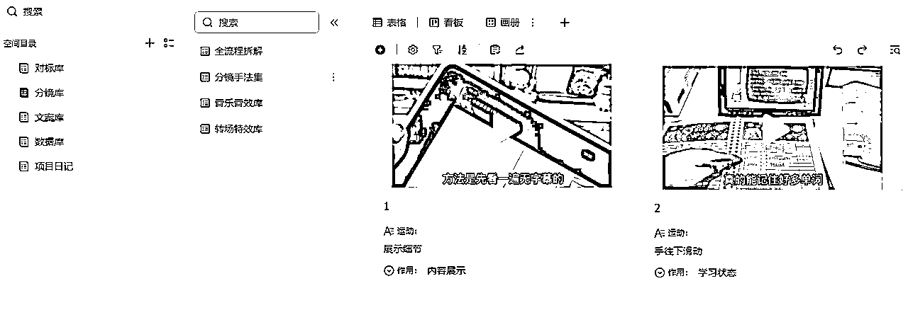

在上面六种形式中，素材图文，比纯文字变现天花板更高，又比视频制作成本更低。

美食赛道，9.6w 粉丝，一条广告报价 1.2w。

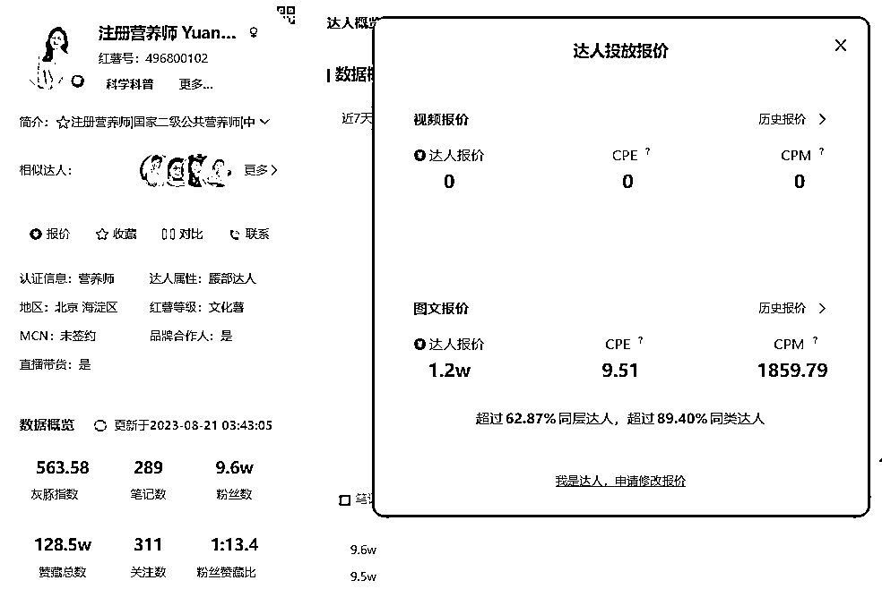

母婴赛道，4.4w 粉丝，一条广告报价 5000。

护肤赛道，2.2w 粉，一条广告报价 2300。

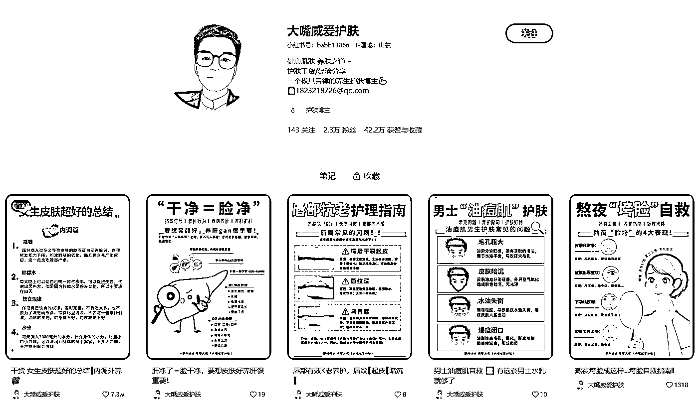

过去，我系统的分享了文字输出这块的内容，这一次，基于新人上手友好和竞争力的考量，就和大家讲讲，有可视化需求赛道的素材图文笔记如何制作。

它分为实体素材和虚拟素材，不需要你实拍，只要你知道怎么快速、批量地获取它们，以及如何精细化模仿。

**它将结合我设计的梨云绿模板，带你看到小红书变现更多的选择性，方法很简单，一旦掌握，你就拥有了横跨赛道的底层能力。**

PS：有不少人在问，梨云什么时候再设计新模板，其实，梨云绿模板的可塑性是非常强的，也期待大家可以开发出更多的形式和玩法。

### 实体素材的笔记可视化

实体素材，就是图片都是实物，给人真实感，这样的笔记，本身就自带广告位，可以更好的赢得品牌方和青睐，即便是带货，也能获得更多的咨询量，这里一定要注意图片与实物统一。

有粉丝量级但无法广告变现的其中一个原因，就是你的笔记，没有广告产品展示位。

这种笔记，几乎在每个赛道都能找到，这意味着，你学会了，就可以入场任意赛道。

制作不难，理清步骤，解决素材卡点即可。

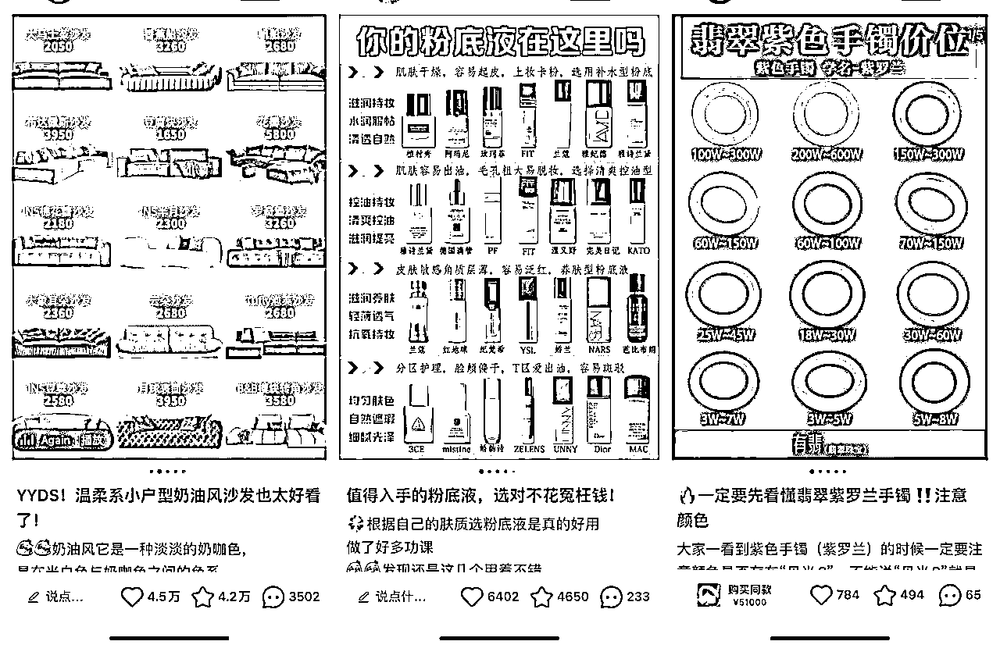

**1、排版分析**

要做到精细化模仿，一定以要素分析，和网格分析打出一套组合拳。

要素分析，就是拆解在这张图片里面，有哪些要素：名字、售价、素材、纯色背景。

网格分析，就是确定这些要素的空间关系：位置放哪里、尺寸是多大。

网格，不是每次都要一条条横向画上去判断，只是说，熟练到一定程度后，你可以像我一样，眼睛就是比例尺。

这里，我认为还可以优化的地方，是排序的逻辑，比如按照颜色一行行划分，价格由低到高排序。

**在视觉美感上，没有人能忍受混乱，也没有人会拒绝秩序。**

**2、素材搜集**

分析完之后，门槛就在于如何找到这些沙发素材了，解决方案：安装一个以图搜图的插件。

下载 edge 游览器，点击右上角三个点，选扩展，点拼图图案，选管理扩展。

直接搜【搜图助手】进行获取。

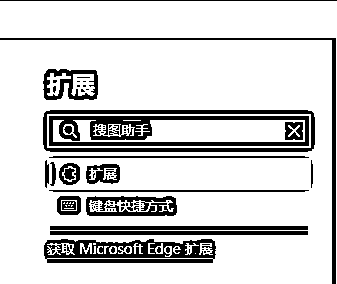

通过截图检索，可以找到一坨沙发。

它默认是百度渠道，我们打开右上角的原网显示，可以发现，商品图片来自京东、淘宝。

我们选择淘宝这一栏，找到同款样式的沙发，点进去。

然后，就找到了正面的大图，用 Fatkun 插件，可以获取高清图片。

按照这个方法，可以完成图片素材的收集。

至此，你就掌握了从文章图文跨越到素材图文，完成多元赛道变现的底层能力。

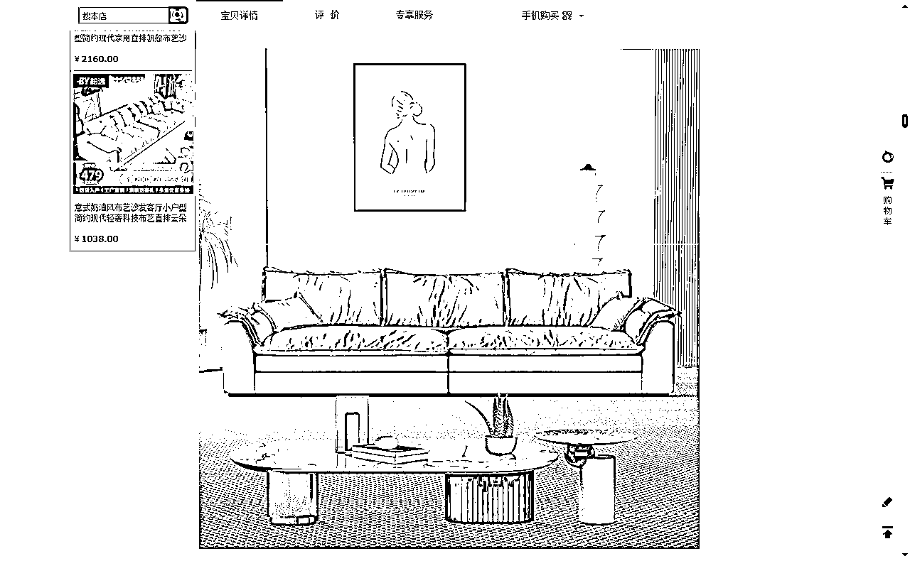

**3、制作图片**

看一眼就可以发现，这个图片没法直接用，因为不是 png 格式，需要对背景进行处理。

手机可以用：美图秀秀、醒图、黄油相机

电脑本地可以用：PPT、PS、PS（Beta）

电脑网页可以用：稿定设计、AI 在线抠图工具：[`photokit.com/tools/cutout/?lang=zh`](https://photokit.com/tools/cutout?lang=zh)

然后，我们保留 ppt 上的表格，把素材依次拖进，把名字和价格写上，完成笔记的制作。

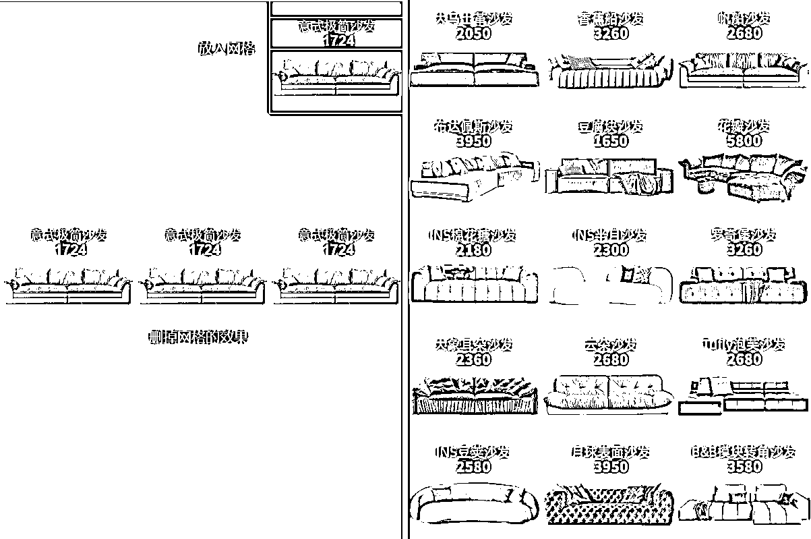

打开盖得网，会发现各行业商品分类都可以用这种玩法去创作，选题无忧。

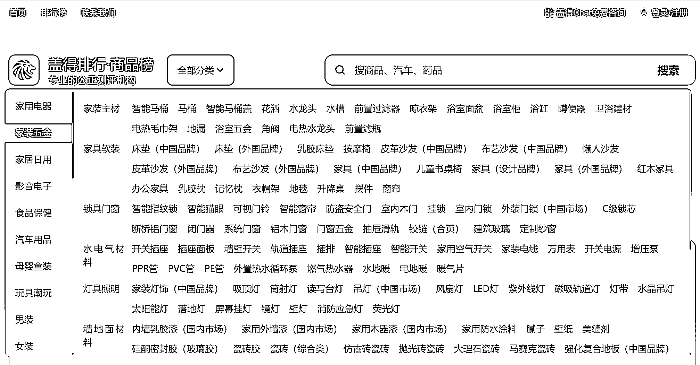

恭喜你！看到这里，现在就可以解锁以下赛道的小红书笔记内容创作，打开你的作图工具，搞起！

### 虚拟素材的笔记可视化

除了用实体素材种草的笔记，还有虚拟素材的笔记。

它可以是实体素材的平替，也可以是对干货知识的可视化升级。

作为小红书 IP，如何体现你的专业性，其中一点，就是能够为小白呈现足够详细的步骤。

而步骤一旦多起来，密密麻麻犹如一张说明书，是没有人看的。

在短快平的时代，想要脱颖而出，就要图像化。

**1、排版分析**

分析依然是看要素和它的属性与位置。

看不出是什么字体，可以用字体识别工具：[`www.likefont.com/`](https://www.likefont.com)

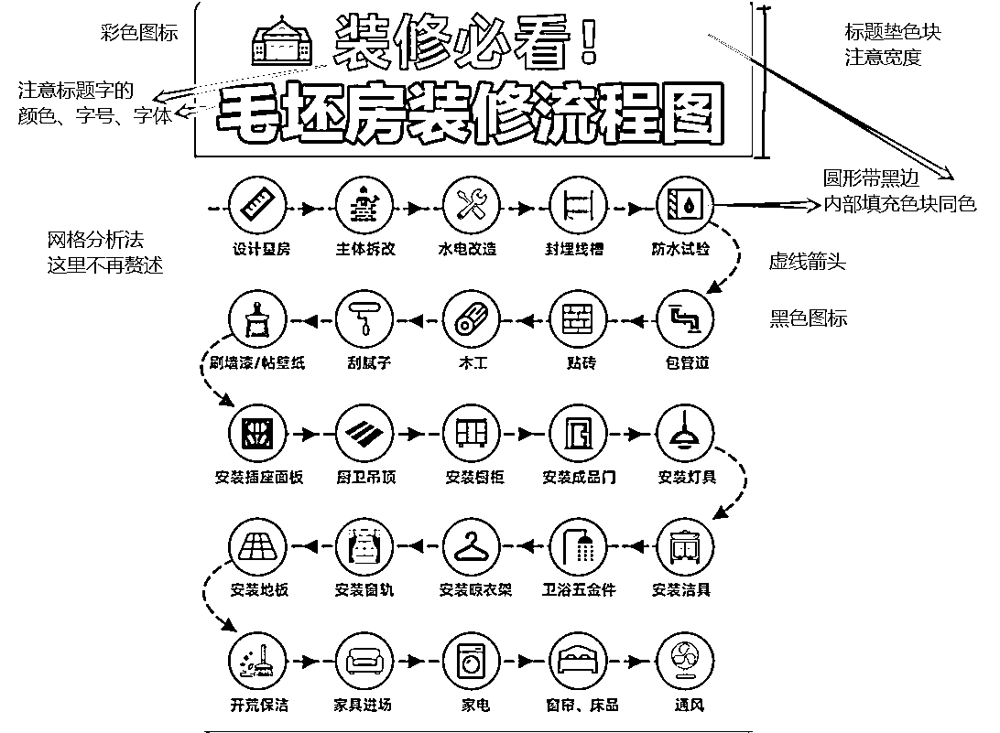

**2、素材搜集**

素材上，和刚才的实拍不同，它更多是卡通图，以图搜图有点失灵。

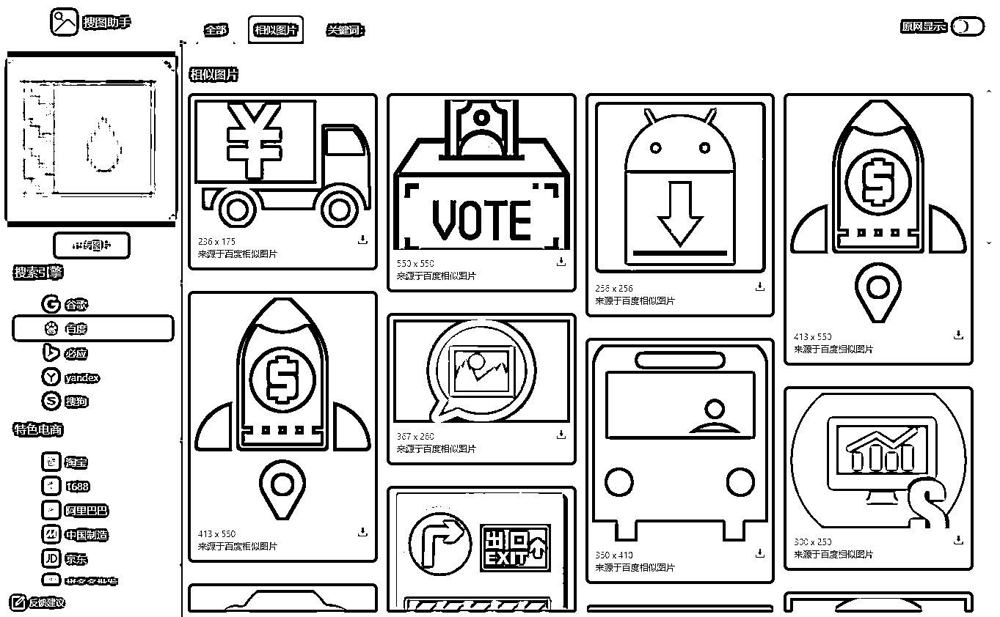

这类图的获取方法有这 3 种：

**图标聚合网站**

[iconfont-阿里巴巴矢量图标库](http://www.iconfont.cn)

[Noun Project: Free Icons & Stock Photos for Everything](https://thenounproject.com/)

[Icon Ninja - 33350 vector icons and 700080 png icons for free download](http://www.iconninja.com)

[icons8.com](https://icons8.com/)

[ByteDance IconPar](https://iconpark.oceanengine.com)

**各类作图软件自带**

WPS 的 PPT、搞定设计……

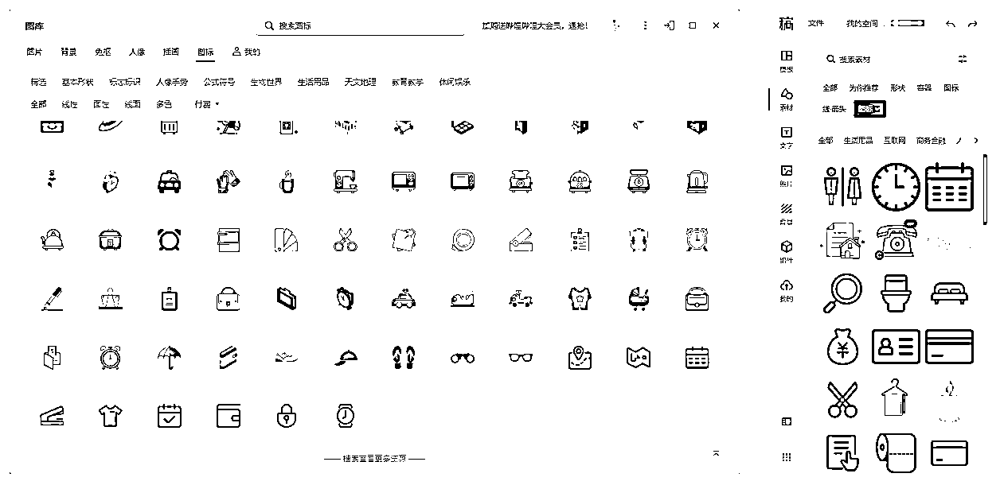

**拼多多购买**

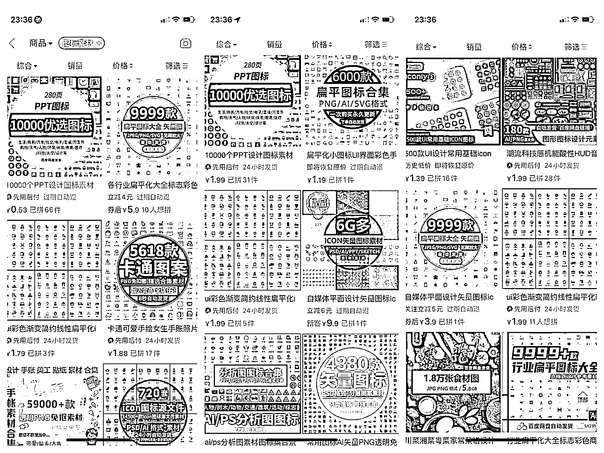

**3、制作图片**

我从[iconfont-阿里巴巴矢量图标库](http://www.iconfont.cn)搜索尺子，获得了这个素材。

它是确定颜色，再下载，所以，你需要先对对标号的色号进行获取。

这个是颜色代码工具：[在线色号色彩查询 - 千通彩色库](https://www.qtccolor.com/secaiku/)

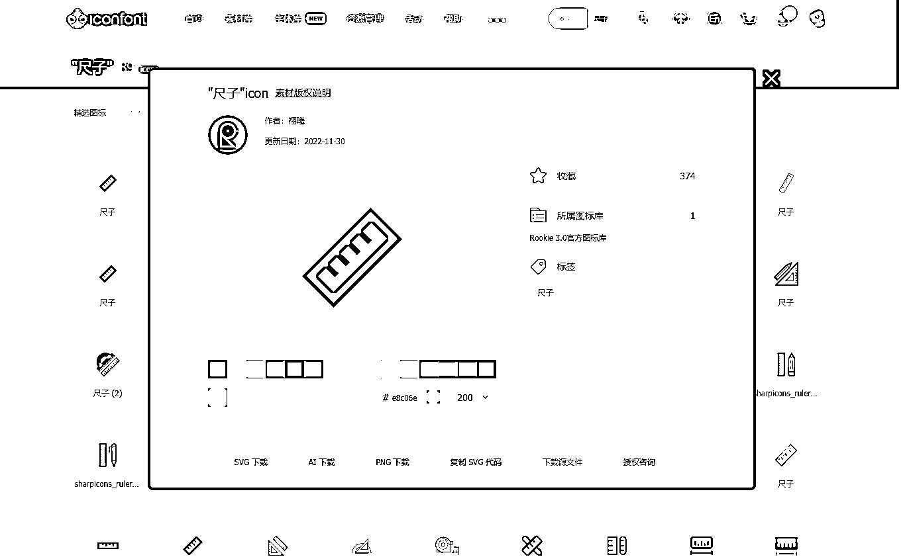

在原图上，做一个圆形，黑边绿色填充，使得圆形完全覆盖，然后拉动透明度，让尺子的大小浮现。

我们把尺子素材，贴上去，使得面积尽可能重合。

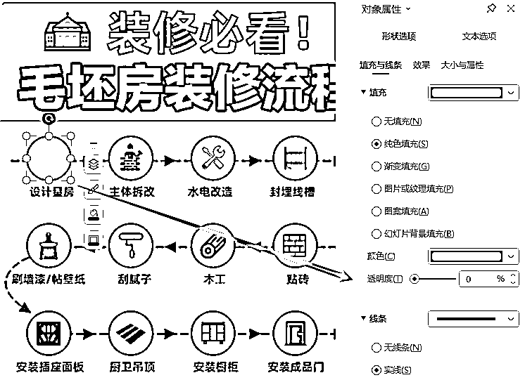

如此，我们就完成了一比一的复刻。

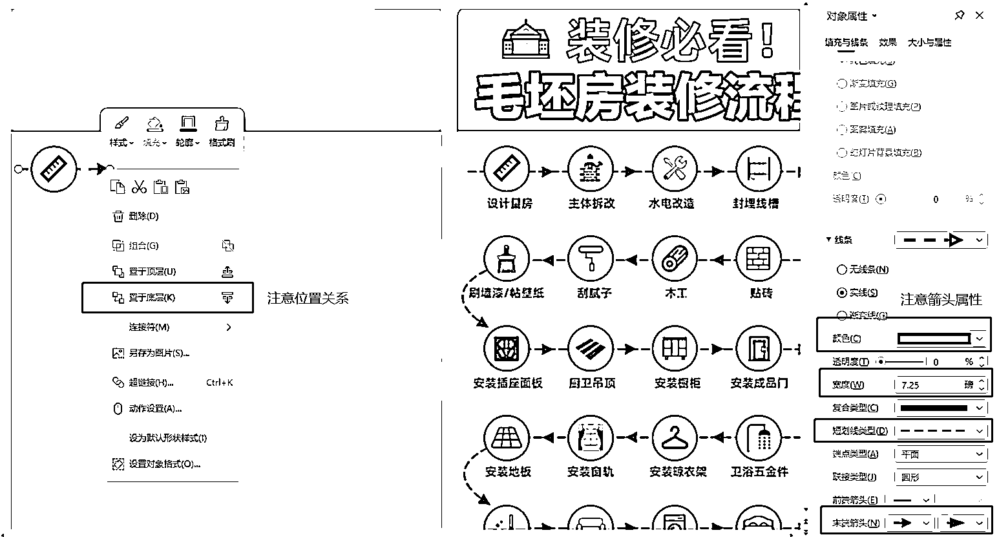

在笔记可视化的整个流程中，我把图片的创作，分为了三个部分：排版分析、素材收集、制作图片。

很多新人不敢下场家电、护肤、汽车、穿搭等这些变现天花板更高的赛道，原因在于素材的缺失，现实中又没有资源支持实景拍摄。

而你用上面工具+氪金的方法，基本上就解决了素材问题。

**这里我再给大家补充一个，不属于上述分类，但使用比较高频的拼纯图的素材搜集方法。**

### **拼图素材的笔记可视化**

想要找到这样的封面图，我说打开百度就能找到，很多人不信。

于是，你打开百度，输入玫瑰，大红大绿让你瞬间老了 10 岁，确实离谱。

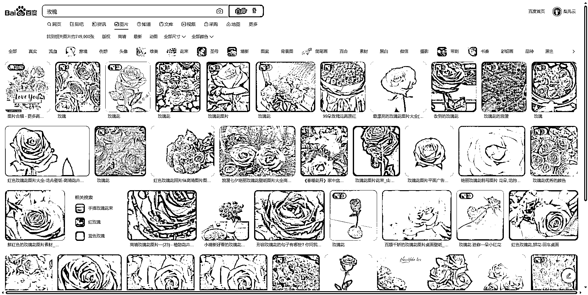

但是，当你变化一下关键词，输入：玫瑰 ins 风 唯美，得到的结果就完全不同了。

原因就在于，前者，你用的是模糊的关键词，而后者，加上了形容词，让检索变得更加精准了。

这一点，和 AI 绘图有些类似，你提供的关键词越精准，它就能生成越符合你心仪的图片。

再深入一下子，选一个风格最像的，选百度自带的搜图，可以找到图片所在的文章。

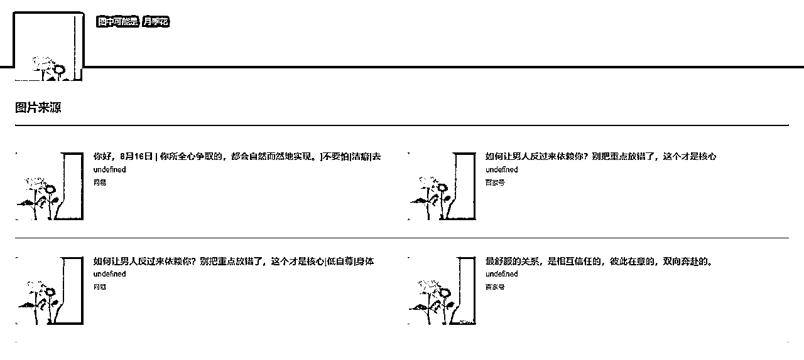

一般有审美能力的小编，都会给文章配相同风格的图片，遇到这样的情况，就把文章的图片都爬下来，纳入自己的素材库。

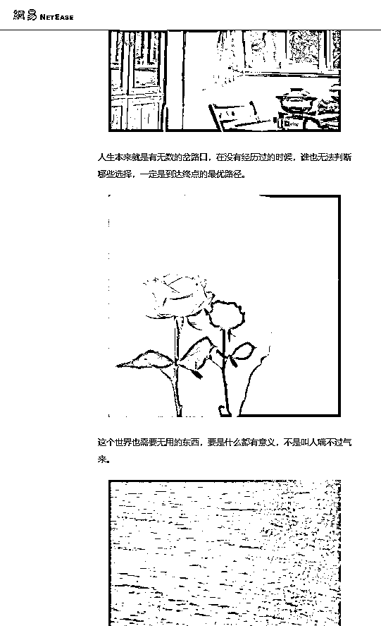

这里还有一个小技巧，就是使用筛选器。

通过调整尺寸大小，可以获得更高清的图片，选择自定义宽高，可以快速锁定 4:3 小红书尺寸的图片，选择图片颜色，可以快速统一主题色，视觉效果更舒服。

### **主流赛道素材搜集汇总**

很多大赛道的素材，淘宝商家都已经为你整理好了，所以，一定要学会淘宝搜索。

这里梨云给大家汇总了主流赛道素材的搜索关键词，省下你寻找的时间，以及给你一些思路和启发。

[小红书爆款笔记数据](https://lvcj32c4z9.feishu.cn/sheets/ALCMspom0hrIv0t2Vaocdi1BnZK?from=from_copylink)

悄悄告诉你哦，这一套方法过于底层，不止适用小红书。

**不要被能力局限了选择，你远比你想象中的，拥有更多可能。**

今天的小红书分享就到这里，内容很干，希望能给到大家一些启发和帮助，坚持下去，你一定会有所收获。有帮助的话，记得点个赞哦~也欢迎交流+v：lyy520061

更多小红书干货，可以关注公众号：梨云读书

**往期精华文章推荐：**

《小红书三个月涨粉 17w，变现 10w+，我做对什么？》

[`t.zsxq.com/07Fqr3jQ7`](https://t.zsxq.com/07Fqr3jQ7)

《小红书 60 天用原创拿下 20 多篇 10w+，如何流程化创作爆款内容？》

[`t.zsxq.com/09ev8Jjgj`](https://t.zsxq.com/09ev8Jjgj)

《在小红书上，如何挖掘出 1000 个适合普通人的赚钱项目》

[`t.zsxq.com/0eRD32jY6`](https://t.zsxq.com/0eRD32jY6)

* * *

评论区：

晴朗☀️ : 梨云出品，必属精品[强][强][强]
徐宿 : 底层逻辑直接可以迁移到抖音、视频号、快手等平台，非常有价值。圣火昭昭，圣光耀耀～
家蒙 : 模仿是个很重要的技能
嘟 : 太棒了
梨云 : 守破离[机智]
梨云 : [机智][机智]
梨云 : 解决了内容中令人头疼的素材问题[奸笑]
梨云 : [玫瑰][玫瑰][玫瑰]

* * *