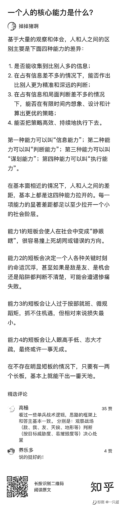

# 一个人的核心能力是什么？

> 原文：[`www.yuque.com/for_lazy/thfiu8/uigzkplzhk1vr1up`](https://www.yuque.com/for_lazy/thfiu8/uigzkplzhk1vr1up)

## (26 赞)一个人的核心能力是什么？

作者： 亦仁的收藏夹

日期：2023-08-25

人和人之间的差距，基本上是由信息能力、判断能力、谋划能力和执行能力来开的。每一项能力的显著差距都足以至少拉开一个小的社会阶层。

而在不存在明显短板的情况下，只要有一两个长板，基本上就能干出一番天地。

所以，你的核心能力是什么呢？

* * *

评论区：

暂无评论

* * *