# 关于「微信问一问」的几点实操心得分享

> 来源：[https://eqc9f6vzuhv.feishu.cn/docx/A0JBdp7KCo1VdWxVrRjcUpnnndh](https://eqc9f6vzuhv.feishu.cn/docx/A0JBdp7KCo1VdWxVrRjcUpnnndh)

# 一、前言

谢谢你愿意点开这篇文章，阅读我的内容分享。

我是一名普通的农村男孩，也是一名刚接触自媒体7个月的新人。人生经历中有过辉煌的时候，也有过陷入深渊的时候，但总体来说，也算是在2023这一年，重新站起来了。

很多时候我们都在抱怨、吐槽生活的不公，却很少反思自己有没有根据挫折、失败而不断改进，把可以优化升级的地方努力去执行：这也许是很多人平凡的原因吧。

我不想平凡，也不想沉沦，所以我再一次鼓起勇气选择了接受迎面而来的各种痛击，忍住痛苦，稳步前进。

前行路上，仍然有许多懵懂、不对之处，但是也期待与更多努力前行的小伙伴相遇：一个人成长的路上难免遭遇风雨，但愿身旁有人一直陪伴。

感谢一路上能够遇到同频的小伙伴，感谢能在高质的氛围圈子里共同成长，感谢带着真诚坚持下去的自己。

# 二、正文：

正如序言所说，现在「微信问一问」的流量巨大，正是普通人、新手小白最好的入局时机。从最简单的角度去理解也就是：

你可以想象一样知乎的画面，所有人都是抱着学习、好奇的心态而来，但是并没有几个专业人士可以提供专业的意见还有答案，内里大部分都是20分、30分的人。

而你，掌握的知识程度是60分。

## 01.做好实操之前的准备工作

问一问是与视频号绑定的，猜测应该就是微视频号服务，通过吸引新一波流量，导入视频号，增加视频号的用户沉淀。

因此，个人微信是回答不了的，你得先创建一个视频号，流程很简单，可以参考以下的方式进行：

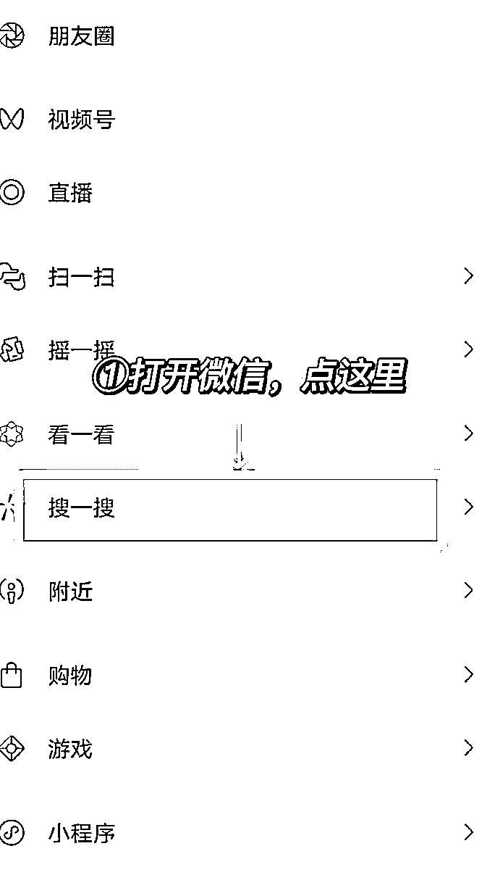

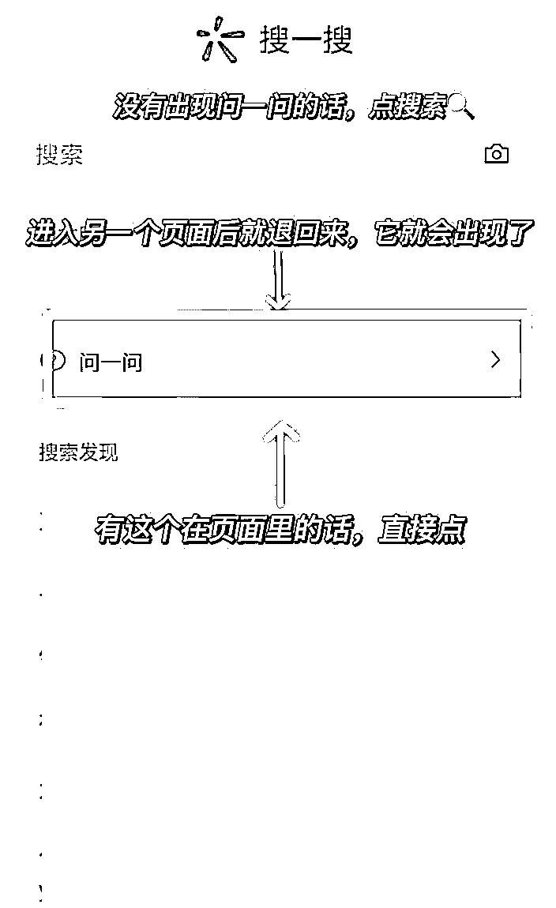

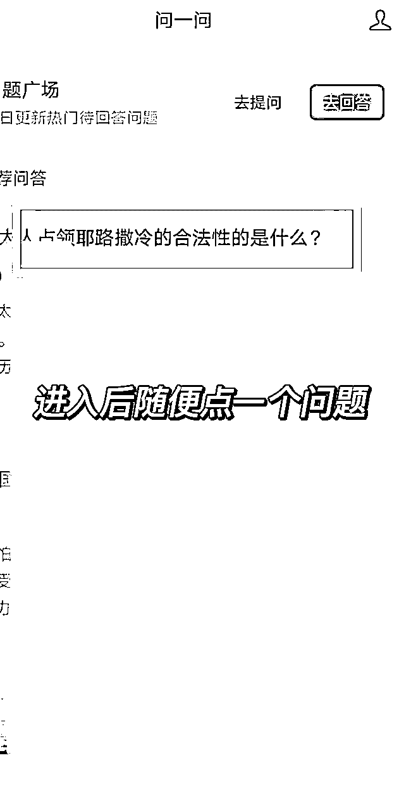

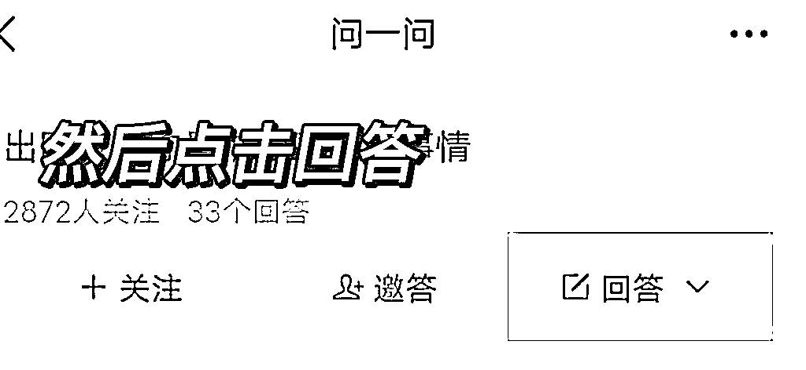

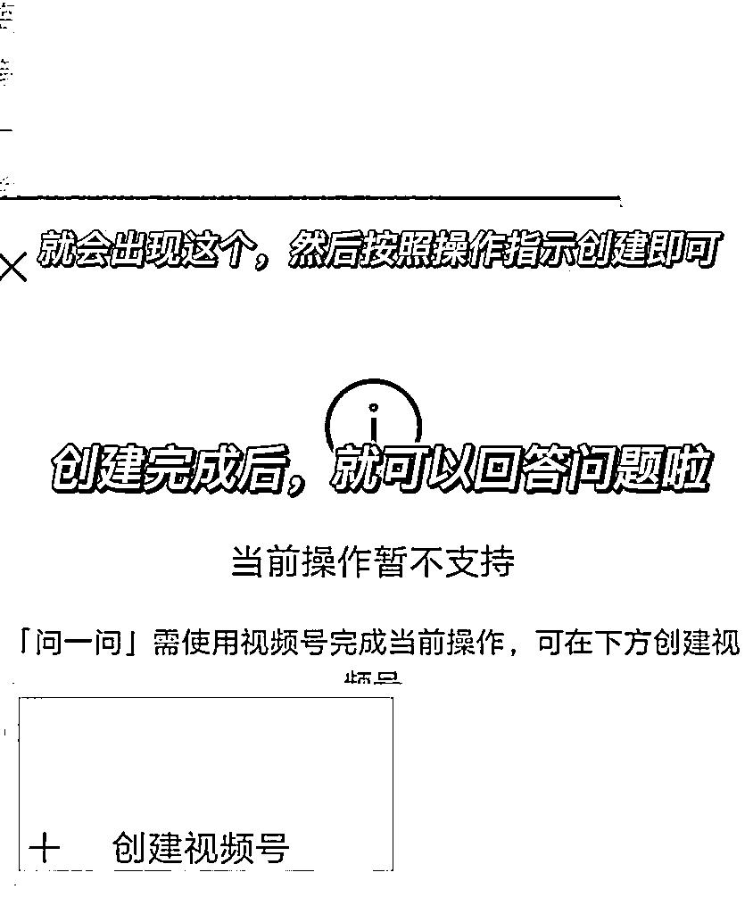

这里有三点温馨提示：

### ①个人有做公众号的情况：

如果你有做自己的公众号，视频号的名字最好是和公众号相一致，因为视频号是可以绑定公众号的，所以当视频号在吸引流量的时候，也会给公众号带来部分流量。

这个相当于【曲线救国】了，0成本的涨粉，非常值得一试！而且如果你并不是专注做视频号的话，便可以像是其他平台一样，在回答中留下钩子，吸引读者关注你的公众号。

当然前提也是一样的，引流的术语不能太过分，毕竟现在问一问还在发展初期，大概率都是人工审核比较多，太明显的话术会被直接【审核不通过】。

比如可以在回答完问题后，最后一句添上：这一块我也深耕了好多年了，也整理了不少资料了，希望以上的些许心得能够帮到你。

类似这样不明显的话语基本上都能过，表达了自己的专业性，手中还有不少他需要的资料，而回答的又只是一小部分，足够吸引人的好奇心，却也没有明显的引流痕迹。

PS：目前也可以切换公众号去回答了，如果是专注于做公众号，直接公众号回答，涨粉会更加明显。

### ②个人没有做公众号的情况：

1.也许是想着专注往视频号的方向发展，那这种情况的话，也正是目前微微所请教的，希望有圈友看到的话，可以为咱们精准细分，分享一下如何做视频号的基础内容。

当然，也可以到星球内搜索精华帖或者相关内容，感兴趣的小伙伴记得去学习喔。

2.只做微信的话，可以直接在视频号上留下个人的微信联系方式，然后在简介中留下钩子，比如说可以领取资料、或者可以让人得到什么有价值的内容。

### ③资料的准备情况

人都是有惰性的，所以咱准备的免费资料，其实不需要过于冗长和详细，因为90％的人不会完整地看完，既浪费时间也浪费精力。

主要以“精、简、准”为主整理即可，比如说可以按照以下3点结合进行准备，尽量在万字以内的见面礼，既能捕捉到读者的好奇心理、也能展现你的专业性，还能刺激他想学习、也想做起来的心思。

1.关于你在某方面获得成功的成长经历，主打真实、真诚、激励他人，调动起关注者的内心情绪。

2.内容里包含着专业的指导内容，不要过分详细，点到位即可，留下悬念让关注者更期待你的下一步输出。

3.内容也要尽量完善到比较细节的步骤，传达出小白也能做，关键在于每一步的细节，在心理层面给关注者降低难度，进一步让他从路人转化为粉丝，再通过后期的沟通、持续分享转化为学员、客户。

有时候把每一步都尽量做到精简，或许也可以褪去中间繁琐的环节，带来更直接的良好结果。

## 02.实操的几点锦囊

目前问一问的分类也比较少，人群关注的问题也不多，但是我们仍然可以对标知乎这个平台，把类似的实用经验用在问一问的布局上。

比如说回答主页面中的热点问题，分类中更多人关注的问题，然后评论比较多人点赞、缺少评论的回答...其实，微微在亲测下，这些的效用并不是很大，关键是在于找到与你「定位细节」相关的关键点。

### ①定位细节

#### 1.你的受众群体

目前你所擅长的东西，你所交付的东西，你所能给予对方的东西，这些都决定了你的受众群体是哪些类型，你也得寻找关于这些类型的群体进行提问或者回答。

即：换角度、换视觉思考。

你总不可能以大学生的角度去思考小学生的问题，单身还没谈过恋爱的去回答关于母婴、婚姻相处之道的问题吧。

以上是基础版的提问、回答输出，接下来的才是关键点：

从你的受众群体角度出发，去找到一些能够与他们产生联系的话题，而不仅仅是他们感兴趣的话题，最好是根据联系中最强的特点进行主攻。

比如你是的受众群体是20-35岁的年轻群体，主要都是女性群体，然后你只能挑选2个问题回答，你觉得在主页面这几个问题中应该回答哪2个问题？

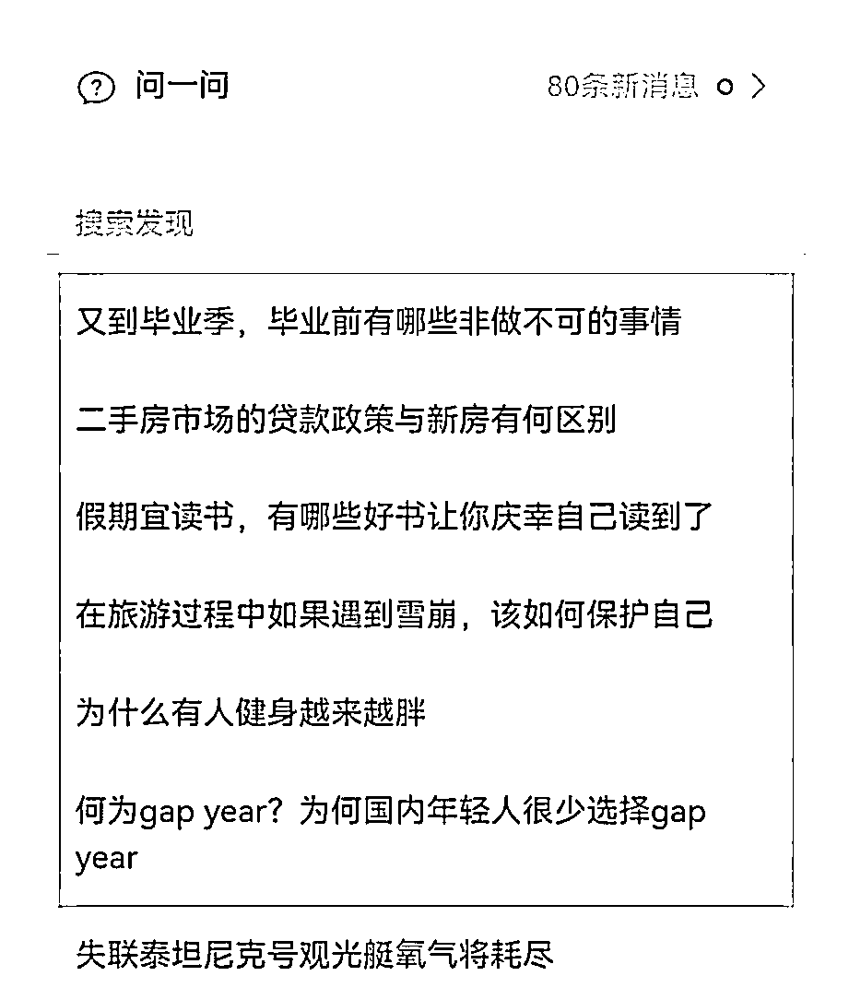

微微早上问过10个读者，他们中大部分都是选择顺数1、3，或者是1、5，而正确答案应该是顺数2、6。是不是感到有些难以理解呢？

按照以上的案例，受众群体是20-35岁的年轻女性，那么我们可以区分为大学生（留学生）、职场新人、还有都市丽人，那么其中消费力最强的是都市丽人、留学生。

她们不缺财富、不缺职业内容，更多地是对情感的抒发，所以你可以在视频号准备一些关于情感方面的内容，同时去回答能与她们对应上的问题。

即：符合她们消费能力、她们的三观、对社会政策、敏感事物等以及感兴趣的问题。

更多地剖析受众群体的画像，像是她们的爱好、日常生活、工作内容、穿搭、三观、大众普遍印象、小众的突出特点等，完全了解一个人她的表面需求、内心需要、渴望需求。

知己知彼，百战百胜。

如果单纯地按照字面意思和大众普遍印象去解读这个问题，那大多数情况可能会碰壁，或者偶尔会小爆发，但都不能给你带来长尾流量，也就是不要“自嗨”。

昨天我刚写了一篇关于写作不要自嗨的内容分享，其实在这里也是适用的：

#### 2.回答要因人而异

不要想着每个问题都以专业性高、干货足、价值丰满的内容去回答，我们都有着一个“本我思维”，大部分时候想以为利他便能够获得最大的回报，在这里并不适用。

现在问一问里边可以说是【良莠不齐】，虽然没有特别多KOL，但是优秀的人却不少，更多的则是抱着好奇、与刷视频一乐的心态进来的。

所以，以【受众群体】为基础，你也要扩大思维层面去思考，抓住群体背后个人的心性，即：他到底是以什么心态去提出这个问题的。

比如以下的两张图：

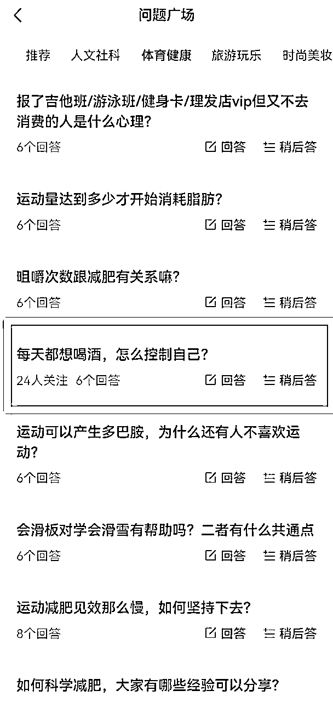

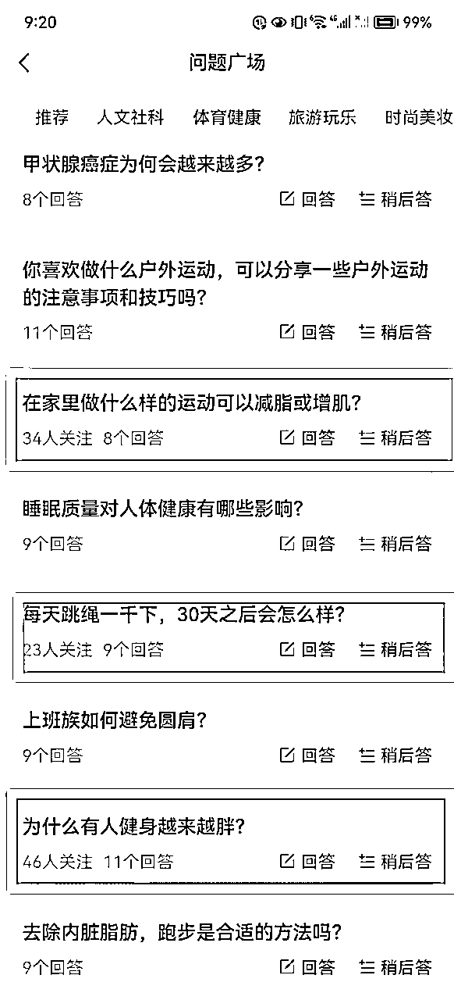

图一还有图二的第2、第3点的问题，给你的第一印象是什么？我相信基本上都有这样类型的回答：

图一：用饮料代替、想喝酒的时候多看看喝酒的危害、用别的事情去移开注意力、找医生开药等。

图二的2：膝盖应该会磨损、建议不要过于剧烈运动、耐力会变好、体质会变强等。

图二的3：健身需要消耗大量的能量，所以也会经常饿，吃得会比较多，然后无法形成平衡等。

而当你看多几遍时则会感觉到一种画风不对的感觉：他好像在以一种平时聊天的语气在提这个问题，不像是真心想要寻求科学且一系列需要遵循的计划。

所以针对类似这样的问题，适合用非干货的形式进行回答，而不需要过于较真。比如图一的问题，你可以侧面思考，这不就是在说：每天都想玩游戏，该怎么控制自己？

最好的回答形式应该是段子+一点认真的内容，里边最高赞的回答是喝酒适度+一些情感共鸣词，而第二高赞的就是一句话的段子。

图二的2、3同理。

而图二的第1个问题，最大的不同点就是，你能从中发现这很大可能并不是一个日常中无所谓的提问。通过拆解这个问题，我们能发现：

1.宅家的自由职业/宝爸宝妈。

2.忙碌的上班族。

3.社恐人士。

4.需要改善体型，可能存在身材焦虑的人士。

5.属于健身/减肥赛道的泛粉。

6.有一定的惰性，想通过较为简易的运动实现改变身材的目的。

7.对于生活消费上的观念大概率属于节制型。

8.属于有基础知识，但是执行力低下的类型。

...

针对以上的分析，我们能够得出这个提问的用户，应该是乐于收集有用信息，但是并不擅长复盘使用的类型，也就是说：

回答尽可能要精简，但内容要附带高价值性、可参考性，适当加上鼓励引发情绪，让其能够一眼看懂且收藏。

里边回答最高赞的内容，和分析的结果也是吻合。

### ②寻找“潜力股”，避开“高专业”

对于“问一问”，其实在搜索、研究过后，我发现大部分人都在回答眼前感觉最多人关注的问题，这无可厚非，因为越多人关注，回答越少，表示我们可以早占领坑位，早得到曝光的机会。

比如热点中的关注人数，每一次打开，都会引来大部分流量进入，的确是最好的回答方向。

像是阿猫老师今天发的笔记，让我瞬间得到了启发：「观念要改变」。

#### 1.少数人群的痛点

我们可以把握之前的优质经验、做法，但是也要从中找到别人还没有看到的闪光点，比如说，一个对热点抛出的疑问，它迟早也会火起来，就算是小火，也足以曝光里边的回答。

像是以下的这个问题：

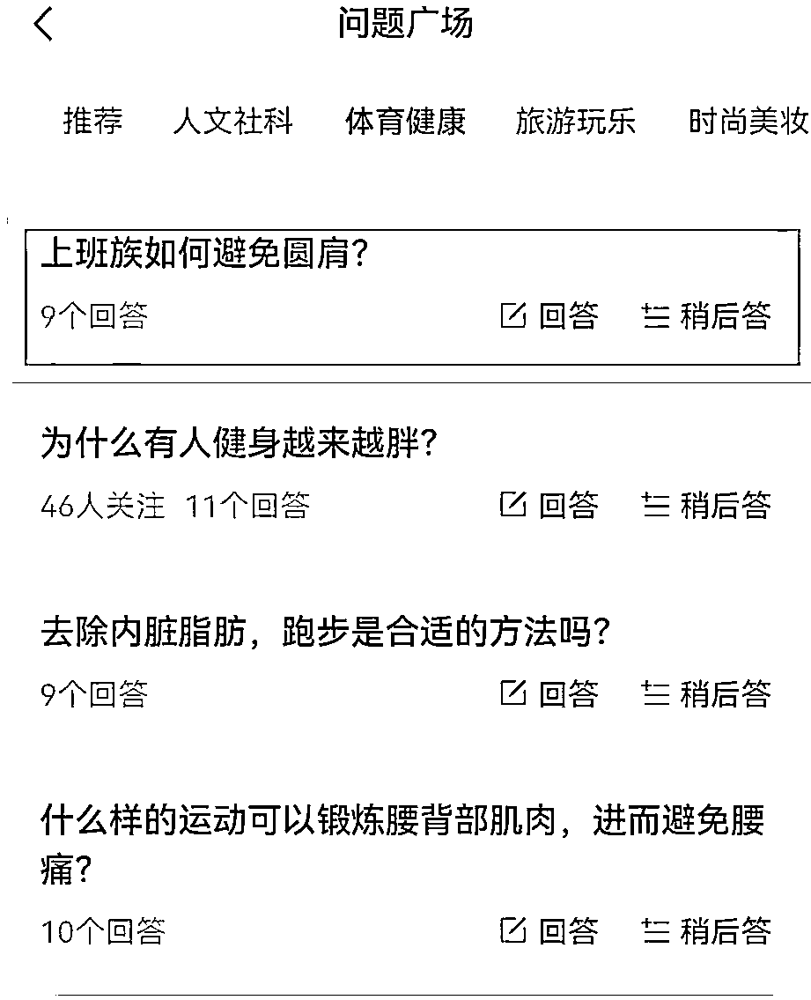

目前的关注人数并没有，但是却有9个回答，说明这个问题也是引起了一部分群体的共鸣，他们存在这种情况，也有在想这类型的回答。

上班族这个群体的力量不容忽视，他们有着较强的消费能力，但是也陷入生活中的一些日常压力，对于正在做副业号、自媒体平台运营、写作类的小伙伴，都是很好的回答方向。

这些潜力股的问题，也可以在问题广场搜索关键字进行查询，超过30以上的回答可以适当输出，没有必要把太多时间花在这上面，主要寻找类似以上回答量少、关注少、但可能是精准人群经常关注的点。

关键词可以是：上班族、副业、打工人、赚钱、职业病、劳逸结合等。

#### 2.专业度较高

像是此类问题，关注多而回答少，就可以对标知乎的玩法，需要输出过硬的知识、内容点，好处是可以随着关注人群的增加，得到裂变涨粉的机会。

而坏处则是需要大量的专业知识储备、搜索、整理，以及再换角度输出，还可能无法引起共鸣，所以一般这类问题，除非你有着过硬的能力，否则都不建议把时间耗在上边。

毕竟，现在问一问还处于一句话的回答都能收获几个粉丝的时候，应该要用最简单、最直接、最粗暴的方法进行回答：有捷径走，就不要自以为是地绕路。

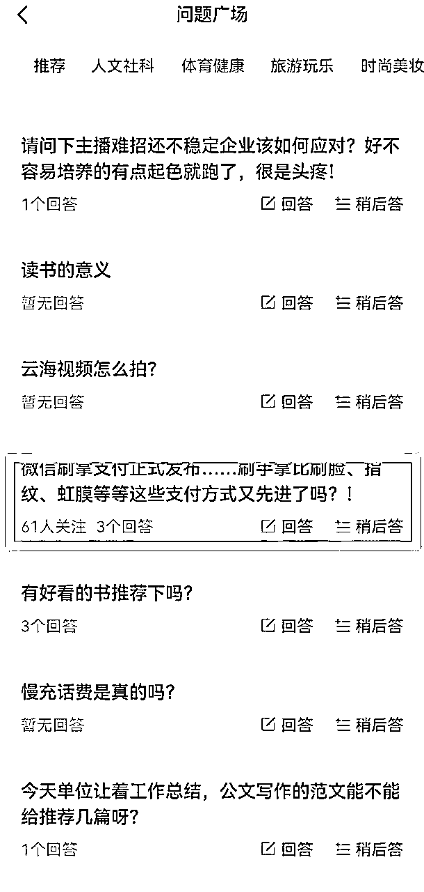

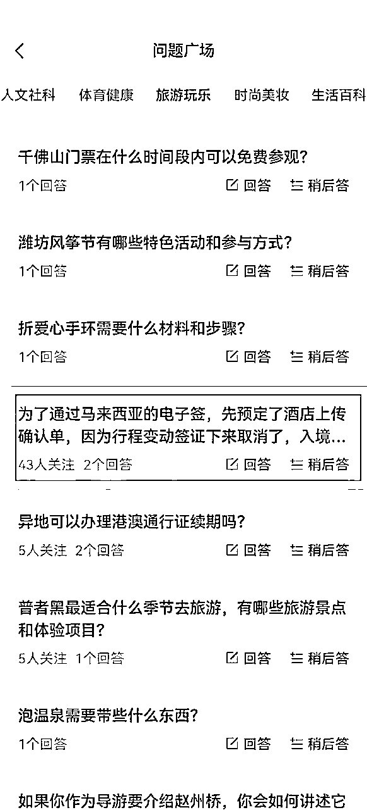

### ③回答时间。

这是我初期的一个失误点，在还没得到指点之前，我都是啥时候有时间就啥时候回答，导致大量的回答不予通过审核。

一般而言，现在仍然处于人工审核的基础下，正式上班时间是不利于我们回答问题的，比如早上8点开始，到晚上的6点，都有人工干预，稍微有些敏感，都无法通过审核。

所以建议回答时间为：

#### 1.午休和晚饭后。

（1）午休虽然有人工轮班审核，但是这个时间段阅读的人数也普遍较高，微微在测试了回答7个正常问题后（正经回答不引流），通过虽然不算快，但是普遍比起其他时间都要多赞。

如果前期需要提高权重、增加曝光量的话，我建议还是午休的时候，多回答几条与你领域相关的问题，且以2-3条热点问题作为辅助。

（2）晚饭后的时间，通过率是最高的，也是通过速度最快的，你可以适当按照以上的方式进行不明显的引流，基本上5条回答可以过3条。

视频号可以把钩子作为置顶，以相关领域内的有趣知识、小经验等作为回答中的插入视频，能够有效在这个阶段发挥较大作用，比起白天的做法有更大的曝光可能。

而且晚饭也是感性思维时刻，涨粉相对于白天的理性要更容易一些。

#### 2.注意引流点。

关于关注我、领资料、带你学等字眼、谐音词都不能出现，除了按照以上的术语以外，还有一个小妙招：

在你视频号内容的图二或者图三中，插入1个1-2秒关于你的微信或者公众号的表情包，以闪现的效果引起用户好奇，同时也不容易被拒绝通过。

其实还有一些引流方法也在尝试中，比如藏头诗、反问式回答、开头表示自己能力之类的，都可以通过，就是暂时而言转化率不高。

这方面，也许小伙伴们也可以交流分享一下呀。

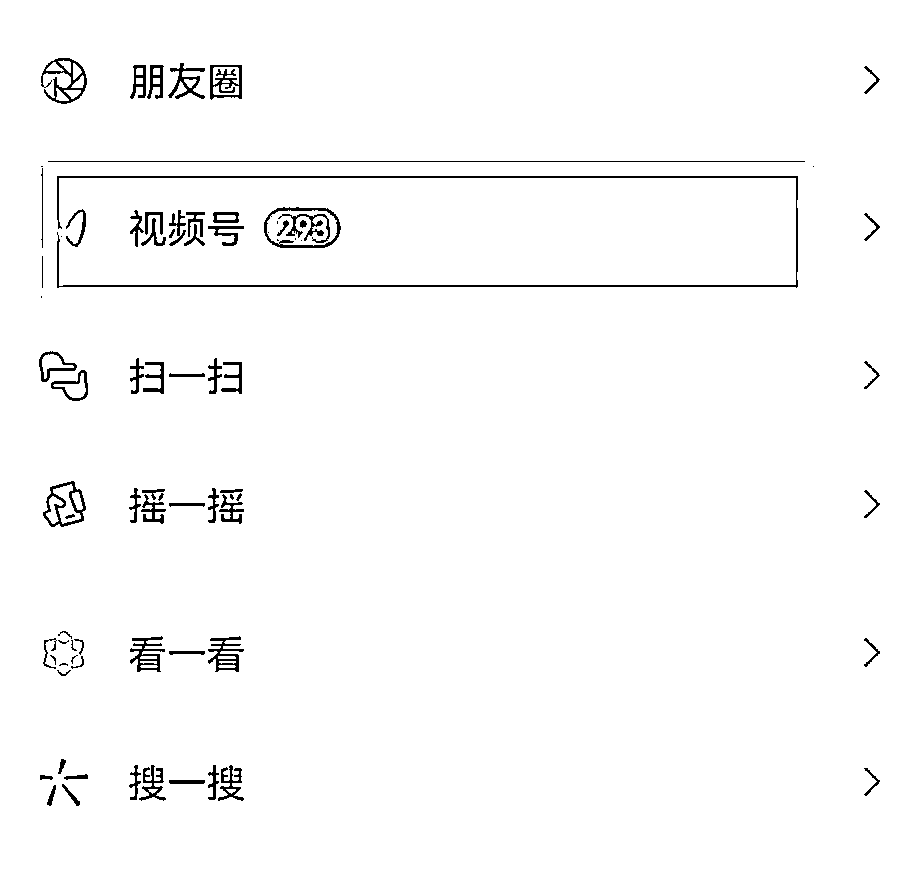

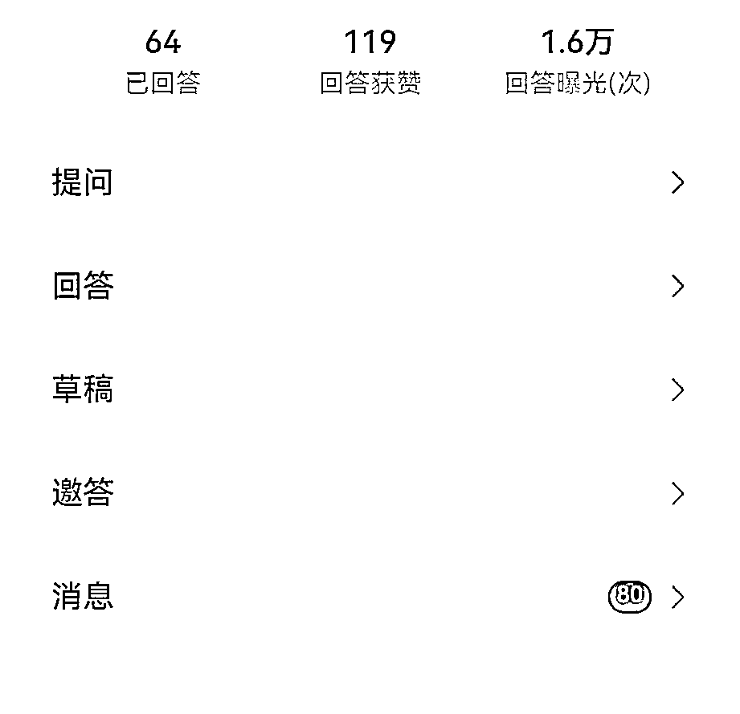

（以上是这两天新开的小号，曝光量非常迅速呢）

# 三、文末寄语

## 公布一个彩蛋：

面对突如其来的小爆发，微微也第一次体验到站在风口上的滋味。

小伙伴们可以及时参考，及时也做出这样的成绩，期待你们分享出更多转化粉丝、变现的方法，让大家一起学习、一起引爆“问一问”。

期待我们的相遇。ღ( ´･ᴗ･` )