# 微信读书引流15天赚回生财门票，私域增加近2000读书粉8个社群实践复盘

> 来源：[https://h7i1q54cm3.feishu.cn/docx/D2wudjBKGoGy4jxDUAFctpgKnTc](https://h7i1q54cm3.feishu.cn/docx/D2wudjBKGoGy4jxDUAFctpgKnTc)

各位生财圈友好！我是许帅，也是今年加入生财的新圈友，首先感慨一句，生财的风向标是宝藏，各位不要错过，下场实操肯定比纯看来的赚！

微信读书（以下简称微读）引流是我在生财的第一个实操小项目。前两天看到@高杰老哥发了个微读引流风向标中标了，恰好我在这一块有半个月左右的实操经验，所以今天这个帖子目的是：给想要实操微信读书引流精准读书粉的伙伴一些经验分享，包括如何低成本实操引流2000人搭建8个社群，遇到的问题、如何利用这个机会赚回生财门票？也纯当我的复盘贴，感谢阅读！以下是部分项目实战情况展示：

微读引流贴↓↓↓

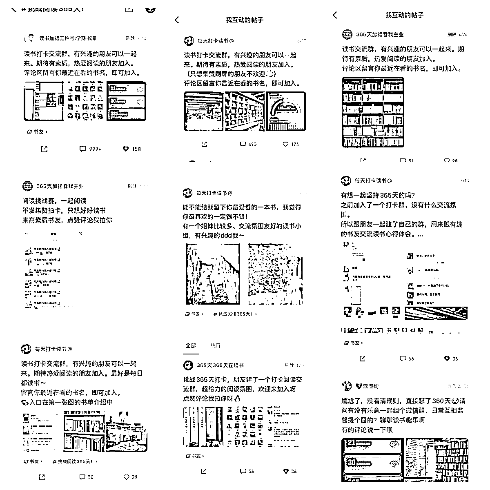

部分收益图↓↓↓

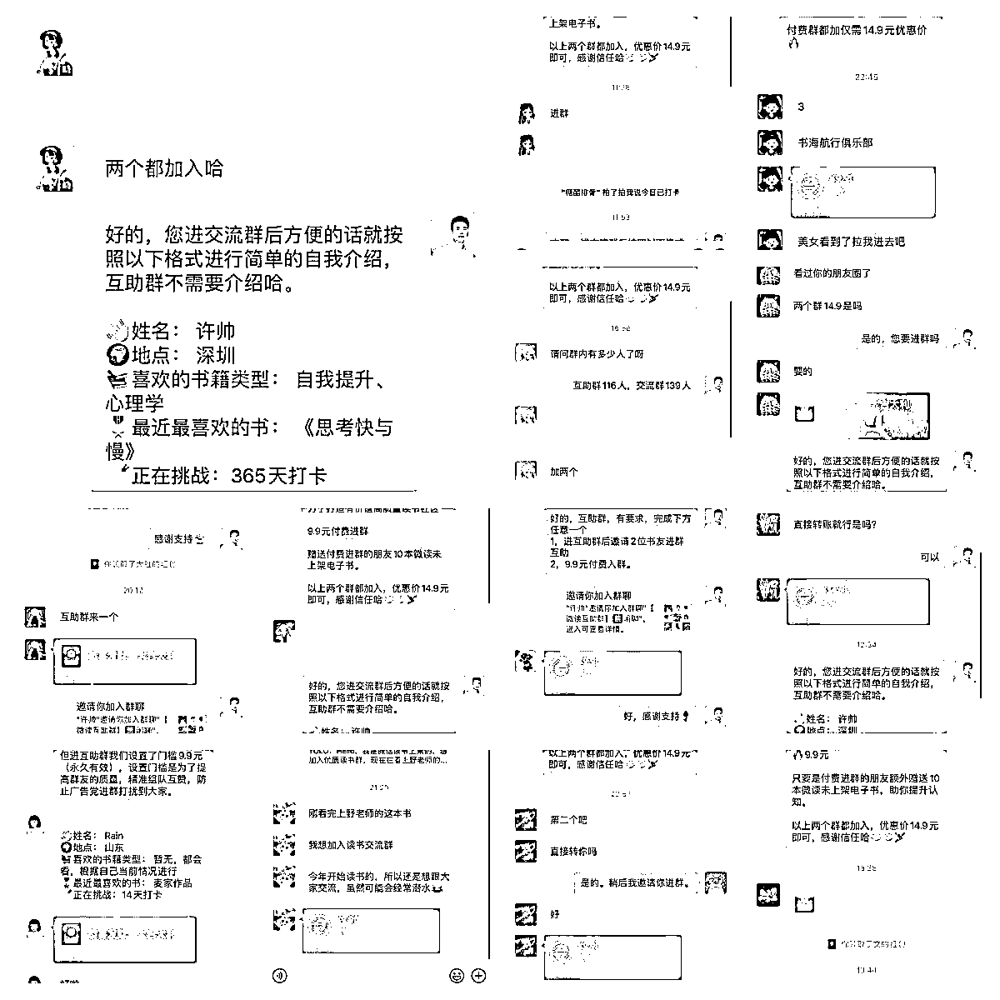

# 一、是怎么发现这个方向的？

大概在6月中上旬，我在刷风向标的时候，看到一条微信读书365天阅读挑战赛引流的帖子，帖子底下的评论基本都是要加入的意思；当时正在做书单号的我就灵光一闪，觉得这是一个精准读书粉的流量洼地，果断下场实操。

这里想说明一点，很多机会或者方向，其实是个人经验与当前信息的匹配形成的；因为如果我没有做书单号，不想着卖书给用户，就不会去想引流读书的人进私域，当然，目前也没实践成功。

就像亦仁老板前段时间关于英文育儿书单号精华帖说的，这是赚钱里面的「connect the dots」，如此循环，连的点越来越多，赚的钱越来越大。

# 二、如何在微读实操引流近2000人，通过付费群赚回生财门票？

## 如何在微读发贴引流，有什么注意事项？

### 找同行对标并发布引流帖

任何项目的开始，对标同行直接像素级模仿是最有效的。

我在看到风向标后，第一时间是进入到微信读书阅读挑战赛这个话题里，去寻找当前正在做这件事情的同行们。（图是今天的截的，方便各位想尝试的圈友操作：打开微信读书APP按下方操作即可）

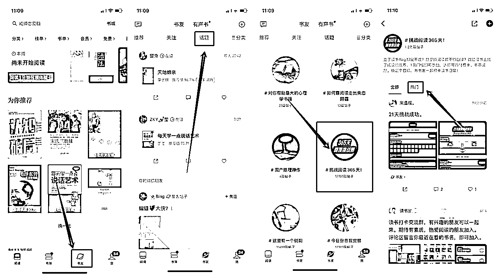

当我找到热门贴子时，直接就照着对方的文案+图片1比1复刻了一条帖子，花了2分钟时间，但没想到反馈来的特别快，没过一会就陆续有人在下面评论，然后也有意向加入的人出现。

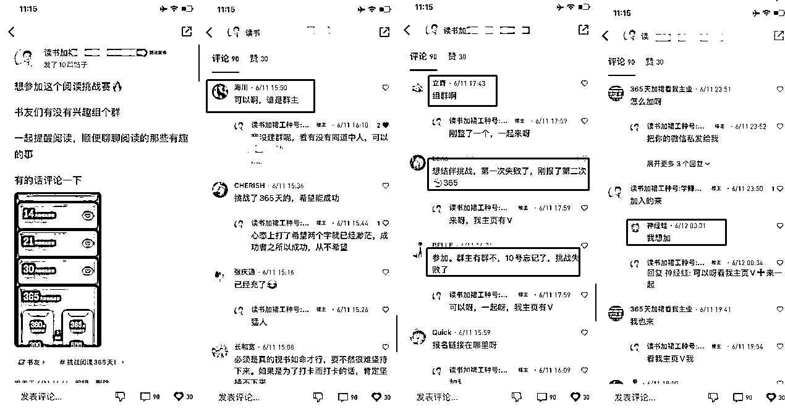

有了效果之后，我就找了圈友@鞭炮一起搞，我俩现实认识，也是相继加入生财的！我们开始思考怎么把这个流量快速沉淀进微信，刚开始只思考怎么搞足够多的人进来，想着有流量不愁变现，于是我们用的方式是直接在评论区留V+主页介绍留V，简单粗暴快速引流。(下面会细讲)

### 如何优化引流贴内容？

在做帖子评论互动导流的时候，我们也在观察其他同行的动作；但当时的同行实在过少，就两三个，我们也不认为原先的帖子内容是最好的引流文案，于是开始尝试优化帖子的内容和引流的流程。

①原先同行发帖方式：一段文案+一张挑战赛的页面截图

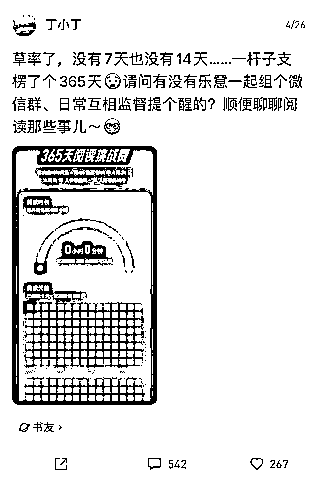

②第一次优化发方式：一段文案+挑战赛截图+实拍书籍图+微信群截图（群内容、群成员等）

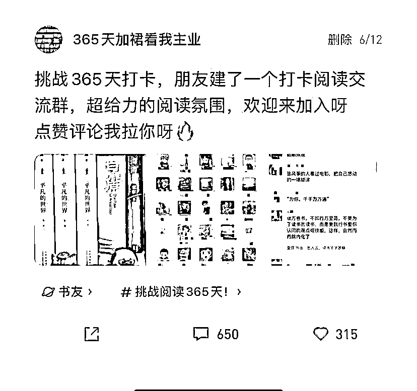

③第二次升级发帖方式：一段文案（引导用户评论书名、评论阅读时长）+书房书架图+微信群截图（群内容、群成员、群打卡等）

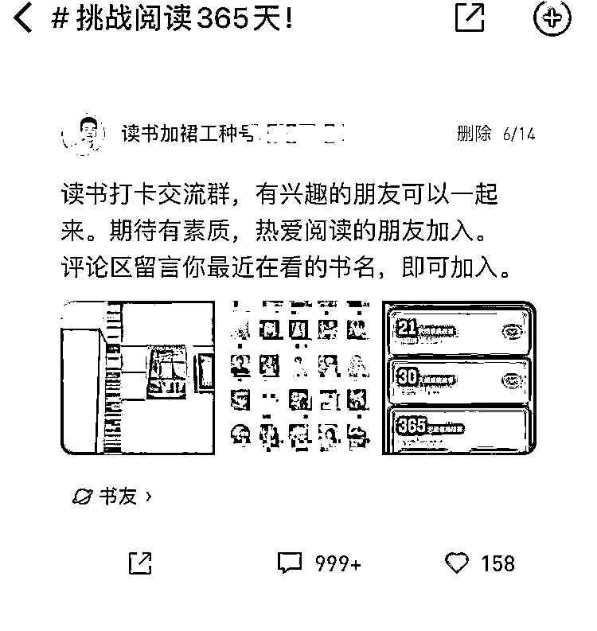

这个账号应该是微读365挑战圈子引流第一个达到999+评论的，在初期热门前10里面3条引流贴，我们占了2条，基本控住了大部分热门贴区域的读书粉导入；而在这个过程中，我们也发现微读的话题顶贴逻辑跟百度贴吧的相似，当然也是思考了社区类产品大概率是同个逻辑，通过测试点赞、转发、评论，发现依旧是评论的权重大！

于是我们就开始拿小号做评论数据，我这边直接启动了5个账号，3个发帖，其他2个流动评论顶帖，目的是将帖子长期卡在365阅读打卡话题这里的前5里，有很长一段时间，用户进入这个话题，手机第一屏就是看到我们的引流进群信息，因为前面5个帖子都是我们的，也就变相实现了帖子霸屏的逻辑。（下面是当时的一个录屏）

当然在这个操作过后，另外其他的同行也开始顶帖，于是，我们就在互相顶帖中去捞流量。也在这段实操过程中，让我们发现，发帖顶帖后有人来的高峰节点：是早上8-9点，中午12-13点，下午6点，晚上10-12点。只要在这几个时间节点，你能把帖子稳住霸屏，基本流量都会进到你的池子里（每天有100+）

## 如何将用户引流到微信？

在这一块，我们也经历了3次迭代，主要是微信读书本身机制问题以及微信添加过多异常问题（在微信承接这一块经验不足，下方是其中一个账号的社群信息以及引流标签与人数情况。

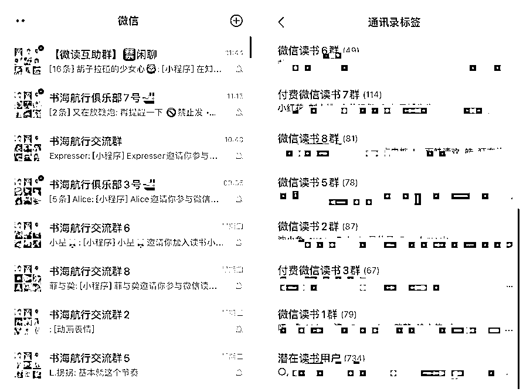

### 评论区，个人主页简介区留V

前期我们在评论这一块，基本是帖子下沉了就补一个评论话术，类似于申请加入、加入、怎么加入、求拉之类的将帖子顶到第一，这样的话术就会吸引到其他用户也跟着评论，形成从众的效应；一有目标用户评论，我们就引导评论区加V或引导看主页。

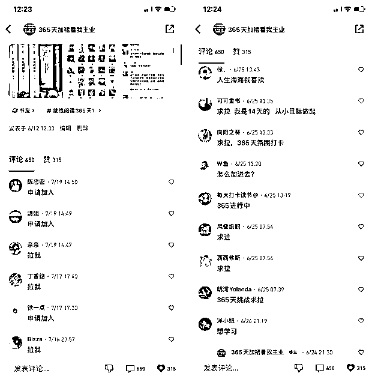

不过也在这个过程里，我们发现，同一个账号，多次重复评论同一段话会被吞掉，所以需要多调整话术，或者干脆利用谐音梗的方式发送话术。

这样的操作，让我们在前面5天，帮我们导入了500多人，建了5个群。本身想着是分散一下用户，避免万一有群问题产生炸群，同时，也可以运用群多的优势来做新的素材图做钩子，吸纳新的读书粉。而这些所花费的时间只是我们的碎片时间。

当然，这5天的我们还在为爱发电，并没有尝试赚钱。一方面是没有合适的产品去承接，另一方面是认为微信读书的运营方式导致白嫖粉太多难以实现，但可以判断微读引流确实是流量洼地（已经停止引流发帖顶帖近1个月，并在我写帖子的时候，仍然有人加过来进群）

### 引导私信微信、头像用二维码（个人的，未尝试用群，但认为可用）、名字改成加威信XXX

第二次迭代，我们将微读名字也改成加微信XXX之类的，希望让用户可以自行搜索添加，也有引导用户自己私信我们，然后我们来回复私信：我们尝试过发二维码，也尝试过直接发微信号；但发现发多了，私信也会被禁掉，加上用户私信的不是很多。所以还是回到第一种方式引流，但此时我们也加入了两个新方式：①名字植入微信号引流②头像直接改成个人微信二维码。（这一块我们没有截图留存，截图同行的给各位看下）

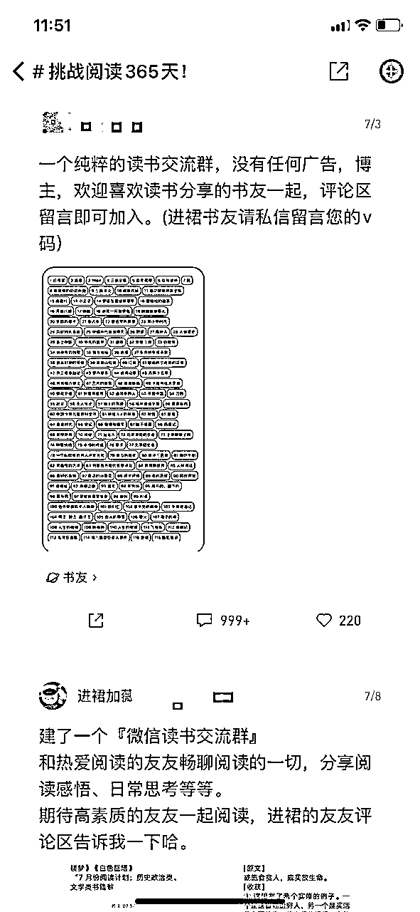

在这一阶段，我们其实已经开始做付费群的尝试了，后面会讲到付费的逻辑。

### 名字改为加裙看主页、加裙看工中号、建书单植入公众号

第三次的迭代，主要是微信被加异常了，评论区有用户一直在反馈微信加异常了，无法添加。于是我们就想到用一个公众号来承接，当即就创建了一个公众号，并在公众号做好自动回复引流、文章引流等的设置。这里采取的方式主要是上传几个不同微信的二维码，分不同微信导流来获取用户，比较粗糙，但够用了！

接着，我们就把所有的账号全部指向公众号，评论、名字、简介、甚至一些号的头像，全部都换成公众号名称/二维码。同时，制造出一份书单植入公众号引流，书单内容来自：我们通过原先聚集的书友自我介绍得来的推荐书籍。

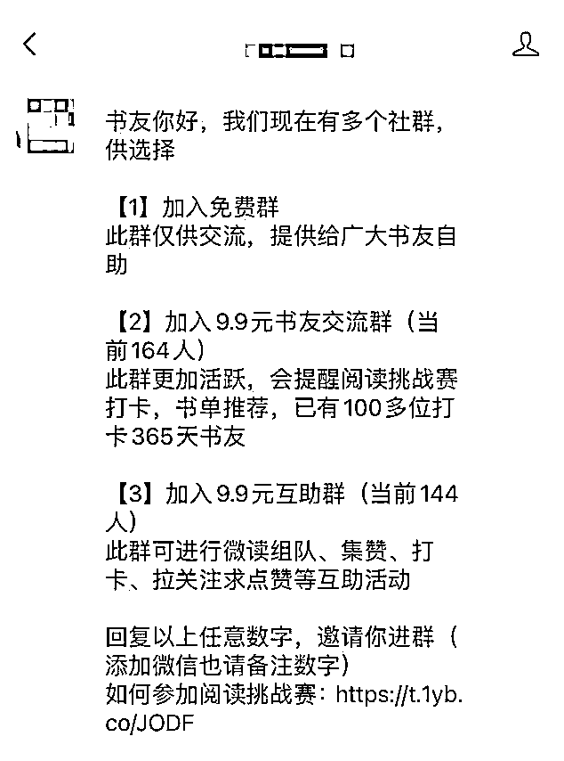

在这一过程里，我们各个微信也开了自动通过，基本用户加过来，要么自动选择免费要么付费打钱，效率比之前高。

## 如何转化书友进付费读书群？

在付费这里，我们半个月走的也十分曲折，遇到过被用户直接骂，炸群，遇到过在话题里被截图吐槽，也遇到过在同行群被同行晒图挂人头。但我们依旧认为付费是最好的筛选，付费是有价值的，付费才能带来群活跃！直至目前，我们8个社群，还在活跃的始终是付费群，即使只是9.9元的低单价，活跃度也相比其他社群更高，与其他同行群做对比，也有很大的优势（我们当然要到处进群学习的嘛！）

免费群里面则充斥大量转发抽体验卡邀请刷屏，难以形成交流。问题就出在没有筛选。

进群要筛选，必须要有付费或者推荐或者申请，没有筛选的群没有价值。——《亦仁益语》

在上面引流的模块，我说到前5天我们是为爱发电，基本来的人就拉进群，当我们积累了500人之后，过程里我也一直在思考，这样一直拉人，没有收益的状态，我们能持续多久，即使我们也爱读书，但为爱发电终究不持久。于是，我跟圈友@鞭炮沟通了，一定要尝试做付费转化，不测试怎么走出一条路子来。

我们付费社群产品定为9.9元的交流群+9.9元的互助群，前期大概50-80人，享受了两个群直入优惠价14.9元。

第一阶段：强烈的需求，但抗拒付费

通过观察，我们发现用户在微读这个生态里，对于打卡领免费阅读卡、集赞、翻书领书等活动十分热情，但前期我们为了保证不让群沦为一个集赞纯打卡群，我们提前设定了群规矩是只读书交流，禁止微读的其他各类活动在群里刷屏，一般刷屏就是下面这样，很影响人的观感！（之前的互助录屏）

在发现用户对这些活动有极高的热情后，我们开始在各个群里测试，建立一个微读活动互助群，进群有设置门槛要求：付费9.9元。

刚开始推送群信息的时候，确定有一大部分人都来私信我们，但大都听到付费，就偃旗息鼓了！这时也有人开始吐槽，然后这会也有同行在群里冒出来，发我们私聊的截图在群里，部分同行还在群里丢二维码引流到他的群，于是直接炸群。（但早期分散多个群，风险分散在此时起了作用）

群里很多不明真相的用户，也纷纷退群，测试群150人左右，退了20多人。但与此同时，也有人选择付费想进入！这就说明，还是有人愿意为此付费，只不过基数多少而已。

起步阶段，验证「真的有人愿意买」大于一切。——节选《亦仁益语》

第二阶段：优化付费链路，提供多个加入方法

经过第一次的测试，有少部分人付费，也有人吐槽，大部份人是默不作声中立状态！在这一块我们的思考是：或许我们太过着急了，而且没有建立好信任就要求付费；也或许是这批用户属性本身就不对。

但我们也没有放弃，炸群后两天我们继续重启这个付费的操作，但我们重新做了调整，优化付费的逻辑

（1）微读互助群加入的话提供两个选项进群

①加入后邀请2人进群即可免费入群

②直接支付9.9元加入互助群

这个相对柔和的方式帮我们积累了前面30位左右的书友进互助群，有付费也有免费。

（2）新加入的书友，我们也开始尝试交流群也收费9.9元，但设计与互助群形成呼应对照

一个功能是读书交流、一个功能是微读活动互助，两个群可以互相导流，最理想状态两个都进，但实际上不可能这么理想。

读书交流群：交流读书心得、书籍推荐、阅读挑战赛打卡。

微读互助群：互相帮忙点赞领书、组队抽免费体验卡、互关等等。

我们的推送信息：

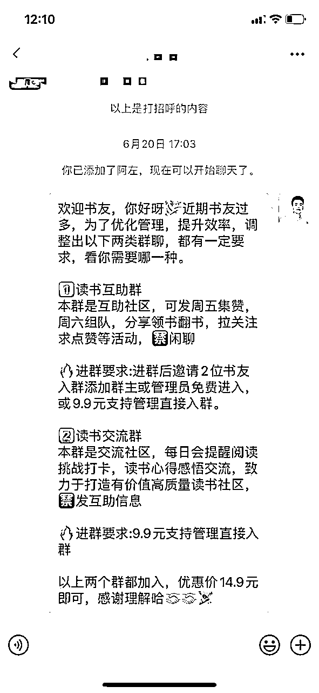

在这一阶段，我们测试的数据：好的时候一天转化率在20左右，差的时候就几个点，平均在10%。

期间我们也遇到比较多的问题，你会发现，愿意付费的从不废话，类型就是直接打钱；而往往是不愿意付费的人话特别多，有辱骂你的，有直接拉黑的，有站在道德高地评论的，有去话题发帖骂你的.....

所以在这里需要有一个好的心态。当时我和@鞭炮也是抱着尝试的心态在做这件事情，只要用户一有废话，除非是问付费问题的，其他问题我们一概不回复，因为用户很难转化，而且成本太高，毕竟是9.9元的测试群。这个操作帮我们提高效率，筛选了一批有效的付费用户。

第三阶段：从只付费到免费+付费

在我们第二阶段进行一段时间后，两个群都有一定基础用户了，我们开始尝试只推付费信息给用户，其他不付费的用户，我们不理会。目的是希望把时间都花在付费用户身上，再去挖掘更多价值。

我们将微读来的用户，全部推送付费信息，比较粗暴，不付费就不拉群也不提供服务，减少我们的时间消耗。刚好在这段时间，我们遇到一些刺头，直接将我们的私聊截图放在微读365挑战话题圈里，然后引爆了一波人的共鸣，在评论区对我们各种抨击（/(ㄒoㄒ)/~~），这个帖子也一度霸屏，所以积累很多民怨的感觉。

评论区人生百态：一部分曾经加过我们，没有被拉进群的，纷纷述说遭遇；一部分不明真相的吃瓜群众，有站在道德高地谴责，有分析这个模式的；还有一部分是我们的同行，纷纷在帖子里反向引流，宣传口径十分统一：我们这里免费，我们这里没有套路。于是大批免费流量估计就过去了。

刚开始，我们认为这个帖子没什么风浪，也反向帮我们筛选也挺好，同时，我们也尝试用多个小号做常规贴的顶贴动作，休息了两天，不停顶常规贴上去，但最终还是没能解决这个问题，索性随它去，反正不付费我们也不想要。但过了两天，我们还是觉得，为了避免出现这类客诉，而且免费流量未来可能能有点作用，于是又调整了话术，回归到免费+付费的逻辑。在这一阶段我们也开始了公众号导流。之前导流有200多人关注。后面没管人数也有下降。

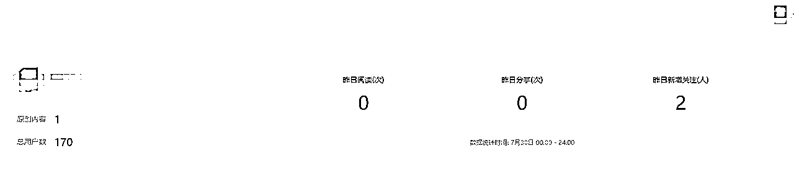

以下为公众号的承接话术（关注回复）

书友你好，我们现在有多个社群，供选择

【1】加入免费群

此群仅供交流，提供给广大书友自助

【2】加入9.9元书友交流群（当前160人）

此群更加活跃，会提醒阅读挑战赛打卡，书单推荐，已有100多位打卡365天书友

【3】加入9.9元互助群（当前146人）

此群可进行微读组队、集赞、打卡、拉关注求点赞等互助活动

请回复以上任意数字，即可进入对应社群。

用户回复完对应数字，我们会随机弹微信二维码导流加入，当然也有用户直接看文章扫码进入的。

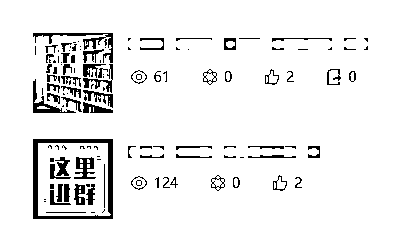

最终，我们的新方式就是用心服务付费用户即可，其他群就是一个免费用户承接群，为了不再出现这类似的客诉，也为了我们引流的便利。在这样的情况下，依旧能筛选出付费的用户，转化率也是接近10%。

以上是整个过程引流实操，微读确实是流量洼地，引流不成问题，但付费数据还较少，不过也赚回了门票钱，长期持续的话，赚多几倍也没有问题；

如果本身有打卡营、共读营产品的圈友，或许可以做下尝试，用打卡押金完成返全部的模式去玩，按照20%打卡完不成的情况也能拉动一波营收，前提是打卡营确实提供了相应的价值。

在这期间我们也测试过电子书代找服务，有用户需求，也成交过，但数据较少就不做延展了。总而言之，能持续玩，新手小赚一笔没问题。

## 付费读书群的群运营

一开始，我们通过ChatGPT，快速优化出了自我介绍模板，一方面希望能够让新来的书友感觉到正式，另一方面也希望书友通过自我介绍快速融入社群，并引发其他群友的互动，形成一个闭环的群活跃。

方式是：地点+喜欢的一本书+读书挑战，大家天然对别人有好奇心，且很容易碰上同城、同频书友，直接展开聊天，减轻运营成本。

PS 现在大多同行也都用这个自我介绍模板。

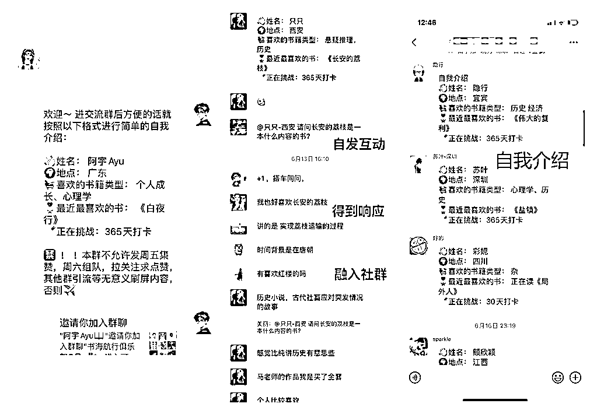

保持新鲜血液的注入，稳定频率拉人进群，不要全部同一时间进群，新人进群也是引起话题的一种方式。——节选《亦仁益语》

在刚开始的社群服务里，所有群我们都提供了打卡提醒服务，每日的打卡互动都很高频。

后面，为了区分出群价值，我们只在付费社群里做提醒，也通过这样的方式，从原先的免费群吸纳了部分的付费用户。关于社群运营，我们也做的一般，而且后续都各自有事情在做，所以就暂停进行引流了。

以上就是部分社群运营的内容，在这一块我们也没有摸索出比较好的模式。

# 三、项目总结

任何一个项目都不是单点作战，而是由一个点到另一个点，由一个小拼图逐渐到大拼图，最终形成一整张图的过程。微读引流项目虽小，五脏俱全；通过对风向标的挖掘，寻找到感兴趣的测试机会，然后直接埋头开干，主打一个遇到问题解决问题的莽劲往前冲，其实这样更能够锻炼一个人，特别是新进生财比较迷茫的圈友。

在我看来，亦仁说的赚到第一块钱的重要性不言而喻，而大多数人只看到这只能赚到一块钱，并没有看到这一块钱背后不管是能力、认知、经验、技能等各个方面的升级迭代。这不是一块钱，而是一条你拥有自我赚钱能力的道路。

举个例子：很多人都知道，我要引流，就得去我要的这批流量所在的聚集地，输出内容、钩子、有价值的信息等等，但如果没有真正做过，其实就不算知道。这只是自我感觉上的知道；而在这个微信读书引流的小项目上，它也一样需要具备较多的能力：

1、微信读书引流测试

2、内容输出优化话术

3、用户需求洞察

4、社群运营

5、应急响应

6、用户转化链路设计

7、快速迭代

......

而这些东西，不是光看着项目实战、精华帖、风向标中标就能出来的，这个必须去碰壁去撞击，找到自己的脆弱点，然后要么链接有能力的圈友解决，要么自行更新提升能力。

我想这也是生财有术开启生财航海实战的部分原因，不实践就很难让大多数人成长，而这些实操，本身就是很反人性的事情，也大概率就是愿意坚持的人才能出结果。毕竟谁不想躺着就赚钱，但管道收益也得你辛辛苦苦去搭建管道吧！我相信圈里能赚到大钱，没有一个会说刚开始赚钱是很容易的事情（如果有，是我认知还不够o(╥﹏╥)o，大佬勿锤）

最后送大家一句话：来生财就要开干，不开干怎么能赚？干就完了。

感谢阅读！