# 我是如何从一个AI绘画小白，做到一个多月涨粉8万（生财）

> 来源：[https://hq5823whbx.feishu.cn/docx/DssTdv0p9onKdLxfD2PcL0A6n5a](https://hq5823whbx.feishu.cn/docx/DssTdv0p9onKdLxfD2PcL0A6n5a)

生财有术

## 一，基本概况

今年年初3月31号晚上，我在我的小红书账号上发布了第一条笔记AI绘画，并持续发布

在第四天4月3号，清明节假期间，一天爆了1W粉丝，

后来五一放假期间，账号又小爆了一次，当月粉丝直接飙到5W，

五一小长假过完，账号涨粉近6万粉丝，

5月下旬，粉丝已破8W，

这期间用了不到两个月时间

在这期间，我连续开了两个学习班，一个AI绘画的学习班，一个新媒体账号运营班，

两个班带了一百多名学员，再加一些私人定制，和商业订单，目前收入8W+

我们学习班学员的满意率非常高，一些认真学习的学员都做出了优秀的成绩，

其中，一个月做到万粉以上的有4位学员，一个月涨粉破千的有近30名学员，

并且很多学员都接到了订单，在互联网上拿到了自己的第一份收入。。。

目前还有一家影视公司在合作筹备中，一家出版社待合作，一个博物馆待合作。。。

这个收获对于高手大佬来说，不值一提，但对于我一个在年前对AI绘画还不了解的小白来说，已经很不错了

下面具体说说我是如何做到这些的。

## 二，我是如何从AI小白做到两个月内8W粉丝

先说一下个人资质

### 1，个人资历

#### ①，其实我的本职工作是新媒体运营，之前主要是在公司做抖音代运营，亲自操作过近百个账号，总计辅导过超5千人做新媒体账号。

其中有一家客户全国有2000家店，当时2000家店的店员全部跟我学习账号运营，

并且我亲自服务过近100家客户从0-1-10做抖音账号，全网做过的账号粉丝数量总计超500W

#### ②，2018年底接触抖音，无论做视频还是做直播，每个职位都亲自实践过，

从0开始 策划账号，账号定位，拆解对标账号，写文案，写脚本，指导拍摄，剪辑，内容发布，内容运营，投流，SEO, 私域，公域，都实操了多遍。

#### ③，个人在2019年做的服装穿搭账号，账号3个月做到20万粉丝。

#### ④，2021年，从0起号10个月内为一家美食账号做到50W+粉丝，包含直播，月均营业额50W+

#### ⑤，2022年疫情期间，上海封控在家不能外出时，为一个心理咨询师做个人IP账号，两个月通过一个抖音账号拉定单240W元营业额，

#### ⑥，2022年年初到疫情期间，辅导一位律师做账号，之前他做了半年粉丝才1.8W, 经我辅导3个月左右，粉丝近8W，疫情结束，订单直接爆了，两个月收入超40W，

#### ⑦，2023年年初，我开始学习AI绘画并第一次操作运营小红书账号，

从大年初一开始做账号，一个月粉丝做到4K+，AI绘画头像定制，那时AI绘画的人还不多，找我做头像的人也非常多，客单价不高，赚个辛苦费。

#### ⑧，2023年4月新开一个小红书绘画账号：治愈系漫画，从0做到8W+粉丝，营收8W+

#### ⑨，2023年8月在一个新的平台试水，12天粉丝破万，14天粉丝1.5W, 准备做矩阵号。

### 2，做账号心得

#### ①，其实这几年下来，心得也挺多，之前一直在公司团队合作，后来发现团队的效率比我一个人高不了多少，

感觉前几年荒废了很多时间，现在自己做，时间更自由，效率也更高。

#### ②，具体说下我在小红书账号上是如何在不到两个月做到8W粉丝，并且目前营收8W+

## 其实主要还是两方面的原因：《一》，内容优质，差异化 ，《 二》，专业的账号运营

## 《一》内容优质，有差异化，能提供情绪价值，

### ①，我做的虽然是AI绘画，但我回避了很多同质化严重的AI绘画，独辟蹊径做了治愈系漫画，

当时这种风格类似于宫崎骏动漫，但又比宫崎骏动漫画风更甜美，细腻，精致，减弱了日本风格，增加了中国风，我画的人物统一都是大眼睛。而且以儿童为主题，很萌很可爱，很多人喜欢。

### ②，所以当时我账号爆了以后，

### 非常多的评论是：这图比小学语文课本上的图好看多了，建议出版社用这样的图给孩子们学习。

### 给大家看些图：

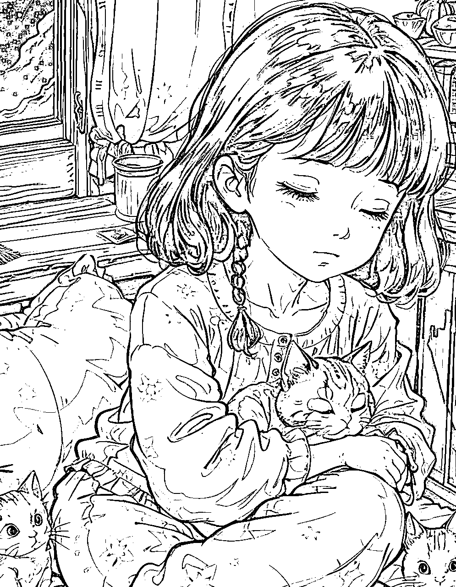

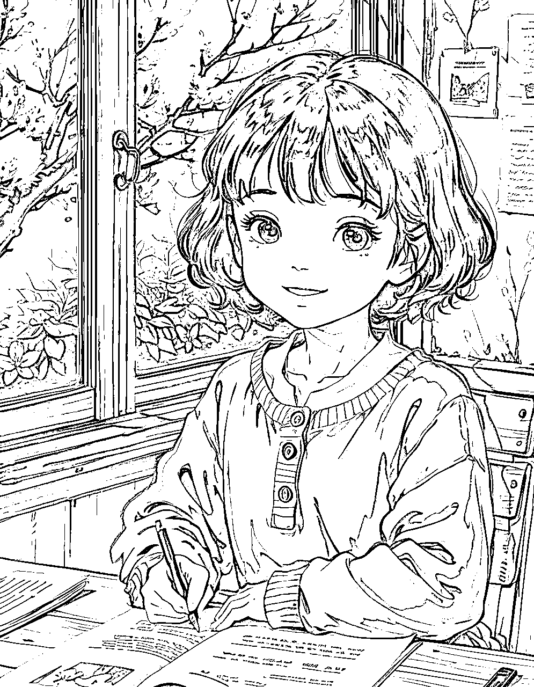

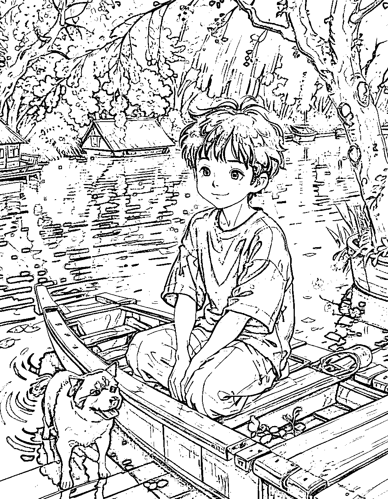

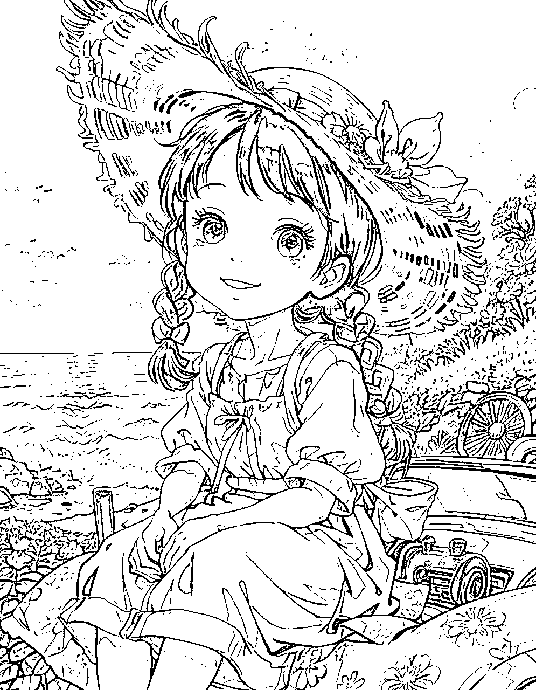

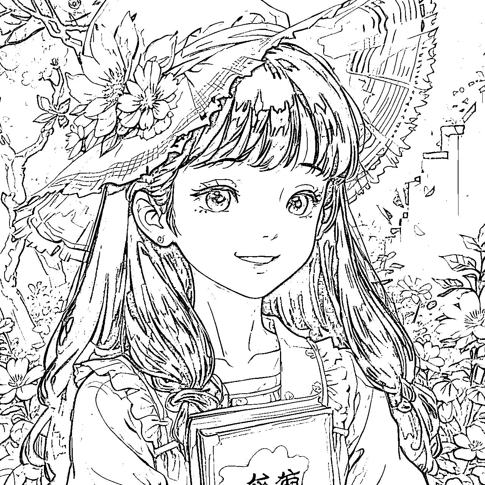

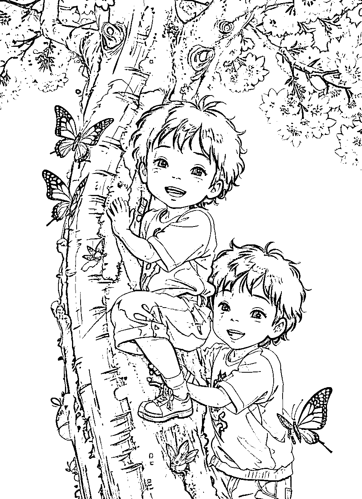

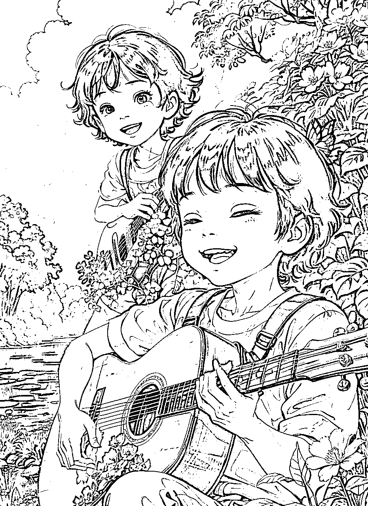

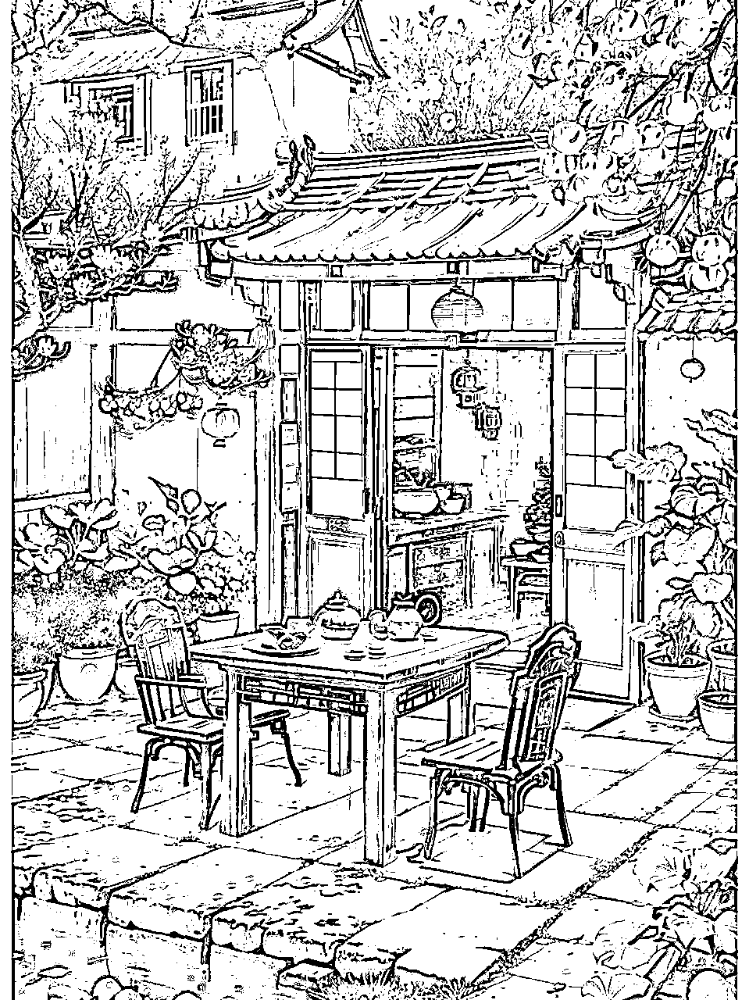

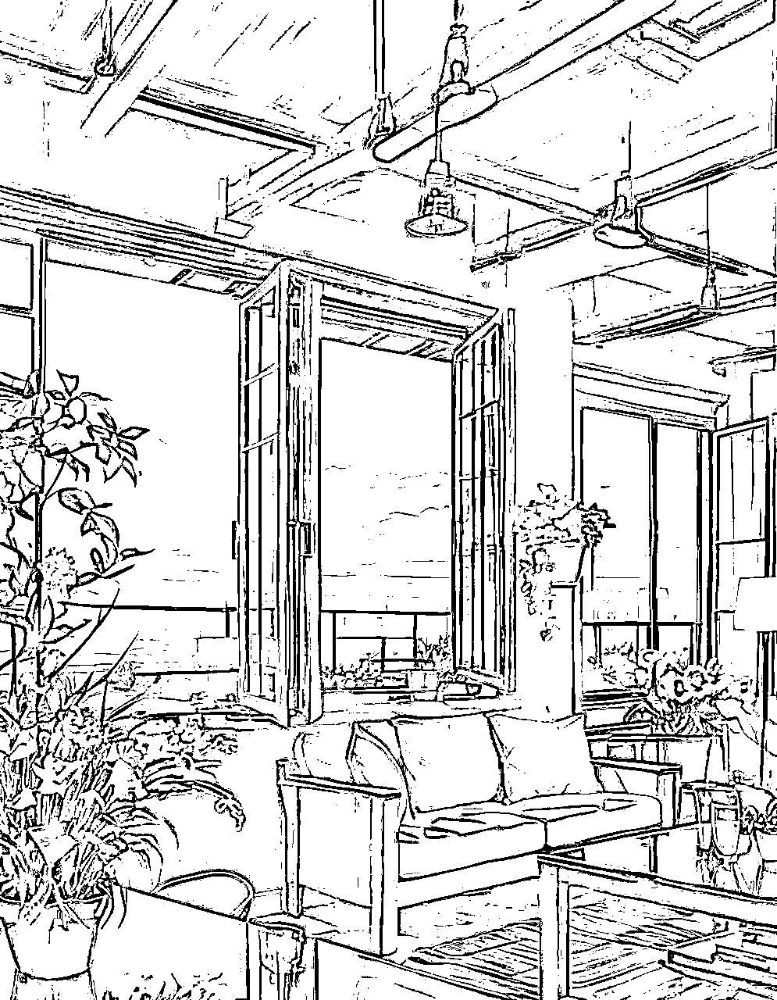

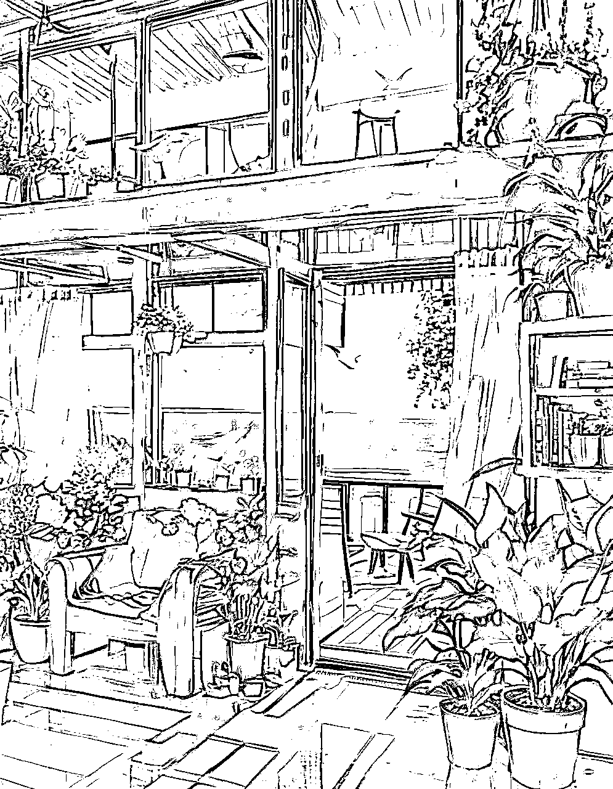

#### ③，当时我的笔记数据，各项都是99.99%，超越了99.99%的人，

数据优秀，一度霸屏，小红书发现页全是我的图，每天进我账号进群的人特别多。

其中一组图，爆了60W的播放，点赞3.8W，涨粉近4W,

其实有些图很不精致，比如AI常见的手脚出问题，但是粉丝的包容心很强，小瑕疵基本忽略，

感觉到了，怎么看都喜欢。

#### ④，当时有大量的粉丝找我定制头像，还有几家出版社来找我出绘本，一些商家也要谈合作，

当时的评论和私信根本上看不完，每天从早上6点忙到半夜12点，还是看不完信息，每天眼睛都特别痛！

#### ⑤，为什么会这么火爆？

因为这些图都是我首创原创，并且是几个模型混合在一起出来的图，以前大家很少见到这样的图，这是一种全新的风格，摈弃了大量日本的元素，画出了更偏向中国人喜爱的风格。

#### ⑥，自从账号爆了之后，出现大量的模仿者

每天有上千人来观看我的账号，后来很多人连账号名字都跟我的一样，无语！

#### ⑦，首先我的图都是发自内心的想法，完全原创，而且这些图能提供情绪价值，

很多人看了会想到自己小时候，或者想到了自己的孩子。代入感很强，大量的人拿我的图片做头像壁纸，并找我定制。

#### ⑧，一家蛋糕房的小姐姐，找我定制灯箱图放在新开的蛋糕房，

我花了3天给她出了一组图稿，她看到图稿后惊呆了，特别喜欢，后来她把做好的灯箱拍照给我看，整体2.4米高的灯箱，图特别清晰，

#### 她说，很多人进店后都被灯箱吸引了，都去看灯箱了。

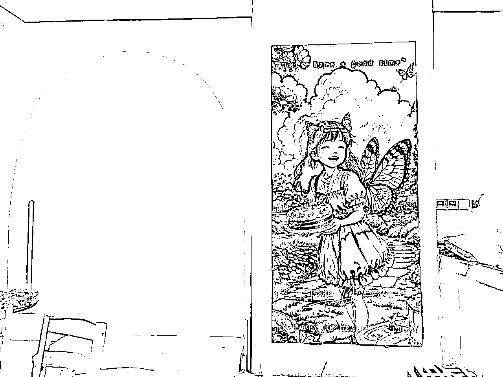

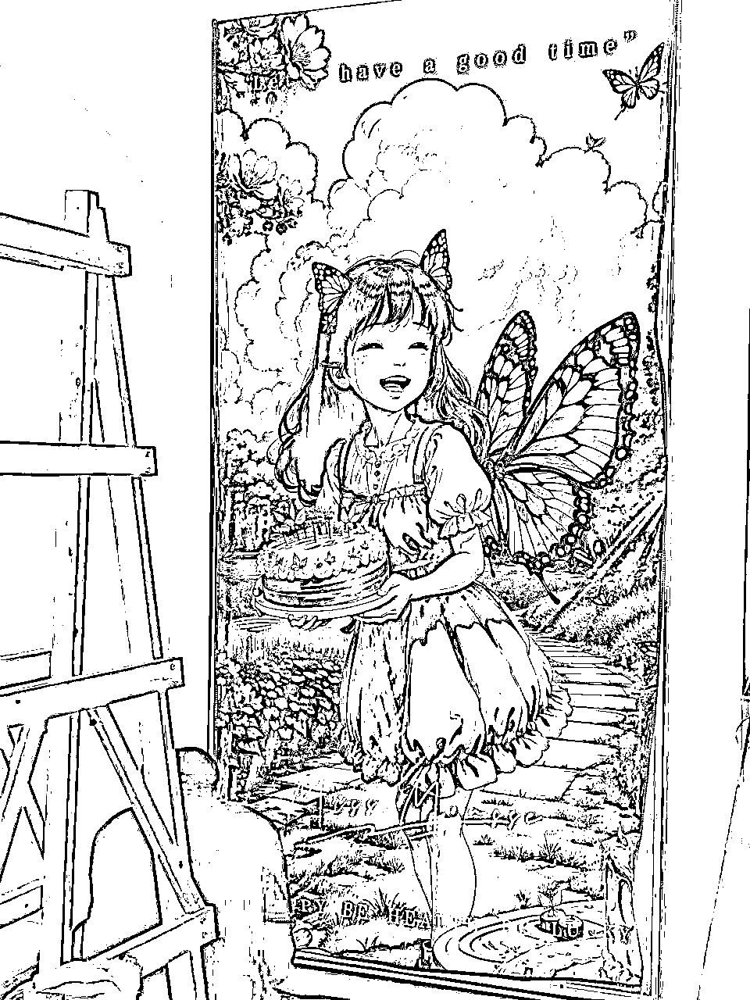

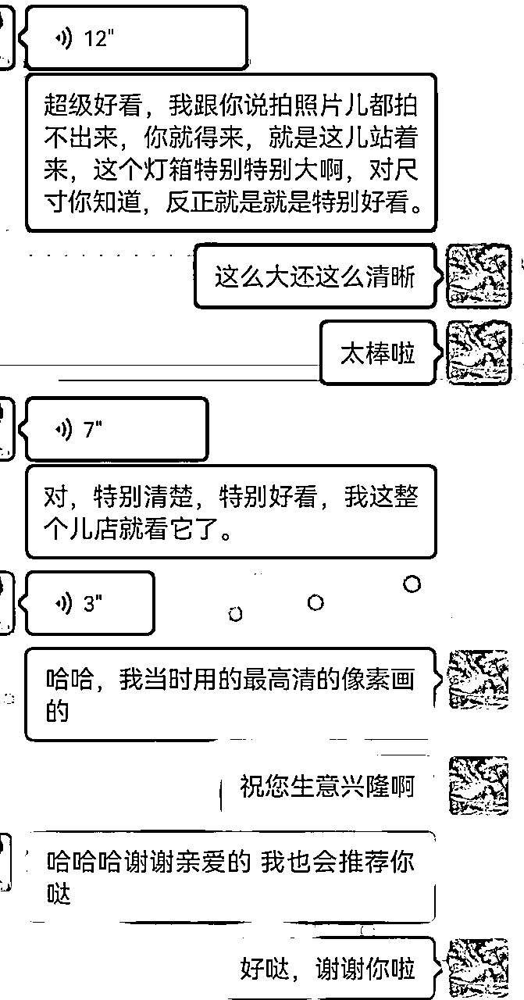

#### ⑧，还有很多人盗我图到抖音快手上做直播赚钱，另外像醒图，剪映的模板也大量用的我的图，

当时我找这些人谈，要么下架，要么举报，双方也都谈妥，

但后来发现还是有很多人盗图，看来这个漏洞难以补上，既然大家喜欢那就放开吧，

但如果太过分，我会考虑起诉！

### 《二》很多人问我，为什么你的图这么多人喜欢？

其实原因也不复杂，

#### ①，首先我从小就是学画画的，

我是东华大学服装设计本科毕业，985院校，从小对审美还是有些见解，

#### ②，其次，我采用了一种全新的工具：AI来画图，并且融合了几种风格，

#### 创新出了一种更偏向国人喜欢的风格。算是踩在了风口。

##### 这件事要非常感谢生财有术，我是在咱们生财的圈子里了解到AI绘画，跟着航海一起深入学习，并深深迷上了，

刚开始学AI绘画时，真的是废寝忘食，除了睡觉，其他时间都是在画图，就连吃饭也是边吃边画，

然后我每天刷小红书，看到谁画的好看，我就去找他/她拜师，

我当时就是这样学过来的，最多的时候，我一天可以练习1000多张图，当时最受苦的是眼睛，每天眼睛特别痛。

#### ③，第三，重点是提供了一种情绪价值，很多人看完我的画，评论说：本来心情不好，现在看完后竟然心情变好了。这些画很治愈！

上面这些都属于账号定位，优秀的定位决定了一个账号成功的前提，一个账号想要成功，最重要的还是要有优质的内容来填充。

那么如何做出优质的内容呢？重要的是要做到以下几点

### 《三》如何做出优质的内容

#### 1，先了解平台规则，了解竞争对手。

如同打游戏一样，你要先熟悉游戏规则，才有打赢的可能！不懂游戏规则，你上去瞎打，那不是找死吗？

很多人账号做不起来，这是最关键的一点。

做账号前，如果你对平台不了解，对竞争对手不了解，上来直接发布内容，基本上都做不起来，偶尔碰运气，爆了一条，后面也会凭实力沉下去。除非你停下来去了解游戏规则，去了解竞争对手的情况。

具体如何操作呢？

①，先去找平台的官方账号，任何平台都有很多官方账号，先关注，再把官方的每篇笔记都熟读一下，了解方针政策，了解各项规则

②，在平台搜索和你内容相关的关键词，会搜出很多优质的作品，然后你去研究别人作品优质的原因，大家为什么会喜欢这样的作品，找到爆的原因。为己所用。

同时看他的图画的是什么，标题怎么写的，文案怎么写的。有哪些可取之处，然后一一记下来，

每天多刷别人优秀的作品，沉淀自己，找出自己的不足，然后弥补。

③，了解平台经常推出的热点及活动

跟着热点，爆的几率就比较大。

#### 2，账号定位：

做账号前，一定别忘记先给自己的账号做定位，做定位就是定方向，定框架，不要让自己跑偏。

1，先给自己的账号做清晰的定位

人设定位：你想给自己设定的身份，比如专家老师，绘画达人，

内容定位：你要画什么样的风格

商业定位：你通过哪些方式变现

用户定位：你希望你的用户是哪些人，你能满足他们哪些需求

以上几点都清晰以后，你才开始针对性的创作内容，

#### 3，开始做内容

##### ①，小红书的图文类内容主要包含三个方面：图稿，标题，文案，另外还有回复评论，和粉丝互动

图稿和标题的重要性占比70%，文案占比25%，回复评论和粉丝互动占比5%

任何平台，跟粉丝的互动都很重要，只有充分互动，你才能了解粉丝的需求，做出她们更喜爱的作品，同时，你知道粉丝的需求，才能卖掉你的产品。

##### ②，画图

如何画出粉丝喜欢的图，多学，多画，多思考，刻意练习。

我在画图时拜了好几位老师，每次刷小红书，我看到谁的图画的漂亮，我就去请教，拜师。

然后一边练习画图，一边拜师精进自己。

AI绘画是一个全新的绘画技能，颠覆了传统的绘画方法。我从0开始学习AI画图，学习关键词的写法，了解各种风格画法，一张图一张图的刻意练习，

刚开始我用的MJ 画图，我同时开了十多个分区，这样出图很快，看到有问题的直接做调整，改关键词。后来接触到国内的AI绘画软件，也非常好用，之后我就国内国外软件同时用，不同的风格用不同的软件，

当时我把付费请的几位老师的微信都打开，有问题及时问老师，这样就相当于同时几个老师在教我，进步特别快。

我是在年后初六左右做了第一个小红书AI绘画账号，一个月做了4千多粉丝，粉丝不多，但每天都有订单，对于粉丝的订单我都是很认真对待，有时为了一张图，我可以画五六十张图，一遍一遍调整，直到最后满意为止。

这个对我以后画出优质图奠定了基础，只有大量的练习，把坑都踩一遍，最后才能画出特别满意的图，所以我经常收到的评论就是：这一组图都好好看啊，

看一下当时我画的图，

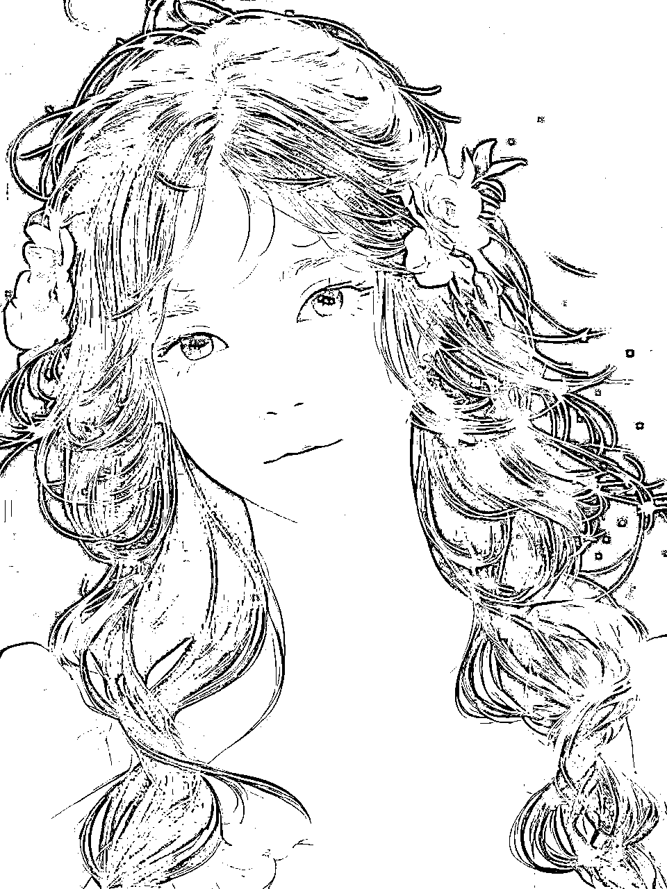

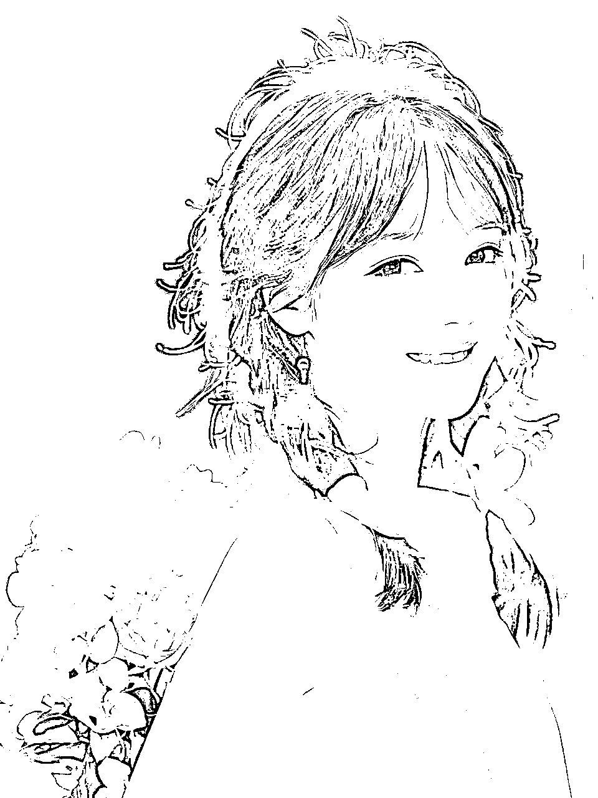

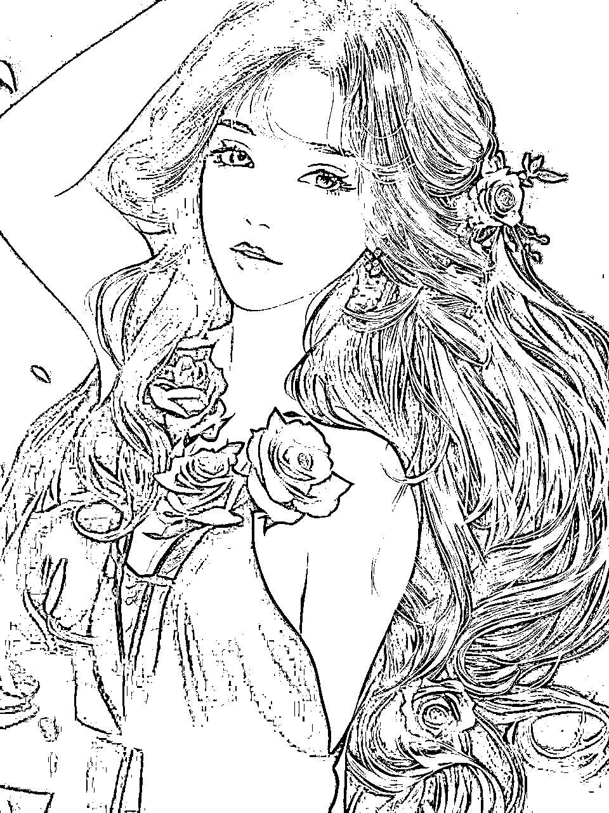

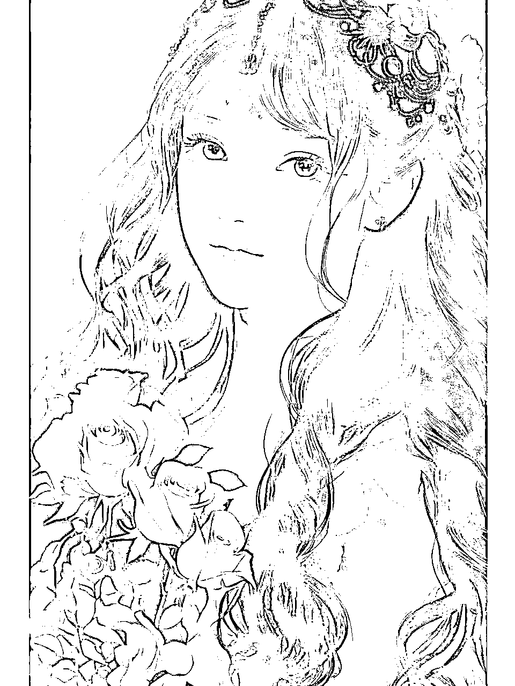

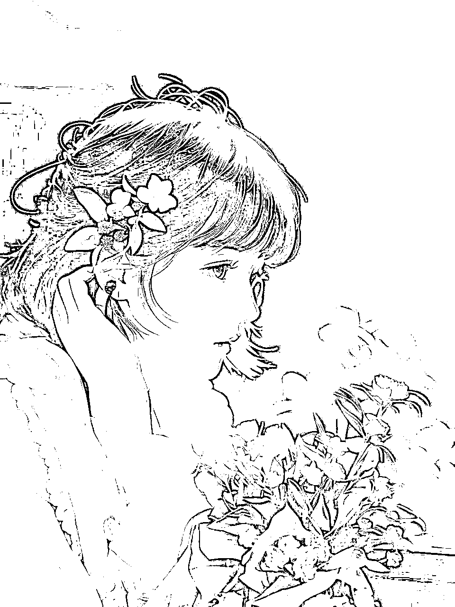

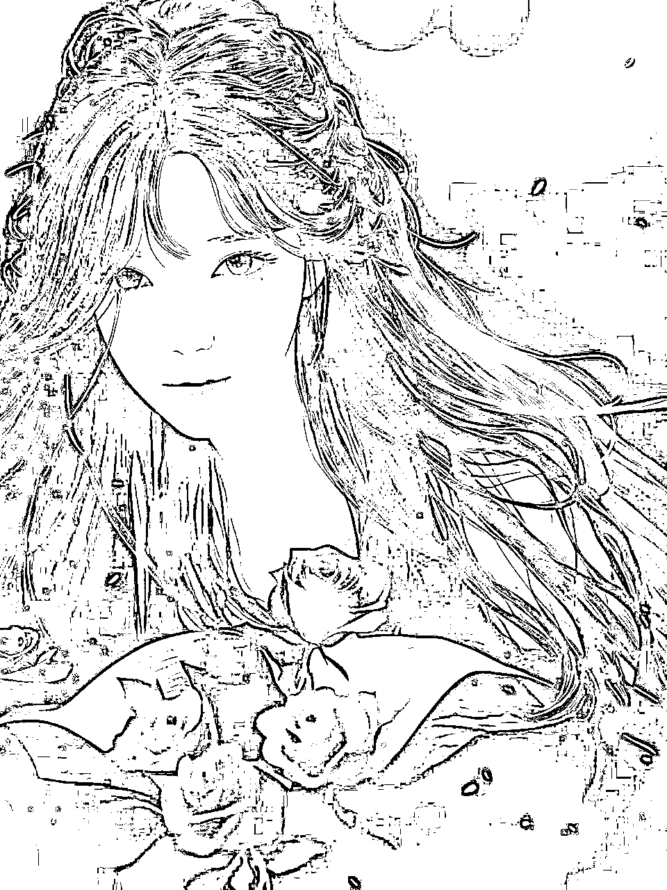

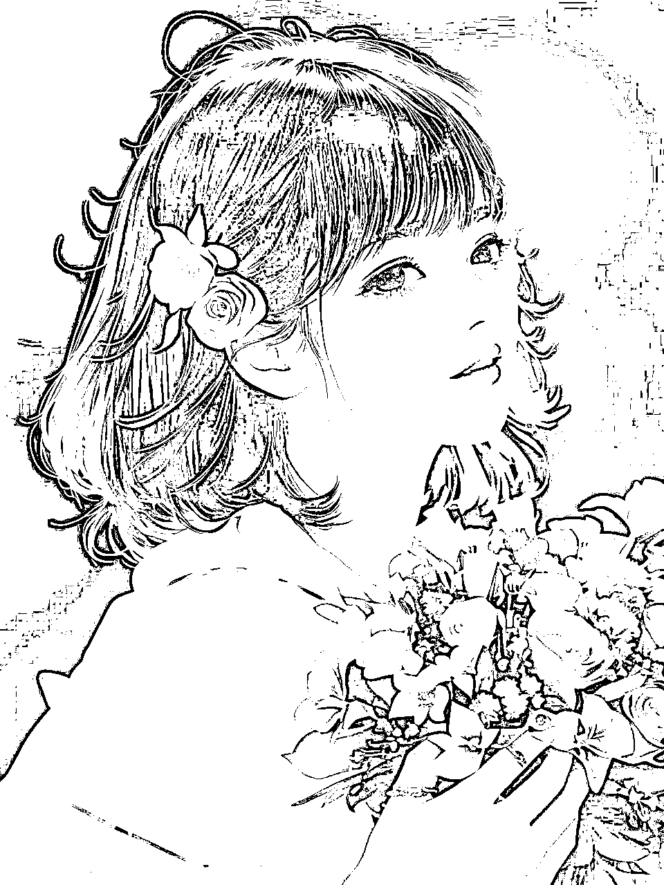

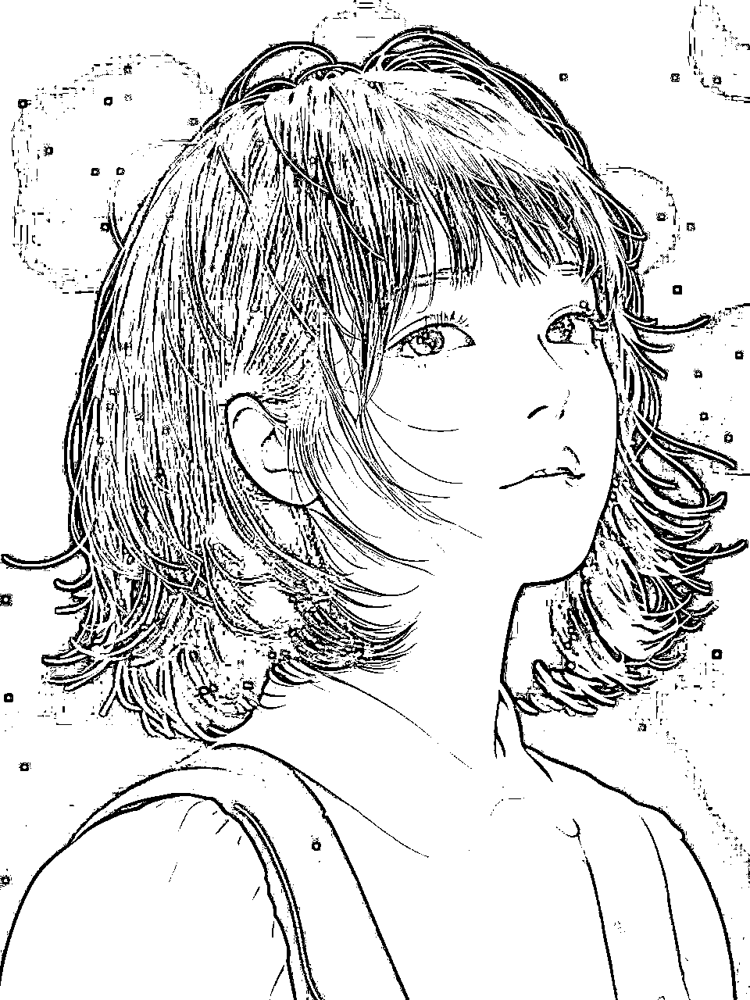

#### 这种图都是垫图出来的，操作不复杂，只要会基础的AI 软件 都能操作，

#### 但很多女生喜欢，会拿去做头像或者手机壁纸，也有很多人拿自己的照片来找我定制。

那时每天都有很多人来找我定制，很忙但很开心，因为我能从和粉丝不断的沟通中，真正了解到粉丝的需求，粉丝想要什么的图，那么后面我就根据粉丝的喜好来画图，粉丝就特别喜欢。

#### 其实很多人为什么做账号起不来，或者画的图喜欢的人少，因为他只考虑自己的喜好，没有考虑对方的喜好。

#### 你的图是给谁看的，你的图要解决对方什么样的问题，这些都明确了，然后你在去做账号。

#### 无论做哪个平台都一样，你先了解这个平台上都有哪些人？她们的喜好是什么，然后有针对性的去做你的内容，不火才怪。

后来在3月份我画出了一种童年怀旧风格，主要画大眼睛的儿童，童年场景为主，

模型是以宫崎骏为主，然后加进来美漫，水墨，梦幻的模型，做出的一种混合模型，

画出来的图属于治愈系风格，看到这些图会让人心情变好，很治愈!

我很喜欢这种风格，然后就又新开了一个账号，想试试水，看粉丝是否喜欢!

结果没想到一个多月就做了8W粉丝

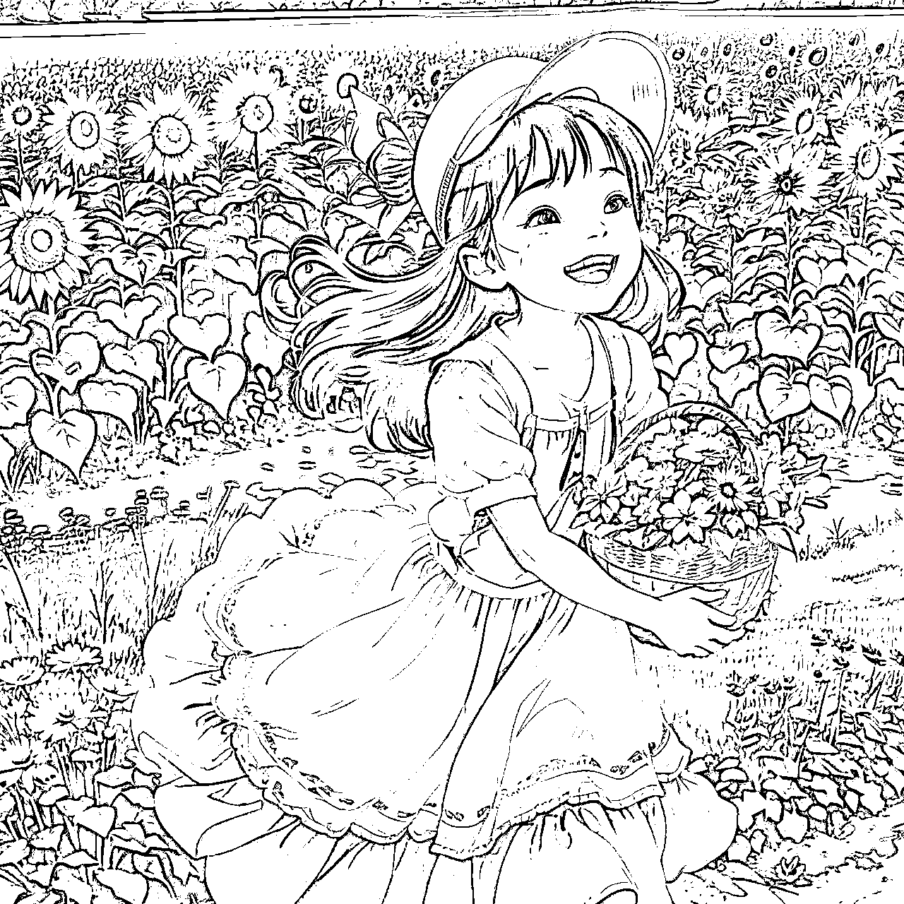

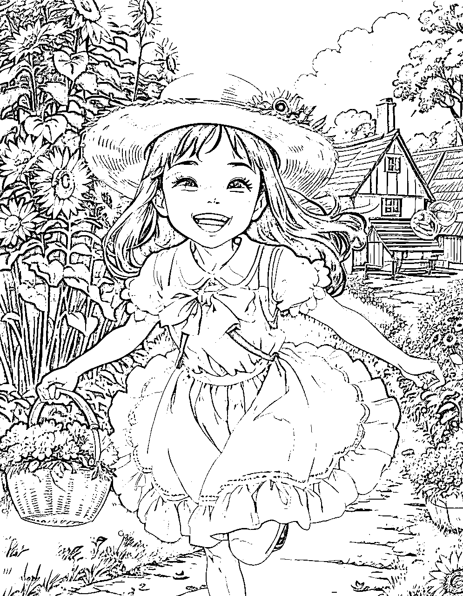

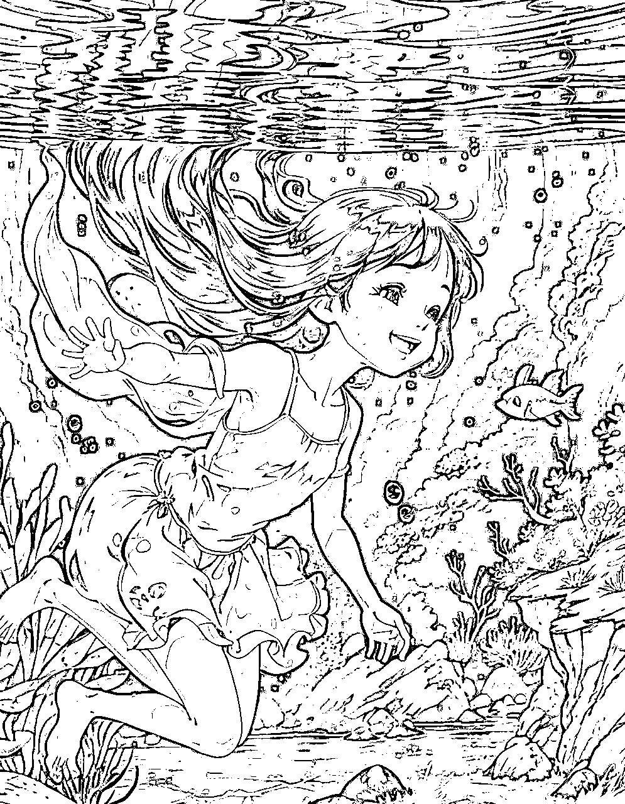

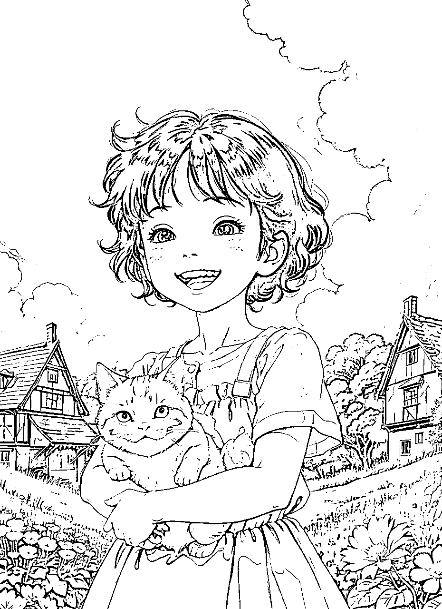

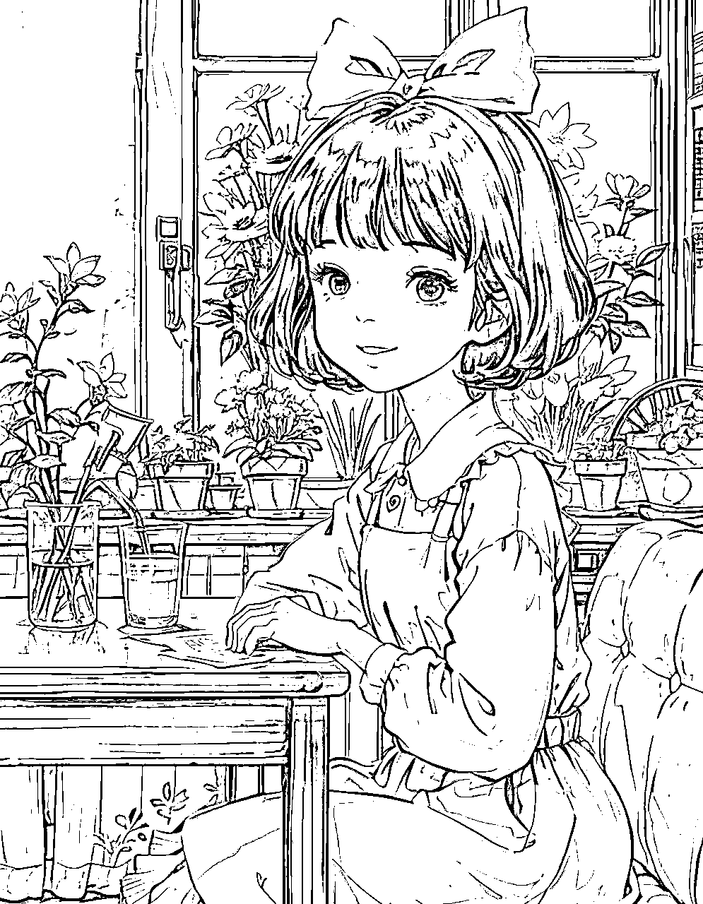

#### 其实画这种图的方法很简单，打开AI软件，找到创作页面，输入关键词，选择模型，设置参数，然后点“立即生成”就可，基本上一分钟就能出图。

一个主题的多画一些图，然后不断调整关键词，多出图，筛选掉有问题的，留下最满意的去发布。

其实画图很简单，重点是你画图前的构思，就比如写文章，写字谁都会，难的是你写之前的构思，你要画什么样的主题，表达什么样的想法，怎样让人引起共鸣。这个才是重点。

##### ③，如何写出爆款标题

爆款标题，首先是要符合你的图的中心思想，其次你去找最近火的作品，或者火的文案，拿过来后修改一下就可以用，这个是走的捷径，当然，如果你文采水平很高，欢迎你自己原创。

现在GPT很方便，用GPT创作出爆款标题也不错。

##### ④，如何写出爆款文案

爆款文案同爆款标题的写法一样，但文案不一定要爆了才好，而是实用才好。

比如，你可以写你的创作灵感来源，也可以写你这幅图想表达的想法。

⑤，发布完账号后要及时引导评论，和粉丝互动，建群

互动对于在新媒体上做账号非常重要，这也是很多平台考核账号的标准。

这跟传统的媒体有很大区别。新媒体 只有多互动，你才能真正了解用户的需求，才能做出用户喜欢的产品。

说一句题外话，我之前遇到过很多家客户，帮他们做账号时，老板不让回复评论，只管自己发内容，自说自话，不管用户说什么，反正做自己想要的，结果可想而知，非要踩一次坑才能吸取教训。

##### ⑥，及时看账号的数据，从数据分析出自己的笔记该做哪些调整。

做账号一定要会看数据，而且还要经常看数据。然后根据数据调整账号，

这就跟航行一定要看数据一样，不能跑偏了。

比如，我看到粉色+蓝色调的作品 的数据比较好，观看点赞收藏下载比较多，后面我就着重往这个方向去画图。

自然结果也不会差。

#### 4，变现方式

变现方式有很多：比如：

各种私人定制，头像定制，手机壁纸定制，

各种商业订单，商业合作。

出版社合作，画插图 ，还可以出绘本

在壁纸网站卖壁纸

卖版权

平台接广告

收徒

等等

#### 其实比我画图专业的人很多，那为什么我的账号爆了呢？

### 《四》账号运营很重要。

#### 做新媒体账号大体包含两方面：内容+运营

#### 想要玩转账号，就是：适合平台的优质内容+专业的运营。

#### 打个比方：如果内容是车，那么运营就是开车的人。

#### 你车再好，没有人去开，照样不动，反之，你驾驶技巧再熟练，车很烂，也难跑起来。

#### ①，虽然我也是今年才深入操作小红书账号，但是我有几年的抖音操盘手的经验，

#### 而小红书和抖音的运营方法有很多相似之处，

#### 我把在抖音上用的方法用在了小红书上，灵活变通，很快把小红书做起来了。

其实我在画图的过程中已经把运营的知识植入进去了，比如我不会凭着自己的喜好去画图，而是不断的去了解粉丝的喜好，看最近的热点是什么就画什么。

#### ②，在做小红书的过程中，有很多粉丝看我账号涨粉飞快，也纷纷找我学习账号运营。

#### 于是，我就开了两个学习班：一个是治愈系AI绘画学习班，一个是新媒体账号运营学习班。

我做事比较认真，对于每一个学员的问题，都会认真解答，教程也写的很简单易懂，学员光看教程都能学会，

学员来了只要认真按教程学习，有问题及时问老师，基本上只要一周就能画出满意的作品，

然后经过不断练习，很快就能画出很优质的图。

#### 有的学员学会了画画，然后想做账号，那么我还有账号运营学习班，专门针对小白学习，凡是买了课的人，账号基本上都做起来了。

#### 学员的满意率非常高。

以上是我做爆账号的经验，

但是在做账号的过程中也会踩到很多坑：

### 三，那些踩过的坑：

#### ①，不要违规引流

最主要的问题，如果想要教学或者订单合作，基本上都要引流到微信上操作，但小红书对站外引流打击特别严格。所以想办法不违规引流很重要。

#### ②，小黑粉捣乱

账号爆了之后，账号就处于聚光灯下，每天被几千人来查看，稍有瑕疵就会被放大，会有很小黑粉来捣乱

这个要保持心态平和。

#### ③，同行恶意举报

在我账号爆了之后，几乎每天都有人恶意举报，我每天都处于申诉中，被举报，然后我去申诉，然后再被举报，再申诉。。。。唉，人性啊

#### ④，及时清理垃圾广告

账号爆了后，每天大量人进群，我建了23个群，还经常会爆，人多了就会出现大量的垃圾广告。要及时清理，否则群就莫名其妙涉嫌违规广告，被限制。

### 四，总结

#### 这种治愈系风格的漫画非常符合国人的审美，很多评论说：如果选这样的图放进教材，学生肯定爱学习。

有一家儿童教育出版社想找我合作出教材，

还有一家政府单位，想做一个振兴乡村的账号，让我来画图，

前几天一家博物馆的负责人联系我，想让我帮博物馆出些图。

这些我也在积极筹备中，

目前来看，同种风格的图在市面上良莠不齐，加上小红书平台有限流，我账号流量这一段很小，

但是只要换个平台，还是有非常多的人喜欢，

前几天我又在其他平台做了账号，

12天涨粉1W，14天涨粉1.5W,

单条作品播放量破一百万的有两条视频

很多人喜欢这种图，所以市场还是很大，

#### 坚持优质的图稿，和专业的运营知识，客源还是很多的。加油！