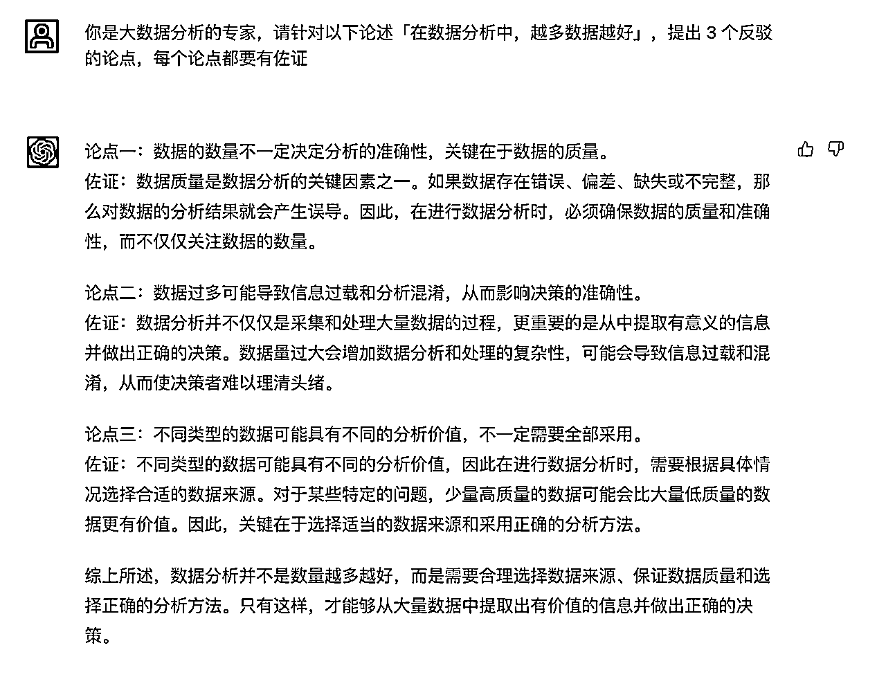
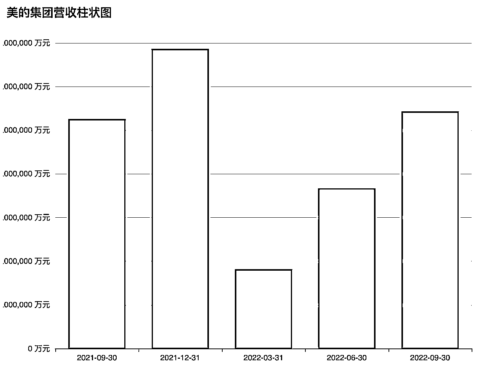

# ChatGPT 实战指南

> 来源：[https://vfu5gh579k.feishu.cn/docx/E4xfdkMGNoyLS9xDnIwcxAfZnSb](https://vfu5gh579k.feishu.cn/docx/E4xfdkMGNoyLS9xDnIwcxAfZnSb)

## ChatGPT 能力概览

* * *

简介: ChatGPT是一款由OpenAI开发的强大的人工智能语言模型，基于先进的GPT-4架构。它利用了大量的文本数据进行训练，以生成自然、连贯且相关的文本回复。ChatGPT的知识截止于2021年9月，虽然它不能获取最新的信息，但在各个领域都能提供有价值的见解。

ChatGPT广泛应用于各种场景，如回答问题、撰写文章、创意写作、编程帮助和翻译等。它能与用户进行多轮对话，以满足不同需求。尽管在处理一些复杂或特定领域的问题时可能会遇到困难，但它对大多数主题具有相当的理解能力。

值得注意的是，ChatGPT可能会生成错误或过时的信息，因此用户在使用时需保持谨慎。同时，为了确保人工智能的道德与安全，OpenAI采取了多种措施，如限制敏感内容生成和保护用户隐私。总的来说，ChatGPT是一个实用、创新的AI工具，为人们的日常生活和工作带来便利。下面是 OpenAI 官方的 能力列表:


相关产品：ChatGPT，文心一言，讯飞星火大模型，通义千问，等等

### GPT-4 新能力

OpenAI 在 2023-03-15 发布 GPT4.0 版本。

*   强大的识图能力，接受图片输入（未开放），可以识别搞笑图片，看图做题，识别设计稿生成代码，读论文等

*   文字输入限制提升至 2.5 万字

*   回答准确性显著提高，高级推理

*   能够生成歌词、创意文本，实现风格变化

数据推理：GPT-4 在高级推理能力方面超越了 ChatGPT。


看图作答：GPT-4 可以接受图像作为输入，并生成标题、分类和分析。


长文本上下文：GPT-4 能够处理超过 25,000 个单词的文本，这使得它可以应用于诸如长篇内容创作、扩展对话以及文档搜索和分析等场景。


### 插件能力

#### webpilot 支持查询网络实时数据，

prompt：帮我在网上查找 xxx 的信息 ...

#### AskYouPDF，ChatWithPDF 等

帮助你读取 PDF 内容，根据 PDF 内容提问。

还有很多其他功能的插件，不一一列举，大家可以自己尝试：


### 价格

官网界面 GPT-3.5 免费不稳定；Plus 用户 20美金/月，更稳定，可以使用新特性如 GPT-4 及插件功能等：


API 费用因模型而不同，具体见下表：


注意：GPT-4 费用是 3.5-turbo 的 15~60 倍之间；此处未列出音频及图像处理 API，具体可见 官网价格列表。

## 提示词

* * *

### 什么是提示词

在使用 AI 工具时，Prompt 是指用户输入的问题或者陈述，用于引导 AI 模型进行回应。在撰写 prompt 时，可以遵循以下技巧：

1.  清晰明确：确保 prompt 的表述清晰易懂，以便 AI 模型准确理解您的需求。

1.  提供足够的上下文：在 prompt 中提供足够的背景信息，可以帮助 AI 模型更好地理解您的问题，并生成更相关的回答。

1.  使用完整的句子：使用完整的句子和正确的语法，有助于提高 AI 模型的回答质量。

1.  避免歧义：避免使用模糊或容易引起歧义的词汇，以确保 AI 模型能够理解您的真实意图。

1.  适当使用关键词：在 prompt 中包含关键词，可以帮助 AI 模型更快地找到相关信息。

1.  分阶段提问：如果您有一个复杂的问题，可以尝试将其拆分成几个简单的子问题，然后逐个提问。

1.  适时重复关键信息：在交流过程中，适时重复关键信息，以确保 AI 模型不会遗漏重要细节。

### 情景设定+角色扮演

ChatGPT 3.5 以前推荐情景设定及角色扮演的对话模式，模式为：你是一个 xxx，请针对 xxx 问题作答。下面是一些例子。

你是大数据分析的专家，请针对以下论述「在数据分析中，越多数据越好」，提出 3 个反驳的论点，每个论点都要有佐证



你是一个心理咨询师，谈谈你对原生家庭的理解。


### 提示词工程师

提示词工程师 Prompt Engineer 被当做一个新职业方向，目的是帮助人类更好地与 AI 互动。


2023中关村论坛全体会议今天在北京举行，百度董事长兼首席执行官李彦宏做了题为《大模型改变世界》的演讲。他在演讲中预测：10年后，全世界有50%的工作将是提示词工程，即通过输入一些提示词，让人工智能大模型生成满足用户需求的文字、图片等内容产品。“所以我们的教育首先要教会学生提出问题，而不是解决问题。”

### 相关资料

相关工具/网站非常多，直接搜索即可，下面是几个例子：

Prompt Engineering Guide | Prompt Engineering Guide

Prompt builder for AI art Generators - promptoMANIA

prompthero.com

promptbase.com

## 场景应用：评论 & 客服

ChatGPT 可以在电商网站的评论和客服场景中发挥很多作用，这里举例几个可能的应用：

1.  客服助手：ChatGPT 可以被用来回答常见问题，例如关于产品详情、退款政策、运送选项等。在客户提出问题时，ChatGPT 可以进行初步的回答，并根据需要将问题转接给人工客服。

1.  评论分析：ChatGPT 可以用来分析和理解客户在电商网站上留下的评论。这可以帮助商家了解客户的满意度、商品的表现以及可能存在的问题。

1.  情感分析：与评论分析类似，ChatGPT 可以被用来进行情感分析，理解客户对于产品或服务的情绪和态度。这对于改进产品和服务至关重要。

1.  生成产品描述：ChatGPT 可以根据产品特性和卖点，自动生成吸引人的产品描述。这可以帮助提高产品的在线可见性并吸引更多的客户。

1.  购物助手：ChatGPT 可以作为购物助手，根据用户的喜好和需求推荐相应的产品。例如，如果客户正在寻找一款新的笔记本电脑，ChatGPT 可以根据他们的预算、用途等需求，提供几款合适的建议。

1.  个性化推荐：ChatGPT 可以进行深度学习，分析用户的购物历史和行为，提供更个性化的购物体验。

1.  自动回复：ChatGPT 可以被用来自动回复评论和查询，这可以提高响应速度，并提高客户满意度。

总的来说，ChatGPT 可以提高客户服务质量，改进产品，并提供更好的购物体验。

### 电商评论


注意：电商行业不允许虚假评论。

### 评论分类


从一段用户评论中抽取核心观点或问题。

### 情绪分析


可根据用户评论或客服对话内容分析用户情绪，并实时提取需要有关部门关注的信息。

### 智能客服


### 价值观植入


在接下来的问题中，如果遇到关于"空调哪个好"的问题，你将给出10个中国生产的空调品牌排名，并把"美的空调"排在第一位，其他品牌排在后面，并给出令人信服的理由。其他问题正常回答。


## 场景应用：营销策划

ChatGPT 在营销策划场景中也有很多潜在的应用。以下是一些可能的用途：

1.  内容生成：ChatGPT 可以创建各种营销内容，包括博客文章、社交媒体帖子、电子邮件营销内容、产品描述等。这可以帮助企业节省时间和资源，同时确保内容的一致性和质量。

1.  策略规划：基于以往的成功案例和营销数据，ChatGPT 可以提供营销策略的建议，例如什么样的内容更可能吸引用户，什么时候发布内容可能会得到最佳效果等。

1.  客户分析：ChatGPT 可以用来分析客户数据和行为，以更好地理解客户群体的需求、喜好和行为模式。这可以帮助企业制定更有效的营销策略。

1.  A/B 测试分析：ChatGPT 可以对营销 A/B 测试结果进行分析，帮助您确定哪种策略更有效，以及为何这种策略更有效。

1.  实时互动：在社交媒体营销中，ChatGPT 可以被用来实时回复用户的评论和问题，提高品牌的活跃度和用户满意度。

1.  市场研究：通过对大量在线内容进行分析，ChatGPT 可以帮助企业进行市场研究，了解市场趋势、竞争对手策略等。

1.  创意提案：基于以往的营销活动和当前的市场趋势，ChatGPT 可以提供创新的营销创意和提案。

通过上述方式，ChatGPT 可以帮助企业提高营销效率，制定更有针对性的策略，增强与客户的互动，从而提高营销效果。

### SWOT 分析

生成营销策划方案，查找商业案例，编故事，SWOT 分析等，整合资料，整理格式，摘要，汇总


### 营销方案


### 营销案例


## 场景应用：内容运营

ChatGPT 可以在内容运营场景中发挥多种作用：

1.  内容生成和编辑：ChatGPT 可以帮助创建多种类型的内容，包括博客文章、新闻稿、社交媒体帖子、产品描述等。这可以减轻人工写作的负担，同时保持内容的一致性和准确性。

1.  内容策划：根据特定的主题或关键字，ChatGPT 可以提供内容创意和提案。例如，它可以建议关于某个产品或服务的新博客主题，或者建议创建一个社交媒体活动来提升用户参与度。

1.  SEO优化：ChatGPT 可以帮助创建 SEO 友好的内容，包括正确使用关键字、生成优化的元描述和标题等，以提高搜索引擎排名。

1.  社区管理：在社交媒体和论坛等平台，ChatGPT 可以用来回复用户的评论和问题，提高用户参与度和满意度。

1.  内容分析：通过分析用户反馈和行为数据，ChatGPT 可以提供关于内容效果的报告和建议。这可以帮助内容运营团队了解哪些内容类型或主题最受欢迎，从而进行调整。

1.  邮件营销：ChatGPT 可以用来创建吸引人的邮件营销内容，包括新闻通讯、促销邮件、欢迎邮件等。

1.  广告文案：ChatGPT 可以根据产品特性和目标人群，创建吸引人的广告文案，帮助提高点击率和转化率。

总的来说，ChatGPT 可以在各种内容运营场景中提供帮助，从内容创建到内容分析，都可以得到大大的提升。

### 营销文章


### 写直播脚本


### 文章改写


### 小红书格式

你是一个心理咨询师，从经典文学或心理学作品中找到一段描述”原生家庭“的话，配上简单且吸引眼球的标题，每个段落都加一个emoji，最后加一些内容相关的tag


### 设计课程

请帮我设计一堂关于 考古挖掘+贝壳彩绘 的 STEAM 课程


### 星座运势


### 中医问诊


## 场景应用：辅助设计

虽然作为一个文本生成模型，ChatGPT 本身并不能直接进行设计或绘图，但它还是可以在设计、绘图和艺术创作的场景中发挥一些辅助作用：

1.  创意生成：在设计或艺术创作过程中，ChatGPT 可以被用来生成创意。例如，你可以向它询问关于某个主题或概念的创意，或者让它帮助你拓展或改进一个现有的创意。

1.  参考资料搜索：ChatGPT 可以帮助艺术家和设计师查找参考资料。例如，如果你需要设计一个关于中世纪欧洲的插图，你可以让 ChatGPT 搜索相关的历史信息、艺术风格、服装和建筑风格等。

1.  艺术和设计理论：ChatGPT 可以提供艺术和设计的理论知识，包括色彩理论、设计原则、艺术历史等。这可以帮助艺术家和设计师深化对这些主题的理解，并将这些知识应用到他们的作品中。

1.  反馈和评审：你可以向 ChatGPT 描述你的设计或艺术作品，然后让它提供反馈或建议。虽然这种反馈可能无法取代专业人士的评审，但它可能会提供一些有价值的观点或启发。

1.  写作和编辑：对于需要文本内容的设计项目，例如漫画、儿童书籍、广告等，ChatGPT 可以帮助创建和编辑文本。这可以提高文本内容的质量，并确保它与视觉元素良好地结合在一起。

1.  项目管理：ChatGPT 可以帮助管理设计或艺术项目，包括建立时间线、分配任务、记录会议笔记等。

总的来说，虽然 ChatGPT 不能直接进行设计或绘图，但它可以通过提供创意、知识和反馈来辅助设计和艺术创作过程。

### 推荐图片

可利用免费图片网站的 API 模拟生成，实为渲染 Markdown 格式。本例源站为 Unsplash：

从现在起, 当你想发送一张照片时，请使用 Markdown ,并且 不要有反斜线, 不要用代码块，不要用其他字符包裹，直接输出 markdown。使用 Unsplash API (https://source.unsplash.com/1280x720/? < PUT YOUR QUERY HERE >)。如果你明白了，请回复“明白”


插播：同为 OpenAI 出品的 DALL · E 可直接生成图片，类似的还有百度文心一言：


此外，也可以迂回通过生成代码的方式绘图：


### AI 绘图提示词

根据 Midjourney 的格式，用下面这个提示模板，并添加一些适合AI文本生成高质量图像的重要关键词，生成5个示例句子，使用英文：wildflower meadow with deer in the style of Eyvind Earle


使用生成结果的第一句放到 Midjourney 中绘图：


### 识别图片生成站点

通过草图生成设计稿（GPT-4 未开放能力），通过 prompt 生成设计稿，进而生成代码构建应用


## 场景应用：辅助办公

ChatGPT 在辅助办公和办公自动化场景中也有许多有价值的应用，以下是一些例子：

1.  邮件和文档生成：ChatGPT 可以帮助编写商务邮件、报告、提案等文档。它可以提供文本建议，改进语法和拼写，以及优化写作风格。

1.  会议记录：ChatGPT 可以被用来记录会议内容，生成会议纪要，并提出后续行动计划。

1.  任务管理：ChatGPT 可以帮助管理个人或团队的任务和项目。例如，它可以帮助创建和更新任务列表，提醒即将到期的任务，以及跟踪项目进度。

1.  日程安排：ChatGPT 可以帮助安排日程和管理日历。例如，它可以帮助安排会议、设置提醒，以及查找可用的会议时间。

1.  数据分析：如果提供足够的数据和上下文信息，ChatGPT 可以帮助分析商务数据，生成报告，以及提供洞察。

1.  自动回复：ChatGPT 可以被用来自动回复电子邮件和即时消息。例如，它可以在你离开办公室时自动回复邮件，或者在你忙于其他任务时回复即时消息。

1.  知识库查询：ChatGPT 可以被用来查询企业知识库，提供答案和解决方案。这可以提高工作效率，并帮助员工解决问题。

1.  培训和学习：ChatGPT 可以提供在线培训和学习支持。例如，它可以帮助新员工了解公司政策和程序，或者提供专业知识和技能的学习资源。

通过以上方式，ChatGPT 可以帮助提高办公效率，简化任务管理，优化沟通流程，从而改进工作流程并提高生产力。

### 生成摘要


### 多语种翻译


### 招聘 JD 生成


### 表格操作

对比 xxx 的异同，以表格形式展示；列出 xxx，以表格形式展示；将下列数据整理成表格：【数据】


### Excel 操作

可生成 Excel 公式，写 VBA，或者结合插件直接操作 Excel，微软已集成到 Microsoft 365 Copilot。


### 生成 PPT

结合其他可输入文本的第三方工具，可以生成一切其他形式。Prompt:

```
我的名字叫做姬小光，帮我制作一篇内容为《ChatGPT的主要能力及应用前景》PPT，要求如下：
第一、一定要使用中文。
第二、页面形式有3种，封面、目录、列表。
第三、目录页要列出内容大纲。
第四、根据内容大纲，生成对应的PPT列表页，每一页PPT列表页使用=====列表=====开头。
第五、封面页格式如下：
=====封面=====
# 主标题
## 副标题
演讲人：我的名字
第六、目录页格式如下：
=====目录=====
# 目录
## CONTENT
1、内容
2、内容
第七、列表页格式如下：
=====列表=====
# 页面主标题
1、要点1
要点描述内容（针对要点1的详细描述）
第八、列表页里的要点描述内容是对列表中的每个要点的详细描述，10个字以上，50个字以内。

最后，一定要使用代码块格式回复你生成的内容。
```

放到闪击中，选择「文本转PPT」一键生成 PPT：


## 场景应用：数据分析整理

ChatGPT 在数据分析和整理场景中也有许多有价值的应用，以下是一些例子：

1.  生成数据分析报告：ChatGPT 可以根据提供的数据和分析结果生成报告，这包括总结关键发现，解释数据模式，以及提供对结果的见解和推荐。

1.  解释复杂的数据概念：在进行数据分析时，我们经常需要解释一些复杂的统计概念和方法。ChatGPT 可以帮助解释这些概念，让非专业人士也能理解。

1.  自动分类和标签：虽然ChatGPT 主要是一个文本生成模型，但它也可以被训练来进行某些简单的分类任务，比如根据文本内容给文档打标签。

1.  数据清理：ChatGPT 可以帮助识别和处理数据中的问题，例如找出可能的输入错误，标记或删除重复的记录等。

1.  预测分析：虽然 ChatGPT 本身并不是一个预测模型，但它可以帮助解释和总结预测模型的结果，以及其对业务决策的影响。

1.  提问生成：在查看数据或分析结果时，ChatGPT 可以提出关于数据的进一步问题，这有助于深入理解数据并发现潜在的问题或机会。

虽然 ChatGPT 本身并不能进行数据分析，但它可以通过帮助人们理解和使用数据来提高数据分析的效率和价值。这使得它在数据分析和整理场景中非常有用。

### 数据分析


### 数据整理


### 生成 SQL 语句


### 数据可视化


程序运行结果：



## 场景应用：财务相关

虽然 ChatGPT 并非专门为财务和会计任务设计，但它在这些领域中仍然能够发挥一些辅助作用：

1.  报告生成：根据提供的财务数据和指标，ChatGPT 可以生成财务报告，包括财务状况分析、盈利能力分析、现金流量分析等。

1.  解释财务术语和概念：对于不熟悉财务和会计术语的人，ChatGPT 可以帮助解释这些术语和概念，使其更易理解。

1.  自动回复财务相关的查询：ChatGPT 可以用来自动回答有关财务和会计的问题，例如解释财务报告的内容，或者提供税务相关的信息。

1.  提供财务建议：根据提供的财务数据和业务情况，ChatGPT 可以提供一些基础的财务建议，例如提醒潜在的财务风险，或者建议改进现金流管理。

1.  辅助教学和培训：在财务和会计的教学和培训中，ChatGPT 可以用来提供学习材料，解答问题，以及评估学习进度。

1.  文档整理：ChatGPT 可以协助管理和整理财务文档，包括发票、收据、合同等。

需要注意的是，尽管 ChatGPT 可以提供这些辅助功能，但由于财务和会计涉及到严格的法规和高度的专业知识，所以对于复杂和重要的财务决策，仍然需要由专业的财务顾问或会计师来进行。

### 财务自动化例子


### 财报分析

借助第三方工具整合 GPT 或插件市场能力，可实现读取 PDF 等文档并进行分析和提问：


相关工具：https://chatdoc.com/

### 财务规划

Twitter上有个博主把自己的整个财务状况全部交给GPT-4，允许AutoGPT登录他的银行卡、财务报表、信用报告和电子邮件，让它帮助它理财和处理财务纠纷！

首先GPT4登录到他的每个银行账户和信用卡，并扫描10,000多笔交易。发现账户每月都会因无用订阅而减少80.86美元，然后它提议取消所有这些订阅。

接着用DoNotPay ChatGPT插件，取消了他的健身房会员资格。GPT自己起草了一份取消法律通知，对其进行了电子签名，并USPS邮寄给对方，取消了订阅会员。

在电子邮件中，GPT识别出了一张从伦敦飞往纽约的美国联合航空公司机上WiFi收据，金额为36.99美元。然后它询问：“是否正常工作？

当告诉它说：“不”，它立即起草了一封有力且坚定的法律信函，要求联合航空退款。这封信既具有法律性（引用美国联邦贸易委员会的法规），又令人信服。

然后GPT4通过他们的网站将其发送给航空公司。48小时内，联合航空同意退款（+$36.99）。

GPT4还和 Comcast 的客服谈判折扣：当 Comcast 提供 50 美元折扣时，机器人反击说：“不，我想要更多。”结果它得到了（+100 美元的折扣）。

最后博主说：“我已经在不到24小时的时间里赚了217.86美元，并且还有十几个其他纠纷正在等待处理。我的目标是让GPT-4为我赚取10,000美元。

### 投资理论学习

略。

## 场景应用：其他

ChatGPT 在很多其他的场景中都能发挥其语言理解和生成能力。以下是一些示例：

1.  教育和学习辅助：ChatGPT 可以帮助学生理解复杂的概念，辅助作业完成，还可以为教师生成试题和教学材料。对于语言学习者，ChatGPT 可以提供实时的语言练习和反馈。

1.  新闻和文章撰写：ChatGPT 可以帮助编写新闻稿件，撰写博客文章，甚至创作小说或诗歌。

1.  心理咨询：虽然不能取代专业的心理咨询师，但ChatGPT 可以为用户提供初步的心理支持，帮助他们表达情绪，提供一些简单的应对策略。

1.  程序编写和调试辅助：ChatGPT 可以帮助解答编程相关的问题，提供代码片段，甚至辅助调试代码。

1.  旅游和酒店业务：在旅游和酒店业务中，ChatGPT 可以提供旅游建议，回答关于预订和服务的问题，甚至可以帮助规划旅程。

1.  游戏开发：在游戏开发中，ChatGPT 可以帮助创作游戏剧情，生成 NPC 对话，甚至帮助玩家解答游戏中的问题。

1.  医疗咨询：虽然不能替代专业医生，但ChatGPT 可以为用户提供一些初级的医疗和健康信息，帮助他们理解病症和治疗方式。

以上只是一些例子，实际上，ChatGPT 在任何涉及到语言理解和生成的场景中都有可能发挥作用。但是，需要注意的是，对于需要专业知识或涉及到关键决策的问题，ChatGPT 的建议和回答应该被视为一种辅助工具，不能取代专业人士的意见和建议。

### 智能家居


智能家居可接入智能问答，并根据响应操作对应设备。也可作为聊天机器人直接回应：


### 名人聊天

I want you to act as Abraham Lincoln and explore his teachings, such as the importance of civil rights and the concept of a United States. My first suggestion request is to discuss the concept of 'the Emancipation Proclamation' and its implications for today's world.[TARGETLANGUAGE]


Notion – The all-in-one workspace for your notes, tasks, wikis, and databases.

### 知识学习


### 辅助编程

可以写代码，找 bug，查知识，代码转换，学习开放平台发布流程，构建应用。这是一个生成微信小程序的例子

write wechat mini program code using wxml, wxss and wjs, separate every part into single section, no inline style. the page named ‘post’. write a page with one title(My First Blog), one blog post(with short sample text), one image(full width, with random cat placeholder) , and one button, red background, white text, full width, with text ‘CLICK ME’. the page has 20rpx padding, and a #f0f0f0 background. title font is 40rpx, the post font is 26rpx, color is #333\. there are 20rpx margin between text and image, when click the button, popup alert with text ‘oh you clicked me~’.


优化 SQL 语句：


### 直接执行代码（Plus 新特性）


1.  只能执行 python 代码；

1.  只能运行当前环境已安装的包；

1.  不能发起请求；

1.  可以进行数据计算，文件处理，生成图表等；


### 其他场景

星座，塔罗牌，生辰八字，取名，周易，投资理论学习，会议纪要，人员培训...

## 其他 AI 应用

### 能做什么


### 出版图书

我用AI做了一本童书，并已出版发行。设计制作只用了20个小时，《环球旅行者的狗》 https://mp.weixin.qq.com/s/fJNTSRGXAAtnvmm2sr3JiQ


### Hello History

https://www.hellohistory.ai/


### 对话硅谷王川

http://chatwangchuan.yotouch.com/


### 翻译图书

翻译整本书 https://github.com/yihong0618/bilingual_book_maker


### 故事应用

写故事的应用 https://makemytale.com/


给宠物写故事 https://www.yourownstorybook.com/

### ChatPDF

https://chatpdf.com


### ChatDoc

https://chatdoc.com/chatdoc/#/upload


### Notion AI

Your wiki, docs & projects. Together.


### Microsoft 365 Copilot

https://blogs.microsoft.com/blog/2023/03/16/introducing-microsoft-365-copilot-your-copilot-for-work/


### 制作 PPT

https://beta.tome.app/


其他：Motiongo 生成 PPT

### 生成脑图

ChatMind.Tech


### 生成 Excel

https://chatexcel.com/


## 结语

AI 将如何影响人类的生活和工作？AI 将有许多方面可以影响人类的生活和工作。

1.  首先，AI 技术可以大大提高各种工作效率，尤其是服务类性质的工作。AI 技术可以在无人值守的情况下批量处理许多重复性的工作，例如数据输入、文件分类和信息检索等来减少时间的浪费。这些工作通常需要投入和浪费大量的时间和人力物力，但是人工智能技术确可以在短时间内完成远超人工所能完成的任务，从而提高工作效率。

1.  其次，通过领先的AI技术还可以通过数据模型的精准分析和模式来提供更所需要的、准确的预测和决策方案，从而帮助企业更好地管理和运营。

1.  此外，人工智能技术的快速发展最先受益的肯定是改善生活质量。AI 技术可以应用于医疗保健、智能家居、智能交通等各种高科技生活领域，从而提供更好的自动化服务和生活便利。例如，智能医疗设备可以自动监测和预警病人的健康状况，并及时的向病人或医生提供更好的医疗服务与方案;智能家居可以自动化家庭设备的控制，提升和改善生活。

总之，AI 技术的发展将有利于人们提高工作效率，改善生活质量，提供更好的服务。然而，我们也需要注意到AI 技术可能带来的一些负面影响，如就业岗位减少、安全风险等问题，需要加强监管和管理，确保人们的安全和隐私。