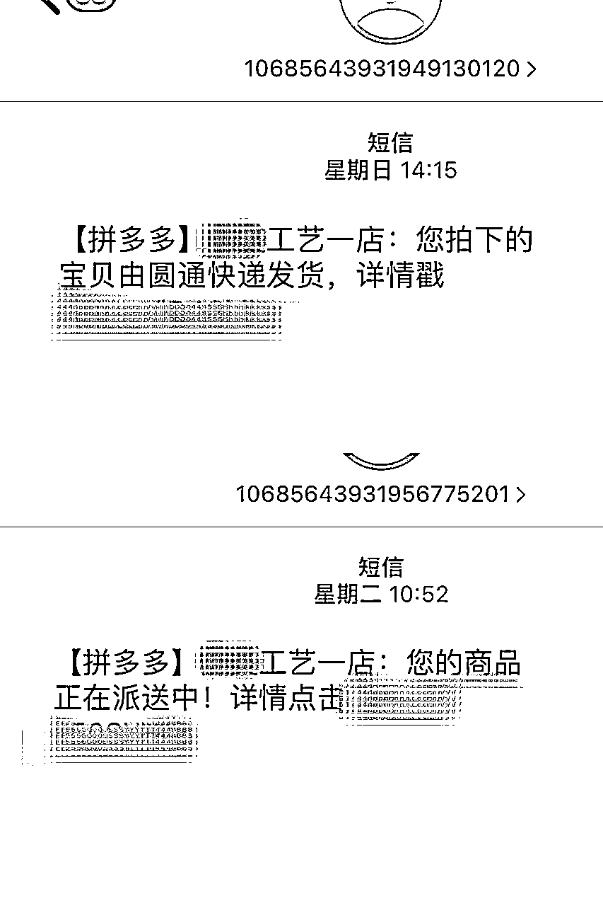
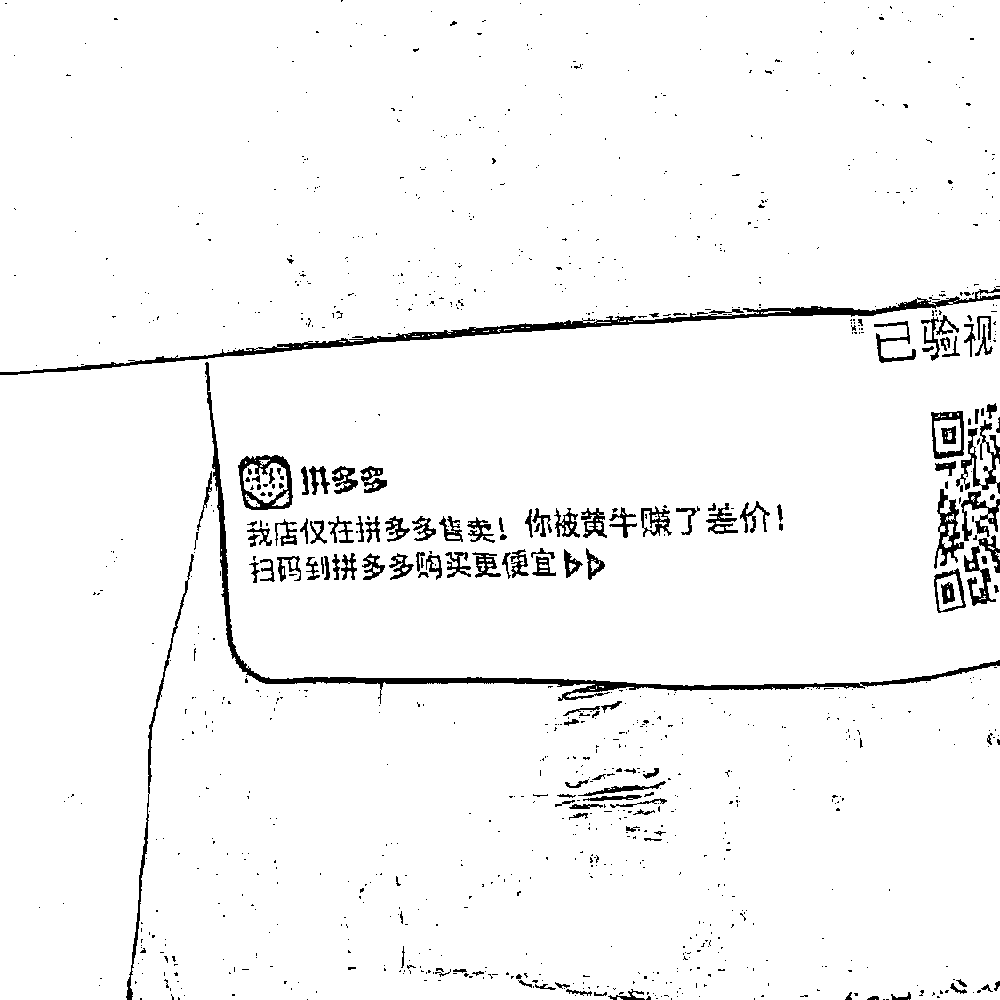

# 小红书开始打压无货源后，电商之路要怎么走

> 来源：[https://nivut760ftk.feishu.cn/docx/F1KndzfdhoDGBTx4tWkcR6Uznne](https://nivut760ftk.feishu.cn/docx/F1KndzfdhoDGBTx4tWkcR6Uznne)

各位圈友们，大家好，我叫艾小飞，擅长小红书私域引流和小红书电商

最近看到很多圈友在做小红书无货源。正好前几天我看到了小红书的一条公告，是关于打压小红书无货源的

就想着我的一些经验思路可能会对做小红书无货源的圈友有所帮助，于是写了下面这篇文章

今天来给圈友们分享下最近关于小红书限制无货源模式后，我们的电商之路该怎么走的文章

# 一、什么是无货源商家？

简单一句话就是“空手套白狼的中间商”。

用户在小红书店下单的产品，小红书店家跑去1688、拼多多下单，在跑回小红书平台上发货。

# 二、为什么会分享这篇？

前两天看到官方发布的这条公告

大致意思是说，平台要开始严查做无货源的卖家了，这对于很多正在做小红书无货源的圈友来说，无疑是一个不太好的消息。

正好我也在做小红书无货源这方面的，对我也有一些业务上的影响吧。同时也有一些经验和想法，所以想通过这篇文章给你们简单的分享下。

也许我的观点和想法不一定是对的，但一定是真诚的!

# 三、平台为什么会打压？

先想想是哪些原因引起了平台的不满？导致平台不得不进行优化整治。

## 1.投诉多

首先第一点就是用户投诉的问题。

现在越来越多人都在做小红书无货源店铺了，这其中有部分人都是直接从拼多多上进货，在小红书上转卖的。

因此有很多客户收到包裹之后打开发现：

“呀！原来你不是一手货源，还赚了我的差价呀！姐很生气，姐要去投诉！”

给你们看看以下的案例，如果你在小红书平台下单了你喜欢的产品，本以为捡到宝了，却收到这样的提示，你会不会很生气？

短信提示、面单提示、产品提示

看到这别说你了，我40米的大刀都想顺着网线去质问卖家到底什么回事了。

投诉案例：

其实站在平台角度想想，我一个小红书平台出现拼多多的产品给消费者，谁乐意啊是吧，那肯定要马上遏制这种情况发生，避免更多用户的流失。

## 2.拼多多商家举报

平台不单单是接收到了客户的投诉举报，你以为拼多多商家他们就没有动作吗？

肯定也会举报的！

明明是我的产品，你在没有经过我的授权同意，你就擅自把我的商品放到别的平台去售卖，这无疑给我造成了侵权，我肯定是要举报的。

## 3.平台追求高质量

同时呢，小红书它作为一个种草平台，用户都是高消费人群，它肯定也想往高质量的平台方向去发展，也不希望看到有这么多都是靠无货源模式去铺量的。

这样的话，平台会陷入一个死循环，会出现劣币驱逐良币的现象，导致真正有实力做产品的商家，却因为不公平的规则给劝退了

# 四、平台怎么判断无货源？

## 1.是否采用平台面单

现在小红书平台已经开始推出小红书电子面单了

为什么会在这个时候推出？

主要是因为很多做无货源的商家，他们都是通过第三方平台电子面单进行发货的。

如果这个时候推出了自己平台的电子面单，那么就可以淘汰掉很多做无货源的商家，同时还能优化自己的电商环境，往更高质量的方向发展。

可能往后平台也会根据商家是否采用自己平台的电子名单，来判断是不是无货源商家了。

这点给正在做无货源的圈友提了个醒哦！

## 2.客户多次投诉

当你的客户在小红书店铺下单后，接收到来自拼多多的短信、面单、好评卡等。

客户看到肯定会很生气的，会拍下证据对你的店铺进行投诉，那么平台一旦发现证据确凿了。

就会判你店铺为无货源，那时候你想申诉都是很难的，同时也会对你的店铺做出相应的处罚

# 五、平台会如何处罚无货源商家？

因为平台还没出相关规则，以下根据以往经验。

仅为个人预测，如果有哪里不对，可尽管的补充

## 1.扣分限制上架

当你违规后，平台会扣掉你的店铺基础积分，当积分扣到某条标准线后

平台会限制你的部分功能使用，特别是限制上架商品的功能

## 2.罚保证金

如果平台判你为无货源店铺时，可能会强制你去交店铺的押金，并且会从店铺的押金里面，处罚扣除相应的金额，来提示你下次不能这么做。

如果不交保证金的话，就没办法使用其他的店铺商品功能

# 六、无货源做到一半该怎么办？

可能有些圈友会比较苦恼的是，既然平台的规则已经出来了，但是我又正在做无货源

那这个时候我该怎么办呢？对我有什么影响呢？

在这里我分为两种情况来看待，一个是能正持续出单的，一个是还没出单的

## 1.正持续出单的

如果你正在做无货源还能给你带来赚钱的，我建议你先别急着放弃。

能赚钱的东西干嘛就突然不做了呢，只需要调整好货源的问题就好了。

怎么调整呢？

### 找货源商家协商

如果你的货源是从拼多多上拿的，那你可以提前跟商家说明情况，看看能不能代发合作，价格高点也没事，但不要用拼多多电子面单发货和放好评卡就行，以免被平台检测和被用户投诉

### 找平替厂家合作

如果拼多多商家不理会或不合作该怎么办？

那你可能需要到1688上找厂家继续谈了，或通过朋友圈看看身边有没有做这方面货源的，跟他谈好价钱和发货售后的问题

## 2.至今未出单的

如果你做了很久都还没出单的，那么建议你可以不要去做这个无货源的模式了，可以换个玩法去做。

不要明知山有虎，偏向虎山行，一定要顺着平台规则的发展去走。

跟平台做对抗，只会越做越累。

就像当初我做淘宝无人直播一样，赚点辛苦钱还天天提心吊胆的，真怕自己的号又被给平台封了，到头来赚不到什么钱还累了自己。

# 七、有什么平替的玩法吗？

当然有的，我可以推荐你们试着去做短视频带货佣金链接

它的优势相对于无货源，不用自己去发货，不用自己做售后，更不用自己垫付货款。

相对于无货源，它的运营技巧也更容易上手。

不过玩佣金链接是有小门槛的，它需要同时满足三个条件：

1.账号满1000粉丝

2.满18岁实名认证

3.账号无历史违规记录

它是什么样的操作流程呢？

我借鉴小红书博主 @Juliet_朱雨叶 的操作方法分享给你们参考吧

原文链接：

http://xhslink.com/55sS1s

(不是我本人哦)

# 八、接下来我们该怎么做？

## 1.拒绝从拼多多拿货

因为现在我们已经知道了，小红书平台判为无货源的原因之一，是通过拼多多下单

所以往后我们拿货就不要在拼多多那拿了，这样就可以避免平台的检测和客户的投诉

## 2.只做一家产品

我认为平台往后会越来越注重产品的质量化，也会去看你店铺上架的品类是否够垂直，可能会优先淘汰掉一店多品的商家吧。

优先淘汰掉一店多品的商家，比如我一个店卖杯子卖衣服又卖数据线的。

常理来说一个工厂，怎么可能会生产多种不同的产品来对吧。

所以在这里，我建议如果你们要去做小红书电商的话，最好就是只做一个品类或只做一家产品，把品类给打垂直，这样得到的用户也会更精准，同时给用户更有信任度。

## 3.找优质供应链合作

可以在拼多多或1688上找厂家谈合作，刚开始价格高点没关系，只要你能跑出订单量了，这个后期你可以去跟他们谈的。

我就拿在三年前我在淘宝做螺蛳粉店铺的故事来给你们参考吧...

在当时口罩事件过后，螺蛳粉的需求量暴增，同时我也是广西柳州本地人，就开始做淘宝无人直播带货螺蛳粉的生意，但当时我没有进货渠道，想从拼多多上搬运产品到淘宝上做起无货源。

发现淘宝平台不能用二次面单，所以我不得不去线下跑到每家螺蛳粉厂谈合作，那过程很累，顶着大太阳一家家去找，人都黑了一圈，就是为了找到有实力的供应链厂家。

也庆幸的是，当时我找到了一家螺蛳粉工厂，他的产品价钱比市面上还要再低30%，这样我感到自己的价格上面有很大的优势，同时有信心敢去跟同行拼一拼了。

当时我跟他的合作模式是，当有客户在我淘宝店铺下单后，我就把客户的收货信息整理成一份文档，发送过去给厂家，然后厂家按照我的文档信息进行发货。

当时结算的模式是月结，也就是说我这个月的货款账单到下个月才进行结算，所以就给我有了很大的资金周转空间，同时也因为我找到了这么优质的供应链厂家，我在螺蛳粉行业中一直活得挺久都还没倒。

我说这个故事的意思是，希望你们能找到一个有实力的供应链厂家给你做后盾。

这样的话你就专心的去做好你的流量端就行了，其他的问题你都可以交给厂家这边去处理，这样的话能给你省很多的精力，同时也能走得更快。

## 4.做私域流量

我认为做好私域流量，是未来三到五年的趋势。

不知从什么时候开始，你们有没有意识到一点，就是现在获客的成本越来越高了，有时候你在平台上付费投流，都不一定能得到几个下单率高的客户。

所以现在很多人都开始意识到了做私域的重要性，因为只有把精准客户放到自己的鱼塘里喂养着，才能保证未来三到五年，不会因为平台没流量而发愁，而饿死。

怎么做私域流量呢？

当有客户在你店铺下单的时候，你可以通过短信或电话方式，用一个钩子品，去吸引他来主动的添加你微信，因为都是付费过的客户，精准度会很高。

添加你后，可以日常聊聊天。聊聊他对这个产品的使用感受。然后做好朋友圈的维护。

切记别把朋友圈当成你的广告轰炸区，别人会拉黑你的，可以记录生活或产品感想，让客户感受到你是个有血有肉的人就差不多了

# 九、总结

## 1.无货源和电商的区别

我的理解，无货源它只是电商其中一种玩法而已，当这个无货源模式做不下去的时候，其实我们还可以去玩其他的模式，就比如刚刚说的短视频带货佣金链接。

## 2.平台的未来发展

其实平台也不是真的在打击无货源，毕竟平台也需要更多商家，更多商品来丰富它的商品库和电商数据。

之所以会判无货源违规，只是要通过某些手段来规范市场环境，倒逼我们提高运营水平，把心思放在提供优质商品和优质服务上，提醒我们歪门邪道的那些事情就少干点。

## 3.打压对哪些人有影响？

这波打压肯定会对少部分人是有影响的，就比如没有供应链优势，没有品牌优势，也没有团队优势的，像这类商家可能没有办法在这么激烈的竞争环境中生存下去。

可能现在你看起来他们还活得好好的，也许过段时间，他们就会开始急起来了，当没流量没订单时，就会急病乱投医，开始各种抱怨，各种骂。

但我们圈友不能像他们那样，要保持理智，清晰的看待问题的本质在哪？并去解决它。

所以在这个时候，我建议如果有订单的话，可以先积累好自己的私域流量，然后再多去找一些有优质的供应链厂家谈谈合作，先积累好自己的厂家资源，这样就没那么的被动。

就像我刚说的，只要你有一个好的供应链厂家，那么你就能在同行里面，还能如鱼得水的生存，至少你不是第一波被平台淘汰掉的人。

时代变化节奏太快，如果你不跟上脚步，有可能就会被淘汰！

好了，今天的分享就到这，以上全是我真实的感受，如有疑问，可以随时提问！

谢谢各位圈友们。我叫艾小飞！

原创：艾小飞

转载可私信

禁止搬运和抄袭

微信：aifei9977 （记得备注来意）