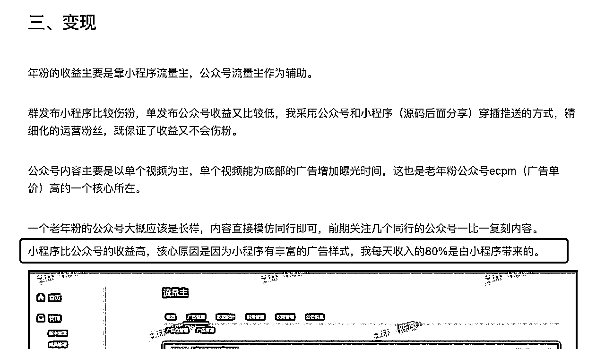
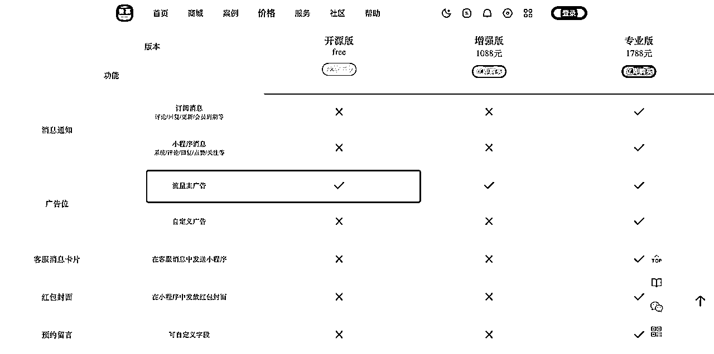

# 公众号流量主如何有效扩大收益？一个可行路径：内容小程序+私域

> 来源：[https://t88igkhvrr.feishu.cn/docx/FqTFdoyhaotUsxxJzQUcVb0Lneb](https://t88igkhvrr.feishu.cn/docx/FqTFdoyhaotUsxxJzQUcVb0Lneb)

最近在星球看到不少圈友晒公众号流量主的收益（比如花猫老师），恭喜取得了好的结果。 今天抽点时间，写一下我的理解，以及分享下，如何扩大收益。

事情缘起，有个网友从微信搜一搜看到两年前我发的一篇如何提升小程序的流量主收益的文章（星球里这篇，百赞贴），说想让我优化下他们的产品。 他这个事情是存量里扩大收益。 而如果你在公众号上拿到了流量，正在躺赚流量主广告的收益，内容小程序+私域 或许是你的增量。

先说明，我这篇是面向已经可以从公众号拿到流量的人，，若是新手玩家，先从平台搞增量吧。

* * *

捋一下逻辑，我部分引用咱们星球的内容，完整讲述下这是可行的：

#### 1、为什么流量主能够拿到收益？

其实一开始我也很纳闷，公众号那几个广告位只是贫困线，怎么有这么大的收益呢？ 原因是整体流量涨了。延伸一点，你去看看腾讯新一季的财报，广告收入（2023 二季度，腾讯网络广告的增速超过整体行业水平，营收同比增长34%），视频号广告收入占比 12%。平台广告收入多了，才能给流量主多分一些。

本质原因呢，请看亦仁这篇分享：「微信重新进行流量分配拯救文字生态的决心，那是非常巨大的流量变化。」https://t.zsxq.com/119Pu3QrR

从产品层面我能看到的是：

*   公众号的文章的相关推荐：公域推荐这是核心曝光的增长点。

*   微信看一看：更多小号能够出爆款了。

*   微信搜一搜：更多用户覆盖面，用户习惯养成后的频率提升。

#### 2、流量主收益稳定吗？怎么突破

靠推荐算法的都不稳定。 那怎么提升稳定性？稳定的流量 = 相对稳定的收益。 拆解下去：选题 + 量大 + 更多触达。

*   赛道与选题，毋庸置疑。

*   量大：以数量对抗概率，请星球索引站自行搜索，短视频赛道的朋友可太熟了。

*   更多触达：

*   把粉丝想办法导到微信个人号。

*   有更多的触点。解法不止是小程序。可偏偏小程序可行 ↓

#### 3、为什么内容小程序可行？

从广告机制层面，一篇公众号能插入的文中、文末广告，广告位有限。小程序的机会多多了，尤其是丰富的广告形式：插屏广告和激励视频广告，还有保底的封面广告。 这 3 个为主。

如果以同等的曝光量，小程序广告的收益是公众的 5-10 倍。

成功案例 >> 圈友@程序员田同学 的这篇《三年探索，我通过流量主每月被动收入超5w，历程分享》 ，他提到：小程序比公众号的收益高，每天 80%的收入是由小程序带来的。

#### 4、光有小程序还不行，得有流量入口啊~

*   流量入口来自公众号。——很可行，公众号里再附加小程序卡片。小程序带来内容更多阅读和二次转化。

*   流量入口来自朋友圈。—— 可行，小程序同样可以一键转发到朋友圈。

*   流量入口来自微信群。—— 可行，比如上面田同学分享的老年人赛道粉丝群。

*   流量入口来自私聊推送。—— 可行，但定向推送的精细化要求高。

*   流量入口来自微信订阅。 —— 不太行。

#### 5、怎么样拥有一个内容小程序？

市面上有很多，开源或者不开源的。 我推荐咱们一个老圈友的公司做的 微慕 小程序。（请谷歌自行搜索）

他是基于 WordPress 的，这个很简单，WordPress 一键生成一个内容小程序。 流量主广告功能，这个是免费的，开始时直接用开源版。 —— 官网有很多已上线的案例。

#### 6、内容小程序怎么玩？

99%的人不知道，激励视频怎么和内容小程序挂钩在一起？ 答案是内容加锁。 有些精华内容，比如攻略什么的，可以让用户通过查看一个激励视频才能解锁 —— 激励广告收益就来了 ，ECPM 你猜猜有多少？。 而这个功能 微慕 就支持地很好。

*   插屏广告呢？很简单，核心页面页面插入就可以。可以一键开启。

*   Banner广告，文章里自带，可以和公众号文章一样插入Banner 广告，广告加载也是自动的。

*   封面广告：满 1000UV 访问小程序，即可开启。目前的 ECPM 能够在 千次展现 10-20 元人民币左右。

#### 7、小程序流量主如何提升收益？

请看我这篇【小程序流量主高效变现，你不得不知的七大招】 https://t.zsxq.com/11xJsGXWM

讲的很透了，时过境迁，逻辑不变，个别形态有所迭代罢了。

#### 8、总结

总结下：收益扩大的可行性在于内容小程序可以给到更多的广告曝光和丰富的广告形态提升了单用户收益，但光有小程序还不行，小程序的入口问题要靠私域的积累来解决。

| 事项 | 解决方案 |
| 公众号 怎么转内容小程序？ | 公众号同步到 WordPress 有第三方工具。 |
| 内容小程序 | 微慕 小程序 - WordPress 方案 |
| WordPress 内容站 | 国内小程序上线所必须的： |
| 内容选题 | 内容平台，跨界选。 抖音、公众号、小红书等第三方数据平台 |
| 文章撰写 | 人工编辑 + ChatGPT-4 / Claude2 |
| AI 铺文如何自动发表公众号 | ！！有需求，待调研。RPA 或 API 打通， 技术上可实现。 |

以上，希望这个分享能够给你带来一些启发。感兴趣想实践的，可以按上面说的去试试。了解小程序的人做起来还是很快的。有什么不懂的，欢迎在生财知识星球评论区留言，我知无不答。 回到生财有术的帖子>>

祝各位流量主大爆。

三林

2023.08.23