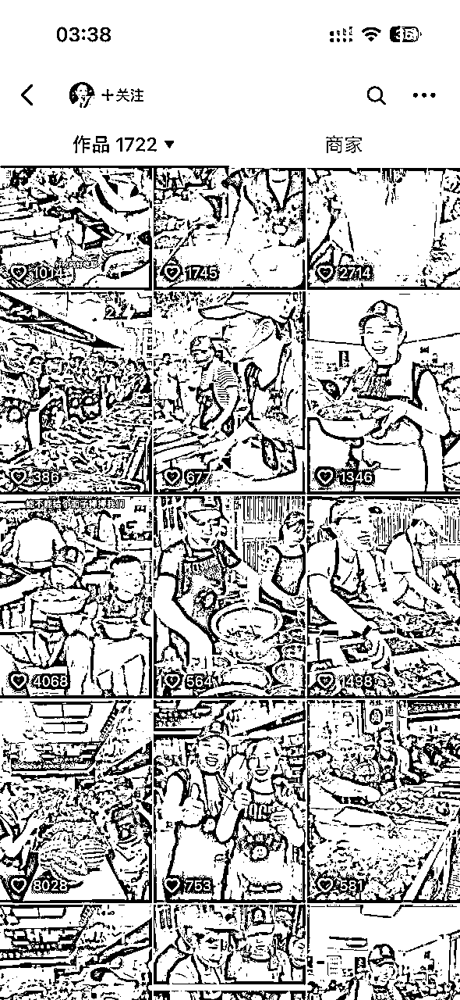

# 普通人如何通过用抖音做餐饮招商实现月收入10w

> 来源：[https://wtvb8cz8nx.feishu.cn/docx/GjY2drjzDobhYcxvpDYc542QnMg](https://wtvb8cz8nx.feishu.cn/docx/GjY2drjzDobhYcxvpDYc542QnMg)

大家好，我是铁柱，97年南方小伙，也是生财三期的“潜水运动员”；最近有幸被鱼丸老师看见，和圈友们聊聊我在做的一个事情：通过抖音帮餐饮门店做招商（收加盟或者学员），22年9月底和门店确定合作后，10月陆续开单，11月实现一个月成交35家，变现100w，这100w不是个人净利润，还要与品牌方分润！之前没有从事过餐饮行业，没有什么特别专业的认知，完完全全就是试跑了好几个餐饮案例总结出来的落地的招式动作，上手直接用就行了，本文附带我们运营这个项目所有【工具表单】，接下来给大家详细说说：

目录：

一，如何拿下餐饮爆品（选品，找品）

二，流量运营（内容文案，起号投放，拍摄剪辑，直播引流）

三，转化成交

四，个人项目操盘心得（个人当时所处的阶段，为什么能做成）

先大概讲一下我们项目运营的核心逻辑，就是找到已经完成0-1的火爆品牌门店或者地摊去合作，一起通过抖音我们去把利润做大，帮助品牌/摊主去获取B端市场客户，做招商，收学徒。按分工去看，可以分为三个部份，前端流量-中端转化-后端交付三个方向。

这篇帖子写到一半的时候拿去给鱼丸老师看了一下，老师问了我一个问题，卡点会是什么？我觉得整个项目的难点卡点在两个部分【拿下爆品】和【账号起号】，选品本身就是这个项目的门槛了，待会可以细看我选品板块内容，人都是趋利的，你的品本身赚钱，直播场景塑造和现场成交会非常丝滑，有的都不需要上任何话术；

说到【账号起号】，做过抖音的朋友都知道，抖音是概率游戏，起号是对抗概率的过程，个人觉得目的是完成线上和客户基本信任关系建立，我们做的基本上两三周，做的慢的可能需要一个多月时间，这里可以详细看，方法论适用于很多行业起号。

为什么说这两个板块是关键？选品，我们相对可以把控的环节，好的品就像ipone不需要销售，自然有大批的咨询，再到大量的购买；起号，完成的好完成的快，咨询数据跟得上，客户决策就很爽快顺滑。另外，有朋友会好奇这个项目【流量】和【客户资源】哪个更重要，两者不是相互衍生的关系，我们接项目是深度合作的，刚刚开始的时候只会做流量，是没有客户资源的，这个是我们先做起来【流量】才有的【客户资源】

说回我们的主题：我们找到好的品牌或者摊主和他洽谈利润，分润底线是55分，我们做前端流量转化，品牌或者门店摊主做交付。展开聊聊：

图一，单场直播数据54分钟10w场观

图二，单日账号咨询500+

# 一，如何拿下餐饮爆品

## （一）如何选品，或者说，选品标准是什么？

### 1.先看看我们手上的几个品

1.牛肉粉，门店，单店100平，一天2w营业额

2.肉夹馍，地摊，一天9000-13000营业额

3.豆沙凉粉，门店，单店40平，一天1.5w营业额

### 2.选品标准

在此前，我们还做有很多，包括卤味，包子，芋泥小吃等总结出来的三条选品标准

1.成本上看，门店建店成本15-20w左右，地摊开摊成本3w-5w以内

2.营业额上看，60m²-80m²门店单日营收过10000，地摊单日营收6000以上

3.利润率，毛利60%，效益可以做到45%以上的

总体来说，就是投资少，利润高的门店摊点就是我们的合作目标客户，如果说什么都不会看的情况下，最关键一点，在门店蹲几天，看他的人流和流水单号，排长队的这种品一般可以多多留心看一下！

## （二）如何找品

找品板块我们分三部分，线上，线下，以及收集信息。

### 1.线上

①可以通过抖音或者小红书直接搜索，相关关键词“xx排长队的店”“xx十年老店”“xx排队打卡”“老店美食”去浏览不做任何筛选，去看出现频次高的门店

②搜细分品类。例如，xx卤味，xxx串串等等

③按照地区商圈搜索，例如，南宁平西夜市打卡，南宁中山路火爆门店等等

### 2.线下

线下找品就比较直接了，一共有两种方式：

①抖音或者小红书搜索本地夜市本地商圈，例如“南宁多少个夜市”找到以后可以知道个大概，本地有多少条夜市，直接去搜索就可以了，然后就去扫街，这里扫街也不是盲目去看每家都去品尝，直接选一家你认为看着不错你想去的店走进去消费就是，考虑成本，可以选那种热狗火腿甜品的，客单在5-10以内，然后买的时候去问“老板，我是带外地朋友过来的，咱们这条街有没有特别火爆的门店”问得个两三家基本都会有一些答案。

②找抖音达人，美团线下拓店的朋友，如果说你有这方面资源是最好，她们是接触门店最多的，请朋友吃个便饭基本能问个七七八八，我们的一个品就是这么来的。

### 3.收集信息

再确定了几个品以后我们需要了解门店/地摊哪些信息？【详情看表】

另外很重要一点，就是品牌招商最好有招商资质，特许经营相关证件等等，市场环境是存在恶性竞争的，你做的小还好，但做大了，在当地要是动了谁的蛋糕，迎接的就是各种找茬！另外就是门店卫生也要严格标准提醒你的合作伙伴，被好事者拍下来传到抖音小红书会有不必要的麻烦。

# 二，流量运营

## （一）内容文案

### 1.内容方向有哪些

账号一定要有四类视频：

①置顶视频

第一条讲述品牌创始人的故事，一般采用“十年体”，按时间节点记录人生大事件，抖音可以搜索得到很多这类的视频，关键词输入“一个创业者的十年”“一个xxx的十年”选择半年-高赞，扒文案下来结合创始人自身修改一二就可以拍摄使用了

第二条讲述门店摊点品牌的故事，说我们的用料，卫生，服务，开了多少家，有什么背书（餐饮老字号）等等，主打就是“秀肌肉”，描述我们用料讲解，秘制传承味道，客户爆满，品牌奖项背书。

第三条视频可以有两个方向，其一是去讲述我们去走访加盟门店，学员摊点等，目的是为了展示——你跟我加盟/学习一样可以做的很好，其二可以是最近投的火热的一条视频。

综上，为了让用户知道，你这个人靠谱，你做的事靠谱，跟你一起做能拿结果。

（用作展示，为排除账号引流嫌疑打玛）

②人设视频，是为了让大家通过抖音了解到的你，是一个活生生的，丰满立体的人，这个是我们成交链路丝滑的必备因素，主要就是展示：

表达观点（描述价值观，你怎么看待xxx事件）

生活细节（事业家庭，照顾孩子等等）

节日员工福利（最近端午节送粽子）

人品过硬（父母生日送礼，如何对待贵人，对合作伙伴）

③专业视频，像做知识付费的IP一样，我们的内容要描述清楚一件事情，我们在做餐饮的这件事上，我们是有经验的，我们是专业的：

描述你怎么带团队，减少员工流失率；“我的十年老员工”19岁员工成了我分店最大股东”

描述你产品制作流程用料，其中过程步骤简化，或者展示一部分“30秒教会你怎么做一份xxx”

描述你走访门店，给门店做培训，和加盟商沟通

描述你对餐饮的看法（选址，促销，拉升复购），对产品的看法等等

④营销视频

讲清楚模型店的投入成本是多少，利润是多少

看当日门店营业额，看门店火爆盛况，看门店学员学习

讲门店产品卖点，十年老店，投资小回报快等

不经意的炫富最有杀伤力，你在豪车里给大家描述餐饮相关内容

### 2.流量文案

我们的文案是根据我们的账号变现目标画像决定的，我们的文案是写给这群人看的，要讲的是她们感兴趣的，她们关注的，她们争议的内容。

账号变现目标是收学员，还是收加盟；地摊收学员，可能就是3-5w投资的小微个体户，收加盟，则是10-20投资的中小型老板；再说直白些，选用这类文案的目的是为了获取流量，抓到爆款，就是在不看出镜IP的情况下，谁讲谁都爆。

怎么找？

①从对标账号上面摘抄高赞视频，对标账号怎么找，下一节【起号投放】板块详细会说

②从爆款选题来，操作如下：

a，抖音搜索相关关键词：卤味学习，卤味加盟，餐饮加盟，创业认知等，

b，先看【用户】，优先筛选看人名的个人IP号，进他的主页看他的高赞视频

c，点击视频-漏斗符号-最多点赞-半年

③通过对标账号和爆款选题来，用轻抖小程序提取文案

a，找到想要的视频点击转发键

b，点击复制链接，

c，微信直接搜索小程序“轻抖-视频提取文案”—粘贴链接—点击【一键提取文案】即可

④每天收集5条，保证文案库每天新增五条文案

## （二）起号投放

### 1.测账号

①和品牌老板确定合作以后，拿到2-5个手机号，测试哪个手机号注册的抖音账号流量高一些，抖音是个概率游戏，有的手机号注册的账号天生的流量就挺好，一般一个账号一天剪3条发.发个三天就看的差不多了。

②发布的时间，11：30——17：30——20：30，这是我们跑出来的发布作品爆款概率高的时间点，大家依据各自品的不同可以测试时间

③为了能够采到更多样本测试账号，我们采取混剪的形式：

文案：励志正向的餐饮餐饮文案，附带100条混剪文案，自取，文案来自网络整理。

拍摄素材：

a.横向：门店开店整个过程，选址-装修-试业-营业

b.纵向：开店一天所有的动作（开闸门，拿下桌椅，准备好肉，小菜，清扫，倒汤，切菜等等）

c.重点拍摄：产品，人流，出镜IP的动作

音乐：这里选取音乐围绕一个原则，就是曲调匹配年纪，我们的客户大部分是30以上中年人，这类群体喜欢什么样的曲调，可能就是偏向80后的调调。（这里就不附文件了，可以去搜80后老歌曲，要那种耳熟能详的，）当然了也可以找到餐饮混剪账号直接抄，提取他的音乐这样也可以。

### 2.找对标

一共是四种方式可以找对标账号

我们总体要找的是什么样的账号：

a粉丝体量10w左右；

b高评论的，看账号质量最好的方式，看评论区有没有咨询的“想要学习”“想要加盟”

c最近新做的账号，看他最新的视频。那种停更很久的没有对标的价值

d账号优先看同城本地或者同省份，相邻省份的，这样过来考察效率会高很多

①关键词搜索，输入品类，直接搜用户可以看到相关账号

②关键词搜索相关话题，查看同领域高播放量的话题，点击话题，话题下面有很多数据好的视频，从而找到对应的账号

③小三角搜索，按照前面①②会找到一些账号，假设我们找到这个二姐姐卤味，然后再【关注】按键旁边有“▼”点

下面有的你可能感兴趣，这里也会推送一些精准的同领域账号

④关键词搜索“创作灵感”，点击创作灵感进去搜索你这个行业，品类相关话题，举例如下：然后可以看见有相关用户和相关话题，延申再进行搜索浏览。

### 3.如何投放

有两张投放方法，这两种方式我们都自己试跑过，都是论证成功起跑过的，大家可以交替使用。

第一种，

0-1000粉；选择——24小时，对标达人，点赞评论，多给系统时间去找到喜欢你这个内容的真实用户

1000-10000粉；选择粉丝量

10000以上，投智能推荐，或者账号速推

第二种，

先把账号标签拉起来，每条100，全部投放自带项目的餐饮播主，像上面搜索的“二姐姐卤味”这个类型是具备

0-5000粉；选择——6小时，点赞评论，投50w粉丝以上的，时间少就要投粉丝量高的

5000粉以上，投餐饮项目评估型博主，每条100，投到不划算为止。

## （三）拍摄剪辑

这个板块其实不用多说，相信圈友们对基础的拍摄剪辑还是没有问题的，只是讲了我们拍摄剪辑过程中一些注意点

### 1.拍摄

1.不管是手机还是相机拍摄，请首先保证画面稳定，不要抖动，光线良好，人物清晰，如果达不到这些请重新拍。

2.拍摄纯口播内容最忌的是一成不变的固定镜头，最好有多个角度近景中景全景，增加画面的节奏变化感。

3.内容主旨注重真实，可以不用打光自然拍摄，但如果要追求画面精美，请务必打光，主光，背光，轮廓光统统安排上。

4.收音可以不用外接录音设备，但一定得保证声音能够听得见，听得清晰。

5.由于每次拍摄的场景、光线环境角度不同，所以每次拍摄都需要重新调整画面声音，而不是说只用一个调节预设直接套用。

6.如果感受到自己拍摄的内容不够顺畅，请务必重新拍摄一条，不要等着后期剪辑。后续只能剪辑节奏，感情是剪辑不了的。能前期解决的就不要交到后期。

7.用手机拍摄的时候，横屏拍摄时尽量看摄像头。竖屏拍摄时看画面中的自己，这样会显得更自然。

8.想要画面更有质感相机是唯一的选择，不要想着用手机能媲美别人几万的专业设备。

9.拍摄要注重细节但是又不能太注重细节，有些时候真实的错误往往更动人！

10.专业的拍摄尽量交给专业的人，不要一人全部兼顾。一个人是不可能干得过一个团队的！但请珍惜单枪匹马奋斗的日子。

### 2.剪辑

1.剪辑完是否比拍摄原片的效果要好，如果没有的话请辞掉你的后期工作，你没有存在的意义了。

2.好的剪辑应该是突出想要表达的内容、价值观和情感，而不是一味的加各种花哨的转场以及贴纸滤镜。

3.剪辑视频里面有没有多余无意义镜头，就是这部分如果拿去视频的表达主题也不会受影响，如果有请立马删除，多不得一秒。

4.剪辑后的内容和视频节奏以及配乐是否高度吻合，如果不吻合的话，请耐心调整。

5.剪辑的字幕是否有和画面出现声画不同步的情况，是否有噪音，人声还有背景音乐是否在合适的节奏配合的很好？

6.剪辑的思路和逻辑是否与内容脚本创作思路逻辑一致，是锦上添花还是过犹不及。

7.剪辑结果是否有高潮和低谷，是否能调动用户的情绪？是否有突出内容脚本所要突出的高潮点？

8.分辨率、帧率、视频的码率，还有格式是否设置正确合理？是否在视频号平台上能够完整无压缩地播放？

9.针对爆款内容是否有考虑提前准备多个版式，多个剪辑节奏发放。

10.是否有建立爆款音效的素材库，爆款片段的素材库。没有请尽快建立，可以快速提升剪辑效率。

### 3.注意要点

1.拍摄镜头主要突出产品和人流

2.出镜IP的情绪表达是我们需要引导提升的，因为出镜IP常常是品牌老板或者亲近的人，很少有IP上来就很给力的表达，如何引导就是聊他的故事，开店之前做啥，遇到什么心酸的故事，愤怒的事，，无奈的事，总的来说就是“过去经历+情绪”然后再让他拍口播语言表达会好很多

3.像素级模仿对标拍摄，镜头景别，视角方向，场景，人物动作，文案排列

4.出镜IP选择能用女的就不用男的

5.剪辑这个东西拼网感，同样素材，有网感的剪出来的作品就是有流量的，他的配乐，他的节奏。

## （四）直播引流

### 1.设备

手机+麦克风

### 2.直播场景

场景我们会选择出摊开店营业实景，主要就是在人流集中的时候，如果是主食快餐，可能中午，下午是人流集中的时候，如果是小吃，可能是下午五点到晚上这样，如果是早餐那毋庸置疑就是早上了。

### 3.直播讲解

在这里还要特别感谢我们生财这个平台，我就是在生财有了对直播的第一次理解，这份航海手册对直播已经讲解的很清楚，家人们，生财真的是yyds，执行到位，真的每个月多个小几万真的还是比较简单的！为了大家方便查阅附上航海手册链接————

生财有术

### 4.关于项目的重点直播技巧

①刚刚开始拉直播间的时候一定要做鱼塘号引导互动，说简单点就是有水军提问问题

②开播前半小时发一条视频，大概告诉用户粉丝我们开播了，标题留得冲突一些，开播场景一定是在人流集中的时候

③做好卖点提炼和品牌方对接好加盟学习政策

④按照福袋时间引导私信咨询，如果是企业号可以上小风车

⑤资料留钩子''如果想了解我们项目成本情况的，点击右上角头像关注一下，私信主播给大家发一份详细的项目手册"

⑥福袋设置口令，“怎么开店”“怎么学习”“人好多啊，怎么合作”诸如此类的

⑦注意不要连麦，会有竞对捣乱，有连麦情况可以直接让他打在评论区或者私信后台告诉他，我们下播了回复

⑧整理出属于这个项目的各个话术，互动，留人，塑造产品，留咨话术等

⑨除了直播间互动留人需要我们做，另外就是引导关注也很重要，可以说一下“有在找市场机会看项目的老板可以关注一下，每天中午十二点准时开播带大家线上考察线上了解”

⑩投抖加上热门加热直播间，选择100-人气-智能推荐-选择视频加热直播间（这里选择你再跑dou+的作品、最新一条在跑的视频、评论高的视频等等）

另外值得提一下的就是直播间需要

# 三，转化成交

在拿下一个品之后，这个品所有的加盟客户都和我们有关系，线下门店摊点必须放我们的二维码，方便客户管理，品牌老板只需要做好收钱和交付就可以了。

转化成交这块应该是我们整个执行环节相对轻松的了，为什么这么说，因为前期我们把控好了选品关，品牌力强的情况下，大家慕名而来，转化成交的所有流程里面，我们只需要做好【问题解答】与【私域运营】两个动作就可以。

## （一）问题解答

针对我们选择的合作的品，梳理好下面内容《加盟客户常见问题》

## （二）线上运营

1.标签化管理

对每个进线客户，我们会做好标签处理，了解他是哪里来的，主要就两种，其一是线下门店扫码，其二来源于搜一搜添加，就是我们账号进来的客户

2.客户备注

我们一般是采用日期+地区+姓名，举例：“0516深圳陈总”

3.客户描述

记录今天聊得客户：

从事什么行业，是否餐饮相关

收入情况，有没有实力升级代理

有没有门店，需要快速跟进的

意向度，意向度好的认可度高的就是我们追访重点

有没有吃过产品，是否自己管理

4.朋友圈塑造

# 四，项目心得

(一)坚持执行，刚刚开播的时候我们数据也不好，就几个人，十几个人在线，一路咬牙坚持才做到十万场观

(二)选好的品，找对的人，宁愿刚刚开始的时候花心思做筛选，如果你品不行，后面做起来真的很吃力，还拿不到结果。找对的人，就是合作方，因为他的配合非常关键，决定了项目交付，决定了这个品能走多远。

（三）开局就打王炸牌，拿下品以后心思精力就应该扎进去，上自己最好的条件，用专业的人做专业的事，虽然前期一个人也可以做完，但是非常累，能外包的我们尽量外包。无非就是聊清楚利润就可以了。

（四）所有项目执行环节数据，按日复盘按周总结调整。

最后，特别感谢生财里两位贵人，第一个是带我走进生财的钱南老师，95后的执行力拉满的时候原来可以这么牛逼，在需要帮助的时候，钱南老师会非常耐心的给建议和帮助，都是十分落地的那种；另外一位，就是我们生财扛把子涛哥，这男人yyds，去参加了涛哥的线下，真的醍醐灌顶的感觉，对我创业路上影响深远，太爱生财了，家人们！