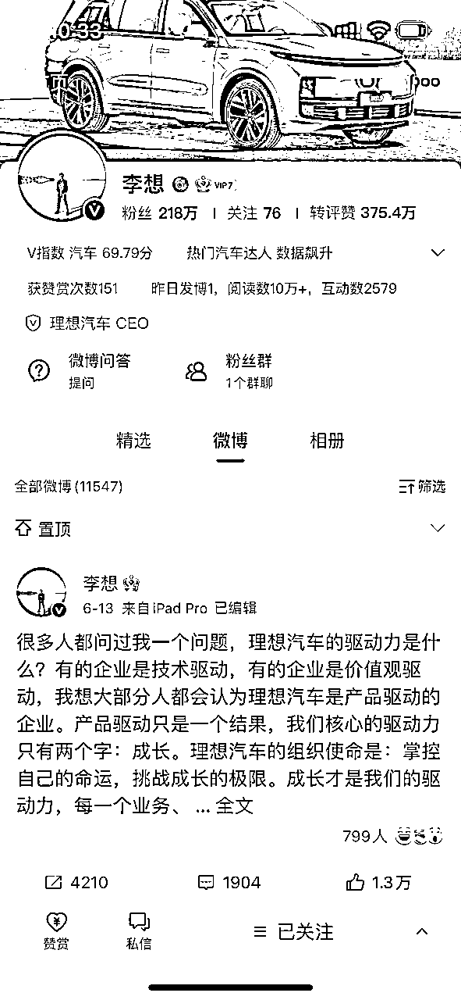
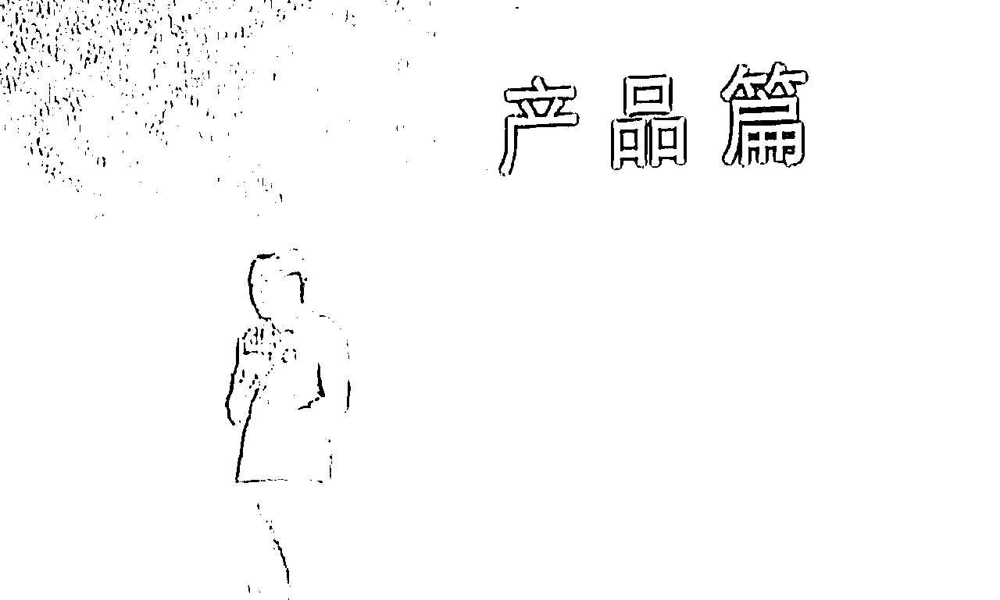
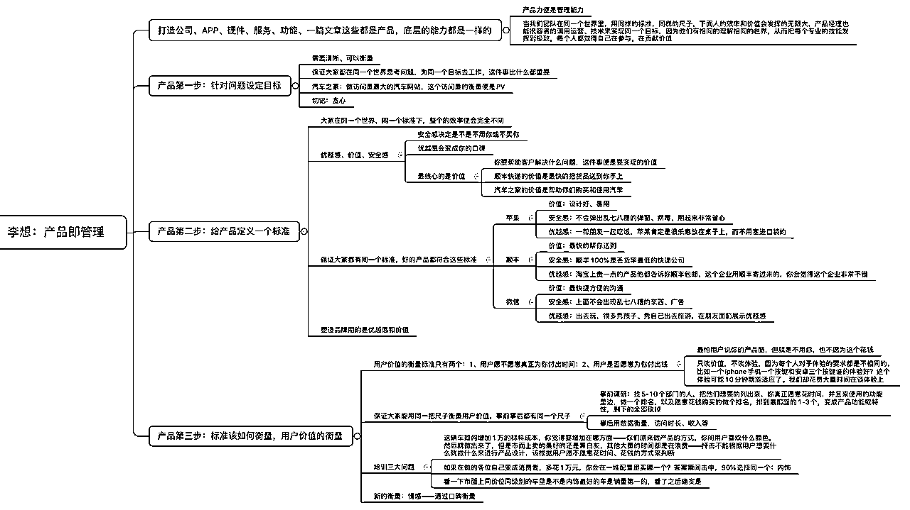
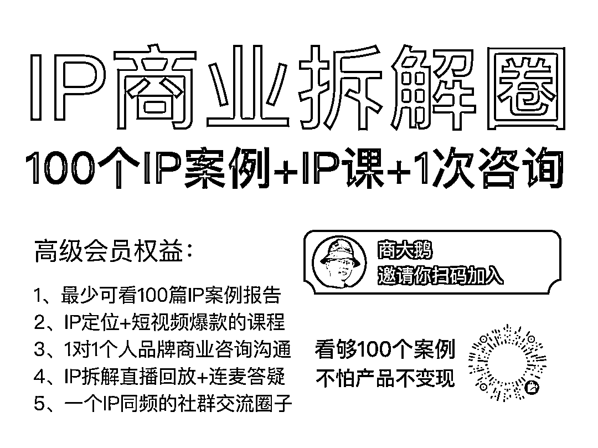

# 拆解60：理想汽车CEO李想！创业过3次他在创业初期是如何思考产品的

> 来源：[https://a8zj6ow7gh.feishu.cn/docx/ImcjdKl4oozj1AxAunXc566Xn6c](https://a8zj6ow7gh.feishu.cn/docx/ImcjdKl4oozj1AxAunXc566Xn6c)

#### 更新日历

2023年7月16日添加了理想汽车CEO李想的拆解！

#### 为什么要拆解李想？

推荐理由：

理想汽车在网上经常被黑，但销量却特别好，而它这一切都来源于理想公司的CEO李想。

相比于网上各大自媒体的众说纷纭，我对理想汽车一直有好感，根源在于我多年前看过李想关于产品的演讲视频，价值之高，直到我现在回忆起来，都印象深刻。

一个CEO最厉害的本事其实是在关键方向上做出了正确的选择。

而正确的选择来源于日常的思考，我们这次就来看看李想早期对产品的思考是怎么样的。

拆解目录：

一、介绍：李想的情况介绍

二、产品：李想关于产品的方法论

1、做产品的1、2、3步

2、该产品方法论的案例

3、汽车之家怎么做起来的

三、学习：我们普通人从中能学到什么

拆解人：商大鹅

#### 李想的情况介绍

我们先放一个李想的视频，让你感受感受他的逻辑：

李想作为创始人IP，他宣传的主战场在微博：

218万粉丝的他被长城汽车总裁穆峰在2022年的时候称作“微博之王”。

李想在微博中非常活跃，几乎每天都在高强度的上网冲浪且内容均与理想汽车的相关，内容小至理想汽车的具体零件产品，大至理想汽车的品牌形象，既有与网友的高强度对话，也有产品形象的高度塑造。

而我认识李想是一个很偶然的机会。

好多年前，在混沌大学看了他的演讲视频，一时间惊为天人，是一个把产品价值以一种独特的视角说出来的产品经理，甚至把他称为最厉害的产品经理也不为过。

当年我还把他的演讲内容还做了脑图放在了我的珍藏夹里。

以至于我对理想汽车的感官都很好，我认为一个对产品价值、用户价值理解得如此之深，并且受到此巨大激励的产品经理，做出的产品一定也很棒。

果不其然，现在理想汽车的成绩也说明了一切。

对于这类做到一定程度的名人，如果要拆解他的话，并不需要太多修饰和解读，直接展示他们最犀利的思考才是原汁原味且最宝贵的财富。

所以我就看了他近年的演讲，每一个其实都有巨大的价值，如果要通篇展开的话，我觉得没有10万字根本下不来，但这样的话，你不一定有耐心看完。

所以我结合了大家初创的情况，特意选择了他在混沌大学有关初创期大家都可以使用的关于产品上的思考呈现给大家，相信这部分会对大家做产品会有非常大的帮助。

在正式开始之前，我稍微给大家介绍一下李想：

他在1981年10月出生于河北石家庄，80后企业家代表人物，先后创立泡泡网、汽车之家、理想汽车。

李想的父母毕业于中央戏曲学院。李想在高中时代就开始接触计算机和BBS，并对此产生浓厚兴趣。

高中时，1998年还在上高中的李想就开始做个人网站，通过给IT类媒体供稿、运作个人网站，李想已经获得不错的收入。出于对互联网和IT的热爱，他决定放弃参加高考，选择创业，并获得了父母的支持。

你没看错，乔布斯和比尔盖茨是大学辍学，而他高中就辍学了。

别人曾经问过他：“你为什么没有读大学？到底是学习成绩不好，还是什么原因？”

李想曾解释道：

我认为自己有一个很好的能力，就是比较会做选择。其实我在这个高考之前，我做个人网站，包括给媒体写稿，然后已经做了接近三年的时间，所以高三的时候我就面临一个选择。对，因为在高三的时候，我的个人网站每个月的收入就超过1万块钱，最高的时候一个月大概 2 万多，接近3万块钱，那时候收入其实已经很高了。

我爸妈发现我的每个月的收入是他们俩加起来 10 倍以上，所以当时我就面临一个选择，因为你也知道石家庄不是一个高考很牛的一个地方。我们学校最好的也几乎没有什么考上清华北大的。所以当时我就有2个选择。

第一，我可以把我的事情继续做下去，做得更大更好。

第二，我可以去考一个很一般的大学，未来可能还会面临找工作这些问题，而且找的工作也不一定有我当时做的工作更有价值，学的东西更多，赚的钱更多，所以当时这个选择很容易做出了。

因为我做选择的时候都特别简单，我做选择的时候只关注自己，从不关注别人。

其实很多人会担心父母怎么去想，那我觉得父母比较好，因为父母看到我没有学坏，这真正在做东西，而且身边的这些朋友，然后买电脑什么都来找我。

另外一方面，我的收入是通过农行寄的那种汇款单，我都让我父母帮我去取钱，那个钱也是确确实实能看得到的。当然还有一个点是和我们当时的大部分家长不同，就是我爸妈都是大学毕业的，因为他们是中央戏剧学院毕业的，所以他们不像那个年代的大部分家长那样因为自己没有上过大学，他们把上大学的所有的愿望然后放在了孩子身上，而我爸妈都上过大学，觉得大学有那么回事，不上就不上了。

2000年，李想注册泡泡网并开始运营，仅凭借着自己对IT产品的一腔热爱和滚雪球式的资本积累，高中学历的李想让泡泡网在中国互联网行业中独树一帜。2001年下半年，他从石家庄来到北京，正式开始泡泡网的商业运作。

泡泡网是中文IT垂直网站领跑者之一，后被盛拓传媒收购。

2004年年底，李想启动汽车之家的筹备。2005年，李想带领团队从IT产品向汽车业扩张，创建汽车之家网站。当时，汽车类网站有上百个，竞争激烈。在没有任何推广费用的情况下，汽车之家凭借中立客观的内容以及在数据库、实拍图片等方面的创新，用不到一年时间，进入国内汽车网站访问量前五名。

2008年，汽车之家流量超过所有汽车垂直类网站，成为行业第一。2012年底，汽车之家实现了月度覆盖用户8000万。

2013年12月11日，李想带领汽车之家在美国纽约证券交易所成功上市。以收盘价30.07美元计，李想身价过亿，约为1.52亿美元。

2015年6月，李想卸任汽车之家总裁，保留董事股东一职。

2016年9月，辞去汽车之家董事职务。

内容驱动模式为汽车之家节约了大量流量购买成本。汽车之家现已成长为全球访问量最大的汽车网站，它的盈利能力也是中文汽车网站中最强的，2015年净利润达到11.031亿元人民币。

2015年7月1日，李想创办车和家，后公司更名为理想汽车。

2018年10月18日发布理想汽车的首款产品理想ONE ，是一款智能电动中大型SUV，该产品2019年11月20日开始量产，2019年12月开始向用户交付。

2020年7月30日，理想汽车在美国纳斯达克挂牌上市。

截至2021年5月底，理想ONE已经交付超过5万辆，用时仅17个月，创下新造车势力最快交付纪录，并在2021年5月25日，2021款理想ONE正式上市。

2022年6月21日，理想汽车正式发布家庭智能旗舰SUV理想L9，并于8月开启交付。

2022年9月30日，理想汽车正式发布家庭六座豪华SUV理想L8，并于11月开启交付。

2022年12月，理想汽车单月交付量首次突破2万辆，理想L9和理想L8交付量均超过1万辆。

2023年2月8日，理想汽车正式发布家庭五座旗舰SUV理想L7，并于3月开始交付。

接下来我们来看一下李想在2017年在混沌大学所做的关于产品的思考。

#### 李想关于产品的方法论

下面正式开始李想关于产品部分的演讲：

在过去的两年，所谓的创业热潮、热潮互联网思维、互联网+的这么一个时间段里，然后出现了一个非常不好的现象，就是一大堆然后完全不懂产品的人，然后天天张嘴体验、闭嘴体验。

然后占满了媒体各种的篇幅跟大家讲如何去创业，如何去做产品。

那我觉得很不好的一点是把非常多的人然后带到了一个严重的误区里，也造成了其实在过去两年创业的失败率应该是有史以来最高的时间段。那么多的创业，那么多的钱投进去，其实真正出来的企业寥寥无几，那我觉得这是一个对于整个的社会的效率，是一个很糟的一个影响。

那到底什么是产品？

我觉得可能很多人在这第一个问题上，然后就直接遇到了问题。

什么是产品？这是我觉得每个人其实都应该去思考的，产品到底讲的是一个功能，讲的是一个体验，然后产品到底体现了我们什么样的一个能力？

基于我过去然后创业的经验的一个理解，我觉得什么是产品？

我觉得当我们去打造一个公司，然后打造一个服务、打造一个APP，打造一个网站，打造一个功能，甚至写一篇文章，它都是一个产品。

它最后对于我们的需求，对于我们的能力的要求其实都是相同的。

那更大的范围来讲，其实产品力不是一个技术能力，对，产品力是一个非常重要的一项管理能力。我觉得这可能和大家的理解有一个本质的不同，因为产品这里边最重要的真的是管理。而不是什么专业的技能。

当我们把产品当成一种专业技能去做的时候，很多时候各种各样的所谓的体验，所谓的刷存在感，一个步骤能完成的事情变成六七个步骤去完成，这种低效率的事情就接二连三的会产生出来。

所以我说什么是产品，那我觉得这是我们要理解的最重要的一点。

在座的各位，你认为做不出来好产品的最主要的原因是什么？我们列了 4 点，

第一是用户体验不好

第二是推广资金不够

第三是产品功能不满足

第四是产品目标不一致

OK，产品的第一步是什么？因为大部分我看到创业者，还有在做产品的人，然后往往缺失第一步，导致后边所有的事情都是白搭的。

##### 做产品第一步：针对问题设定目标

什么是产品的第一步？

就是针对我们要解决的问题设定清晰，然后设定一个目标，这个目标清晰可衡量。

为什么要这么做？

因为当我们做一个事情的时候，当我们做一个产品的时候，如果没有目标，所有的参与者都在不同的世界里去思考问题，因为每个人看到的世界都是不一样的。

我经常看到各种各样这种失败的创业公司到死为止，他们团队的几十个人，脑子里想的都是一个不同的世界，每个人在各自的世界里想，每个人都觉得自己在为这个企业好，但是这个企业居然到死为止，他们这个企业共同的目标是什么都没有讨论过，包括产品更是如此，然后经常看到产品会，大家吵得一塌糊涂，说，你的体验不好，我的体验好，你的功能不好，我的功能好，但是他们这个产品要达到一个什么样的目标从来没有沟通过。

我就拿一个公司来举例子，2008 年的时候，然后我当时还是汽车之家的CEO，我们合并了另外一家企业，也是汽车网站，叫车168。

合并进来以后，其实当时我们的流量大概是它的十倍以上，我们的访问量是它的十倍以上。

合并完以后我们就发现其实一个很大的问题，虽然我们两个汽车网站的员工人数差不多，但是整个的效率然后差了已经完全不止 10 倍了。

那怎么办呢？

我们在合并的时候就讨论第一个问题，大家要有一个共同的目标，要有一个共同的一个愿景。

当时是我来负责这个两个公司的合并，我就问车168的这些高层和同事们，我说车168的目标是什么？

他们统一的回答是说我们的目标，然后是要做最有影响力的汽车网站。

那接下来我又问了另外一个问题，我说你们的最有影响力指的是什么？

那这时候回答就五花八门了，因为每个人回答出来各自不同的答案。

有的人说，唉，我们要变得最专业；然后有的人说，我们要在厂商那里最有号召力；还有的人说，唉，我们这个要让用户感觉好，对我们评价好。

我说，请问你们每一个人针对你们的目标的理解都是完全不一样的，那这个目标在你们日常的工作中怎么去执行？

当我们遇到选择的时候，我们是保用户还是保客户，还是保我们所谓的这种影响力？这就完全没有标准了。

而汽车之家当时的时候只有一个目标，非常简单，就是我们要做访问量最大的汽车网站。

而这个访问量的衡量就是PV，你去问我们的所有的员工，每一个人，然后他的回答都是一模一样的，我们每天都在为同一个目标去工作。

很多时候我们人对目标的设定出问题，最大的一个原因在于贪心。

很多时候我们其实要解决一个问题，但是我们总是希望我们通过1个过程能解决 4 、 5 个问题，照顾到更多的人，但是最后的结果是什么都没有做好，然后整个的组织效率极为低下。

而在产品上更是如此，就是很多时候你问这产品要解决什么问题？

他说我既要解决A，又要解决B，还要解决C，我说简直就是胡扯。

这就跟一个新的企业，要同时做七个新的生态一个道理。

除非他是神，否则不可能做成。

那我们再往下就是，那当产品有了一个准确的目标以后，其实最大的好处是让我们所有的人、我们的团队、所有的人在一个世界里思考问题，因为这件事比什么都重要。

那有了一个大家在同一个世界以后，那下一件重要的事情是什么呢？

##### 做产品第二步：给产品定义一个标准

下一事情就是给产品定义一个标准。

大家在同一个世界，同样的标准下边，整个的效率和结果会变得完全不一样。

那什么是产品的标准？

我比较简单的进行了一个定义，就是其实只要三个关键词:

一个是优越感

一个是安全感

一个是价值

安全感决定了他是不是不用你和不买你。

然后优越感会变成你的口碑，变成你的品牌向外传播。

但这里边最核心的是价值。

那什么是价值？

就是你要帮助客户解决什么问题，这件事情就是要实现的一个价值。

比如举一个最简单的例子，那我们最了解的一个快递公司叫顺丰快递。

顺丰快递的价值什么呢？就是最快的，然后把货品送到你的手上，这就是个价值，非常简单，非常直接。

而我们每一个消费者对这个衡量也是非常简单的。

而汽车之家的价值什么呢？就是帮助你们购买、使用汽车，就是那么那么简单，没有其他的。

##### 做产品第三步：标准该如何衡量

那这时候当我们有了这个一个基本的一个标准以后，下边又来了一个很大的挑战，就是：

这个标准到底怎么来衡量？

就是用户的价值到底怎么衡量？

因为有的人说这个价值是个体验，然后有的时候这个价值讲的各种各样虚头巴脑的，但这个世界上其实对于用户而言的价值衡量其实只有两个：

一个是用户愿不愿意为你真正付出时间

另外一个就是用户是否愿意为你真正付出钱。

我们经常能看到很多讲产品体验的人，然后讲这些东西，讲那些东西你能看出它放的各种各样的抓图很酷，然后做的界面非常的炫，你经常会发现底下有人说，哇，这是做的太棒了，但是更可怕的是这件事情是说你说它很棒，你说它很酷，然后你说的很有诱惑力，但是你根本不用它，对你甚至连用它的兴趣都没有，然后你也不会去买它。

我觉得这是一个产品最糟糕的结果。

所以我们大概在 2008 年的时候，我们招来了一个刚大学毕业的产品经理，然后他在当时给我们的产品团队提出了一个非常反人类的一个观点和理论，后来他变成了我们的产品总监，变成产品的头。

他当时提出了一个非常有意思的观点，就是只谈价值，不谈体验！

而且我们一直这么执行的，就是我们在做产品的时候。

为什么呢？

因为每个人对于体验的要求都是完全不相同的。

举个最简单的例子， iPhone 的手机上只有一个按键，一个 home 键，安卓上有三个按键，普遍都是有三个按键的。

我就问一个问题，你告诉我哪个体验好？谁能证明哪个体验好？

没有任何道理！而且这个所谓的体验基本上 10 分钟就能适应了。

因为我又有iPhone，又有安卓，其实我没有觉得这个体验有什么本质的不同，我 10 分钟就能适应过来，所以我们大量的时间在消耗到所谓的体验这些方面，却忽略了价值。

那到底怎么来衡量价值呢？

其实特别简单，就是一个你要看你的用户能不能付出时间，一个看你的用户愿不愿意真正花钱来买你。

那很多人说，唉，因为时间好计算，我只要看我的访问量，或者看我的统计时间或者收入，我能看我的整个收入或者利润来衡量，这也很简单。

但是这都事后的衡量，我做完了以后的事了，这是马后炮了，我事前怎么来衡量？这又是一个最大的挑战。

但其实事前衡量没那么难，只不过大家把事前的做的所谓的调研方法用错了。

那怎么来做事前衡量呢？

其实我们去问消费者的需求，听市场的声音，其实最重要的是帮我们在做产品功能，在做产品需求的时候提供了可选项，但这绝对不等于最后的决策，因为如果我们把用户的需求直接搬过来就扔上去，我觉得你的产品会变得会差得一塌糊涂。

但是怎么在这些可选项里来选出来真正变成产品的呢？

其实有一个挺简单的方法。

就是我们找 5- 10 个我们企业不同部门的人，让他们坐在一起，把这些可选项都列上去，甚至把他们认为的可选项都放上去，然后接下来我们再做另外一件事情，就是让他们自己来选，就是如果你自己真正愿意花时间来使用的这些里边给我做一个排名。

如果你真正愿意花钱购买的这些功能里给我做一个排名，让这些人一起来做一个排名，然后最后排在最前面的 1- 3 个，然后变成产品的功能，变成产品的特性。

剩下的全部砍掉，全都砍掉。

因为你自己根本就不用，你自己根本不买的东西，你凭什么卖给你的消费者？凭什么让你的消费让你的用户去用？没有道理。

再举一个更现实的例子，就是在汽车之家，因为我认为中国的汽车行业其实遇到很多问题，然后最大的问题就是产品普遍做的都非常的差，然后拼命的往上堆功能，但是很多最关键的东西没有，所以当有了新的汽车行业员工来加入我以后，我都会带他们做一个很简单的一个训练，就是到底汽车应该怎么做产品。

我就先问他们，我说你们认为你们自己都会做产品吗？他们认为都认为自己很会做，那我一般就会接着给他们先出一个题。

这题是说如果我们这辆车增加1万块钱的报幕成本，就是增加我的整个材料的物料成本，然后你会把这个成本加在哪里？

我会叫一屋子的人来一起来讨论。那这个讨论基本上会写满一个满满的一面墙，因为我问的都是开放性问题，问的不是封闭性问题。这里边有的人会说我会加一个空气悬架，然后有的人说我希望把这1万块钱做成一个可变色的一个全景天窗，还有的人说我希望增加按摩座椅，然后有的人说我要增加 22 寸的轮毂，每个人说的能写满整整一黑板。

我说这就是你们原来做产品的一个方式，你们从身边人和从用户那里问到他们有什么样的需求，然后他需要什么样的颜色，然后你就按这东西做出来了。那最后你会发现你们卖的车最主要的颜色还是黑白银灰，你们哪怕出二三十款配置，最后真正卖的就两三款配置。

然后大部分时间都在用于浪费效率上。

你们为了做二三十款配置，你们一个座椅甚至会找四个供应商对，做长达 3 年的测试，而如果你只做一款座椅，然后找一个供应商，你只需要一年的测试就可以了，而且整个的供应链和整个的质量控制都会好得多。

那接下来我再会问他下一个问题，这才是真正的产品问题，我的问题是说，在座的各位，如果自己变成消费者，多花1万块钱，你会在这一堆配置里买哪一个？在这一堆选项里买哪一个？

很快答案瞬间集中， 90% 以上的用户、90%以上的这个员工都会做同一个选项，就是我希望把这钱全花在内饰上，买一个内饰最好的汽车。

那我接下来再问他们另外一个问题，我说那我们去看一看这个市面上同价位同级别的车里，是不是内饰最好的车是销量第一的，那我们看了一下几乎每一个级别，对，在每一个级别里，都是内饰最好的车销量第一。

因为大家在为外形上做出本质的差异已经很难了，但是在内饰上可以做出非常大的差异。

比如举个最简单的例子，在宝马5系、奥迪 A6 和奔驰E的竞争中，在上一代产品里，宝马5系销量遥遥领先，为什么呢？

然后因为宝马5系是直接把宝马7系的内饰进行了向下的移植。而上一代的奔驰E是把奔驰C的内饰进行了向上的移植。

所以宝马5系一个月最多的时候能卖到 15000 辆，而上一代的奔驰E一个月只能卖到两三千辆，还要优惠 10 万块钱。

而这一代的奔驰E发生了一个巨大的变化，这一代的奔驰E还要加价购买，每个月销量超过1万辆。为什么呢？因为这一代的奔驰E把奔驰S的内饰直接向下进行的移植。

我们去看任何一个级别，包括我们去看这个紧凑型SUV，去看这种紧凑的轿车，任何一个级别，然后排在第一名的，然后都是内饰做的最好的。

但是这就是我们中国汽车厂商所遇到最大的问题，就是他明明知道，就是他明明自己会买一个，内饰是最好的，但他们在做车的时候给内饰付出的成本是最低的。你很难想象你买了一个 10 万块钱的车，它的内饰的成本只有不到 2000 块钱，这就是最大的问题，他宁愿只用 2000 块钱，然后来打造了内饰，或者后面在市场上通过降2万块钱来进行促销，也不愿意再多掏两三千块钱把内饰做好。

这就是典型的我们做产品的错误方式，然后所谓的需求和最后真正变成产品的一个巨大的差异。

那我们也能看到，其实中国几乎绝大多数汽车厂商的员工有一个共同的特点，就是他几乎很少买自己做出来的产品，这就是我们看到的一个很有意思的一个现实。

所以这时候我们觉着我们怎么做好产品，其实事前事后都有了一个尺子，当我们所有团队的人在一个共同的世界里，在同一个世界里，我们有同样的标准和同样的尺子，你会发现下边的人的价值和效率会发挥的无限的大。

其实汽车之家是占了整个的汽车网站的流量的 60% 以上，但是我们的产品经理比任何一个网站其实都要少，而且几乎都是大学毕业生来培养出来的。他们拥有的不是一个产品技能，他们拥有的是一个很好的一个产品力，这是一个管理能力，它能非常好的调动我们的运营，我们的产品，我们的技术，然后一起来把这个目标来实现。

因为大家很容易看到相同的世界，相同的理解，从而每个人把自己各种不同专业的技能发挥到最佳，每个人都觉得自己在参与，然后自己在贡献价值。

昨天晚上 10 点钟的时候，负责我们技术的 VP 又跟我聊到另外一个话题，他说李想，你最开始说这个用户价值的衡量，有两个，一个是时间，一个是钱，我非常认同，而且这东西也很容易衡量。他说我想加一个新的。

那新的衡量是什么呢？他说新的衡量是情感，我说这不胡扯吗？然后情感怎么来衡量呢？

后来他找到一个特别好的衡量方法。

什么是情感？情感其实就是口碑。用户真正对你的产品付出情感的时候他会帮你去进行传播，他会发自内心的帮你去传播。所以基于社交媒体，然后基于搜索引擎，然后你的传播带来的效果也会变成这种情感的一个有效衡量方式，而这个也是一种品牌的一种衡量方式。

所以我虽然这个上面没有写上去，但是我也跟大家分享一下。

##### 产品方法论的其他品牌举例说明

那我们回过来看一下，其实我们讲产品的标准，优越感、价值和安全感。

那我问在座的各位一个问题，因为我相信我们任何人首选使用的产品和首选使用的品牌，然后都会符合这个三个特质，不信我们尝试一下。可以大家随便说一个自己首选的品牌。

苹果，我们先从正常的来看，就是苹果的价值是什么？设计好，易用，这是它典型的价值。

然后苹果的安全感是什么？对，前两天有病毒的时候，有苹果用户在意吗？没有。苹果会给你弹出来一堆没用的弹窗吗？不会，因为你用苹果非常的省心，这就是它的安全感。

苹果的优越感是什么？一帮朋友在一起吃饭，然后苹果手机一定是可以放在桌子上的，不用塞在兜里的。

那包括比如说我最喜欢用的快递公司是顺丰，顺丰符合不符合这几个？

顺丰的价值是什么？顺丰价值是最快的帮你送到，一般我们都喜欢用顺丰的这个隔日送达，对吧？我们知道顺丰还是专门有自己的空运公司来保证这个运输的那个运输的效率。

然后顺丰的安全感是什么？顺丰 100% 是丢货率最低的快递公司，对吧？

那顺丰的优越感是什么呢？淘宝上所有贵一点的产品，他都告诉你顺丰包邮。他不会告诉你四通一达包邮，他一定告诉你顺丰包邮。也包括企业和企业之间。如果这个企业给你发一份文件，它是用顺丰寄过来的，你会觉得这个企业很不错，如果这个企业拿一个其实三流的一个快递公司寄过来的，尤其是当你把信封弹起来的时候，那个拉风一拉，砰还断掉了。然后你对这个企业的感觉会大打折扣。

我觉得每一个我们使用的产品，使用的一个企业，其实都能满足这些东西，包括我们用的微信。

微信的价值什么呢？微信的价值就是帮我们最快捷的做沟通，最快捷、最方便来做沟通。

然后微信的安全感什么呢？微信安全感上面不会出现任何乱七八糟的东西，然后微信上也没有什么垃圾广告，因为进不来。当然除非你的朋友圈里，或者你朋友里有很多做微商的，这是一个例外。

然后微信的优越感是什么？你出去玩，然后你会发现很多的孩子在里面秀孩子，秀自己出去旅游，那种在朋友面前展示优越感，在朋友圈都有所体现，这种对心理其实非常有意思。

我们使用的每一个我们觉得非常好的产品其实都符合这些东西，对吧？

那还有一个问题，就是说大家老是讲我们怎么去做品牌？

到底什么是品牌？

其实在品牌的塑造中，这三个要求里面，除了优越感和价值，其实安全感不太适合用于塑造品牌，因为它是一个基础需求，但优越感和价值几乎对品牌展示到了一个极致。

在传递品牌中最有效的方式什么呢？其实就是利用优越感和价值。

比如举个例子，茅台。

什么是茅台的优越感？怎么来展示它？

茅台的优越感就是国家领导人在喝，因为每个人都希望能够跟国家领导人喝到一样的东西。

然后它的价值是什么呢？因为一般最优秀的广告都是这么传递的，它的价值是我有多少层的技术进行酝酿，所以我喝起来非常好。

再比如说这个女士们最喜欢的一个品牌叫爱马仕，对吧？然后爱马仕，然后几乎所有的广告也是在一个你非常向往的场景里出现了这个包，或者说你看到一个非常好的好莱坞明星，一个顶级的大牌明星，像维多利亚、贝克汉姆这样的这样的明星，然后他在提这爱马仕。

那它的价值什么呢？它的价值讲我用的鳄鱼皮，然后我用了法国最好的手工缝制，从而我给你体现了一个在所有包里最好的一个产品，每一个都是在这么做的。

再比如说我们现在起得非常快的一个运动品牌叫安德玛。他做的什么呢？他做的是让你看到非常多的顶级的运动员在使用它，这是让你向往的。然后你感觉自己穿上以后其实跟这些优秀的运动员是一样的，这是所谓的优越感。但他仍然不忘来传递自己的价值，就是我用了非常好的透气的材料，避免了你过去弄的纯棉在运动完以后身上粘在一起的那种感觉。

我既有优越感，又有真正货真价实的价值。

那我觉得这是很容易去传递品牌的，很多时候大家把品牌传递错了方向。

但你仔细一看，这个世界上所有你最喜欢的品牌都是在这么传递的。

比如我们去看苹果的广告，苹果早年的广告是有严重的问题的，那它的严重的问题就是它的广告并不传递价值，也不会传递什么优越感。比如早些年的时候，我们看到最早乔布斯在苹果的时候做出什么 think different 来，类似这样的广告。我们看完广告以后最大的一个什么感觉？就是它砸掉这个，破坏掉那个，然后什么样感觉？你说这个广告太酷了。

但是你找不到它跟你任何的关联，没有任何的关联，你觉得就是苹果酷，但这件事跟我没关系。

但是自从苹果然后把 apple computer 改成 apple 以后，它的整个广告发生了巨大的变化，它永远在讲一种你向往的场景。

虽然苹果的手机年轻人、老人、小孩都能用，但是苹果在广告传递的时候，永远是年轻人在使用，或者小孩在使用，永远不会传递老人在使用，虽然苹果是对老人最友好的一款手机。

为什么呢？

因为所有人都希望自己年轻，是一个年轻群体。那另外一方面，苹果在讲的时候，他要讲自己的设计，要么讲自己非常有价值的功能，一直简单到拍照，简单到音乐，没有其他的，因为这就是它产品带给你真正的价值，而这时候你就感觉这一群人是我向往的。

而无论是拍照还是音乐，还是优秀的设计，都是我想购买的，这件事跟我是相关的。

我觉得除了苹果发明了很多新的产品以后，苹果对于品牌，然后这种展示的一个变化也值得其实我们去注意。

##### 汽车之家是怎么做起来的

那另外一方面我希望跟大家分享我当年创办汽车之家是怎么做的，其实没有大家想象那么高深。

我是在 2004 年的时候，然后决定要进入一个新的领域。

汽车只是当时的三个可选项中的之一。

那为什么会进入这个领域？因为 2004 年的时候我做的泡泡网是这个行业的第三名，但是整个的电脑市场在进行巨大幅的下滑，电脑增长的高峰期已经过去了，所以这个时候行业已经定型，很多时候我每天努力 14 个小时，然后我们的领头羊只需要工作 8 个小时，我们的还是离它越来越远。

因为从最开始的大家去圈地，到你跑到别人家里去抢地，整个难度完全不一样的。

当时我做恶心了，千年老三了，所以我在想一个方法，一个事情，说我一定要找一个新的领域，从而我能在这个领域做到第一名。

当时我们选了三个领域，一个是旅游，一个是房地产，一个是汽车，因为我们觉得都是很大的行业。

那我们先看的是旅游，当时旅游做的最好的是携程，但是 2004 年的时候还不像今天，我们大多拿手机，拿携程的 APP 来订携程的机票，那时候我们接触携程的第一个接触点都是在机场，然后他们给我发卡。后边使用它的接触点是通过呼叫中心打他的 400 电话，我们就把机票什么东西定了。

那我们去看携程的核心竞争力是什么呢？携程的核心竞争力是它有一个几千人的呼叫中心，而当时我们的员工总数加起来只有 100 人出了头。

所以对于管一个几千人的呼叫中心，既不是我擅长的，我也没有任何意愿去做的，这个竞争力我根本就不具备，所以我们就放弃掉了。

那我们再想就看下一个行业房地产，当时做的最好的是搜房，然后他在全国有几十个城市的覆盖，为什么有几十个城市的覆盖？因为我们买房子和过去的买手机不一样，就是每一间房子都是一个独立的产品，他在这世界上不会再有第二个，然后万科做得再好，但是在北京他如果没有项目，万科跟你没有关系，所以你很难通过一个基础服务来面对全国去服务，所以要做大必须得落到每个地方去。

那这时候搜房的核心竞争力是能够在全国开很多的分公司、很多的分站。他当时用于分站的这些人就超过了 1000 人，所以他每个城市都扎得非常深。

那当时对于我们而言，管理那么多的分站、那么多分公司是一个完全不可能想象的事情，因为我们就是个简单的做互联网的，所以我们认为我们没有任何机会能够打赢搜房，这个房地产领域就被我们放弃掉了。

再往下我们看到的汽车领域，我说，哇，太好了，这简直送给我们的一个领域。为什么呢？因为当时汽车市场，然后处在一个卖方市场，在 2004 年的时候没有任何车造出来需要降价的，因为那时候你需要找人加钱才能买到车。

那时候大家熟悉最多的是本田雅阁，本田雅阁从这个车推出到这个车退市都是在加价的，最少加3万，最高的时候加过5万，那时候任何一个 4S 店营业以后，像本田的 4S 店一年就回本，今天你要开个本田店，10 年都回不了本。

所以这带来一个什么好处？

第一，这个市场还没有真正开始爆发，而爆发的时候是真正的市场地位建立的最重要的一个时候。

第二， 我们再去看这个产品，汽车跟我过去做的IT产品除了变大以外，剩下都一模一样，它都是一个标准类的产品。也就是说你在北京看到联想宝马 3 系和你在上海、在山东、在河北看到一辆宝马 3 系没有任何差别，它是最好的一个标准产品。

而我过去的时候做IT网站的时候，我要做19类的标准产品，比如打印机、笔记本电脑，然后显示器，然后台式机，然后手机。

而汽车的复杂程度仅相当于手机的复杂程度，作为一个互联网的竞争来源而言，这太容易了。

第三，我看竞争对手，就当时的竞争对手好不好呢？我当时说了一个很吹牛很吹牛的话，我说当时所有的汽车网站都是垃圾。

大家还可以去搜一下，被很多人骂，为什么呢？因为这些人每天什么都不干，发一发厂商的新闻稿，把厂商传过来的图片往上一传就完事了，没有任何竞争，哪跟我们做IT网站的，每天苦哈哈的工作十三四个小时，然后在红海里打出来的。

那我觉得跟这帮人竞争如果不赢的话，我们简直就是猪，所以我们找到了一个未来会增长，而且会产生巨大变局的一个市场，然后同时这个产品是我们擅长的，而且我们坚信我们在这个接下来几年里能够赢，所以我们就毫不犹豫的然后进入了汽车领域，虽然当时我们没有任何资源，也没有融资，我们就这么进去了。

经过一段的基础的建设，我们是在 2005 年的六一儿童节，发布了汽车之家。发布完汽车家以后，我们就正经的开始来做产品了，我们做的第一个产品叫产品库，比如今天大家上汽车网站看到的产品库的样子。

图片怎么摆放、配置怎么来摆？那个都是我们在 2005 年的时候发明的，因为今天所有的汽车网站的产品库长得跟汽车之家都是一模一样的，对吧？

我们当时是怎么来做的？当时我们看到一个巨大的一个痛点、一个市场需求，就是在那个时候大部分的消费者都在购买自己的第一辆汽车，不像今天大家都在换车什么这样的，那时候大部分用户都在购买自己的第一辆汽车，而那时候 4S 店也很少。一个北京可能只有两家本田的店，现在有 20 多家。

当你买第一辆车的时候，会造成一个问题，就是你只有周末有时间，然后打着车去很分散的这些 4S 店里去看车，或者坐着公交车去，因为大家没有车，而 4S 店在当时都比较偏远，所以每个人去店里看车，其实是很难的事情，而且很多时候去到店里头你会发现还没有样车，就白跑一趟。

那我们当时想了一个方法，就是说我们能不能让用户在家里看车，比去 4S 店还要方便，那这是我们要解决的一个问题。

那当时的网上能不能看车呢？也能看。

举一个最简单例子，就是最开始，这些汽车网站在网上放的一些图片，都是厂商提供的官方图片。然后当你买一辆车的时候看到是官方图片，就跟你相亲的时候看到一张 PS 图片是一样的。

唉，不真实，没有安全感。所以我们做的第一件事情，就是去 4S 店里把每一辆车，进行详细的拍照编码，然后进行数据库的分类，然后传到网上去。甚至我们能做到就是用户在店里看到的车，还不如在我们网上看的车更详细，因为我们会细到把每一把钥匙、每一个空间、每一个杯架都拍得非常仔细。

另外一方面用户还很在意这些车的配置，因为车有不同的配置，这个车有没有天窗，那个车有没有气囊，有没有这个ESP，还有这些需求。那我们又把每个 4S 店里那本说明书，然后全都录入到网上，然后方便用户来查找。而且我们不但把它录入到网上，我们还能做到另外一个很重要的东西，也是你去 4S 店做不到的，就是我能让你把不同的车进行比较。

因为有的人不是说我就买这一辆车选这一辆车，而是说我会在帕萨特和雅阁和凯美瑞之间选择，我会在当时的 Polo 和帕里奥之间进行选择。我要去不同的店看比较这些东西太难太难了，甚至几乎不可能。对，而在我们的网站上你可以比到它每一个车，不同的车，不同品牌的车，然后它的配置、它的图片，它的任何一个细节的不同，一个都不会放过。

因为那时候买车和今天不一样，那时候一个用户买一个车的决策周期可能在一年左右。因为这东西对它太重要了。今天我们可能买个车的决策周期在一个月到三个月就足够了，所以那时候对大家对于这种产品库的需求就简直跟你在沙漠上然后走了几天，然后来了一杯水一样。

所以很快我们用了不到半年的时间，整个的访问量就从这 100 多个汽车网站里，瞬间就进入了前五名。

我们做的产品让用户有安全感，因为所有都是真实的，让用户有价值，替代了他去 4S 店，替代他去跑来跑去。

还有优越感。

为什么有优越感？因为我后来认到认识了很多人，甚至很多的老教授，他讲其实你的汽车之家当年给我们家里带来非常大的乐趣。

我说为什么呢？他说我喜欢这个雅阁，我老婆喜欢凯美瑞，我儿子喜欢迈腾，我们三个人每天基于你的汽车之家在一起来比较我们最后要买哪个车，成了我们非常大的乐趣，而我又愿意把这功能介绍给我身边的每一个人，我们的一帮老教授都用汽车之家，然后用完以后都说我推荐的好。

我觉得这是汽车之家带给他的优越感。

这是我们做的第一个阶段。

接下来我们进入第二个阶段。

我们最开始为什么要去 4S 店做这个东西？

因为我们没有任何汽车厂商的资源，汽车厂商根本不搭理我们，慢慢的因为我们访问量上来了，然后汽车厂商开始跟我们联系，希望我们来做一些文章，4S 店也希望我们来做一些更多的内容的报道。

那接下来怎么写好一篇文章又变成了我们很大的一个挑战，因为我们认为一篇文章仍然是产品，仍然要符合这些特点（安全、价值、优越）。

那在汽车之家真正去写文章之前，其实所有的汽车网站要么发新闻稿，要么做得非常专业。

怎么个专业法？比如说他在讲车内空间的时候，他会告诉你多少毫米，因为他拿尺子量出来的。他告诉你性能的时候，他告诉你多少的千瓦。

其实作为大部分消费者而言，我又不是汽车专业毕业的，你告诉他这些东西干什么？除了你在证明我智商低，什么作用都没有。

那我们变了一种方式，我们变成任何一个用户都能理解的。

比如说我们在诠释，在解释一个车内空间的时候我们怎么来做？我会告诉你我们有一个一米 75 的人，我们坐在车里，然后这个车前面的腿部空间有一拳几指，它的头部空间有几指。

任何一个智商再低的人当看到这些东西的时候都知道这个车的空间到底有多大。所以以致于我们今天去看车展，去坐进去，包括我们去任何一个 4S 店坐进去，消费者他在比这个车的时候，看着空间的时候都是比一比几拳，比一比几指，因为那就是当时我们发明的一套方式，我们希望任何一个消费者都能最简单的，不需要过脑子就能理解这个车的一切。

也包括我们在讲一个杯架的时候，过去告诉我们这个杯架几公分什么的，我们不这么做，我们会告诉用户这个杯架到底能放可口可乐还是能放脉动？

所以你一个喜欢喝脉动的人，如果这个杯架只能放可口可乐，你就最好不要买这个车了。我们用这种方式让用户非常容易的理解，然后让用户彻底有安全感了。

我们还有提供非常有效的价值，我们任何一篇文章都会很清晰的告诉用户这个车你到底值不值得买，而不是模棱两可的说我们做介绍，五六款车，这车也值得买，那车也值得买。

不会！

因为你去汽车之家，当他几个车在放在一起去比较的时候，他一定最后告诉你哪个车值得买。然后当一个车出来，它有几十种配置，我就告诉你最应该买的配置是哪一个，因为这才是真正的价值。

最后还有一个东西，就是用户到底有没有优越感？

当然有优越感了，因为他从别的汽车网站那里，看完以后还是两眼一摸黑，因为他不可能跟身边的朋友讲这个多少厘米，那个多少千瓦。

但是他看完汽车之家以后就不一样了，早期的汽车之家每一个用户都是身边的汽车购买达人，身边所有的朋友都来找他来买车。因为他介绍大家来买车，成为朋友中间然后最有威信的，最牛的汽车专家，他很容易获得这些知识。

所以我们就把一篇文章也做得同样的有安全感，有价值，有优越感，而且一直做到今天。而我们普遍的竞争对手都是在文章里拼命秀自己多么牛逼，秀多么多么专业，让用户没有安全感。

事实上用户看完以后觉得要么我是弱智，要么这个文章的编辑是弱智。所以当我们开始这么写文章以后，其实我们大概也就用了半年的时间，到了年中的时候，我们访问量就进入了前三名，几乎什么推广费用都没花过。然后我们在 2006 年底的时候就已经做到所有的汽车网站第一名，几乎可以说一分钱没花过。

那我们到了第三个阶段，我们就做了另外一个很有意思的事情，就是我们还是要找机会，我们能够成为访问量第一，因为访问量的第一是我们最开始的一个很重要很重要的目标。

那到了第三个阶段的时候，我们就去思考这个问题，就是说还有什么机会，然后能够让我获取更多的用户。

于是我们又发现了一个机会，就是在当时所有的汽车网站都有一个共同特点，就是它周六周日根本就不更新。

而那时候我还说跟今天不一样，因为买一个车对于用户而言太重要了，所以周六周日他是尽可能的抱着电脑，然后起来看这车怎么选，把论坛的每一个帖子翻一个遍。

但是大部汽车网站都没有更新，那我们就想了一个办法，就说如果在这时候我能提供更新，就跟我刚才讲的是沙漠中的一杯水一样，大家根本不挑，这到底是可乐还是普洱茶还是咖啡，是有我就喝，有多少我喝多少，没有任何的竞争。

所以我们当时就做了一个很重要的角色，叫我们每周六上班，周六更新一部分，然后同时周六再做一个定时发布，在周日更新一部分。

因为你不需要质量，你只要比别人有就好。

所以这么着慢慢的就是我们周六、周日所有的人都知道来汽车之家，汽车之家是唯一有更新的。

而这种更新的产品策略我们往后又发挥到了一个极致，我们会发现每天早晨起来对用户什么时候来看更新，每天晚上什么时候看更新，我一定在他看更新这个时间之前准时的发布我们的文章，更新我们的论坛推荐，更新我们所有的产品库。

为什么在汽车之家有安全感。你去任何一个传统的其他汽车网站，第一周六、周日没有更新，重大节假日没有更新，而且每天的更新是随机的，就是什么时候更新叫你猜，这真的是你猜，就是看我的心情而来。

汽车之家一年 365 天，每天都有更新，每天的更新时间是准时的，而且是你最习惯的时间，只要你上来，你不根本不用想，这个网站 100% 有更新。而且这件事情我们做了十年从来没变过，中间也有很多网站学我们说，唉，这么挺好的，包括很多的很多网站的这个总编来问我，唉，你们为什么做那么牛，流量上那么快？然后你们是不是搜索已经投了很多钱，然后做了很多的搜索优化？我说我们那时候连做 SEO 的人根本就没有，对我说，你们天天不更新，然后不定时更新，周六周日不更新，你们所有的网站在给我们白送流量。他说，噢，原来如此，然后就回去说你们都要更新，然后按时更新，最后坚持不到一个月就全放弃了。

而我们一坐了 10 年，而这带来什么呢？这带来了每天大家准时能知道你这里发布，其实它是有安全感的，他能看到自己想要的内容是有价值的。而他当对你产生情感以后，他是有优越感的。因为你们在做什么东西，你的编辑，你的团队是不是在用心做？每一个用户都能用心感受得到。

他们不是傻子。当他感受到这个你们的用心以后，他会觉得其实用汽车之家比用别的网站好，然后有很强的优越感，因为我也希望自己上的汽车之家是一帮积极的人，是一帮努力的人。

很快，年底我们的流量变成第一名。而我们最开始的目标是到 2008 年底，然后做到流量第一，而且当时我定这目标的时候所有人都不屑，然后结果我们用了其实一年多一点的时间就做到流量第一了，而这个流量第一，然后一直延续到今天。

这也是我所说的很简单的，没有大家想象那么那么高深，什么所谓的体验，没有。

这些东西就是一个其实最朴实，最简单，然后一个基于管理产品的一个方法论，而这个方法论不是说我天天带着大家怎么做产品这个功能，捡这个功能去掉，不是，而是我用这个方法论，把它当成一种产品力，然后去培养了一帮年轻人，他们自己来做到这些东西。

虽然我们的流量遥遥领先的第一，但是我们是所有的汽车网站里产品经理最少的。我们也是发布产品最少的，因为我们几乎每个产品出来都是成功的。而别的网站是一堆产品。然后弄得界面乱七八糟的，然后也不成功。

很多网站最大特点就是天天改版，还有很多 APP 天天改版。我就问一个问题，我们用得最好的这些软件，这些应用谁天天改版？天天改版是最明显的刷存在感，因为当你每一次改版的时候，你都会让用户的安全感大幅的下降，因为他看到这个环境又陌生了。

所以天天改版的没有一个是我们常用的应用，是一个好应用。但是在我们日常工作，我们产品里又是天天改版，然后百度贴历史上只做过一次改版，还改回去了。然后微信我们今天看到界面，请问和几年还有什么差别？几乎没有差别。

所以我说这是我们看到的怎么能够有效做产品。

因为我觉得我们大部分人被过去两年的舆论误导的太多了，我希望能够跟大家分享一个简单有效的方式来怎么做产品，怎么正确的开展产品，怎么培养这些做产品的人？好，这是关于产品的分享。

#### 我们普通人从中能学到什么

我把他关于产品的思考做成了一个思维导图，供大家在未来做产品的时候思考：

想看更多的IP商业拆解案例，欢迎加入商大鹅的《IP商业拆解圈》！

我的微信：dae985

