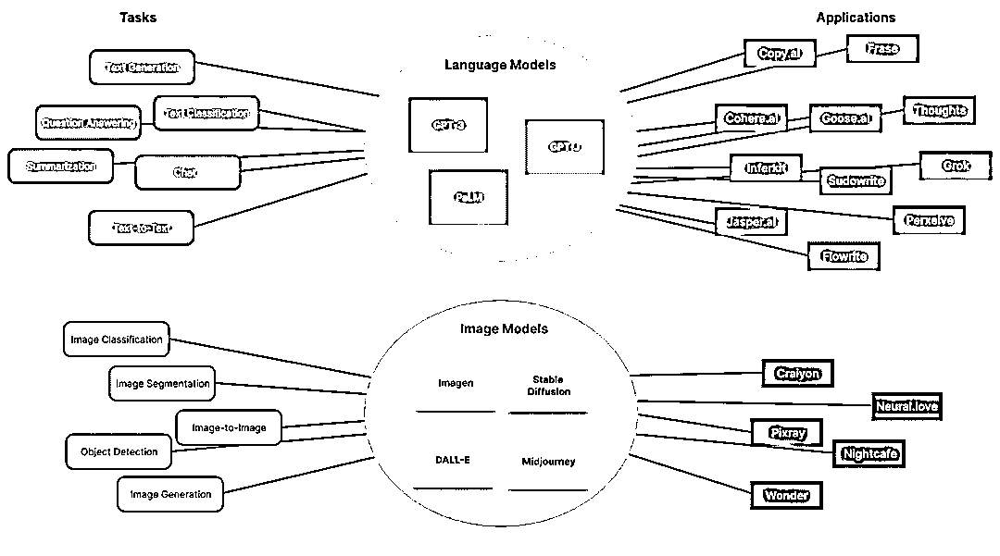

# 技术只是工具，需求才是王道！AI商业化的本质思考（5000字）

> 来源：[https://superhuang.feishu.cn/docx/OAjfdbZlNoM7n7xw8bacaG3anxb](https://superhuang.feishu.cn/docx/OAjfdbZlNoM7n7xw8bacaG3anxb)

今天想聊一个话题：站在2023年8月这个节点，似乎AI热潮过去了，但我觉得一切才刚刚开始，就像任何行业都值得在抖音重新做一遍一样，很多需求我们可以使用AI重新思考一遍！

热潮褪去的表象下，我更想表达的是：产品力永远是核心，技术只是解决用户需求的手段。

所以无所谓热潮与否，也无所谓GPT是否就是人类通向AGI的道路，宏大的命题下，只要有足够的空间提供给产品经理们和创业者改造当前世界，大家就尽情施展才华吧。

Take Away：

1.  AI当前的“低谷”是媒体和资本导致的

1.  技术边界下依然有巨大的商机，请关注真实需求

1.  持续盈利，掌握主动权，等待下一次浪潮

# 01 AI的崛起和低谷

最近看了读库的长文《达特茅斯之饼》，主要讲的是1956年，在达特茅斯学院举办的首次人工智能研讨会前后的趣事。

大佬云集，

麦卡锡：人工智能术语创造者，后来成为斯坦福大学教授。

明斯基：创建了MIT的人工智能实验室。

香农：被称为“信息论之父”，提出了信息熵的概念。

赫伯特·西蒙：获得诺贝尔经济学奖，人工智能和认知心理学领域的重要贡献者。

。。。

在这次会议上，AI的概念被首次提出。

1956年到1973年这段时间，是人工智能的第一个夏天。期间大量的技术和应用涌现，包括

1957年，Mark I 感知器，它使用人工模拟神经网络，展示出了一定的学习能力，经过50次训练能够学会区分在左侧和右侧标记的卡片。

1973年，第一台全尺寸拟人机器人WABOT-1，包括了肢体控制系统、视觉系统和对话系统等。

但是，麦卡锡和明斯基这些领头人，严重低估了实现AGI所需的硬件和软件水平，结果步子迈得太大，牛皮吹得太响：

“二十年内，机器将可以完成人类能做的任何工作”

“在一代人内...创造“人工智能”的问题将得到实质性的解决”

到了1973年，希特拉尔撰写了一份《希特莱尔报告》，指出“迄今为止，该领域任何一个方向都没有产生当初所生成的那样的重大的影响。”

导致了连锁反应，从美国、英国政府，蔓延到世界上大多数机构和投资人，纷纷回避人工智能项目，没钱就没人去研究。。。最后落地一地鸡毛。AI进入寒冬。

80年，美国人工智能协会举办了第一次全国会议，试图再创辉煌，但到了87年，DEC公司应用了AI的专家系统，由于需要解决的问题过于复杂，产品销售崩溃，人工智能又成为过街老鼠。。。

80年到87年，算是冬天下的小阳春，期间研究人员发现：

“如果降低对这种技术的预期，改用概率论和统计学的方法，就能够更加容易地实现一些看上去具备智能的人工智能应用。其中，又以人工智能中最不受待见的人工神经网络技术最为精进。他们不断改进人工神经网络，终于在1986年第一次实现了能够实用的技术，正式提出多层人工神经网络的概念。”

务实之后，人工神经网络开始走上舞台，解决实际问题：

90年代初，突破了手写文字识别

2000年后，语音识别技术突飞猛进

2006年7月，多伦多大学教授辛顿提出新名词“深度学习”

2012年9月，辛顿带着Alexnet在ImageNet比赛中压倒性夺冠，深度学习引起了广泛关注

2016年3月，AlphaGo在韩国围棋比赛中战胜了李世石九段。

再往后，就是2017年Google发布的Transformer，以及OpenAI陆续发布的GPT1-4，引爆了这一轮AI浪潮。

# 02 近期“低谷”的原因：AI也有边界

过去一段时间AI又再一次被捧上了神坛，在2月初，仅仅正式上线了2个月的ChatGPT超过Tiktok，成为互联网历史上最快突破1亿月活的应用。

最近，似乎开始冷却，ChatGPT的微信指数有小幅下降：

融资案例有所减少，投资人开始更理性看待AI，媒体的报道热度也没那么高涨，大众对AI的讨论也开始转向实际的落地应用。

从历史来看，之前不管是资本、专家、媒体的喧嚣，事实上都脱离了事物的发展的本质。

很重要一点是，AI也有边界：

这些渐进式的改善和优化，其实是把深度学习在模式识别与预测上的强大能力应用到种种不同的领域上，如疾病诊断、核发保单、开车、中英翻译等。但这些改善和优化并不代表我们正在朝着“通用人工智能”的方向快速前进，或是出现了类似深度学习的重大技术性突破。简单来说，人工智能正式进入了实干的年代，想要利用这个时期赚钱的公司，需要拥有有远见和才干的创业者、工程师和产品经理。

李开复在《AI未来》一书里对AI的发展做了详细的阐述。

过去AI在技术上的突破，仅仅是找到了一个“深度学习”，李开复表示，自从辛顿发表了深度学习的里程碑论文到现在，在机器智能领域，还没有出现任何可以与之比肩的重大突破。

也因此，想要依靠现有的技术实现AGI，是不可能的。不能否认科技有可能出现非常规的突破，但是要实现AGI，事实上可能需要几十年甚至上百年。

理解了这一点，我们就能够理解为何媒体爆炒一波，ChatGPT、AI绘画火热一波，但大众开始尝试体验后，我自己认识的朋友、加入的AI圈子，都观察到了热度大幅下降的情况。

原因是什么呢？很可能是：

过去被媒体吹捧的，以为AI无所不能，玩了之后，发现Ahamoment很快就到达，引发了再次传播，热度快速继续增加，但过了段时间，AI结合不进自己日常的生活工作，就不再使用了，热度下降。

当我们知道AI也有能力边界后，也就更能“宠辱不惊”，所谓的热潮褪去，无非是AI还没跨越鸿沟，找到杀手级应用进入主流市场罢了：

知道了AI有技术上的边界，我们可以更加关注的去理解技术底层：

AI 生成内容的基础分为：机器学习的基础，任务和模型，应用层三个部分。

*   基础是最稳定的一层，所以这个领域的知识会比较长期有用。

*   而应用程序则是变化最快的部分。这样当了解了底层，上面的东西很快就能理解。

过去Super阅读了大量的论文，包括Transformer、CLIP、GPT1-3，学习李沐的《动手学深度学习》，就是如此。

了解了基础层面，再对应用层的千变万化，就会免疫力大增：）

# 03 AI还有前景么？当然，核心是抓住用户需求

接着我们来看一下，AI有边界，是不是意味着没什么搞头了？

唯有真正落地应用于生产生活中，学术研究才能变得有意义，才能真正改变我们的日常生活。

李开复在阐述了当今AI进入了“实干”年代后，说了很重要一句话：技术不是空中楼阁，只有用之于民，才真正有意义。

展开说的话，我想先结合一句大家都听过的话来聊聊：

“任何行业都值得在抖音重新做一遍”

我们来理解一下：

1.  抖音代表了移动互联网时代用户需求和使用场景的变化。过去人们看图文和长视频，碎片化时间逐渐被短视频+直播占据，包括强大的个性化推荐，强交互性，内容的丰富度等等，代表了新需求、新场景和新使用方式。

1.  传统行业需要针对这种变化，用全新的视角重新审视用户需求，进行产品设计和商业模式创新。

几个月前我在四川自贡，吃一家烤鱼的时候，惊讶的发现老板在墙上挂出招烤鱼徒弟的广告，和老板一聊，才发现他通过三个抖音账号（每个只有2000多粉丝），拍摄和发布日常经营的短视频，就可以获得每年近百名学员，获得大几十万的纯收入。这个就非常的创新，采用了新渠道，获得了新的商业收入。

（烤鱼店老板的抖音账号）

1.  AI技术同样需要关注这种用户需求和使用场景的演变，结合具体场景进行创新应用。

我们之前写的文章：

比如会读，使用AI做摘要，帮助读者做读前筛选：

比如妙鸭相机，使用AI生成写真照片，不要199只要9.9：

比如通义听悟，使用AI总结提炼，提高工作学习效率：

都是基于用户需求和使用场景的变化，进行的应用创新。

拿会读举例，海量的信息，用户FOMO的心态，使用AI帮助快速筛选就非常的创新。

通义听悟，上线了基于教学视频，按照PPT提炼整理的能力，也是针对网课场景。

1.  在新场景下重新审视老问题，使用AI提供更优的解决方案，持续关注用户需求，紧跟时代变化，才能真正创造价值。

这是Super想说的，技术是为了产品服务，产品是为了用户服务。

我们相信最好的产品是重新定义已有的技术，而不是去不断尝试突破技术的极限。

最近有一款产品让我很惊喜，后面会专门写一篇文章，App叫心光，只在App Store上面有，它其实挺简单的：

你可以认为就是一款碎碎念记录软件，这种需求满足的产品很多，各有各的好，但心光的不同在于，它加入了AI，可以识别你的心情，可以给你安慰。

有一天Super起得很早，有点为自己没能获得好睡眠失望，记录下来后，没想到AI给了我很大的能量：

碎碎念除了记录自己，不希望被外人看到之外，其实还是有被倾听和被安慰的渴望的，AI就可以解决这个问题~

我理解这是非常Work的，老问题，新解法，非常有价值。

可能会有朋友问了，那具体哪些赛道有机会呢？别急，做了十多个AI项目FA的42章经曲凯也把各种可能的赛道都列举了出来：

从更具体的赛道来说，其实大多数公司讲的事情是可以穷尽的，不外乎是最底层的大模型、多模态大模型、AI + 各种 2B SaaS（法律、营销、客服、CRM、BI 等等）、AI + 个人助手、AI + 游戏、AI + 社交、AI + 漫画、AI + 教育、AI + 旅游、声音生成、3D 生成、视频生成、中国版 Civitai、各种中间层、私有化模型、向量数据库、算力加速、分布式计算等等……

我们向外延展，这些领域也有很多AI可以应用的场景（以下使用Claude生成）：

1.医疗健康领域

*   AI可用于疾病辅助诊断，提高诊断效率和准确性

*   辅助 read CT、X光等医疗图像，实现精准定位

*   基因组医学，分析基因数据，提供个性化用药方案

2.教育培训领域

*   智能化教学，根据学生学习情况提供个性化教学计划

*   在线教育平台利用AI进行学习分析，给出学习建议

*   智能自动出题系统，根据知识图谱智能组卷考题

3.智能创意设计

*   AI艺术创作，如图像、音乐、文字等创作

*   智能设计平台，辅助设计师提高工作效率

*   个性化定制，用户参与设定参数，AI设计输出

4.智能家居生活

*   智能助手，语音交互，提供生活服务

*   智能家居，控制电器、环境，实现自动化

*   个性化推荐，媒体、购物等精准推荐服务

有关应用层是否还有机会，怎么做才能不被大模型颠覆，我也有一些思考，可以拉到文末加我微信，后面思考成熟了我也会和大家分享。

# 04 在牌桌上，关注本质，等待浪潮

五年后，所有的公司都是 AI 公司。

这是朱骁虎的“暴论”。

很好理解，当下几乎所有的公司都是互联网公司，未来所有的公司或多或少也会依赖于AI。

当AI成为新的生产力时，会逐步变成基础设施。如果对于未来的判断没有问题，你所需要做的，就是要在场：

大的历史浪潮里面没有地图，大的历史浪潮里只有发令枪。当时代拥有一个大的贝塔的时候，你需要做的唯一的事情就是 be there。

From 绿洲资本 张津剑

只要确认AI是一个大的趋势，OK，什么节奏，什么高潮和低谷，都不是问题。

这是第一点，在牌桌上。

接着，如何持续在牌桌上？第二点，关注本质：

在AI领域要关注的本质是商业价值，而非技术创新。只有持续满足用户需求，才能不断获得收益，只有持续盈利的产品，才能站稳脚跟。

AI公司现在要做的，就是开发有价值的产品，实现商业化，而非依赖资本和技术炒作。持续盈利，才能持续积累实力，等待下一次AI浪潮来临时，抓住机遇。

基于这些判断，我也写了：

前置付费的逻辑我是很认同的，原先用免费换用户的方式，则要非常小心。

第三点，等待浪潮：

1.  任天堂

20世纪80年代，任天堂凭借FC游戏机成功立足。但90年代，索尼PlayStation强势崛起，任天堂陷入低谷，市场份额大幅下滑。但是任天堂并未放弃，继续研发任天堂64来回击。到21世纪，任天堂凭借新硬件与创新游戏再次复苏。

1.  苹果公司

1990年代，苹果公司面临低迷，市值一度暴跌。乔布斯回归后，苹果继续研发创新产品，从iMac、iPod到iPhone，逐步复兴苹果。

1.  AMD处理器

早年AMD曾一度落后英特尔，但AMD坚持研发，到2019年发布Zen 2架构取得竞争优势，业绩大幅增长。

历史上任天堂、苹果、AMD，都是一度低迷，但是都没有放弃，低谷期持续努力，才能撑到下一个机遇来临时获得成功，这对AI公司同样具有启发意义。

# 总结

历史不会重复，但总会呈现相似的规律。

站在2023年8月的今天回望，我们就像站在历史的节点上。无论是56年的第一届达特茅斯会议，还是2012年深度学习崛起，每一次科技发展都不是直线上升，起起落落本是常态。

技术从来只是工具和手段，真正重要的是持续关注用户需求，以问题为导向，创造价值。只要你保证自己站在变革的风口，抓住实际需求，构建可持续盈利的商业模式，每一次低谷终将过去，总有春天在前头。

所以，不必随波逐流，保持定力，我们还有无限可能。一如既往，产品需求导向，技术为我所用。让我们继续努力，创造下一个时代的辉煌！

# 参考：

马丁的Wiki文档：

朱啸虎和傅盛都没错 | 42章经

产品沉思录：《当我们在用 AI 画图时，AI 到底在干什么？》

# AI系列专题（部分）：

五星推荐

五星推荐