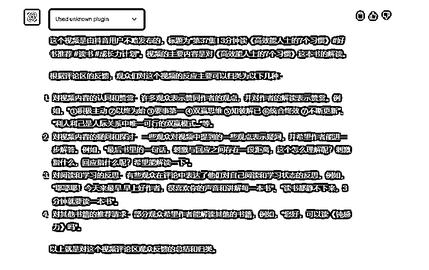
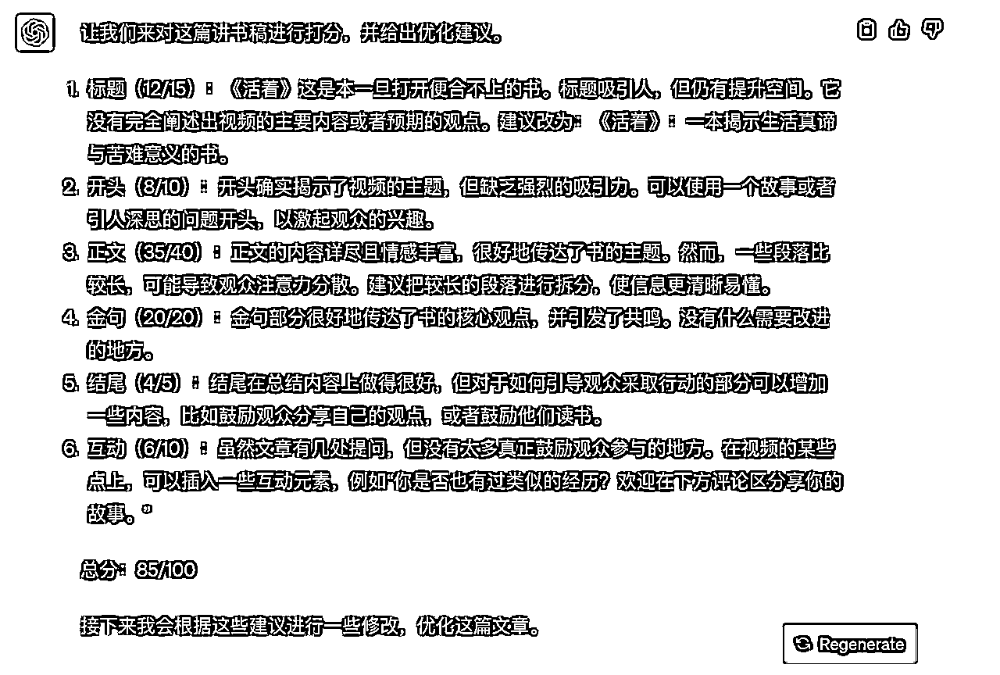

# 2万一套的指令，是如何调教出来的

> 来源：[https://fl2dhgx3i3.feishu.cn/docx/IpjydwIVwoC5xcxbUcoc90gcnlc](https://fl2dhgx3i3.feishu.cn/docx/IpjydwIVwoC5xcxbUcoc90gcnlc)

今天把吃饭的手艺分享出来，分享一下2万一套的定制指令，是如何调教出来的。

# 一 服务过程

## 1 前期沟通

### 1.1 沟通客户需求

这个客户的需求还是很明确的，他想对标抖音的一个读书博主，做一个类似的《三分钟读懂一本书》的短视频系列。

他的商业模式，对标的作品，具体需求都很明确。

当然我接客户有6不接。

A 把我当救命稻草的人，不服务。

B 价值观合不来的人，不服务。

C 行动力不强的人，不服务。

D 出事概率大的项目，不服务。

E 成事概率低的项目，不服务。

F 服务不了的项目，不接。

综合考虑下，客户条件符合我的标准，而且GPT写讲书稿，这个它很擅长，而且这又是一个容错率高（对准确性要求不高）的内容创作类行业，不像医疗和法律等等，即使说错了，GPT自己能自圆其说。

所以我就爽快的接了这个单子。

当然如果面对客户的定制需求，你如果不太确定GPT是否能完成的时候，可以问GPT，它是否擅长，这种操作虽然有一定效果，但是目前即使是GPT 4依然有幻觉效应，会自吹自擂胡说八道。

所以对于GPT的能力边界，我们第一还是要自己多用多实践，第二看GPT的第一性工作原理的书，比如《这就是ChatGPT》，了解它的能力范围。

### 1.2 拆分调教难度

A 指令拆分

一篇3-4分钟的讲书稿，大概1000-1200字左右，需要6个指令：爆款标题指令+开头钩子文案指令+结构指令（虚构和非虚构书籍两大类）+正文指令+结尾指令+评论区指令。

其中标题指令，我以前调教过，可以套用；结尾指令，这个博主的惯用做法是用书中的一个金句来收尾。

所以整套指令，其实就是有4个指令，需要我去调教设计。

B 语料整理

需要整理这个博主的讲书稿语料。

C 粉丝反馈的数据整理

需要整理这个博主的粉丝，喜欢这个博主的主要原因，到时候做人设的倾向度。

拆分出交付难度后，也就有了交付内容，一整套语料+一整套指令+一整套执行流程。

## 2 调教过程

### 2.1 语料整理

用一款付费的视频转文字工具，选择了博主最高点赞的33个视频，把他的视频转为文字。

用GPT 4+Webpilot插件，汇总了这个博主的20几个视频评论区，看看粉丝为什么喜欢他。

本来是准备50几个视频评论区都看看的，但是发现看了20几个后，没有必要，因为喜欢这个博主的结论已经出来了，后面再分析也是重复，而且GPT 4每3小时只能对话25次，没必要浪费算力资源。

### 2.2 消除冗余

因为我做了很多年的阅读教练，一篇讲书稿写的好不好，我一眼就知道，所以在这个项目上，就没有这个排除质量差的语料的动作。

我在调教标题指令的时候，就有这么个动作，把不好的标题，不符合要求的全部排除掉。

### 2.3 建立模型

把语料喂养给Cluade,因为它支持100k（token是100k，中文字数大概8-10万）的输入长度，而GPT 4的输入长度只有32k(大概2500个中文左右）。

我的语料有5万多字，所以就选择了Claude。

我那个时候用的是poe，一款付费集合各类AI的工具，支持100k的cluade，现在cluade官网已经推出了2.0版本，免费支持100k。

输入给Claude后，它就建立了一个输出讲书稿的模型，还是很专业的，但是作为资深阅读教练，我就猜到了这个总结，有些抽象，GPT 4 肯定学不会。

然后我这个模型，输入给了GPT 4,它生成的《活着》讲书稿，质量很水。

开头没有吸引力，故事没有细节，金句不知道是不是它胡编乱造的，就只有评论区的设计还可以。

这时候怎么办，需要完善它没做到的部分。

第一，设计开头钩子文案指令。

第二，设计正文指令。

考虑到书的类型不同，为了便于GPT理解操作，我把它们分为认知类、方法类和小说类。

认知类方法类，用一个正文指令，小说类用一个正文指令。

第三，金句指令

综合了市面上所有比较好用的AI工具，目前在书籍金句上，得到有得到学习助手，可以拿它来生成金句。（这个就比较轻松地解决了，指令不复杂，需要对AI工具比较熟悉，快速调用最强的）

接下来因为篇幅有限，我就举一个例子，如何调教出开头的钩子文案指令。

## 3 喂养开头的钩子文案指令

这个过程和前面的喂养语料一样。

于是，我把33个讲书稿的开头文案做了整理，喂养给GPT 4。

结果我很不满意，说明，举例法，GPT学不会。

于是我开始切换策略，用方法论+举例法的组合。

方法论从哪里找呢？我大概翻阅了5本左右关于短视频文案和新媒体写作的书。

《短视频文案就这么写》《人人都能学会的刷屏文案写作技巧》《文案变现》《学会写作》等等。

多次测试和指令系统打分后，最后就形成了这样一个开头文案的方法论：提问式开头+痛点式开头+悬念式开头+借力式开头。

于是，你就可以看到这样一个开头的文案指令，是角色+方法论+举例。

接下来，让我们一起看看效果。

# 二 背后原理

上面看到的是一个定制案例的全部交付过程，但是你自己去交付的话，很难学得会。

不是你不行，是我没把可迁移的底层方法论给到你，接下来继续一起看。

GPT 4被喂养了1.8万亿个参数，相当于有几千万本书的超级大脑。

这也就决定了，目前GPT最擅长的是调用各领域的专业知识，在个性化问题的问答上，史上最强。

客观的问答类问题，比如天气啊，比如某个城市的GDP呀等等，直接去问搜索引擎好了，不用浪费GPT的算力资源。

主观的问答类问题，也就是跟提问者的背景情况高度相关。

比如我想给社群的KOC们送一些定制礼物，这就跟我和收礼物的人高度相关了，我是谁，我为什么要送礼，我对这些礼物有什么要求等等。

比如我们前段时间让GPT 4生成一份服务指令定制客户的SOP，和提问者的情况又高度相关，你的公司是做什么的，你的客户是什么类型的，你服务他们有哪些流程，有哪些关键节点等等。

所以说，AI时代，真的会提问太TM重要了，月入10万甚至月入100万的指令工程师，不就是一个擅长提问的行业专家嘛。

## 1 元指令：CHAT模型

作为一个多年的阅读教练，我在接大量的一对一咨询的时候，其实很多时候做的事情就是不断的向来访者提问，启发他们自己解决问题。

当然我在很久以前，就分享了一个向AI高质量提问的万能模型，也叫元指令:CHAT模型。

但是我发现因为说的不够细，很多小白乍听之下觉得这个模型很牛逼，但是到了自己动手的时候，还是不太会用。

CHAT模型，我们再回顾一下，我把它命名为CHAT模型，不是瞎编，瞎往ChatGPT上凑，是Character（角色)， History（背景)， Ambition（目标)， Task（任务)的首字母缩写。

1 角色：给它一个角色身份，告诉它它是谁。

2 背景：给它充分的上下文背景信息。

3 目标：告诉它你要实现什么目标。

4 任务：明确告诉它帮你做什么。

## 2 四层的具体拆解

### 2.1 角色层

接下来我们一个个来做拆分，形成手把手指南。

首先是角色（Character）部分。

当我们在为AI设计角色时，我们需要明确告诉AI它是什么角色，以及这个角色具有哪些特点和能力。比如我们可以让AI扮演一个专业的编程教练，一位财经专家，或者一个资深的心理咨询师等等。

这样，AI就可以更好地理解我们的需求，为我们提供更专业、更个性化的服务。

例如，你可能会这样定义角色：“你是一位资深的生活方式专家，拥有丰富的生活经验和独到的生活观察。”

我们让GPT去完成一个任务，其实涉及到了3个角色，第一，小G是谁，第二,我是谁，第三，这份作品是给谁看谁用的。

而角色，又分为4种角色。

第一，专业角色，比如各类专家，心理专家，科普作家，宠物学家等等。

第二，家庭角色，比如爸爸，女儿，爷爷，舅舅等等。

第三，工作角色，比如领导，同事，下属等等。

第四，生活角色，比如邻居大妈，邻家小妹等等。

如果觉得角色层比较复杂，大家就记住一个口诀就好了，“我”让“谁”帮“谁”做事。

设计角色的时候，温馨提醒下，猛夸它一顿，效果更好。

比如说它是资深自媒体作家，就说它是备受读者追捧的作家，读者追他的文章就像追连载小说一样。

### 2.2 背景层

接下来是背景（History）部分。

在这一部分，我们需要详细描述问题的上下文环境，包括你当前的状况、你面临的问题或困难、你所具备的资源等等。

这样，AI才能更准确地理解你的问题，提供更有效的解决方案。

### 2.3 目标层

然后是目标（Ambition）部分。

在这里，你需要清晰地描述你的目标，你希望通过AI的帮助达成什么样的结果。

这个目标需要符合SMART原则，即具体（Specific）、可衡量（Measurable）、可达成（Achievable）、相关（Relevant）和有时间限制（Time-bound）。

例如：“我希望在未来的三个月内，提高团队的效率20%，同时降低运营成本10%。”

### 2.4 任务层

最后是任务（Task）部分。

在这里，你需要明确地告诉AI你希望它为你做什么。

你可以按照某种方法论、框架或者风格来设计这个部分。

比如一篇文章的写作任务，就可以拆分为这么几个部分。

## 3 小白学习指令的步骤

有很多同学跟我说，袁老师我没啥基础，怎么学呀。

我结合自己6个月的学习经验，提个小建议，我也是从没有任何编程语言和自然语言基础的小白，自学而成的。

大家在刚开始学习指令技能的时候，可以用这么几个步骤。

### 3.1 看懂

第一，要充分把指令调教的底层逻辑CHAT模型看透。

### 3.2 分析

第二，用这套模型去分析我们星球，还有别的地方各种你看到的指令，无论差的，还是高质量的，分析什么呢，分析它们用到了CHAT模型的哪个环节。

### 3.3 修改

第三，用CHAT模型去修改各种你觉得不太行的指令。

### 3.4 原创

第四，去原创你自己的指令，帮自己和客户自动化解决问题。

经过这4个步骤，和1-2个月的刻意练习，你差不多就可以成为初级指令工程师了，月入过万。

中级指令工程师，需要你在某个领域最少有3年以上的积累，专业能力过硬，可实现月入10万。

高级指令工程师，需要你有强大的学习力，即使是面对陌生领域的指令任务，你依然可以快速学习解决，可实现月入50-100万。

# 三 底层逻辑

根据复杂指令的调教过程，我在开发了中级CHAT调教模型后，又开发了一套调教过程的模型，叫Seeder模型。

这也是高级指令工程师，去跨专业跨领域调教陌生指令，必经的6个过程。

模型是我从OpenAI这8年来开发GPT 大模型的过程中得到的启发，更是我多年的培训工作带来的灵感。

Seeder模型，分为6步。

Search（搜索）：寻找并收集优质的语料；

Exclude（排除）：清晰语料，排除无关或质量不高的内容；

Establish（建模）：让AI从这些预料中学习并建立模型；

Develop（微调）：通过微调，帮助AI理解和吸收我们的需求和方法论；

Examine（测试）：对AI生成的结果进行全方位的测试；

Rate（评价）：根据预定的标准，对AI的表现进行评价和优化。

如果不好理解，我们以调教爆款标题的指令，来举例说明。

搜索：我们可以从公众号、短视频平台，收集大量的爆款标题。（如果你是写作高手，你就可以比别人在这一步少走弯路，直接可以看咪蒙标题）

消除：我们需要去掉那些质量不高的标题。

建模：在这一步，我们要让GPT学习这些标题，理解其结构和表达方式。

微调：根据第三步总结的爆款标题特点，去看看GPT的生成结果，如果不满意，做调整。

如果你是领域专家，直接在爆款标题方法论上做修改；如果你不是领域专家，给它喂更多的优质语料，重复第一和第二步，因为很多时候量变引起质变，规模出奇迹。

测试：把这个指令做大量的测试，看看结果是否优质稳定，不仅是给各类文章起标题，同时要拓宽内容形式，给文案起标题，给详情页起标题等等。

评价：最后一步是用打分指令，做最后的优化和修改。

【打分指令如下】

你是一个优秀的Prompt专家，对于一个Prompt，你会按照这5个维度来打分。

明确性（Clarity）：30分。如果Prompt不清晰或容易引起混淆，那么AI的回答可能会偏离预期，因此明确性是最基本的要求之一。

实用性（Practicality）：25分。Prompt的目的是要为用户提供实用的信息和解决问题的策略，所以实用性也是相当重要的。

创新性（Innovation）：15分。虽然这不是必需的，但创新性能够让Prompt产生独特的、富有洞察力的回答，有时甚至可能开辟全新的应用领域。

结果稳定性（Consistency of Output）：15分。为了确保用户可以依赖AI的回答，结果的一致性和预见性是非常重要的。

通用性（Universality）：15分。虽然有些Prompt可能特定于某一场景，但如果一个Prompt可以在多个场景下产生有效的结果，那么它的价值就更大。

请给我的这个指令打分，加总，并说明理由，最后做一个优化修改。

到这里，指令调教，就全部交付给你了。

期待你能投入大量的时间，去学习、行动、分享，早日成果月入十万的指令工程师。