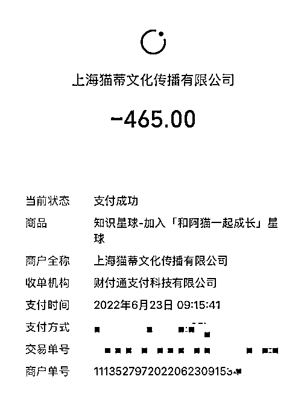
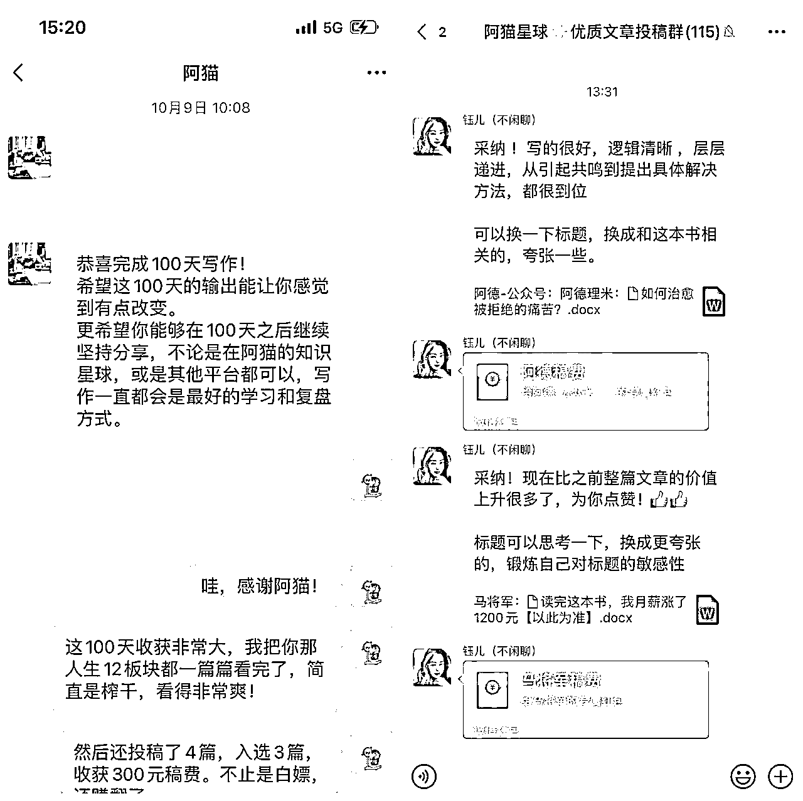
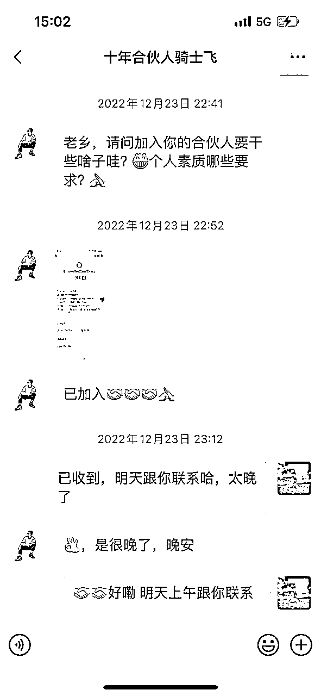
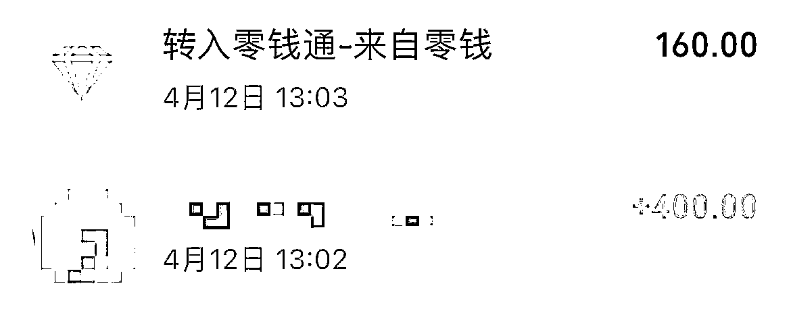
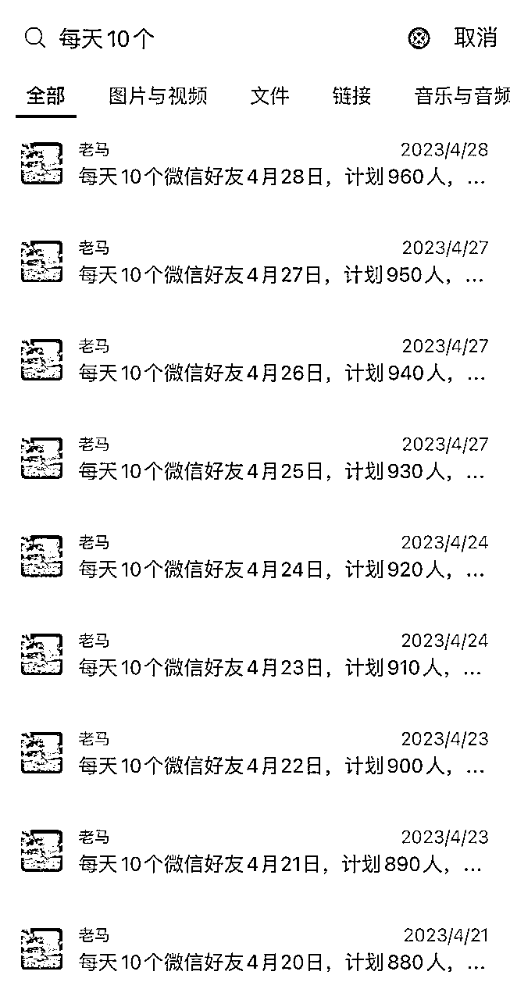
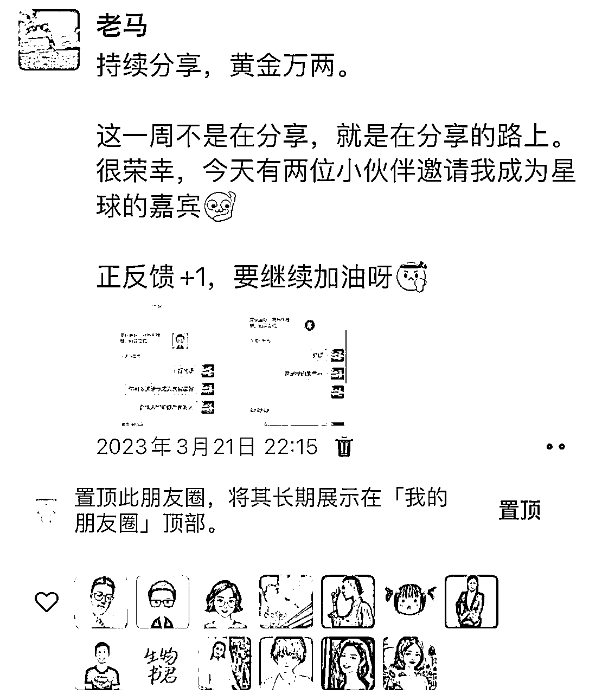
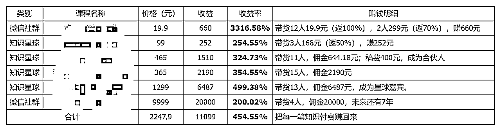
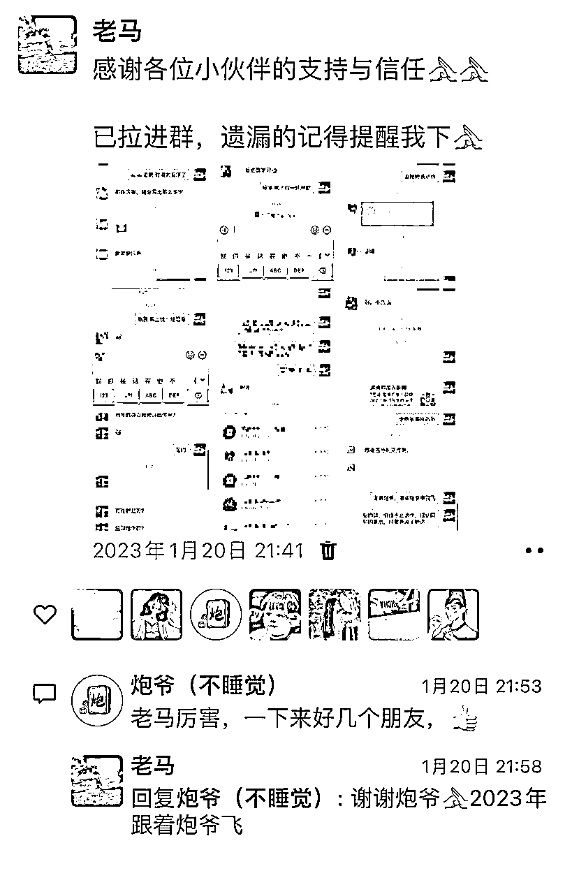
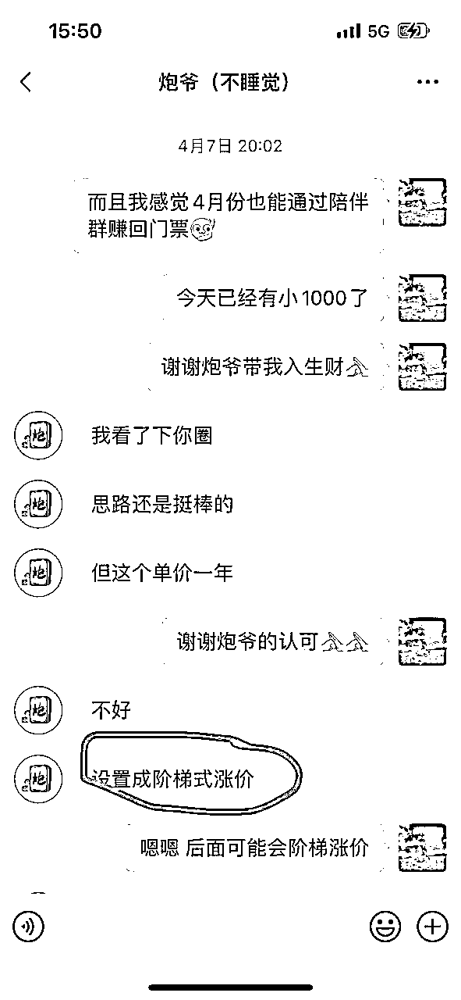

# 新人入行自媒体，赚到第1个10万，分享我的心路历程。

> 来源：[https://jojt8c2hyb.feishu.cn/docx/Is9MdaCtuo8jqixhWsecVgfznQg](https://jojt8c2hyb.feishu.cn/docx/Is9MdaCtuo8jqixhWsecVgfznQg)

大家好，我是老马，今年418加入的生财萌新。

这篇帖子是7月份开始写的，刚好2023年过去了一半，也借此机会总结下过去的半年。

年初在给自己定梦想清单的时候，想的是2023年要通过自媒体副业变现超2万元，现在回过头去看，已经达成了年初制定的目标。

当然，这个是毛收入，并非纯利润，我还要分一些分销给我的合伙人和推荐人。

这10万主要来源是：

①十年合伙人：招满了18期，变现8万+。

②生财陪伴群：招满了270人，变现1万+。

③老马分销各种社群和星球：变现1万+。

我每天记账，这是我的账单：

下面我将毫无保留地分享我这一路走过来的点点滴滴，希望对跟我一样刚入行自媒体的新人有所帮助。

## 一、看了一本书，下决心做自媒体

2023年是我的自媒体开局之年，之所以下定决心做自媒体，《纳瓦尔宝典》给我的影响最大。

纳瓦尔说：

世界上的工作本质上分为两种：存在杠杆的工作和不存在杠杆的工作。所以不要选择类似客服这样的支持性工作。这种工作投入和产出的关系相对紧密产出主要取决于投入的时长。

基于这个判断，因此我们要尽量选择存在杠杆的工作。

纳瓦尔又说：

有三种杠杆，第一种杠杆是劳动力杠杆，也就是让别人为你打工；第二种杠杆是资本杠杆，用钱来扩大影响力，绝大多数老牌大型公司的首席执行官其实都在做财务工作；最后一种杠杆是最新出现，也是普通人最触手可及的，这种杠杆就是：复制边际成本为零的产品。

所谓劳动力杠杆，就是自己创业，让别人为你打工，但疫情三年，整个行情太差了，而且我又有国企的相对稳定、薪资福利还可观的工作，就没有那个动力和勇气去辞职创业。因此，第一种劳动力杠杆虽然存在，但对我而言，比较遥远，有点不切实际。

所谓资本杠杆，其实可以理解为投资和理财，让钱生钱。事实上，确实有一部分人，通过理财和投资获得了很好的收益，实现了财务自由。这方面，我在做，但本金不多，还无法覆盖日常的开支，更别说有质量的生活了。

最后一种杠杆，是最新出现的杠杆，是普通人最触手可及的杠杆，是最值得研究的杠杆，也是最重要的杠杆——复制边际成本为零的产品。

复制边际成本为零的产品：其中包括书籍、媒体、电影、代码等。我本身是喜欢读书写作的人，正是看到了这一点，我下定决心通过写作来撬动这个杠杆，入行自媒体，做可复制成本为零的产品，实现副业变现。

## 二、第一笔知识付费获得了正反馈

我平时喜欢读书，差不多每年50本左右，有时间的话会写点东西。

我的公众号开得算早，2016年就注册了。当时在读大四、工作早早定下来，有点闲暇时间，都用来写公众号了。

那时写公众号的目的就是单纯地喜欢分享，每天看书写作，然后分享到朋友圈，写了一个月，到毕业的时候有差不多有100个粉丝，都是我的朋友圈好友。

大学毕业之后，因为工作的原因，也因为周围没有做自媒体的朋友互相激励，所以公众号基本就断了，从日更、变成了周更、月更、年更……

喜欢什么，就会去看什么。我喜欢读书，平时就关注了几个读书的公众号。2022年6月23日，我看到公众号上在发百日打卡返现，门票465元，坚持打卡100天，每天写100字，可以全额返现。

我之前其实是一个特别排斥知识付费的人，免费的网上资源用习惯了，从来没听说过知识付费。（之前我狭隘地认为知识付费的都是骗子，哈哈哈），不过这次可以返现，我觉得可以进去看看，坚持打卡100天也不难，应该不会亏。

加入之后，我才下载了知识星球，在星球里面老老实实打卡了100天。这100天，我没有偷懒，也没有漏卡，每一天的每一篇都是用心写的。

后来有小伙伴从晚上7点看到了凌晨1点，把我的每一篇都看了，并且每一篇都点赞了，这也成了我们的缘分，她现在也是我的合伙人。

打卡的同时，我还把星球里面的每一篇专栏都认认真真看了，看到【写作投稿】专栏的时候，我加了星球助理的微信，开始投稿。

100天打卡结束的时候，也就是2022年10月9日，我拿回了465元的门票返现，还在星球投稿，赚到了几百块的稿费（可以看我前面的账单），并且很荣幸地成为了星球的合伙人。

（我大号叫马将军，做了自媒体之后才开了老马的小号）

就是这个无意间的打卡，让我赚到了第一笔工资以外的钱，拿到了很强的正反馈，我觉得自媒体是条路，由此开始了自媒体副业变现之旅。

## 三、逼自己实战，先赚100块再说。

从2022年6月刚开始做的时候，我就给自己定了一个小目标：先赚100块再说。

甚至，我自己还留了后手，如果100块无法达成，我可以降低目标，从先赚10块、1块钱开始。还好，当月我通过流量主收益赚到了162.48元，又收到了4元赞赏，总计166.48元，完成了当月的目标。

但我不能满足于每个月只挣100块，我必须要进步，必须要提高赚钱能力。所以我给自己每月定了20%的增长目标，也就是说7月120元，8月144元，以此类推。

7月，我通过流量主、返佣商品和微信赞赏，132.79%完成了目标。返佣商品就是，我是做读书类公众号，会在后面插入书籍的广告，如果有人买了，会给我返佣。

8月开始，流量主收益减少，因为我没有怎么写热点了，再加上取消了文中广告（我觉得影响阅读体验），但我在星球开始投稿了，每次50块、100块的稿费，也能帮助我达成目标。

所以，8月、9月、10月、11月我都超额完成了副业变现目标，这又给了我非常大正反馈，这让我知道，我每个月肯定能通过一些方法，完成当月的副业变现目标。即使这笔钱很少，但完成目标的爽感，比每个月领工资舒服多了。

时间来到了12月，因为年度末，本职工作比较繁重，加上要带小孩，就没有投稿。眼看当月的任务完不成，我心急如焚，前几个月的正反馈越强，我这个月完成任务的决心就越迫切。

时间已经没有几天，再投稿显然有点来不及，而且我还要考虑到投稿不中的情况。我绞尽脑汁地想要怎么通过副业来变现，甚至想重回老路，去跑一跑美团众包、或者去开滴滴，但是我想到我的初心是做自媒体，做可复制成本为零的产品，不要去做那些没有杠杆的事情。

偶然间，我刷朋友圈看到好几个人在发“合伙人”。他们都在晒喜报，XXX成了我的合伙人，我就想，那我也能不能做一个合伙人呢？

我回想自己的自媒体历程，从2016年就开始写公众号了，但是由于没有志同道合的伙伴一起激励，没有进入自媒体这个圈子，没有在自媒体氛围的熏陶下，我越来越孤独，不知道涨粉、不懂得运营、更不懂变现，没有坚持下去的动力，从日更、到月更、到年更、到断更……

所以，我就想发起一个合伙人项目，寻找志同道合的小伙伴一起做，（当然最主要的其实还是想的要达成12月的赚钱目标）。

既然要做合伙人，那必须要有交付，我能交付什么呢？我就把我能拿出来的全部拿出来，把我能交付的全部交付出去，看看能不能吸引人来给我付费。（之前还从未有人给我付费过）

那么我该怎么定价呢？

因为我当时只有微信公众号不到1000粉丝，微信好友不到100的私域，所以我很担心，合伙人招募发出去之后，石沉大海，那我也白费了。

我不敢定大几千，肯定一个人都招不到。刚开始我想定999元，但想了想也肯定一个人都招不到。

我就是为了完成12月的收益目标，当时还差196元，所以我就定价成199元了。

但是我每年付出的成本其实是很大的，除了我的个人时间、一对一培训答疑这些，还有一些明显的成本，比如合伙人线下约饭、每年送一本书这些实打实要花出去的钱，因此我不能只收199元。

所以，我就想了个阶梯涨价的策略：每期2人，招满即涨价200元。刚开始，我必须要用低价去赢得客户，但我要不断迭代，阶梯涨价，赚未来的钱。

就这样，在12月收益目标的压力下，我被逼做出来了第一个产品：老马十年合伙人，让我这半年赚了8万+。

## 四、第一个产品，赚了8万+

第1期合伙人招募发出去的当晚，从来睡觉都特别踏实的我，失眠了。

我担心，就算我拿出百分百的诚意，也可能被当作骗子，无人搭理。因为我的粉丝量实在太少了，我的私域好友还不到100人。

我担心，如果我最后只能招到1-2个人，那我也要持续认真交付10年，我会不会亏得很惨？

我担心，会不会有熟悉的同学朋友看到了笑话，说我是不是想钱想疯了，因为这也是我第一次在微信公众号发广告。

……

总之，我想了特别多，心怦怦直跳，冬天还在冒虚汗。虽然这是很简单的一次发文，虽然这涉及的金额也很小很小，连我工作中经手金额的十万分之一都不到，但冥冥之中，我把这件事当成很重要的一次转型。

如果成功招募到1位，那么我就完成了12月的收益目标，我就不会泄气，我就有动力把自媒体这件事持续地坚持下去。

如果12月最后这几天，还是一个人都没有，那么我这个月的收益目标就失败了，连续6个月的成功就这么中断了，对我来说，还是很难的一个坎，因为总共一个月也才298.60元的收益目标啊。

万幸的是，招募文章发出当晚就有一位小伙伴加我的微信，然后给我转了199元。

这个小伙伴我从来没有接触过，甚至都不知道他是我的粉丝，以前也从未在公众号留言过。

但当天晚上，他直接给我转账了199元，并加了我的微信，甚至他连这个合伙人是做什么的都没弄清楚。

我突然发现，在微信公众号发招募合伙人，在朋友圈打招募广告，原来还有筛选和激活的作用，如果不是这次合伙人招募的广告，或许我跟他永远不会有交集，他也永远不会加我的微信，没想到，就是这样一次简单的广告，他成了我的第1位合伙人。

12月，我招募到了2位合伙人，另一位是我的大学学弟，他关注我公众号比较久了，也深知我的人品，所以果断地给我转过来了。

就这样，2022年12月，我通过合伙人赚到了398元，微信公众号收益了33.35元，打卡返现69元，总计收入500.35元，收益完成率167.57%。

我又一次，收获了很强的正反馈，并且通过不断实战的倒逼，我推出了第一款产品：老马十年合伙人。

突破这个卡点之后，接下来就非常顺利了，我有了合伙人，就有了案例，也不断迭代我的交付，同时运营好朋友圈，一套组合拳打下来，收益也成指数级增长。

就这样，在今年上半年我已经招满了18期，价格从199元，涨价到3599元，赚了8万+。

## 五、我一直坚持的一些习惯

### 1、进四出六，付费破圈

老马一直在践行“进四出六”的原则，即收到1笔自媒体收入，我会把钱分成2份，40%放入零钱通，60%放在零钱。

（每一笔收入，进四出六）

放在零钱通的40%就是我的纯利润，我不会动这笔钱。留在零钱的60%，是我的活动资金，也是我的知识付费预算，我可以用这些钱做我想做的任何事情，比如给喜欢的号主打赏、加入一些付费的圈子和社群、买课、给社群成员发红包等等。

所以，有了自媒体收入之后，我也开始利用“进四出六”的方法滚动起来，不断地知识付费、不断地向上破圈、不断地拓展自己的边界和眼界。

朋友圈在推广66元的小报童生财案例库，我买了；

炮爷的生财陪伴群，刚开始才19.9元，我闭眼入了；

还有很多接触到的自媒体大咖，我也买了他们的星球和社群。

总之，在“进四出六”的原则下，我从不担心我的钱白花了，首先我留了足够的利润，其次这是在我的预算之内，我花得很安心。

通过不断地知识付费，极大地又拓展了我的认知边界，而这些知识付费，又让我成倍地赚了回来。我就是通过不断地付费，看到周围的自媒体大咖们都在真诚地推荐【生财有术】，所以我就毫不犹豫地在今年加入了。

### 2、每天10个微信好友

从做自媒体开始，我就给自己定了一个小目标：每天10个微信好友。

当然，我不爆粉，而是主动在群里分享，提供价值。然后添加微信的时候，我也会做好自我介绍+备注来意，真诚沟通。

我进了不少的群，没有一个群说我爆粉的，也没有一个人没同意我添加好友申请的。我觉得主要就是，我会先互动，在群里真诚分享，并且加了好友后也会真诚沟通。

刚开始分享的时候，可能有9个都需要我主动链接，其中1个是微信公众号的引流吸引。

这9个我是怎么链接的呢？

最主要的方式就是社群新进朋友，发自我介绍的时候，那个时候主动链接，自我介绍+备注来意。

还有一个方式就是，在社群主动答疑，持续互动，有沟通了再链接。

就是以上2种方式，我也能完成每天10个微信好友的任务。

链接好友的时候，起码的社交礼仪和礼貌还是要的，可以说清楚：你来自哪里，为什么添加人家，比如：老马社群（来源）+认可你的分享，主动链接下（说明来意）。

刚开始的时候，可能每天10个微信好友，有9个都是老马主动链接的。但是随着老马在社群不断持续分享，随着老马不断发朋友圈展示自己取得的成就，慢慢的，老马也有一点点小小的名气了。

每周都会有小伙伴邀请我去社群做分享，基本上每分享一次，都有10来个小伙伴主动添加微信链接我。

同时，我持续在不同的公域平台分享，比如微信公众号、知识星球、知乎和今日头条，同时留下钩子“加我领资料”，所以现在我完成每天10个微信好友就变得很简单了，基本上不需要我主动去社群链接。

当然，我也一直在坚持每天10个微信好友这个习惯，即使有一天特殊情况没有达成目标，也很简单，我就去刷生财精华帖，看到非常有启发的，主动链接下圈友，当天的10个粉丝任务就达成了。

### 3、持续分享，黄金万两。

上半年，我付费加入了很多的社群，在一些我重视的社群，基本上混成了“群红”。

首先，我会跟群主搞好关系，其次我不会恶意引流和打广告，在进入一个社群之前，边界和分寸感很重要的。

然后，我会在我喜欢的社群持续分享，给社群成员答疑解惑，分享多了，别人觉得有价值，自然而然会主动链接我。

同时，社群好友看到我的分享有价值，也会邀请我去他的社群做嘉宾分享，这样又拓宽了我的社交面和影响力。通过这样的持续分享，我成了好些社群的合伙人和分享嘉宾。

持续分享，黄金万两，分享就有影响力。这句话我起码说了上百遍，当然，我也是这么做的。

那么，我是怎么在公域持续分享的呢？

①朋友圈持续分享

每天3-5条朋友圈，有价值、有生活，当然也有广告。

每周，我会将自己的产品和想带货的产品，都在朋友圈呈现一遍。

这样的结果是，每个月通过朋友圈的收入有1万+。我的合伙人、陪伴群付费都是通过朋友圈吸引的。我的主要收入来源也是朋友圈。

②知识星球持续分享

在不同的知识星球持续分享，同时会在知识星球的简介留钩子。

我在所有星球分享的内容后面都没有留微信，因为这样对星主来说不是很好，像打广告。

但我在自己的简介里做了介绍，光这半年的持续分享，也让我的星球号有1000+人关注了，基本上关注的也自然而然会加上我的微信。

③公众号要尽量更新

以前我没看懂公众号的价值，最近我越来越体会到公众号的好了，尤其是自己的个人IP公众号。

真的要持续分享、持续曝光，公众号日更的动力来源就是可以在公域持续的分享和曝光。

④分发到其他平台

我的一些朋友圈和其他内容，会分发到微博、头条这两个平台，后续也可能会同步到知乎，尽量一次写作、多次分发。

就是利用以上4种方式，我能保障每天我在公域平台的曝光次数不低于1000次，然后再注意留钩子，“加我领资料”等等，转化率为1%的话，每天也有10个微信新增好友了。

这就是背后的逻辑和细节，最后重复一次：持续分享、黄金万两，分享就有影响力。

### 4、没有产品的时候，先带货。

老马上半年通过带货赚了1万多的佣金，我相信随时我的私域人数增加、影响力增加，这个金额还会变多。带货的好处就是，不用自己交付，你只需要分销就好，赚的就是纯利润。还有最重要的一个点，开发产品是一个很系统的事情，当没有产品的时候，可以先练习带货：

带货的好处有：

①分佣变现。

这是最直观的好处，绝大多数星球/付费社群都设置了比较高额的分佣，一般为50%。这其实就是一种裂变，对星主/群主来讲，可以快速增加学员数量，对学员来讲可以通过带货分佣。一般带货1-2人就能返回成本，剩下的都是你自己赚的。

但我也给大家提个建议，不要什么社群都去带，一定要亲自体验了这个社群确实很好再推荐，不能把自己的口碑给砸了，我们要长期运营。

②培养自己的销售能力。

很多人没有意识到这一点，觉得自己只要开发出来了好产品/好课程就一定会卖得好，其实这是一个特别大的误区。

你连别人特别有名、拿到成果、有口皆碑的好产品都卖不出去，怎么有自信可以把自己推出的产品卖好呢？

做自媒体，最快的变现方式当然是卖课。但是当你没有课程的时候，一定要先学会销售别人的课，赚钱的同时，更是为了提升你自己的销售能力。

你会在销售的过程中，学会发朋友圈、学会推广、学会沟通转化成交、学会如何利用好产品的特点、卖点，客户的痛点、利益点，进而实现你销售能力的提升，为自己后续推出课程打基础。

### 5、把每一门知识付费都赚回来

我一直有一个习惯，就是要把每一笔知识付费都赚回来。

虽然我可以理解为学到东西了，了解技巧了，但对我来说，这还不算真正的学会。真正的学会是学以致用，我自己衡量的指标就是：先赚回门票钱再说。

如果我报了某一门课，通过这门课的学习，我能把这门课的学费成倍的赚回来，那么起码来说，在这个方面，我的知识付费是成功的。

今年开始接触知识付费以来，我会把每一笔知识付费都做记录，然后成倍地赚回来，下表是其中几个记录。

## 六、了解生财，加入生财，赚回未来20年门票钱

### 1、了解生财，加入生财

年初的时候，在合伙人的介绍下，我认识了炮爷。

没过几天，炮爷在朋友圈发布他打算建一个“生财有术陪伴群”，当时只要19.9元，这么便宜，我果断加入了。

加入之后，炮爷还有裂变的操作，也就是可以自己在朋友圈推广炮爷的群，赚得的佣金自己得。我一想，炮爷本身实力很强，而且他的群价值也很高，才19.9元，很划算，就果断发朋友圈推广了，这是我第一次发圈做分销。

没有什么经验，文案就是自己的真情实感，然后有十几个小伙伴在我的推荐下，加入了炮爷的生财陪伴群。我的第一次分销赚了300块左右，我觉得很满意。

进了炮爷的群之后，基本上他会隔三差五地分享一些“生财有术”的资源和信息，我看了大开眼界，自然而然地被熏陶和吸引了。

所以在后来，跟着炮爷入生财有术，也是很顺其自然的事情了。这也是我自己后来准备做生财陪伴群的初心，我是这么一路被熏陶过来的，也觉得生财的海量信息打开了我的认知，让我做自媒体更加游刃有余。

### 2、通过生财陪伴群，赚回未来20年门票

因为一直有“把每一笔知识付费都赚回来”的习惯，所以当我加入生财之后，我就在想，我通过什么样的方法赚回来呢？

这个时候，我就想到了炮爷的生财陪伴群，我因为在他的群里熏陶从而学到了知识并且加入了生财有术，那么我可不可以也跟着做一个类似的陪伴群呢？

对我来说，这是一个不亏的生意，我至少认为有这几大好处：

①这会倒逼我每天学习生财有术海量的知识，提升我的生财认知。

②这会倒逼我的输出能力，我会用费曼学习法，把我学到的知识融汇成我的经历和理解，分享出来。

③有了这个社群，我就有了第一个付费的产品，那么喜欢我的粉丝，就有了一个落地的地方，不然我也不能通过收费把他们筛选和聚集起来。

④有了这个社群，我就可以逐步打造自己的个人IP，因为我会在社群每天持续分享，分享就有影响力，自然而然我的IP力也会逐步加强。

⑤最重要的，这个社群能赚钱，起码轻松赚回门票钱。我加入生财有术的第3天，就已经赚回来了门票钱。

详见之前在生财的精华文：《新人做生财陪伴群，3天赚回门票钱》https://t.zsxq.com/10W4dNu8T

### 3、我是如何通过生财陪伴群赚钱的？

①赚门票钱。

我刚开始想的时候，这个陪伴群就是我的低价引流社群，所以我打算就9.9元筛选一下，尽量吸引更多的人。

后来，我又在9.9元和19.9元纠结，我发现大多数人对9.9和19.9元的价格差不敏感，但是只要超过20元又都不一样，所以我最终定价成了19.9元。

19.9元招了一些人之后，我去给炮爷汇报喜讯，炮爷建议我“阶梯涨价”。我之前的想法是门票尽量低，多拉人进来，再转化，但我发现我刚开始经验很差，转化效率不高，再加上我除了生财有术，也没有其他产品可以转化，所以我果断听了炮爷的建议，每50人涨价10元钱，现在有300+人，涨价到了79元。

阶梯涨价不仅让我的人越来越多（每次要涨价时，在朋友圈发一波，就能激活不少新的客户），同时也提升了我的收益。

光门票钱，我们就可以算一算账：

50*19=950元（前50人）

50*29=1450元（51-100人）

50*39=1950元（101-150人）

50*49=2450元（151-200人）

50*59=2950元（201-250人）

50*69=3450元（251-300人）

所以：300人门票收入合计是：950+1450+1950+2450+2950+3450=13200元。

②带货分佣

除了门票收益，我每个月还会在群里发起2次带货，基本上就是推荐我认为很好的知识付费产品。

基本上，每次带货收益都会有1000+，一个月2次就有2000+，全年就会有24000+元的带货收益。

除了每月2次左右的带货，还有日常的生财有术星球转化，这部分也是带货的收益。

③低阶社群转高阶产品

要有高中低的产品，才能形成产品体系。

老马的生财陪伴群本质上是一个低价的社群，通过我每天的陪伴加餐分享，那么自然而然会吸引愿意跟我更进一步交付的合伙人。

目前，通过生财陪伴群转化的合伙人就有4个了，总收益是3400+3400+3600+3600=14000元。

随着老马加餐分享的质量提高，随着老马的IP影响力提高，这部分收益还会进一步加大。

### 4、在生财，赚回门票很简单。

在生财，赚回门票钱很简单，我随意列举以下这10种：

①这一年，死磕闲鱼无货源，把社群闲鱼无货源的资料都学一遍，然后有航海的时候跟着航海，自己实操，不懂的举手向高手请教，一年赚回门票钱很轻松。

②这一年，每天刷刷风向标，每周挑一个你认为靠谱的风向标，去实操。每一条中标的风向标都有赚到100万的机会，一年52周，我不信你赚不回门票钱。

③这一年，学习做ChatGPT+公众号，做流量主收益，就参考社群的航海手册，有航海的话跟着航海实操，认真听教练答疑解惑，只要一年内爆了2-3篇文章，门票钱就回来了。

④这一年，就跟着生财航海，做小红书。无论小红书运营也好，还是小红书电商也好，只要每期航海认真参与，赚门票钱真的很轻松。

⑤最简单的，可以去做资料整理，卖资料。就像之前任平生和付一分享的天涯神贴引流卖资料，我知道的光这个项目赚10几万的都有，更别说2465元的门票钱了。

⑥亦仁之前不是分享过吗，准备一个微信小号，刷抖音，每天加30-40个微信，坚持一个月，你就能累积1000个在抖音赚钱的好友，坚持1年，你就能累积1万个这样的好友。之前亦仁花了10万买这个号，那当你有1万好友的时候，还不值1张门票钱吗？生财里面有大把的圈友愿意用一张门票钱换你这个小号。

⑦生财里面的每一条航海实战都有100万的机会，随便找一条船，死磕一年，也能轻松赚回门票钱。我这里就不一一列举了。

⑧亦仁时不时发一些招募，比如杭州的一些岗位信息，多去尝试，投简历，面试，一旦成功还在乎一张门票钱吗？

⑨给牛人当助理。生财里面有各种各样的牛人，给牛人认认真真当一年的助理，我觉得也能轻松挣回门票钱。

⑩跟我一样，做生财陪伴群，19块50人，29块50人，一年招100个人就赚回来了。

这是我在写的时候，心里随便想的一些点子，我觉得在生财有术这样的海洋里，要赚回门票钱，我至少还能再想出几十条，比如每一条中标的风向标，也同样有价值百万的机会。

## 七、这半年的得失

回顾做自媒体副业第一年的前半年，我整体还是非常满意的。

我觉得，做得好的地方：

①自媒体赚到钱了，这给了我非常大的正反馈，起码坚定了我做自媒体的信心，而且基本上可以把这个当作一辈子的事业了。

②推出了2个自己的产品，十年合伙人和老马生财陪伴群。这两个产品都有做到年入10万+的希望，比如十年合伙人，每个月招募2个，一年基本上就10万+了。生财陪伴群，只要有1000+人，每年也可以10万+了。

③结识了一大群非常好的自媒体朋友。通过做自媒体，打开了一个新世界，结识了一大群非常年轻、非常优秀、非常有活力的自媒体朋友，让我的认知和格局也提升了不少。以前觉得自媒体创业是一个特别遥远的事情，现在我好像看到点希望了。

当然，也有做得不好的地方：

①没有重视在公域引流。我目前只有1600+微信好友，一半是通过混社群添加的，没有重视在公域进行引流，因此微信好友增长缓慢。

②没有重视公众号日更。其实我每天都有写作，但没有重视在公众号日更，有一大段时间甚至是周更、月更。

③还不够勤奋。总的来说，每天在自媒体上的时间投入太少，平均下来也就2小时左右，还不够勤奋，刷抖音、微博等短视频浪费了很多时间，也没有沉下心来好好地学习和成长。

④没有多尝试一些网赚项目。比如chatGPT、小红书店铺、公众号爆文写作、天涯神贴引流、最近的问一问等，我都觉得是非常好的网赚项目，但因为我上班工作，下班带娃时间确实很紧张，加上执行力也不够强，所以没有很好的参与这些项目。

## 八、我的未来规划

①老马十年合伙人：更好地做好交付，比如，做好每天、每周、每月、每季度、每年的交付。每天找一位合伙人聊天；每周做好三件事的执行；每月一起带货分佣赚回门票钱，每季度找个项目一起实战，每年至少聚一次等等，还有很多可以优化的地方。

②老马生财陪伴群：目标是在今年做到600人，明年做到1000+人，然后做好留存，提高续费率，把生财陪伴群打造成一个年度收入10万+的社群。

③做好公域引流和私域沉淀：计划通过小红书等公域平台进行引流，将公域流量引流到私域沉淀，打造好朋友圈成交体系，私域成交变现。

④开一个读书写作星球。准备开一个读书写作星球，起码先完成自己的年度目标：今年付费星球人数超200人，明年超800人。

⑤多尝试一些网赚项目。每个月实践一条生财的“中标”项目，有航海的时候跟着航海实战，力争通过不断尝试+航海实战，再开拓一些收入渠道和项目。

## 九、说在最后

今年是我入行做自媒体的第一年，很幸运地加入了生财有术，并通过生财有术打开认知，赚到了第1个10万元，实现了从0到1的突破。

10万元对于生财的大佬或许是非常简单的一件事情，但对老马来说，是非常强的一次正反馈了，起码我看到了通过自媒体赚钱的希望，也通过自己的实战，实现了第一次赚钱的小闭环。

相比于以前只知道开店、跑滴滴、跑美团的我，加入生财之后，我的认知提升很快，我看到了很多种赚钱的方式，也有信心通过自己的努力，赚到自媒体副业的第1桶金。

加入生财就像打开了一扇大门，让我知道除了工作以外，还有这么精彩纷呈、惊心动魄的商业世界。我也有信心，在不久的将来，通过自己的努力，实现副业收入超过主业，甚至开始自己的自媒体创业。

感谢阿猫，带我进入自媒体行业；感谢炮爷，带我进入生财有术；感谢生财，给我打开商业认知的大门，让我有实战赚钱的底气。

感谢一路走来的朋友们，谢谢大家！