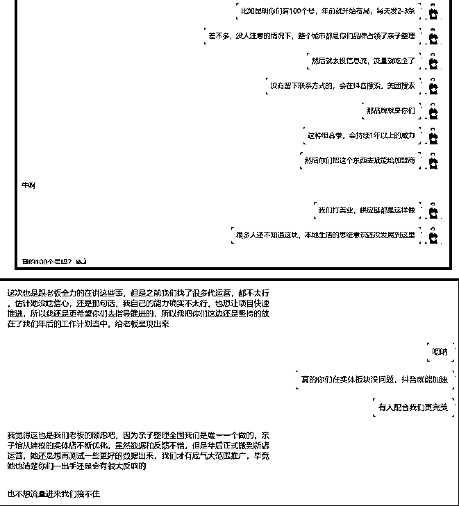
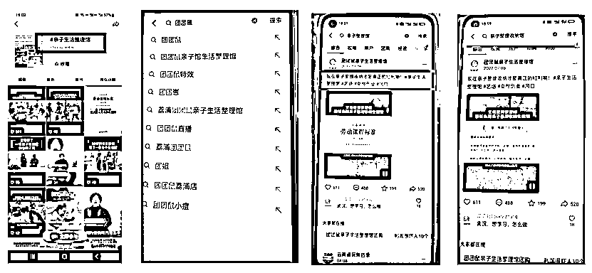
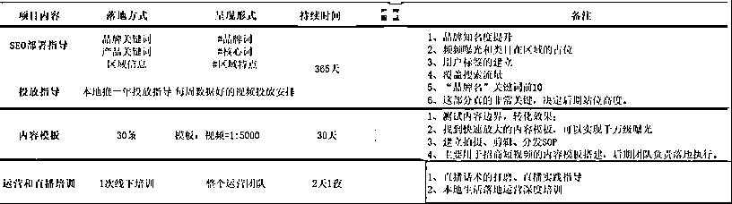
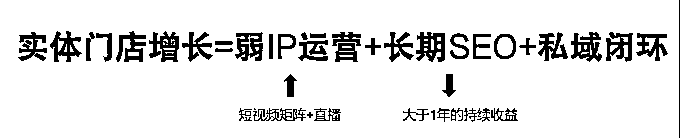

# 【亲子教育】团团鼠的品牌从0到1.5的增长

> 来源：[https://chuchuan.feishu.cn/docx/J4srd2am3ocKGYx8eDwcNU6jnjd](https://chuchuan.feishu.cn/docx/J4srd2am3ocKGYx8eDwcNU6jnjd)

# 亲子教育品牌团团鼠增长复盘

## 一、品牌背景介绍

这个品牌叫：团团鼠，所属大类目在亲子教育，具体表现形式为亲子整理生活馆，是一个全新的类目，主要是宝妈、小孩子做科学的整理归纳、亲子心理教育等。

团团鼠亲子整理馆属于金袋鼠集团下的全新品牌，背后的金袋鼠集团致力于用专业、智能、有温度的整理收纳服务解决物品与生活空间不和谐带给现代人的困扰，为想要成为整理师的人群提供专业化培训、服务和成长的平台。在2020年-2021年的高速发展阶段，成为整理归纳行业的领头羊，主要模式是直营+加盟制，总部集合信息流投放，加盟商按照标准履约。

但是整理归纳行业的需求是极低频、流量投放成本越来越高，让这个生意的盈利能力不断下降。于是创始人陆奕伽在2022年1月开始打磨出一个新的服务模式，以教小朋友整理归纳、生活习性等方面能力为出发点，打造出一套年卡制的课程，高频触达宝妈，再采取新的O2O的模式引流。经过一年多的产品打磨，团队调整，团团鼠整理馆在2023年3月开始正式大批量收客验证市场。

金袋鼠到团团鼠的品牌演化值得所有的传统品牌思考，从“高客单+超低频+加盟培训+总部流量投放派单”到“低客单+高频+实体连锁店+短视频引流+线下体验升单”，完成一个企业第二增长曲线的调整，这是值得所有品牌学习的地方。

### 1、团队情况

第一次接触团团鼠的运营负责人是2022年11月，团队最开始希望我们能够解决投放问题，利用抖音表单的方式来给线下场馆引流。在这里想说的一个点就是金袋鼠曾经用信息流拿到过结果，哪怕做了新的业务，依旧是沿用之前的打法找不同的团队服务无非就是要找到更好的投放模型，期待拿到同样的结果。

在本地生活领域，流量成本是可以做到远低于表单获客，因为信息差团队又找不到新的解决方案，就只能被迫做原有的引流方式。这个现象我在地产、口腔医院、医美机构等行业看过无数次。后面经过了解才知道团团鼠的门店已经上了团购，但市面上根本没有靠谱的团队解决流量问题。于是我很快提出三点必须要做的动作：第一，做好品牌短视频矩阵；第二，部署抖音SEO；第三，搭建新的抖音团购引流模型。

不过团队负责人一直担心的方式是执行力不够，其次是团队中短视频能力几乎是0，所以我们团队根据团团鼠的实际情况，搭建了一套适合他们的引流方式，至少保证非低效完成落地方案。

### 2、需求点

经过2个月的沟通，我们梳理了团团鼠品牌的真正需求：首先是场馆的引流，其次是门店模型出来后的招商加盟。我们团队一直秉承的是低成本投放，用矩阵+SEO获取自然流量。这个环节我们用了半个月的时间才说服团团鼠的运营团队放弃表单的投放方式，最后我们也验证了我们的预见性的高明之处。

## 二、准备工作

### 1、落地方案

首先，我们搭建好短视频矩阵，要求是在C端客户的获取至少需要30个抖音账号，后续品牌招商加盟要20个以上的账号。我们再用自己开发的工具进行账号托管，完成PC端的剪辑-分发。

其次，我们构建了一套流量模型。团购运营层面上，引流套餐定为29.9元，包含儿童归纳思维启发+厨房体验课+多肉植物，盈利产品则是邀约到店进行9800元的年卡推销。推广路径层面上，本地达人安排50名，达人和无人直播间同时搭建，官方30人矩阵号的联合引流。

最后就是执行周期，我们对团团鼠的3个新媒体运营团队进行培训，架构为运营负责人、文案和剪辑，前期的剪辑、分发和团购运营，我们都是通过向日葵远程控制+演示的方式把团队带上正轨。整个交付周期为30天，基本上让团队从本地生活小白完成入门，并且开始拿结果。

### 2、执行过程遇到的问题

最开始出问题的地方是用户的邀约到店，到店升单环节。在传播层面，我们做到意想不到的爆发力，但是在一个月邀约到店的600多人，只有10%左右的升单率。于是我们建议换团队去做转化，后面提高到26%，旗舰店的整体财务模型就能做到3-4个月的回本周期。

我们在达人探店的环节发现，出单不是探店达人，而是自建官方矩阵，所以就赶紧叫停，减少达人的数量，提高素人的视频数量。通过稳定的内容模板和视频分发，真正实现了降本增效。

## 三、拿到的结果

一个月的时间，我们一共发布素人视频3000条、达人视频30条，累计做到400多万曝光，地区榜单TOP1。总成交订单1289单，累计核销700单。

在抖音SEO的层面上，做到了全面的占位，这是一个可长效获利的结果。

我们预计在2024年，团团鼠如果做到长期的部署，未来基本上可以成为这个类目的独角兽。

## 四、优化的地方

### 1、 转化率的提升

我们在到店人群的转化上，我们提出两个改进意见：搭建品牌抖音本地生活小程序，因为可以实现预约功能，只有这样才能提高沟通效率，也能保证门店的运营效率（用户下单打电话邀约或者是加微信的动作已经是老派做法，导致第一步就变难，团队也很难做到完美，用预约制可以提高转化效率和私域留存率）。

最后就是将销售话术全面升级，课程的设计都需要更新，结果也实现了新的增长。

### 2、获客的内容模板优化和后续工作安排

我们最开始搭建了的内容模板，一条模板能够发布3000次依旧存在爆款几率，所以我们根据品牌特点进行了深度剖析，搭建出新的内容模板，让团队照做一样可以拿到结果。

团团鼠团队也的确是完成了我的初步安排，如在B端的短视频招募上，一个爆款视频模板可以一天引流400多个咨询，这是一件了不起的事情。

## 五、行业思考

根据团团鼠的品牌增长经验，我们推演出这套增长模型。

当品牌不具备做商业IP的时候，那么短视频矩阵就成了很重要的手段，用有效可复制的内容模板，去批量化剪辑和发布实现曝光和获客。

然后当批量化发短视频成了日常工作，那随着时间的积累，一个品牌就能在抖音形成势能。

最后不论是B端还是C端，用私域沉淀流量，真正形成自己的护城河。这套增长模式，楚川会认为适用于大部分实体品牌的转型，谁能拿到结果就取决于谁能一往无前去落地，去执行。