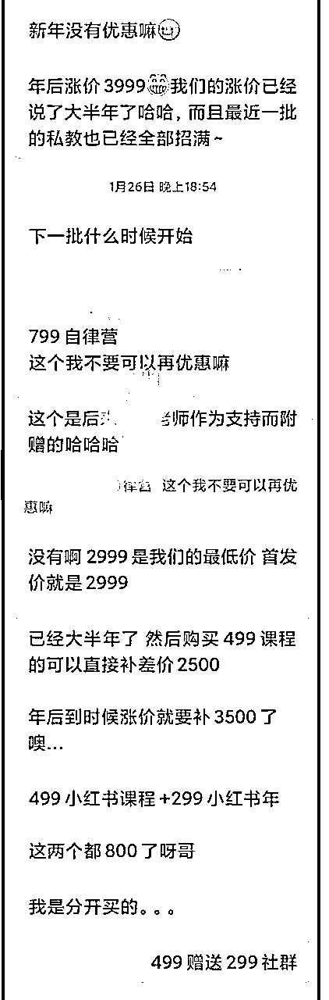

# 25个提高微信成交率的小技巧

> 来源：[https://oee5lr7gsk.feishu.cn/docx/JHdGdT6oHo3zL2xx4qBcIdCSn6b](https://oee5lr7gsk.feishu.cn/docx/JHdGdT6oHo3zL2xx4qBcIdCSn6b)

去年开始，从线下转型做线上已经一年多。

第一年线上转型的收入还可以，做到了220万。

也积累了一些线上成交的经验。

我一直觉得

### 线上的本质，其实是线下场景的迁移

所以在微信上谈成交，本质上是将线下的场景做了切换

其背后的底层的逻辑是一样的

就是我们需要和客户建立足够的信任

然后，成交就是一件水到渠成、自然而然的事情。

我也一直认为，私域的终点是微信

如果能有一些

透过微信沟通更好的小技巧

这是能大大的增加关系维护的效率

以及更好的成交产品

刚刚好想借着这个主题

梳理我去年一整年在线上，微信聊天成交

以及总结过去十年的销售经验

整理25个提高微信成交率的小技巧

每一个小技巧都很轻

看完便可以知道如何快速上手。

* * *

## 001 提高成交率的一个关键思维

很多的成交，透过的就是大量曝光

假设成交率低，那就更得做到

大量大量大量大量曝光

只要某种量达到，就有机会让成交数量增加

找到机会，尽量多曝光自己『有什么』

「多说」一定有好效果

但要记得，不要说的太刻意

因为刻意推销，会很容易出现反效果

找到好机会

就顺势著多提一嘴即可

下面的对话截图，就是我跟学员闲聊的一部分内容

想着聊天到比较好的状态，就顺势提一嘴自己未来的产品

目的就是透过大量曝光，让大家知道『我有什么』

* * *

## 002 比成交更重要的一件事

对方只有意愿，那成交，就是一个时间的问题

既然对方有意愿

那比起成交，更重要的事情就是

### 透过某些环节，让他能更了解自己一些

这样能够有一个

成交后更信任的环境

清楚对方有意愿的状况下

更可以选择『放缓速度』

案例中，对方有明确的意愿，但是我并不着急介绍产品，

而是会多聊几句，增进对彼此的了解

* * *

## 003 准备收钱时，这件事一定要做

准备收钱的时候，有个很重要的环节，跟客户『确认意愿』

确认意愿有个好处，可以知道，这客户我到底要不要继续打扰

那用什么样的『确认意愿』会更好一些呢？

一般我會直接問，

比如下面这张是学员和客户的对话，其实已经到成交的前一步了

既然都谈到这，代表客户也知道我要卖东西，甚至还有一些意愿

彼此都有数，直说即可

我就会说：

我能确认一下

你第一个说的准备学费

是确定要报名了是吗？

如果是的话

很欢迎你成为我的学生

等准备好后

转给我之前可以跟我说一声

微信或者支付宝都行

这话丢出去，对方肯定会回复

「确定」又或者「不确定」

假设他说不确定，我不会继续追踪

因为说到这了，他肯定有很多的考慮點

我就会礼貌性的说：

我随时都在

若是考虑中

还有哪些疑惑，能随时问我

总结：

确认意愿这事情，直说就好

很多时候的收钱，很多时候的销售，其实直说就是个最好的方式。

* * *

## 004 一个万用方法，让对方变得热情

一定要记得一个事情：

热情不热情，不是客户本身的问题，

而是『我』到底有没有一个「引动热情」的方式

什么样的方式，最好引动客户的热情?

认同+夸奖

这就是一个

非常好的承接上次的开场方式

类似：

你发的影片也太棒了吧

或者

第一则朋友圈的图

拍的太好看了

或者

你的腻称前面三个zzz好特别

.......

这样子的方式，很容易把聊天的能量提高。

* * *

## 005 聊天时如何判断对方的能量？

聊天，其实很看重

能量高还是低

怎么判断这次的聊天，彼此能量场都在高位呢？

看聊天字数，以及对方的回复速度

如果句句都回的很多

同时有来有往，对方的回应速度又快

这就能基本判断，能量场挺高的

那就有机会可以『切入』

案例中，从对方的回复字数和速度，可以判断对方的能量场挺高的

* * *

## 006 聊天过程中，如何判断成交时机？

假设当我提到了

未来有机会可以来我的社群

虽然都得付费

这话打出去后

对方没有特别的反应或者是询问

这代表成交的时机还没到

所以我一般不会特别跟进

也不会特别问第二次

就是简单的带过

因为时机很重要

当我们抛出某个议题

对方没特别回应，那就别热脸贴冷屁股

找下个更好的时间

再尝试切入就好

* * *

## 007 面对客户抱怨，要怎么做？

这是学员找我客诉的一个案例

案例中的这朋友，进群后过没几天，

突然发讯息给我，跟我说

他感觉被打扰到（细节能看对话）

这里先说个小tips：

只要对方来『抱怨』

首先，要先做的不是『争论』而是安抚

我其实知道，这事情不是我的问题

而是对方没有一个清晰认知

* * *

## 008 这个小习惯，能大大增加成交率

先看下面这则对话截图

这则小技巧想要强调的重点是：

习惯性推荐自己

这样的小文字，可以常常打

因为，「成交」本质上就是个概率学

不需要次次成交

要做的

就是透过很多小细节

让成交率能大大增加

* * *

## 009 许久没聊天的朋友，如何开始切入

微信上许久没见的朋友，可以用这样的聊天公式：

打招呼 ＋

温暖关系 ＋

再次切入主题 ＋

得特别说需要费用 ...

这个温暖关系，基本上要五句话以上（可以参考案例图片）

* * *

## 010 微信切入聊天的 6 个角度

一般来说，我会使用的『温暖关系』

大概是这几大类：

⭕️第一：近况

类似于这样的开场：

最近一切顺利吧

许久不见

突然发现你私信我挺开心的

⭕️第二：最新朋友圈

类似于这样的开场：

许久不见

这几天才点到你的朋友圈

最近你更新的几条

都让我印象深刻

⭕️第三：疫情

类似于这样的开场：

我记得你是在xx地方工作

才想到

那边的疫情都还好吗？

⭕️第四：说出上一次聊天时间点

类似于这样的开场：

才發現

距离上一次我们聊天

以经过了（多久多久）

今天你突然想到我

感觉真窝心，哈哈

⭕️第五：上一次的聊天结尾话题

（可能很久之前也没关系）

类似于这样的开场：

哈哈

怎么突然找起我了

我们上一次还聊到了（什么什么）

突然被你关注真开心

⭕️第六：头像

（没换过的情况）

还是这熟悉的头像阿

才发现

这么久没跟你聊上天了

（换了头像的情况）

我记得

之前头像应该不是这个吧

是换了对吗

才想到

我们有多久没聊天了

（说出上个时间点）

* * *

## 011 低价产品的关键，其实是这个！

以一个产品销售来说

如果产品价格，超过伍佰元以上

我都建议，用一个低价格的体验版，就当引流

可能是九十九套餐，反正就是三位数以下，让更多人能愿意尝试

毕竟这种钱不大，考虑成本会降低

这尝试的过程中，关键不是产品是否有效果

而是，在客户体验这产品的过程中，我能找到一个服务客户的机会

让客户有种产品真正的效果我没太多感觉

但你的服务，让我觉得后续可以信任你，进而买单

这里的关键思维是

### 低价产品的关键，不是看产品效果，而是体验过程中的服务

### 因为引流品的目的，不就是要让对方知道，我这人的真正价值吗

也因为这思路

不太需要考虑，这产品体验七天根本不会有效果阿

就一个减肥产品来说

七天肯定不会有效果，还要看客户愿不愿意听话

也因为这个大前提

这种无谓的担心，就更应该放下

把這份擔心，花更多心思在其他地方

刚好沿着这个思考，看一个学员的案例

* * *

## 012 引流的新客户，谈成交前先做这件事！

之前我谈过，

新朋友谈成交之前，一定要先『寒暄』

先聊聊：

客户怎么称呼

从什么地方加到我好友

这名字真特别

……

比如下面这则对话案例，是一位新加的好友，

因为不熟悉，我一定会以闲聊开场

反正一定要找几个话题，先暖暖场

最差也先打个招呼，礼貌得有。

如果微信对话中，连开场都没有，劈头就说产品内容

這樣要成交的可能性，有点低

连需求都没问，就想推自己的产品，这是大忌

* * *

## 013 如何拒绝客户杀价，又不得罪对方？

我们先看学员的这则案例：

要让对方感觉价值，不要用「说」，用「行为」来表现

说清楚规则，然后坚守自己设定的规则

这时候最好能有个固定文档，类似：

合约上有几个细节

得先发给您看

里面可能就有一个

优惠只针对复购客户

写清楚后，坚守！

这才能让客户，感觉到真正的价值

但这里有个关键要注意：

坚守原则，其实就是一种『变相拒绝』

拒绝的过程，一定要记得不要得罪客户，也不要为了守住原则，而变得『无礼』。

如何坚守原则，还能让客户理解，这就是关键所在。

就类似：

很谢谢你愿意支持我的产品

但有个事情

得跟你说声抱歉

我们的产品有个特点

所有折扣

都以会员为主

也就是购买过一次的朋友

这点希望你能谅解

* * *

## 014 客户对比同行要优惠，该如何回复？

背景如图，也是学员的一个案例

问题点是：“对方拿别人的模式，找我杀价，想讨点优惠。”

我会说：

很抱歉

这样估计不行

因为他的谘询跟我的谘询

交付方式跟价格

本來就不一樣

这个优惠估计没法给你

但我倒是挺好奇的

两个相比起来

对方是某大厂总监

同样价格

他又能服务两次

同样价格

我只能做一次谘询

你怎么不直接找他就好

还特别来问我呢？

如果我是你

因为价格的因素

估计就直接找他谘询了

第一段说完后，我会打这一段『反问』

因为这是一种『不合理』

透过反问，可以知道他的真实需求。

杀价这状况，其实，是销售中的很重要一环。

就是，学会如何『拒绝』对方

学会拒绝是门艺术

懂得拒绝的销售，才是好销售

懂得拒絕的溝通，才是好沟通～

* * *

## 015 收款之前，一定要说清楚「规则」

收款之前，有一个细节很重要。

先看一个我自己的案例：

像这样

确认收款前，我会把『规则』说清楚。

等转帐后，我还会特别声明：

小源说说体系都是不退费的

如果你考虑清楚

也觉得没问题

那我就点收款啦

这都是一种『规则』

也能理解成：很多事情，把丑话说在前头，后面会更好做事情。

上面谈的，都属于『技巧』

但接下来想分享的一段，是销售的价值观

这则对话截图，是学员在对话中的回复

上面对话的第一段，其实开场的方式能更好

一开场，马上就进入『讨价还价』，那后面，就得一直处理这事情。

一般有这状况发生，我会马上说：

抱歉

因为课程体系的费用

都是固定的

我的优惠都只给

过去买过课程支持我的人

就像你买过录播课

就能补差价

另一点是

这些后续的课程都是因为

报名私教课的『赠送』

你可以选择不要

但费用也不会变

得跟你说声抱歉

因为这事情牵涉到课程体系

以及付款

所以规则上

我会说的比较清晰

请见谅

我很怕进入讨价还价的环节，

这会让我感觉到，自己的课程价值感瞬间消失

* * *

## 016 用这个方式，能确认用户需求

这则技巧开始前，我们先看学员的一个对话案例

回顾过去说过的

这对话的开场，属于『对方提问』

之前聊过

### 谁提问就是谁掌握发球权，主控权就在谁身上

我不会马上『接球』（马上回答的意思）

我会夸个一两句，接著，丢另一颗球回去（不回答，反问）

就类似：

现在愿意买录播课的人

都是对自己期许很高的人

谢谢你的支持

课程已经开始看了吗？

其中有几个章节

我个人很喜欢

假设还没开始看

这几章可以偷偷先看

这个费用比较高

我能先知道一下

什么样的原因你会想询问私教课吗？

我又接著反问对方

这都是一种「确认需求」的过程。

有可能在确认需求后，就能听到他说

我主要是团队要学习......

所以很多聊天出现问题

或者是，搞到最后很难聊下去，一直被对方讨价还价

其实不是『对方』的问题，而是自己的接话系统，没有用好。

明明我要有主导权，结果，不小心就被对方牵著鼻子走。

* * *

## 017 成交技巧：不要直接回答客户的问题

很多聊天出现问题

或者是，搞到最后很难聊下去，一直被对方讨价还价

其实不是『对方』的问题，而是自己的接话系统，没有用好。

明明我要有主导权，结果，不小心就被对方牵著鼻子走。

一个高客单产品，我会反问对方

这个费用比较高

我能先知道一下

什么样的原因你会想询问私教课吗？

这都是一种「确认需求」的过程。

有可能在确认需求后，就能听到他说

我主要是团队要学习......

总结：

不要直接回答客户问题，习惯丢球

任何销售高手，都是提问高手

* * *

## 018 客户预算不够，如何留住 Ta？

有个前提，

假设你的学生报名初阶课，之后又升级私教课，只需要补差价。

就以这个大前提给出回复的，我会说：

方案一

我觉得对于所有学习

量力而为

是一个很重要的思维

你可以先报名初阶课

因为交付也需要一段时间

等初阶课上完

如果你觉得我真的挺不错

到时候在升级私教课

过程中

刚好也能把剩下的钱存好

你看这样如何

有个好处

未来若是私教课涨价

你依旧付3080这个费用

等于能上到初阶课

又能锁定名额

方案二

还有第二个方案

你也能参考

我觉得愿意成长的人

当下的收入状况

不应该是阻碍成长的原因

我其实有提供分期服务

但有个前提

必须得付过我的某一项课程

也就是

如果你报名了初阶课

那私教课程

我能让你分期

但只限定分（两期或者三期）

我一樣收你1980

但两个月内

你得把剩馀的钱补上

可以理解成

你先报名我的初阶课程

然后获得分期资格

只要多一个附注

只要分期的时间到没付钱

那服务会暂时终止

因为，客户清晰的跟你说，他有1980的预算。

就一个业务的角度，预算都清晰，结果钱没收进来，这太可惜了。

然后，假设采用方案二分期的方案，分期的过程，其实同样可以评估，

这个人值不值得信任。因为这是一个叠加信任的过程

重要的一开始把规定说清楚就好

* * *

## 019 产品涨价了，该如何向客户说明？

对于很久没见的客户，一定要在『涨价』这事情上，给出详细的解释。

重点是——还得道歉

因为，对方没得知涨价这事情，一定是我没通知到位。

类似于

谢谢你特别关注

一开工就来谘询课程

挺抱歉的

课程年后就涨价

我也没特别通知

每个关注课程的人

价格估计没法优惠

但我有一個小建议

要不你听听看？

把礼貌做好了，后续，就算真没成交，交情也不会有太大的问题。

先把自己放低

* * *

## 020 这 2 个小技巧，可以增加成交率

我就很常，因为礼貌回应，不小心就成交了新单子

不管对方怎么样，都多一点「用心」，会有奇效的

这类案例其实很多

都是平常我在关系经营过程中，透过每一次的「礼貌」和「用心」

一点点给对方留下好印象和信任感

案例一：

案例二：

案例三：

* * *

## 021 如何为下次成交，埋下伏笔？

跟微信好友聊天的过程中，虽然不介绍新产品，

但我总不能单纯打招呼，然后啥目的都没达到，这不白聊了吗

当然，单纯的闲聊，关系维护也能提升

但如果没有一个伏笔，下次该怎么再切入？

于是就让我想到了，结尾，我能很直白的提问对方

你会不会介意

假设

未来我有什么新课程

又或者是新的想法

能特别来私下跟你介绍?

* * *

## 022 如果要给客户介绍别人，该怎么说？

只要对外引流，我都建议

1、自己要有产品

2、要能快速介绍自己

3、给出几个类似模版，因为问题都大同小异

4、没产品也要知道推荐谁

第四点我特别说一下

假设要介绍别人，我就会这么说

謝謝你的詢問

因为目前我自己的副业

需要的投入成本比较高

当然

收入也有机会更高

但不太建议初学者参与

我有一个很好的朋友

（或者是老师）

我挺建议你去问他

她给的建议

应该会更适合这个阶段的你

如果不介意

我開個小群讓你們認識

你看如何？

类似这样的方式，转介绍出去，也是一个不错的方式

* * *

## 023 谈成交前，如何判断用户预算

谈成交之前，我一直有一个习惯，就是「抓预算」

这是所有销售，必须要掌握的技能

我一般会这么说：

能知道一下

假设你对这件事情有兴趣

你有预算上的考量吗？

因为我的课程

有不同的价格

如果你有一个预算区间

我给你的建议能更贴近你的需求

「学会抓预算」很重要

因为，清楚了对方的预算，就可以知道推什么最合适

以及，他对于课程的接受程度

* * *

## 024 产品报价的时候，给出 2 个选项

报价的时候，不要给出『单一价格』，要给出两种选项

因为单一价格，客户考虑的是「要不要」

但给出选项，客户考虑的就是，我要挑哪一个

這是一個人性的思维，很有趣

任何产品都是，这思路是通用的

类似于下面这样的方式

謝謝你這麼認真的

把课程海报的内容看完

目前

你的需求我也能很好的交付

一种方法是

我以海报上的价格

但只能做（什么样的交付）

价格就是海报上的6599元

第二种方式是

对于你的案子

我做一个客制化交付

因为公司目前有三个人

我会一起交付

费用是（尽量不要超过他提的预算）

说出交付方式

怎么交付

能给出什么样的结果

........

* * *

## 025 微信送资料的一个万能公式

微信送产品公式：

### 产品 ＋ 选项 ＋ 更高价值链接.....

下面的这个案例，是一位转介绍朋友，挺好客的。

一加好友，马上就送了我一堆资料，搞的我收的都很不好意思哈哈。

这里有个小建议，假设你也有资料能送给对方，

送之前肯定要先『告知』。

就类似：

新朋友你好

谢谢你点了好友确认

我是从某某地方加你好友的

一直覺得你很優秀

不知道

你介不介意

我送你一份我很喜欢的礼物

类似这样的开场。

送东西并不容易，

要送的合适、又得送的让对方喜欢、同时还得送的让对方能重视，

这都是需要注意的细节

送东西是一个挺棒的场景，但是要送的有效益就不太容易。

如何能送完东西，还可以让对方不只收下，更能产生好印象，

以及产生第二步链接，是个挺有技巧的事情。

假设我有一份销售档案，

可能是引流给资料的方式要送给新朋友

送之前我一定不会直接传，而会先提问

就类似：

对了请问你的工作跟销售有关系吗

（等对方回答）

我会这么问

是因为

有一份最近写的

销售技巧大全

这篇内容是

用我一年的时间

成交了100个订单经验

总结出来的干货技巧

想说如果你的工作

是跟销售相关的

对这样的档案有没有兴趣

这份礼物有两种领取方式

一种就是免费领取

我能直接发给你

另一种就是

领取资料的同时

多支付49元

我会拉你到我的群

这群的价值

就是能得到持续迭代的更新版

我每天都会分享新的销售小技巧

刚刚随手打的但大概是这个意思

既然东西都要送了，

就多一个选项，跟对方快速的产生二次链接

* * *

# 尾声的过去历史介绍

我是根源，同时也是第四期的生财圈友

一个有 2w+ 实战案例的心理咨询师

12年线下销售、团队管理经验。

2022 年开始转型线上，做一些知识付费的项目。

过去曾发表过几篇文章

都能看到这，代表你对文章的喜爱

肯定有一定的程度！

也欢迎阅读过去我写过的历史文章。

2021年的文章（精华x1）

1.  精华《直觉式萨克斯 透过社群成功变现146万》 https://t.zsxq.com/116B1bcYc

1.  《73项被动收入打造》 https://t.zsxq.com/11EHjTH0P

1.  《杭州夜话02场，夜话官复盘》 https://t.zsxq.com/19IkX4UMl

1.  《年入百万，团队从20人到4万人》 https://t.zsxq.com/19JYt77hL

1.  《主题：如何更有效的链接见面会认识的圈友》 https://t.zsxq.com/19VY2LWg4

2022年的文章

1.  《互联网小白，第 1 次做线上产品，7 天赚回 10 倍门票》 https://t.zsxq.com/11ooZZbM7

1.  《把捣乱分子『逆势』转成爱用者的好方式》 https://t.zsxq.com/19lipLhJ5

1.  《 好的内容，是目前依旧没退旧流行的变现方式 》 https://t.zsxq.com/19BLMAYw1

1.  《明白老师的一个启发，让我从100天日耕的过程赚了30W+》 https://t.zsxq.com/19BgNoxfi

2023年的文章（精华x6）

1.  《私域的意义不是管理，而是经营》 https://t.zsxq.com/19WEsfSq1

1.  精华《9年传统行业 1 年时间，从一无所有，到年入 200 万》 https://t.zsxq.com/10nmEr1cA

多亏加入了生财有术

让我少走了很多弯路。

也积累了一些经验、心得

如果圈友有什么需要探讨的

欢迎加我微信「 AF54094 」交流~

▲

也能扫码撩我~