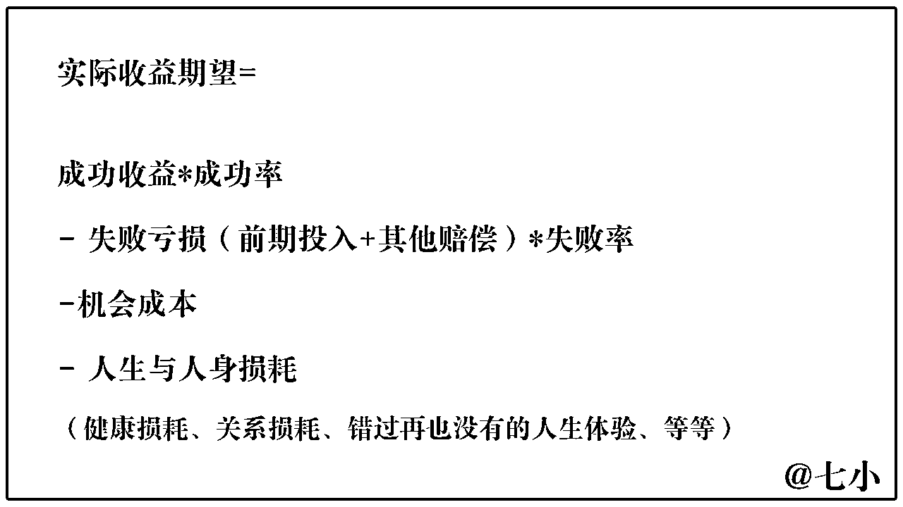

# 松弛心态：那个被称为精华帖卷王的靓仔，外出历练3个月后，也不当奋斗逼了。

> 来源：[https://mkfwp3u79v.feishu.cn/docx/Jg5kdON0woPqiAxI6XLcg2Q4nGe](https://mkfwp3u79v.feishu.cn/docx/Jg5kdON0woPqiAxI6XLcg2Q4nGe)

# 自我介绍

我是七小，99年的深圳靓仔，知识管理专家。

精通搜索、采集、内容整理、关键词挖掘，擅长把碎片化信息整合成体系化的知识产品来变现。

江湖人称生财课代表，专业解决生财新人圈友的各种问题，致力于帮助圈友发挥好生财有术的价值。

长期的目标是成为一名企业咨询顾问；未来3-5年，想为20-30岁的草根年轻人，以获取财富和幸福为目标，写一份关于【个体创业】和【人生关键决策】的游戏攻略。

微信：rickea150，添加请备注：生财圈友

欢迎价值互换的交流，欢迎围观朋友圈，欢迎好心人请我喝咖啡。不提供免费答疑。

公众号：七小的人生游戏攻略

# 前言

哈喽大家好，我是七小。

上次发帖还是6月份，当时花了半个月的时间写了一篇信息差专题的万字长文，然后后面就闭关修炼去了。

外出的这3个月，除了在商业思维上有了大幅的提升，另一个大幅改变的是我的赚钱的心态。

加入生财有术的第1年，我也算是个猛男了，一年写了15篇精华帖，拿到了10颗龙珠。像万字长文更是不在话下，三四天就能出一篇，如果愿意爆肝的话，一晚上就能搞出一篇来。也因此，我被一些圈友称之为：精华贴卷王。

以前之所以比较卷的，一方面是自己刚进入网赚，这个新世界对很多东西都充满了好奇兴奋，所以充满了激情。另一方面是身边玩的好的朋友，一个个也都是把努力当成喝水一样自然的人。在这种氛围当中，努力奋斗就是我的常态。

最近三个月吧，在杭州待了2个月，也跟女朋友去了长沙、南昌、郑州等地转了一圈，然后回到了深圳。

这段时间里，因为各种机缘巧合，接触到了50岁的资产过亿的大哥、接触到了40岁国企上班+自媒体副业年入百万的姐、也接触到了30岁出头身家过千万、月被动收益6位数的大哥；也回同龄人的圈子里，聊了炒股亏掉20W+到负债的哥们、月入过万但是月光的哥们、打工结果老板欠薪跑路的哥们、月入三五万却觉得自己配不上这么多钱，三天两头哭哭哭的学霸姐妹、月入10W但一周还是有两三天想摆烂躺平的姐妹...

逛了一圈下来，只觉得世界真大，每个人的生活方式都是不一样的。别人的一些思想也给我原有的一些旧观念造成了冲击，如果要总结我发生了哪些转变的话，我觉得就两条：

1、我不再带着一种【紧迫、着急】的心态去奋斗了。

2、尊重个体差异和个人追求，不轻易劝别人奋斗了。

下面详细讲一讲，我这段时间都发生了什么，以及见识到了什么，让我产生了这些改变吧。

# 旧观念1：赚钱猛就是牛逼！

以前我对于赚钱这个事情的理解还是比较片面、单一的，我觉得谁的月收入高，谁就牛逼，我就羡慕他，但是了解了更多维度之后，我对于赚钱多这个事情就没有那么的羡慕了。

## 1）所有长期代价考虑进去，还赚吗？

以前对于赚钱，我只看得到账面上的盈利和亏损，而看不到其他隐形的成本和亏损。很多我觉得是赚的事情，如果考虑到长期的、隐性的成本和损失。那我可能实际上是亏的。

比如我今年第一季度的时候收益都还挺不错的，一个月好几个w。加上我的认知和能力都处于一个突飞猛进的状态，每天都很兴奋，晚上到12点也不想睡觉，继续工作到一两点，然后白天虽然犯困，但是不想破坏工作状态，于是就喝咖啡续命。睡眠不足，又喝咖啡强行续命，搞得我有点心绞痛，当时吓得去医院检查花了我200块钱，还好检查出来没有什么问题。

再比如在那段时间，有的时候我沉迷工作，明明答应了晚上要去找女朋友吃饭的，结果因为事情没做完，就找个理由把她鸽了，惹得她生气。

还比如，那段时间我去参加家庭聚餐，基本上就是中午吃完饭就撤了，也没有多花点时间去陪陪我的家人。

是啊，我做的这些事情，是为我节约出来了不少时间，让我的账面收益有很不错的数据。但如果考虑长期的隐性成本，和潜在的风险，这些行为还赚吗？

如果我长期熬夜导致身体真的出了问题，被迫停工半个月到一个月，算上我停工带来的损失，我还赚吗？

如果我生病严重，需要停工+万元手术费， 或者落下了长期失眠、睡眠质量差的毛病，或者哪天猝死了...那么一个月熬夜多赚3W，这种行为真的还赚吗？

为了工作放弃陪伴女朋友，一时问题不大，时间久了，当对方闹分手的时候，轻则自己会无心工作一星期到一个月，花大把的时间心思去努力挽回。重则无可挽回的分手，然后又得花几个月的时间去和新的人相识、了解、相处、磨合...以前讲过的所有个人经历，个人观念，全部都得和新的人重新再说一遍，还得再花时间吵架、磨合...

把分手作为潜在风险，把再来一次的从0-1的诉说、相处磨合的时间成本算上，那么为了非必须的赶工，去牺牲陪伴对象的时间，这种行为真的还赚吗？

过去一年没怎么花时间去陪伴家人。现在爷爷奶奶都90岁了，奶奶癌症化疗之后整个人消瘦到皮包骨头，爷爷老年痴呆已经老糊涂了，夏天还冷的在床上穿棉袄...能预感到真的时日无多了，为了每天多赚个1000来块钱，放弃掉周末回去探望他们的时间，这真的值得吗？

......

计算收益时，把长期的隐性的成本和潜在的风险，以及一些错过了就再也没有的人生体验，都考虑进去。那么很多事情计算出来的结果，就从收益变成了亏损，不值得做了。

## 2）赚到了，但赚的爽吗？

我有两个朋友，一个月入5~10W，一个月入1万。

前者是做了客单五六千的私教服务，收了一堆的学员。然后我每次给他打电话的时候，问他最近在干嘛的时候，他都跟我说这几天又是一对私教找他天天私聊，问一堆的问题。两个小时不回复，私教学员就不耐烦了，说你怎么不理我呀？天天被追着问问问，人都要烦死了。

或者现在是离职待业状态，他的月入1万，是他以前做了一个淘客的项目，做到收益还不错的时候，自己上班去了，然后招了个合作伙伴，把账号交给伙伴打理。1万，是伙伴每个月给他分的钱，躺赚来的。

前者天天待在家里当客服回消息，后者现在出去游山玩水，最近还说准备去新疆逛一圈。准备先控制个半年，再去找下一份工作。

一时之间我竟说不清，到底他们谁比较幸福呢？谁的生活状态更好呢？

## 3）赚到了，守得住吗？

我还有另外两个哥们。

一个去年在一家金融公司上班，那时候兜里还有20多万。上班之后，在公司里接触到了很多所谓的内幕消息，脑子一热觉得自己行了，然后呢就根据消息去炒股，还加杠杆。今年7月份再见的时候不聊不知道，一问现在已经是-6W了。

以前每次见面吃饭的时候我都要替他操心，给他出一堆的建议，没想到过去一年跟他提了五六次建议之后，他还是干到这种地步了。

我当时的心声： 。。。。。。

另外一个呢，几个月前跑来深圳打工，第2个月的时候兴高采烈的跟我讲，这个月干的不错，已经月入过万了。三个月之后又见面跟我说那家公司项目不太行了，准备跳槽换一家公司，我说你跳槽总会有一个空窗期吧，那你这段时间你的存款还扛得住不？

三个月，月入过万，我想着怎么着也能每个月存个30%吧，那差不多应该也有个1万多的存款。没想到他跟我讲这几个月买一些电子设备等高消费产品，把自己搞得月光了，现在手里的存款扛不住空窗期了。

我当时的心声： 。。。。。。

过了几天我再去找他的时候，他说已经跑去另外一个城市，去他亲戚那边找活干，离开深圳了。

## 4）小结

以前对于金钱的认知真的是太片面了，只知道赚钱方面的知识，现在知道金钱它是一整套的系统，包括了赚钱、花钱、存钱、投资、保险... 每一部分都是有讲究的。 除了收益之外，还得考虑风险和成本。

要扣除掉潜在风险和隐形成本带来的损耗，再来谈自己是不是赚到。

赚到钱也不是终点，拿的到，也要守得住才行呀。 钱得越花越有，越花越快乐，才是对的。反之，花了之后觉得自己是冤大头，消费多了自己的经济越来越窘迫了，那就得反思一下，自己到底懂不懂得【花钱有术】了。

# 旧观念2：奋斗应该是种常态，8小时工作和喝水一样自然

以前我是真的不太理解什么叫做个体差异，对我来说，从早到晚都在输入信息、思考、写东西，就跟呼吸一样自然。

吃饭的时候，我要播着一些学习视频来下饭。

下午出去骑单车的时候，我要找个小助手来跟我打电话，输出一下内容。

晚上自己骑车出去兜风的时候，也要开个录音笔，边兜风边自言自语。

（后来我的小助手和我女朋友聊天，是这么说的）

但我女朋友之前都是干活一个多小时就得休息一下，摸鱼半个钟。

之前我就纳闷，她怎么就不能好好学习好好干活呢？

她还纳闷，你怎么就天天干活，你就不休息，不出去玩了吗？

以前我俩都是无法互相理解的，直到今年5月之后，我带她去见了我的朋友，她带我去见了她的朋友，我们才互相理解达成共识。

## 1）男方世界

五一的时候我带她去郑州，见了一尘学长和凡灵逸尘，然后有个下午，凡总带着我们去喝咖啡的时候，我女朋友就问凡总：你们平时空闲时间都在干嘛？

凡总说：每天不是在工作，就是去找朋友聊聊思考和发展，谈些业务合作。

女票：你们都没有休闲娱乐活动的嘛？

凡总：对我们来说，工作本身就算是一场游戏，出去和朋友聊天，就已经是一种休闲放松了。

女票：你和七小咋说的话，一毛一样。

然后转头跟我说：我以为你以前是忽悠我，没想到你们确实是这样的啊。

## 2）女方世界

然后6月之后，她带我去见她的朋友。然后发现，那边完全是另外一个景象了。

30多岁的姐姐们为啥不卷呢？ 因为都要开始带娃了呀，卷不动了。

20多岁的小姑娘们，为啥不卷呢？因为情绪内耗呀。

遇到一些脾气不好的客户，被骂几句，心情不好，呜呜呜，干不动了。

遇到一些实力不行的学员，做不出成绩，觉得自己教学实力不行，呜呜呜，难过。

遇到一些实力不行还玻璃心的学员，不说老师不好，而说自己不行，想放弃了，还得想尽办法说好听的鼓励学员，让他们振作起来。然后学员哄好了，自己的情绪崩了，呜呜呜。

累死累活不赚钱的，觉得是自己能力有问题，不适合干互联网。呜呜呜。

一个月赚三五万的，居然能觉得自己不配拥有那么多钱，也呜呜呜。那姐妹的男友说她有段时间情绪特别差，一个月30天能哭15天。

我：啊？？？

我：起床了，开始干活。中午吃饱了，继续干活。晚上吃完饭，出去转转，打电话找个输出一下，录点素材，继续干活。

然后发现一些女生是： 起床了，有起床气+脑袋不清醒； 中午吃饱了，犯困，睡会；晚上吃饱了，犯困，睡会； 晚上22点之后，累了，没啥精力了，休息吧。

好家伙啊。啊？ 原来这才是大多数人的常态吗？ 那我算是体力太好、精力旺盛的赛亚人了，原来我才是变异物种吗...

## 3）看到能力初始面板和奋斗上限，不劝人更努力了

以前我和女朋友都无法互相理解，出去走了一遭，见了各自的朋友之后，我俩都互相理解了。

动漫和游戏里经常出现的能力面板这个概念，其实对应到现实生活当中，每个人也是有自己的能力面板设定的。比如：体力值、精力值、心力值、智力值、专注力、成长性、......

每个人的能力面板是不一样的，做同样一个事情，大家需要花的时间、精力是不一样的。

我不能要求我女朋友这个精力值总共就50分的人，去干消耗100精力的事情。这样她是拼尽全力，把自己这个电池榨干了，也完不成。需要她花两个月的工期完成的事情，她就是无法提前一个月来搞定。

我女朋友呢，也不能要求我这个精力值有300分的人，每天干完了100分的事情就停止折腾了，不然我旺盛的精力无处可去，容易闷坏。所以她到点困了就睡她的，得放我继续出去外面和朋友浪，继续学习、肝文。

上次跟圈友米斗喝咖啡的时候，他说我以前一次就看二三十篇精华帖，实在是太猛了。要是让他来学习这些东西，他可能看完10篇就开始头大了。我说你说错了，我一般都是50篇开始看的，谢谢。

就像这样子，对于我来说一些事情连开胃菜都不算的任务，对于人家来说已经是满负荷运转了。所以我没法以己度人，用我的标准去衡量别人是否足够的努力奋斗。

理解了这一点之后，就回到我文章开头时候说的，我不再轻易的说别人不够努力，还要继续奋斗了。

## 4）帮助别人奋斗的前提是，尊重个人差异。

每个人获取他人喜欢、信任、价值认可的方式是不一样的，即每个人的成功方式是不一样的。

作为一个做知识付费的老师，学员能遇到的问题大部分我都遇到过，并且我都通过自己的方式去解决了，那么当我去销售这些学员如何解决这些问题的时候，我肯定分享的是自己的经验，用自己的经验去指导学员的行动。

但是这样的做法会存在两个问题：

第一个是有些情况下，我的解法是非常依靠于我的个人能力、个人所拥有的资源，其他学员无法复制我的操作，我的经验不适用于其他人。

第2种做法是我的解法，虽然从路径上来说是通用的，其他人也能做成，但是不同的人去做这个事情的成本差距较大，对一部分的人来说会比较简单，但对于另外一部分的人来说就比较难。

以前我还是犯了一些多人的毛病，会给别人提一些建议，但是这些建议实际上并不适合别人。我以前的做法只是把我的成功路径，强行嫁接给别人罢了。移植的部分，是难以长期存活的呀。

现在我明白了：要想成为一个好的老师，我就不仅能够分享自己的成功经验，还要能根据学生的个人能力，个人资源，去为对方量身定制一套适合他的解决方案，帮他打造出一个属于他的成功方法论。好的老师，不能完全用自己的方式去帮助别人奋斗，而应该帮助别人用适合对方的方式去奋斗。

没明白这个道理，之前女朋友一个星期吵一架，明白这个道理之后跟女朋友再也没吵过架了。[旺柴]

# 旧观念3：每个人都应该奋斗，早日成为独当一面，年入百万的大佬

## 1）理解物种差异，超级个体不适合所有人

2023年，超级个体这个概念被炒得挺火的，似乎每个人在职场都不可能有什么好的发展，都应该修炼自己的能力，让自己能够独当一面，成为一个超级个体，自己当小老板？

以前我觉得这段话有点不对劲，但我又说不出哪里不对劲，直到我了解了更多的信息之后，我明白了这句话为啥不对了。

每个人都是有自己的物种属性的，物种有什么呢？比如说：老虎、狼、寄居蟹、等等...

有的物种是可以独立生存的，比如：老虎。 （超级个体）

有的物种得和同伴一起行动，才好生存，比如：狼。 （找个合伙做小团队）

有的物种，自己独活很难的，所以需要有个大物，来掩护自己。比如：寄居蟹。 （找大哥，融入大佬的团队）

每个人的物种属性不同的，有的人要占据上位成为大哥；有的人要融入组织在下位当副手、或者小弟；有的人不喜上下，要找平等的合伙人。

大部分的人，都不是老虎。最终的归宿，应当是找到自己的狼群（合伙人）、或者自己的壳（跟大哥走）。明明自己不是六边形战士，强行让自己去补短板，试图一个人解决所有问题。最后大概率是很痛苦，收益又不高的。 早日认清自己是什么样的人，能力边界在哪，要融入哪种生态、找谁互补、如何互补，才是正道呀。

## 2）理解胃口差异，别把人喂撑了

之前和我一个同龄的朋友聊天，我觉得这个朋友的潜力还是非常不错的，他以后应该是能做到月入5万到10万这个水平的，我劝他多奋斗一下，然后他跟我说：我现在每个月拿个1万出头，有时候拿个小2万，我都已经很开心了，我为什么要这么努力的去奋斗呢？把我给气的呀。

我生气是因为我觉得这个人他是有才华的，但是他的目标太小了，简直就是在浪费他的才华。

但是后来有一天一个前辈跟我聊，他跟我角色互换，再把我讲的话重新给我讲一遍：七小呀，我觉得你是一个很有才华的小伙子，你怎么能把目标设定在30岁的时候，有1000万就可以了呢？以你的实力你得赚个5,000万呢，不然你这不是在浪费才华吗？

我心想：我靠，我一个普通家庭出身的，爸妈都小学文凭，从小在能力发展方面都没怎么指导过我，家里也没什么家学传承。全靠我自己“变异”，自己开悟的。以我的起点等我30多岁的时候有个千万身家，我已经很牛逼了。你要给我更高的目标，我觉得不太现实啊哥。而且我干到千万的话，我已经挺知足的了。剩下更多的收入那都是有挺好，没有也无所谓，我没有更大的追求了。

瞬间我就懂了，当时我跟那个朋友去聊，说这样的话是多么的愚蠢了。人家虽然有潜力，但是出身也一般，而且积累的时间还没有我长，他没有那么大的目标是正常的。嗐，我说更多的，那就是强人所难了。

现在我理解，每个人的起点和成长经历，对自己未来的目标追求是有很大的影响的。如果把我过去7年所有的好运气都摘掉，换成一个普通大学生的跌跌撞撞、迷迷茫茫的成长之路，我不觉得，我还敢有所谓的远大的志向。

还是开头说的，现在的我不轻易劝别人要更努力一点了，如果人家觉得有什么不满想要提升，我很乐意提供帮助，但如果人家对现状已经很满意了，我没必要指手画脚告诉人家，你要怎么怎么样才能更上一层楼。每个人的胃口不一样，大家吃饱就行了，没必要把别人给喂撑，哪怕即使自己是好心，想给别人再加点餐也不行。

## 3）不是是否上进，而是对当下满意程度和未来渴望程度的差异

我手下有十几个比较优秀的大学生小兄弟，看他们的成长过程，对我来说也是一件很有意思的事情。

有天呢，我正在跟一个小兄弟a聊天，我们聊到另外一个b同学。 a跟我说，他觉得b的成长速度太慢了，跟他们几个不是一个档次的，现在都不太愿意带他玩。hhh

这里得说一下，a和他身边玩的好的几个小兄弟，盖洛普优势上面都是大影响力类型的，天生就是要成为雄性领袖的卷王。我也是这种大影响力的人。

而b的盖洛普优势，和我女朋友一样，属于关系建立比较强的人。

如果这次对话是发生在我有女朋友之前，我会认同小兄弟a说的话，我也不喜欢b这种慢悠悠的类型，慢死了。你刚进步几步路，我都轻舟已过万重山了。带不动，不跟你玩了。

但是这次对话是发生在我有女朋友之后，我已经跟我女朋友磨合挺长一段时间的了，从跟我女朋友的相处当中呢，我也理解了b这一类人的想法是什么样子的。

其实a和b这两位小兄弟都是非常优秀的大学生，不能用【是否上进】来去描述他们两个之间的差别。他俩之间最大的差异点在于对当下的满意程度和对未来的渴望程度。

A和我一样，都是无论当下取得了多少的成绩，都不会满足于当下，对未来有着无限渴望的人。我们的眼光总是聚焦在自己，还有哪些没有做到位可以再继续优化？以及未来还有什么样更大的成绩等着我们去拿下？永远只关注【增量】，而没那么在意取得了多少【存量】。

而b同学呢，是一个对当下满意程度较高，对于未来渴望程度没那么高的人。他会享受当下的幸福生活，对于自己未来的目标，只要是一直在路上，持续的有推进就可以了，并不会有一种很迫切的，我要跑着冲着达到目标的感觉。

用交通工具来形容的话呢，A和我这样的人是会开着一辆摩托车，以150km/h的速度狂奔。而B呢，则是开个小电单车，以20Km/h的速度慢慢开，时不时停下来拍照，记录一下路上美丽的风景。前者享受的是达成目标时的短暂的、高刺激的快乐，而后者享受的是一路上的持续的、平缓的快乐。

这里想被那些身边有卷王朋友刺激到，但自己又卷不动的朋友说一句：每个人是不一样的，有的人的节奏是一路狂飙，有的人的节奏是慢悠悠的来，只要你基本的生计问题都解决了(不会饿死），然后也踏上了一条能够在成长、日后也能有所成就的道路，那么无论你是快还是慢都是对的，没有什么不可以的。

（当然，如果你有一定的生存压力，或者正在面临一些机会窗口期，该急一点/快一点，也是应该的呀。要学会根据情况变换节奏，慢悠悠可以，但一直慢悠悠不行）

# 旧观念4：每天都应该奋斗，等足够有钱了，我们就有自由和幸福了

## 1）赚够钱了，然后呢？

以前我忽悠我女朋友好好奋斗，多卷一卷的时候，她问了我一个问题：你现在那么迫切的想要去实现你1,000万的梦想，那么当你实现这个梦想之后，你告诉我你的生活跟之前相比会有什么样的变化吗？

她这个问题还真把我给问住了，我想了一下：在过去一年里，我的收入水平将近翻了10倍。但是我的生活状态似乎也没有特别大的变化，我依然每天学习思考输出，锻炼身体出去兜风，见朋友聊天。

手上有一些钱之后，我也不过是把兜风的，从我妈的老破旧的电动车换成了一辆9号的新电动车。出去见朋友的范围，从深圳市内到全国各地。多了一个周末出门去大保健按摩的爱好。其他方面也没啥太多的变化，吃喝方面也没有增加，特别多投入，我最大的消费还是在知识付费上面。

如果让我把收入再翻10倍，到年入几百万的级别，那我可能只是把电动车换成一辆新能源电车。然后见朋友的范围从国内扩大到国外。偶尔去一些千元单价的餐厅体验一下，偶尔去玩一下游艇别墅。其他方面也没有啥特别大的变化。我还是会把主要的消费花在知识付费上面，日常生活也还是看书、思考、输出、锻炼、兜风、交朋友。

如果说我现在的生活方式，和我赚够了钱之后，想要的生活方式是差不多的，那我为什么现在不能享受生活，而是非要求自己达到目标之后，才感觉可以享受生活呢？我这么着急的想要去追逐那个目标，是为了啥呢？为了所谓的自由和幸福吗？ 难道我现在不自由、不幸福吗？

突然理解，我女朋友平时被我卷的时候跟我讲的：你跟我说了一堆未来的事情，一堆更美好的目标，但是我现在对我所拥有的一切已经很知足了，我已经过上了我理想的生活了，我还追求那么多干嘛？

好吧，是我把生活的目标和手段给本末倒置了。o(╯□╰)o

## 2）我明明进步巨大，却感觉心慌?

其实最近三个月我的进步是很大的。

以前在生财里面接触的大多都是项目型选手，没有接触过顾问型选手，我一直觉得自己不是项目型选手，应该是更偏思维认知类的，但又不知道我具体算是哪种选手，就搞得有些纠结内耗。

在杭州接触了宁培哥，了解了企业咨询顾问这个工作，我觉得这份工作就是我理想的事业了，以后我想把自己的能力板块朝着企业咨询顾问的方向去发展。清楚了自己以后是要成为一个顾问的，我就不再内耗了，也不再为我无法在生财里写出许多项目细节这个事情，而感到苦恼了。

比如说我想做一个什么事情？以前我的定位是不够清晰的，当别人问我你是做什么的，我没法去准确的介绍自己是做啥的。这也是我另外一件一直很苦恼的事情。

但是最近这段时间我想清楚了，我打算做的事情是：为20岁到30岁的草根年轻人，以获取财富和幸福为目标，提供一份关于【个体创业】和【人生关键决策】的游戏攻略。

长期发展上，我会成为一个企业咨询顾问。短期发展上，我会尝试把公司经营的那一整套方法论用在个体发展上，先成为个体创业的咨询顾问。

有意思的事情来了：

我一个现在还是23岁的年轻人，长短期的职业发展、甚至说终身的职业发展路径都大致想清楚了，出去历练了三个月，处于半停工的闲鱼状态，但是我的存款基本没怎么少。按理说我应该挺开心，挺骄傲的。但前段时间我却不怎么开心的起来，有些不安心慌，甚至有种落后的感觉。

我仔细思考了一下，这种不好的感受来自于哪里，发现了一个很可笑的事情，给我制造不好感受的点竟然是源于：我这个月没怎么赚到钱。

我觉得这是一件很可笑，也很可怕的一件事。

这句话就很像我在21年刚毕业，自由职业的前半年，没怎么赚钱时，当我被小区里的叔叔阿姨问到：你在做什么工作啊？这个月赚了多少钱的时候，他们一听我自由职业还没赚钱，就把脸往下一拉，语重心长的跟我说，孩子听我一句劝，找个正经职业去上班吧，别搞这些花里胡哨的。

当初他们在用，你这个月赚了多少钱？用这种灵魂拷问来否定我这条职业选择的可能性。当时的我心里很倔强，你们这群已经过时的老人家懂个锤锤呀。才不听你们的。

而现在我居然也会用这个月没赚到钱这种话，来否定我这个月的内在成长，真可怕。大概是我以前太听信那一句：金钱是创业者的唯一成绩单，导致我现在也变得急功近利了吧。

现在我依然认可金钱是创业者的唯一成绩单这句话，但是我想加几句：随堂考试的成绩不计入总成绩，我们只看期末考试的成绩。所以要分清你这个月没有赚到钱，他算是属于期末考试还是随堂小测？如果是随堂小测那么不必放在心上，如果是期末考试的话，那就真得好好反省反省自己的考试成绩，为什么不好了？

# 旧观念5：他们都这么牛逼，我也能不太菜了呀！

## 1）如果说厉害会让你焦虑，那换成幸运呢？

以前我常常会因为在生财有术里认识到的朋友都太牛了，而感觉到有压力。

心里经常想的是：你们怎么这么有钱？你们怎么这么牛逼？我靠，我什么时候才能像你们一样这么牛？

每当我想着是人家比我厉害很多的时候，我都会觉得焦虑。但是我发现如果把厉害这个词换成是幸运：人家有比我更大的成绩，未必全是因为比我能力上更厉害，很有可能只是生的比我早，家境比我好，赶上了红利，比我幸运罢了。这样一想，其实就能平静很多的。

我说这话也不是阿Q精神，全自我安慰，也是有一定的事实的依据的。

比如说像求职这个事情，2015~2016年那段好日子，刚毕业出来的大学生很多都能进入大厂去工作，享受着高薪，可以找银行贷款买房。而现在呢，很多大学生毕业即失业，好不容易找到一家工作，还要担心老板会不会把自己忽悠去东南亚...房价居高不下让人害怕，以及买了房也不一定能按时交房...

再比如说，我2019年那次做的洗衣机项目，前辈交接给我们这一届的时候，要求我们新一届的负责人得每个人拿出5-10W的启动资金去采购，如果拿不出这个钱的话，是要淘汰掉，没法当负责人的。当时一个做事很积极、也比较聪明的兄弟，因为父母反对，拿不出这钱，没成为负责人，后面就还是正常走职场的路径了，现在月收入也就1W出头。而另一个能力其实比较一般，需要我们其他几个带着的哥们，父母支持了一笔资金，他顺利成为负责人了。在那次项目中还是锻炼挺大的，毕业后回潮汕那边做电商去了。现在月收入也有3-5W，还算不错。

再比如我去杭州见的那位身家上亿的前辈，我听说的是十几岁的时候就辍学了，当时赶上了哪个政策，郭佳回收厂里的某个外国设备，好像淘汰换新还是啥的？反正他靠倒卖这种设备，赚了第一桶金，80/90年代的十几万吧。后面靠大量买入房产，然后身家暴涨。现在每年收租都还有百万收益。

我是觉得，了解的越多，越感觉到【时运】对一个人的成就的重要性占80%。 【个人努力】只占20%不到。时势造英雄，生的晚了，或者接触到某个机会的时间晚了，这就是咱成绩没人家大的最重要的原因... 如果控制变量，设定同样的出生时间、红利的入场时间，那咱的成绩，未必不如别人呀。

厉害这个词，不是单纯根据结果评价出来的，而是得控制外部环境、剥掉助力的因素，只看个人能力，才能评价出来，谁比谁厉害的。 如果只看结果的话，那这张图，上面的这位小胖就是比下面的小瘦子厉害。但这样的结果，你认可嘛？

所以吧，与其经常感慨：人家怎么都这么厉害，就我这么菜？ 不如说，这些人时运真好呀，希望我早日撞上这种好运吧~

拿自己可以改变的点，和人比较，就总会觉得自己不够努力。拿自己很难改变的点和人比较，就不会有那么多自我否定了，反而能放过自己。

## 2）无论别人再快，你都只能达到你自己的上限

我觉得有的时候，把担忧推向极端，反倒是能获取平静。参考下图。

类比一下，我画了这张图。

总的来说：打得过，就相信自己；打不过，就放过自己。

我们每天接触的事务，可以分成三大类：

1、关注圈：你能看到，但是无法做出丝毫改变的。比如：家庭出身、俄乌战争

2、影响圈：能看到，能一定程度上的影响，但是无法100%控制的东西。比如：升职加薪、孩子成长、笔记是否成为爆款

3、控制圈：只要你愿意下定决心、付出努力，你是100%能掌控的。比如：读书学习、运动饮食...

控制圈的事情，要全力以赴，我命由我不由天。

影响圈的事情，要尽力而为，问心无愧。

关注圈的事情，别咸吃萝卜淡操心，庸人自扰

得记住，别人开兰博基尼也好，还是哈雷摩托也好，或者是小电动也好。你是个跑步的人，你只能达到你跑速的上限。别人有多快，和你没关系。你要想的只是，努力达到自己的上限，然后换交通工具，突破旧上限。

# 尾言碎碎念

最后想说的是，这篇文章的标题说的是，不当【奋斗逼】了，不是不奋斗了，我可没劝大家躺平的意思。

这几个月的见人、思考下来，我觉得奋斗依然是必须的，只是心态上，我们都可以从被催命一般，带着紧迫、焦急的状态中走出来，换成更加从容、乐在其中的态度去奋斗。

在奋斗的路上，多给自己找点乐子、找点值得夸奖自己的理由吧，用这些来取代对自己的苛责、否定，这会让我们走的更远的。

