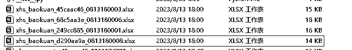
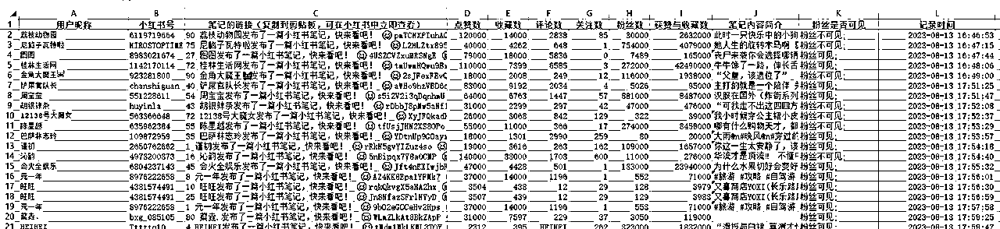
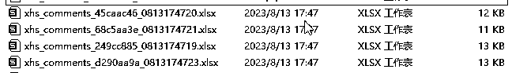
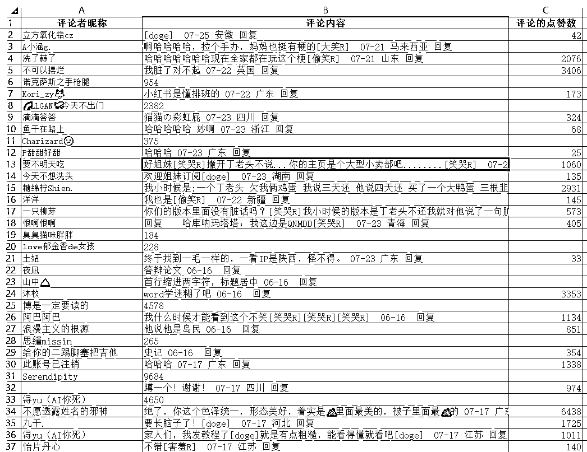
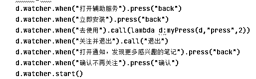
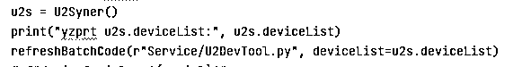
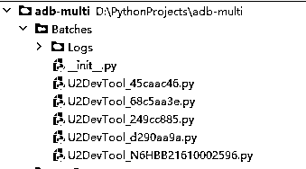

# RPA干货分享-定制自己的模拟人工操作脚本(PC端上Python启动，安卓端真机上执行)

> 来源：[https://xq23zki45o8.feishu.cn/docx/KYU8dqlH9oM40SxJpIPc976Nn4c](https://xq23zki45o8.feishu.cn/docx/KYU8dqlH9oM40SxJpIPc976Nn4c)

RPA干货分享-定制自己的模拟人工操作脚本(PC端上Python启动，安卓端真机上执行)

# 一、 写在前面

## 1\. 什么是RPA?

RPA: 机器人流程自动化（Robotic process automation，简称RPA）是以软件机器人及人工智能（AI）为基础的业务过程自动化科技。机器人流程自动化（RPA）系统是一种应用程序，它通过模仿最终用户在电脑的手动操作方式，提供了另一种方式来使最终用户手动操作流程自动化。

## 2\. 本文的应用场景及适用人群

我们平时在刷抖音或小红书等APP的时候，主要都是靠真人进行点击操作，确实有些工作是没法用人工操作替代的，但除了真人，机器人在特定场景可能比真人更适合去做一些工作。试想一个场景，你在做抖音或小红书的某日常用品的带货，你想知道同行中有没有类似的“低粉爆款”（粉丝数量相对少，但点赞评论转发相对多，可能意味着选品优秀或方案优秀）的产品，你想获取同行业的商家或用户的数据，这时你可以人工去搜索浏览相关视频或笔记，自己去收藏或记录，但有另一种方案是你可以通过RPA技术，你输入搜索词和相应条件，让机器人去帮你刷抖音小红书，并自动记录“粉丝数小于3000且点赞数大于2万"的视频或笔记，并最终整理成excel等文档，再呈到你面前让你批阅和抉择；再试想一个场景，你想起20个某行业相关的抖音或小红书的号来方便你之后做矩阵化运营，你想让这20个号去吸引一些精准的粉丝，并让他们去做一些基本的互动，但20个号总比2个号多得多，纯人工去操作和养号可能会增加很多的人工成本，这时候RPA同样能帮你快速建立20个机器人，比如你做AI绘画行业，当你输入搜索词和一些条件时，这20个机器人会去搜索你设定的AI绘画的关键词，去浏览搜出来的视频或笔记，然后根据你设定的条件，去决定什么情况下记录该视频及作者的信息、点赞收藏转发该视频，同时他们也可以去评论区，根据条件记录参与评论人员的ID与评论消息并根据你设定好的评论话术发表评论，最终这些作者与粉丝信息也将生成excel等文档呈现到你面前。如果你觉得上述两种场景刚好契合你的需求，那本文应该对你有所帮助。

本文因为介绍一些基础的实现原理并涉及到编程及定制，适合有点Python基础与其它技术基础的人。如果你没有这些基础，又想让RPA技术帮你解决一些上述场景的问题，推荐影刀工具（基础的自动化脚本，也要有一定的逻辑思维写简单的代码，https://www.yingdao.com/），其它一些群控但谈不上RPA定制的工具有 Scrcpy（开源免费，投屏+群控，https://github.com/Tomotoes/scrcpy-gui/releases）,Total Control（基础免费+商业付费，安卓设备多控系统，https://www.sigma-rt.com/tc/）等。

## 3\. 正文前的一些说明

本文主要基于python的 uniautomator2 框架，仅支持安卓的手机，需将手机与电脑与数据线连接，需要开启安卓手机的开发者权限与USB调试权限。

本着开源和分享的态度，本人希望文章能让更多的人了解并感受RPA的魅力，但实际写的时候，还是发现要讲的东西似乎非常的多，很难一篇文章将所有东西理清楚，因此本文挑了重点的内容以及实际开发中容易遇到的坑讲，希望大家少走弯路，想深入了解代码和进行运用的，欢迎加文末微信号私信我。同时文末附上了项目的完整代码的gitee地址，由于之前只是作为自己使用的工具来写，虽涉及到抖音、小红书、知识星球、闲鱼等多个APP，但是没时间去整理，所以比较零散，一些代码风格还不够规范，仅供大家作为部分参考和运行。

## 4\. 本文要实现的最终效果

A. 以自动浏览笔记并记录相关数据的脚本为例:

以上为自动化过程的视频

以上为最终生成的Excel表格

B. 以根据链接自动到评论区截流（获取评论者信息）为例:

以上为自动化过程的视频

以上为最终生成的Excel表格

当然了还可以实现其它很多功能，不一一列举，可根据实际需要进行开发

# 二、 开始正题

## 1\. 前期环境的部署

主要参考这篇CSDN博文 https://blog.csdn.net/qq_43540385/article/details/127243814，另外如果过程中需要安装 atx-agent，可参考这篇CSDN博文 https://blog.csdn.net/fuhanghang/article/details/123086044（但我记得在后期代码用代码运行uniautomator2时会自动安装）

## 2\. 主要功能代码的编写

同样参照上述博文 https://blog.csdn.net/qq_43540385/article/details/127243814，里面有关于最基础的方法的介绍。另外需要特别注意的有如下几点：

A. python版本最好切到3.7版本，不然可能部分功能会不兼容

B. toast操作似乎并不能用，而且会阻塞接下去的程序

C. 相对定位方式似乎速度挺慢的

D. 有子元素和兄弟定位，但缺乏父级元素定位，开发过程中有时会挺不方便

实践开发过程中需要注意的有如下几点：

A. 控件的 resourceId 在抖音和小红书这两款APP上很多并不是固定的，似乎会根据不同手机和不同账号等因素而变化，所以实践过程中很多控件没法用最简单的 resourceId 方法进行定位，需要灵活运用 text 等其它方法进行替代。

B. 除了用 d(resourceId="xxxx")，d(text="xxxx") 等方式进行定位外，d.dump_hierarchy() 也可以获取整个页面的控件文本信息（xml格式），再通过 "from xml.etree import ElementTree as ET, ElementTree" 导入相应的节点操作模块进行查找和处理。但有一点要注意的是，部分弹出的窗口或页面是没法用 d.dump_hierarchy() 方法获取信息的。

C. 早期的安卓手机版本是可以直接获取手机剪贴板内容的，但在 android10或android11 以后，剪贴板内容只允许写入，不允许直接读取，这就需要我们用一些巧妙的方法，把剪贴板的内容打打印出来再进行获取（我用的是在一个文本输入框粘贴出剪贴板的内容再获取该输入框的文本内容的方法）。

D. uniautomator2 框架允许 click(0.2, 0.8) 这种方法，意思是点击手机上X坐标为屏幕宽度*0.2，Y坐标为屏幕高度*0.8的点，利用这个方法可以兼容更多的手机，而不需要再去额外写一些兼容性的代码。

E. 脚本自动运行时，经常突然会弹出一些始料未及的弹窗，多用 d.watcher 的一系列方法去把它们过滤掉，比如下图这样

F. 启动抖音APP时，记得像 d.app_start(pkgName, wait=True,use_monkey=True) 这样设置 use_monkey 参数，否则会启动不起来

G. 注意APP本身的看似统一，实则有差异的界面，比如小红书笔记列表，点击去的时候有时候是文案，有时候是视频，有时候是直播，必要的时候需要对这些不同类型做不同的处理

## 3\. 主要代码文件的说明及一些配套python模块的使用

A. U2Syner.py，封装了一个关于基本操作与部分脚本程序的类，设备的获取及一些基本操作要用到这个类

B. U2DevTool.py，主要写了一些脚本程序的代码，封装成一个个方法，涉及到抖音、小红书、知识星球、闲鱼等，同时也有一些基本的操作方法

C. BatchRunDevices.py 文件，为保证各手机间的相互独立，让一部手机对应一个进程，而非一个线程，编写了一键生成子文件的代码，比如运行下图代码后会根据设备id生成下下图的子文件们，然后再在 Run/Debug Configurations 里添加 Compound 进行一键批量运行.py文件

D. xml.etree，上述 d.dump_hierarchy() 方法使用到的，方便处理 xml 文件

E. xlwings，采集信息时用的 txt 文档进行信息保存，比较方便和高效，后期为了美观和方便对比统计，有一键生成 xlsx 文件的方法，详见 RecordUtil.py 文件

F. adb-multi\Config\Params.py，ROOT_DIR设置成自动对应的根目录，比如ROOT_DIR = r"D:\PythonProjects\adb-multi"

# 三、一些补充

## 1\. 其它一些安卓手机上的RPA方式

本文主推 uniautomator2，因为它封装了很多全面、简便、稳定的方法，开发效率较高，可以一台电脑连接多台安卓手机进行批量相互独立的脚本运行，方便进行群控、跟踪、优化。

其它方法如安卓开发的 AccessibilityService，不需要经过电脑，每台手机上安装一个.apk文件后即可独立运行脚本，也是模拟点击的原理，缺点有：

A. 每次启动apk后都得打开无障碍权限

B. 在有弹窗以及个别信息列表的情况下，会出现无法定位某些控件的情况

C. 无法对某一坐标点进行点击等操作

D. 因为是每部手机独立运行自己的apk文件指定的脚本程序，无法用电脑进行群控

再如 安卓端上的按键精灵，根据坐标进行点击或找某颜色坐标或找图片进行模拟点击，2018年以后似乎已销声匿迹了。

## 2\. RPA技术当前的运用环境

RPA的功能挺强大，仿佛有一批机器人在根据你设定的程序，帮你在手机上进行相应的操作，并且它们永远不觉得繁琐和疲倦，所以在一些没那么注流的APP或特殊的场景，这项技术有时往往能发挥出巨大的价值。然而，主流APP如抖音或小红书，即使只是模拟人工点击的RPA，它们会在一些相关接口的请求次数上限制你，比如小红书的给陌生人发私信，本来设想的一个账号每天发10条私信就好，通过一部手机上部署3个抖音号，整5部手机的话，你或许觉得一天能给陌生人发10*3*5=150条私信也不错了，但实际情况是小红书似乎也有几天内发的私信总数的控制，比如连续发了第5天后，开始对你的号进行禁发私信的限制了，这样RPA在发私信上的作用可能就大打折扣了。不过好在RPA不单单可以发私信，只采集信息而不跟人互动一般不做限制，一般性的点赞关注评论，只要不太过分，一天能发生互动的数量应该会比发私信多得多，所以用RPA来采集一些信息或进行批量养号或许是个不错的选择。

## 3\. 完整代码的gitee地址及作者联系方式

gitee地址：https://gitee.com/attacking-potato/rpa-multi.git

联系方式：微信号 potato_226（进击的土豆）

最后，对于未接触过RPA，想深入了解学习RPA的朋友，欢迎随时私信交流。由于每个人能力有限，文中有错误或过时的地方，也欢迎大家指正和提醒。谢谢阅读。