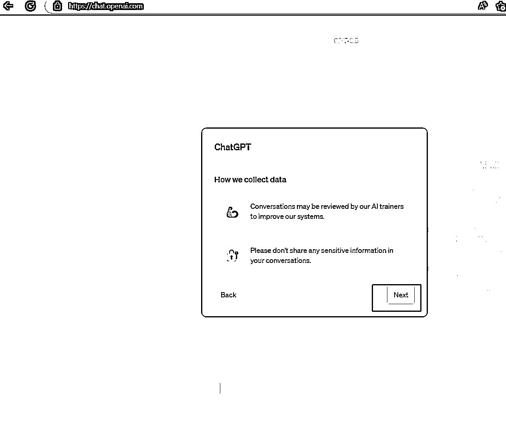
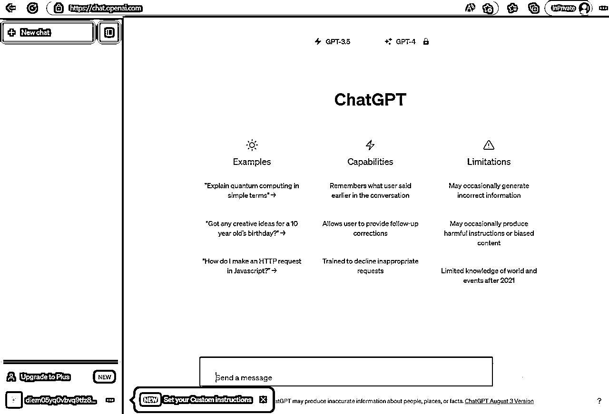
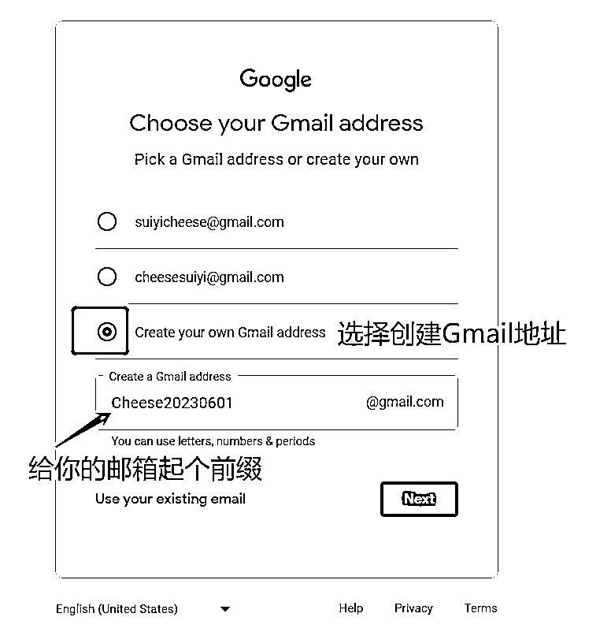
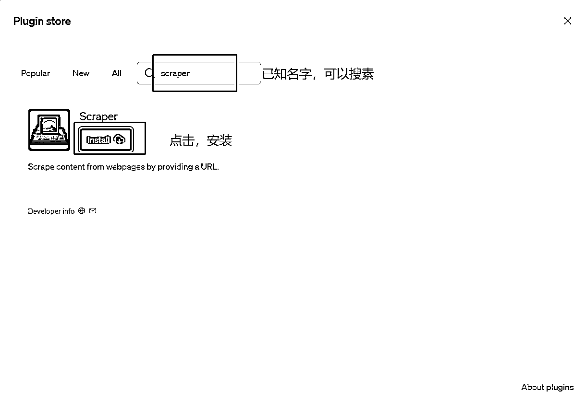

# 【实战】3_1_一文讲透ChatGPT环境搭建的所有内容

> 来源：[https://atbs4xk1uw.feishu.cn/docx/KkVadELq6oDX9pxqwDRcIGdjnjg](https://atbs4xk1uw.feishu.cn/docx/KkVadELq6oDX9pxqwDRcIGdjnjg)

收录于 AI实战教程 合集

# 一、引言

## (一）效果小剧透

一文讲透ChatGPT环境搭建的所有内容

先让你立刻拥有自己的ChatGPT机器人儿，

最后从方方面面，保姆级的实战讲解ChatGPT的所有环境搭建

可从0到1的掌握ChatGPT3.5、ChatGPT4、ChatGPT plus、app版、api key、插件模式、Browsing模式、Plugins模式、Code Interpreter模式、功能的所有入门玩法

哈喽大家好，我是全网最接地气的AI实战教程博主，海盐，专为小白而生，专注打造全网最容易上手的AI实战教程

本教程分为必修模块和选修模块，【必修模块】必须全部掌握；【选修模块】直接跳过也不影响全部教程最小闭环，可学完全部必修教程后，有精力回头再看

爆肝8000字，值得收藏，反复查阅

🚗只有干货，坐稳发车

* * *

## (二）解决的痛点

现在网上那么多所谓的“安装注册教程”，反倒把好多人搞得一头雾水，找半天找不到个准儿

还有的宝子，不知道ChatGPT3.5、ChatGPt4、ChatGPT plus、app版、api key、插件模式、Browsing模式、Plugins模式、Code Interpreter模式都是个啥，怎么用？

这就特意给大家整了这个“面向小白的ChatGPT安装注册实战全集”，绝对的接地气，绝对的实用，绝对的新鲜！

跟着海盐，保证让你不再迷茫，不浪费时间。咱们一块儿，一步一步搞起来~开整吧，大家~

* * *

## (二）升级打怪路线图

全局概览，心中有数

【必修模块】预计耗时5min；【选修模块】预计耗时0.5day

记得对照左侧目录层级，思路更清晰

* * *

# 二、必修模块（2小节）

让你光速用上ChatGPT

## (一）【实操1/2】快速体验第一次ChatGPT对话

直接上手试一试，比理论讲了千言万语都有用

### step1.使用魔法

守法公民，这儿不能讲

### step2.打开ChatGPT官网

推荐用电脑的google浏览器，使用无痕模式访问页面：https://chat.openai.com/

这是唯一官方网站，不要被一些其他不安全的网站忽悠

另外

没有google，用其他浏览器也可以

不用无痕模式也可以，当有各种访问不了的问题时 用无痕模式 都能解决。如果无痕都解决不了，99%是你魔法出问题了，1%是官方挂了

更新：2024年4月，ChatGPT可以免注册免登录，打开网站，可直接使用3.5模型，和ChatGPT进行对话

没登陆，是游客身份，和ChatGPT的对话记录无法保存

## (二）【实操】登录3.5账号与ChatGPT对话

### step1.登录

如果已经有了ChatGPT账号，进入官网https://chat.openai.com/后，点击Log in，进行登录

如果没有，也别急，后边海盐会教你注册

输入账号：

如果你的账号名google邮箱的，就选择Google方式

如果是微软账号的，就选择微软方式

如果是Apple账号的，就选择Apple方式

如果是其他邮箱的，用默认的，直接填就好

输入密码：

点击 Continue，OK啦。出现弹框不用管，一路点击 next

你的页面将是这样的，有一个能和ChatGPT聊天的对话框：

### step2.ChatGPT对话

在对话框里，随便给ChatGPT下命令，恭喜你拥有了自己的AI小助理啦，你们的聊天记录都可以被记录在你的账号里~

是不是非常简单~非常酷！

# 三、选修模块（11小节）

直接讲透ChatGPT环境搭建的11个实战

## (一）【科普1/11】拥有自己的ChatGPT3.5账号

### 1 方式一 钞能力获得

守法公民，不多说了

能说的是，比自己搞花的金币要少，主打一个省心

### 2 方式二 自己注册

#### 2.1 痛点

先给大家泼点冷水，说点大实话，这东西完全没必要自己注册，前几次搞，小白全程至少需要1小时：

（1）注册过程中也需要你自己去频繁测试接码平台的手机号，可能需要1-2h的时间和耐心

（2）注册成功后，你的邮箱被官方禁用的概率很大，会导致你的ChatGPT账号也被禁用。有时是单纯的ChatGPT账号被官方禁用了。需要重新从头开始注册

（3）使用接码平台的号池，需要付费，这个价钱你已经可以拿钞能力直接得到几个号了。免费的接码平台已经不可能注册ChatGPT了，越贵的验证码成功率越大，一般首充就需要2美元

#### 2.2 实操步骤

但是，海盐还是会给大家讲整个ChatGPT的注册流程和要注意的坑。感兴趣的宝子可以先了解一遍，再决定是否要实操

##### step1.使用魔法

开启魔法，确保可访问ChatGPT官网https://chat.openai.com/

守法公民，不多说了

##### step2.注册国外邮箱

注册ChatGPT需要使用国外邮箱，这里以Gmail为例（和Google账号是一个），其他邮箱类似

用浏览器访问注册Gmail邮箱的页面：https://accounts.google.com/signup/v2/createaccount?flowName=GlifWebSignIn&flowEntry=SignUp

名字随便填写，用英文，点击Next

生日和性别也随便写，但注意出生年份必须是成年人，点击Next：

自定义邮箱地址，点击Next:

设置邮箱密码：

##### step3.使用接码平台

接下来，要验证国外手机号， 我当前的IP是菲律宾，就用同样国家的手机号，最安全

这就需要接码平台了，浏览器访问https://sms-activate.org/contacts，这个网站里自己随便注册，然后登录就好

点击页面右上角，头像余额的小箭头，选择充值

成功使用一次验证码差不多是6块~12块不等。只能充美元，每次最少2美元，使用支付宝就可以自动换算为人民币来充值

点击这个服务，会出现很多国家的手机号列表

如果没有你想要的国家，直接在搜索框中搜索，点击购物车按钮，就加入了购物车

页面中间会出现，购物车的内容，这就是你的一次性手机号了

复制手机号，到Google页面，粘贴，点击Next

如果，这个手机号被google风控了（拉黑了），不能用于注册Gmail，页面会直接提示报错

按照之前的操作再去换一个手机号填入，直到测试出一个可以的手机号，google就会给手机号发短信了，验证码会现在下方页面的“等待短信”4个字处。不能注册的手机号，接码平台后边会退费给你

测试手机号的这个步骤，没有人会告诉你，如果运气不好，是需要尝试几十次......一个大写的苦哈哈......1~2h就过去了。当然，运气好可能比较快。价格高的验证码，通过率更大

这里我填写的手机号是可以的，点击下一步，开始接收验证码

sms页面上收到验证码，复制给google页面中，就好啦

只要成功收到验证码，sms就会扣除这次费用

一个google账号注册完成

##### step4.注册ChatGPT

进入官网https://chat.openai.com，点击Sign up开始注册：

可以选择用Gmail账号（也就是Google账号）、或微软帐号注册，也可以用其他国外邮箱注册

这里以Gmail邮箱为例（我们刚刚注册是就是google），对应点击页面下方的Google方式登录：

输入Gmail邮箱，点击下一步

设置一个ChatGPT的密码，点击下一步

输入姓名、生日(必须成年)，点击Continue:

接下来，进入国外手机号验证

也要使用接码平台，接码平台上选择服务时，写openai，选择国家时选择和你IP一样的，最安全。(具体步骤和章节step3.使用接码平台 一样。不赘述了

成功接码并输入后，你的ChatGPT3.5账号就注册成功啦~

可以直接登录，和ChatGPT对话啦~

## (二）【科普2/11】如何购买ChatGPT plus

### 1 方式一 钞能力获得

守法公民，不多说了

能说的是，和自己搞相比开销差不多，但有质保，主打非常省心

### 2 方式二 自己充值

#### 2.1 痛点

依旧，先给大家泼点冷水。这东西完全没必要自己充值。

1.要有国外信用卡，对很多宝子来说，已经不现实了。

2.花费的金币和钞能力直接获取差不多。但你自己充值的账号很可能没几天就被禁用了。大多数人的余额是退不回来的。账号会被openai直接删除。

当然，使用虚拟卡的方式也可以。但麻烦还贵，依然容易被禁用，完全不建议，对于虚拟卡这种费力不讨好的方式，海盐不提供教程。

但依然会给大家奉上国外信用卡充值的方式~

#### 2.2 实操步骤

##### step1.准备好国外信用卡

自己的，或找男朋友帮你付~

##### step2.登录ChatGPT官网

用3.5账号登录https://chat.openai.com/

##### step3.升级为会员

在聊天页面，点击左下角Upgrade to Plus，就可以升级啦：

## (三）【科普3/11】你的第一个ChatGPT4对话

我们先使用一下ChatGPT plus账户默认的GPT4模型的default模式

### step1.登录plus账号

浏览器访问官网https://chat.openai.com，点击Log in，进行登录:

选择登录方式，这里以google为例

输入用户名和密码，会进入到聊天页面，现在默认是GPT-4模型的default模式。之前是默认GPT3.5模型

### step2.和GPT4的Default模式的第一次对话

## (四）【科普4/11】和plus版GPT3.5的第一次对话

### step1.登录plus账号

和前边一样，不赘述了

### step2.和plus版GPT3.5的第一次对话

在新窗口中，切换到GPT3.5

直接和它说话就好啦

你会发现，plus的GPT3.5响应速度是最快的，但是没有GPT4那么智能

## (五）【科普5/11】和GPT4浏览器模式的第一次对话（已下架）

plus用户的浏览器模式，可以自动联网，让GPT4获取到最新的互联网信息

### step1.登录plus账号

前面讲过，不赘述了

### step2.切换到浏览器模式

在网页的左下角，用户名处，点击...，再点击Settings

打开功能开关

在新的对话窗口中，点击 GPT-4，选择 Browse with Bing

### step3.和GPT4浏览器模式的第一次对话

问它一个最近的消息考考它

没错儿！答对啦

## (六）【科普6/11】和GPT4插件模式的第一次对话（已下架）

### step1.登录plus账号

前面讲过，不赘述了

### step2.切换到插件模式

在网页的左下角，用户名处，点击...，再点击Settings

打开功能开关

切换到插件模式

### step3.安装插件

第一次使用，插件处都是空的，需要去Plusgin store（插件商店）中选择喜欢的进行安装

已知名字是scrapter，可以直接搜素，安装

灰色就是安装好啦（想卸载这个插件，就点灰色按钮）

### step4.选择要使用的插件

从已安装的插件列表中，勾选 你要使用的插件，最多可以勾选3个

GPT4会智能的自动调用合适的一个或多个插件用在和你沟通中

当然，如果GPT4别识别出这里要调用插件回答才会更好。你可以强制命令它：请调用某个插件帮我解答

### step5.和GPT4插件模式的第一次对话

这里以scraper插件为例，它的功能是能让GPT4联网，查询到互联网最新信息。比浏览器模式好用很多。也是海盐认为，所有插件里最最好用的和常用的一个

我怎么知道插件都有什么功能呢？有多少类插件？有多少个插件？

对于插件商店中，众多插件的功能和效果的介绍和推荐，海盐会单独出一期教程。这里，我们学会怎么插件的基础使用就好啦

我们使用scraper插件的联网功能，搜集一下近3天的AI新闻

让GPT4给出了参考链接，方便我们验证真伪。还不错

## (七）【科普7/11】和GPT4代码解析器模式的第一次对话（含解决中文乱码问题）

之前说过，ChatGPT4的Code Interpreter代码解析器模式堪称王炸之作。有了它，你就有了一个会写python代码的好兄弟，重要的是，你用普通话和它说你的需求，好兄弟就会帮你办了

这里以一个小例子，带大家入门

### step1.登录plus账号

前面讲过，不赘述了

### step2.切换到Code Interpreter模式（更新：plus账号的4.0模型已默认开启此模式，不需要执行本步骤了）

打开功能开关

新的聊天窗口中，选择Code Interpreter模式

### step3.和GPT4代码解析器模式的第一次对话

注意，Code Interpreter的存储空间具有临时性。超出本窗口，GPT就不记得这个文件啦。对话中断时间过久，GPT也会忘记之前的文件

附上海盐使用的数据文件和中文字体：

请帮我对txt文件中的新闻进行数据分析，不需要询问我，不需要说多余的话，请做出2个不同种类的直观的图标统计即可，请用中文回答。

要求:

1.  如果有饼状图，请调整饼状图的大小和位置，标签移至了图表的右侧作为图例，确保文字不会重叠；

1.  调整字体大小，确保文字清晰；

1.  使用我提供的字体显示所有的文字。

有了code interpreter还会有数据分析师手动画图表嘛？把你的数据文件喂给code interpreter搞定就好啦~再也不用费劲心里整理格式、清洗数据了

不会数据分析的普通人，也可以在code interpreter的加持下，分析起来自己从来不敢看害怕看不懂的数据

关于中文字体，是用来解决中文图表乱码的问题的，模仿海盐直接拿去用就好。在之后单独的code interpreter教程中会专门讲解

## (八）【科普8/11】双因素身份认证（已下架）

双因素身份认证，就是每次登录时，不仅仅需要使用密码，还需要使用一个临时的验证码，最大限度的保护你的账号安全。

在风控严格期间，开启双因素身份认证，会让你的账号更安全，更稳定。

但在20230708更新的版本中，已取消这个功能，未来不确认是否还会开启

以前，使用GPT4从Plusgins store中安装个别插件时，会强迫你必须启用双因素身份验证，否则无法安装。

接下来，我们还是来演示一下，开启和关闭双因为身份认证功能。

### 1 开启双因素身份认证

#### step1.打开双因素身份认证开关

GPT聊天页面 -> 点击 左下角... -> 点击 Settings -> 点击 Data controls -> 点击最后一行authentication后边的 enabled按钮 （我现在已经开了，所以按钮显示disable了）

#### step2.立即重新登录

开启双因素身份验证后，会让你立即重新登录，输入用户名和密码后，会出现如下页面，让你二次认证

#### step3.下载Authenticator app

需要下载Authenticator app，IOS是这个名字，安卓自己找找类似。这种app就是专门做双因素身份认证的。有的会收费。IOS这个是免费的

#### step4.生成验证码

用app扫描GPT页面的二维码，app中会出现一个倒计时有效期的验证码，输进GPT页面，点击Continue就好啦

#### step5.后续登录

注意：以后每次登录都需要2次验证，只不过，以后不需要扫二维码生成验证码了，你的app中一直有一个验证码，填进去就行

### 2 关闭双因素身份认证

#### step1.关闭双因素身份认证开关

如果你认为每次双认证比较麻烦，可以手动关闭这个开关，以后还是用账号和密码登录

点它：

## (九）【科普9/11】你的第一个ChatGPT IOS app

### 1 功能限制

IOS版的ChatGPT，登录plus用户，可以选择GPT4模型，但是插件模式并没有集成进来

但app集成了OpenAI 的开源语音识别系统Whisper，能进行语音输入，此功能免费

IOS的app中，GPT4模型的使用是可以无限次数的，没有网页版的对话次数限制

### 2 使用限制

目前只对美区用户开放，也就是说，你的AppleID需要是美区的，才能在App Store中搜索到ChatGPT的app

### 3 获取美区AppleID

#### 3.1 方式一 钞能力

守法公民，不多说了

块八毛的，省心搞定

#### 3.2 方式二 自己注册

对于美区appleID，想自己注册或修改的宝子，接下来本教程会手把手带你注册

##### step1.备份手机数据

照片和备忘录中重要的内容，注意备份好。没有人会和你讲这个，但是海盐真真切切的遇到了坑

这里没说魔法，就不需要哈

##### step2.准备一个国内邮箱

需要一个从未注册过AppleID的邮箱，国内的163邮箱等都可，没有的就注册一个

##### step3.准备一个手机号

需要一个能接受验证码的手机号，支持中国大陆的，你自己的手机号就行

##### step4.修改地址

浏览器进入Apple官方的创建AppleID的网站： https://appleid.apple.com/account

根据提示输入你的个人信息，注意红色部分要写对：

##### step5.邮箱验证

所有信息输入完成，会进入到邮箱验证：

##### step6.手机号验证

邮箱验证完成后，会进入到手机号验证：

##### step7.注册好的效果

当进入到登录和安全页面，说明你的美区AppleID已经注册好啦

##### step8.退出原账号

打开手机的App Store，点击右上角图标：

滑到页面底部，点击退出登录：

##### step9.登录美区AppleID

在App Store中登录刚刚注册的美国AppleID ，这里记得点击登录 ，不要点击右上角的完成：

好啦，现在你成功自己注册了一个自己的美区ID，可以在Apple Store中搜索到ChatGPT app啦

#### 3.3 方式三 自己的账号修改成美区（拔草）

注意，如果你的AppleID账号中，存在订阅内容，无法使用此方式。哪怕你现在取消订阅，也无法使用。请选择其他方式。另外，你的账号改成美区后，国内的app你搜索不到了！

##### step1.修改地址

进入Apple官网 https://appleid.apple.com， 点击登录，输入自己的AppleID

登录成功后，在右上角下拉菜单中选择个人信息

在国家或地区页面选择更改国家或地区，注意，如果提示无法更改国家或地区，只能改用其他方式

##### step2.填写付款信息

已进入到付款方式页面，按照如下描述填写相关信息：

国家或地区：美国

付款方式：无（注意：若付款方式无法选择“无”，请改用其他方式下载）

账单寄送地址：随便写

电话号码：001+任意10位数字 （001代表美国）

送货地址：随意写，但这里的国家或地区选择美国

##### step3.退出原账号

同方式二，不在赘述

##### step4.登录新的AppleID

同方式二，不再赘述

### 4 安装ChatGPT IOS app

#### step1.手机登录美国AppleID

前面讲了，不再赘述

#### step2.下载IOS版ChatGPT app

没说，就是不需要魔法

在App Store中搜索ChatGPT，一定要看清了是openAI的ChatGPT，才点击下载（市面上太多假冒了），在首次下载软件时，会要求设定AppleID的一些信息，看见这个弹框，就点击检查：

#### step3.付款方式不要选择

按照提示一步一步操作即可，注意付款方式不要做任何选择，其它的内容可随意填写：

###### 

#### step4.切换回原来的AppleID就OK啦

下载完ChatGPT app后，你可以将AppleID切换回原来自己的中国大陆的账号，当然，也可以一直使用新的AppleID

###### 

## (十）【科普10/11】你的第一个ChatGPT API key

OpenAI官方在2023年3月1日，正式对外开放了能调用ChatGPT模型的API，开发者可以通过ChatGPT API来基于GPT模型开发自己的应用程序了

还有，使用一些国内套壳的ChatGPT软件时，会让你自己提供openai的API key，花费你账户的余额，来供你使用

这都需要我们自己从官方获取ChatGPT API key

本节只讲如何获取ChatGPT API key。关于小白如何从零开发自己的ChatGPT应用我们后边会用单独的教程来讲

### step1.登录官网

https://platform.openai.com/account/api-keys

用你的GPT账号登录

### step2.查看额度和到期

目前，不管是ChatGPT3.5还是plus账号，每个账号都有免费的5美元使用API的额度，限时3个月内使用，会过期

在这个页面，可以查看这个账号每天API的额度消耗情况

### step3.申请api key

点击左侧栏的 [API密钥] -> 点击右侧的 [+创建新的密钥]

在弹框中，给这个密钥，也就是api key起名字 -> 点击 [创建密钥]

弹框中会出现一个密钥字符串，务必复制并保存起来，关闭弹框后，密钥从任何地方都看不见了

注意，如果密钥保存丢了，只能重新创建新的密钥

一个ChatGPT账号可以申请多个密钥，多个密钥共用这一个账户的额度

### step4.删除api key（备用）

你的密钥一旦丢失，或暴露给他人，一定要第一时间删除密钥，来保证自己的账户权益，避免被人乱用

## (十一）【科普11/11】如何给ChatGPT API充值

### 1 ChatGPT API的价格体系

充值前，我们需要先了解ChatGPT API的价格体系

免费的5美元额度用完后，可以自行给账户充值，但默认每个月最多能使用120美元的额度。超出120美元/月的限额需要额外申请（填写申请表：https://share.hsforms.com/1AQvscELNT724FkL2Hp5Lvg4sk3，别急，一会就教你。但通过的难度较高。）

那你一定想知道，使用API对话一次，会消耗多少美元

调用GPT-3.5-turbo模型，官方的定价目前是，输入使用1000token需要0.0015美元，输出使用1000token需要0.002美元

1000token，官方大概估算是750个单词

也就是说，你给chatgpt下一个命令，使用了750个单词，要花费0.0015美元，GPT处理后回复给你结果，结果使用了750个单词，要花费0.002美元。你本次对话，总共使用了1500个单词，花费了0.0035美元，约等于人民币2.5分

当然，在调用ChatGPT API时，可以自主选择使用哪种GPT的模型，不同的模型，消耗的价格是不同的，最贵的是GPT-4-32k模型，目前输入0.06美元/1k token

了解这些就够啦~普通人想玩，搞个120美金的账号就好啦，经济实惠

如需要了解具体的模型和价格。请看官网：https://openai.com/pricing

这里，海盐给出了三种获得ChatGPT API额度的办法。1.自己充值。2.钞能力。3.申请Microsoft for Startups项目

### 2 ChatGPT API充值方式

#### 2.1 方式一 自己充值

需要国外信用卡。没必要，很贵。但教你

##### step1.进入官网

https://platform.openai.com/account/billing/overview

登录你的GPT账号

点击左侧栏 Billing -> Overview -> 点击 右侧 [Set up paid account]

##### step2.选择使用者类型

在弹框中，选择个人使用还是公司使用

##### step3.添加国外信用卡

点击后，新的弹框中，添加你的付款银行卡。只能用国外的信用卡

您的卡上将被临时扣押 5 美元的授权。在每个日历月末，系统都会向您收取该月内发生的所有使用费用

#### 2.2 方式二 钞能力获得

守法公民，不多说了

价格会便宜非常非常多

#### 2.3 方式三 Microsoft for Startups计划（拔草）

openai官方为了扶持AI的发展，给初创公司提供了一种激励方式，也就是Microsoft for Startups项目。初创公司可提交申请，一旦被openai官方通过，则可免费获得2500美元的额度使用6个月，用于API调用GPT-3.5、Codex、DAL·E和Whisper模型，来进行程序开发

提交申请表后，如果成功通过，会在7-10个工作日内看到信用度到达账户。难度较大，过的很少

##### step1.打开网址

https://openai.com/microsoft-for-startups

##### step2.填申请表

申请书和Organization ID，我们接下来教你无脑快速搞定

##### step3.使用ChatGPT无脑写申请书

我的提示词：“请你扮演一个开发者初创公司CheeseAI的创始人Cheese，你公司计划开发的项目是使用ChatGPT API来开发各个垂直领域的提示词模板，方便新手用户使用模板能够快速上手ChatGPT，获得自己想要的答案。现在需要你写一份申请书，申请加入openai的Microsoft for Startups计划，来使用ChatGPT API，开始你的项目。注意，申请书需要用词恳切，说明出你项目的价值，以便于更好的通过申请。全文不超过300字。请给出中文版。”

后边会专门讲对于ChatGPT提示词的调教，这里直接拿去用，注意力不要跑偏，一定要注意重点

注意提示词中加粗部分，按需修改，别和我完全一样，以防雷同导致不通过

直接上实操案例：

根据你的想法优化一下，比如，再给你的申请书加上这样一段话：

“没错，这份申请书部分是由ChatGPT帮助我生成的，我和他描述我团队的远景和我对本计划热切的期待，GPT非常棒的帮助我开启了计划申请的第一步，它是多么的有魅力，帮助我表达出心中所想，极大的提高了每个人的生产力。

我们希望可以帮助更多的初学者一起感受GPT的生产力，加速人类的进化，让世界更美好。”

让ChatGPT帮你翻译为英文，填入申请表：

##### step4.查找Organization ID

打开官方网页https://platform.openai.com/account/org-settings

登录你自己的ChatGPT账号，页面左侧点击Settings -> 页面右侧 复制Organization ID即可

填入你的申请表中

点击一下黑色提交按钮，就完成了

##### step5.确认已申请ChatGPT API key

提交申请后，邮箱很快会收到邮件，邮件中会要求你的ChatGPT账户必须申请了API key

如果没申请的，请按照前边的【如何获取自己的ChatGPT API key】小节，申请

然后安静等待就好了，7-10个工作日内，一旦你的申请表审核通过，账户中就会出现2500美元的额度了

# 四、总结

到这里，关于ChatGPT官方环境搭建的所有内容，就通通搞定啦

别问安卓app咋没有教程......痛！官方有app！但海盐不行！鼓捣了整整一天，华为把海盐劝退了。真的各种坑，各种型号的手机都不一样，坑也都不一样，海盐没有那么多安卓机去测试，更没办法一下子讲通用了，各位大老爷各显神通叭，小白不建议你鼓捣，投入产出比完全不值当。况且，网页版真的很香！（参考：小米有成功的，mate20有成功的，华为nova没成功）

好啦，我们下期再见~

From Cheese海盐芝士

2023.08.11 04:07 哈尔滨

2024.04.09 03:55 北京【更新】

* * *

哇，谢谢你的喜欢，耐心看到这里。恭喜你发现了一个宝藏博主~

Cheese海盐芝士

AI狂热玩家，6年大数据技术

内容矩阵：AI实战教程 | AI情报快讯 | 提效工具库

希望海盐的分享，可以让普通人在AIGC时代，不再旁观，动手实操无卡点~