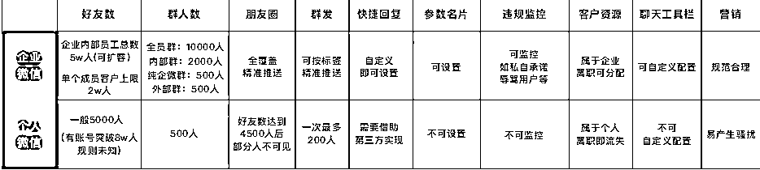

# 私域运营体系实践手册 | 乔帮主

> 来源：[https://w91h2gmtrn.feishu.cn/docx/KyV8dB8ZSormmFxS3p0cFRfgnBg](https://w91h2gmtrn.feishu.cn/docx/KyV8dB8ZSormmFxS3p0cFRfgnBg)

必看 | 使用说明：

1、这份《私域运营体系实践手册》是我实战中整理的干货，分享出来希望对大家有所帮助！

欢迎圈友来链接和交流，赚钱路上一起同行、一起成长！

2、另外再送大家一份4T的点金工具箱见面礼：

3、欢迎圈友来链接和交流（微信：qiaobangzhu-cn），赚钱路上一起同行、一起成长！

4、乔帮主的AI实战训练营正在火爆招募中，全新的七大阶段的AI课程体系，手把手带大家玩转AI：

## 1、私域流量

底层核心逻辑是和客户做朋友，建立信任。形成持续增长路径 引流 >> 沉淀 >> 转化 >> 复购 >>裂变的闭环

私域流量的优势

性价比高：可免费、反复触达客户

流量可控 ：可随意推荐、展示信息

精准服务：池内客户与企业可双向交流

稳定性强 ：只要客户不主动离开就可以一直触达

## 2、企业微信

企业微信，是：

1、腾讯为企业打造的通讯与办公工具

2、与微信、小程序、微信支付互通，链接12亿微信用户

3、对内让企业沟通信息高效流转， 高效协同办公

4、有丰富的客户服务能力，自带欢迎 企业背书客户更信任客户群、客户朋友圈等功能

企微的亮点

可添加的好友无上限；多样群发，反复触达； 一键直播，随时带货；客户数据属于公司资产

防竞品，防广告；聊天内容可监控 ；

注册次数

身份证：一个身份证可以注册5个企业微信

手机号：一个手机号可以注册5个企业微信

企业主体：一个企业主体可以注册5个企业微信

公众号：一个公众号可以授权认证1个企业微信

企微信功能板块

OA:

打卡、审批、日程、会议、微文档、微盘、公费电话……

SCRM: 客户联系、客户群、朋友圈、互动服务、数据统计……

个人微信与企微的区别

### 2.1、企微营销触点

*   订阅号

*   视频号 服务号

*   直播 微信群

*   微生态下九种

*   企业号 私域营销触点 小程序

*   朋友圈 个人号

### 2.2、企微朋友圈的打造

对外头像：真人形象照头像；统一的卡通IP形象 ；与品牌特点相结合 ；

企微主页 ：产品功能介绍 ；活动介绍 ；官网链接或小程序

发布内容：有温度的工作日常新品；新功能介绍；活动福利优惠

企微昵称：易读、易记、有特色 拟人名称+品牌或产品名 企微IP打造

## 3、引流拉新

### 3.1、公域引流

#### 3.1.1、线上流量来源

信息流:今日头条、百家号 、大鱼号

视频类:抖音、快手、B站、西瓜视频

电商类:京东、唯品会淘宝、拼多多

社区类:微博、小红书、 知乎、贴吧

#### 3.1.2、引流策略

*   广告投放后，利用【渠道活码】自动记录客户的添加渠道和标签;

*   统计记录各渠道的引流数据，利用渠道欢迎语给客户自动发送活动等福利，留住客户。

### 3.2、线下流量来源

周边小区、商超商圈、连锁门店、展会沙龙地推、电梯广告……

#### 3.2.1、引流策略

给客户自动推荐附近的店铺，利用【门店活码】引导客户加入附近的店铺，提供精细化的服务。

### 3.3、社交触达:企微+小程序+视频号

*   在企业应用内关联小程序，成员转发工作台中的小程序给添加的微信用户，让企业成员之间、成员与客户之间，实现更为全面丰富的沟通展示效果

*   成员利用视频号去反复触达客户，视频号内放置文章链接，链接中植入企微二维码，形成闭环

### 3.4、价值诱导:企微+公众号+小程序

拼团类:1分钱抽奖、团长免团、新人助力

红包类:任务红包、瓜分红包、新人红包

邀请类:拉新返券、分销返利、老带新裂变

福利类:添加即可送代金券、礼品、资料等

## 4、裂变四要素

参与动因

分析谁会有动力来参加我这个活动，他一定是某个特定的人群

激励诱饵

拿什么去刺激特定的人群，是金钱还是荣誉，还是其他能够刺激他的一些要素?

种子用户

先驱动哪个人群去帮我发起活动

逻辑闭环

新用户可以变成老用户，重新发起活动，再邀请新用户

裂变活动的流程

明确活动主题〉梳理活动流程〉合理设计诱饵〉制作裂变海报〉产出引导话术〉裂变流程测试〉推广传播〉活动跟进〉数据复盘

### 4.1、社群裂变-例

创建群裂变海报活动——通过客户群发/客户群群发/朋友圈发送方式邀请A客户参与——A客户击链接进入活动群聊——活动群聊A客户专属海推送报欢迎语 ——A客户分享专属海报给好友(B客户)——B客户进入群聊即为助力A客户完成任务领取奖励 ——企业查看活动数据

## 5、社群运营

### 5.1、社群定位

*   产品型社群

*   兴趣性社群

*   品牌型社群

*   工具性社群

*   知识型社群

*   资源型社群

群公告

1.  成员知道你是谁(who)

1.  为什么要听你说(why)

1.  现在在发生什么事(what)

1.  什么时候发生(when)

### 5.2、社群拉新

拉新方式

1、多种渠道引流

从公众号、小程序、微信广告，其他电商平台、门店等多种渠道引流

2、裂变引流

海报裂变、好友助力、引流资料包等方式，配合微伴群裂变、任务宝功能

### 5.3、引流产品

1、实物引流产品属性

相关性 例如产品的体验装、小样

实用性例如盲盒、纸质书、鼠标垫

2、虚拟引流产品参考

培训类 如直播课，训练营、电子书

电商类 如代金券、折扣券、红包返利

餐饮类 如餐后小食、饮料、体验套餐

服务型 如诊断服务、咨询、设计服务

### 5.4、社群分层

同一针对性的客户建群，针对性转化

首先，和客户简单沟通后，根据客户的特征和需求打上标签;

再次，把相同或相似标签组的客户，拉到同一个群聊里;

最后，针对性制定社群运营策略，精细化提供服务进行转化;

### 5.5、社群留存

内容输出：整理符合社群定位的行业知识基于产品生产相应干货内容 ·群目标、理念、文化的灌输

理念输出：进行情绪渲染，拉近用户距离 如公益活动群、情感交流群等，持续输出社群的目标、理念、文化等理念等内容，

营销玩法：老带新活动、群打卡、抽奖、分销、促销、不定期红包等活动，提升客户的活跃度，增强社群粘性·

### 5.6、社群转化

自然转化

对产品表现出感兴趣的客户，对可一一解答实现转化

沉默转化

有一部分的用户是很难被转化的，可以鼓励这部分用户参与活动，实现二次传播和裂变

刺激转化

通过活动、氛围营造、时间节点适当刺激客户

单聊群发

一些特殊的消息比如优惠券、种草文章、知识科普等，可以单发给客户，需要注意频次

## 6、运营技巧

1.借助工具

借助一些打卡、抽奖的工具，例如微伴，可以提高群成员的参与度和活跃

2.自我介绍

方便大家更好的链接人脉和资源、感兴趣的会在群内活跃，提升社群价值

3.制造话题

借助一些行业话题、运营话题、时事热点引起大家讨论的兴趣，提高活跃和参与度

4.扶持群KOL

让群内活跃的高质量用户。在群里定时分享干货内容，培养群内意见领袖

5.线下活动

举办线下活动，使成员们更深度的建立连接。保证社群的活跃和生命周期

## 7、养号方法

前言：在新号养号的前15天，不要做任何营销操作，仅养号，每天互动多聊天多看朋友圈，想想你平时怎么用微信的，尽量模拟一个真人 进行操作。

1.  绑定银行卡，目前每个银行卡只能绑定一个微信号，如果有条 件，多开几个银行卡去绑定不同的微信号，绑定银行卡的权重挺高 的，能绑就绑，绑不了那就多养号增加活跃度也可以。

1.  每天填写一条个人资料，陆续丰富，这样可以增加权重。

1.  通讯录:第一天导入 30 人，以后每几天不定期导入 10-30 人，记住，只导入，新号不加人。

1.  加入几个群活跃群，也可以自己用几个老号组织一个群，增加活跃度。

1.  每天让一个老号加你，你通过。

1.  好友聊天，用老号和需要养的号假聊 10 句左右，语音图片文字表情都要有，每个新号每天分三个时段，每个时段最少和 个老号这样互动聊天。

1.  每天3条朋友圈，发好朋友圈以后组织老号给朋友圈点赞，发多条朋友圈，注意时间间隔开来

1.  每日在3个活跃群里发消息，每个群3条，文字图片语音表情随意，注意，不要发广告信息和公众号文章，

1.  每日模拟阅读腾讯新闻文章，打开最新的，模拟阅读到文末。

1.  转发订阅号里的文章到朋友圈，记得写分享语。(有好友的号，直接分享看一看里面的文章也是可以的)

1.  搜索公众号，关注几个，每天模拟阅读几篇文章，注意阅读时有一定停留并把页面拉到最下面，关注公众号，最好是一些知名公众号，比如说京东，一条，逻辑思维、人民日报等等，定期增加关注公众号，也可以取消关注几个

1.  至少在一个群里发红包，抢红包。(知晓支付密码的情况下)

1.  新号在沟通中，一定不要涉及到钱，银行，支付宝，账号，期货这些关键词，如果一定要说，请在十五天后再说。

1.  给自己的微信通讯录增加3个以上的好友分类标签。新号养号需要半个月，半个月以后也才可以开始加人，每天先慢一点，不要上来用力过猛，因为三个月内这个号还是属于新号，所以三个月内的营销行为都需要低调

## 8、日常操作

1.  和5个好友聊天，每天分三个时间段，每个好友来回聊天10句左右，要文字、表情、语音、图片、文章来夹杂不能是单向聊天，一定要是有来有回。

1.  养号加上的好友，每个主动和人聊几句天，不是推广告，而是稳住粉丝，给粉丝一个让你存在的理由，不要让粉丝删掉你。这样还同时增加了活跃度，具体话术根据自己的来编。

1.  打开腾讯每日推送的最新新闻，打开文章，模拟阅读到最后，然后随机再看三篇文章。

1.  搜索公众号，关注2个，并取消另一个公众号的关注。

1.  打开公众号，随机打开 2篇文章，模拟阅读并拉到最后。

1.  发朋友圈，并用其他号来点赞和评论。

1.  查看朋友圈，给好友点赞和评论。

1.  发1个红包给老号，用另一个老号发一个红包给本号。

## 9、注意事项

1.  手机号可以解绑微信号，但是解绑以后的微信号如果没有新手机号绑定，也很危险。如果频繁解绑和绑定，这个手机号和他绑定过的微信号，也会有问题。

1.  无论做任何批量的特殊操作，比如改头像，换封面，改签名，尽量把时间都错开，同一小时，同一下位置(基站)不要把10部手机都做同样操作。

1.  微信号绑定 QQ 号是增加权重的，但绑定的 QQ 号的密码和昵称不能都一样。

1.  正常使用的微信号，每隔一段时间，打开一下飞行模式，也就是说在基站换个登陆IP，长期在一个地方不换IP也是很奇怪的。如果有条件，让同事把手机分批带着出去兜兜风，换个不同地方登陆一下。

1.  无论做什么业务，如果加好友通过率低下，那么很容易被腾讯封，如果你加的人大部分都通过你，那么你能越加越多，所以好好设计你的微信号，另外，这是一个看脸的世界，头像产值高，通过率还是会高一点的。另外正能量的签名，也会有点帮助。

1.  持续加人的时候，需要及时和新加入的人互动一下，一来这样不是在持续做加人的动作。不容易被腾讯抓取数据。二来，新加入的人如果不能及时交互一下，容易直接删掉你。如果删的多了，容易导致腾讯判定你是营销号。

## 10、微信封号相关

1.  系统检测异常，比如说异地站街没有，模拟好位置和基站，时空变化太频繁太假等

1.  使用第三方软件利用腾讯代码漏洞被抓到，比如海量加人，多开等。

1.  用户投诉举报以上三点是目前知道的权重扣分很高的，下面这些是权重扣分次高的:

1)同一台手机批量注册的微信号

2)同一个ip 地址批量注册的微信号

3)注册新号立刻大量营销行为的

1.  注册新号立刻切换其他微信号登陆的

1.  绑定的 qq 号密码昵称雷同

1.  微信号个人资料里的头像、签名、照片等信息雷同，或者密码雷同。

1.  170 虚拟运营商号段的手机号注册的微信号，容易被封。

1.  大量微信号做同样的行为，比如说同时转发一条广告信息、大量加人。

1.  使用第三方插件抢红包。

1.  在微信端传播黄赌毒

1.  被投诉举报

* * *

乔帮主的AI实战训练营正在火爆招募中，全新的七大阶段的AI课程体系，手把手带大家玩转AI：

* * *

往期干货精选：

往期干货合集：

微信：qiaobangzhu-cn，欢迎交流！

公众号：乔帮主的AI江湖

