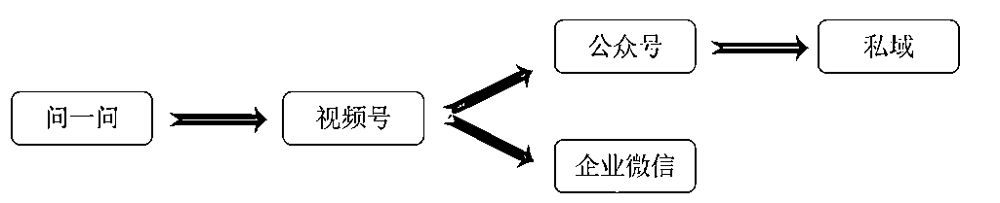

# 抓住微信问一问风口，带领800+学员，一个月创造千万曝光，保姆级操作教程！

> 来源：[https://k088r3bn2w.feishu.cn/docx/LgCIdXP4togroixvUOMcF1junZd](https://k088r3bn2w.feishu.cn/docx/LgCIdXP4togroixvUOMcF1junZd)

大家好，我是小可爱，擅长小红书资料，朋友圈运营，群发售，群裂变等等。

一个靠朋友圈7个月变现12万的白羊座女生，6月跟黛色学长，辰风三个人合作一起办了一个21天付费训练营。2天就达到了500人满群。

此次操盘付费用户达到了近800人。本篇主要讲了问一问这个如何群发售完整流程，附上问一问的实操的文档。

本次操盘所有人加一起达到了千万流量曝光阅读量。最高达到三天涨粉1000，两个号达到了5000粉丝。

目前优秀学员，单人在问一问上曝光有100W+，引流到视频号超过6k的精准粉丝，引流到公众号也有1k+粉丝！

6月中旬黛色学长看到别人发了问了问，立马敏锐的察觉到这个是个非常好的机会，当天找到我问我他这个想法怎么样，我们打电话聊了很久。

当场就敲板，搞！立马晚上我就写了一个完整sop，课程如何定价，怎么推广，推广文案等等事情。

下面介绍下这个问一问！最近这个问一问越来越规范，还不断有人售卖小报童和课程，证明这个是个风口期，大家一定要重视起来。

下面就给大家详细讲解一下这个过程！

期望大家看完这篇稿子之后可以学会如下两点：

第一点：把握风口的能力：

如何判断一个项目，看到一个风口可以立马判断出来能否去做！

第二点：快速下场的能力：

我们当时弄的这么大就是因为我们事第一批迟肉的人，但凡晚一点竞争对手会很多。

### 一、发现商机

当时风向标还有很多星球都有提到问一问于是黛色学长立马敏锐的察觉到这是个好的方向，立马决定下场把手弄脏！当时立马联系我说了一些这个的细节，我们一拍而合，觉得这个是个风口。

为什么觉得有价值可以做呢？

#### 1、微信在不断地做变更，就是为了适应新环境！ 无论是说微信类比于小红书推出的图文公众号，或者是改变分发策略，采用类似于头条的模式，都是为了能够拉动内需，否则市场都要被其他平台瓜分完毕，微信地位就不保了！

#### 2、微信会重构互联网上火的一切产品！

目前已经推出了搜一搜，听一听，看一看，基本上其要实现流量闭环，收紧流量，因为未来流量越来越宝贵，微信已经在致力于把所有火过的热门产品的表现形式都囊括进来，就是为了收紧流量，避免流量从微信进来了，但是又流失！

#### 3、视频号是腾讯的未来！

最开始的时候采用的是视频号答题，大家都知道，视频号就是腾讯的未来！所以这一波联动搜一搜推出问一问，也是为了能够给视频号带来更多的流量，因为本质上视频号与公众号是偏私域的一个产品！

特别是公众号，不依赖于推荐机制下，流量都来源于外部，最近改变了分发的机制，又被很多人骂，所以问一问的诞生不仅仅可以给公众号和视频号注入新流量，并且可以缓解一部分大家的谩骂！

所以基于以上的一些思考，我感觉这个东西可以行，并且问答平台是永远都有市场的，而且这个平台又是刚刚推出，无论是从流量的角度上来考虑，还是说从入局的时间上来考虑，这个东西，是绝对大有作为的！

于是我就立马入局，并且进行紧锣密鼓的测试，只有我自己测试成功了，验证了我的一些思考，才可以教更多的朋友进来操盘！

### 二、问一问诞生思考

#### 1、重构每一个火过的产品

关于微信2023年的动作来看，我真的可以理解为，他在重构互联网的每一个产品。

小红书火起来了，微信公众号没有坐以待毙，做了一个图文版公众号，被大家称作是小绿书！

短视频火起来了，微视没有扛起来大旗，倒下去了，还得是微信，推出了视频号，和抖音，快手分庭抗礼！

知乎问答平台存在了很久，搜一搜做为第一波流量入口，现在给你整一个问一问，让你不仅仅可以有更好的体验，还给你回答问题的机会，拉拢人心！

我是微信，但是我并不限于让你吃喝玩乐与聊天，我要把互联网上所有火过的产品，都以另外一种表现形式再融入到我微信中，让其不断生根发芽，最后成为一个一站式解决你所有问题的软件！

#### 2、拉动视频号再次增长

大家如果玩过问一问，就会发现一个问题，那就是问一问仅允许你使用视频号进行登陆与访问（当然现在同时支持公众号和视频号），但是依旧不允许你通过微信账号来进行访问！

我的思考如下：视频号现在仍然处于一个高速增长的时期，但是已经慢下来很多！

为什么？

因为再怎么说视频号都是后起之秀，很大一部分视频创作者虽然来了视频号，但是他们在其他平台也有账号，不一定会来你视频号，所以说，关于视频领域的增量用户，并没有来你视频号，也不需要你视频号。

但是我如果把视频号和问答平台捆绑在一起呢？那命中的是哪些用户大家有想到吗？

对，是知乎用户，是一批以问答起家，但是对视频不感兴趣的那批用户！

可以说微信这一波就是在撬动所有问答平台的用户！

之前你想要在某乎，某瓣，或者是其他平台上赚钱，其中一个很重要的方法就是留钩子，把大家引流到公众号上面去，然后变现！

但是你现在不需要留钩子了，你说你不会视频，只会回答问题，没关系的！你就来回答问题就好，你挂一个视频号身份，然后视频号和公众号进行绑定，直接最短链路引流！

在其他平台不让你引流的时候，我直接把链路给你打通，让你玩的开心！这样那些在其他平台的优质创作者，本来就已经到了增长乏力期，问一问推出，优质创作者赶趟着来！

以此来拉动视频号创作者的第二次增长！

想到这里我想到了某多多和某宝之间的故事：当年某宝被别人说假货太多，一怒之下砍掉了几十万的商家，后来这批商家也就成为了某多多的起家中坚力量！

说一说，问一问的诞生，一方面是为了完备微信的整个生态，另外一方面也是视频号为了拉动更多问答领域创作者入局的最好方式，一举多得！

并且关乎引流无外乎两种方式：

第一种方式是展示结果，例如抖音、小红书，都是展示结果，视频形式的内容大部分都是展示结果！

第二种方式是回答问题，例如知乎，你提出一个问题，我来回答，看到你介绍，留的钩子！

现在视频号已经启动起来了，剩下的就是启动问答模块，吸引需要流量的玩家入住，为平台的发展提供新的活力！

### 三、实际操盘体验

当时在六月份的时候，黛色随手回答了一个问题，占个坑！

同时在6.10的时候，结合最近的高考，写了一条朋友圈。

我看到数据还不错，结合者我后面计划开展的一个小业务，我10号刚刚注册了一个新的视频号，并且回答了一些关于高考相关的问题，如下是当时的一些数据，还不错，并且也三位数的人关注了我的视频号！

数据还是不错的，并且一个小白账号，没有任何粉丝，也没有任何权重，可以获得如此高的阅读量，可以见得浏览量还是非常大！

PS：以上截图时间截止到6.15日，就是说短短三天的时间，黛色成功验证了思考，并且快速拿到几千赞与上万的曝光！

### 四、问一问变现途径

这里我就介绍一下，我目前能够想到和看到有人布局的相关的账号和表现形式！

现在可以切换公众号和视频号两个身份，大家一定视频好要绑定自己的公众号。

#### 1、好物带货

这个模式可以说是经久不衰！并且如果是已经有了自己的带货视频，目前也在进行直播带货的小伙伴，可以继续深入尝试！

举个例子：检索推荐好物，就可以找到相关的回答，然后也可以看到的账号在进行回答

所以有在卖百货的相关朋友，就可以入局来进行操盘了！

同时好物相关的东西，涉及的面很广，大到冰箱电视，小到日常百货，书籍都可以进行布局，具体的表现模式就是知乎好物！

#### 2、高考布局

高考布局这一块可以玩的方式比较多。

举个例子：检索清华大学，你可以看到相关清华相关问题，有对比也有问环境的，都是问题，都可以回答！

大学可以操盘的可以说是我能够想到的最多的，我可以想到几十条相关的业务链。

例如高考的志愿填报（当然清华可能不适合）、拉一个大学生新生群，卖床单被罩，日常用品、大学生兼职、大学生外卖CPS、大学生快递CPS、大学生期末资料……

只要有大学生，之前做过大学生市场的朋友，这些动作都可以做，后端模式可以不变，这里多增加一个流量入口！

#### 3、副业赚钱

副业赚钱就是我们熟悉的内容了，某乎布局过的，这里可以再布局一遍：

举个例子：检索副业如何赚钱，可以看到对标的账号，从视频号到公众号，很是丝滑！

剩下的就是按照相关的问题去布局就好，把所有相关的问题副业问题都进行回答，把量铺开即可！

#### 4、外卖CPS

外卖这一块，检索了一圈，发现问题有很多，应该都是官方采集出来大家问的比较多的问题！

但是回答都是之前的回答，所以有做这一块业务的朋友，可以快速去占领市场，然后回答问题！

举个例子：自问自答，例如杭州的外卖劵如何领取，铺满这些相关的问题与回答，设置好引流路径，躺赚

#### 5、快递CPS

同理，有外卖CPS，就一定有快递CPS可以玩，大家可以去检索快递，也有很多，模式都是一样的模式！

### 细分专业

细分领域这一块，大家就自由发挥了，我能够想到的就是如下几个大类，更多的细分领域，还需要大家自己去挖掘！

#### 1、健身

操盘思路：最好原来就是健身账号，或者是女性成长账号，李佳琦官方账号，看起来也在布局

#### 2、旅游

操盘思路：可以和一些官方账号进行合作！原来就是旅游博主的，通过问答撬动更多优质用户，然后通过特殊的引流方法，给大家拉群，对接到B端去！

#### 3、美食

操盘思路：做美食博主，例如之前就在做的抖音本地生活优质创作者，可以直接切入进来！

其实基本上就是上面的大致分类，然后进行一个细分的处理。 其实还有更多的热门领域以及细分领域，等待大家的挖掘！

#### 4、相亲

操盘思路：对于特定的职业铺一些相亲的内容，例如程序员相亲等等，目前我还没有发现这一块的内容！

对于哪些渠道的问题，都是可以留的钩子！

#### 5、教育

操盘思路：之前看到过小红书上面卖学习资料，那问一问上面为什么不可以卖呢？

同理，对于如何提升成绩，这些都可以操盘！

其实如果要写，基本上所有的都可以写，因为这不就像是视频号刚刚出来的时候，大家把抖音上面火过的东西，搬运到视频号上面来，原理是一样的！

如果有自己产品的，接进来就好了！

如果没有自己产品，想要分一杯羹的，那也简单，做大学生市场，做外卖，快递CPS，或者是宝妈这些群体，正反馈很快！

#### 6、其他变现方面

1、公众号涨粉：

公众号可以后台接cps，根据涨粉买的人数分钱。

2、公众号流量主：

达到了500人还可以开通流量主，可以靠ai爆文写作赚钱

3、公众号接广告变现：

阅读量达到了一定程度可以接广告赚钱，阅读量越高广告费越高，一定要走互选。

4、视频号可以带货：

视频号可以挂购物链接也可以开直播赚钱。

5、引流微信卖课程：

比如副业，自媒体课程，考试资料。留学服务等等，建议视频号垂直一些发自己产品相关比较好。

### 五、问一问操盘放大

仅仅通过三天时间，就成功跑完流程之后，并且也对这个问一问有了更加深刻且具体的了解。

同时也根据我的一些理解，知道了如何变现和如何快速涨粉之后，我就在思考如何让更多的朋友知道这个项目，并且能够赶上这个风口，一起分到更多的流量，一起来薅平台的羊毛！

#### 1、交付模式

想要放大，让更多朋友知道也很简单，就是做一个训练营，陪跑的形式，这样不仅仅可以提供一个环境，让大家在一起交流，更可以在交流的过程中，诞生出更多的想法！

但是到底做成什么样子的交付，因为在我眼里训练营也有轻交付和重交付之分，快速选定一个模式，并且坚定不移地走这种交付模式，这也是摆在我面前最棘手的问题！

轻交付一般都是以SOP为核心进行交付，这种类型的交付适合那些细节不多，上手不难的产品，大家只需要看手册，就可以实现基础的

无需每日的打卡，大家只需要加入群聊，查阅群文档，然后定时在群内进行答疑即可！

重交付一般都是以课程为主，这种类型的交付适合那些细节很多的项目，并且有门槛的项目，例如一些电商项目！这类项目大家，如果仅仅按照SOP来走，很多细节会被漏掉！

需要进行每日的打卡，告诉他们我们今天的任务是什么，需要完成到哪一步，然后看哪部分的资料等！

问一问刚刚诞生出来，其实不难上手，并且对于其中不同的问题等级，一些注意事项，我只需要创作在SOP文档里面（如下之前的SOP截图所示）大家也可以看明白，所以我们敲定的交付模式就是轻交付——主要以群文档SOP为主，加入一些每天晚上8点到10点的答疑工作

敲定了一个简单的交付模式之后，我也就可以更快地完成课程的制作，并不需要安排到每日的动作，只需要把稿子内容细节完善起来就好，也可以以最快的方式让大家看到稿子，然后开始进来学习！

#### 2、交付价格

当时我们就决定这个训练营的价格就是做一个简简单单的筛选，筛选出真正感兴趣的朋友，同时也不至于价格很贵，打消大家来入局问一问的决心，所以最后我定的价格就是19.9元！

并且支持大家去进行分销，我们也不赚那个分销的钱，我们开100%的CPS，大家如果想要找自己的朋友过来玩，也很容易，你收钱，我们来进行交付，我想这也是我们问一问团队能够扩大如此之快的原因！

让更多的朋友参与其中，而不是利用自己的信息差，哄抬物价，主打一个真诚！

在短短几天的时间里面，我们就拉满了一个群，并且快速增长到近乎800+人！

#### 3、交付分工

如果我们想要快速推出问一问训练营，那后端的SOP一定是首要的，因为你只有完备的SOP系统，让参与进来的80%的人都能够拿到结果！你自己的越完善，包括推广那边，你得到的结果会更多。

事实证明，我们在结营之后进行调研，超过90%的朋友只要是操作，开始回答问题，都成功得到了曝光，并且也获取到了不少的关注，这个数据一方面证明了我们的交付手册没有问题，可以让操作的朋友得到正反馈，另外一方面也证明了问一问流量确实大！

进行海报的制作，进行文案的宣发以及群的管理！

我们分工也很明确：

黛色负责后端的答疑以及SOP的制作，小可爱负责海报的协商以及群管理还有宣发，辰风负责答疑，人数统计等！

所以我们在短时间里面敲定了交付的模式—轻交付，交付价格—19.9，并且秉承学到的就要传授出去的思想，给朋友们都开100%的CPS，同时确定分工，每个人负责不同的板块！

不仅仅可以提高我们的工作效率，也大大降低了我从知道这个问一问到想要开设训练营，带领大家入局的时间！

具体怎么发售分工可以看后面部分文章：从社群目的开始，是完整的群发售SOP

### 六、问一问结营数据

#### 1、真实数据

在训练营期间，我们安排了有四到五次的系统答疑分享，同时大家提出的一些比较常见的问题，我也进行了归纳整理，并且做出来了一份Q&A手册，帮助到大家快速入局，并且遇到的一些问题，也都可以得到解答，不需要重复地在群里面询问！

在结营的时候，我们对群友的成绩进行了一个调研，并且让大家进行接龙处理，其中一个群的部分接龙数据如下所示：

PS：上图数据截止日期是7.17日。

同时结合大数据来看，近800人的问一问团队，在训练营期间到现在的曝光近乎1000W+！

其中不乏一些优秀学员，单人单账号曝光100W+，然后引流视频号6K+，公众号1K+！

有如此的成绩，也确实证明了问一问人不多，可以操作的空间很大，大家可以放心入局！

#### 2、用户反馈

真实的用户反馈，很多用户没有参加接龙，只是进行私聊反馈，曝光超过10W的也是数不胜数！

### 七、问一问发展展望

就在我们从开始到现在的一个多月时间里面，问一问也在发生着翻天覆地的变化，这里给大家罗列一下问一问的变化，也让大家对问一问有更加深刻的了解！

#### 1、使用公众号回答

最开始的时候问一问其实只是支持视频号访问的，因为那个时候我还在思考，这样的目的是合在：就是为了能够拉动视频号的增长，直到后面出现可以使用公众号访问，我才意识到，公众号，视频号和问一问都是一家人，其实都是为了获取流量。

最开始的可能如下图所示，只能够使用视频号进行登录并且回答问题：

再到后面出现可以切换的按钮，寓意着我们可以更加直接地使用公众号回答问题，然后引流了！

其实这也是微信的调性，先把功能推出来，然后慢慢优化和迭代！

#### 2、界面大变革垂直推送

最开始的界面平平无奇，如下图所示，打开搜一搜就是问一问了，并无一些精准化的问题推荐，搜索发现其实也都是一些官方的热点新闻，每隔一段时间会更新一次，可以看出来，还是很粗糙的，并无推荐问题！

最近就已经发生了改版，如下所示，这是我今天的截图界面，里面的【科技】问题等你回答，不就是妥妥的知乎推荐问题吗？

其实这样也在意味着后面问一问会更加精细化，你在哪个领域进行回答，你就会成为某一个领域的领头羊，等后面有流量来的时候，你就可以吃持续的流量了！

#### 3、回答个数

最开始的时候，问一问是无回答问题次数的限制的，所以我们当时就是疯狂回答问题，特别是刚刚开始的时候，我们训练营的成员，一天可以回答上百个问题！

但是官方也不是吃素的，很快就发现了大家去铺开问题，所以就进行了限制处理，每天回答20个问题！

我认为，未来这个限制他一定会打开，为什么，因为你本来就没有人来回答问题，问题质量不高，并且数量也不多，再限制就没有人来看了！

同时我也和腾讯新闻的官方人员交流过问一问，她说问一问目前人手太少了，特别是在运营这一块！

所以他们前段时间，还找腾讯新闻的一些同事进行交流如何做好问一问！

等到后面人手足够多的话，到时候这个限制自然而然的会打开！

#### 4、给予更大流量

之前问一问也不好意思拿出来大肆宣传，现在基本的功能已经都有了，所以也开始放开流量，并且做起来宣传，让更多的人知道。

现在问一问公众号直接出现在聊天框里面，就是如果你关注了问一问公众号，其一些推送会直接出现在你的聊天框里面，然后我也对这样的情况在群里面进行了分析，这波操作就是说官方已经开始用力推问一问了！

### 八、问一问回顾

之前没有写这篇稿子是因为，训练营还在继续，现在训练营已经结束了，正好现在问一问好像正在被更多的人所熟知，很多人拿到了成绩。

不仅仅是带领大家回顾，我从我们驿站（驿站是一个好地方，我每天都会刷）出发，然后做成一个小的训练营，并且见证近800+群友拿到近1000W的问一问曝光！

更是带大家更加清晰地认识问一问，了解问一问，了解问一问的一些变化历程，让有心的小伙伴，能够更加清晰的认识问一问，然后去入局，去操盘，并且拿到结果！

期望能够给大家一些启发！

#### 1、看自己有的

我可以快速看到问一问，并且自己拿到结果，然后快速产出一些SOP手册，其实都和我之前一直是做流量的离不开关系！

之前是做公众号，然后全网做流量，之前也带过多期流量的项目，包括我们星球的B站训练营！

所以我很清楚自己对于流量的敏感程度，对于平台也有比较深刻的理解！所以看到之后就可以快速上手，快速把局组起来，然后带领朋友来入局！

大家看到别人能够快速的在某一些领域拿到结果，并且快速迁移，也不要过分羡慕，任何风口来的时候，都会有猪可以飞起来，但是那些猪80%都是在这个领域里面有积累的“猪”！

所以，看项目，做项目的时候，多看自己有的，在自己的领域里面深耕，等待更好的机会出现！

其实我在看到这个项目的时候，我掌握的资源和生成资料就比没有接触过相关类型项目的朋友要多！

所以多看自己有的，不要被他人的一两句话给忽悠了，这样可以更容易成事！

#### 2、看自己没有的

那既然是看自己有点，还看自己没有的干嘛呢？

其实也很好理解，看自己有的是能够让你更快启动项目，看自己没有的可以让你学习到新东西！

就拿这个问一问来说，如果是其他相关的流量项目，例如前段时间的天涯项目，发作品，引流，后端变现，我第一时间发现了，当时有朋友和我说，让我组织一下，带大家玩，我说我不带了，这个模式我带过，重复带没有价值，我也写过朋友圈！

但是问一问是一个新东西，是我没有涉猎过的东西，不仅仅可以让我了解微信最近的思路，同时问一问也是一个依托于微信这个大生态下的平台，很值得去入局，也很值得去研究！

后面也可以和这个平台一起成长，因为这就是一个小型的知乎，但是我们都知道微信的调性，未来一定会成为一个现象级的产品，所以做这个就很有价值！

### 九、问一问实操手册

实操手册，我也在下面放给大家，大家自取！

由于手册是六月份写的，所以部分界面已经发生了变化，但是里面的一些思想和思路还都是大差不差的，大家可以查阅，然后上手的可以上手！

问一问实操手册：

有想要交流的，也欢迎找鱼丸，获取我联系方式，进行沟通交流！

以上是为什么做问一问社群和实操部分！

下面谈谈我们是怎么做群发售的？

### 3天问一问社群付费600人整个发售流程。

### 一、社群目的

那天黛色学长跟我聊天，让我帮他看看这个社群，我们直接打了一通电话，我给他提了很多建议，最后差不多出了一个完整的SOP。于是黛色学长邀请我跟他一起合作。

我在电话中我们确定了价格，方向。我们在做社群的时候需要明确一点，你是要流量还是钱。

黛色学长说是流量，于是我最后想了一个办法，把钱分出去。我们选择的是一个人19.9，但是她拉进来一个人我们100%分销，我们做交付。

首先19.9比很多当时在做的小伙伴价格便宜，一杯奶茶的价格，很容易裂变。其次我们采用的是100%分销，很多人自发的帮我们宣传，钱他们得，我们来做交付。

靠这种把钱分出去，我们短短2天时间就满群500人。大家如果做快闪群也可以这么做，个人觉得非常有效果。我们最后达到了接近800人的群。

### 二、课程时间

我们当时讨论后觉得7天时间太短，一般世面上都是21天训练营，于是我们做的是21天训练营，这样有的大家起步比较慢的都可以在里面学习到东西。

实操类的课程，训练营建议大家弄21天的比较好，时间太短别人可能还没有学习到就解散了。时间太长，整个群就不活跃了，氛围不好，也没必要。

大家如果要做课可以根据自己课程来制定时间，如果是实操类建议21天，如果比较难的可以3个月，再赠送一年年度社群，不同课程模式都有不同玩法，没有对的，只有适合自己的。

### 三、课程内容

课程内容整个内容都是由黛色学长来写的，他写了好几天的不断的修改，写的非常细心。

我们三个人在群里根据大家的需求写了目录，不断的调试，保证一些目录别人能看懂，吸引过来，别人还能学习到东西。

我们当时选择的是先写一个简单的课程，拿飞书文档放在群公告，后面根据大家提问最多的问题再更新课程。

一些常见问题可以汇总并且给一个答案放到群公告，这样可以解决很多我们去回答的时间。因为一些问题其实不用人回答，看答案就会了。

如果大家制作课程可以根据自己课程需求选择是文档还是视频。

文档：

优点：随时可以写，不会录制视频卡住，方便别人观看，不需要大段时间学习。

缺点：容易被转发出去进行倒卖，PDF加上自己微信号水印会好一些。

视频：

优点：不容易被倒卖，视频可以PPT每一页加上自己微信号。

缺点：制作PPT，文档再录制非常麻烦，别人学习起来，一旦断了又得重头再来看。

### 四、课程推广

#### 1、推广文章

当时黛色学长写了一篇文章介绍问一问。

具体内容：

问一问是什么？

问一问的人群？

问一问为什么？

问一问怎么进？

问一问的变现？

问一问怎么做？

我们当时那篇文章以这几个部分来展开，并且在文章中提到了这个可以引流视频号还可以引流公众号，微信私人号等等。

文章中放了很多黛色学长，辰风等已经靠问一问做出来的数据，这样会让大家更新心动从而关注我们找我们报名。

文章最后放上自己的二维码，并且写上加自己可以获得什么资料，这样可以转化到自己微信个人号。

#### 2、推广海报

海报我们当时定了很久，因为我比较扣细节，反复的提出了很多建议，再去找做海报的朋友不断修改打磨。

一个海报的必须有的部分，这里如果有的准备做课或者做社群的小伙伴可以看下，我把自己经验分享给大家。

##### 1、课程名字/社群名字。【放在最开头】

##### 2、副标题：

第二行，字可以稍微小一点。

##### 3、自我介绍：

突出自己的能力，尤其是你要做的本课程的能力。

比如我做朋友圈运营课或者那我在自我介绍就应该突出我7个月赚了12万。这样别人才愿意找你报名。

##### 4、课程内容

具体这个课/社群有什么？具体如何交付。

##### 5、适合人群

我们这里可以写清楚适合哪些人，这样相对应的人群知道适合自己就会去报名。

##### 6、课程口号

这个可以没有，根据实际情况来。

##### 7、课程价格

具体是多少钱，一定要写清楚，如果现在要突出划算可以写原价多少，现价多少，促进别人消费。

##### 8、课程时间

课程/社群时间，21天还是一年一定得写清楚。

##### 9、社群分销

这个你可以写也可以不写，写的话大家知道帮你分销有钱，愿意分销，弊端是有的人会卡这个bug。两个人互相买，你会少赚很多。

##### 10、推广的码

海报一定得有自己二维码，这样别人转发的时候就可以直接扫码，最好加个备注，比如上面是先驱营，这样别人加你就知道他是来买这个课，节约时间。

#### 3、推广文案

这个我比较擅长，我负责这块，我写好朋友圈，给属于我们问一问的学员直接复制粘贴转发。这样那些不知道怎么写的小伙伴也可以去直接发朋友圈。

这样的好处是我朋友圈文案写的很好，他们会出单，赚钱了自然会愿意帮我们继续发，即使没赚钱，我们也相当于扩散了这个课程的大范围的人知道我们课，他也只是转发一下，没什么损失。

朋友圈文案非常重要，很多小伙伴用我的文案出单了十几单，小赚了几百块，甚至说下回还帮我们推广。

这条朋友圈突出3天时间不到就600人。证明我们这个行动营报名的人特别多，你不来流量全被来的人引流走了，你还不心动？人家一看他报名了，也不贵。

这条朋友圈突出仅仅两条问一问，引流十几人，突出问一问效果非常好，配上了别人的反馈截图，曝光截图。增加可信度。

这条朋友圈告诉大家我们做这个不会说因为别人扫他们帮忙发的我们的海报二维码直接到我们这里后不给他们分钱。

人家看到即使是扫我们二维码到我们这里后还会给钱就不怕流量到我们这里了，再加上19.9很好卖，自然会主动宣传。

### 五、人员分工

我们当时在群里讨论的是

黛色学长负责写课，答疑。

辰风负责答疑

我负责写朋友圈文案，拉人进群，群里维护。

如果大家要合作的话得分好每个人具体做什么，这样整个群才能井井有条，不存在一个事多个人做最后都没做的情况。

我们当时拉群如果是我们本人有的人我们会直接收钱，拉人进群。如果是别人推荐的我们会把钱给对应的人。

这样其他的人才会觉得流量到我们这里，钱我们也不会吞了，谁的流量就钱给谁。当时好几个小伙伴我问清楚了是谁，甚至让他直接把钱转推荐他的人。

当时我差不多加了100多个人，每天就不断的收钱，拉人，收钱拉人。

这里就是大家如果要拉人的话最好多用几个号，不要用大号，因为微信一天加人很多包括拉群很容易违规。

尤其是群管理，建议这种群管理和拉人的号分开，避免两个号都违规。

### 六、激励政策

我们为了更多人帮忙转发，我们还讨论后设置了一个门槛，就是除了你本身卖社群可以得钱。你推销8个人以后还可以额外获得我或者黛色学长，辰风的年度社群。

有很多小伙伴本身拉了5个左右，看到有这个政策，继续的帮忙拉，就为了凑够8个，大家如果弄这种政策，建议用自己课程，社群赠送。

门槛不要太低如果3个就可以了，就不能突出你送的东西的价值了，一般8个比较合适。

我们后面采用的是群里用腾讯文档，飞书在线文档类似的形式，让她们拉新人数达到的人在群里填写。我们再进行核对，放在群公告。

这样比我们每个人一个个私聊询问核对是否达到8个会好的多，也比较节约时间。大家让他们填写八个的时候最好写清楚邀请了哪八个人进行核对。

### 七、数据激励

我们在群里会经常晒自己的数据，一些优秀学员分享给我们的数据。还可以找一些关系好的，也在群里的小伙伴，让她们去群里帮忙晒自己数据，成绩。

当群里小伙伴都在晒的时候，说明我们课程的方法是正确的，这算是个正向激励，当别人晒的时候，我们都要都及时肯定他，这样他后面才愿意多晒！

### 八、缓解焦虑

我们因为是最早一批吃肉的人，当时问一问的规则一直在变动，一下子涌入好多流量。问一问是人工审核，太多人回答根本审核不过来。

群里最开始出现了很多一些负能量，说审核不通过，怎么自己还没过。那我们建立社群肯定不能让社群全是负能量，影响大家积极性。

我们就在群里鼓励大家多发，不要一直考虑没过的问一问，应该多写一些新的问一问，如果实在审核不过再删除重新写。

自己先自己查下是不是有恶意引流或者违规行为，如果没有正常继续发就行了。

### 九、优秀分享

当时群里大家在实践过程中有很多经验分享，我们都会两个群进行同步，保证两个群的成员都学习这个经验。

打包聊天记录，后续再有人问经验可以直接转发给她，甚至你可以整理到飞书链接，把一些常见问题，避免有的人爬楼看不到。

我们还会邀请优秀学员进行系统分享，我们邀请了无岸和微微。他们在群里都取得了很好的成绩，无岸两个号5000多粉丝，微微差不多3000粉丝。

我们在做社群的时候就应该多请一些成绩出色的优秀学员进来分享，这样他们分享的经验又可以让其他的小伙伴学习到很多东西。

### 十、最后转化

当时这个社群很多人取得了特别出色的成绩。我们当时让小伙伴们接龙，很多小伙伴接龙都有不错的成绩。

数据最好的三天涨粉1000多！

很多小伙伴还想继续参加这个问一问，于是我们三个商量这700多的流量不能白白浪费，我们选择再次进行转化。

我们当时有两个方案一个是弄个9.9的社群7天，然后剩下一年时间我们不进行答疑，大家群里自行分享，学习。

但我觉得这个7天太短了于是后面又跟辰风合作了这个视频号加问一问打卡，99块钱，如果买了我们年度社群的免费打卡也可以选择99块钱打卡12次返还。

这种700多流量我们不要轻易解散，可以多里面分享一些产品，从而进行再次转化，这样保证那些流量不会浪费掉。

每次群里发言的时候记得推自己还有合伙人名片，保证大部分人能加到自己，不然我们弄这个分佣获取流量就没有意义。

### 十一、合作分钱

因为主要是我拉人，黛色写课，辰风处理售后，我们按照我们两个40%他20%的分佣进行分成。

最开始的时候我们当天就忙着写课去了大家都没提钱，但我们从来没有因为钱吵架。

当时后面没那么忙的时候我就主动跟黛色提过分钱的事情，他觉得这个钱不多又非常难得一个个算比较麻烦就说不要。

我拒绝了，我还特为跑去把微信账单导出去一笔笔的对，哪些是给别人的抵扣出去，剩下的钱大家一分。

我们最后大家把自己的钱一算，算完了分清楚。后端如果有哪些是问一问里面的流量会再次给钱。

如果大家合作一定得提前提钱还有分工我们是人大家都很不错的没碰到那种因为钱不开心的事情的大家都很和谐的处理完了所有的事。

### 十二、写到最后

这个就是我们整个的问一问的所有的流程，希望这个流程对于那些想要做课程或者说想要做社群的人有所启发希望可以帮到大家。

最后简单的介绍一下我自己，我是坏脾气的小可爱，7个月靠朋友圈变现了12万元，大家如果有哪些不清楚的，欢迎沟通学习。