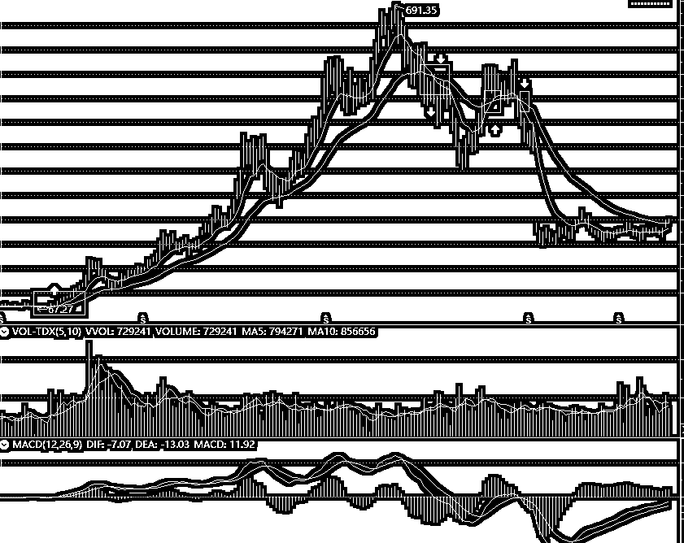
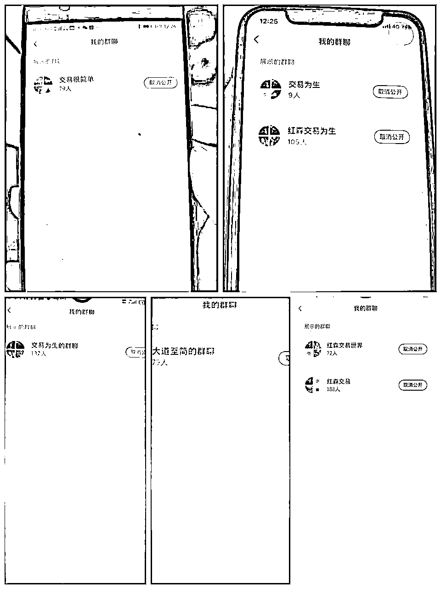

# 分享两套小白快速上手的交易系统以及通过小红书一个月引流600多人变现十万➕

> 来源：[https://vxkyo4kfu1l.feishu.cn/docx/MhYVdxFN3oRLZFx9meEcalKDnAc](https://vxkyo4kfu1l.feishu.cn/docx/MhYVdxFN3oRLZFx9meEcalKDnAc)

#### 大家好，我是红森，十多年前通过互联网赚到第一桶金，选择了天花板更高的金融行业。也开过私募。

曾经半个月时间把十万美金做到十四万美金，一天时间归零。在金融行业亏损七位数，学费六位数。现在已经稳定几年。交易领域是最容易也是最难的，容易在于任何人都可以参与，没有学历，背景的要求。难就难在天道酬勤在这里没用，因为市面上99%的知识都是错误的，所以大概率越走越远。如果还没有进入，建议还是要慎重。

有很多人看了很多理财，基金，股票期货的交易书籍，在网上看过很多文章，甚至跟我一样花了很多学费，参加各种交易课程，但是依然是市场的韭菜。

今天我会给大家分享适合小白的三套系统，不是让大家看了立马去用，也许通过我的分享，你会发现很简单的东西却非常好用。

## 第一套极简价值投资系统

### 1 聚焦优质的股票

既然是价值投资，我们就选择世界上最好的公司，A股有4000多只股票，很多股票根本没有什么交易量，很容易被套住。你也不可能全部去研究。所以我们聚焦在沪深300和中证500里面去选，这样相当于给自己的交易标的做了一个简单的过滤，上了一个保险。

### 2 选出永远处于上升趋势的票

就是在沪深300和中证500的800只票里面，选出从上市以来，一直处于上升趋势的票，不管做任何交易，你都需要跟随趋势。

很多人会说，真的有这样的股票吗，怎么选？

首先，将K线调成月线

然后，找出回调永远不跌破前低的股票。

可以用一个周末的时间，把800只股票里面，所有符合一直上升趋势的股票全部选出来。形成自己的股票池。

### 3 用一个高胜率的策略找买点，70%

真的有70%的策略吗，在符合上升趋势的原则下，只需要用EMA这个指标。

如何调出EMA指标

用通信达软件，每个券商都有这个版本，如果实在没有可以下个光大证券来看。

在股票界面：点右键-主图指标-选择主图指标-，EXPMA这个指数平均线，将参数调成9.30.

以交易为生这本书里面也很详细。

最简单的策略是月线EMA上穿附近，周线EMA上穿进入，举个案例看一下。

从2019年到现在周线上穿只有两次。附图

### 4 耐心等待交易信号

股票就是一个工具，没必要和他谈恋爱，谁有信号就操作谁。

这种交易信号，平均一年就1-2次，一定要耐心等待。

这套交易系统适合休闲投资，不用天天研究行情，板块，政策。

关注自己池子里面的标的，出现交易信号就介入。

用这套方法远远超过很多小白乱来。

## 第二套极简短线交易系统

小资金想要快速的积累，最好的模式肯定是短线，你十万，几十万的本金，一年20.30的收益其实意义不是特别大，更何况有时候还是亏损。

短线的模式有很多，但是大多数人操作不好。找到一套简单的，自己能执行的。

### 1 聚焦3-6个刚刚进入上升趋势的标的

在上面的模式里面选出的刚刚进入上升趋势的标的中，选出交易活跃，走势顺畅，自己比较看好的3-10个标的。

选出来以后就聚焦这3-10个标的，耐心等待短线交易信号的出现。

### 2 用30分钟或者60分钟EMA找买卖点

注意：这个模式，一只股票一个月就交易1-3次，而不是每天都去交易，一天交易几次。

### 3严格按照交易信号执行

交易的核心是概率，胜率，盈亏比，任何策略都无法做到每次都赢。

交易极简就是两句话：

1找到一个趋势向上，交易活跃的品种。

2 按照两条线严格的执行。

### 最后，给大家分享两个交易禁区。

不管你多厉害，在这两个交易禁区做交易大概率是赔钱。

1月线EMA下穿到月线MACD上穿这个区间。

2在上升趋势中，周线EMA下穿回调，到周线MACD上穿这个区间。

你可以去复盘一下，在这个交易禁区做交易，大概率会赔钱。

# 第二部分 如何通过小红书流量一个月变现十万＋

### 1 为什么做矩阵?

###### 之前一直在做个人IP，拍视频，做图文，但是财经领域很敏感动不动就被关小黑屋。

其实90%以上的人都是做不出IP的。

做自媒体是玄学，同样的内容不同的账号不同的数据。

所以至少三个号开始。

### 2 为什么做小红书

小红书的优势不用多说，抖音一百个粉丝里面，杠精多屌丝多，小红书一百个粉丝里面，感兴趣的很多。

而且小红书的人群消费实力也不用多说。

### 3 矩阵号一天只需一小时

其实很简单，对新手来讲，所有的平台都是抄。

###### 1选题，直接看同行最近数据好的选题。因为同行已经帮你验证了哪些选题可以做，哪些选题不违规。

###### 2 文案，同样可以在同行的基础上，参考同行的框架，结构，结合自己的内容写出来。

###### 3 制作，我用的稿定设计，因为现在有AI功能，所以对于我这样一个不会制图的人来说效率非常高。

你只需要放一张图片，还有文字进去，AI自动给你设计出你想要的排版和风格。一分钟出来无数张。

###### 4 引流，我目前是建群，然后小号在群里发微信，测试了很多，这种暂时比较安全。

一个多月时间，好几个群都有几十到一百多精准客户，给大家看一下部分社群。

###### 5变现 金融客户一直都是很值钱的，如果你能一个月引流几百个精准客户，变现六位数是大概率事件。

我们用电子书引流到微信，轮流使用三个钩子

1个钩子是每天免费直播教技术

2个钩子是每天免费给订单报告，这个在金十数据里面需要年费三万多才有。

3免费给粉丝看比较先进的交易系统。

通过这个些免费的福利，然后让他们进直播间感受我们的专业和实力，成交率很高。

文章比较简单，但是都是大道至简的一些核心，可能你在外面花几千学的一些课程，也是这些核心，只不过为了卖得贵一点内容肯定要多搞一点。

总之现在不建议只做一个号，不管哪个行业都可以尝试一下矩阵。

矩阵+参考同行+执行力+好的变现产品和模式=财富。