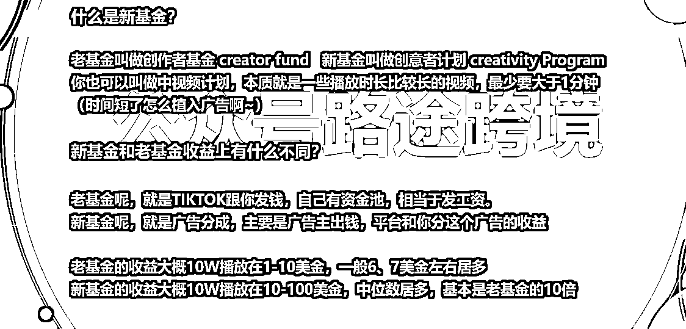
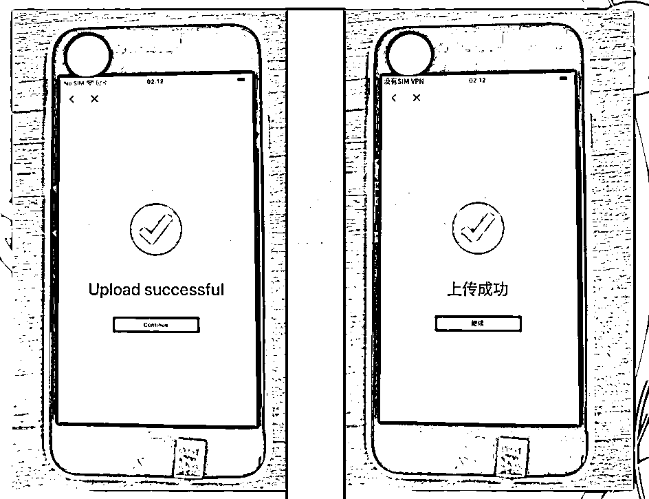
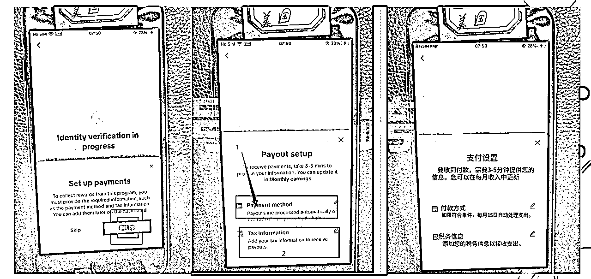
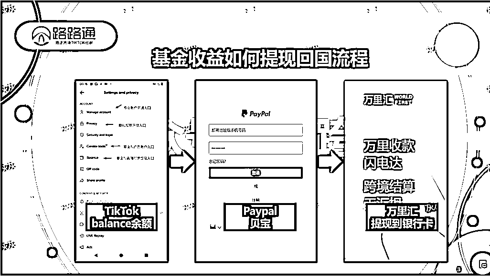

# （百问百答）tiktok中视频基金如何月入10万

> 来源：[https://l0fh547dko.feishu.cn/docx/OORMdTJ2Oomcu4x6syccoKxpncd](https://l0fh547dko.feishu.cn/docx/OORMdTJ2Oomcu4x6syccoKxpncd)

大家好，我是路途

最近一段时间，TK的中视频受到了很多人的关注。正是因为他可怕的变现能力，多可怕呢？

一条视频的收益高的时候就能做到几千到几万美金的收益。

比如下面这张图，我们社群团队做的，890万播放便有八千多美金，折合人民币6W+。

有时候大家晒出来的截图更是吓我一大跳，有个小伙伴甚至做到了单账号2W+美金。

往期我也给大家出过类似的测评文章，但是说实话，文章比较长看起来大家也挺累的。

那么今天呢，我给大家把中视频的玩法整理成百问百答的方式，大家只要检索到自己感兴趣的问题，就能快速得到你想要的答案！

大家后面有其他感兴趣的问题，也可以给我留言或者私信，我会大家关心的问题和答案也整理上来。

#### 问题1：什么是TK中视频基金？

简单的来说呢，TK中视频基金就是TIKTOK平台的激励计划。你在平台发布视频，平台给你播放激励。

这个项目英文叫做 TIKTOK Creativity Program Beta。翻译应该是叫做，创意者项目计划。因为他的激励模式，跟抖音的中视频计划很像，都是发布视频，然后根据你的视频播放量给你计算收益，所以大家也叫TK中视频基金，或TK中视频计划。

#### 问题2：TK中视频基金是怎么计算收益的？

前面说到，TK中视频过过播放量来算激励创作者提供更多有价值的视频。那具体如何计算呢？

目前测试下来，每1000播放，大概的平均收益在0.5美金-2美金左右。

也就是说，如果你发布的一个视频，有10W播放，按英文的写法就是100K，那么你就能有大概50美金-2000美金的一个收益。而我们知道TK上的流量是非常大的。

比如说下面这个，60万播放就有242*6=1452美刀，换算成RMB的话1452*7.3=10599.6，所以这个激励真的很夸张了。

#### 问题3：TK中视频和创作者基金有什么区别？

很多小伙伴可能还听过这个词：创作者基金？

那他和TK中视频有什么区别呢？其实在这个TK中视频计划最早出现呢应该是在22年的年中吧，最早在法国出现的，但早在2020年的7月份，TK就有激励计划了，那个时候叫做创作者基金，英文叫Creator Fund。他和中视频一样的都是属于播放激励。

所以根据时间前后，我们一般也叫老基金和新基金来区分。

那么他们之间有什么区别？主要是3个区别

##### 区别1：收益不同

虽然都是按播放量算钱，但新基金的收益方式比老基金的高了10倍不止。同样的10W播放，中视频目前最高是有两千多美金的奖励标准。

##### 区别2：作品形式不同

新基金对内容的要求更高，需要作品满足原创等标准，否则有可能回收权限。

##### 区别3：国家不同

目前官方公开表示的地区，中视频只有法国、美国、和巴西。

##### 区别4：提现时间不同

#### 问题4：我怎么样才能开通中视频基金？（全流程）

当你的粉丝数量达到一定程度以后，就可以开始准备开通权限获取收益了

上面跟大家提到过，中视频计划，其实跟原来的创作者基金的开通要求是一致的。

如果你已经达到了上面的申请标准，那么接下来只需要准备好下面这两个东西，那么你就可以开始了

下面给大家做了手把手的超详细开通流程，为了方便大家阅读，我把下面所有流程做了中英截图对照，大家如果手机是英语模式也能看懂了。一共十八个步骤。

第一步：在tiktok个人主页点击这个三横的图标，找到creator tools,点击进去

第二步：在里面找到这个单词 Creativty Program Beta 点击进去（这里再科普一下，中视频基金只是我们的一个叫法，也叫新基金，是老基金升级之后的一个收益玩法，之前的基金是叫创造者基金，也叫老基金）

第三步：进来这个页面满足三个条件就阔以直接点击红色的按钮下一步

第四步：到这一步，在这里选择你的证件所在区，选择自己的所在国家即可

第五步：接下来选择证件类型，第一个选护照，第二个选身份证，任选一个就行了

第六步：点击下一步，开始验证身份

第七步：上传自己的证件，记得要拍清晰点，特别是年龄的部分

第八步：上传成功以后我们点击Continue 需要填写更多详细资料

第九步：按要求填写资料

其中第二点，填写身份证的拼命，记得先写名再写姓，比如姓名：李保国 你英文写成 BAOGUO LI

第十步：检查资料无误后，SUBMIT 提交

第十一步：提交完以后，会显示under review， 就是正在审核。回到主页之后过个3分钟重新在个人页面点击Creativity program Beta，重新进入

第十二步：如果正常的话，会显示下面这个样子，表示已经开通了。如果失败则会显示失败。

这个页面3天以后，打开就会有收益数据了，以后每天看收益，也是在这个入口。

第十三步：但如果是美国或者巴西地区的中视频，则需要更麻烦一点，完成年龄验证以后，还要填写一个税表和绑定PayPal 贝宝账号。点击进去则是如下。第一行呢，是绑定收款方法是也即是贝宝

第二行呢，就是添加税务信息

如果第一个收款方式点不进去，那就先填税务信息，之后再来绑收款方式。

第十四步：提交税务资料，这里选择个人 Individual

第十五步：

需要填写以下身份信息和税务号码。这里比较敏感不能公开说会和谐。所以如果卡在这一步了，可以来问我发网址给你。

第十六步：

填写完资料以后，就会让你确认并且提交税表。（可以放心，跟咱们没啥关系，就是一个流程）

第十七步：提交完以后，就会让你跳转回TIKTOK，点击DONE

第十八步：返回原来的界面以后，点击设置收款信息，进去就会让你填写pp贝宝的账号和密码，填好确认就行

都完成以后，就会显示下面这个成功的界面。

#### 问题5：开通中视频计划以后如何提现？（全流程）

说完了开通，我们再说一下，如果你有收益之后如何提现呢？钱到自己兜里才算踏实嘛，哈哈。

首先呢，我们要明白这个收益，会打到我们前面说的绑定PAYPAL账户里面。美国和巴西是次月15号自动打款到你开通基金时候绑定的PP贝宝账号里面，法国目前还是月底手动提现，跟创作者老基金模式一样

我们要做的呢，就是怎么把提现到PP的钱再结汇提现到国内的账户里。目前我们测试下来，一共是3个方法。

方法一：通过万里汇结汇

贝宝提现到万里汇，万里汇再结汇到国内银行卡。去年之前，我们一直都在使用这个方式，很方便。但今年开始万里汇对非电商的款项严格了很多，因此会有一个结汇额度的限制。

所以如果你本身有一些电商的流水，直接选这个方式是最好的。当然如果你遇到额度问题，也可以解决。

这个方法目前最大的弊端是麻烦，解决的话要提供很多很多资料来证明资金来源，而非电商款又卡的严格。

如果你遇到额度问题无法提现的话，到时可以问一下我。

方法二：报白账户

这个方法最简单，因为我们的流水一直都很多，所以之前对接了一个专门的报白账户来处理。只需要从PP上打款到报白账户，之后就可以提现了。由于涉及到资金安全，不熟悉的我也无法确认资金来源，所以这个方式目前暂时没办法对外哈，只是用来给社群里的小伙伴帮个忙而已。如果方法一实在解决不了，你可以来问我。

方法三：万里汇信用卡

适用于提现金额小于5000RMB的用户。具体用法呢，可以咨询一下万里汇的客服哈。（这个方法，目前我还没有测试，所以就不便多说了）

#### 问题6：TIKTOK中视频有哪些风险？

前面说了这么多TIKTOK中视频的好处，其实TIKTOK中视频玩法还是有很多风险的。比如说账号很容易被回收权限。或者有些视频不达标就不给你收益等等。但还是那句话：风浪越大鱼越贵！

#### 问题7：TK中视频基金可以做哪些作品？

小伙伴们最经常问我的就是，TK中视频到底可以做什么样的作品呢？

从上面我们知道TK中视频，其实对内容是有要求的，不符合要求的作品形式，是会被回收账号资格的，或者是因为被判定为非原创作品导致没有收益。

这里给大家推荐几款作品形式

1.  数字人系列

作品类型：人物讲故事，或者人生哲理。实现方法：利用现状的AI玩法，先使用AI画图软件如Midjourney等，画出合适的人物形象，之后再用相关AI平台把图片变成一个可以说话的视频。

1.  解压系列

作品类型：滚瓶子实现方法：在一些瓶子，或者名贵酒瓶，在里面装上液体，或者水珠等，从楼梯上滚下，十分吸引观众，人的好奇心驱使你看到最后，无意间把完播率拉满。

1.  3D作品系列

作品类型：音乐节奏的3D小球实现方法：利用3D软件如C4D等，逼真的动画效果如小球掉落并带有敲击的音乐节奏。跟上面讲的推瓶子很类似，非常抓人眼球。甚至会有人以为是真实作品。

1.  搞笑系列混剪

作品类型：混剪类作品实现方法：一定看到过不少这类作品把，其实也是能够过审核的。对不同的素材进行一个混剪拼接，只要原素材不错也没问题。

#### 问题8：我想玩TK中视频基金应该怎么入局？

如果你现在想入局做TIKTOK中视频。那么我觉得现在是一个非常好的时机！

为什么呢？目前的单价足够高、而且流量给的也很宽松。如果你现在准备入局了，请你学会以下技能。

第一、学会设置网络环境下载注册TK

第二、学会使用最简单的剪映进行剪辑

第三、学会发布视频。

一周之内完全可以搞明白以上技能，最简单的下载注册，之前录过的视频教程可以看一下。

https://pzhkj.xet.tech/s/2jXDwg

不要迟疑，看到这篇文章就赶紧去干起来，机会是留给勇于尝试的人！

#### 问题9：新手需要准备哪些东西以及大概的成本？

*   1、准备手机3台或更多

（手机最好是iphone7及以上的型号，理论上越高越好，根据自己情况来准备，最好准备3台，如果有困难的可以一台起，安卓手机可以使用谷歌）

*   2、准备网络

做哪个国家的买哪个国家的就行了。这个地方敏感就不多说，会和谐。

*   3、准备手机卡

玩基金不是必须要插卡，但是插卡确实可以很大程度帮我们解决一些异常风控的问题。有备无患。特别如果在做英国的小伙伴就能发现，有时候注册完是没有小黄车或者老基金入口的，这就是V飘了或者没有手机卡做定位导致的。需要卡的，可以提前购买，做哪个国家，选哪个国家的废卡。

如果实在是买不到，可以开飞行模式，也可以的。

#### 问题10：新人会遇到哪些问题以及如何解决

新手刚开始操作的时候，可能会遇到以下问题

注册频繁、无法点赞、无法关注、无法修改资料、0播、低播、等等

1.  如果是注册频繁之类的，无法注册，一般是设备或者网络的问题。

解决方法：可以尝试更换注册方式、接码注册或者谷歌邮箱第三方登录注册即可。也可以尝试还原设备、都无法解决的情况，就直接更换节点哈。

1.  如果是账号注册成功后，无法点赞、关注、修改资料的，或者是发布视频0播。这类情况是近期TIKTOK对新账号的一个管控。一般来说3天以后都能恢复正常。注册以后，可以多刷一刷视频，保持账号活跃。

#### 问题11：中视频起号需要养号吗？

一个账号要不要养号，其实一直以来都是大家争论的点。我从始至终，都是让大家最好养号的。为什么呢？

我们先来倒推，假设说，TK有机制就是对行为异常的账号，加上营销号的标签，然后不给你流量。如果说你养一养就能排除掉这个风险，为什么不养呢？这叫宁可信其有，不可信其无。

所以前段时间TK验证了这个点，就是新号刚注册3天内，大概率都不给播放，这既是对新号的一个管控。本质上是为什么呢，是通过识别你的网络，和你的设备码等等实现的，如果他判断你的账号有概率是营销号就会给你加上一个标签。

那怎么养号呢？账号注册完以后，先不用着急去该资料换头像，你就正常的刷一刷视频就行了，有个半小时都够了，这个时间我们也不白费，你也顺便刷一下你的同行，看一下他们的作品怎么样学习一下。之后呢过几个小时，或者第二天再去修改资料并且发布作品。

我们每天注册很多账号，就跟我们的弹药一样，都是循环着走的。

#### 问题12：播放不好一般是什么问题？

这个问题大家问了很多次了，这个思维导图是无数的实践总结下来的。我觉得大家有问题的时候可以直接对号入座。其实分水岭就是，是否0播。而有播放的情况，大概率就跟环境没关系了，作品的问题比较多。

#### 问题13：一台手机可以做多个账号吗？

很多小伙伴因为手机少，老想着一台手机做很多个账号。

新手千万不要这么做，一律一机一号操作。为什么呢？最主要的原因是如果发生问题，比如说都没有播放了，你将无法排除是否是你这个行为导致的限流。

我这边建议呢，就是最好3台起步。一机一号，这样可以做对照试验，如果出现问题就可以马上判断出是哪里出了问题。而且不同的手机做不同类的作品，也更容易快速起号。

#### 大家有其他问题的话可以给我留言我会在这个后面继续补充

#### 也欢迎各位大佬链接v:tok385