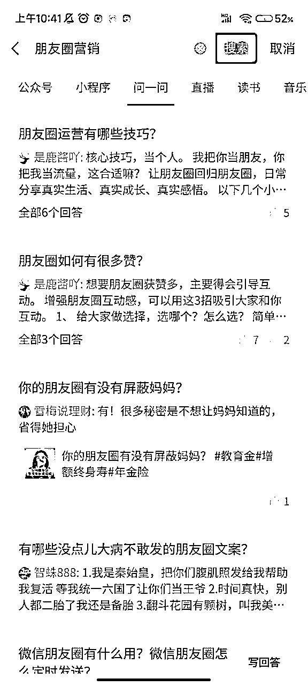

# 靠『问一问』精准引流200+，变现3999的爆款问答实操方法复盘

> 来源：[https://bokm2adr1g.feishu.cn/docx/OOXVdu2DKo3mUFxQz2vcT9Tcnde](https://bokm2adr1g.feishu.cn/docx/OOXVdu2DKo3mUFxQz2vcT9Tcnde)

大家好，见帖欢喜，我是生财有术圈友小鹿。

大家都知道，最近”问一问“风头正盛，很多小伙伴都在探索，怎样才能利用”问一问“高效引流出爆款？

我在着手入局”问一问“的第三天，就成功答出小爆款，3小时内点赞600+，视频号涨粉200+，精准引流到微信，成功变现3999。

所以，今天就来给大家分享一下，我的”问一问“精准引流，及答出爆款问答的实操方法。

全文共计5247字，预计阅读8分钟，一起来看！

一、问一问，如何快速开通？

二、问一问，问题筛选标准

1、热点问题

2、专业问题

3、“四象限”问题筛选法

三、问一问，爆款答案攻略

1、爆款答案类型

2、爆款答案写作技巧

四、问一问，必看注意事项

五、问一问，如何高效引流

# 一、问一问，如何快速开通？

正式分享前，先说一下什么是问一问，最简单粗暴的理解是”微信版知乎“，能提问、能回答、能关注、能引流。

详细版，参考微信官方给的解释：

其次，咱再来看看，”问一问“如何快速开通。

这一步，可能大部分小伙伴已经解决了，所以咱长话短说。

简单概括，路径就是：直接搜任意问题或关键词，点开【问一问】，点进问题后，点击【写回答】。

随后直接退出，发现页点开【搜一搜】，就会看到【问一问】专栏，就算正式开通啦。

目前，问一问可支持视频号身份、公众号身份提问、写回答与评论，回答与评论将以对应身份为发布人进行展示。

身份的选择上，主要看你后端引流方法是什么。没有公众号就用视频号，按官方指引操作即可直接注册。有公众号能够做承接，就用公众号身份。

个人经验，视频号对新手小白友好，发几个对应的短视频就可以直接用。

解决基础问题后，接下来咱们进入正文部分。

# 二、问一问，问题筛选标准？

《高效能人士七个习惯》里，讲过这样一个概念叫“以终为始”。简单说，就是奔着最终目标去做事。我们布局“问一问”，其实就一个目的，引流。

引流又可以分两大类，一类是泛粉，用于冲数据；一类是精准粉，用于成交。所以，按照这个标准，我将问题分为两大类型：

一类是热点类，用于引流泛粉；一类是专业类，用于引流精准粉。

我们在回答问题时，就可以按照这两个标准去挑选对应的问题。接下来一起来看，具体该如何挑选：

## 1、热点问题

热点问题指的是热度高，流量大的问题。

直接点开【搜一搜】，主页弹出的问题，就是现阶段流量较大的问题。

需要注意的是，这里的热点问题筛选标准，也不能是看见问题就上，也要有一定筛选。毕竟咱核心目的是为了引流变现！

热点问题刚好对口专业，那相当完美，简直是老天爷赏饭吃。如果不对口，那很遗憾，但也不影响，我们可以通过定位目标用户画像，分析其他需求来选。

这里，我以自己找问题的标准为例：我的产品是【朋友圈运营】，我的目标用户有两大类：

一类是有自己的产品，需要通过朋友圈提升转化率，搭建“私域自动成交”体系。一类是没有自己的产品，需要通过朋友圈分销，或想要尝试通过朋友圈，打造个人IP，而后做自己的产品。

再具体到用户画像是，年龄集中在20~28岁之间，女性为主，积极上进，愿意通过知识付费投资自己的人群。

那这个目标群体的用户，除了关注私域运营、朋友圈运营外，肯定还关注情感类问题，外出旅游类问题、看书学习副业类问题。

所以，我在问一问的热点问题中，挑选的也是受众在20~28岁之间，女性为主，积极上进的人群，所关心的问题。

比如这张图中，推送的这波问题，我肯定会优先选择画框的来回答。

那么问题来了，如果我时间有限，只能回答一两个问题，从以终为始的角度思考，我选的就是红色、蓝色。

红色问题的用户，相对而言认知更到位，付费意愿有，用户更精准。蓝色问题的用户，大多付费能力够。当然，如果时间允许，四个都回答当然更好。

就像是买彩票，买的越多，中奖率越高。咱回答热点问题是，回答的越多，爆款率越高。

总而言之，热点问题的选择标准是，优先选择对应受众与自身用户画像重合度高的问题。

## 2、专业问题

比起自带热度的热点类问题，专业问题主要作用，就是精准引流。通常情况，领域越细分，覆盖人群越少，热度自然也就越低，但引流人群会越精准。

这种问题大多来自主动搜素，关键词直接搜。

比如我是【朋友圈营销】，关键词覆盖范围由小到大可以是：朋友圈、私域、营销、自媒体、IP等。

回答专业问题时，我的选择是从精准范围由小扩大，毕竟专业问题的核心目的就是精准引流。它10个有效曝光带成交，胜过热点类10w无效曝光引泛粉。

所以，回答专业类问题，问题越精准越好。需要注意的是，大家在搜索专业问题时，也要记得选择关键词下，关注量、回答量高的问题来答。

点进问题，就能看到具体的关注量与回答人数。

关注量越大，热度越高，你回答后，系统也会将答案推给关注这个问题的人，相当于自带一波启动流量。

如果没人回答过，那恭喜你，也能抢占先机。但这种问题会有风险，即几乎0热度，无效回答，看到的人可能也极少。

搞清2大基本类别，热点问题与专业问题的基本概念与选择技巧后，咱再来看综合版。

## 3、“四象限”问题筛选法

如果以热度为横坐标，以专业度为纵坐标的话，所有的问题都可以被归到这四象限里：

大家再看到问题，纠结要不要答时，可以参考这个标准，对号入座去思考。

看到这儿，相信大家已经get到“问一问”问题挑选的精髓了。

如果要用一句话概括，那就是“用户导向，以终为始”。时刻谨记，你的核心目的是什么。

为了精准引流，那就结合目标群体，选择受众重合度高、热度高的问题。为了出爆款涨粉，那就选热点问题，广撒网，总有捞上来的大鱼。

我的建议是，热点问题与专业问题，以1:1的配比来回答，热点涨粉冲热度，专业精准立人设。

重要的事情值得再强调一遍！热点问题的回答，不能跑偏的太离谱，挑选问题受众与自身用户画像重合度高的问题。

比如你做宝妈领域，却去回答大学生受众的问题，那肯定不行。因为就算引流过来，也是无效泛粉，总不能养成系，等她们结婚生子再成交吧。

好啦，看完问题筛选标准，接下来来看爆款答案攻略。

# 三、问一问，爆款答案攻略？

开始前先透个底，实不相瞒，我的回答，准确说应该算个小爆款。不敢班门弄斧，更不敢以此为依据，就给大家直接分析，如何写出爆款回答。

所以，我专门翻了大概100多个热门问答中点赞量高的答案。然后总结了爆款答案攻略，一起来看。

讲方法论之前，先讲底层逻辑，在分析了近乎100条爆款回答后，我发现爆款回答都有一个特点，转发率高！

换句话说，其实很少有人专门去搜一搜，看到你的答案。80%的用户，几乎都是被朋友分享，而后看到，进而触发点赞、关注等一系列后续动作。

所以，咱们研究爆款的核心，就需要从如何写得诱人，转换为如何写得让人看完就想转发给亲朋好友，写出”高转发率“？

## 1、爆款答案类型

我总结了现阶段，“问一问”高赞回答的类型，大概可以分为以下三类：

### 1）抖机灵

抖机灵，可以理解为讲段子，就图一乐呵，只要够好玩就行。

比如这个问题：生活中有哪些事，一定要自己亲力亲为？

大家可以看看高赞回答，就是抖机灵，简单粗暴，直接11个字，上厕所。

非得说这有啥技术含量，那大概是，语言够简洁，段子够机灵。

为什么这种”抖机灵“的回答，容易被转发呢？答案很简单，因为够轻松，够搞笑。

目前，各大自媒体平台，如抖音、微博等，其实主打的就是休闲娱乐，核心就是提供情绪价值，让人会心一乐。

在枯燥乏味的生活中，看到这种轻松的回答，觉得很好玩，或很搞笑，就很容易将其分享给朋友，一起乐一乐。

### 2）引共鸣

引共鸣的意思是，要能有情绪上的共情，让大家觉得，说得对！说的有道理！简直就是我的互联网嘴替！

比如这个问题：如何看待多地520结婚登记人数比去年少？

两个过千赞的答案，都属于当代互联网嘴替型。

5000+点赞的是，我朋友圈有好几个领证的。就一句简单的描述，没任何技术含量。

因为虽然结婚的人少，但身边大多数人还是会领证，所以这条基本能引发大部分人的共鸣。

1000+点赞的是，很明显，人都变聪明了。

其实也可以归为抖机灵式的调侃，但重点在表达不婚的人的观点，而不是为了搞笑，所以我将其放在“引共鸣”类型里。

### 3）有干货

有干货很好理解，一句话概括就是，让人看完觉得“明白了，学到了，有收获”。

人都是喜欢这种“有获得”的满足感，哪怕是虚假满足，并记不住也不碍事。

比如这个问题：遭遇职场霸凌，如何保护自己？

这个问题共13个回答，目前高赞是一条类似于科普的内容，详细为大家解答遇到这种情况该如何应对，有理有据，很有说服力。

这种回答，也不是纯干货就行，还得写得够落地，深入浅出，普通人也能看懂。

具体写法，咱接着往下看。

## 2、爆款答案写作技巧

分析完爆款答案类型后，咱们再来看看爆款答案写作技巧。

### 1）语句简短，多用短句

“问一问”官方限制字数是500字，但80%的高赞回答，基本都是100字以内。哪怕字数较多，也能做到分段明确，语句简短。

这是因为快节奏时代，大家习惯看视频，看到大片文字第一反应是“太长不想看”。

所以咱在写回答时，一定要尽可能减轻读者阅读压力，这点适用于所有需要文字表达的场景。

核心技巧就是，语句简短，多用短句。

短句指的是，标点符号间隔的字数，最长不超过30，以自己能一口气读完不费劲为准。段落上，最好不超过2行。可以的话，最好能适当加点小表情做分隔。

比如我小爆的这条：就是分段清晰，描述简单粗暴，看着不费力，也很好理解。

### 2）语言风趣，多讲段子

在爆款答案类型中，我们提到高赞最多的是“抖机灵”式的回答，这种回答的核心是要够好玩。

但有的人天生不会讲段子，幽默不起来，怎么办？

借用俗语，实在想不到，咱就动手去搜，直接搜关键词就行。

比如我这个问答：

第一句“人不行怪路不平，活不行怪炕不平“，其实我只知道第一句，因为经常听身边朋友说。后一句是我搜了前一句，查出来的，就直接用上。

估计后一句流传度不够广，是因为不太正经吧，但放在这种“抖机灵”式的回答中，刚好合适，拿下50个赞。

### 3）内容详实，有趣有料

这点是针对“干货”类问答的写作技巧。通过刚才的案例分析，大家应该能发现，爆款问答的干货类高赞，一定是言之有物。

但很多人容易踩的雷点是，讲的太专业，专业到普通人看完一头雾水，根本看不懂。

所以，回答干货内容时，要在注意“内容详实”的前提下，做到有趣有料，语言通俗易懂。

比如这条回答：

既给出了具体的做法，还能兼顾用户情绪，以第一视角讲述，就很有代入感。

语言上通俗易懂，很好理解，与下一个答案相比，更详实，可读性更高，当然能拿下更多赞。

总而言之，想要写出爆款问答，有趣、有料至少占上一点，否则，大家为什么要给咱点赞呢？

# 四、问一问，必看注意事项

讲完具体技巧后，还有一些注意事项，需要给大家分享一下。

否则很容易出现，审核不通过，回答再多都是无用功，或是操作不慎，直接导致被封号、被判违规的情况。

## 1、名称不能带行业

大多数朋友进军“问一问”，都是为了引流，所以会习惯性以【昵称+行业】的形式命名，试图达到引流效果。

但这种行为，在“问一问”是不被允许的，昵称但凡带任何行业相关，有引流倾向的内容，都会被判定为有营销嫌疑，所有的回答都不会通过。

针对这个问题，目前咱能用到的解决方法是，前期直接以自己的IP名，或私人昵称命名，先跑出爆款，后期再改名即可。

视频号每年有4次改名机会，所以完全可以等量起来后，再加上自己的行业或产品。

## 2、内容不能直引流

与第一条注意事项类似，咱们回答的内容里，最好也不要带引流向的内容，如行业、产品、微信号等。

一旦含有这些元素，答案审核不通过的概率，高达99%。

前期一定要稳住，作为最近刚上线的新功能，前期属于审核严查期，咱就不要风口上搞事情。

厚积薄发，目前就先苟着，多回答，多为平台提供有价值的内容，提供热度。后期做大做强，成为小v，有一定话语权后，就可以“为所欲为”。

## 3、频率千万别太高

在前面的分享中，咱们提到过，回答问题要越多越好，但也不能太多，或频率太高。

这里频率高的标准是，5分钟内咔咔回答好几条，这一看就是刷量，审核时间就容易卡很长，且通过率极低，频率过高还会增加违规风险。

最好能保持，回答一个问题，过会儿再继续下一个。

如果遇到长时间审核不通过的内容，可直接删除，重新回答，提问类似。

# 五、问一问，如何高效引流？

在注意事项中，我们反复强调“不能引流”，难道前期，“问一问”就只能贡献价值，不能引流吗？并不是，“问一问”卡得严格，但视频号、公众号没有。

我们可以在视频号或者公众号简介上“动手脚”，照样能达到引流的效果。

这是因为，“问一问”是与视频号、公众号高度绑定，如果有人点赞你的回答，那你的“视频号”就会自动弹出，用户可以一键关注。

这就给了我们很大的发挥空间，具体怎么做，咱详细来看。

## 1、简介明了，钩子诱人

所谓引流，其核心就是一句话“加我送资料”，或送超值的东西。但咱简介肯定不能只放一句话，上来就是加我送XXX，多少得给一些增加信任的背书，也就是我们的简介。

这里要求，简介清晰明了，钩子诱人。因为字数太多，很多人直接太长不看，所以简介最好直接三步走即可：

你是谁？

有什么成绩？

加你有什么好处？

顺带留下具体的联系方式。

比如我的视频号简介是：

你是谁？——“5力吸金文案模型”创始人

有什么成绩？——“私域自动成交系统”打造

加你有什么好处？——领价值999的《朋友圈流量变现手册》6万字

顺带留下具体的联系方式——VX：xxxxx

这里需要注意的是，简介一定不能是纯文字，最好加上emjio表情，更显眼，做好分行、分段。

在钩子的设置上，一定要和你的产品强相关。比如我的产品是“朋友圈营销”文案课，那我的钩子就是《朋友圈流量变现手册》。

什么饵钓什么鱼，诱饵放的不对，钓上来的鱼肯定就会出问题。

可以的话，最好标上钩子的价值，也可以包含几个数字，这样能够更有吸引力。

## 2、多号联动，打通私域

细心的朋友应该发现了，我的视频号底下，还有对应的公众号，蓝色字体，直接点击就能一键直达。

这就是“问一问”引流最快乐的地方，直接多号联动，打通整个私域。

主要包含：视频号、公众号、微信号，私域运营一条龙全覆盖。

视频号通过”问一问“负责引流，公众号承接粉丝，沉淀到私域，微信号负责通过朋友圈运营，或私教话术，搞定成交问题。对做私域的自媒体人来说，简直不要太友好。

这里的小技巧就是，一定要将视频号与公众号绑定，且公众号被关注后的自动回复，最好设置成带微信号的，二次引流。

这是我的公众号后台设置，菜单栏与自动回复，都可以引导加微信，引流到私域。

具体菜单如何搭建，公众号如何运营，这就是另外的话题啦。

不过大家可以尝试一鱼多吃，同样的内容，一键分发到公众号、视频号、朋友圈中。

## 3、高赞回答，评论引流

除了通过自己的视频号简介引流外，也可以通过去高赞回答的评论区引流。

这里的高赞回答指的是，受众与你产品目标用户重合度高的问题下，点赞量高的回答。相当于蹭流量、蹭热度，高赞回答被看到的机会多，你的评论被看到的机会也会随之增多，进而增加曝光量。

这个做法虽然能直接截流，但着实有点狗，不太厚道。也可能会遇到被答主投诉的情况，所以还是有一定风险的， 个人不太建议用。

以上，就是我的【问一问】爆款问答实操方法复盘，希望能在【问一问】布局路上，助大家一臂之力。

文毕，感谢 @梁靠谱@理白 两位老师带我加入生财，感谢@芷蓝 老师的战略指导，感谢@小沫老师 的优质课程指导。

祝我们都能厚积薄发、生财有术。

小鹿

2023.7.31