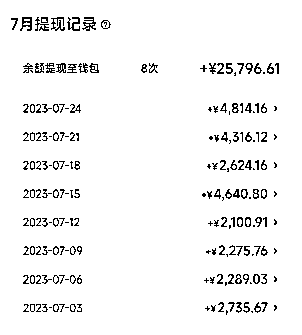
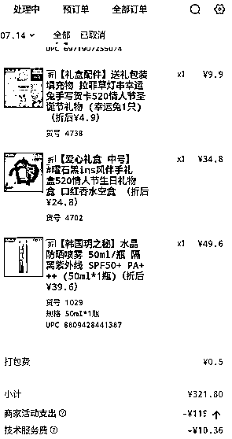

# 新开一家美团店做到1 个月 6 万月销，2 万纯利，新手如何玩转美团美妆外卖项目！

> 来源：[https://vy3iffqs82.feishu.cn/docx/OTsidt7omoxHYtx4r18cZ0XenJb](https://vy3iffqs82.feishu.cn/docx/OTsidt7omoxHYtx4r18cZ0XenJb)

# 前言

今天和大家分享一个目前关注热度不高的一个搞钱冷门项目-美团美妆外卖玩法！

这是我们团队最新在操作的一个新项目，目前圈内也没有人分享，应该算是首发！目前我们品牌新店是做到了开店 1 月，6 万的销售额，3 万毛利，2 万纯利的样子。正反馈比较快，基本3天内必出单！

# 一、项目介绍

什么是美团美妆外卖？简单点说就是在美团上面开店，售卖美妆全品类的商品。大家想到美团，可能首先想到的就是美团餐饮。

但是美团上面可不止有餐饮，像成人用品，家政服务，棋牌室，自习室都有人在美团上面布局默默掘金。

美妆这个类目也算是个小风口吧，正式火起来应该是 22 年年底，我们是今年 2 月入局进行操作的。所以说目前机会还是比较大的，做的好的店也有做到 10 万纯利的高光时刻。

# 二、说下什么人适合做这个项目？

## 1.自由职业者

有一份居家副业收入，需要一个新的副业提高收入

## 2.社恐人士

比较抗拒和别人打交道（做美团是基本不需要进行社交的）

## 3.细节控

对数据变动比较敏感，对单品排名关注度高

说下我们团队是怎么进行运营操作的。

# 三、一些小细节

首批 500 多个 SKU，店铺后台全部上架，起送设置 0 元起送，这时候的单子有时候会有卡着 9.9 的金额来。

我们不要盯着眼前的收益，前面的订单不赚钱也要做好配送，条件允许的话上门索要真实好评，在我们有了 5 个基础评价后，开店铺评分，店铺评分越高，权重越高，新店一定不要有差评，一个差评，20个好评也救不回来。

新店刚开美团扶持力度是比较大的，我们要在这个新手期内做到递增销量，类似淘宝的补单操作。

外卖平台起店周期是 28 天，在 28 天内平台将会给新店铺一定的流量倾斜，在 28 天内必须将所有货品逐一上架，做好营销活动，抓住流量才能迅速起店。

如果超过 28 天平台就会视店铺无法正常营业，店铺也就将失去流量，面临倒闭。

# 四、说下产品需求点

到这个阶段就会开始陆续出单了，我们首批的品就开始慢慢出货，一些畅销品也开始涌现出来，

## 1.季节性需求

比如这段时间比较热，补水喷雾卖的比较好，这个订单就是客户一次性下了 10 单。利润也是比较可观的。

补水喷雾其实是个季节性需求，天气热，补水喷雾卖的就比较好。

## 2.差旅用户需求

他们需求的是一次性用品，比如压缩浴巾，一次性内裤（旅游需求），口红香水小样（出门化妆需求）像下图这单，就是一次性下单了 20 个压缩浴巾。

## 3.节日送礼需求

这也是我们来自酒店的订单之一。另外一个需求点是生日礼品，送礼需求。管中窥豹，半小时送到的闪购懒人经济就是我们的卖点，我们也就是针对这个痛点进行营销。

# 五、聊一聊店铺的选址

做美团，商圈位置决定了你的店铺营收上限，如果你开在深圳南山区，你是有机会挑战月入 10W 纯利的。

价格不贵的城中村和公寓是最佳的选择，你既能居住又能开店；店铺位置选择你周边 10 公里范围内能覆盖到最多的商圈、办公楼、住宅、商业街、网红景点、学校，能覆盖的越多越好。

# 六、投入成本：

美妆外卖大体投入也就房租成本和首批拿货成本（货品成本 3W 左右）

店中店的模式可以增加一个收入渠道。我们这边有个做校服店的老板就是就是奔着多一个收入渠道来的，一楼卖自己的校服，二楼放美妆类产品，做线上美妆店！下图是我们校服店老板的三个货架图。五十岁的老大哥第二天就开始出单了！目前单量持续在上升！

# 七、项目优劣势分析

## 1.优势

正反馈快，美团3天能提现，资金压力稍微较小

## 2.劣势

首次投入比网赚项目要大，要囤货，偏实体运营，天气恶劣的情况下，配送的骑手偏少

# 八、总结

总的来说，美团美妆是一个偏蓝海红利期的项目，适合个人开店，入行门槛低，利润足够高，售后较少，可批量复制，跑通一家店铺后，第二家，第三家做起来就比较得心应手！

欢迎感兴趣的伙伴们一起交流！