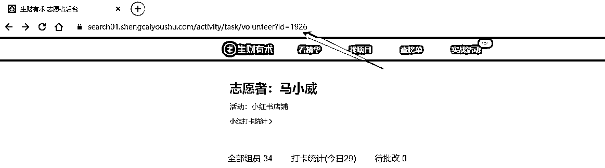
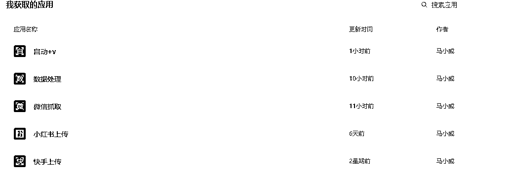
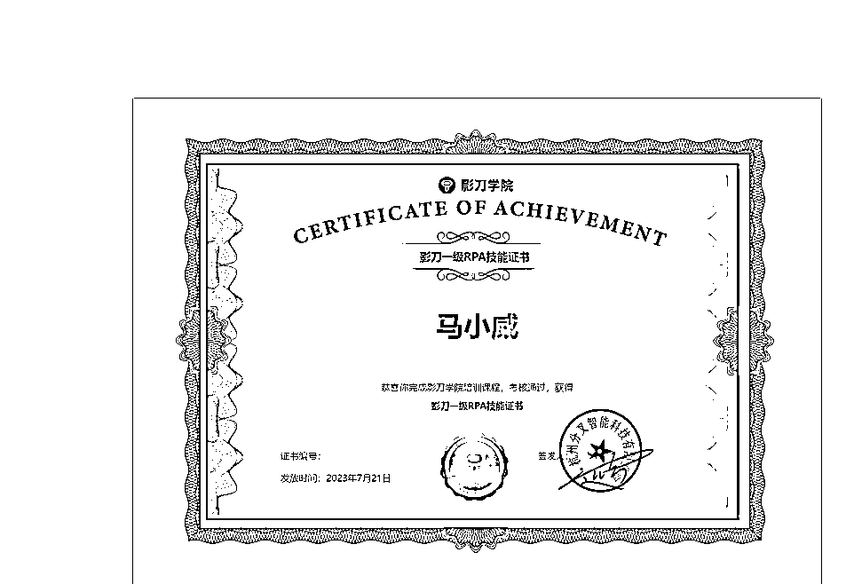

# 经历过上次的续航，开发了一个自动加微信的RPA

> 来源：[https://p8y34fwle2.feishu.cn/docx/Q2ABdt5taoDeI3xnmg4ci4csnef](https://p8y34fwle2.feishu.cn/docx/Q2ABdt5taoDeI3xnmg4ci4csnef)

先上结论：自动化加V,模仿人工操作不会封号，稳妥起见，建议每次加5-10位好友，至少隔半小时后再操作

作为一名资深志愿者，每次在航海活动时都需要添加很多圈友的微信

手动添加好友觉得有点麻烦，有时候还会出现不知道哪一个已经发送好友申请，

我在想，如果有这么一项服务能解决我这个痛点的话，我一定会毫不犹豫选择。

简单重复的事情交给机器，这样我就能把更多的精力放在更重要的事上，

而这样也能提升我服务的船员们的航海体验了！

# 一，运行前准备工作

1.需要安装影刀

https://www.winrobot360.com/share/activity?inviteUserUuid=118838783572787201

2.下载这个表格

3.获取这个自动+V的影刀应用

https://api.winrobot360.com/redirect/robot/share?inviteKey=6a5435f00951c66a

密码：scys

4.先打开：自动+V.xlsx，这个表格

编辑表格中的关键信息

Sheet1为加微信息

# 二，正式运行开始

1.打开微信和自动+V.xlsx 的表格

2.在「已获取应用」中，找到「自动+v」机器人，点击「运行应用」

3.选择下载的“自动+v表格”

4.等待即可，不要动鼠标和键盘

为了避免大家没及时停下来，导致意外发生。我已经设置好了，机器加完第10个人，就会自动停止。

各位隔一段时间后，再重新运行就可以。

# 三，搭配数据志愿者后台微信抓取效果更佳

1.获取影刀应用

https://api.winrobot360.com/redirect/robot/share?inviteKey=bbf52b823e344c69

密码scys123

2.浏览器安装插件

方式一：用户头像-工具-自动化插件

方式二：新建或者打开一个应用》右上角三个点》自动化插件 》点击安装

3.在「已获取应用」中，找到「志愿者数据抓取」机器人，点击「运行应用」

4.在谷歌浏览器打开这个网址（志愿者后台）

6.等待完成表格出现在你选择的文件夹中

# RPA能做的远远不止自动加微信好友

凡是你日常工作、项目中的相关操作符合以下条件：

1.重复的

2.有逻辑性的

都可以使用RPA，譬如，微商的朋友批量给客户发营销信息、快手自动发视频、视频号自动发视频、小红书店铺的船员需要批量定时发布笔记、媒体人需要批量发布文章等等等等...

甚至还可以利用RPA来抓取对标账号的数据、以及各大网站的图片和视频等等，RPA真的能让我们的工作更轻松，这也是我为啥专注做RPA的理由之一。

我是马小威，一位目前专注在RPA提升工作效率的资深志愿者。

如果你也想要提升工作效率欢迎你和我一起交流~V:mxw4260

