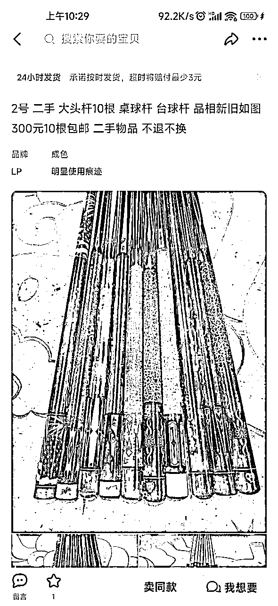

# 如何通过爱好快乐地赚钱

> 来源：[https://majl4i7pcp.feishu.cn/docx/QDeWdePdjoFpcGxp2cNcATRxnmd](https://majl4i7pcp.feishu.cn/docx/QDeWdePdjoFpcGxp2cNcATRxnmd)

做一件喜欢的事情，并且能从中挣钱，真的会感觉快乐

文章分两部分，一表明原因，二之后是上手实操（时间紧迫着可以跳过一）

## 一、起因

相信很多朋友都喜欢打台球，俺也一样，但菜的抠脚。偶然机会认识了一些打球不错的朋友，决定也好好练练球，既然要练，就要多去了解和分析。

### 台球厅和台费：

大部分台球厅和台费都不会差太多，我附近的一般20元一小时左右，那时候天天打好几个小时，每天打台球花100多，着实感觉有点奢侈，于是在各个小巷穿梭，找到了一家一般的球房，一小时在10元左右（现在已经办了月卡，算下来6元一天，随便打，哈哈），但是球杆太差，于是有了打算买球杆的念头

### 台球杆：

开始只想选一个比公杆好用的就行，于是打开了闲鱼，谁知道这一下打开了一个新的大门，发现了很多人在卖二手球杆，而且销量都不错，看到这，第一反应就是俺也想卖！

想要赚钱就要了解产品，了解需求，想要对一个产品有所了解，最快的方法就是去卖这个产品！

## 二、球杆市场的调查及球杆知识的学习

球杆知识：主流分大头杆和小头杆，尤其是当下火的品牌如：皮尔力，野豹…卖的很好，但是价格虚高，球杆好坏要看木料的年限，如小头杆，基本都是白蜡木的，所以那些老杆子，有些发黄的，是真的好用，这是自用的情况，想要靠这个挣钱，还要依靠品牌的背书。

### 抖音搜索：

抖音是人数最多的平台，先看看大家在做什么，观察一圈发现，很多人在做二手球杆，都是专业的，很少有个人在抖音单独出售自己的球杆，对比价格，抖音的价格要比闲鱼的价格贵一些，评论依旧有很多人在问价格和联系方式。

### 闲鱼搜索：

卖球杆的超级多，一般分为三类

#### （1）专业的卖家

出售很多球杆，成色好（可能有维修）价格中等，比抖音价格低一些，店铺链接多，详情中不知道和谁学的关联一堆品牌，会写可以置换。

#### （2）个人卖家

价格低，成色不一，基本无修，店内东西很杂或很少，文案比较简单，能读出实在的感觉。

#### （3）无货源卖家：

高仿，假货，便宜货，这个供货商我也有，但是没有选择，既然想做自己喜欢的事情，那肯定要先认真对待吧，这种很多都是贴牌

那二手球杆回收挣钱，看来很简单，就是低价收个人的，然后再卖！

如（2）中的球杆400元收回，用球杆清洁粉处理一下，卖个600还是没问题的，小200利润是可以到手的。

## 三、如何找到便宜的球杆

### 闲鱼内不断搜索

目的是让推荐把你的闲鱼首页猜你喜欢那都变成球杆，看到一款球杆觉得价格还不错的时候，开始的时候要多方对比：

（1）抖音对比价格看下最低价和最高价以及成色如何

（2）闲鱼回收贴那里咨询几家，看看价格如何，确认好心里回收价格

（3）闲鱼看下该款球杆卖价及成色，来确定这个杆子是否有利润

### 留意关键词并搜索

当你首页有很多球杆推荐的时候，你会发现有很多个人卖家，根本不知道自己的杆怎么卖，值多少钱。这些杆子才有更多利润

这些人的普遍特征：

（1）主图极差，很难看出是什么杆子，有的甚至大头小头都看不出来

（2）几乎不写品牌，只写 球杆，桌球杆，老杆子…

还有一些人会卖一套球杆，冲杆，跳杆，打杆（三个词排列组合的方式去搜）一套卖…这些都是关键词

还有的会置换，相同价格置换，我就用一个杆换过3个，利润在700左右

举例：下面1图菩提（原价2K）和艾拉克陨石冲（原价1.4k）一起卖1000，讲讲价900差不多，因为一直在降价没有售出（你也可以收藏等再降价），那我们单独搜一下每个杆的二手售价，菩提700-1500左右都有，陨石冲600-1000左右都有，买回分开卖，利润最低在200以上，（运费的事情后面说，还有意外收获、

把你发现的关键词，收集起来，闲着了就搜一搜，有的价格低的吓人，合适的直接买回。

### 和球房的老板合作

在你搜索的过程中会发现，有的球杆价格极低，这时候要多聊一下，有一些是球房的老板，球房倒闭了，会特价出一些好的会员杆，我收过几个，30元一根收的，能卖150-300左右

举例：

## 四、球杆的售卖⑨大注意事情

1.  球杆买回的清洁一下，让成色看起来更好，一般都是清洁大头杆前肢，小头杆没啥必要。

1.  买点手套，擦杆布，巧克粉赠送，都不贵，网上100多的HR巧克，闲鱼上也就20左右，稍加一点成本，好卖利润高。

1.  主图的选择，可以去抖音或闲鱼找到曝光高的好用的图片自己使用，或者去球房玩的时候拍一些，做好差异化。

1.  标题的设置，原价+品牌+型号+出售原因，可以组合来用，更多人还是喜欢买个人球杆，要包装自己是一个爱好者，不是专门做二手杆的人。

1.  价格设置，价格设置的比你想卖的价格高一些，一是闲鱼的买家太能砍价，二是每天都降价一点，增加曝光。

1.  降维打击和差异化：基本上闲鱼的卖家没有能打的，他们只是有这些资源，但是并不懂电商，你甚至可以把他们的产品处理一下加价卖都不用囤货，用一点点电商的思维就可以降维打击。（标题，主图的优化，找朋友拍几单，做几个评价，不同发货地的展示……）

1.  附近球友亦是买家，每次买杆我都会带去球房玩，熟悉的人总会说，又换杆了？加上技术的进步，认识的人越来越多，有人要咨询二手杆的时候也会习惯问我，自然也有成交，对于网上的虚拟，大部分人还是会选择看得见，摸得着的真实。

1.  球杆上架闲鱼之后，别急着卖，每天降价几毛，随着曝光的增长自然而然售出，不用过多繁琐的操作，保持上新，保持降价，简单好用，如果没有新杆，就用老杆上新的链接。

1.  收来球杆有盒子最好，没有就去拼多多买PVC水管，气泡纸，胶带，打包发走即可，成本低，保护效果好。

## 五、运费的意外收获

球杆的买卖过程中，运费是一个比较大的问题，因为球杆过长，运费都比较贵，于是在闲鱼搜索运费，发现很多代下单的，还有引导关注公众号的……

这么多人在做，看来又是一个可以挣钱的信息差，按照常理，有人代下，有人做公众号，那就一定有更便宜的源头可找，我搜星球发现这已经很多人在做的，感谢各位朋友的科普，我顺利的找到了云洋，交了1000元，我也是可以发便宜快递的人了，

这有很多优势：

1.  可以上门取件，当你回收的时候可以利用快递的信息差，让他不包邮，便宜一些，自己预约上门取，一般便宜几十没问题

1.  自己发快递便宜

1.  意外收获代理，回收中认识了个别球房老板，由于对于电商知识为零，我和他交流了一下，顺理成章的成为了我云洋快递系统的下级，免费给他开通，一单挣0.2-2元左右，他真实发货价格也会比之前便宜将近一半，大家皆大欢喜，还有之前一起做闲鱼的朋友，免费给他们开通，他们在做快递代下，

嗯，看着有人因我有钱赚，更方便，突然感觉自己的形象伟岸了，咳咳！！

## 六、总结

球杆是冰山一角，当你想去搜索，你会发现太多的东西都能如此操作：球拍，球鞋，包包……太多样了，有时候你会忍不住感叹：还有这样操作？！ 这是谁的部将！

小项目也好，大生意也罢都不是想出来的，而是调查模仿出来的，只要你肯弄脏手，就不会空手而归。

就这样了，老铁们，俺是东北的安之（目前在广州），欢迎来和我交朋友，也欢迎找我打球，买球杆也可以哇，哈哈哈，希望这个文章可以让你在娱乐的同时，还能有钱赚！