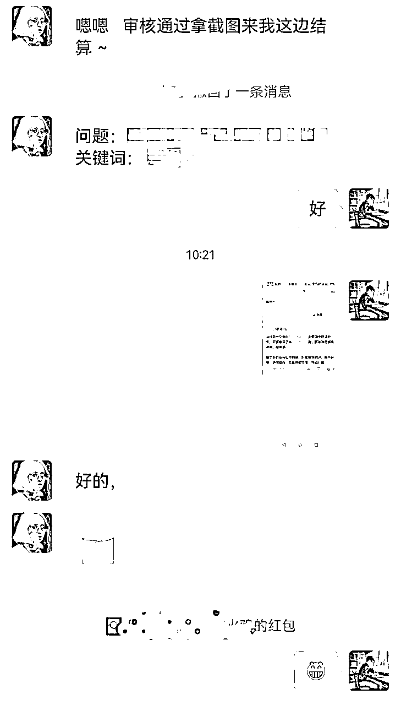

# 微信问一问保姆级教程

> 来源：[https://vnriae7rjp.feishu.cn/docx/Qnr1dFBk1o80eGxCnOEc7oLVnye](https://vnriae7rjp.feishu.cn/docx/Qnr1dFBk1o80eGxCnOEc7oLVnye)

## 1、为什么要做问一问？

### 第一、流量为王

赚钱不论是线上、线下开实体店、做自媒体，电商，不管是多大的是生意，赚10w、100w，还是1000w，都离不开三点：流量，产品，转化。

在线下开餐饮店，服装店，小卖部，最重要的是选址。地址选的好，生意就不会差。比如在闹市、大商场、学校门口，即使你店里的商品差一点，没有特色不出众，性比价一般，生意也会不错，因为客流量大。

如果这个时候你的竞争对手还少的话，流量就更大的，比如我初高中在学校读书，不允许学生出校，这个时候学校的食堂饭菜再难吃，你也得吃，学校的商店卖的再贵，你也得买

可见流量到底多重要，而问一问就是现在微信生态下最容易获取流量的地方。

### 第二、容易获取流量的四点原因

1、微信庞大的基数，14亿用户，日活超过10亿

2、问一问属于微信新推的产品，是新平台，有很大的流量倾斜，比如搜一搜入口直接就是问一问，搜索发现的问题点进去，排在前面的都是问一问的回答

你仔细看图片会发现，排在前面的是问一问回答，然后是视频号和公众号文章，由此可见，它们的权重了。

3、平台早期，竞争对手少，内容竞争少

问一问第一批是今年3月份邀请内测，6月份正式对外开放，再到现在两个月时间，现在入局玩问一问的人还是比较少，差不多都是圈子里的人，人少，竞争不会太激烈，关键是平台缺乏内容！！

大家可能担心”我不会写文章，不会写回答怎么办“，放心，问一问内容竞争很小，不需要你像知乎那样长篇大论，也不需要你写的多有深度和干货。

50个字足矣，可以是干货价值，实用价值，可以是情绪价值，引发共鸣，可以是争议引发讨论等等，内容竞争很小，不需要担心这个。

4、用户心智容易被影响，点赞关注轻松

多去看看问一问回答会发现，高赞的回答并没有说什么，甚至有些只是把问题重复了一遍，就有几百点赞和很多条评论

问一问的用户是非常容易点赞的，相对心智容易被影响，点赞后会自动弹出关注按钮，非常顺滑

以上四点就是问一问为什么容易获取流量的原因

### 第三、做问一问有什么用？

相信不说大家都知道答案：流量和赚钱。问一问可以给视频号和公众号涨粉，增加播放量和阅读量，我们做公众号的都知道公众号涨粉有多难，要么互推，要么做运营，要么付费推广，靠写文章进推荐池很难。目前公众号也开始有推荐流量了，但对大部分小伙伴都不容易。

而问一问就简单很多，用公众号直接答题，每条回答只需要20-50个字，每天20个回答，一条回答一个粉丝，一天也有20个，如果回答爆了，那么就是几百个

如果没有公众号怎么办，去开通，一个身份证可以开通一个公众号。如果是视频号回答，我们也可以给视频号涨粉和提高播放量，并且引导到微信上。

## 2、问一问是什么

微信问一问是微信平台上的问答功能，它的价值在于提供一个便捷的方式，让用户可以向广大用户群提问并获取答案。通过问一问，用户可以寻求他人的帮助、获取信息、解决问题，同时也可以分享自己的知识和经验，建立互助和交流的社群。这个功能为用户提供了一个互动的平台，促进了知识分享和社交互动，让用户在微信社交网络中获得更丰富的信息和资源。

简单来说，就是微信问一问的流量相当猛，是微信对标知乎的产品

问一问是需要用视频号身份，可以直接引导关注，给视频号涨粉，增加视频播放量，同时视频号如果绑定了公众号，切换到公众号问答问题，直接给公众号涨粉，免费的流量

问一问的重点就是获取流量，给公众号或视频号涨粉引流，然后想办法通过视频号视频，或公众号内容进行转化

## 3、问一问怎么开通

3月份我就有内测资格了

### 2.1 三种开通方式

第一种：从微信的[发现—搜一搜」里面的，打开「搜一搜」主页 ，就能看到入口，点击「问一问」就能进入主页。

第二种：搜一搜随便搜一个问题，然后选择问一问，进行回答问题

第三种：通过别人的转发的问一问提问，直接进入答题

问一问目前需要用视频号身份进入，所以我们需要开通视频号，一个微信可以开通一个视频号。

### 2.1 视频号入口

*   微信->我->主页

*   微信->发现->视频号->推荐页->右上角头像（视频号个人中心）->点击视频号名称->主页

注：如何打开发现页视频号入口？

如果在发现页面找不到【视频号】，可以通过 “我” -> “设置” -> “通用” -> “发现页管理” -> 打开【视频号】选项即可

### 2.2 视频号开通步骤

如果是实名过的微信号，可直接开通。

如果没有实名，发视频时会收到实名认证提醒，进行认证，填写身份信息，添加银行卡

1、上传头像

2、填写视频号名字

3、选择地区

4、打开在个人名片上展示视频号开关

5、勾选 我已阅读并同意《微信视频号运营规范》和《隐私说明》

最后点击创建，就完成视频号的创建了

### 2.3 主页设置和绑定公众号

点击视频号主页右上方的【…】三个点，进入视频号设置页面

点击【资料设置】选项，进入个人资料页

点击【账号管理】选项，进入绑定公众号

*   头像：没有改动次数限制

*   名字：一个视频号每年只有 5次改变昵称的机会

*   简介：字数限制 200 字以内（注意换行排版）

### 2.4 相关账号

微信号: 聊天发朋友圈用的账号，一个身份证最多开通五个微信号。一个手机号一个微信号。想玩多个账号就买多个手机号注册微信号。

视频号: 用实名过的微信号开通视频号身份，可发视频，开直播。一个微信对应一个视频号。

公众号: 每个身份证，可以开通一个订阅版公众号，公众号和视频号的管理员身份一致时可以进行绑定。管理员身份一致指的是是同一个身份证实名认证的

https://mp.weixin.qq.com/ 注册公众号就行

问一问账号: 问一问目前是用的视频号身份登录的，可切换到公众号身份

注：如果你的视频号已经绑定了公众号，但没有[切换公众号]的入口。等待，具体原因还不清楚。暂时先用视频号身份多答题

目前问一问只能手机问答，请更新微信到最新版本

切换入口，如下:

### 2.5 问一问基础功能

从左图【右上角小人头】进入到右图中

右图上半部分是微信身份的信息，我们主要关注下半部分问一问账号的信息

【提问】在问题广场可以提问，这里会记录你提过的问题

【回答】这里记录了你所有的回答，包括审核过的，审核中的，审核失败的。都在这里，需要删除问题也在这里

【草稿】点回答问题可以选择【稍后答】这时【稍后答】会放在【草稿】中

【消息】这里放着用户点赞，评论的信息

## 4、问一问怎么找问题

### 4.1 热榜问题

由于问一问取消了搜一搜主页的热榜，所以需要换个地方找

从微信主页的【搜索图标】进去，看到【搜索发现】选中一个问答问题

### 4.2 推荐问题

推荐问题就在主页，选择自己想要回答的问题进行回答

### 4.3 寻找关注数大于问答数10倍的问题

关注人数709，回答71，接近10倍。优先回答关注人数多，回答少的问题

### 4.4 从问题广场直接搜索行业问题

### 4.5 找高赞回答

找高赞回答，然后进入他的主页，看他最近的问题的数据情况，如果不错，跟着他回答

## 5、问一问回答要点

精简：问一问和知乎不一样，不需要长篇大论，精简有趣即可

利他：对于专业问题，专业回答，分点回答，不要引流和营销

话题性：泛内容，有趣，获取共鸣，或者具有争议性，反常识

正能量：一定要客观正能量，这个懂的都懂

注意:

敏感词、违禁词不要犯

回答要原创，AI不容易过审

一个号一天20个问题，控制每小时不超过五个

时间：早上7-9点，中午11-13点，下午6点，晚上9-23点

## 6、问一问涨粉

用户点赞后，会自动弹出视频号/公众号身份，引导关注

1、回答问题获取高赞

2、评论高赞回答获取曝光

3、看第三节怎么找问题

## 7、变现商业化

精准内容+精准粉丝+视频号内容钩子+置顶视频/简介=转化或者直接成交

### 7.1 精准内容+精准粉丝+视频号内容钩子

问一问选择视频号定位符合的问题，或者自我自答。

回答体现专业度，还可以直接插入视频号视频，直接引导观看，然后在视频里面做钩子进行转化

利用视频号置顶视频，放挂车视频，自我介绍视频，引导关注转化

个人主页简介那里写下简单的业务介绍，留个微信号，引流的私域转化。但目前容易账号被认定是引流，需要这块需要注意，最好是用公众号回答，用公众号的自动回复转化

### 7.2 接单

在视频号后台会有商家找你，或者兼职的单，目前一单2块钱

1、看视频号后台私信，有商家派单需求

2、加微信，了解清楚，目前一个问题一单是2块钱

3、审核通过后，不能主动删除，如果删除要退还

4、审核通过后，被系统自行删除，不用返还

5、风险：有可能被认为是引流导致账号异常或者审核不过，建议小号玩一玩，尝试一下

### 7.3 公众号流量主

通过问一问涨粉，然后开通流量主，靠流量主赚取收益

### 7.4 问一问陪跑群

## 8、账号问题解决

1、回答经常审核中？

先不管，继续答题，但要控制频率

2、回答审核失败怎么办？

判断是内容问题还是账号问题，内容中不要加引流和营销。改1-2次审核不过，直接删除，换其他问题，不要纠结一个问题

3、提示问一问在内测中

如果没有权限回答问题，换号，换微信注册视频号

4、问一问被批量驳回回答，历史回答审核失败怎么办？

删除删除，平台在批量检测回答，将不合规的回答全部删除，然后每天回答1-2个问题看看情况

5、问一问不管回答什么都审核失败怎么办

删除历史回答中可能存在引流嫌疑的问题，然后等待1-2天。我是删除了大部分回答，等待了快一周才被放出来

一边删除，一边等待，一边换其他号继续玩

以上就是问一问的教程，后续会更新进展，欢迎来交流！