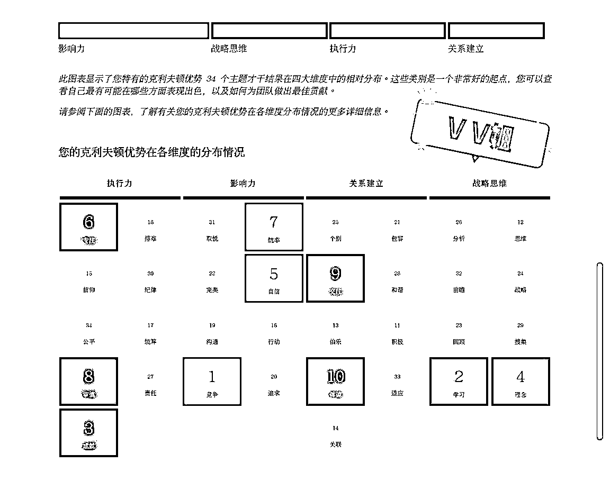

# 遇见优势挖掘航海，焦虑中年女，43天逆袭成长教练，单月变现2W+

> 来源：[https://p1wkox71lhb.feishu.cn/docx/RSoDdVLyYoNpBJxoGHhciNjknQd](https://p1wkox71lhb.feishu.cn/docx/RSoDdVLyYoNpBJxoGHhciNjknQd)

大家好，我是VV姐，一个自媒体行业纯素人小白，一个17年+资深职场人。

今年4月刚刚加入生财，在这里我开始接触盖洛普优势才干。也是在这里我从一个曾经外表光鲜，内心痛苦的中年人，一个纯素人小白，逐步蜕变，完成和自己的和解，和家人的和解，和团队的和解，重新树立主业目标，并开启副业，43天拿到单月变现2W+的成绩。

虽然这个成绩和各位大佬相比，非常的微不足道，但是它标志着我副业MVP的跑通，标志着我开启了双通路发展，标志着我的人生有了更多选择。

### 一、外表光鲜，内心痛苦的中年职场人

过去的4年多，是我内心最痛苦最挣扎的4年，也是我的前半生又一次经历的至暗时刻，绝望之谷。

在外人看来作为互联网大厂的管理层，拥有专业领域的顶级证书和过硬的专业技术，就可以高枕无忧，摆脱职场焦虑，但事实并非如此。

疫情三年，内外部环境均发生了巨大变化，“降本增效”成为各大公司最频繁提及的词汇。随着组织架构及业务重点的几次调整，我也随之不断接受新的工作内容，进入新的领域，迎接新的挑战。

虽然每次承担新工作都会让我小小的兴奋一段时间，全新领域的挑战会让我热情满满。但是每每渡过新工作的甜蜜期，获得超越别人的成就之后，我就会感到动力不足，索然无味。

同时，频繁调整工作内容让我无法在一个领域形成稳定沉淀，突出的工作表现也只是为了能够更好的争夺有限的资源，与我想要的那个职业发展方向早已渐行渐远。

看着同级别或更高级别的伙伴一个一个在不知不觉中离开，心中难免悲凉，也对未来产生了隐隐担忧。不知道会不会有一天，同样的事情也在自己身上发生。

人总是在拥有后更害怕失去，害怕的并不是浮名，财富的离去，更多的是害怕属于你的舞台离去，是不再被需要的失落与迷茫。

而另一方面，痛苦还来自与家人的沟通不畅。

在新的领域获得认可，是需要付出极大努力的。所以这4年来，为了能够保持竞争力，每年我都会投入大量的时间和金钱学习管理技能、专业技能提升的课程。

一方面是工作需要，另一方面也是兴趣使然。所以学习几乎填满了我80%的业余时间。每天下班回家，结束了一天的忙碌，我都会一头钻进书房，静静地看书或者听课。

每当这个时候我都会感到无比的轻松。也因此忽视了家人。家人总会抱怨，我对他们的关心太少、陪伴太少。

但是我的内心深处却是非常在意家人的，只要家人有需求，哪怕是推掉工作，我都会第一时间满足家人的需求，第一时间陪伴。但是这种付出，家人却感受不到。

一边是我认为的付出和陪伴，另一边是家人感受到的冷漠。付出与反馈的不一致让我内心非常自责和不解。

自责没有充当好家人的角色，不解为什么我用力付出后仍收效甚微，不知道怎么做是适当的。

于此同时，最近这2年，家人也开始对我的状态表示担忧。家人对我说的最多的就是“你太焦虑了”。

他们看待我如同“异类”，是一个上满发条的学习机器，每天不是学习就是在学习的路上。他们用“极其焦虑”来形容我，说我每天太紧张，劝我要松弛下来，要享受当下，享受生活。

起初，我并不以为然。觉得我就是想学习，想成长，没有什么问题。但是日复一日，身边的所有人都是相同的态度，甚至在我看书的时候都会投来“鄙夷”和“诧异”的眼光。就连一直以来都非常支持我学习的母亲，也劝我不要再学习了。

这一切都让我陷入了深深的自我怀疑。我每天都在劝自己，不要焦虑；每天也都在思考、寻找，我究竟在焦虑什么？

但是，越是劝自己，越是思考，心里反而越发心慌，觉得自己不正常，因为和身边“正常”的人太不一样。原本非常自信的我开始陷入循环往复的自我怀疑，甚至是自我质疑中。

### 二、遇见航海优势挖掘，克服焦虑，重启人生，逆袭飞扬

“人这一辈子，最难的就是认知自我”。

正当我经历着自我肯定与自我怀疑的往复徘徊，在公司需要与个人发展中无法选择的时候。在5月的航海中遇到了盖洛普优势，为我打开了认知自己的一扇窗。

是盖洛普优势才干让我知道“竞争”，知道自己为什么会做什么事都希望比别人强；了解“专注”会帮我很容易进入心流状态，但是如果被中途打断，就会容易烦躁甚至暴躁。

我的盖洛普是影响力+战略思维主题。前五才干是竞争、学习、成就、理念和自信，再加上专注第6，统率第7。

我最自然的状态就是一个“卷王之王”，不仅自己卷，在大影响力下还要带着别人卷。

竞争+成就+自信+专注，铸就了我卷王之王的体质。

学习才干又让我对一切新的领域好奇，希望学习，享受学习的过程，所有接触的新领域都会让我非常兴奋，不停学习就会有满足的快感。

而理念又让我总会冒出很多天马行空的奇思妙想，所以每每遇到难题叠加竞争后，都可以激发我的灵感，想出各种别出心裁的方案。

再加上自信，又会让我认为我和我的团队是“万事皆可为”的，我天然认就会相信团队和我有相同的嗨点。不停的挑战自我极限是我最本能反应，无论是否有意义，我都乐于接受。

在我看来世界上没有什么事情是困难的，只有不想做，没有做不到，做不到就是“不努力”就是“懈怠”就是“懒惰”。

而“统率”这个要命的才干，又非常不符合中国传统文化下的中庸之道，所谓“出头鸟”说的就是我，叠加竞争后，就更会变成万事皆要争先。

所以这些年，我几乎每天都处于战斗状态，卷自己，卷团队，卷协同部门。在这种状态下，可想而知，和我共事的压力是有多大。我就像一把尖刀，无往不利的同时也伤了身边几乎所有的人。

而对这种疯狂的“卷王”状态，我不仅不自知，还乐在其中，不仅自己要这样，还天然的认为所有的人都应如此。

所以，当有人懈怠的时候，我的态度和反馈都是极其负面的。

重压之下，虽然团队业绩突出，但是幸福感极低。而我自己也越卷越快，越卷越累，但根本停不下来。

而这一切，是在我接触了盖洛普优势之后才知道的，我开始能够理解家人的痛苦、团队的痛苦。

特别是在航海结束之后，通过圈友微光，我又结识了北大苏姐@苏姐 职场优势教练 继续深入学习优势才干相关理念。

苏姐是国内最早的盖洛普认证教练，优势动力的创始人，旨在打造一所优势教练界的黄埔军校。

苏姐是战略思维+执行力主题，初次沟通，她的专业、真诚、睿智和情怀深深打动我，让影响力+战略思维主题的我感受到了思想上的共鸣。

通过优势才干讲解及案例解析，让我快速理解了自己的34项才干使用说明。同时结合自我觉察，不断观察自己在不同场景下的行为，来感受才干正向发挥的好处、负向影响及看待别人的主观滤镜角度，从而调整自己的行为模式和底层逻辑，让我重新开始认知自我。

我开始学会不再想当然，而是真诚的和家人表达我的感受和诉求、和团队交流。

不再用我的标准要求身边的人，而是开始理解他们，共情他们，学会真正的换位思考，不再把我的需求建立在别人的短板上。

实现了与自己和解、与家人和解、与团队和解。

同时，优势理念又如同一门高深的“武林内功”注入我的体内，打通了我的“任督二脉”。

让我将以前学习到的知识和实践经验通通融会贯通了起来。

让我快速掌握了结合优势为自己为他人解决问题的能力，逆袭成长为一名优势成长教练，43天实现单月变现2W＋。

### 三、结合自身优势，最大化发挥价值的7点建议

人的一辈子都在探索“我是谁？”这个哲学问题。

全面地认识自己，知道自己的天赋，了解自己的短板，最大化发挥自己的优势，就可以事半功倍，让成功更快到来。

在8月航海的【个人优势挖掘】马上开启之际，作为优势学习的直接受益者，给大家一些实用的建议，希望你们也能有所收获，遇见更好的自己。

#### 1、34个才干如同34张牌，只要真正理解，运用自如，没有前后好坏之分

很多做过盖洛普测试的小伙伴，会羡慕别人拥有某些突出才干，觉得自己的才干很“弱鸡”。

其实我想说的是，才干没有好坏之分，只要运用得当，任何一个才干都是“王炸”技能的存在。

记得我刚刚做完盖洛普测评的时候，对我的第一才干“竞争”是非常厌弃的。

“竞争”才干的突出表现是经常设立自己与他人的竞争， 天生想要将自己的表现与他人的表现进行比较。当胜过了所有其他竞争者时，就会感到振奋。也就是俗话说的“好胜心强”。

这在传统的中国文化下并不是一个美德。甚至我对“竞争”排位第一是感到“羞耻”的，刚刚开始的时候都不愿意向别人展示我的才干图。

但是随着学习的深入，我发现，如果管理好“处处皆可比，皆要争比他人强”的负向影响；在不需要比的事情上主动管理，不去比较。而在应该做好的领域，调动“竞争”才干，则可以克服困难，取得卓越的成果。

回想起过往的经历，我的很多重大成就，高光时刻，都是经历了极其艰难的过程的。而支持我跨越艰难的主要动力就是“想赢”的这颗心。

比如我曾经在20多天的时间就带领团队完成了一个常规需要半年才能完成的项目。当时就是因为一句话“这个任务不可能在1个月内完成”。

而这句话却激发了我的“竞争”斗志，支持我让不可能变成了可能。因为完成一个“不可能完成的任务”，在我内心里就等同于“比别人优秀”，意味着“赢”。

同样的，曾经向我咨询过的一些小伙伴，会对位于第一才干的“适应”、“和谐”……感到很弱。

但是据我的经验，“适应”第一如果发挥得当，是非常牛的一个优势，他会帮助我们无论面临怎样的情况，都可以如同一枚“定海神针”，从容应对，让他人获得巨大安全感。

而“和谐”才干也如是，如果发挥得当，则是不融洽关系的调和剂，可以在不同中找相同，把多方意见整合，求同存异达成共识，有很强的关系建立能力。

所以，无论你的前五、前十才干是什么，都不要觉得很弱。才干没有好坏之分，只有运用是否得当。

34个才干如同34张牌，只要我们充分理解才干，运用得当，都可以成为我们得天独厚的优势。一定要好好觉察自己的优势正反馈，充分发挥；管理负向影响的过度发挥。

#### 2、成也才干、败也才干，你最大的优势里面，隐藏着最大的劣势

任何一个才干，如果我们不能很好的管理他，发挥过度都会成为阻碍我们发展的因素。

比如“自信”才干，发挥适当就是对自己有信心。信心是金字般宝贵的东西，在面对困难，面对新领域，承担重要工作等关键时刻，大多需要靠强大的自信心来支持走过最初最艰难的路。

但是如果发挥不得当，过度运用，就会变成“自负”，盲目相信自己，导致失误。

比如我在去年接受一项新工作任务的时候，就过度发挥了“自信”才干，导致了前期失误。

那是个全新的领域，需要非常专业的技术知识，而这些是我不具备的。但是，当时因为之前的几个全新领域的任务我都完成的很好，于是“迷之自信”的认为我可以以0经验挑战别人10余年经验的工作成果。最后的结果可想而知。

虽然后来经过不断努力弥补，可以追赶到平均水平。但是因为开始的过度“自信”，也让我至今还在为最初的“轻敌”填坑。

成也才干，败也才干。我们的天赋优势里面也隐藏着最大的劣势。每一个才干背后都会有过度发挥的负面影响，我们需要充分理解这些影响，在自动发挥的时候，觉察它，管理它，改善它的影响。

#### 3、优势才干助力职业发展

在职业发展方面，可以通过充分了解我们的优势才干，主动规避反复动用靠后才干的领域，特别是“后5项”才干。

虽然说34项才干犹如34张牌，当你充分理解并可以灵活运用时，才干排序的先后已没有那么重要，因为你想要使用哪个才干就可以使用哪个才干。

但是我依然建议大家在职业选择的时候能结合才干，尽量避免踏入需要反复动用“靠后才干”的领域。

以我为例，我是从事财务的，但是看我的才干图，分析、纪律、取悦才干都在后10项，而理念才干又在第4。

这就意味着“理念”会让我的思维比较跳跃，喜欢创新，而传统财务需要在准则的要求下执行工作，对遵循规则的要求相对较高，也就是会经常用到“纪律”才干。

另外，财务也需要和多部门协同沟通，这就需要经常和陌生人打交道，运用“取悦”才干。

而我平时的行为模式是真心的不愿意和陌生人交流。“交往”才干靠前的我喜欢1对1深度交流，认为好友不在多而在精。

所以，当我和不熟悉的兄弟部门管理者拉关系的时候，我内心的声音是抗拒的。我需要鼓起很大的勇气才能够踏出开启沟通的第一步。

做好财务管理还需要很强的数据敏感度，和较强的数据分析能力，这就需要动用“分析”才干。而我平时更愿意通过经验进行判断而不是数字分析。

这些天然的行为模式，是不利于我做好财务工作的，所以财务工作对我的精力消耗很大。

但是我为什么还能在财务领域做到管理层呢？是因为我有“竞争”、“成就”。

回想我这些年的各种行为，我发现其实我是通过“竞争”才干，一定要做的比别人好的那口气，克服了一切关于沟通协调、数据分析、遵循准则的弱势。同时靠“成就”才干作为支撑，帮助我完成了一个又一个艰难的项目。而这个过程中，我一直都是非常耗能的。比如，当我做数据分析的时候，就很难进入心流状态，需要用时间管理工具进行辅助。

所以，才干不适合并不代表你做不好这项工作，只是会花费更多的精力，其中的愉悦感会比较低比较短暂。不像动用优势才干的时候那么的心情愉悦，得心应手，事半功倍。

在职业选择时，我们尽量避免过多的调用靠后才干的工作内容，充分发挥我们的突出优势领域。

如果因为客观原因不可避免的要动用靠后才干，我们可以尽量申请调整或寻求同盟的帮助。

#### 4、优势才干与副业发展

说到副业定位，很多小伙伴都很迷茫。觉得能做的特别多，但是细探下来，又会发现似乎都没有什么优势。

那大家不妨结合优势才干进行选择，优先尝试经常使用自己前10才干的领域。

副业是我们在主业之外又生长出来的第二通路。如果在主业上已经深耕很多年了，又无法激发我们的成就感，或无法满足我们才干的渴望，那不如转移注意力，用副业满足突出才干的渴望，平衡和补给能量的消耗。

比如我因为工作内容调整的原因，目前的岗位对我的影响力是压制的，这就让我感觉一身的能量无法释放。

但是，自从我开启副业，满足了我大影响力想“改变世界”的渴望，感觉整个人都好了，对主业的投入也比以前更多，工作的时候也更加专注。

再比如具有“体谅”和“个别”优势的小伙伴，会对人比较敏感，能够觉察到人与人之间的细微不同，也非常容易共情和理解别人，体会对方的痛苦和不易，提供情绪价值。

这种才干就很适合做情感类咨询服务的副业。因为他们能够设身处地的感受对方的情绪，站在对方的角度，引导他们自己找到适合自己的解决方案，而不是将自己的意志强加给对方。

而“取悦”才干靠前的小伙伴在社群运营的时候就会更得心应手。

“战略”、“理念”、“分析”、“思维”等战略才干靠前的小伙伴，在帮助别人分析问题提供解决方案的时候也会想得更深、更有高度、更有框架感。

才干被满足的时候，就如同给我们充电，即使没有外部的正反馈，我们也会动力十足。

因此如果我们的主业不能让我们获得满足，那么可以尝试寻找一个能够滋养我们突出才干的副业，用副业抵消我们的消耗，获取多巴胺的快感，来达到自我的平衡与满足。

#### 5、盖洛普与关系改善

盖洛普优势还有一个非常牛掰的作用就是改善关系。因为当我们了解了才干的状态以及渴望，你就能对别人的行为模式有更深入的理解，从而改善关系。

比如，我在学习盖洛普之前，对于“学习”的态度，就是只要“学习”知识就是好的，认为每个人都是应该学习的，如果一个人不学习，我就会天然的认为这个人“不上进”。

如果在工作中遇到一个不会的工作，我的第一反应就是“我可以学”，所以我对团队的要求就是“不会就去学，没有什么是学不会的”。也因为不停的逼迫团队同学学习，经常搞的团队同学痛苦万分，情绪低落，关系紧张。

但是自从学习了优势，我再也不会用我的优势滤镜待人。再也不会认为“什么东西都是学得会的”是一个常态，不会认为所有的“学不会”都是因为“懒”，因为“不努力”。

为什么会有这种改变呢？

因为我知道这是“学习”才干的影响。我现在能够充分理解学习才干靠后的小伙伴，在学习这件事上真的要耗费更多的能量和精力，做很多的心理建设才能迈出尝试的第一步。

再比如我的“体谅”才干在前10，所以我是非常容易体谅别人的，容易共情。

在学习盖洛普之前，我会天然的认为别人也都能够对人的情绪变化非常敏感，体谅别人是基本的素养。因此，心情不好的时候也不会主动表达，就等着家人来“猜”，“猜”不到我就会生气，认为对方不用心体会我，不关心我，不在意我。

但是，事实上对于“体谅”才干靠后的钢铁直男们，他们真的无法体会靠“猜”就能够了解一个人的感受和情绪。

他们需要直接的表达感受和需求，不表达就是没有。所以这种不体谅，与关心、重视与否无关，而是与天生的行为模式有关，与才干有关。

现在因为理解了不同才干的行为模式，也就对各种关系有了更多的包容和谅解。

自从我学习了优势，也给周围的朋友、家人测试了优势并进行了解读，大家对彼此的行为模式都有了更深入的理解。知道原来某些人自然而然的表现，是别人需要花费很多精力才可以修炼出来的。

现在遇到任何事情我都很难情绪上头了。哪怕偶尔会有情绪波动，也会很快察觉，并进行自我调节，处理冲突更加冷静、从容。

因为能够更科学的从才干背后的行为模式出发去思考问题，在看待家人、团队矛盾、冲突的时候就会更客观。

没有了情绪的干扰，人会变得柔软，看问题会更客观。亲密关系、亲子关系、团队关系…各种关系都因此得到改善。

#### 6、盖洛普与向上沟通

上下级沟通是职场中的一个难点，很多小伙伴都不敢、不愿意与上级沟通。要么是因为胆怯、害怕而不敢；要么就是认为沟通没有用处，说了也不会得到改善。

学习了优势之后，在即使不知道对方的盖洛普优势测评结果的情况下，我也可以通过观察对方平常的行为特点，判断他的行为模式，并用对方舒适的方式与之沟通，以获得支持。

比如，我从上级的平时表现，判断出他的“完美”才干可能比较突出。所以，在工作任务十分紧急，我希望获得更多时间支持的时候，我就会去思考完美才干的渴望是什么？并运用他的渴望去沟通。

完美才干突出的人会天然对自己要求很高，所以他也就会喜欢对自己要求高的人。

在和这样的领导进行沟通的时候，千万不要表现出来“差不多就可以”的态度。而是要先表态“这个事情我一定精益求精做到最好”才能够获得对方的信任和好感。

同时表达因为要做的更好，XX内容需要反复调整才可以达到最优效果，所以需要更多的时间。这样，大概率是可以获得支持的。

当然在提交工作成果的时候也是必须要体现出完美的工作成果，至少是在自己的能力范围内做到精益求精。否则就会失去信任，导致认可度下降。

同样的方法，我们也可以运用到对下属的沟通、跨部门沟通及其他沟通场景中去。

#### 7、盖洛普与我的重启人生

优势理念和教练技术，让我认识了自己，了解了自己，与自己和解，与家人和解，与团队和解，并帮助身边的朋友解决了他们关于职场焦虑、亲密关系等问题。

通过才干解读，能够更精准的挖掘困扰他们的问题根源，并针对性的形成个性化解决方案和行动计划，逐步摆脱困局。

不断收到的正反馈，也激励我一边学习，一边更积极的投入到优势解读和成长教练服务中去。

每每收到来访者的正向反馈和成果报喜，我都会感受到满满的力量和成就感。这种正向激励也让我越解读越上瘾。

在每天主业10余个小时的工作强度下，依然坚持平均每天1-2个咨询，而我也在这个过程中完成了初期个人产品的搭建（优势报告解读、职业/副业定位规划咨询服务、季度及年度私教服务），并收获了6个私教学员及十几个付费咨询，7月当月实现变现2W+。

通过学习优势，我按下了人生重启键，取得了巨大的收获。

首先，感谢生财，感谢航海让我遇到盖洛普优势这个工具，促使我结束了长达4年多的精神内耗，改变了内外不自恰的状态，实现彻底解脱，这个收益是无价的！

方向对了，方法对了，一切结果才会是对的！

其次，感谢盖洛普优势这个工具和北大苏姐，让我进一步提升了沟通能力、管理技能和教练技术。学会真正的理解他人，同理共情。

不仅让亲密关系更加牢固，古稀之年的父母更安心，领导更放心。还让我从之前长达10年的命令指导型领导转变为启发引导型，提升了团队凝聚力和积极性，让团队同学获得幸福感，配合更默契，动力更强，效率更高。

最后的最后，感谢芷蓝、理白&靠谱，指导我精准定位职场跃迁这个细分领域，力发一处，让我充分发挥独特优势“嵌入”客户需求。

在短短1个多月就收获一份副业。43天实现MVP跑通+单月变现2W+的好成绩。真正获得双通路发展，为未来留下一个可以自主掌控人生的可能！

### 四、写在最后

感恩在今年4月加入生财，5月加入【个人优势挖掘】航海项目。让我这个大影响力＋战略思维，在发挥自己优势的同时帮助他人，滋养自己，真正的实现达人成己。

“夫唯不争，故天下莫能与之争”，不去挖空心思争取，反而会得到更多。

感谢在这个年纪遇到这么好的圈子！

感谢遇见更好的自己！

感恩遇见一切的遇见！

感谢生财官方在8月的航海又一次安排了【个人优势挖掘】航海项目！

愿大家都能够通过航海，遇见盖洛普，发现优势。了解自己，了解他人，寻找到个人的优势领域，充分发挥，获得美好人生，成人达己！

我是VV姐，一起生财！一起抱富！

附上我的才干图：

