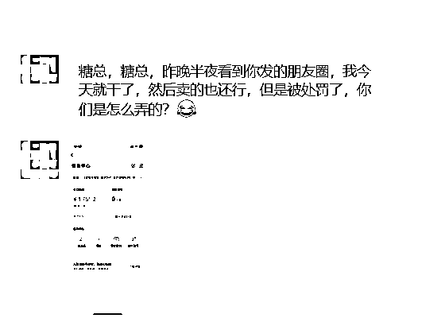
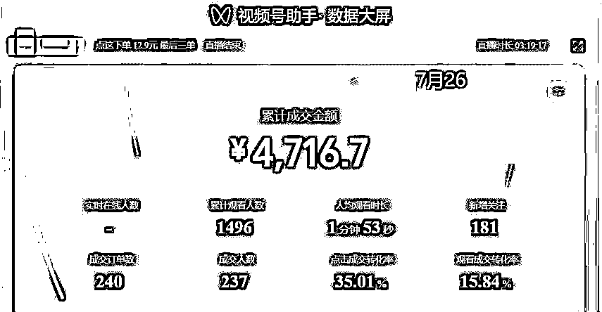

# 视频号暴力起号快速变现玩法实操详解

> 来源：[https://irvnps9bwl.feishu.cn/docx/SKPidLlcro9kMXxTDUUcuIo9nDh](https://irvnps9bwl.feishu.cn/docx/SKPidLlcro9kMXxTDUUcuIo9nDh)

大家好，我是 ，玩 AI 绘画的很多小伙伴可能认识我，5 月有幸在航海担任过 AI 绘画航海教练，和各位圈友们共同探索 AI 绘画航海，寻找变现方向。

我从 19 年开始创业，做过日销量 30 万+的抖音团长、2 年间和同学合伙经营了一家年营业额近两千万的广告公司、公司旗下 B 站 MCN 粉丝总量近千万（含 4 位百大 UP 主）、还开过茶馆。

今天暂且不谈其他，跟大家聊聊，近期一直在研究的视频号项目：如何快速暴力起号。

知道这个项目到执行我们花了 2 天，并跑通了变现。从起号第一场只有 100 块 GMV 的不如意，到测试调整暴力起号打法后，两周内跑到了单场 GMV 近 3 万的成绩，打响了在视频号带货的第一笔变现。

这个成绩比不上其他视频号大佬，但有个优点就是，这个视频号的打法在我们的测试下，是适用于普通人、新手上手的唯一的要求，就是需要执行力拉满！

以下是适合新手的实操指南，全文近 6000 字，预计阅读 5 min。

### 零、先聊背景

#### 0.1 风向标：视频号红利期仍在

8 月 7 号在测试中发了个视频号的流量还是处于红利期，就跑去发了个风向标，也有圈友关注到这个项目，找我聊了下。感谢亦仁大佬的中标～～

#### 0.2 道：新手也能上手的项目优势

上手第 1 天 GMV 一百块，只花了几天时间后面就能打到单号单天 GMV 近 3 万，佣金破万。

有位圈友看到我 8 月 8 号凌晨发的一条朋友圈，然后白天立马执行，跑出了 1715GMV。

这个项目是可以单人操作完成整个闭环的，而且对新手的上手难度并不高。我和我们的小伙伴们在跑这个项目之前对视频号也没有过多的了解，直接上手实操就是干，一边学习一边测试一边开播。

项目测试成绩

7 月 18 号第一天开始直播到现在 8 月 15 号一共播了 9 天总 GMV 三万五，佣金大概 1.6 万左右

其中最高一场 GMV2.8 万，在这 25 天里有差不多 10 天是没有跑这个项目的，所以花在这个项目上大概是 15 天干出了这个成绩。

数据详细

7月18日，GMV 100

7月19日，GMV 511

7月26日，GMV 4716

7月31日，GMV 28000

8月7日，GMV 8000

8月10日，GMV 5666

8月11日，GMV 2935

8月13日，GMV 6000

8月14日，GMV 3552

今天（8 月 17）又有一个号迎来了 GMV 破万多（直播＋橱窗），一边跑一边补充这个帖子

#### 0.3 法：视频号暴力起号玩法是啥？

通过混剪其他平台爆过的品的素材，直接去重，连怼视频获取自然流带动直播间进人，打低价高佣产品。

一般你们在广场或者瀑布流刷到这种直播间就是我们讲的暴力起号玩法，都是打自然流。搬运混剪视频起量了直接开播，暴力起号玩法基本上都是打一些 9.9～19.9 的品，极少也会打 29.9 的品，这些品的佣金大部分都是 50%。

#### 0.4 器：项目需要的一些必备品

1.  两部苹果手机，最好有 1 部型号是 11 以上用于连接电脑当摄像头用电脑开播，最好是有多几个手机，一机一号一卡，一台 win 系统的电脑

1.  五个微信，开通了视频号的绑定银行卡直播实名用于视频号直播

1.  手机散热支架，能用的麦克风能连接电脑收音

1.  500 块视频号橱窗保证金（一个号 100 块）

1.  良好的心态，死号是常态，没流量也是常态，所以我们需要多号多品多素材测试

#### 0.5 术：新手暴力起号从 0-1 实操详解

项目路径：

注册视频号-->直播人脸实名认证-->交保证金开通橱窗-->养号-->选品-->选素材-->剪辑--->发布-->直播

我们首先需要注册视频号，完成直播人脸认证和开橱窗，具体细节在这里不在过多阐述，大家可以去看下航海手册，就能解决这个问题。

账号要求：最好是新的视频号，包含以下几种新视频号：

1.  老微信没有注册过视频号的

1.  新注册的微信开通的视频，刷一刷视频号，刷老年人的视频，养养号，隔天再用

1.  老微信没带过货或者没爆过或者新开通视频号 这种号是最好的账号

### 一、把自己的账号养成一个带货账号

目的：找到很多同行

意义：可以跟品、可以学习同行的爆款视频模板，说白了就是提升对视频号带货的感知能力

要求：号不是拿来做视频带货的，就是单纯刷同行的

#### 方法一：人工干预

找到 10 个同行的账号关注并挑一条爆款视频评论点赞收藏。如果找不到可以看我的这些关注，都是对标账号。但是可能过段时间这些账号进去就已经没有带货内容了，因为被原主删掉了，这种就不要关注了

#### 方法二：刷自己的视频号

遇到同行类型的视频点赞并停留。如果与带货无关就选择不感兴趣

#### 方法三：去直播广场找

只要封面出产品贴图的基本都是我们的同行，进去评论点赞互动，之后系统就会推荐同类型。把号养成后，一打开直播广场基本 80%都是这种带货账号。

### 二、系统化选品逻辑梳理

#### 2.1 选品的逻辑

视频号的主要观看、购买人群，是 45 岁以上的，二三线城市小镇中老年为主。消费观念比较看重价格，追求性价比。

选品技巧一：便宜、极致性价比

选品的价格要便宜或者能突出极致性价比，比如说 9.9 的品，水管、沥水篮、干发帽，比如纸巾 29.9 三提今天直播间下单再送三提买一次用一年

选品技巧二：新奇特、视频素材好

我们是搬运混剪靠视频流量引流的，而新奇特的产品本身拍出来的视频素材就有拉停留的能力。例如小滚刷秒变新手墙、老鼠夹一夹一个准，还有抖快里做剧情带货的视频素材也是同一个道理

选品技巧三：强卖点、解决痛点

以防蚊香茅精油举例：最直接的痛点夏天蚊子多，用户核心需求就是防蚊驱蚊。产品卖点不用点火、不用通电、成分安全、母婴可用、室内外随身携带打开即用，区别市面蚊香液蚊香片、驱蚊喷雾等

选品技巧四：周期季节性品、节日热点品

即将到来的七夕，9 月份开学季，中秋节，10 月份国庆出游季，万圣节

#### 2.2 什么品适合你做视频号？

根据我们的短视频引流单品拉爆直播间这个模式，结合前面的选品逻辑给大家总结了三个公式：

1.  便宜+强卖点=入门品

1.  入门品+新奇特=降低难度品

1.  降低难度品+规律强=直接爆单

#### 2.3 如何提高选品命中效率？

想要提高选品命中率，首先要选对品，其次要跟对时间！

1.  直接跟正在直播的爆品

刷到的直播间在播的品，先看视频类型，再看视频数据，然后看直播间人数、销量。只要视频数据点赞评论转发高，直播间有真实互动、销量高，同时视频类型你能搬、选品中心有这个品，不要想直接上了再说，时间就是金钱！！！

1.  使用第三方数据平台找抖音爆品

考古加、蝉妈妈有抖音近期爆品、黑马达人等，用第三方数据平台快速找到近期趋势爆品和视频素材，快速测试！

注意：使用数据平台选品尽量选视频带货为主的，尽量剔除品牌以及明星带爆的产品。

##### 2.3.1 考古加

以考古家为例子，点开主页，进入「个护家清」

选品标准

*   生活好物方面

*   价格便宜 9.9

*   看到前 20 的产品素材去抖音，视频号，快手是否是爆款素材视频，如果产品素材在三个视频都能有爆款视频赶紧冲

##### 2.3.2 蝉妈妈

进入蝉妈妈，点击上方商品，点击潜力爆品榜

以日用百货为例，选择三日热销，找到销量趋势向上递增的品，数据平台会有延迟，像下图中的前两个商品可能是突然爆量之后下滑，也可能是数据没更新

例如，这个金刚砂百洁布，价格不高，抖音 40%以上的佣金视频号也差不多的，销量趋势总体上升的

点进来之后直接找视频分析查看视频，看看能不能搬

##### 2.3.3 运用巨量百应选品

由于视频号的反应速度都会比抖音慢半拍，所以一般抖音火的东西可以立马搬到视频号吃第一波红利。这也是一个很好到选品方法。

首先，需要你有一个有橱窗能进选品中心的抖音号，打开巨量百应 https://buyin.jinritemai.com/dashboard

选择创意中心-->爆款视频-->行业类目选择「智能家居」或者「个护家清」-->作者等级选择不限-->选择“近一小时”飙升的爆款视频

看看有没有低价好用的好物品，确定了就可以去抖音搬素材测

注意：由于我们是搬运混剪，一定不要搬大 IP 明星出镜的，尽量不搬有长时间真人出镜的视频

##### 2.3.4 跟同行在打的品

同行是最好的老师。当你在直播广场刷到同行的号，他的最早视频是 6 小时内的，并且这个品你这直播广场没见过就可以跟，或者说去跟一星期前的爆品。

目的：学习视频的剪辑模板还有卖的好不好，还有能不能跟

目的：

1.  跟品、同行首个这个品的视频是 4 小时内发的立马去跟这个

1.  学习该同行的爆款视频剪辑模板（拆解）

### 三、剪辑与素材

找素材，看到的品直接去找抖音或者快手的爆款，或者按照同行的爆款视频去找对应的素材

如果素材在视频号不泛滥的话对剪辑要求不大，如果你的剪辑能力很强直接拆解同行的爆款视频和爆品，基本上你都能起量很快

我比较习惯的剪辑公式：

把主视频复制到第二个轨道上，设置镜像，不透明度调到 4%，加 2 个贴纸在下面的两个角落，加一层扫光素材

音频分割，用两个音频轨道，声音调节 -80 -60 ，识别文字，导出

然后，用这个视频换两个不同的贴纸，一共产出 3 个视频

### 四、素材发布

开播流程：提前准备工作要做好，这些是需要在发视频前就准备好的

1.  如果你是电脑直播

先电脑点一下视频号直播，跳人脸认证了，先去把人脸认证了。注意：这里不要开播，只是先解决人脸认证，避免到时候爆了才认证来不及

1.  如果你是自己的号

可以先把橱窗资质认证了，充不充值都可以

把素材发到手机上，使用手机用流量发布

1.  视频保存后，在早晨 6 点 -7 之间，醒来后第一时间发视频，15 分钟左右发 1 条，把 3 条发完

1.  观察三条视频播放，15 分钟内有 200 播放相当于视频是正常过了审核的。当数据在 30 分钟内达到 1000 左右可以直接开播，当这三条视频中的其中一条视频播放过 2 万，补下一条视频，当下一条视频播放过 1200 后，再补下一条视频，以此类推

1.  如果在 30 分钟没有 1000 播放，可以继续观察看看 1 小时的流量情况，有没有增长，增长的速度快不快，如果过 1 秒能有 50 左右的增长，观察 1 分钟有没有降低，如果 1 秒还有几十上百的增长直接开播。如果 1 小时没有流量可以每隔一个小时看看有没有流量增长，观察到发布 4 小时，没有流量就把视频给删掉，换品或者换视频发

1.  早晨发布的前三条视频，每间隔 5 分钟，点开每条视频，点上热门看看能不能加热，点开两次即可

### 五、直播准备

1.  直播方式

直播直接用手机直播

点击视频号，直播，然后贴图。苹果手机不能贴文字，需要在醒图上做文字。把图片和话术做出一个图如：

1.  直播间搭建

直播间名字：视频同款🔥，同款点这里🔥，同款 xx 热卖中，同款商品在这买，到时候用户刷到带货视频后，会在右下角看到然后进入直播间，具体如下

1.  直播封面

产品图片，尽量不要放包含太多文字的产品图，可能这些产品图立马会有违禁词，等下直播间直接限流。如果把控不住哪些是违禁词的话，直接放一张美女自拍或者写好物分享就可以了。

封面参考：

1.  直播画面参考

直接贴一张产品图+写文字就可以了。要真人出境，不要让贴纸把脸给挡住，那个类似的物品当做是样品，不要不拿样品，有持续出单了可以看看美团有没有同款下单买个样品回来播

注意：十分重要，不要挡住脸和没有样品，这样会导致很容易死号

1.  直播大概话术

*   欢迎新进直播间的哥哥姐姐们，今天我们直播间产品正在做活动，价格非常优惠，只要 9.9 元。是一个工厂直销的价格。日常价格 39 元，今天只要 9.9 元，活动不是天天有，能拍抓紧拍

*   喜欢的哥哥姐姐不要错过，拼手速拼网速了，最后三单，拍完就下播了

*   并且今天拍下我们都是有七天无理由的，你就当拿回去试一卡，到时候满意你就留下来，不满意直接退掉。

*   拍了的哥哥姐姐一定要把已拍扣在公屏上，给你安排优先发货

卖低价产品时候不怎么需要塑造品的价值，因为用户都已经被视频种草过了，才进来直播间的。这时候只要反复强调这个价格很划算快卖完了，再不抢就没了，去让他们抓紧下单。

如果产品有高 sku 尽量再推一推高 sku，和他们说两只装比一只装划算等，引导他们购买高 sku 的，客单价做的更高

重点提示：

7 天无理由退换货，不满意包退，最后三单等这种逼单话术，还有时不时循环说拍了的哥哥姐姐们回来已拍增加互动和刺激在线购买

### 六、常见问题

我认为很重要的点：

多看同行的视频看看为什么会爆，还有个对视频流量的感觉。当你做出几场有流量的数据你就知道什么时候开播比较好，我每发一个视频都会记录它的流量情况，颗粒度细到每分钟的流量增长情况

问题一：有人会问能不能无人？

不建议无人播，因为无人第一个是出单量大概跟真人平播相差差不多 10 倍，而且无人容易违规，一个持续能给你出单的号很不舍得的，能活多久就让它活多久。

问题二：不会直播怎么办？

你把那几个话术写下来改成自己播的产品然后照着读就可以了，当你流量起来了是个狗都能播着出单

问题三：每天要播多久？

其实时间不固定，看流量情况，有的时候如果视频还在一直涨直播持续进人持续出单就可以一直播，累了就找你家里人或者朋友来播直接到没流量了再下播

问题四：没有那么多号怎么办？

自己能搞 5 个实名前期基本够用，后面废号了找家里人实名，除了主号，还能给你贡献 4 个号。

问题五：有那些需要注意的地方？

账号违规了把手机恢复出厂默认，用 wifi 的把 WiFi 重置了再登录账号，适当的养一下号

问题六：关于选品怎么搞？

你要打的品大部分在选品广场都有，如果没有的你可以叫做后端的人给你上品走线下结算，但是线下结算的有风险就是后端跑路，最近这几天就有个头部做线下结算的后端跑路了，还好我们能没多少钱在他那边

问题七：一直不出单怎么办？

还得要执行力拉满，每天最少两个号多的四五个号测试不同的品和素材，总会有起量的，只要品不是垃圾品，视频起量了有大几万的播放，怎么都能卖一两千这是最低的

问题八：需要做数据吗？

没必要做数据，但是可以做评论引导进入直播间

问题九：要不要养号？

我觉得还是养个一两天，把自己的视频号刷成老年人人群，之前是不信的直到昨天（8-16）我有个近 10W+的号就卖了 40 块，进人 50 场观，我发现推荐的人群是年轻人，然后我信了要养下号。

问题十：违规了怎么办？

只要你不出现挡脸和无样品直播间就不会怎么违规，但是当视频到了 10 万+后就会出现人工审核，如果你直播的 GMV 够高可以让这个视频继续冲到 20 万，赌能过人工审核

如果觉得这个号的价值很大不想冒险就把这个视频删掉，如果出现视频不能加热的情况发 10 个原创（10 个视频分 2 天发每天 5 个）然后申诉。

申诉话术：您好，为什么我的账号发布作品没有流量，可以帮我解决一下吗，求求了，谢谢

### 七、结语

执行力真的很重要

当你还不知道怎么去做的时候，你就用概率打击爆款，多做几个号，多测几个品，总会有成的。当成了几次之后你就会发现，什么品能打，什么素材能爆，什么样的同行不能跟等等，这些问题就会成为你的经验

直播时机也很重要

怎么判断直播时机早了会浪费时间，晚了会错失很多流量。我有写到，怎么判断什么时候开播，但是最好自己记录数据能让你有逻辑概念。

最后感谢涛哥、六月、嘉丽宝贝、鱼丸、子安对本帖的指导建议，感谢沐文哥带我进广州群，带我做项目～

我很认可生财一直倡导的“利他就是利己”。进生财以来我得到的多，分享得少，一直很惭愧。希望这次分享对所有将来要做视频号以及正在做视频号的圈友有所帮助。

有想要共同探讨视频号的，评论区见，有问必回，不定时更新文档！还有常见问题也会同步～