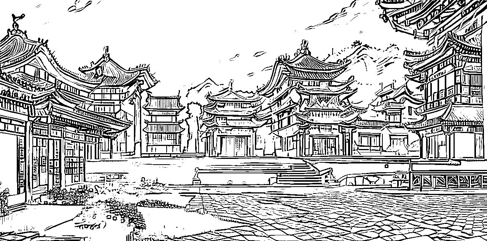

# 卖蟹第九年，我的一些思考

> 来源：[https://wz04oq2a9f.feishu.cn/docx/TCHydTGgjomskexdyd2cVnu6nxg](https://wz04oq2a9f.feishu.cn/docx/TCHydTGgjomskexdyd2cVnu6nxg)

不知不觉，今年已经是我做大闸蟹的第九个年头，到了现在，我确信我会一直把这件事干下去了，天知道这中间我有过多少次动摇放弃的念头，不过好在，我还是坚持下来了。

今年出去参加活动的频率比较高，见了不少新老朋友，在和他们的交流中，感觉大家对我的标签还是比较认可的，按他们的话说，提到大闸蟹，第一个就想到我这里。对于大家的信任和支持，我自然非常感激。

甚至有位大佬级的老哥，在饭局和我沟通过后，也在近期进军大闸蟹赛道，看他的意思，并不是小打小闹，颇有做大做强之意。

那究竟我和这位老哥交流了哪些东西，从而让他做出这样的决定呢？今天正好借着这篇文章重新梳理下，下面请欣赏我的表演，如有启发，不胜荣幸。

#### 一、创业的选择方向

古语有云，“女怕嫁错郎、男怕入错行”，又所谓定位定生死，方向错了，做什么都是南辕北辙。对我们想要创业的朋友来说，选择一个合适的创业方向，是非常重要的。

在我看来，选择创业方向有两个标准：这个行业能不能做十年以上？你是否有成熟的供应链能力？

先说供应链，我常和大家说，我当初回老家卖螃蟹的时候想的很简单，就是靠山吃山靠水吃水，老家有大闸蟹特产，市场有需求，那就干呗，其实这里面的靠山吃山靠水吃水，究其本质就是指的供应链能力。

这一点是受老哥的启发，他说他布局了汽配改装件这个项目，并不是心血来潮，因为他老家是常州的，汽配产业发达，有熟悉的同学朋友开的工厂在做这块，供应链很成熟，这样他拿货什么的都很方便。

这样一说我立马就反应过来了，其实我常说的靠水吃水，和老哥说的供应链能力，本质上都是一回事，这大概也是他选择和我合作的原因之一，看中了我背后的大闸蟹供应链能力。

其实这和大家选品中提到的产业带概念不谋而合。

再说做十年以上，我平时喜欢看顾小北的公众号，他是我很佩服的一个创业人，他多次在文章里提到，选择项目的第一个标准就是能不能做十年以上，如果不能，那么再赚钱他也不会去做的。

有客户问我，大闸蟹做到什么时候？我说再做个三十年，到时正好退休传给下一代，继续服务好你们。你看，做个大闸蟹，都上升到传家宝的层次了。

能不能做十年以上，也正暗合我们常说的长期主义，曾有人问我，你为什么能做出来，能在里面赚到钱？我说大概因为我坚持不下牌桌，很少有人愿意在一个方向日复一日死磕精进十年，时间会帮助你脱颖而出，熬都把同行熬死了。

三年入行，十年称王，我当然还称不上王，还有很长很长的路要走，但我也算是初窥门径，选择了一个能做十年以上的行业，就是选择了长期主义，选择了和时间交朋友，让时间成为你的最强壁垒，也许有一天你也会成为你行业里的头部王者。

这正是长期主义的复利效应，选择做十年以上，也是在做难且正确的事，一开始当然很难，但是难走的路从不拥挤，越往后越从容，美妙的风景只在景区深处，这算不算是另一种维度的蓝海呢？

其实，消费者通常也会更信任一个坚持在做一件事的人，因为一直在做一件事，说明品质不会差，不然根本不可能持续做下去。你一个刚进入行业的新人小白，和一个深耕行业十年的老师傅相比，大家自然会更容易信赖后者，这也是时间的力量，要不然为什么会有百年老字号一说呢？

#### 二、关于打造个人 IP

懂懂分享过一个观点，互联网是近二十年最大的杠杆，我很认同，再结合我自身情况，我会说自媒体是很好的杠杆。

我常常跟人自诩是自媒体起家的，2017 年的一个夏天，我无意中发现了知乎这个流量洼地，我意识到如果我能在里面写出万赞回答，那不就是等于我有了一万个支持者？

于是我开始写知乎，写各种关于大闸蟹的知识点，俨然化身为一个螃蟹专家，慢慢地有了几万赞的知乎回答，后来我的文章还有幸发表在专业餐饮纸媒《四川烹饪》，那会也没有什么个人 IP 的概念，就只知道傻乎乎地写，好在大家也捧场，引流了几千个精准优质的客户，算是我在自媒体的第一桶金吧。

至于几年后知乎总部邀请我过去分享我在知乎打造螃蟹 IP 的案例，我个人理解为我在知乎辉煌后的谢幕吧，我一直很感谢知乎，是知乎引领我进入了自媒体的大门。

后来我把我混知乎的过程写了篇复盘，运气不错，被《鸟哥笔记》等业内大号转载了，还记得那会刚看到鸟哥笔记的私信的时候，反复确认，那时心里是有点窃喜的，一种心血被认可的喜悦。后面我就混知识付费圈子了，像生财有术等等，陆续输出了一些我是如何卖螃蟹的文章。

慢慢地，我感觉我的个人 IP 不一样了，以前只有螃蟹 IP 这个单一维度，现在又有了卖螃蟹这个 IP ，等于两条路走路了，我感觉这样可以走得更稳、更远一些。

去年刘润老师在上海搞了个开封菜直播，其中有篇文章需要大闸蟹相关素材，辗转之下，找到我这里，就这样我成为了刘润老师笔下的大闸蟹高手，简直像做梦一样，我何德何能？

以上，就是我这些年做自媒体 IP 的一个简单复盘，个人感觉我的运气还可以，没有走什么弯路，非要说什么不好，就是我太懒了一些，属于更新，这是做自媒体的大忌，希望我接下来可以保持一个相对高频的更新输出。

言归正传，接下来我们讲讲打造个人 IP 的好处有哪些？

做过生意的都知道，主动找上门来的客户有多宝贵。就好比男追女隔重山，女追男隔重纱，你找客户推销，就是男追女，客户主动找你，就是女追男，你觉得，哪种方式更容易成交转化呢？

我写公众号，做自媒体，打造个人 IP ，为的也是慢慢积累自己的影响力，让更多地人知道我这里，这还不是最关键的，最重要的是，在这个过程中，我们可以解决客户的信任顾虑。

这其实就是在占领用户的心智，用户自己会给我们打标签，知道我们是做什么的，知道我们是怎么做事的。

一切交易的基础是信任，你做自媒体，就是在输出价值，这个过程正是在化解目标客户的顾虑，解决他们的信任问题。比起以前盲目地四处寻找客户，这样的获客方式显然更高效、更精准，且，成本几乎为零。

想一想，你为什么要去加一个美人的微信？是不是因为她提供了美的价值，把你迷得神魂颠倒？想通了这一点，再去做引流就会事半功倍了。

把自己包装成一朵花，打扮得漂漂亮亮的，就像那个美人一样，让你的目标群体感知到你的价值所在，让他们主动来找你，围着你转，流量自然而然就来了。这个时候再来谈转化，还不是水到渠成的事？因为输出价值的时候，信任问题已经解决了。

打造个人 IP ，其实就是在把自己包装成一朵漂漂亮亮的花，让更多地目标用户看到我们的价值，让他们主动地来找我们。

自己找客户，和让客户找我们，其中的势能是完全不一样的，而势能，是影响转化和溢价的关键因素。

在这个卖货过剩的时代，竞争越来越激烈，我认为打造个人 IP 是一个很好地破局方式，是一种很好地低成本解决客户信任问题的手段，低成本、高杠杆，收益远远大于你的付出，

所以，我建议生意人都应该打造一个属于自己的个人 IP ，卖货先卖人。

都说人生就是一场修行，我感觉，种下一颗叫做影响力的种子，就是在修炼自己的内功。时间久了，你自然会慢慢感受到它的威力。

#### 三、文章是第一次信任，产品是第二次信任

做生意，我觉得很简单，其实就是解决用户的第一次和每一次，第一次在你这里初体验，每一次在你这里复购，进而给你转介绍，帮你分销代理，你说这样的生意何愁不赚钱？

这个理论是我早期在天涯看一个牛人分享的，后来自己创业后一直记在心里，以餐饮举例，好吃的下次再来，百吃不腻，不好吃的滚一边去，再也没有下一次，相信大家一定深有同感。

等我自己做自媒体卖螃蟹后，我就总结出属于我自己的一套理论——文章是第一次信任，产品是第二次信任。

何解？很简单，用户在自媒体公域平台看到你的文章（现在也可以是短视频了），被你文章里的理念感染，心想，看起来这个人挺专业的，要不然买一次试试？这就是文章是第一次信任。

买回来后一尝，哎哟还可以嘛，对得起他文章里的宣传，不是个奸商，可以继续买买买，还可以分享给身边的亲朋好友们。这就叫产品是第二次信任。

在这些年的创业过程中，我慢慢领悟到一句话，诚实是提高工作效率的最好方式。本富兰克林说：诚信不仅是美德，它实际上是最好的生意策略。 ​​​

这并不是强调我有多么地高尚，在商言商，我以为传统美德的本质是进化出来的决策策略，理解这一点对我们的日常决策具有很大的启发意义，要选择从长期来看让我们受益最大的做法，而不是只顾眼前得失。就好比你开车，不要光盯着眼前那点巴掌大的地方，要看前面，盯着远方。

我记得我刚做螃蟹的时候，什么也不懂。有天去一个朋友介绍的蟹农那去拿螃蟹，蟹农很热情，说你就放心吧，肯定不会坑你的，于是我就傻乎乎地掏钱拿了一些。

回家一称，发现不对劲，怎么螃蟹缩水了？四两的怎么变成三两五了？？后来我知道了，螃蟹的规格有软硬之分，水里刚捞出来的螃蟹，必须沥水半小时以上才能称重，这样的才是硬规格螃蟹。

过去这么多年了，我有时还会想起这个蟹农，他为什么要这样坑我？他好不容易获取到我这个客户，却偏偏要把我拱手推之门外，他为什么这么傻呢？

反观这些年和我长期合作的蟹农，他们都能给到我符合要求的螃蟹，过去的这些年里，我每一次在他们这里拿螃蟹，对坑我的那个蟹农来说都是一次伤害。而且，只要我还在做这个生意，这个伤害都是持续存在的。最可悲的是，他并不自知，他不知道有我这样一个人在惦记着这件事，他只会沾沾自喜于在我身上占到过便宜。

你看，对那个坑我的蟹农来说，因为他的不诚实守信，他的工作效率是非常低的，一次性生意，绝对没有下一次复购。而对和我长期合作的蟹农来说，他们的工作效率是很高的，我们能一直合作下去，他们能持续赚到应得的利润。

这就是我说的，诚实是提高工作效率的最好方式，正的价值观是第一生产力！方法论可以帮助我们快速上手，但是价值观正了，才能决定我们到底能走多远。

你想，你要在知乎吹的天花乱坠，把人哄过来了，但是你发的东西根本不是那么回事，别人会怎么想？卧槽这是哪来的奸商，拉黑拉黑，再也不买了！大家都知道知乎的杠精很多，我在 2017 年开始玩知乎，到今天我还活着，我的老客户们都还在追随着我。

原因无它，我始终坚持以客户的利益为本。我老老实实发货，咱毕竟不是在火车站做一次性生意，我看重的是口碑带来的长期复利效应。我要是坑他们，把他们当傻子，那我自己就是傻子，因为是在坑自己，把辛辛苦苦引流过来的客户往外推。

说多了有自卖自夸之嫌，但是你知道我们的根本目的是为了最终的成交转化，为了能长久把这个生意做下去，我们肯定不想割客户的韭菜。其实这就是长期主义的践行，我和小蚁也聊过这个，他在生财有一篇关于利他价值观的精华贴，写的非常好。

他在国外留学期间做生意，做的风生水起，他说西方的商业课程一上来不会和你讲干货，都是先和你讲商业道德，先给你树立正确的认知。我感到很欣慰，冥冥中和世界上顶级的做法有相类似，于我来说是一种莫大的鼓励。

刘润老师在他的公众号多次提到，如果只能留一篇文章，那么一定是商业道德，里面第一个提到的就是正直诚信。

我们看武侠小说的时候，都会看到有正道魔道之分，魔道的功夫上手快，但是随着时间的沉淀，正道的内功威力就会慢慢体现出来。价值观就像是在修炼内功，起初你可能感觉不到它，但是时间长了，你一定会感受到它的威力。这就是做难且正确的事，是长期主义的践行。

查理芒格在《穷查理宝典》一书里反复强调正直诚信对人和公司成长的重要性，我非常钦佩他对于诚实正直品质的践行。里面有一句很经典的话，正好给今天的文章收个尾：声誉和正直是你最有价值的财产，而且能够在瞬间化为乌有。

#### 四、结语

洋洋洒洒又写了一大堆，原本以为写个两千字就差不多，没想到直接翻了一倍有余，看来还是太啰嗦了，其实还有很多想法没写出来，限于篇幅，先不写了，下次再更新吧。

不过基本上把我这些年做事的核心内容都分享出来了，简单总结一下就是，找到一个可以一直做下去的项目，通过自媒体杠杆来放大，最后一定要记住不要坑人要把产品做好。如果你是有心人，相信看完也会有些收获，不说有多大用处，少走些弯路是一定可以的。

我在写这篇文章的时候，创业方向有部分地方借鉴了吴世春老师文章里的内容，原因无它，说到我心坎里去了，我也是这么在做的，看的时候自然感同身受，于我心有戚戚焉。

万人丛中一握手，使我衣袖三年香。深致谢忱。