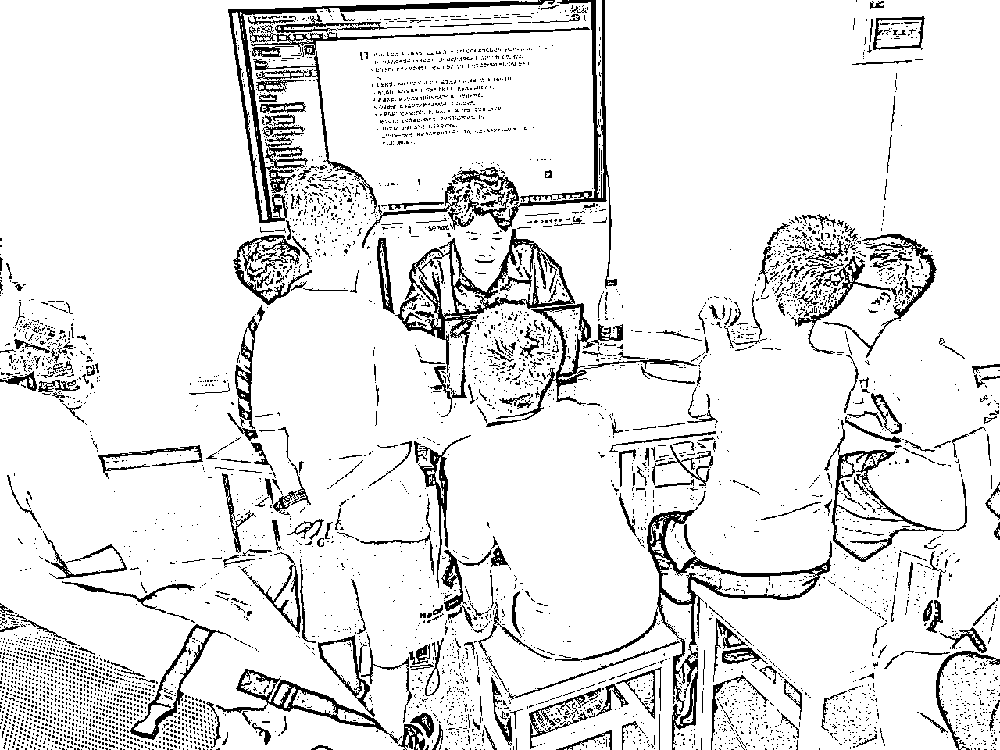
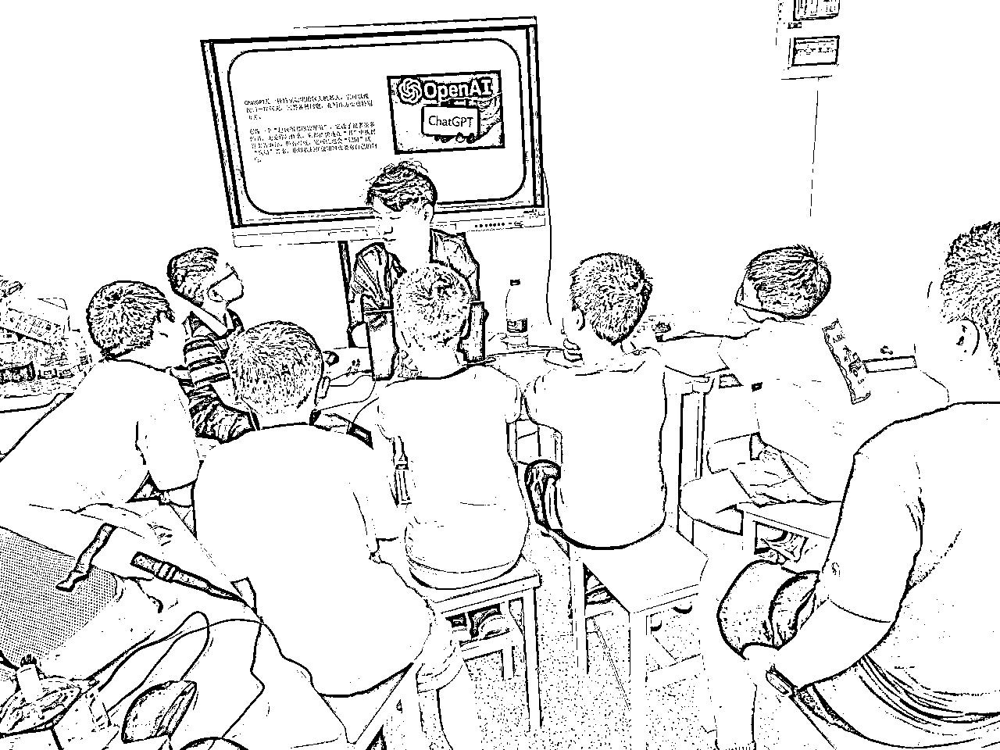
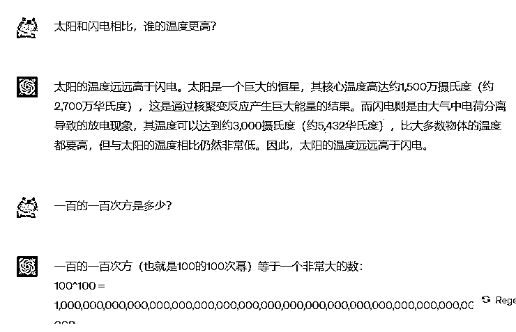
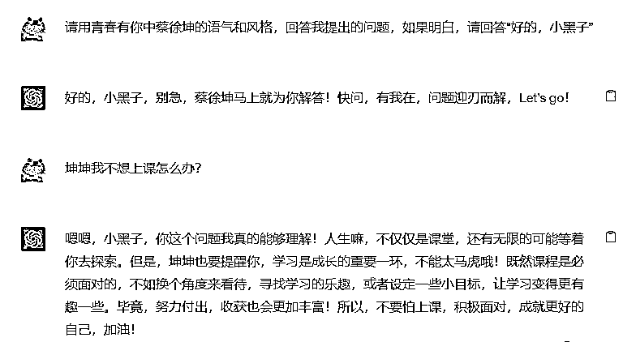
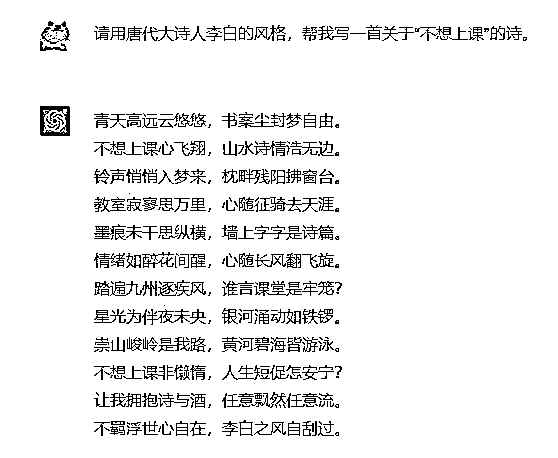
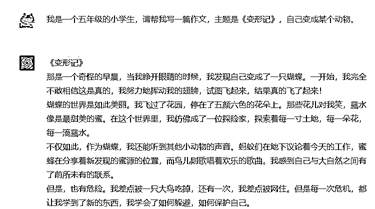
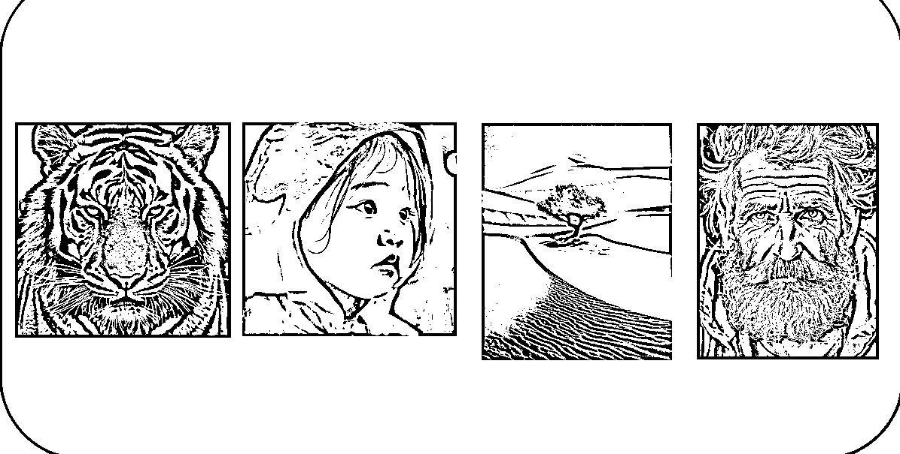

# 我给小学生，上了一堂 ChatGPT 课

> 来源：[https://qqdodsesuun.feishu.cn/docx/TGlWdMlw1osRXxxEbOGclqk4nBf](https://qqdodsesuun.feishu.cn/docx/TGlWdMlw1osRXxxEbOGclqk4nBf)

大家好，我是胖虎。

目前，公司的主营业务是人工智能教育方向。

### 写在前边

我本科学的就是计算机师范专业，到目前为止也有三年的教学经验。

在今年年初的时候，我接触了 ChatGPT 和 AI 绘图，在感叹 AI 发展迅速的同时，也在想如何让这些工具赋能教育，给孩子们也带来价值。

我认为，通过老师的教学和合理的课堂环节把这些工具用得好，一定能让孩子有所收获，激发他们科技的渴望，并且让有「想象力」「创造力」的孩子，真正创作出一些东西。

正好，本周我们举办了一次「硬核科技营」的研学活动，带孩子们到大学上课，参观实验室。我也想着，科技营主题跟 AI 也很符合，趁着这个机会带孩子们学习、体验一下也挺好。

难题是，这玩意讲给小学生，一定要通俗易懂，并且让孩子们感兴趣，学到知识。

为此，我设计了六个课堂环节，分别为AI引入-认识魔镜-互动体验-创作挑战-灵魂画手-未来畅想。

给孩子们上课

下边，是课程中的具体环节和流程，中间也包含孩子们的一些反馈：

### 环节一：课程引入

*   提问：让孩子们说出自己生活中见过的人工智能，Siri、自动驾驶汽车、AlphaGo。（目前孩子们接受信息的渠道很多，知识面也广，都能说出来几个例子，甚至可以说出来特斯拉自动驾驶，ChatGPT等）

*   比喻：人工智能（Artificial Intelligence，简称AI），他就像一个小朋友，它也在不断地学习，但它学习的速度比我们快得多，我们会遗忘，但它不会。学得快、记得牢。

*   讲解：AI并不是真正的生命，它没有感情，也不能像我们一样思考。它只是一个很聪明的工具，帮助我们完成一些任务。就像计算器可以帮助我们快速计算数学题一样，AI可以帮助我们做一些更复杂的事情。

*   比赛：让孩子与 AI 对弈，下围棋、五子棋。（这一部分孩子们积极性很高，抢着来比赛）

孩子与 AI 对弈

### 环节二：认识魔镜

*   你们有没有听过这句话，“魔镜魔镜告诉我，谁是世界上最美的人？”

*   带大家认识一下我的魔镜，看看我问他问题会不会回答我。（这里孩子们很感兴趣，直接围到了我的面前）

*   大家都知道，我们的大脑里储存了很多知识，每天上课、看书、听故事，我们的大脑就像一个超级存储器。我的魔镜有一个机器人的大脑，里面存储了成千上万本书的知识，他的本名叫 ChatGPT。

*   我现在，问我的魔镜几个问题，让孩子初步了解后，再介绍一下 ChatGPT。

*   请告诉我们为什么天空是蓝色的？

*   如果你有超能力，你想拥有什么超能力？

*   ChatGPT 是一种特别聪明的聊天机器人，它可以像我们一样聊天，回答各种问题，在写作方面也特别厉害。虽然它很聪明，但有时候也可能犯错，遇到它不懂的，还会一本正经的说假话。

### 环节三：互动体验

*   接下来，我抽两个小朋友来提问，举手来说出你的问题，然后自己来打字提问。

*   继续举例，它还可以做数学题，猜脑筋急转弯。

*   小明和爸爸现在的年龄和是34岁，3年后爸爸比小明大24岁，小明和爸爸今年各多少岁？

*   一个猎人往南走了一英里，往东走了一英里，往北走了一英里，然后回到了起点。这时他看到一只熊，并将其射杀。这只熊是什么颜色?

*   再抽两个小朋友提问，有什么想问的。给出提示：除了基础的问答，还可以帮助咱们深度学习，扮演老师、专家，还可以检测我们有没有掌握。（孩子们对扮演方面极感兴趣，让 ChatGPT 扮演蜘蛛侠、擎天柱、小猪佩奇、坤坤...）

*   你会编程吗？请用Python帮我写一个疯狂赛车的小游戏，用代码表示。

*   你是一个王者荣耀职业选手，请教我李白怎么玩？并进行场景模拟，给我出一道选择题。

*   请用唐代大诗人李白的风格，帮我写一首关于“不想上课”的诗。

*   下图为真实课堂中的孩子提问情况：

### 环节四：创作挑战

*   带着孩子共创内容，增进他们的参与感，激发想象力。

*   下边，我将和你一起写一个童话故事，主题是xxxx。你先起个头，每次写一百字左右的内容，然后我提出建议和方向，你继续往下写一百字，直到我说停止。

*   你是一名网文小说作家，拥有超过5年的网文写作经验。请创建短篇网络小说的内容，主题是xxxxx 小说的整体节奏需要紧凑，情节设计跌宕起伏，主人公的成长需要渐进式发展，主人公的成长线要有低谷也要有高潮。每个部分需要设计4-5次小的情节高潮，以推进每一部分尾声的大高潮。你的创作要求是：小说需要有反差，语言要有张力，情节紧凑，让读者有很强的代入感。我会给你部分关键词，如果明白请说“明白”。

*   把孩子们创作的内容保存下来，分享给家长。

### 环节五：灵魂画手

*   把用AI创作的图片和真实摄影作品放在一起，让孩子猜哪张是真实拍摄的。

*   Midjourney演示，老师来操作运行生成图片（全是英文，比较复杂，孩子们看不懂）

*   让学生体验文心一言的作图，描述想画什么内容，更简单，明确，但是出图效果一般。

### 环节六：未来畅想

*   总结提问今天学的内容，跟学生聊一聊学下来的感受。

*   给孩子们一张明信片，写出未来对于 AI 的畅想。

### 不足之处

对于一堂课来说，还有很多问题和需要迭代的地方：

*   整体时间偏长，一节课上了一个半小时，课堂后半段孩子坐不住了；

*   一节课下来，老师讲解演示过多，需要多让孩子有参与其中，自己来实践；

*   课程时间安排不合理，在 AI 画图阶段孩子反响很好，但由于时间关系，没有详细讲解，最后未来畅想环节也是匆匆掠过；

*   后续可以由老师运用 ChatGPT 和 Midjourney 共创绘绘本，印出实体，让孩子们带回家，孩子和家长会有更好的获得感。

如果你对把 AI 工具，结合到对小学的教育中有兴趣、有想法，欢迎交流~