# 小红书新手入门手册2023版【钱友会】

> 来源：[https://n5tg88533s.feishu.cn/docx/TjhydR8KGonbZ4xaDbNcT0TwnFh](https://n5tg88533s.feishu.cn/docx/TjhydR8KGonbZ4xaDbNcT0TwnFh)

手册说明

*   制作人：刘亮【钱友会】

*   更新时间：2023年7月28日

*   使用说明：本手册包含：账号注册、内容产出、引流手段、常见案例等，旨在通过本手册让大家快速入门，通过小红书达成自己的目标。

其他推荐阅读：

开始看本手册前，建议大家先认真思考下面几个问题：

1、现在做小红书还来得及吗？

无论是做品牌，还是希望通过小红书精准获客，或者说通过小红书直接进行销售，建议看了这篇文章后，马上入手。小红书的人群和属性，意味着客户质量和转化率都会比其他平台要高不少。

做得越晚，竞争对手越多，那么做得难度就会越高。

2、什么样的产品适合做小红书？

最初我也以为小红书适合做些化妆品、服装、母婴类产品，直到后来我做亚马逊培训，发现小红书上有大量的高质量客户，并且付费能力极强。

这才意识到，之前自己的思维窄了。建议大家不管做什么类目，都可以在小红书上进行尝试，会有意想不到的收获。

3、怎么才能真正做好小红书

想要做好任何一个平台，要做的第一点是：虚心学习，认真执行，多做复盘。

刚开始不用太多自己的想法，单单这个手册里的东西看完，已经足够大部分人做起一个账号了。先找竞争对手的账号进行1:1的复制，再慢慢摸索自己的套路，别刚开始就认为自己思维独特，非要走一条和别人不一样的路，很容易浪费时间。

## 一、小红书平台介绍：

### 1.1、小红书用户情况

根据小红书2022年数据显示，小红书有超2亿+月活用户，4300万+分享者，72%为90后，50%分布在一二线城市，男女用户比例已升至3：7；人均单日使用时长从2018年的26.49分钟上升至55.31分钟。

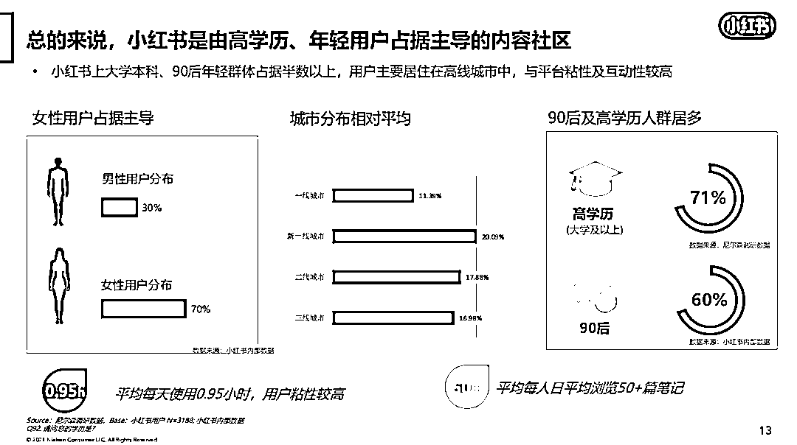

小红书总结了平台用户六大人群标签：Z世代、新锐白领、都市潮人、单身贵族、精致妈妈和享乐一族。63%是公司或企业机构等精英白领人群，在拥有稳定的工作状态下，其对应的消费能力也是较强的。根据官方数据显示，其月均消费支出能达到4.1K（不包含房贷，车贷）。

超过8成的用户表示在小红书上都被成功种草过，也就是通过引起了她们的注意和兴趣，从而影响购物决策到最后的产生一系列行动和购买等。

从2022年小红书的用户画像来看，年轻化、喜欢分享、消费能力强是平台用户的重要特征。

### 1.2、小红书类目情况

以下为小红书官方出品的六月份小红书各行业报告

## 二、小红书账号搭建

在正式开始运营小红书之前，一定要做的工作：调研+定位，先想清楚自己要做什么，目标是什么，要怎么做，然后再开始。在开始之前，最重要也不可省略的一个工作，就是调研。仔细查看小红书平台上，同行都是怎么做的，她们做的什么账号，发的什么内容、通过什么方式进行的变现。都一一列出来，分析后定下自己的方向，然后按计划执行。

当然，不用看到这里马上就进行调研，这个手册会把所有做小红书的细节都一一罗列出来，建议大家把本手册看完，再开始小红书的运营。

### 2.1、账号定位

开始之前，先认真考虑清楚，自己要通过小红书平台做什么？品牌宣传还是获客变现。不同的目标，将会决定你做小红书的每个细节。先别着急下结论，看完全部手册再开始。

#### 2.1.1、可以先通过工具查看各行业近期涨粉快或者行业榜单的账号和笔记

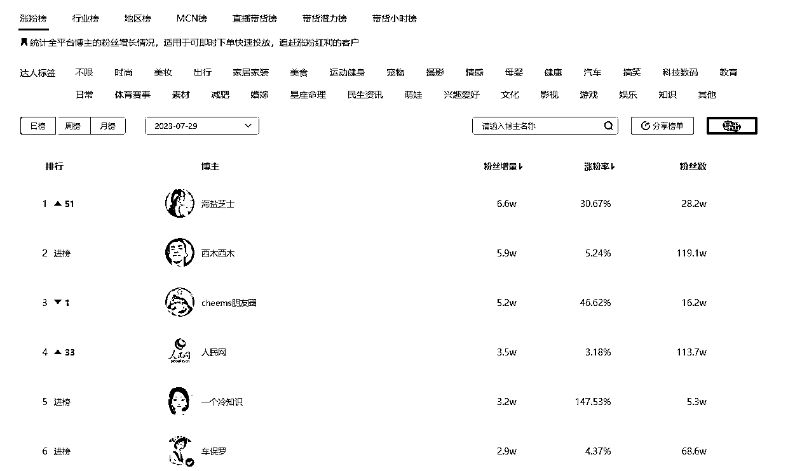

#### 2.1.2、自己拿手机上小红书，详细查看这些账号的笔记、评论、主页等等。

#### 2.1.3、以用户的身份，搜索用户平常可能会搜的词，查看搜到的结果页中展示的笔记和对应的博主。

#### 2.1.4、调研一两天后，这个账号的发现页也会开始推荐相关类目的笔记，再次查看这些笔记和对应的博主

注意：新做账号，不用考虑太多，找到对标账号后，先1:1的复制，尤其是很多人在发了第一二篇笔记后，发现没有效果就放弃了，做一个新账号，尤其是新手，先照着做一个月起。也不用有太多自己的想法，照着别人的热门爆款，一比一的复制（注意文字和图片不是照搬，而是将重要内容换成自己的再发）

#### 2.1.5、调研平台数据的工具

### 2.2、个人账号注册

1、需要一个可以接收到短信的手机号

2、一个手机号只能注册一个账号目前通过三大运营商和虚拟运营商的手机号进行注册。

3、个人账号无需实名可正常发文、评论等

注意：

三大运营商（移动、联通、电信），目前限制每个人每个运营商最多办理五张卡，部分运营商单月办卡数量也有限制。按一个运营商五张，每个人可以办理15张卡进行注册使用。

虚拟运营商就很多了，一个人可以办理上百张，资费也从0月套餐到5-30元不等，办理方便，不过很多虚拟运营商不能打电话，只能接受短信。

### 2.3、专业号注册

2.3.1、个人号直接升级，需要使用个人进行实名认证，或者企业实名认证。

2.3.2、直接注册，一个营业执照最多可以申请三个专业号，三个店铺。

2.3.3、专业号需要600元/年的认证费用

2.3.4、专业号认证通过后，可以开通店铺，直接在小红书内进行商品销售。

### 2.4、账号装修

先看做一个账号，要准备什么，下面是我新创建的一个账号，可以看到，由下面几个部分：头像、昵称、简介、瞬间、背景图。

#### 2.4.1、头像

用跟账号定位相符的头像，如真人照片、虚拟形象、企业logo等等。真人头像信任感会更足，也更容易在客户心中留下印象。

#### 2.4.2、昵称（七天内只能改一次）

小红书普通账号昵称可以和其他账号重复，一般比较常用的昵称为：名字+领域、地区+名字+行业。

具体根据自己需求来定，建议先在小红书上做竞品调查，选定好对标账号后，仿照目标进行设定。

注意：昵称如果违规被清除，需要等七天再改

#### 2.4.3、简介（七天内只能改三次）

小红书简介可以留邮箱，其他联系方式通过任何形式都不能留，前期建议不要放营销内容，整理好自己的优势、可以为用户提供的价值，确定无营销嫌疑后，放到简介中。

注意：简介在设置过程中不会有提示，但是会有个审核过程，在审核期间其他人无法看到简介并且无法修改。如果简介违规，则会清除所有简介内容，需要重新添加，并且修改次数不会返回。

#### 2.4.4、背景图

很多账号的背景图并没有进行设定，这个背景图是起个锦上添花的作用，当用户通过笔记，来到账号主页时，如果背景图不错，也能提高客户的关注几率。

#### 2.4.5、瞬间

很多人通过瞬间来进行引流，在账号主页可以显示五个瞬间，之前有很多在瞬间中留微信号的，小号可以尝试，大号不建议直接留V。

## 三、小红书内容制作

在制作内容要先了解笔记有哪些部分，及每个地方的作用。下方为搜索页和发现页的界面。

大家能看到的最主要的为封面、其次为标题，再其次为账号的名称和头像。

这也就决定了各个板块的作用：

封面+标题 = 有多少人会点到笔记详细查看

标题+内容+评论区 = 有多少人点赞、收藏、关注、评论互动

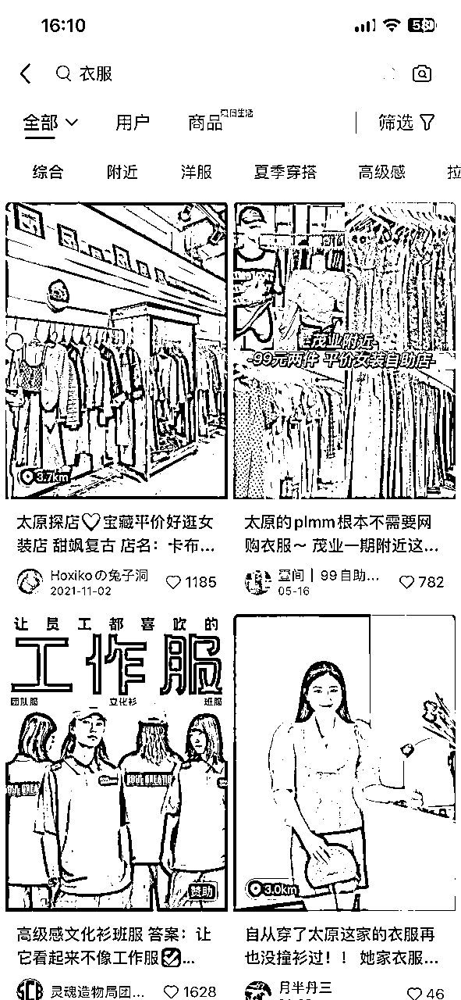

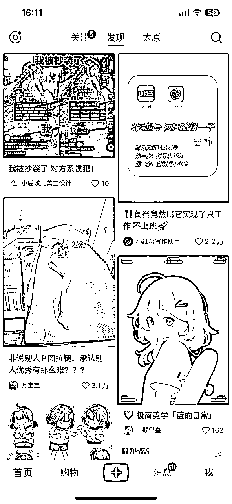

接下来详细说明下每个板块的制作和注意细节，

### 3.1、关于标题

先来几个最基础的常识：

#### 1、小红书的标题最长为：20字，在发现页和搜索页展示的标题字数为：20字

#### 2、如果笔记被收录，标题中的关键词会被搜索到，而且是模糊搜索，即关键词不需要完全匹配，也可被搜索，其中第二篇标题中只命中一半关键词，但是笔记内容中包含了对应的关键词，所以也会被搜索到。

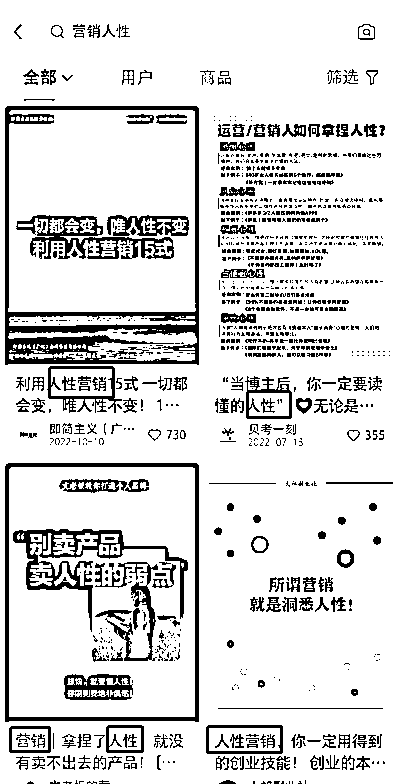

#### 3、笔记爆款公式

爆款标题公式有很多，随便一搜一大堆，说的都差不多。这个是18年的知乎上一个关于标题的分享，比我想要表达的要详细很多，建议仔细阅读。

怎么写出牛逼、震撼、极富人性的标题? - 知乎

### 3.2、关于内容

#### 3.2.1、内容效果

先说内容可以达到的效果：

1、涨粉

2、获得客户线索

3、成交

4、种草

以上目标大部分小红书笔记只能得其一，我们经常会看到很多笔记有几千点赞，但是评论和涨粉却可能不到100，也会看到一些笔记，点赞不到100，评论却能轻轻松松上千。而这样的差异，就在于笔记本身的选题、内容及引导上。

随便找了一个在小红书上的护肤品品牌，下面是出现这个品牌的两种类型笔记：

1、产品种草（品牌宣传）

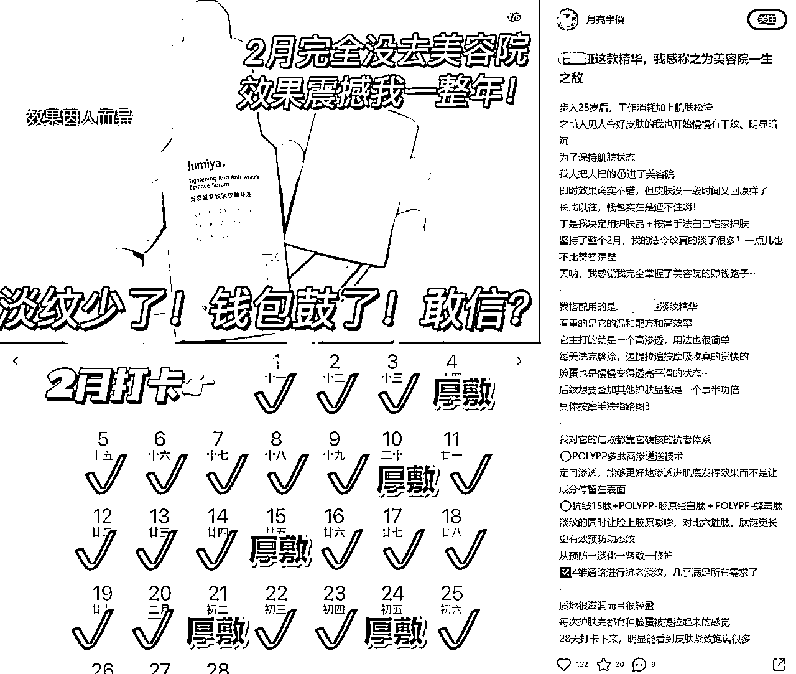

2、产品低价成交展示（获客变现）

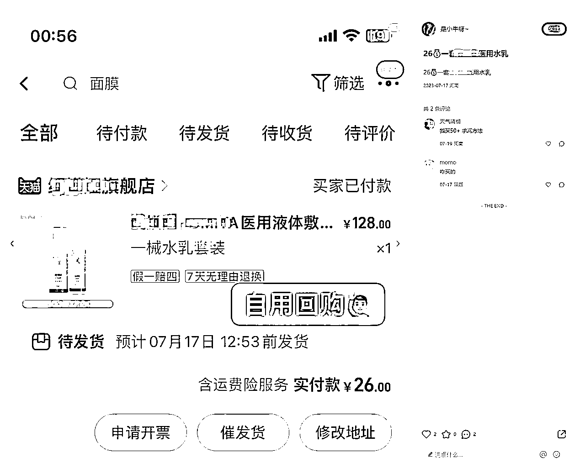

##### 第一种：品牌宣传

目标：以展示产品效果，宣传品牌或者具体产品为主。

适合人群或企业：有自己的品牌或者产品

使用账号：一般为KOL、素人账号（粉丝不多，没有太多影响力）等非品牌官方账号

变现方式：无法通过笔记直接变现，一般以曝光为主，内容为核心，用户被种草后，可能会通过淘宝、京东、微商等各个平台进行下单购买。

笔记内容：要求质量高

##### 第二种：获客变现

目标：吸引目标用户群体到自己的私域变现或者入店成交

适合人群：大部分人群军适合

使用账号：素人号、品牌账号、kol账号等都可以进行，一般会同时起10-100个矩阵账号做，以便于快速获取流量。

变现方式：引流到私域或者通过小红书店铺变现

笔记内容：根据行业不同，难道有高有低，一般可以进行矩阵化操作

以上是简单以实际的笔记发布目标常见的两种类型，其实还有第三种类型，目标既不是为了品宣、也不是为了获客，而是单纯的做热点或者用户喜欢的内容，来获得流量和粉丝，这种内容做自营账号时，也可以发一些行业相关的，对于账号权重提高有很多好处。

做内容之前，先考虑一下自己这篇笔记想要达到的目标是什么？

#### 3.2.2、笔记内容结构

一般我会把笔记的内容分为：开头+内容+结尾+标签

开头：痛点（目标吸引人们不划走，继续看下去）

内容：做IP的可以加个人介绍，不做IP的直接上干货

结尾：引导评论区互动、送资料

标签：通过标签获取平台推荐及自然流量

至于内容具体怎么写，这个在小红书上做的同行最有发言权，在小红书上找到对标账号后，仔细研究下她们的账号和笔记架构，1:1的复制就行（内容一定要改动一些）

#### 3.3、关于封面

说实话，虽然小红书封面很重要，但也不是做的好的才能爆，有很多爆款笔记，或者说达到效果的笔记，可能封面做的一塌糊涂。

所以，关于封面做的要多漂亮，我就不提了。我只提一点：突出。

那时候做电商时，对美工说的最多的一句话就是：字体再大点。

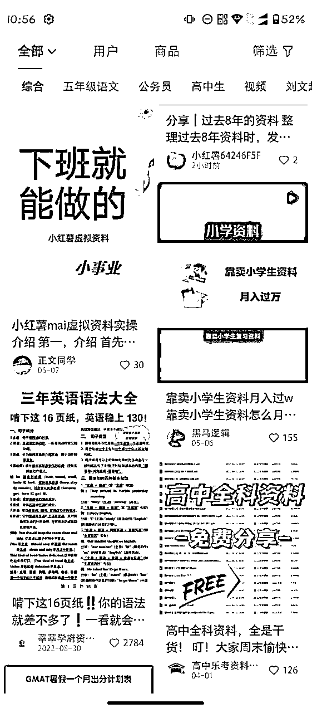

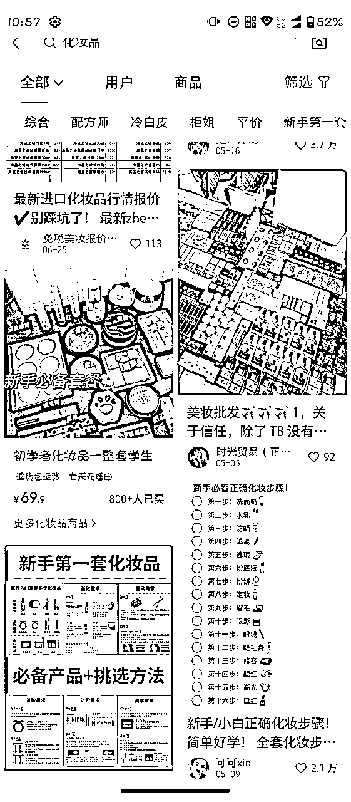

#### 3.4、关于评论

评论区是很多人容易忽略的地方，一般如果自己做品牌软文，可以找小号以用户角度做一些引导，其他用户会很自觉的排队。

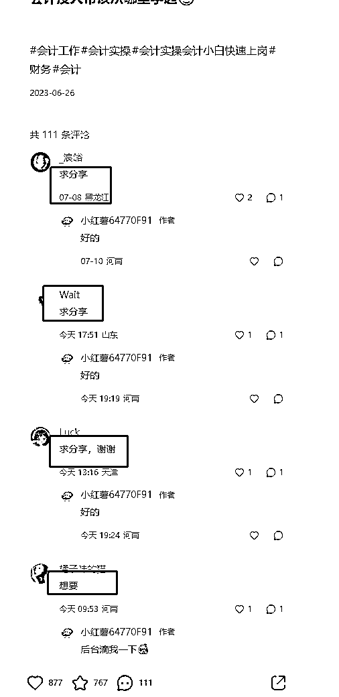

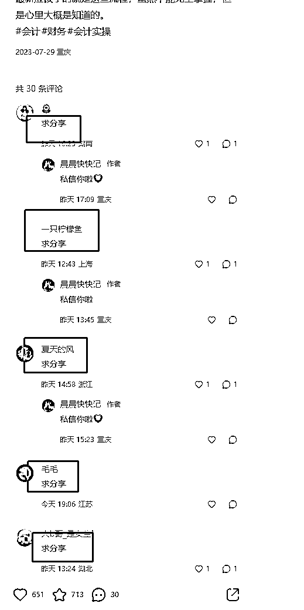

#### 3.5、关于选题

选题好，就成功一半了！在做一个账号之前，应该知道，有些笔记或者有些账号，是永远爆不了的。

比如下面这两种，点赞不超过100，评论量却可以超过200，甚至500。而且评论区清一色的全部是精准客户，咨询报课相关。

对于培训机构及部分客单价较高的产品，可以使用这种方式来进行精准获客，之前了解过一家培训机构，整个公司据说上千名员工，全部都是通过这种方式来做小红书账号进行获客。

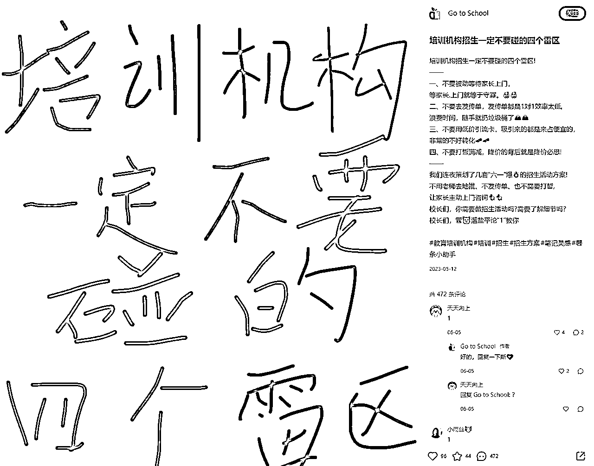

点赞：96，评论：472

点赞：41，评论：130

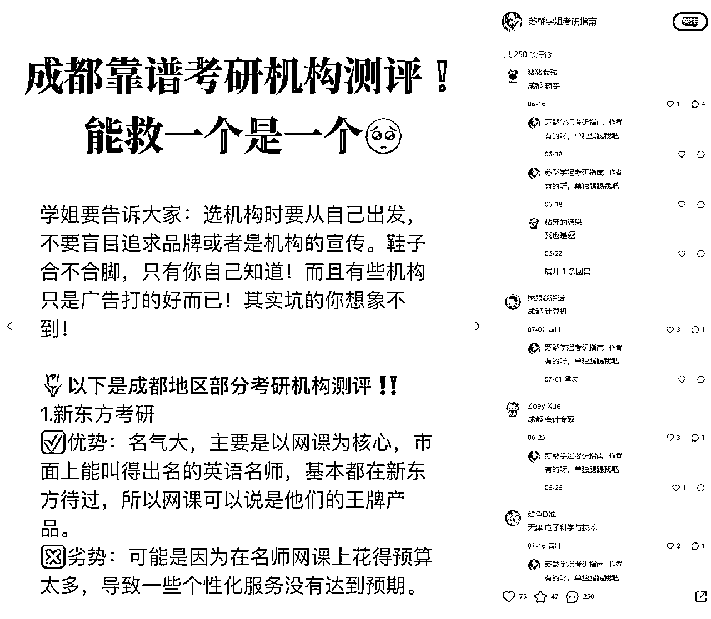

点赞75，评论：250

除了这种精准获客的选题外，最常见的就是业内知识科普，这样的笔记容易爆，点赞量和粉丝量都可以快速提上来，但是缺点是：来的精准客户很少。

我们自己做的账号，一个300多万播放的视频，还不如1000阅读的图文笔记带来的客户多。

所以，在选题时，要知道这个主题预期能达到的效果，以及该如何进行操作。

举例：

第一种机构推荐类的，文章质量要求不高，吸引客户精准，最适合的方式就是做大量的矩阵号去获取流量。

第二种知识科普类账号，做的目标就是为了曝光和流量，内容上就要多下功夫，同时要在主页、评论区内做好引导，尽可能的吸引目标用户完成进主页关注或者入群等动作。

选题的方式：

1、通过上方给的数据平台，查看最近热门的话题、热搜词、最近数据好的本行业的笔记，根据主题进行修改和创作。

2、根据之前收集过的同行的爆款笔记选题，逐个输出（之前曝光的，有几率会再爆）

3、根据用户反馈、近期行业内热点痛点进行输出

## 四、小红书常见的引流方法

1、瞬间引流（在瞬间发联系方式，有风险，大号慎重）

2、评论区@自己的小号 注意小号名字，很多带营销的名字，发出去后，别人看不到。

3、评论区留小红书群（需要在小红书群公告中设置引流方式）

4、简介@ 自己的小号 （简介中的小号可以直接点击进入）

5、将小红书群关联到自己发的笔记，进群后引导到私域

6、小号发布微信号笔记后，用大号收藏小号的笔记

7、在发布笔记时，笔记中可以@ 自己的小号

8、评论区引导用户：关注+私信领取资料

9、小红书店铺商品封面放联系方式，引导用户从商品查看联系方式。

10、小红书号改为微信号，然后在简介或者瞬间中引导添加小红书号

11、合集名称改为微信引导，合集需要把账号升级为视频号才会出现

12、专门拍一个引导视频置顶，视频教大家怎么联系，注意不要带联系方式等违规内容，以防举报

13、私信索取联系方式，对方留联系方式违规几率降很多（基本上我这边都要求用户主动留）

14、企业号添加线下门店，在主页中可以展示出线下门店页面，可以看到电话和地址

15、评论区图片中留微信号、公众号（需要多做图进行测试，直到可以展示出来为止，并且还要定期查看引流图是否被屏蔽）

注意：

1、笔记、评论、私信都不要出现二维码、微信号等联系方式，有时候能出去，但是对方看不到。

2、评论区大量回复评论容易出现违规，导致永久禁止评论。（尤其是同样的回复文字）

3、一个账号一天主动向非粉丝用户私信最多5次（所以要引导关注）

4、私信中留联系方式容易违规（可以通过分次发号、图片等方式降低风险）

5、企业号有官方会联系付费，然后说可以私信再留联系方式不会违规，是真的。

6、评论或者回复的内容，用其他账号查看展示，很多有营销嫌疑的内容会仅发布人可见，且无法提示。

## 五、常见问题汇总

#### 1、做小红书需要准备什么？

一个没封过小红书号的手机，一个手机号

#### 2、做小红书需要花多长时间？

可长可短，前期调研和定位花的时间比较长，在稳定之后，可能一篇笔记半个小时，甚至几分钟就能出一篇。

#### 3、做视频还是做图文？

看想做的账号类型，想做行业IP，个人倾向于视频，做引流或者矩阵，图文产出效率高些。

#### 4、随便雇个人可以开始做吗？

执行的人或者老板必须得有一个懂规则和愿意花深入研究账号运营的，要么就雇个懂的管理或者顾问，否则就是浪费时间和钱。

#### 5、什么行业都可以做吗？

小红书的用户属性是70%女性，30%男性。女性用户的产品会相对好做，其他行业也都可以尝试。尤其对于部分高客单价的行业，一个月成交几单可能都把成本挣回来了，为什么不做呢？之前做亚马逊培训时，我也没想到小红书上报课的人那么多，而且比抖音、知乎之类的平台转化率高很多。

#### 6、做小红书能赚到多少钱？

看所做的领域、看执行力、看商业模式，小红书上有很多闷声发大财的。

#### 7、做单个账号还是做矩阵号？

建议刚开始都先从单账号开始做起，一个账号运营没有问题，并且模式可以复制的话，有多大实力，就做多少矩阵。据说一个做专升本的培训机构，一个公司上千人每个人做几个小红书引流，一年流水上亿。

8、

## 六、各行业可参考小红书案例

更新中。。

我是刘亮，培训机构市场负责人，专注线上营销获客

微信号：374858161 （添加备注：小红书）