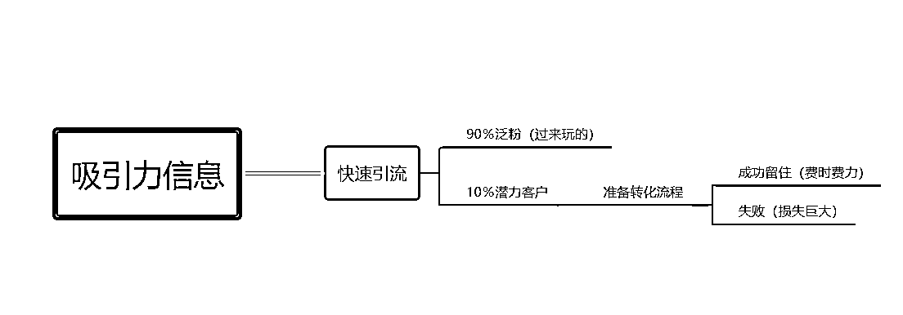
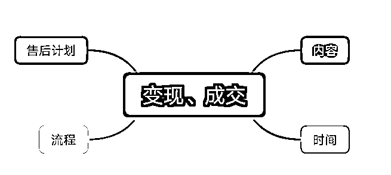
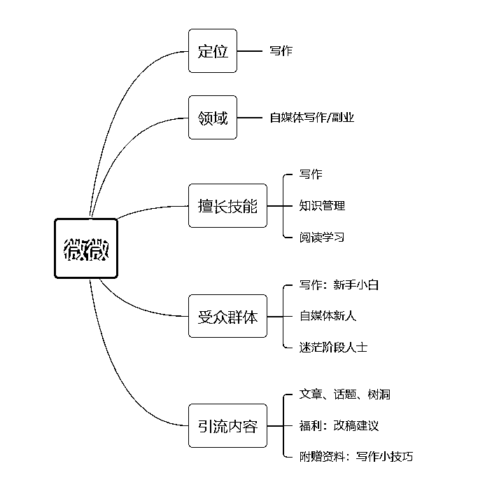

# 「个人IP」分享共读，超级努力才能看起来毫不费力

> 来源：[https://eqc9f6vzuhv.feishu.cn/docx/U3bAdhzjIobEytxXIiVcbnndnGf](https://eqc9f6vzuhv.feishu.cn/docx/U3bAdhzjIobEytxXIiVcbnndnGf)

# 一、前言

辰风昨晚的分享有4点内容：持续引流、持续输出、持续链接、持续服务。

表面的理解可以看字面意思，深入的理解则是需要透过现象看本质，即针对于以上的每一个动作进行类似于「洋葱模型」的抽丝剥茧。

也就是：我是谁，我有什么，我能给你带来什么，你能在我这里成为什么。

表面看起来很简单，其实这是一道选择题，它通过简单的寥寥数语在筛选人群，这也是为什么有些人能做成「个人IP」，而有些人只能模仿表面，始终未能获得亮眼成绩的原因。

敷衍的态度，不专业的行动，得来的也只会是“四不像”的结果，还不如从0开始把知识点学透再实操。

接下来，微微将对昨晚的学习进行个人的感悟分享，希望能够对你有一些启发。

# 二、正文

## 01.持续引流

也许不少人对「引流」这个词仍然存在一个较大的误区，所以咱先说明这个词表示什么，它的核心关键在于哪里，能通过它做成什么事情。

### 1.大众所认识的表层：

引流指的是把具有吸引力的信息，放在曝光量较大的地方，所以最好的做法就是告诉他们在这里能够轻松赚钱，然后获得奶茶自由或是零花不愁。

看起来没有问题，实质上却为自己埋下了一个坑。

最常见的问题，初期做自媒体的各位小伙伴都有遇到过，那是接连不断出现直接要钱、后台信息轰炸、各种变相（头像）从你这“偷”福利的人群。

事实证明，这样的引流方法，是可以吸引到流量的，但同时也证明，你的出发点是错误的，为什么呢？

#### （1）没有主心骨。

没有按照「我是谁」这一中心点出发，单纯为了流量而付出时间、精力、金钱。

这是一个典型的陷阱，前期虽然我付出的金钱不多，但是却耗费了我巨大的精力、时间，而且吸引而来的粉丝也需要到第二阶段进行过滤。

如果是团队运营的情况也许可以调配，但是对于一个人运营的情况，如果你不属于“卷”的类型，一定会很快被流量的冲击造成崩溃。

（我当时最高的记录是一天收到72篇稿子，而我的引流信息中带有“改稿建议”...你可以想象一天还没改完第二天又来几十篇稿子的情况。）

没有主心骨的引流：

吸引过来的流量完全仅靠“能够赚钱”、“奶茶自由”等信息而来，属于不稳定的链接因素，所以剩下来的10％，如果没有过硬的转化手段，大概率是竹篮子打水。

#### （2）没有相关联的内容。

从以上的思维导图中可以明显发现，主打的就是一个“快”字，的确是一个非常速度的引流方法，但同时也是一个让你越走越偏的方法。

一开始没有清楚地剖析自己，没有为自己量身定做定位、领域及引流目的，即使能够通过简单的信息去吸引接连的流量时，你也会忽视一点非常重要的因素：无法变现、无法成交。

初期这些流量都不熟悉你，对你几乎没有信任可言，如果要走到变现这一步，最基本也要做好这4点的基础准备。

典型的“先甜后苦”类型。

### 2.正确的引流内容：

综合以上，我们可以得出，引流的重心在于内容，主要组成部分为定位、领域、相关联的产品，也就是「我是谁」。

要想在引流之后，能够通过轻交付的转化流程把流量留住，先把基础打好非常必要。像是以上的做法，毫无疑问便是前言所说，模仿只在于表面，浪费心力。

确保持续引流的精准、稳定，首先我们要做好以下的准备:

#### （1）了解清楚「我是谁」。

相信仍然有不少小伙伴对自己的定位和所处领域是模糊的，以至于在引流的时候也是人云亦云，比如来来去去都是摘抄、图片、错别字。

基本上吸引而来的粉丝群体，90％都是为了薅羊毛，并没有多少个愿意留下来看你的文章内容，所以后期的转化，无论用标题吸引、福利赠送、招聘助理等，都不会在短期内形成有效粘性。

这也就是我们需要先把自己“确定”下来的原因：唯独把自己了解的足够透彻，你才能发现自己有什么吸引人的地方，才能找到真正因为“你”而来的读者。

比如微微，定位是写作，领域是自媒体写作副业，所擅长的地方是写作、学习、知识管理，我想吸引的人群是想要学习写作的新手小白，或是刚入场自媒体圈的新人，或是想要读书学习实现个人成长的迷茫人群。

这是最基本、最简单的模板，也是我们做好持续精准引流的必备理念，备好“心法”，“打法”才能稳。

#### （2）告诉他们「我是谁」。

仍然是按以上的例子说明，我们持续引流并不是为了单纯的流量，这样在中间过程埋下越多的坑，在后端也就是在制造定时的炸弹，你永远不知道它什么时候会让你出现崩溃的一角。

前言说的非常明确，不专业的行动很容易给你带来不必要的麻烦，也会造成多次返工，没必要，流量大也许能够帮助你飞跃，但流量少且精准才能让你稳定的奔跑。

这也是为什么很多人粉丝少，但是变现强的原因，像是小可爱的公众号粉丝也还没破万，但是变现能力就非常强。

因此，持续引流的核心是不断认识新的朋友，而我们要做的动作就是不断思考「我是谁」，以交朋友的角度、心态去引流，让来者第一时间消除陌生感。

同样按照以上的例子，所以微微现在的引流都是以投稿文章、话题树洞为内容，吸引而来的也是写作类的人群，虽然每天需要不停地改稿，但符合我的定位。

你只要刚开始下了苦功，才能不用面临返工、补漏、多种矛盾的过程，要做长期的，一开始就要把基础线打牢。

## 02.持续输出

这里也是一个坑，不少小伙伴都会误以为引流而来之后，只要坚持输出关于自己的内容就可以了，事实上这是“聪明反被聪明误”的表现。

微微年初接触自媒体的三个月，日更三个月，得到的是日更100天的成绩，还有卿久老师训练营的优秀学员，除此以外，没有任何成绩。

盲目输出、盲目分享，并不能给人带来太大印象，也就是会出现最刺痛个人IP内心的经典一句：你是干嘛的？

我很同意辰风所说的，一定要学会通过多个平台、多个社群提升自己的曝光度，输出干货价值让自己不再透明，但具体而言，或许新手小白，是听不懂的。

因为我也经历过，所以在辰风的分享下，再细化具体化巩固这个知识点：

### 1.人设

在持续性分享的前提下，一定要紧紧围绕自己的【人设】进行，它是综合了你的性格、节奏、定位、领域、成绩等形成的个体。

通俗一点来说，也就是你的个人介绍。

通过给自己打标签的形式，以自带独特性的分享内容在各个地方输出，才会让人印象深刻，有留下“啊，那个人是干这个的”的印象。

人设最主要是能够为你带来清晰的标签，不至于在拥有相同定位的芸芸人海中，你显得如此的平凡、无存在感。

个人介绍需要列明的东西，也就是辰风所说的：了解受众群体，你能提供什么资源，有需求就有成交。

但你可以融入一些你的人设因素，比如在分享中多提几句，像是微微，就有提到：我想以新人的身份，再创造多一些不平凡的成绩。

### 2.利他

这可以说是持续输出的核心了。但仍然有人一直搞混了这个核心内容，单纯的“利他”是自嗨式的输出，而极致的利己，才能输出利他的内容。

简而言之，当你没有那么多知识储备、没有那么多价值内容的时候，就要学会先行利己，提升自我，增值自己，要不然你的分享，很快会面临内容干涸、价值走低的局面。

这里有几点建议可以让你做好利己的储备，可以依据个人的特性去安排适合的方式：

#### （1）阅读当下实效性的书籍，不断增加知识储备。

那么该如何挑选书籍呢？其实最关键的不是一夜暴富的成功学、也不是从0实操的专业书，而是现今眼前你最迫切需要改变的书籍，你得扭转自己陈旧、过时的观念，才能更好地接受其他新事物。

我给你介绍几本改变思维的入门级书本，一定要记得看喔！

①《精进：如何成为一个很厉害的人》

②《戒了吧！拖延症》

③《逆转思维》

④《有钱人和你想的不一样》

⑤《世界顶级思维》

⑥《如何成为一个会学习的人》

人是永远赚不了认知以外的钱的，只有把自己的认知刷新，扎牢扎实符合新时代自媒体的思维，才能持续分享出高效“利他”的实质性内容。

#### （2）虚心求教，多去接触高质的上级圈子。

高维可以吊打低维，但是低维永远干不过高维。要能够持续分享他人能够接受的高价值内容，首先就不该长年混迹于下层圈子，你可以向下链接，但不应该在下层扎根。

所以一有机会，就要不断去接触各类圈子的优秀人群。也就是去请教比你更优秀的人，只要能力允许的情况下，我都建议你可以付费咨询、付费进入社群、训练营等，摒弃之前圈子里的侃侃而谈，接受他人的批评与建议。

你只有接触的圈子多、优质，见识到更多上层人群的思维模式，才会懂得如何把自己的学习心得、学习经验、干货内容分享给在你之下的小伙伴，形成“利己”转化为“利他”的正循环。

#### （3）关注不同类型的新闻、政策，时刻留意圈内的动态信息。

这是一个关于“信息差”的知识点。就是别人知道的，你不知道的，别人掌握的，你没有掌握的，别人能运用自如的，你只能大放厥词的，那当你要获取这个资源、信息的时候，你就必须付费去得到。

或许资源可以逐步积累，但是信息却不易获得。可别以为在如今的网络时代，比起以前能够更容易获取信息，其实正因为信息化太快，所以内里的杂质也非常多：比如谣言满天飞。

想要较为精准地获取想要的知识、信息，最好的方式是养成持续关注官方新闻、官方政策的习惯，从中提取出对自身事业发展相关的因素，再配合圈内的动态消息进行灵活改进、纳为己用。

#### （4）尝试向0基础的新入场小白分享。

有一个词叫做“试错成本”，也就是你付出了金钱，时间，精力，感情去尝试、去实行，但没有得到有效回报的结果。

所以，当你只是拥有60分的水平时，不要着急向30分、50分的人群进行输出，着重挑选0-20分之间的人群进行尝试，在不断收到正反馈的同时，利用授课经验去迭代优化自己的内容，再转向另一人群分享。

如辰风所言，陪伴群是一个非常好的传授点，我们不一定需要重交付，可以按照自身的“分数”去进行每一天的持续分享，或是承诺所做到的交付。

即以负责的态度去踏实做好每一次的分享。

## 03.持续链接

### 1.保持谦卑

这是一个破除“安于现状”最简单的方法，也就是让你打开链接前的准备，即不要正常的娱乐、不要正常的放松、不要正常的休息。

正常的娱乐＝旅游耍乐、游戏、无效交际（包括但不限于这三项）

正常的放松=追剧、闲聊、刷视频（包括但不限于这三项）

正常的休息=周末睡懒觉、放空发呆（包括但不限于这两项）

时刻保持谦卑的心态（也就是：我还差得远呢），没有基础的时候狠打基础，没有成绩的时候狠狠学习，做一些“超越正常”的努力。

比如把娱乐时间换成阅读学习（精华帖、风向标中标合集），把放松时间换成技能学习（修图、剪视频、写作），把休息时间换成对群里分享内容、学长学姐们的指导的深度思考、反复研究。

做到了这一步，你才能在短时间内获得较为明显的成绩，也就能手拿资源，更有底气的与他人链接，为他人提供力所能及的帮助。

### 2.主动给予

在第一点的实操下，基本上在1-2个月内我们都能拥有各自掌握的技能，同时也有着不少的输出内容，关于这一点，当我们没有过硬成绩的时候，便可以通过整理这些内容用作链接的桥梁。

前期无须在乎「见面礼」的大小，只要是你输出的内容，你分享的干货，其中一定有值得学习的细节，可以摘取其中的内容，打包成1-3份文件，在链接他人、引流的时候主动提及。

这种第一印象，不仅在为你营造一副积极、友善的正面形象，而且也在为你筛选不值得交流的人群，具体可到群里研究一下七七姐的“自媒体社交礼仪”。

持续有效的链接，前期准备、见面礼、社交礼仪都必不可少。

## 04.持续服务

这个在反复学习辰风的加餐分享下，我似乎明白到了团队的重要性，分工明确能让你做到更多更好的交付，但一个人也能做出持续高效的服务。

关键点在于「流水线」。

持续服务难在起步阶段，我们可以预测大部分用户的下一步动作，但是无法准确把握每个人的动作是否一致，因此很容易出现各种矛盾的声音，即反馈混乱。

一旦中间的过程出现类似于这样的卡点，个人的交付效果便会大打折扣，比如顾得了今晚的分享顾不了回应其他用户不一样的反馈声音。

所以，如果你也是和微微一样，一个人在运营的情况下，不妨打造出适合自己的流水线：

（1）建立陪伴群前夕，准备好至少半个月的分享内容。

（2）一人饰演几个角色，分别是讲师、资料官、材料员、售后服务，各自对应主要分享内容、收集群内的疑问以及感悟反馈、持续准备好干货价值及分享内容所需素材、针对差评进行及时处理等工作。

（3）把以上的角色分别安排在不同时间段，从而有效集中精力，一次做好一件事。

（4）利用闲暇时间去对标参考他人的社群，及时汲取经验进行优化迭代。

把每一个过程以流水线的工作模式去做到面面兼顾，确保持续的服务得到有序地进展，同时也能够在时间推移下，持续性地升级。

一个人的状态下，也要尽力把口碑和服务做起来，提升影响力。

# 三、文末寄语

### 公布一个彩蛋哈：

目前我也仍在打造个人IP的路上，一路上艰辛是难免的，但有句话应该要收纳于心：我们都没有天赋异禀，所以都要懂得翻山越岭。

加油ヾ(◍°∇°◍)ﾉﾞ~