# 《用【钩子打法】1年引流30000私域粉，卖课300w是什么体验！（附钩子制作全流程）》

> 来源：[https://b16xnqwk20.feishu.cn/docx/UqEwdWkaKo1Y8cxsU4NcLbrsnre](https://b16xnqwk20.feishu.cn/docx/UqEwdWkaKo1Y8cxsU4NcLbrsnre)

全文6300字

推荐用时：6min

各位新老朋友大家好，见贴欢喜，我是宋老师

过去的1年，我用钩子，加到私域3W精准粉，总计变现了近300W

# 成绩👇

下面是抖音学浪的销量（3600+）单，还有一部分（10000+）是小鹅通私域成交的

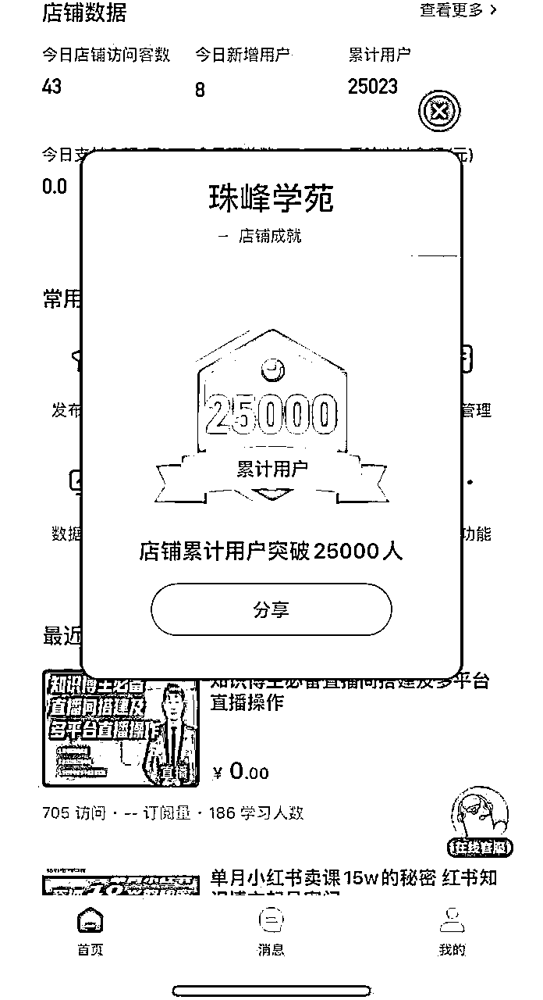

我是宋老师（账号叫宋老师帮你做课），全网粉丝15w+，多个矩阵号。很多抖音、小红书做知识付费的小伙伴可能知道我，我花了近1年的时间，从0-1成长为做课卖课赛道的头部博主。

简短的自我介绍一下，便于大家快速知道我的价值

我的四个标签：

1.目前自媒体头部的做课&卖课博主→流量能力

2.原来的新东方总监，最高记录同步管理80w学生社群→教学能力

3.6000多位知识博主的老师→成绩

4.很多百万博主背后做课的男人

如果你一直抱怨你没有流量没有粉丝没有客户，其实，本质只是你没有专属的“黄金钩子”

今天我将把我们1年引流30000精准私域的【钩子打法】分享出来

主题主要有以下这么几个版块：

1.【道】1年靠钩子公域薅30000私域是什么样的体验

2.【法】如何一天做出 5 个加粉钩子，加爆你的知识IP微信☆☆☆

3.【术】钩子生产秘密流程，如何高产 出钩子？☆☆

4.【器】做好的钩子往哪放，会自然来流量☆

再次很感谢大家支持，有机会能在生财分享，然后之前在大航海里面分享过三次。7月底和8月初分享了做课和私域的玩法

感兴趣的圈友可以看一下

《用Chatgpt 7天做了一套课，单月卖了1300单（变现52w）》

《30天私域卖课60W是什么体验》

# 一、1年靠钩子公域薅30000私域是什么样的体验

现在每天我们平均能够加到私域的好友大概有个小 100 个，都是通过这些精准的钩子，我们做过很多，做课宝典、卖课宝典、直播间话术等等，现在每天就有很多人通过这些钩子来找到我们，想去获取一些资料内容

无钩子，不私域

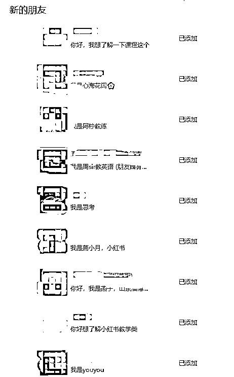

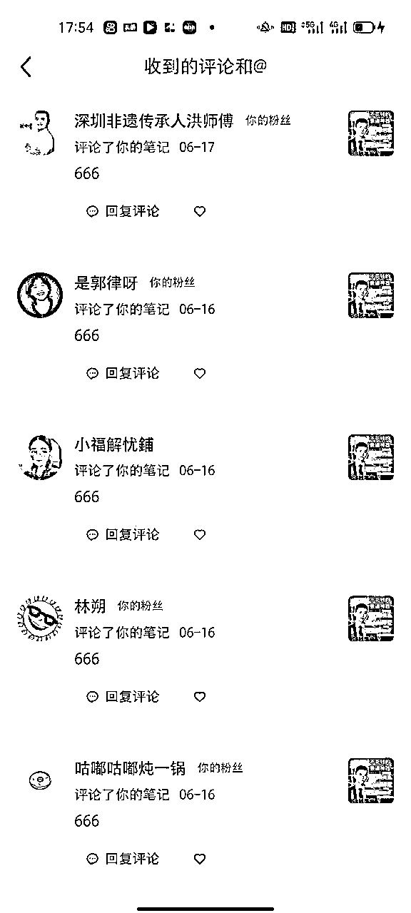

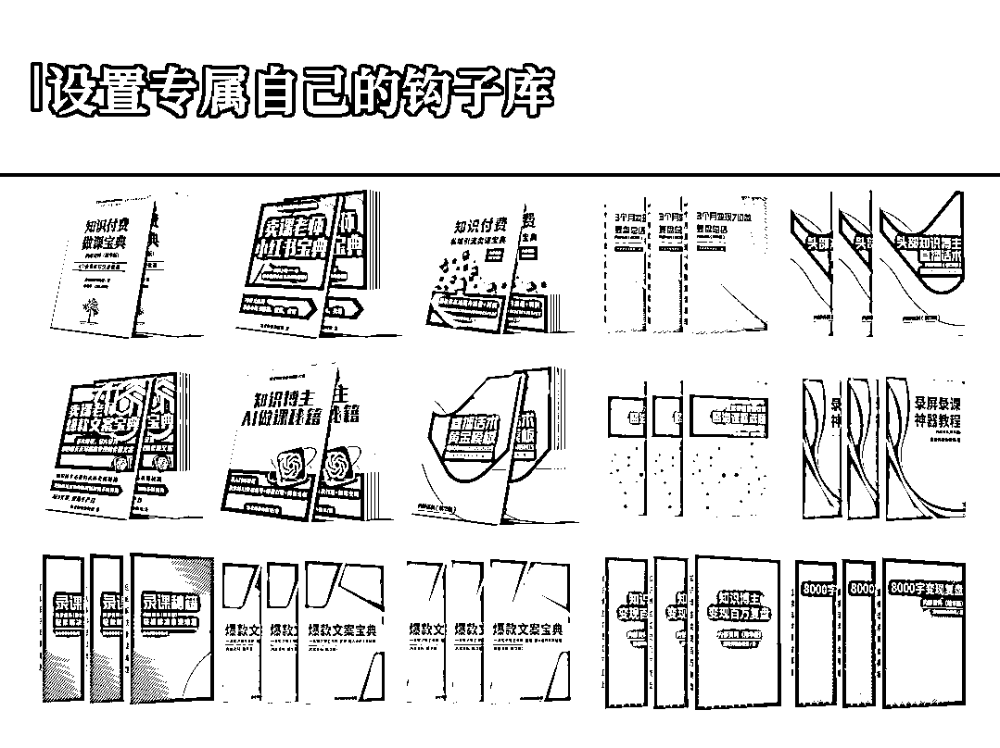

## 一、什么是钩子？

大家记住，钩子就是你在短视频或直播中给用户种下的一颗心锚，这个心锚慢慢在他心里面发芽生根，所以他就会越来越想要你这个东西，想要就必然产生私信→私信之后就可能产生信任→信任之后就可能产生成交，所以这是以此类推的过程。

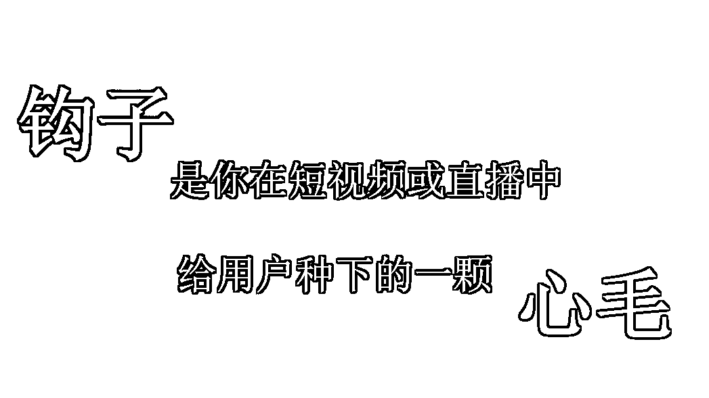

那么什么是好的钩子？

你这个行业里面最痛的那个点就一定是好的钩子。比方说你是做美业的，那么美业的获客引流宝典或者美业的团单宝典，这就是最痛的那个点。

小需求做钩子，大需求做课程，

你要把那些需求拆细了，你的行业里面经常别人问哪些问题，问多了这就是钩子，这就是别人常问的一些痛点。

那个痛点到底值不值得做课，你要去思考，如果它的内容很小，你就做个钩子，吸引更多的粉丝来就可以了，如果做强做大的话，它还可以帮你裂变。

## 二、为什么要做钩子？

很多老师可能理解不了，就是为什么我们辛辛苦苦搞了很多东西，写到了文件里，发现最后人家粉丝一要你就给了，然后我也不做任何动作。

做钩子是成交的第一步

你想想如果你的同行没有个钩子，你有钩子，你可以用钩子跟你的粉丝在私域去聊天的话，那么其实你就有了更多的机会去触达这些粉丝和学员，你也有了更多的机会去跟他去推销课程，去说你的课程的好处，说你课程的痛点。

设计钩子的核心是你的视频发出去之后，别人找到契机找你聊。如果你的文案密不透风，完全都没有机会，他跟你去私聊，产生聊天

我们很多学员其实过来并不是为了找我要资料

我算过，我们加 50 个人里面大概只有 20 个人会提资料的事儿，剩下那 30 个人都是有问题来问我

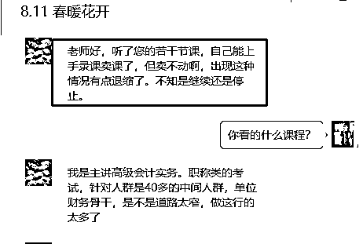

然后我们咨询给方法。反而那些要资料的人都很难被成交。那 30 个不要资料的人，他们特别好成交，因为他们的目标不在于要资料，而是在于链接这个老师的人。

我们能够快速在做客这个行业里面快速崛起，其实跟钩子有了必不可缺的关系，因为我们给粉丝创造了福利，所以粉丝和学员回馈我们就买了我们的课程。

这种就可以打成C标签了👇，可以不断的朋友圈触达。标签的内容，大家可以参考之前私域的玩法

30天私域卖课60W是什么体验

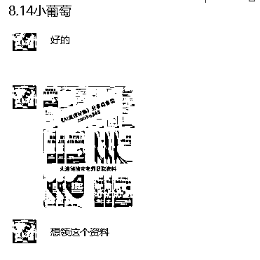

## 三、做钩子的 3 个好处

### 第一个，增加引流的效率

如果你单靠卖课，把课程买过课的学员引到私域的话，这样效率太低了。可能你一年卖个两三千份课，也就加两三千个人，但是如果你做钩子的话，一年可能加两三万个人不止，所以你把人加到私域之后，我们之前讲过，私域是你一生的财富，你可以通过不停地触达他朋友圈影响、私信影响、群影响

它可以看到你很多不同维度的广告，可能是你人设的，可能是你自己产品的，可能是你生活的，它就会对你这个人的认知会更高一点，更立体、更全面一些

如果你想学习群的玩法，可以来我的群看下

### 第二个，修建私域的护城河

如果你的行业里面运营的打法还没有太全面的话，我建议你做客户。因为很多人思考不到这个点，所以他们不愿意更多的把好友导到自己的私域里面，也不愿意自己那个好友号那么沉重

如果你不在乎这些，专门注册一个你的好友号，然后天天的把这些粉丝导到这个好友里面，那慢慢的随着时间的推移，你的私域流量池会越来越大，当有一天这个平台的红利不在的时候，你也可以有在私域做一门生意的能力和底蕴。

下图👇只是我其中一个微信号，友情提示，尽量不超过5千好友，不然会看不到朋友圈

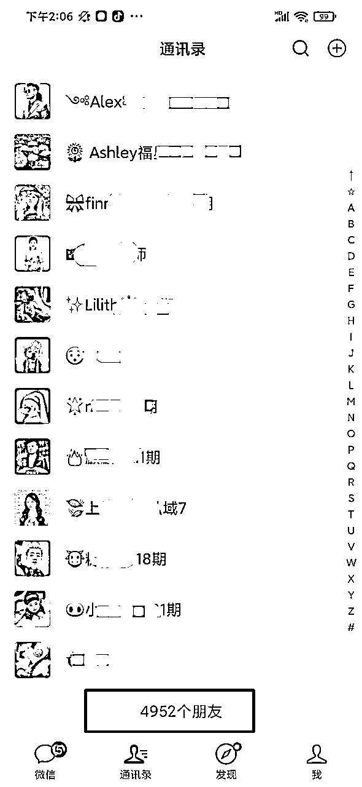

### 第三个，为转化助力加码

就是当你把粉丝成功地在私域备份一遍的话，通过钩子把他们引到私域之后，其实也是有帮助给你去做转化的赋能的。

其实很多客户看到了这个书，其实往往比课还重要，因为很多人觉得听课的效率比较低，看书会更快一点，所以我们就做了这样的钩子去做吸引我们的学员，包括吸引未报名的。

我发现很多大博主有一个毛病，就是他只把干货写进去，但是并没有把自己的广告和人设写进去。包括我们看完他的资料之后发现这个人写得很好，但是我不知道他卖什么产品，也不知道他这个人是干啥的，所以这种钩子是很失败的，所以大家记一个金句

好的钩子等于广告，不等于干货。

这是我这的私域引流卖课宝典的钩子广告，大家可以看下，这个是在资料结尾出现的

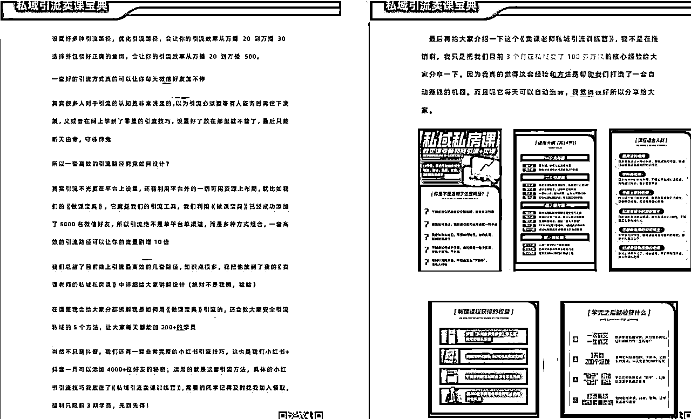

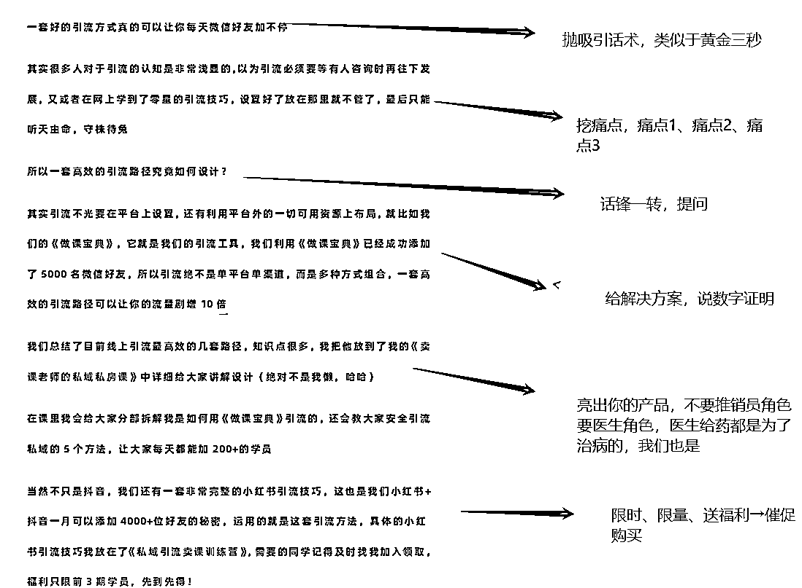

这是我的做课宝典中的，加广告的部分，有需要模板的，可以多聊

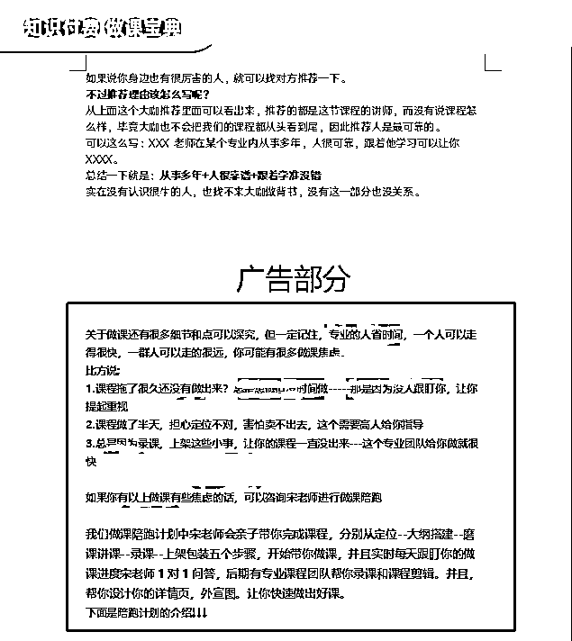

就是你要在钩子里面干湿结合，你既要讲干货，也要讲一些湿货，湿货就是你的广告，你的人设，你未来要做哪些事情，你的愿景，让粉丝看了你的这本钩子之后，他立刻能读懂。这个人是什么样的，他未来要卖什么产品，他都对你有了解，后面你在推课的时候其实就很顺利。

这个就是老师看到钩子之后，买的课程（实例↓↓↓）

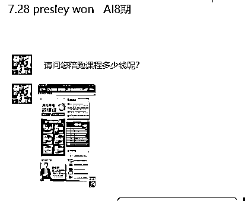

# 二、如何一天做出 5 个加粉钩子，加爆你的知识IP微信

如何快速高效地设计钩子，我们有了一套完整的方法论，希望能够跟各位老师去分享，让你能够更快更好地做出专属你的钩子库。

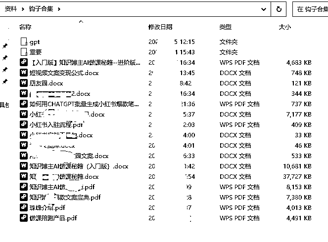

现在其实我们做钩子做了很多，比方说卖课宝典、做客宝典，包括直播间话术，包括团队成员的绩效表等等。这些我们大概做了有几十个品类的钩子，目标都是为了把我们的意向客户和意向学员尽可能地加到我的私域里面，让他在私域感受我的专业度，感受我的整个的课程的产品的好评等等。

所以我们如何快速做钩子？如何让粉丝能够源源不断地去找你？是这个钩子设计的核心环节。

## 第一步，选择适合自己的钩子

### ①资料类--资料是目前这个钩子领域最常规的打法

因为资料它有可复制性，而且编辑成本很低，所以它可以做好一份，它可以反复发，无限地发。

在封面和标题凸显资料好处，或者说你这个标题能够占据一个品类。要用宝典、秘籍攻略这些包装性的词汇，把你的这个资料钩子尽可能地用一个很响亮的名字说出来。

比如说我的《做课宝典》《卖课宝典》《直播间话术》

### ②短时咨询--粉丝量很低，缺少案例可以使用

如果粉丝量大了，不建议。小的时候可以，你可以做个 10 分钟，不要太长时间做咨询，这样可能会消耗你的精力，消耗你的时间，而且往往结果不尽人意

### ③低价小课--9.9或者19.9的引流课

粉丝可以报名参加你的课，或者参加打卡营都可以。目标是为了让客户见到你的专业度，二是为了去转高价的课程。这种的好处就是做了初步的筛选，人群相对精准，但是售后困难，认知低。

下面是我的一个低价课，感兴趣的老师可以进群体验

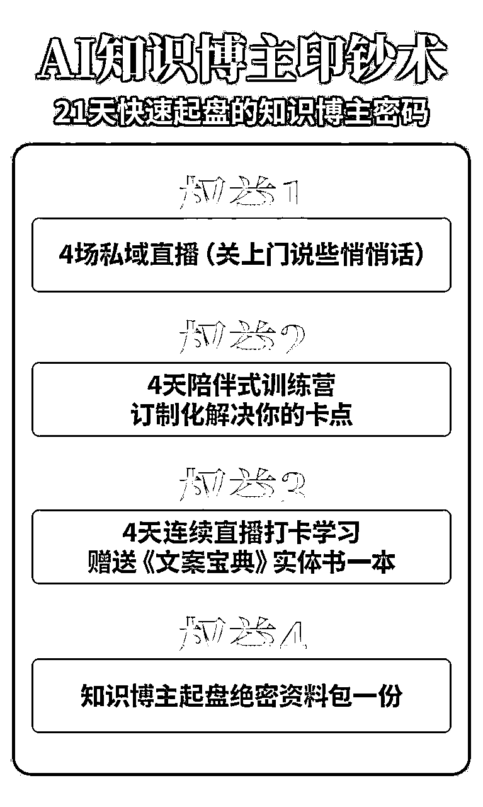

如果你前期起号阶段的话，你可以送咨询和小课。如果你现在已经粉丝量有一定的数量，我不建议送这两个，因为这两个价值感很高，可以后面再升高价课的时候会用。

## 第二步，用引发好奇的名字做包装

钩子的名字价值百万

宝典、秘籍、攻略、全案、大招、锦囊这些词，它是有天然的包装性。名字一定要短，尽量要好听，做课宝典、长高宝典、引流宝典，变富宝典等等，这些都是一些比较好听的，听起来就能快速抓人眼球的东西。

因为它是免费，所以你尽可能把这个名字做得大而全，然后好多客户都能进来，通过这个钩子吸到你的私域里。

那么接下来我们给大家鉴定几个规则，不要超过 7 个字，然后最好要设计一个相对来说好看点的封面，比方说字大一点的封面，让它用户在拿到这个宝典的时候，他能轻而易举地看到这个宝典的重点是什么

如果你没有技术老师的话，你可以直接去创客贴、快设计去，直接搜手册封面，直接去自己设计就可以了。流程还是比较简单的。

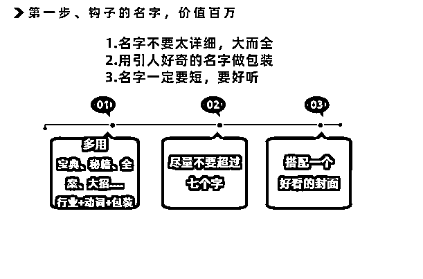

可以分享几个常用的钩子

【宝典、万能、颠覆式、xx公式、xx真经、xx大师、xx手册、xx天书（人性天书）、xx为王、xx风暴、解码器、xx密码、xx指南、失传的xx、绝学、策略、xx高手、无所不能我的xx、世界上最伟大的xx、之道术法器等】

## 第三步，让每一个钩子成为你的宣传册

钩子的目的不一定是全放干货，用户的目的是吸收干货，我们的目的是在吸收干货的同时，我要给予你广告，所以你要尽可能地给他讲讲你的产品跟你链接的好处，你能给他提供的价值，以及你未来他可能需要什么样的产品，你都要给他讲清楚。

所以不是硬广，是要软广，要轻度植入到这里，那当然这里面我们会有格式，后面会给大家分享一些格式的具体模板

让你的每一个钩子都成为你的宣传册。

我给大家三个方法。

### 第一个，犹抱琵琶半遮面法

比方说我在我做课宝典里面写了，你不会做详情页，不会写大纲卖点，那么我做好课的课会有这个具体的卖点和内容。他会感觉你讲到某一刹那间突然进广告了，跟看电视剧一样

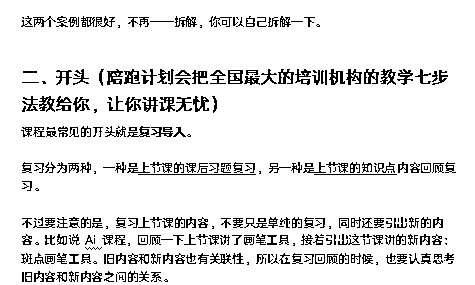

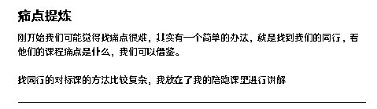

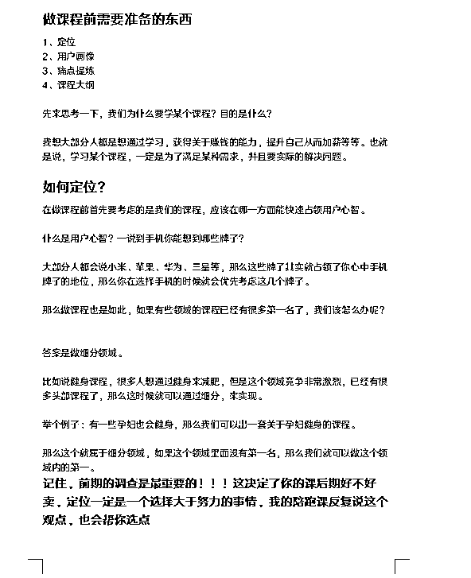

### 第二个，插入自己的学员案例

比方说你之前服务过谁？这是我的学员案例，感兴趣的老师可以看下

http://s.xlb-growth.com/0Sfcm

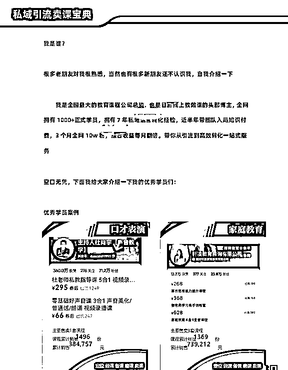

### 第三个，硬广一定是穿插到中部和尾部的

你不要再开头加硬广，首先让他觉得他收获到了干货，其次让他再看广告，他会心满意足的

我们一般都是文案中有钩子，但是广告，一般都是二三十页和结尾，做穿插

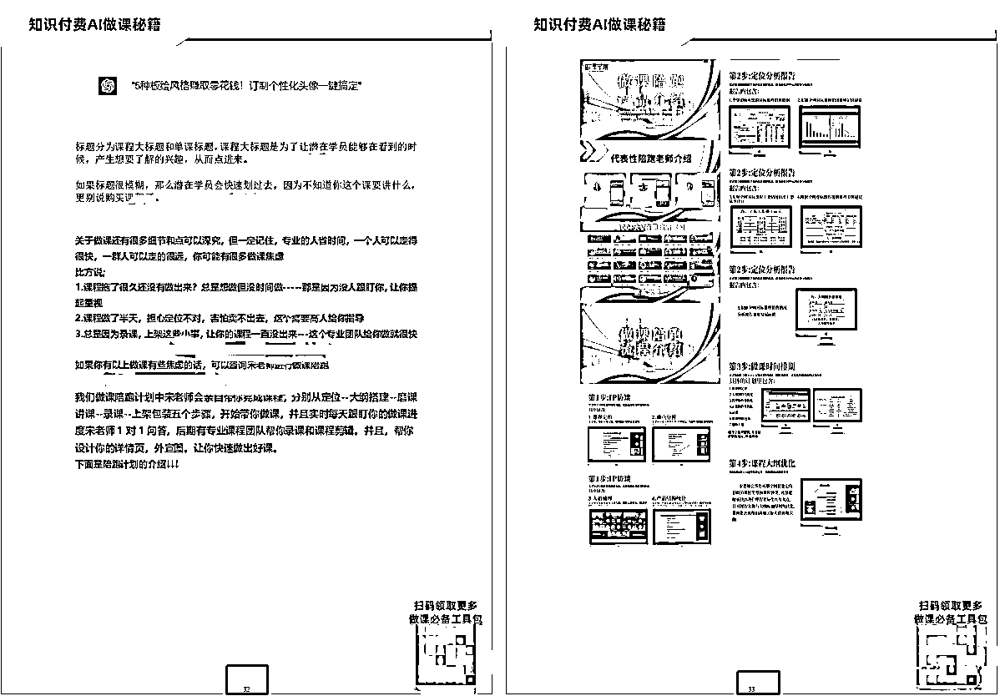

## 第四步，设计一个让人偷不走的钩子

因为现在盗版后同行抄袭还很厉害，包括现在小红书所有的做课博主 99% 是抄的我的宝典

### 第一个环节，设置密码

但是这个密码是防君子不防小人的，有很多网站是可以破解的，但是我建议大家还是要设置一个密码，至少它破解的时候会比较麻烦。wps就可以

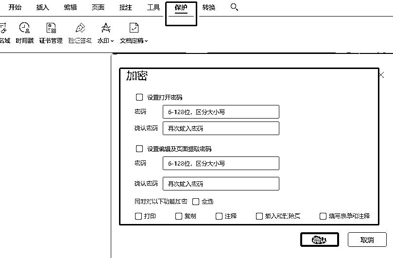

### 第二个环节，设置水印

我建议大家去用图片水印，这样他们在如果想偷走你的钩子的时候，其实他们还是很麻烦

统一钩子里面的结构和字号，和字体，和排版和水印

这些象征了你的专业度，也象征你对于一件事情的认真劲，所以字体字号我建议大家可以去用阿里巴巴普惠体，这个是不侵权可商用的。这个字体包我为大家准备好

### 第三个环节，设置学员案例

你一定要多加一些学员案例，把案例融到你的宝典里面，因为这个案例是你自己的，如果他一旦把你的案例摘走之后就明显的侵权。

然后如果大家这个钩子发的比较多的话，我建议大家申请一知识产权，这个我们申请了，所以我们后续这些同行在扒我们的钩子的时候，我们都会有相应的这个法律的保护。

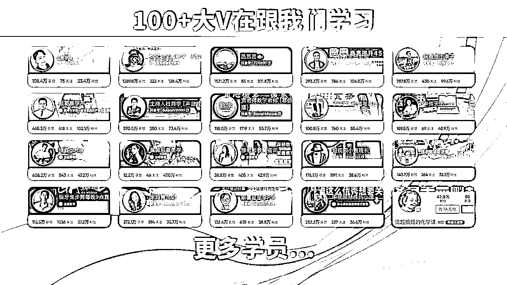

## 第五步，做一个持续流传的钩子

这个就是根据老师们的能力去选择了，有很多老师把钩子就当做一个公转私的引流工具，但是其实钩子还有一个很大的好处就是去做裂变，让你的钩子能够源远流传。

转发朋友圈，送钩子，纸质版的书效果更佳

总会有几个看盗版课的人，加到我的微信，就是里面加了二维码和钩子

篇幅有限，不做过多介绍，有需要的老师探讨

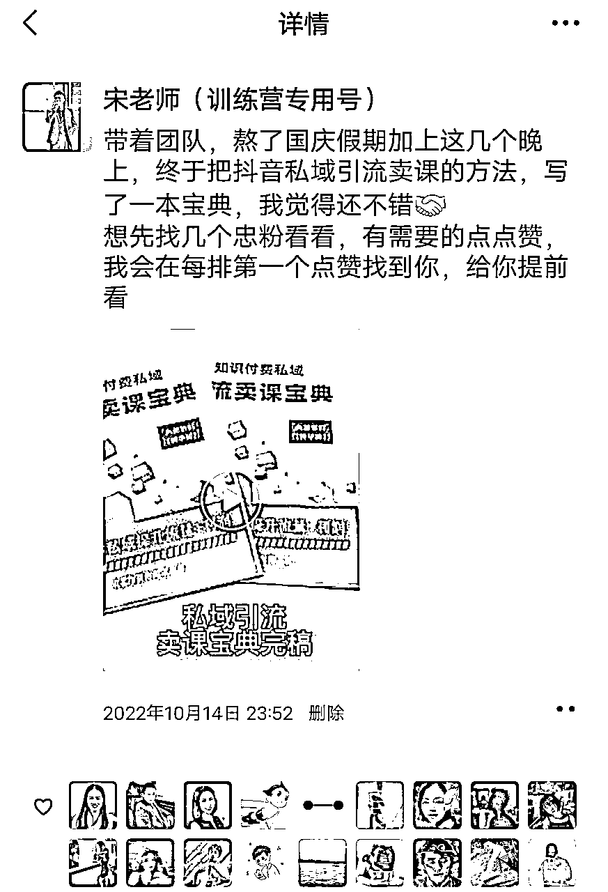

# 三、钩子生产秘密流程，如何高产出钩子？

其实送大家一句话，模仿是最快的成功。很多人想创新，其实你在创新的过程中，你的同行已经把真谛给你检验出来了，所以你不需要去太多的创新。你前期说到的是高精度的模仿，然后在模仿的基础上去加入你自己的元素，加入自己的认知就可以了。

大家相信我的一个点，我们在做钩子的时候，有一个东西比智商重要，就是搜商，搜商是大于智商的。什么叫搜商？搜索的能力，相信我，这世界上目前有个知识已经被人做过一轮了，所以你再去原创，再去自己辛辛苦苦去敲，去写的话，其实效率很低。

所以我建议大家尽可能先去搜索一些资料，你可以优化别人的内容，再去结合你自己的一些认知去打磨你的钩子，而不是说一定要从 0 到 1 去原创，毕竟这个东西说实话它是以免费发的，你没有必要把自己这个免费东西搞得特别累。

但是你要加入自己的认知，但是基本的东西很多原理性的内容，你可以去找一些资料，结合你自己的认知修改一下。

搜商大于智商

高效＝优化≠原创

所以高效产出钩子的三大步骤给大家简单讲一讲

## 步骤一，全网收集素材

比方说你要做一个长高宝典，或者说我们之前有一个学员，他要做的是一个 3 分钟看透一个人，通过手相去看人的课程。那么我当时给他建议是你要去全网去搜一搜，其实这种课程其实很大众，他可能当时觉得他做这个课程很小众，但是其实这个课程目前是很多人在做，很多平台也会有。

建议去微信公众号、知识星球、百度、拼多多、小红书、知乎、豆瓣这些去搜一下这些平台里面，有你需要的一些文章的内容，包括文案的内容，包括视频的内容，你可以整合一下，结合你自己的想法和思考，把它们融到宝典里面。记住搜索技巧是由大到小，一点一点去搜，换不同的关键词。

还有一个方式找博主看同行的就行了，或者搜索大博主的资料，去搜私域里面最大的人，他现在一般都会有钩子

我们如果去做自媒体平台的话，很多，比方说抖音某书这些，你可以去搜一搜对标的博主，他们会有很多引流品的内容，但是他们的引流品跟大家讲 90% 不是原创，所以大家这个里面很多都是在借鉴相关的原理，只不过融自己的案例而已。

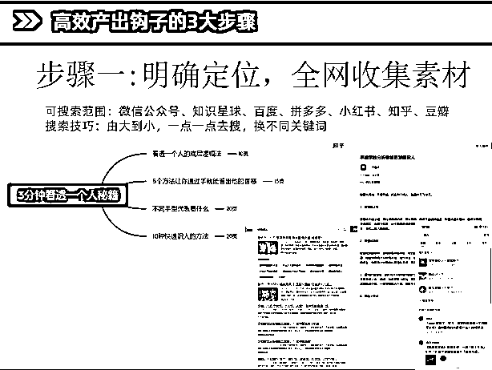

## 步骤二，整理填充

当你整理好了你的钩子所有所需要的资料之后，你把它放在文件夹里面，然后打标签，这是我当时我做做课宝典的一个文件库，这里面有所有各个平台的一些做客的资料和内容，然后我们去学习、去整理、去分享、去内化。

我当时写的《做课宝典》里面基本上 90% 都是原创，就是我当时第一个锤子产品，我想做得好一点，但是我会去吸取别人做课程的流程的一些经验和方法，在这个过程中我的学习效率是非常高的，

而且我自己感觉学习完那些钩子之后，我的能力提升也提升了一个档次。所以在是做钩子的过程中，也是自己充分内化和提升的一个过程。所以你一定要去坚守把这些钩子里面的内容，把别人家的内容内化成你自己的，这才是一个很核心的能力。

下图是我当时做宝典的时候找的资料👇

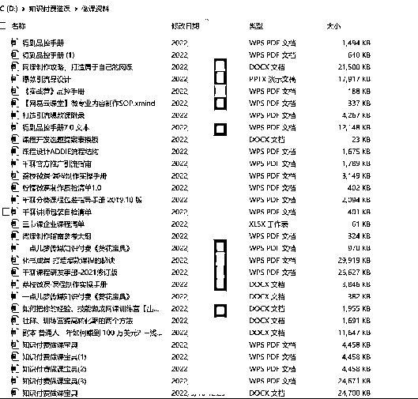

## 步骤三，删除侵权内容

因为这个东西是免费的，其实它不存在商用侵权的问题，它就是其实免费分享的，你不商用不卖就没事。但是你要把别人的一些什么案例，包括一些想法，包括 logo，你尽可能的去做处理，一定要去规避相关的风险。

在干货基础上，你加点自己的广告，加点自己的收获和得当，会更好一点，会更快一点好

原理加上你自己的认知才是这个钩子最终版本的完整版

60% 的原创+ 40% 的借鉴最好

# 四、做好的钩子往哪放，会自然来流量（用钩子布下天罗地网）

大家把这几个分别记下来，你做好的钩子要用起来，用不起来要遍地撒花，遍地结果，遍地带来流量，遍地给你造成效能和转化。

## 1.简介区

大家看我的抖音小号，写了一本《闪电做课秘籍》可以送给你，还有合集处也可以

小红书还能@助理号，助理号留钩子，可以明显

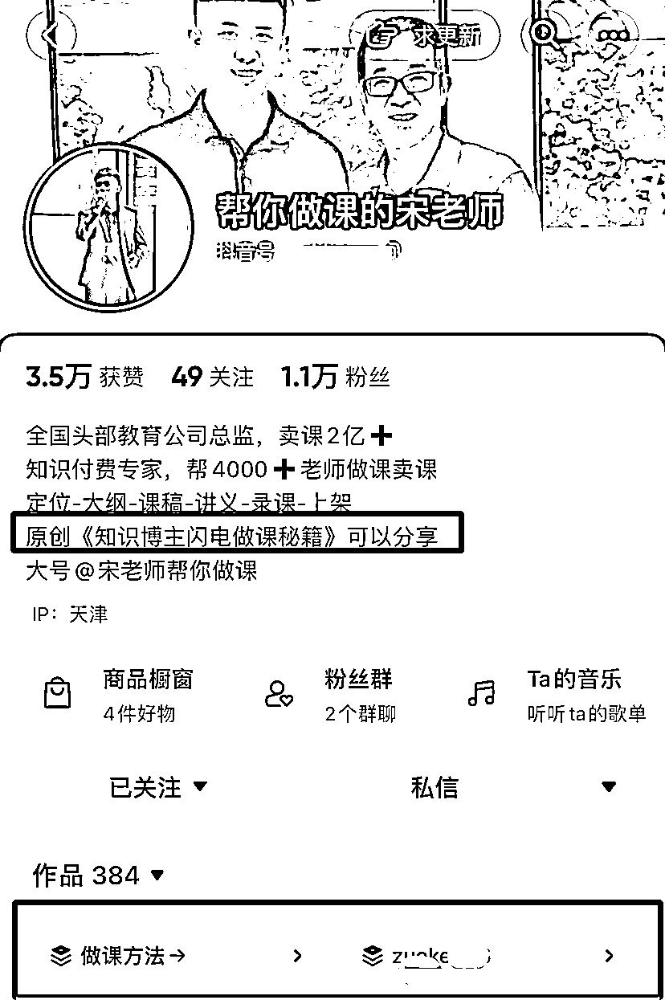

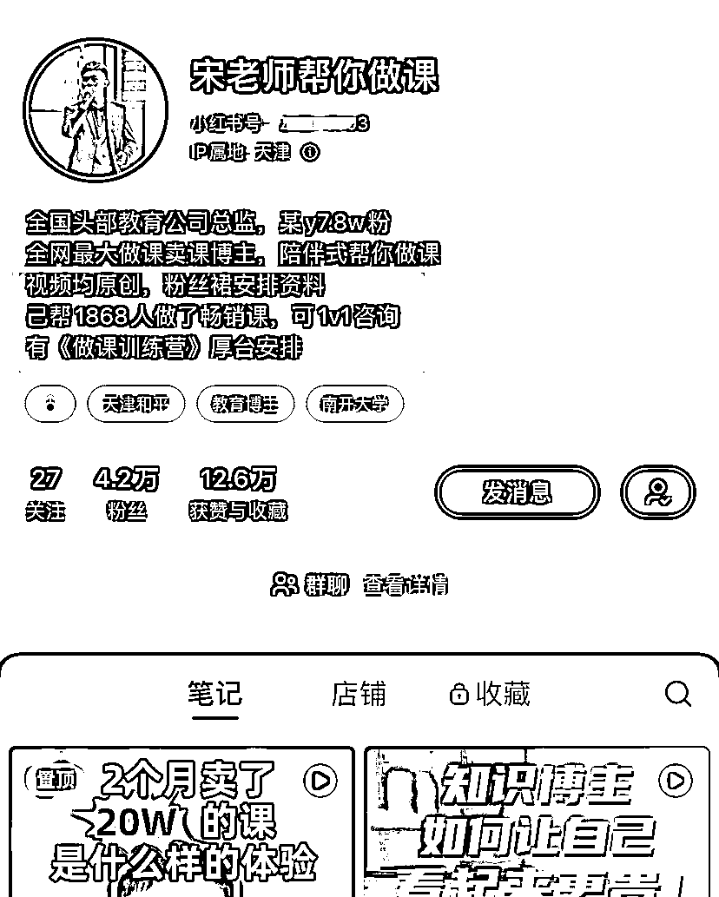

## 2.评论区

用户看到鱼饵（抖音视频）后，大概率会点开评论区。

评论区第一条评论，就是引流信息展示很好的位置。如下图所示：

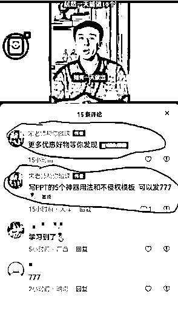

所以，我们在评论区里面放的信息，依然属于「鱼饵」，目的依然是增强用户找到去你私域路径的欲望。

主要是通过两种方式来实现：

自己评论，进一步把「我有能解决你需求的产品/服务」这件事情，说清楚用小号评论，说自己已经体验过这个需求/服务了，真香

如果想要让评论的曝光最大化，我们就还需要做一个操作：「置顶评论」。

## 3.粉丝群

抖音、小红书都可以，粉丝群的标题上把微信号写进去

还可以在粉丝群里面去写相关的钩子的内容，每天固定点去发你这个领钩子的方法。

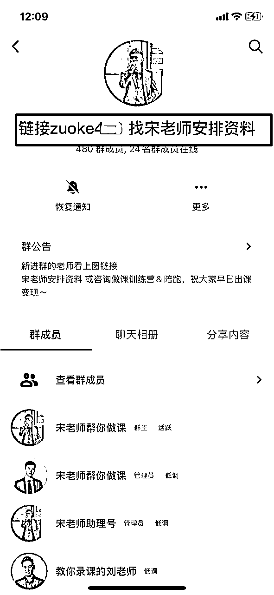

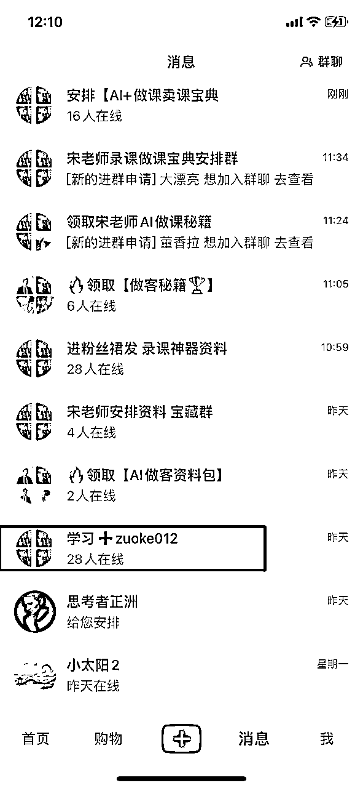

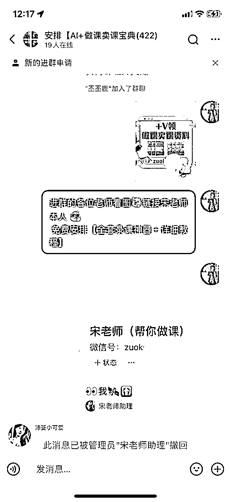

## 4.朋友圈背景图

比方说你可以在私域的背景图里面写上，我写了一本书，可以发给你

还有模板，需要的老师可以安排

## 5.产品介绍

比方说你发售了一门课程，你配套了教材，产品标题里也可以嵌入你的钩子，增加你的核心卖点。

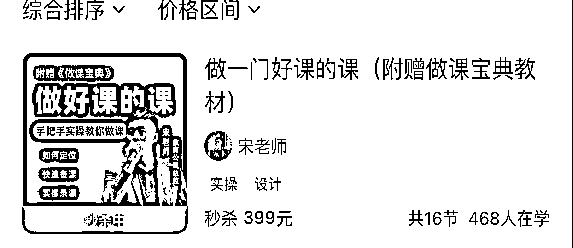

6.还有很多种留钩子的渠道，篇幅有限，不做过多的介绍

# 五、5个心法，避开做钩子的天坑

篇幅有限不做过多讲解，有需要的老师可以多聊

1.如何应对羊毛党----发入门试看版

（广告不能少）

2.一定要加防抄袭流程，否则很快没有 核心竞争力

3.短视频和直播有意无意都可以提

搭配精准引流效果更好

4.钩子越多越好，就像爪子一样，抓不同的人

5.钩子，可以先发售，再做，效果更好

如果你想做自己专属的钩子，可以发个模板

# 写在最后

好了，今天的分享就到这，一套好的引流方式真的可以让你每天微信好友加不停

无论你是企业老板还是个人博主，其实我觉得知识付费都是一门极低成本，极高收入的好事

当你有了属于自己的钩子，那么卖课百万只是时间的问题

如果你一直抱怨你没有流量没有粉丝没有客户，其实，本质只是你没有专属的“黄金钩子”

欢迎大家有知识付费问题找我讨论。

希望大家，2023生财有术，钩子生财，感谢看到这的每一位老师

我是宋老师，23年帮助500位老师卖课50w，欢迎和我一起做课生财！