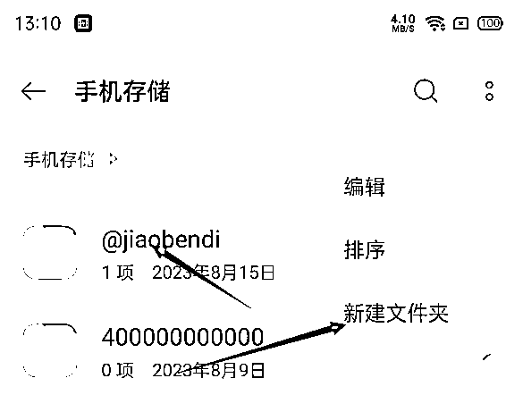
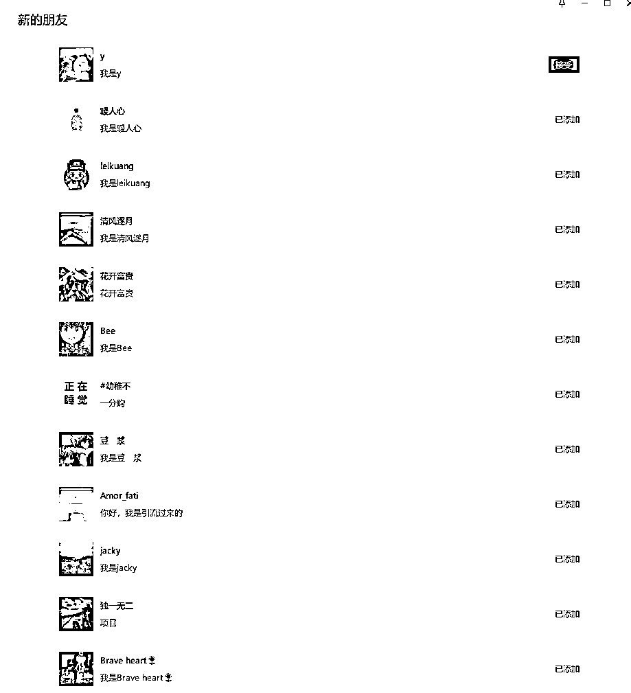

# 小红书日引流几百精准粉喂饭级教程,适用各个行业!

> 来源：[https://mxns82lqqfd.feishu.cn/docx/WOHCdLkTAove67xRRnFc5XBwnpd](https://mxns82lqqfd.feishu.cn/docx/WOHCdLkTAove67xRRnFc5XBwnpd)

🎯小红书日引流几百精准粉喂饭级教程,包括账号搭建/数据采集/插件使用等

# 一、项目逻辑

利用小红书插件,全自动批量点赞小红书个人用户账号头像,大量曝光从而实现精准引流

# 二、设备和账号

## 2.1 准备工作

### 所需工具

*   小红书账号1个

*   小红书点赞插件

*   安卓手机一台(安卓版本7.0以上,用于批量点赞)

*   电脑(用于采集精准用户)

## 2.2 安装插件/小红书对应版本

*   安装插件教程

## 2.3 账号搭建

*   注册小红书账号,设置好昵称/头像(准备钩子)

*   可以参看下我设置的https://www.xiaohongshu.com/user/profile/64daf791000000000200fb86?xhsshare=CopyLink&appuid=64daf791000000000200fb86&apptime=1692073860

*   或者搜索小红书账号:9947390901

## 2.4采集账号数据

*   使用后羿采集精准用户数据,后裔采集器地址https://www.houyicaiji.com/ 下载你电脑对应版本即可

*   https://www.xiaohongshu.com/search_result?keyword=创业项目

*   以上,[创业项目]修改为你所在行业的关键词,例如你做减肥赛道,关键词就是 减肥/瘦身等等

*   https://www.xiaohongshu.com/search_result?keyword=减肥

*   首先下载后羿采集器,然后下载这两个,首先运行1,采集相关

视频教程

## 2.5 将数据放到插件目录

*   在手机中找到文件管理并打开,进入手机存储

*   新建一个文件夹@jiaobendi,将小红书点赞账号.txt放进去,这里注意,名字别搞错,否则读取不到数据,插件无法运行

## 2.6 插件运行流程

## 2.7 曝光效果

# 四、注意事项

*   插件可能并不适配所有安卓手机,如果运行不了,请更换一下设备

*   有的账号,可能点进去头像,没有点赞的选项,请查看一下小红书版本:点击设置-找到关于小红书,看看版本是不是8.1.0

# 五、数据反馈

*   日加几十精准粉问题不大,不过需要多设备操作,单台设备,一天十来个很简单,以下是昨晚到现在的测试效果,单台设备

# 六、插件地址

链接：https://pan.baidu.com/s/1acwgkhUBFlH1nTfI6ZMeug?pwd=9527

提取码：9527

--来自百度网盘超级会员V5的分享

# 最后最后,欢迎各位大佬链接,一起交流进步~