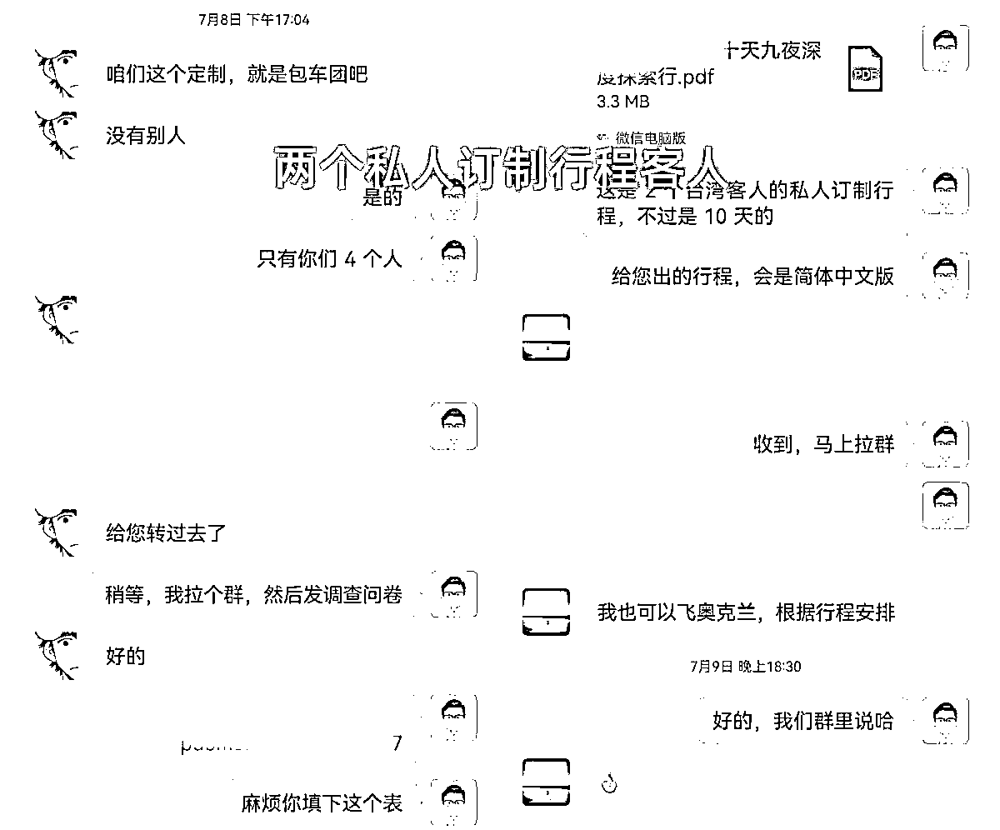

# 0基础做小红书旅游博主，第一周销售额6w2的成单秘籍！

> 来源：[https://r6kr7evxni.feishu.cn/docx/WOUndXLwtoaro6xB5eMcSeBSn4e](https://r6kr7evxni.feishu.cn/docx/WOUndXLwtoaro6xB5eMcSeBSn4e)

大家好，我是阿渡，年初在生财分享过两篇精华文章，一篇是作为普通人的我逆袭故事，另一篇是关于助听器实体店在小红书获客的分享，感兴趣的圈友可以看看：

https://t.zsxq.com/108jnTu2Y

https://t.zsxq.com/10o4czeng

自从口罩结束之后，生财里就出现了很多旅游相关的分享，我自己3月份去西安旅游了一次，作为旅游淡季，西安大唐不夜城竟然人山人海，我差点还把闺女给弄丢了，足可见今年旅游的爆炸式增长有多么恐怖。

上个月初，朋友联系我想做新西兰旅游，他有新西兰当地旅行社的一手资源，想找和人和他一起在小红书做流量，他有资源，我会做小红书，我俩直接一拍即合。

于是说干就干，我们开始在小红书上发笔记，结果没想第一周就成交了6.2w，一个定制游付了30%的定金，再加上两单跟团游，比我做助听器账号时变现速度更快。

再晒下其中一个微信的引流视频：

如果视频看不到，可以看下图片：

好了，开始正文。

正文分为5部分：

1、小红书旅游赛道的红利有多大？

2、普通人怎么吃到这波红利？

3、为什么建议大家做旅游赛道？

4、如何做小红书旅游号？

5、如何加微信和成交？

文章较长，完整版请大家移步飞书：

### 一、小红书旅游赛道的红利有多大？

早在今年1月份，朋友就联系我，想让我做新西兰留学或者是旅游项目，留学对专业度要求太多，当时我就很看好旅游，想做这一块，不过那时因为口罩刚恢复，境外游旅游还未恢复，因此就搁置了，我也忘了这件事。

直到6月底，朋友在无敌的红书宝星球看到了一篇法国定制游的分享，那位宝友小红书 100个粉丝就成交了24w，作为无敌实战营的助教，这位宝友还是我亲眼看着做起来的，不过很可惜我当时没有联想到新西兰旅游，足足晚做了两个月，没有在暑假前做好布局，太可惜了。

不过好项目不怕晚，朋友看到这篇文章后，马上就去联系了新西兰的旅行社，他自己之前就在新西兰待过，而且在新西兰做过一年多的导游，直接1小时内就谈到了两家旅行社的资源，一家定制游，一家跟团游，都是新西兰排名前3的旅行社。

小红书做旅游的红利，有多夸张？

我们一开始做了3个小红书号，第一篇笔记发出去，才几十个小眼睛，就成交了一单。

当时就把我震惊了，我给朋友说：这风口，都不是把猪吹起来了，是把大象都吹起来了！

看到旅游同行写的的一篇文章，提到：一个20人的旅行团，18个人来自小红书报名。

那么，问题来了：

### 二、普通人如何吃到这波红利？

先看我跟一个新西兰导游的聊天记录：

从聊天记录里，你有没有发现一个信息？

这也是我跟很多旅游行业的朋友沟通后，得到的一个信息：

导游和旅行社，想做小红书，不会！

我曾经教过一个做旅游的朋友做小红书，她每天忙着联系车和导游、处理游客的问题，手机响个不停，根本静不下心来做！

这就是我们的优势啊，宝子们！

旅行社也是迫切需要你。现在大量的流量，被携程和途牛等平台掌握，他们抽成非常高。旅行社就像美团上的商家，不跟携程和途牛合作，没生意，合作，还有点微利。累死累活的干，钱都给携程和途牛，旅行社们都是苦不堪言。如果你能给他们带来生意，那就是他们的财神爷，旅行社会非常高兴跟你合作的。

赶紧去跟旅行社对接起来，发挥你的小红书优势，一起搞钱！

那么，如何对接境内外旅行社？

我们盈利的模式是，找旅行社合作，成交客户后，拿佣金。

#### 1、如何找国外的旅行社：

你可以问下亲戚朋友，谁在国外留学或工作。多问问，肯定能找到的。让他把当地华人旅行社的微信找到，推给你。注意了，旅行社的口碑很重要，因为跨国合作，保证服务质量，非常重要。让你的这位朋友多打听打听。

如果实在找不到合适的国外旅行社，就算了。今年国内外的旅游，都很火。国内的新疆、云南、西安、贵州、北京、呼伦贝尔等传统旅游热点城市，都是游客井喷。随便找个城市做，就够吃了。

#### 2、如何找国内的旅行社：

多问问家人朋友，你肯定能找到一个做旅游的朋友。实在不行，去所在城市的旅行社，上门跟老板聊一聊合作。他不用出一分钱，就能招到一个网络销售，何乐而不为呢？

#### 3、注意事项

注意，一定要多方考察，找一到两家靠谱的旅行社。

这涉及到两方面。

##### 3.1、佣金及时返还

旅行社之间，拖欠款很严重的，甚至说，你不拖欠，就开不成旅行社。他很有可能，把拖欠的习惯放在你的佣金上。想要旅行社不拖欠，准时给你返佣金，一是要找口碑好的旅行社，二是一开始就做好约定。比如，约定佣金当天结算，这单佣金没结算，下单生意就先不给他了。

##### 3.2、后续的服务质量

首先，一定要确保是0购物纯玩团。很多导游为了业绩，会做一些小动作，比如强制购物。这种行为非常伤害用户体验，购物团是最砸口碑的。其次，游玩、住宿、团餐的质量要保证，特别是要与行程单的宣传一致。最后，投诉和不满，一定要及时处理。否则，顾客不满意，小红书上写你的黑材料，完蛋了。

我们正在旅行的客人，我每隔两天都要问一下。有任何情况，我会直接去找旅行社老板，及时解决问题，把游客的不满消灭在萌芽中。

### 三、为什么建议大家做旅游赛道

从开始做小红书到现在，已经快2年的时间了，这期间尝试过很多赛道，读书博主、舞蹈博主、减脂博主、心理学博主、小红书运营博主等，也在红书宝和生财有术星球当志愿者，担任红书宝引流营教练、商家实战营助教，这些经验让我在去年年底成功做出让我月入五位数的助听器赛道。

而我之前尝试过的那些赛道，要么变现上限低，要么变现周期长，要么对专业度要求高，上手难，都不适合新人上手，就拿助听器赛道来说，虽然变现强，也有朋友想给我做分销，但是这个赛道对专业性要求太高了，无论是制作笔记，还是给用户的咨询答疑，非从业者完全做不了。

相比而言，旅游赛道就很适合没有业务知识，没有资源的普通人了。

#### 1、学习成本极低

对于普通人，旅游赛道门槛极低。确定做某地的旅游后，去携程和途牛看下，你会发现，翻来覆去，就是那几条旅游线路。你看上几个行程，对当地有哪些景点，行程怎么走，就入门了。接下来你就可以独立写笔记了，不用旅行社的人配合。

#### 2、不用在原产地

小红书上做得好的旅游号，IP地址大多不在旅游地。

#### 3、上手容易

小红书做旅游，爆款模板就那几个，翻来覆去的改，就行了。具体怎么做，第四部分会详细说。

#### 4、只需要引流

加到微信，后面就不管了。客服交给旅行社的人，你等着收佣金就好了。详细请看第五部分：加微信和成交。

#### 5、一次销售，多人成交

卖别的产品，每次通常卖一份。而旅游，都是几个人一起去，一次能卖多份。比如，新西兰跟团游，一般都是3-5人。成交一笔，每人1万多，销售额就是大几万。相应的，佣金也很可观。

同样是成交一个客户，为啥不成交高客单价高佣金的呢？更不要说，相较于普通客户的锱铢必较，高客单客户更容易成交。

### 四、如何做小红书旅游号？

小红书天然适合旅游业，做小红书旅游号，太容易出成绩了。

当然，做好小红书也需要一些运营技巧，具体到如何做好小红书旅游号，我从账号装修、笔记选题、关键词优化和首图四个方面来说透。

#### 1、账号装修

就像开店之前，要做店铺装修。我们在开门迎客前，就要做好账号装修。

一个用户选择关注一个博主，往往不会只因为一篇优质笔记而关注。用户会看博主的主页，查看昵称、头像、个人简介、背景图以及之前发布的笔记等，然后再决定是否关注博主。因此，主页内容的展示是非常重要的，这不仅关系到用户对运营者的关注度，还是在一定程度上决定了用户是否愿意找你购买旅游产品。

而对我们博主来说，完善账号信息还能提升账号权重。因为账号信息越完善， 越有助于平台对账号贴标签。有标签的账号，发布的笔记获得的流量更加精准，流量精准后，更多用户会点开笔记，浏览量等会大幅提升，随之而来的就是账号的权重越来越高。

##### 1.1 昵称

小红书有几千万博主，要给别人留下深刻的印象，娶一个有特色的昵称是第一步。取昵称的时候，我们应该遵循与众不同、简单好记的原则。

与众不同，是指昵称要有足够强调的辨识度。用户看到昵称之后，就知道你是干什么的。

简单好记，是指昵称要简明扼要，利于传播。千万不要用一些难写的符号或者生僻字，既不利于用户形成记忆点，也不便于搜索和传播。

旅游博主一般是名字+领域。比如，图图漫游北极、**旅游攻略、欧洲旅游小队等。这里需要注意，昵称不能含导游、旅行社，这属于违规的，必须要小红书平台认证后才可以。

##### 1.2 头像

头像和名字一样，是每个人呈现在别人眼中第一眼的样子，一定要有足够的的吸引力。通常来说，头像应该具有以下特征：简约大气、色调鲜明、关联昵称、直观清晰。

简约大气，是指头像不能过于杂乱，比如，背景很复杂等，杂乱会让用户第一眼看到时不知道关注什么内容，无法形成独特的记忆点。一个好的头像，应当是简约大气，记忆点非常明确的，一定要记住“少即是多”的准则。

色调鲜明，是指头像的整体风格不能过于暗沉，颜色要够亮、够纯、够饱满。不要为了吸睛，将多种颜色组合在一起，也不要用灰白色调的图片作为头像。

关联昵称，是指头像和昵称要相得益彰。比如，呼伦贝尔旅游，可以放大草原的照片。如果头像和名字毫无关联，可能会让用户疑惑，不知道账号到底想要输出什么，当用户对这一点不明确时，自然就难以在心中留下深刻的印象了。

直观清晰，就是头像不能模糊，一定要用高清大图。如果模糊不清的话，会影响用户的观感体验，无法在用户心中留下一个鲜明的形象。

##### 1.3 个人简介

个人简介，就像面试时给面试官递交自己的简历一样，要通过一句话让用户了解自己是干什么的。

一个好的个人简介，一般由四个短句构成。

第一句，你是谁？

第二句：你主要分享的内容是什么？用户通过看你的小红书，能收获什么价值。

第三句：你有哪些特殊的经历？比如曾经获得过哪些成就或业绩。

第四句：你的联系方式是什么？便于用户和品牌商找到你。

好的账号装修：

#### 2、笔记选题

很多小红书博主在创作笔记时会陷入一个误区，容易沉迷于自己的世界里，“想写什么，就写什么”，我觉得好就行，完全不去想用户喜欢看什么内容。这就是我们常说的“自嗨”。这不是做小红书，是在发朋友圈。

怎么知道用户喜欢什么？

爆款笔记就是用户的最爱，找对标找爆款笔记进行分析，是我们想在小红书快速起号必备的技能。通过分析爆款笔记，我找到了旅游赛道爆款笔记的通用模板，照着发，你也能很快做出爆款笔记。

##### 1、旅游全攻略

##### 2、一定要做的**件事、**条建议

##### 3、红黑榜

##### 4、手写攻略、手绘地图

##### 5、风景照拼图

#### 3、关键词优化

搜索是小红书旅游流量的主要来源。很多女生，就是把小红书当百度和谷歌，遇到任何问题都上来搜一下。旅游也是，她们直接搜索目的地。你只要做好根据挖掘出用户搜索的关键词，然后做好内容，等她来搜就行了。用户只要搜，就会看到你的笔记。

可以通过搜索下拉框、猜你所想、数据分析台等途径搜热度较高的关键词，再建立一个属于自己的关键词库。

有了关键词，我们就可以做关键词布局了。

比如，关键词，新西兰旅游。

首先要在笔记的标题和正文中引用，此外，基于目前小红书算法的推荐特性，图片在内容审核过程中的比重不断增加，可以在首图添加关键词，来增加被系统推荐的可能性。在文章结尾，也要记得添加相关的话题内容为笔记引流，加大笔记曝光率。

注意：一定要避免堆砌关键词，堆砌关键词会被系统判定为广告，长期这样操作，账号会被系统降权。

#### 4、首图一定要美

有个朋友做法国旅游的，说很努力的发了不少笔记，但小眼睛只有几十。我看了下，首图做得不好，用户看到笔记，都没有点进去的欲望。

同类笔记在搜索列表页排列开，用户为什么要点你的笔记？因为你的首图与其它笔记的首图有差异啊。用户是否打开你的笔记，唯美的首图可以说占了90%的因素。

举个最简单的首图例子：

这两个笔记首图，你会点开哪个？

左图色彩阴暗，一看就很压抑，右图春光明媚，心情都变好了。当然，这只是最简单的审美案例，涉及到作图，会更复杂。

不光首图，里面的图片也很重要。旅游是一件美好的事情，他能否下单，也在于你的图片能否吸引他，那是一种美好的体验。

做小红书旅游博主，提升审美永远在路上。无敌的星球里，周周有审美提升营，很推荐参加。

### 五、如何加微信和成交？

小红书对交易引流，限制很严格。我们隔一段时间，就要换一个加微信的方法。此外，既然要加微信，就要做好被封号的准备。同时做多个号，被封了一个，还有别的号。一机一卡一号，手机流量上网，千万不要同一个WiFi，否则有可能一起被封。

我们目前采用的加微信方法：用小号发一篇带有微信号的笔记，再用大号去收藏这篇笔记，并公开收藏列表。

当有客户咨询时，话术引导去看收藏。

加微信之后，我们是直接拉群，让旅行社来做客服。境外旅行社会有时差，拉群后，给客户说下，等那边上班了就做咨询。客户最终成交，你在群里也很清楚。

如图：

成交后，游客直接打款到旅行社的账户上。这点很重要！旅行社都是对公账户，付款时能显示出来，这样做，能极大的增强客户的信任。

不建议大家做客服，有2个原因：

1、客户的问题，会非常多且杂，必须要专业的客服来回答。你作为旅游的门外汉，学习成本非常高。

2、做客服会耗费大量的时间精力，不是我们的专长。我们专业做好引流就行了，有做客服的时间，多做几个小红书号。

无敌的商家实战营有个学员，她就是只做引流，客服交给团队成员。这样做下来，负责引流和客服的人，都非常专业，效率很高，一个月销售额100多万。

好了，这就是小红书做旅游的全部流程。如果你还有什么疑问，欢迎交流。

说下我们团队的进展：

发现小红书旅游的红利后，我们在第一周就搭建了团队。现在，我们团队新增西安旅游了，团队培训也开始了：

微信客服规范化，也在做了，算是初步迈入了正轨：

有了新西兰旅行社合作的示范，澳洲、日本、美国、加拿大、南美的华人旅行社，已经找到我们寻求合作了。

下一步，我们还是深耕新西兰旅游，打算近期把新西兰的景点、餐厅、酒店都跑一遍，签小红书代运营合同，团队成员来操盘。

我的分享就到这里啦，最后再强调一下，今年的旅游项目真的很好做，生财7月末还推出了旅游项目合集，可见目前旅游项目确实是红利期，手上有资源或者能联系上资源的圈友，可以自己尝试着去对接一下，只要能找到靠谱的旅行社资源，在小红书上做引流真的很简单。

当然啦，有国内定制游或者国外游产品的圈友，欢迎来找我合作呀，我们目前在做旅游项目的培训，有些学员自己没有旅行社资源，但是又想做旅游项目，如果你们的产品OK的话，我这边可以帮你对接学员，具体的分销情况你们自己谈。