# 《视频号视频下载教程》

> 来源：[https://ghlf0s3q3l.feishu.cn/docx/X2SBd6ufAo15DMxIYU9cVXdfn6e](https://ghlf0s3q3l.feishu.cn/docx/X2SBd6ufAo15DMxIYU9cVXdfn6e)

# 前言

今天刚好有下载视频号视频的需求，然后在之前视频号航海的工具手册中看了一下，都失效了。要么是下载不起来要么是下载之后打不开，之后就找呀找的，找到了一款可以用的工具，操作有一些些的复杂，不过已经测试可以完美下载并且打开的。所以写了这个教程，应该可以给后面有需要的小伙伴节省一些时间。

# 一、下载软件

## 1.1 20230908 剪辑特训航海教练景清推荐的两款视频号下载工具

# 二、使用教程

1.  打开软件

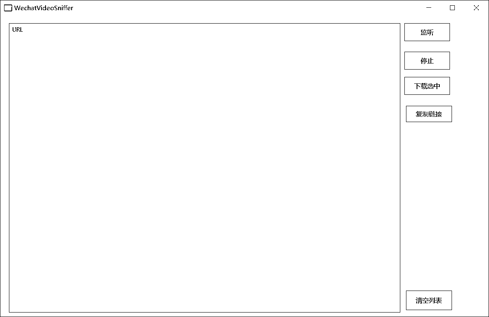

1.  点击监听然后再安装证书

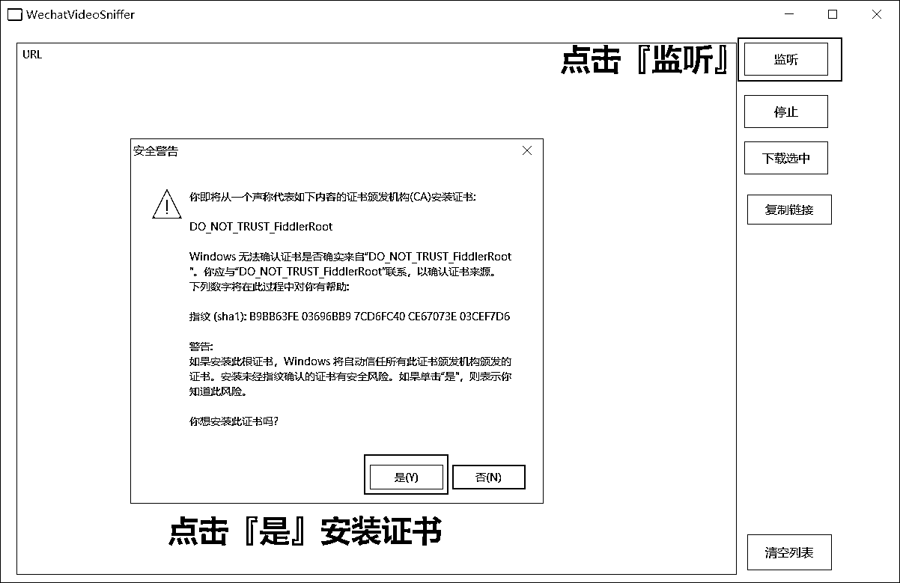

1.  确认一下监听属于激活的状态下（灰色代表激活状态下）

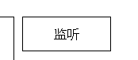

1.  播放视频号的视频，可以看到 URL 里面有一条链接了

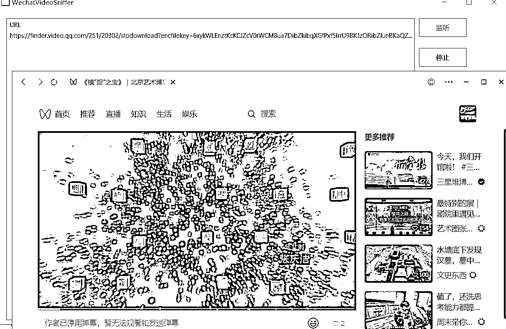

1.  点击一下链接然后复制链接

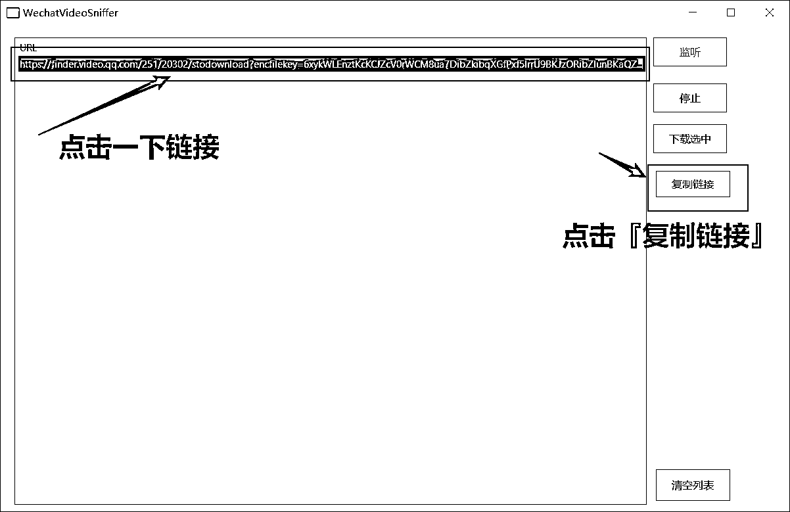

1.  新建一个 txt 文档，将链接粘贴到文档中（等下需要修改链接内容）

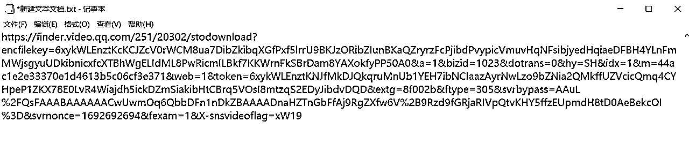

1.  接下来是修改链接的内容，第一行的『20302』改成『20304』

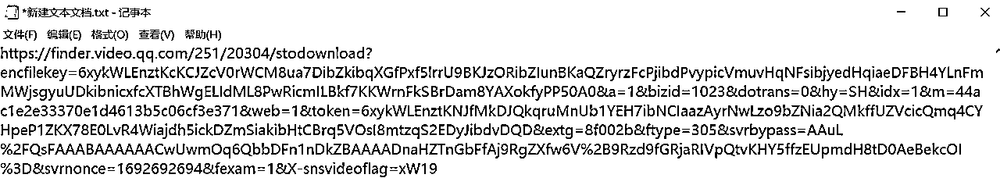

1.  这个时候就可以下载了，把链接粘贴到 IDM 或者迅雷直接下载就好。

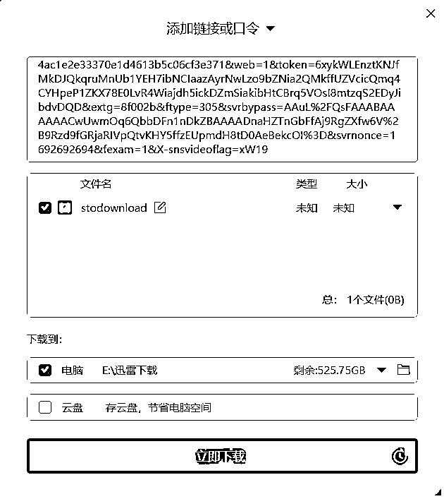

1.  下载好之后，把后缀改成或者添加一下【。mp4】

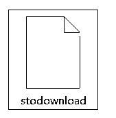

tips：如果看不到后缀也可能是你没开显示文件扩展名，可以按照下面步骤打开。

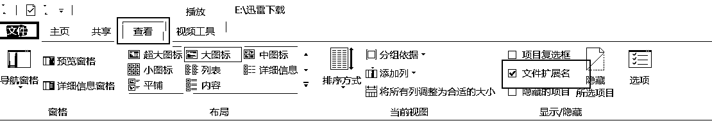

1.  修改之后就可以打开视频文件了

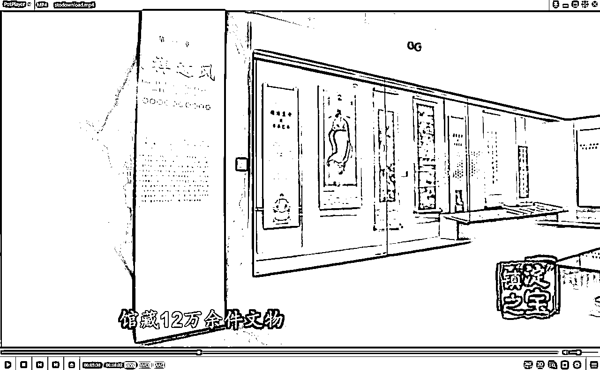

# 三、下载最高清晰度

下载的视频可能不够清晰，但是视频号里面是更加清晰的。就可以按照下面步骤来下载最高清晰度的视频号视频。

案例链接：

https://finder.video.qq.com/251/20304/stodownload?encfilekey=6xykWLEnztKcKCJZcV0rWCM8ua7DibZkibqXGfPxf5lrrU9BKJzORibZIunBKaQZryrzFcPjibdPvypicVmuvHqNFsibjyedHqiaeDFBH4YLnFmMWjsgyuUDkibnicxfcXTBhWgELIdML8PwRicmILBkf7KKWrnFkSBrDam8YAXokfyPP50A0&a=1&bizid=1023&dotrans=0&hy=SH&idx=1&m=44ac1e2e33370e1d4613b5c06cf3e371&web=1&token=cztXnd9GyrEGEialXvUYkhia70tmPr66oABVlPhjNBTbqdb1F2JTwHA1znqbElLyET07LrlLYpckstfkVQA2TIdbrx82Ye48XxEXCWcLJg219BNLaZlA6A6bwjYSO1FZpr&extg=8f002b&ftype=305&svrbypass=AAuL%2FQsFAAABAAAAAAAAJxw1c3r7ushbMFTkZBAAAADnaHZTnGbFfAj9RgZXfw6V2w7tZLHrOTqJDHBShoeutU3zKLLB3hayIo9sOngPRSs%3D&svrnonce=1692685360&fexam=1&X-snsvideoflag=xW19

1.  还是按照上面的步骤，直到第六条修改链接的内容，第一行的『20302』改成『20304』。修改后还有一些东西需要删除掉。

1.  找到视频链接中的下面两段

*   【&bizid=1023&dotrans=0&hy=SH&idx=1&m=44ac1e2e33370e1d4613b5c06cf3e371&web=1】

*   【&svrbypass=AAuL%2FQsFAAABAAAAAAAAJxw1c3r7ushbMFTkZBAAAADnaHZTnGbFfAj9RgZXfw6V2w7tZLHrOTqJDHBShoeutU3zKLLB3hayIo9sOngPRSs%3D&svrnonce=1692685360&fexam=1&X-snsvideoflag=xW19】

这两大段都需要删掉，大家可以看一下我下面这张图然后参考一下位置。

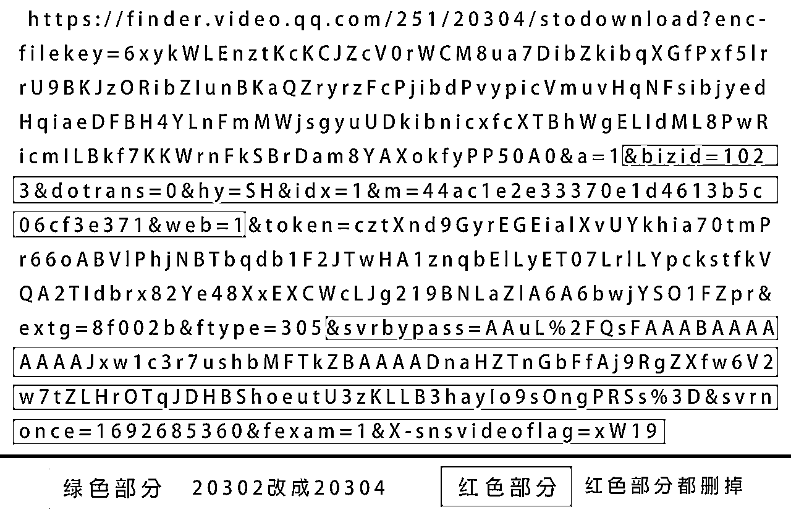

1.  修改删除之后，复制链接到 IDM 或者迅雷直接下载就好。

1.  下载好之后，把后缀改成或者添加一下【.mp4】