# 通过风向标，发掘流量新红利，支付宝生活号直播单场GMV1万+，两个月600万场观

> 来源：[https://otnh7rfhg0.feishu.cn/docx/XWxMdVrZgoBhwlxkgmWc0L98nQe](https://otnh7rfhg0.feishu.cn/docx/XWxMdVrZgoBhwlxkgmWc0L98nQe)

大家好，我是猫叔，首先做个自我介绍，老自媒体人，完整经历了从微信公众号的图文时代，到现在抖音、视频号、支付宝生活号等视频自媒体平台时代，先后参与过多个互联网项目，也算是老韭菜一枚了，同时对新鲜事物非常敏感。目前跟朋友合伙有两家公司，一家做跨境电商，一家刚从事支付宝直播相关业务。

对于我这两个月在支付宝直播的探索，6、7月份跑出来的数据是：4个支付宝生活号，10多个主播账号。直播总曝光600万+场观，单场直播GMV1万+，总出单2万+。对于这次探索，我在不断的复盘和思考，支付宝生活号直播的趋势不比视频号、抖音要弱，作为金融业务起家、坐拥10亿用户，日均活跃超过3亿的支付宝来说，大力推广支付宝直播成为了他们今年势不可挡的战略布局。而我们如何去入局呢？

不管是做自媒体、国内电商直播，还是做跨境电商，我都遵从一个原则，只做蓝海平台，只参与前期，只做轻投入试错。理由也很简单，一没有大的资金去跑成熟的供应链闭环，二目前这个时代平台政策日新月异，变化太快，很多时候一定要学会及时止损。好了下面进入正题。

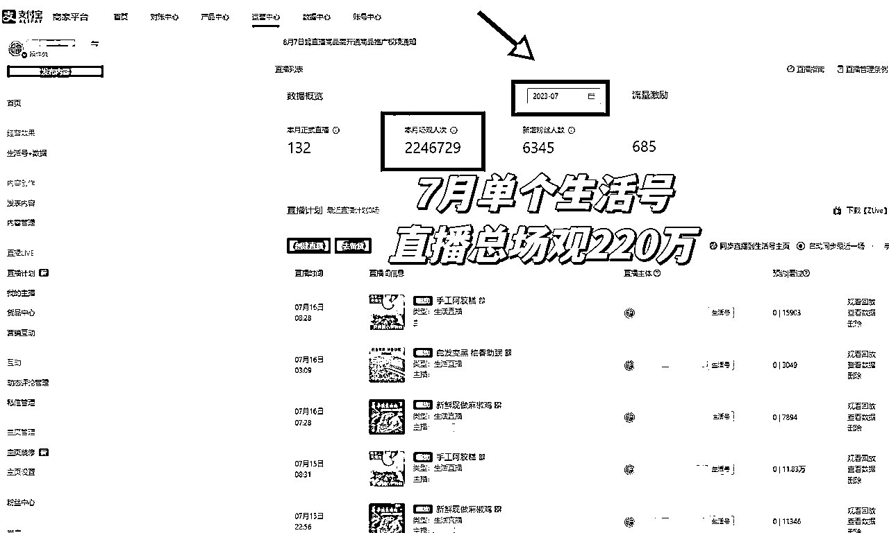

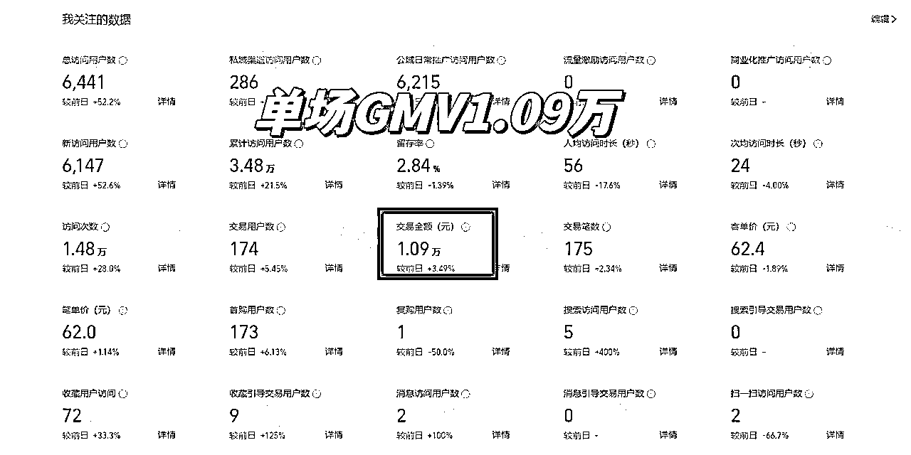

<h9>因为现在支付宝还没有出数据罗盘，只能直接放后台数据（单个生活号7月220万直播场观，单场直播1万+GMV）</h9>

篇幅字数有点多，为了方便阅读，请大家移步到飞书文档：

# 一、初识支付宝生活号直播

大概一个多月之前，由于本人跨境电商业务相对来说比较成熟，所以我最近一直在刷生财，看看有没有什么新的可以参与的项目，然后无意间在风向标里面看到了关于支付宝生活号创作者分成计划的项目，说实话在此之前，我从来没有认真关注过生活号这个平台，只是知道大概是去年的时候支付宝开始放开生活号，因为觉得短视频的主战场还是抖快红，出于好奇打开了支付宝，赫然发现在下方导航栏的中间位置特意开了个生活频道，根据以往的嗅觉我觉得支付宝可能今年要在这一块发力，果断点进去生活号，一开始只是看短视频，发现大部分还是出于搬运和混剪的阶段，且大部分流良好的为官方账号，粉丝也比较少，相对较难满足创作者计划的要求，根据以往经验，没必要花太多精力投入测试了。

但是出于好奇，点开了他们的直播栏目，也就是这时候震惊到我了。大部分直播还停留在无人和半无人，以及官方号的数字人直播，但是流量点赞却大得可怕，直播没有显示具体场观和视频号类似，但是每个直播间都有几万甚至几十万的观看，相信做过视频号的小伙伴们都了解这个场观意味着什么。而且刷来刷去发现直播间并不多，也几乎全是官方和企业账号，瞬间我嗅到了机会的味道，于是立马联系我的合伙人，研究一下这个平台。

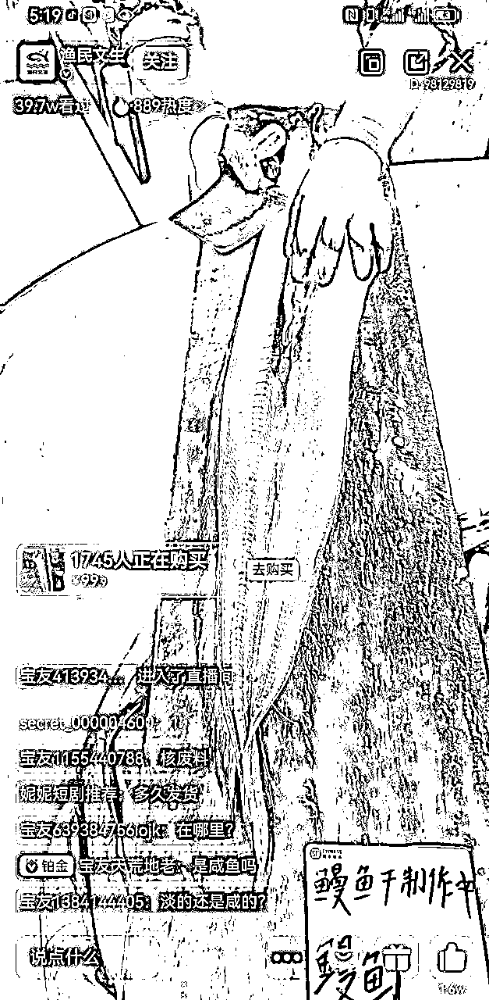

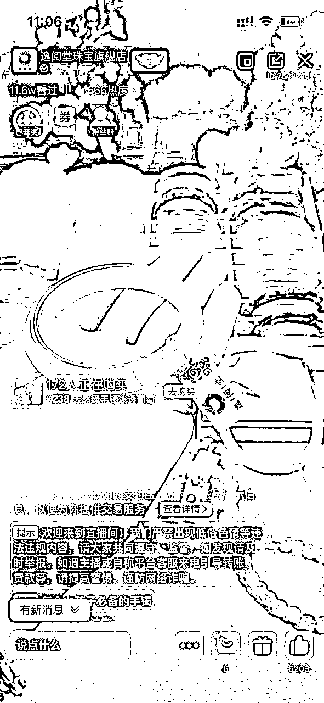

对于我的合伙人在直播这一块有很多经验（国内+国外），曾经在早期参与视频号也拿到了成绩，第一批视频号精选联盟商家，但今年因为视频号供应链太卷，互相打价格战而退出。他一开始也有质疑，首先觉得没听过这个平台，真的会有人看吗，其次觉得无人直播这种模式做不长久，大部分平台都会针对性风控。刚开始我们只是简单的查阅官方支付宝的白皮书，惊奇的发现生活号目前为止并没有自己内部的购物车和优选联盟，更不要提什么MCN达人机构和直播商城了。直播购物车（小蓝车）绑定的也是第三方的小程序，并且还接受企业支付宝的T+1提款（现在的机制改变了），依靠着多年的电商经验我们用了一周时间研究生活号直播白皮书，解决了平台的入驻问题，开启正式直播。

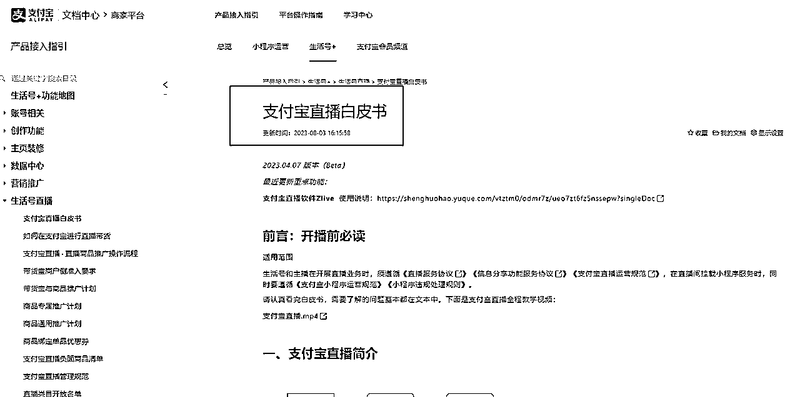

# 二、支付宝直播尝试

## 1、无人直播0场观

对于一个新平台来说，与其思考如何创新的天马行空，还不如低成本地快速试错。作为老电商人我们很果断地选择无人直播或者半无人快速落地的方式去测试平台的流量。

其实开头我们并不是一帆风顺，而是困难重重。一连几天直播场观都为0。

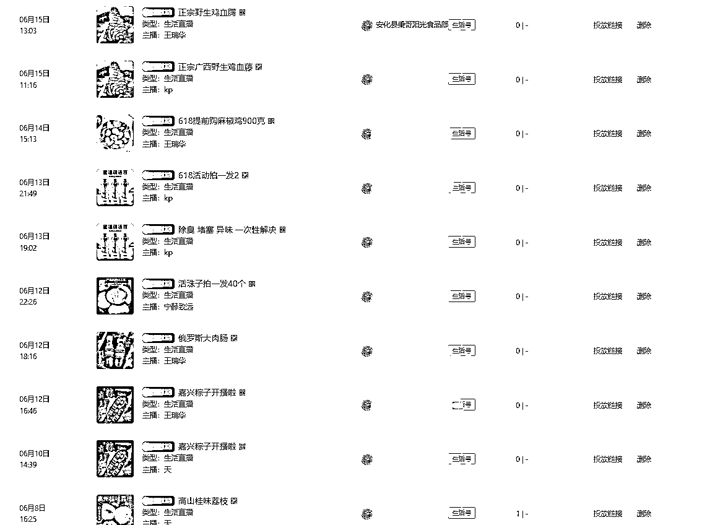

## 2、重复测试调整

而看着平台其他商家的直播大流量，根据我多年的电商直播经验得出，直播万变不离其宗，除了从人、货、场三方面入手之外，网络环境和账号IP也纳入我的测试范围之内。经过了多次的调整，不同的IP账号主播，产生的流量结果导向有很多的区别。直到6月14日感受到了在支付宝直播的第一次爆单，卖一些养生产品达到了30万的直播场观，虽然才了成交金额1.05万，但是让我嗅到了商机的味道，

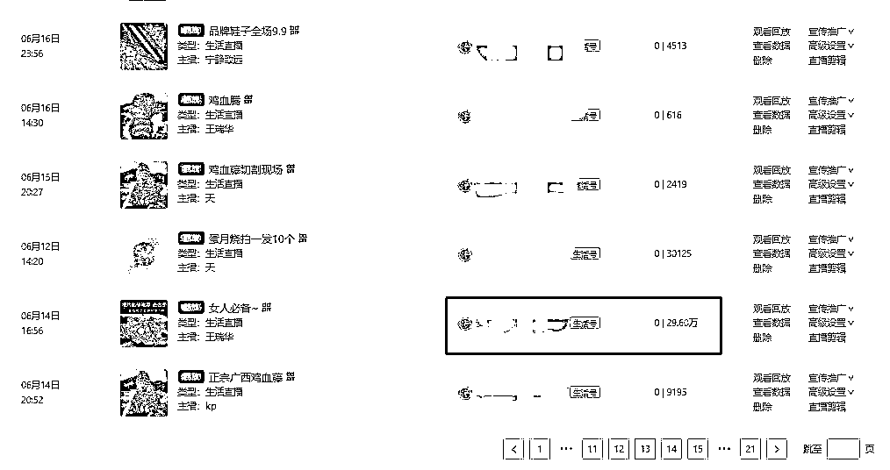

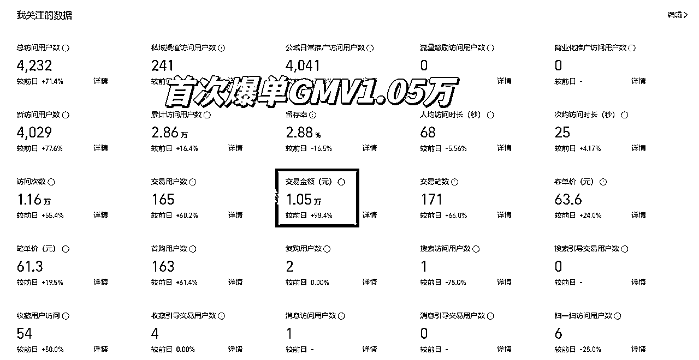

# 三、两个月支付宝直播数据复盘

对于老电商运营人来说，数据复盘是必不可少的一部分，而每一个平台都有它的起步期、增长期、成熟期、衰退期。相比13年淘宝、18年抖音、20年跨境来说，经过2个月跑下来的数据结论：支付宝直播仅仅只是开始。

## 1、直播数据总结

从6月到7月这两个月，4个生活号，10几个主播账号，200多场支付宝生活号直播。普通正常场观的GMV基本可以达到过万+GMV。

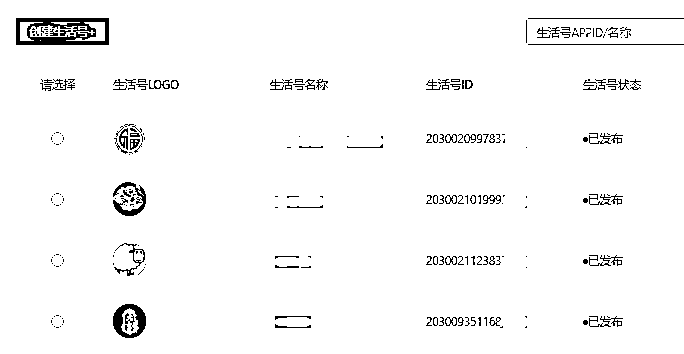

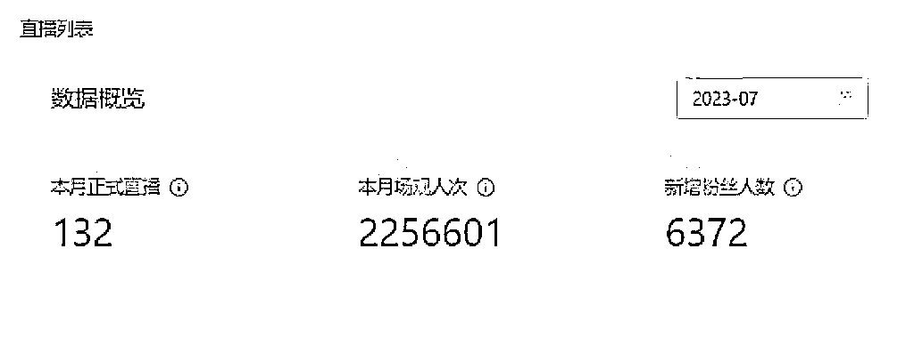

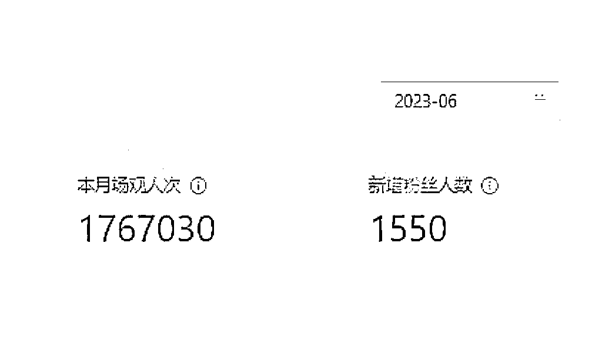

<h9>其中一个生活号6、7月直播数据（两个月400万直播场观）</h9>

## 2、直播选品

对于作为去年7月份视频号第一批优选联盟商家的我们来说，选品和供应链的打法是我们再熟悉不过了，我一直遵循着一项准则：宁愿高利润少单，也不要低单价爆单。只做50%利润以上的品类，特殊品类不能低于35%利润。这也是我今年不想待在视频号价格内卷的原因。最终还是以我们最熟悉而且最容易落地的食品类下手，大量地尝试用不同IP主播号的直播流量去测品，很快就在生活号直播中跑出了很稳定的大流量数据。

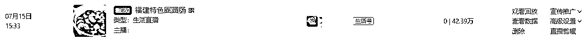

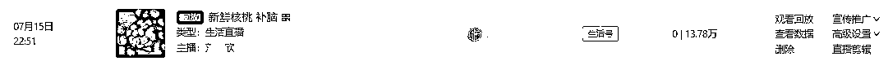

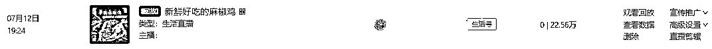

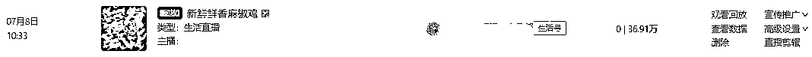

<h9>我的支付宝生活号-食品类目高场观的品直播数据</h9>

## 3、直播的人群画像

对于直播电商来说，很多朋友可能会关注，支付宝的人群画像是怎样的，是否具有消费能力？因为现在生活号并没有出类似于抖音罗盘的页面，我们只能通过关注的粉丝占比得出结论。从我两个不同生活号的粉丝占比得出：80%左右的人群在30岁以上，男女比例各占一半。

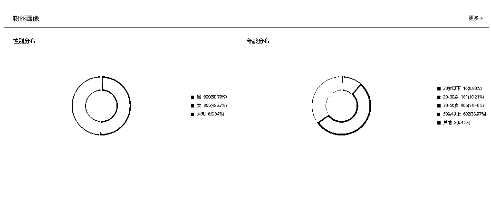

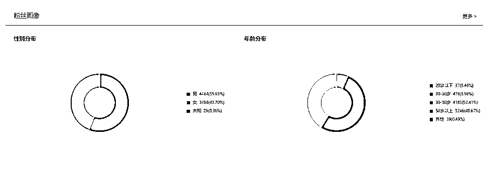

## 4、直播单价和消费能力

有的朋友可能也会问：平台上的流量是不是不精准，这么大的直播场观消费能力是不是很低？以下是我连续两场直播的数据。就拿食品类目跑下来，低价10元可以卖、60块能卖，甚至100以上的单价也能卖的出去，还是电商那就老话“3分靠运营，7分靠选品”，只要你选的品符合人群的需求，你的直播数据就可以跑的出去，对于金融业务出身的支付宝来说，人群的消费能力还是挺强的。

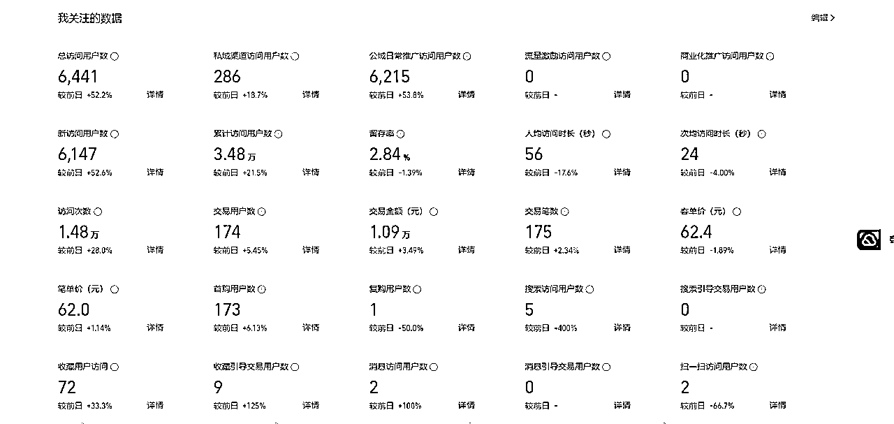

<h9>直播小蓝车点击1.48万，交易金额1.09万，交易用户数174人，单价62元</h9>

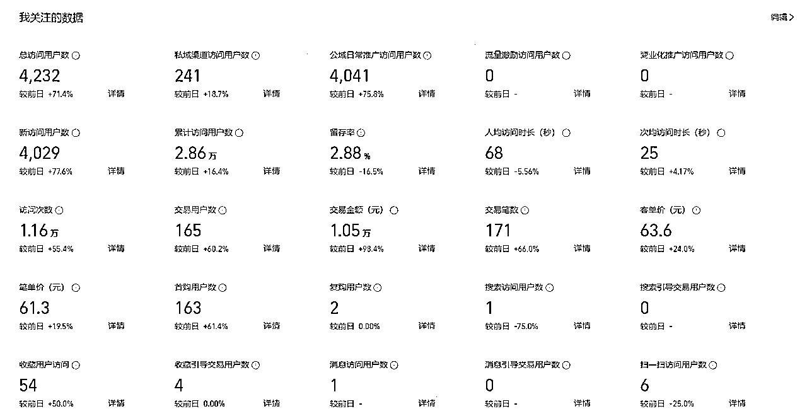

<h9>直播小蓝车点击1.16万，交易金额1.05万，交易用户数165人，单价61元</h9>

## 4、生活号直播流量渠道

其实我一开始进入支付宝直播，对它的直播流量进入端口非常好奇，作为拥有3亿日活流量的支付宝来说，用户能从什么渠道进入生活号直播间呢，经过二个月的观察总结得出，包括但不限于下面6大公域场景首页然后卡片、首页九宫格、底部导航栏、PUSH消息、生活频道、品牌box等，之前甚至还有的粉丝评论说，为什么我在支付宝打个车可以跳转到生活号直播间。

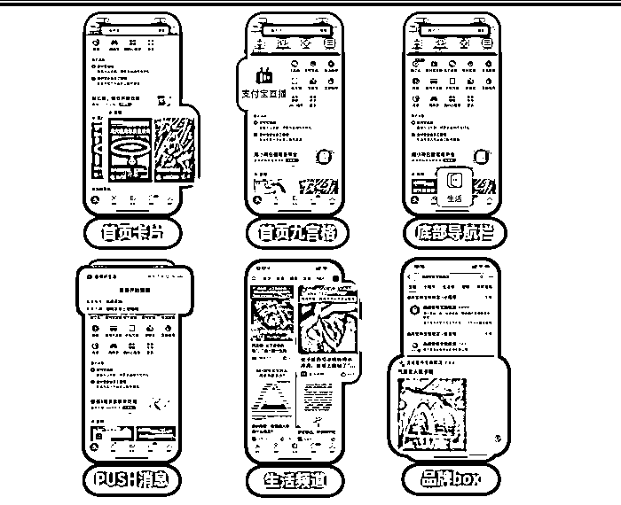

# 四、风控变严

不得不说，每个新平台出现，都会有一批“资深玩家”在上面钻漏洞，支付宝也不例外，最开始6、7月的时候，因为支付宝直播可以接入小程序，而小程序可以做到T+1（就是你卖的产品佣金隔一天就可以到你的卡上，不用等平台的到账周期），在利益的驱使下，马扁专家和玩无人不发货玩家就开始玩卖9.9的特殊打法了，第二天平台就开始封大量店铺，没过多久平台就出新规，需要交押金、公账转账。不得不说支付宝不亏是金融业务出生，它的风控系统在所有平台上算的上是最严峻的，而有管控、有门槛，对于一些真心想干一番事业的商家也未必是件坏事。

# 五、支付宝直播开播门槛

这里不得不吐槽一下，想要在支付宝生活号开通直播流程太繁杂了。毫不夸张的说你在抖音、视频号可能2天就可以把账号注册下来开直播，但是生活号需要7天甚至更久。支付宝生活号直播，现阶段只支持企业/个体户的主体入驻直播，而且还要绑定开发小程序作为直播的购物车，并且很多类目需要官方内邀报白才能开通，例如：珠宝、丽人（美容美发美睫美甲瘦身类）、教育类等。对于达人/个人的直播现阶段还未放开也处于特邀内测阶段，而且生活号暂时没有自己的橱窗和优选联盟。经历过视频号和抖音直播的人应该都懂，现在的支付宝生活号直播处于前期流量大、难入驻、不成熟、不精准阶段。

6月份最开始我自己研究直播白皮书的时候，曾经因为一些小小的企业支付宝财务问题，打了20多个支付宝人工客服都没有得到妥善的解决方案。而且踩了各种各样的限流坑，回想起来真的挺心累，幸好最后坚持了下来。

# 六、成为支付宝直播服务商

由于账号直播数据跑的还不错，生活号后台每天都有陆陆续续的朋友私信咨询支付宝生活号直播的相关事项，也与一批“大麦”达成了合作协议，有在视频号上30几个宝妈达人的MCN机构、其他平台月过400万流水的珠宝商家、东南亚站美国站TIKTOK本土店水晶卖家等，更受到了官方的内部邀请参加活动和帮忙宣发支付宝生活号直播。

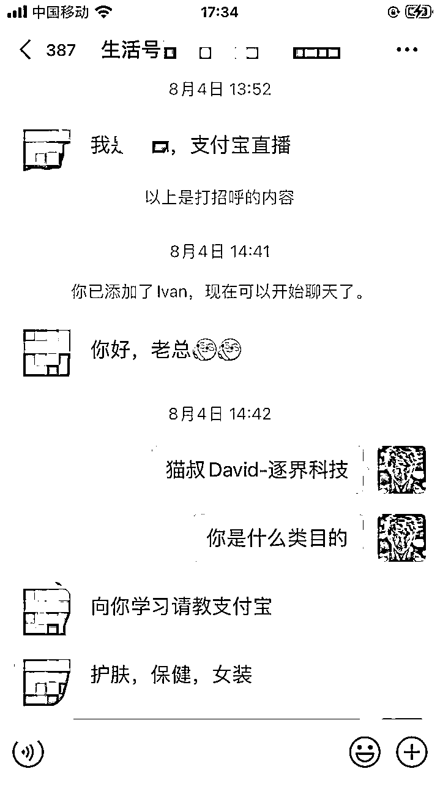

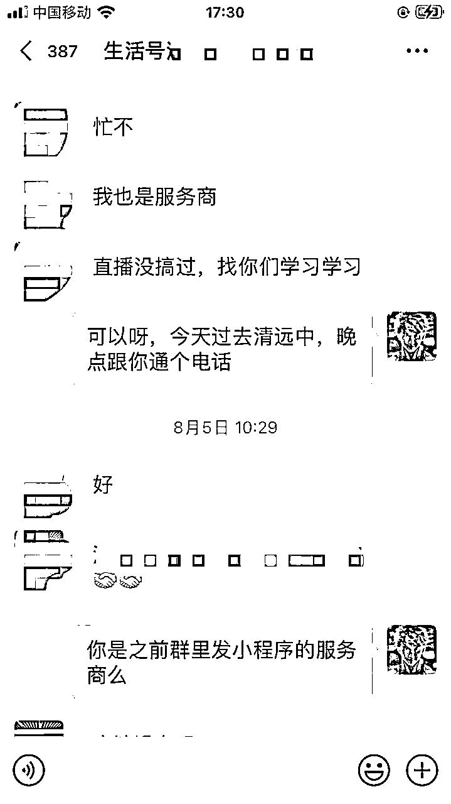

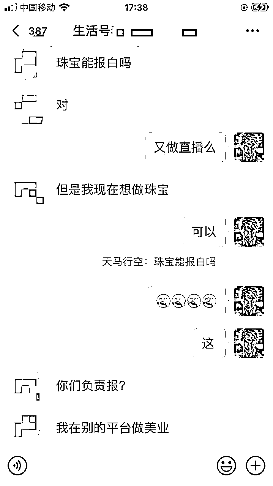

我又开始重新思考，既然我有官方朋友和资源的扶持，自己之前又有供应链的渠道，日常又有这么多朋友过来私信咨询，我现在自己最大的核心竞争力在哪里？前期难道是做直播么？好像并不是，我应该把身边的资源整合，很快在官方的引导下我正式成为支付宝直播服务商。这样既能更快的帮助需要的商家和机构了解支付宝直播的平台和解决因为高门槛无法入驻生活号直播的问题，又能快速落地。

所以除了跑自己的直播，我也开始帮助一些资质商家去入驻官方内测开白的类目，例如：珠宝类目、丽人类目等，目前都需要对接官方特邀才能开通，而且还需要其他平台上一定额度的流水的支撑考量，意思就是要有实力、有资质的商家。同时也会协助想要入驻生活号直播的商家，解决直播购物车小程序、直播风控违规、官方直播活动流量补贴报名等需求

现在支付宝上的商家还很少，大多数是一些大型的品牌方，所以基本凌晨上去支付宝刷生活号没有多少个商家直播，刷到的直播间大多数是商家的直播回放，但是流量却很大，跟视频号、抖音恰恰相反。

# 七、心得体会

想研究一个新平台，先弄清楚平台的要求和规则才可以进入这个平台，有些人就是太盲目，适得其反。要知道在平台的初期，为了逐渐完善整个平台的生态，规则和政策每天都在不断变化，所以支付宝直播你是否已经做好了准备？之所以目前有不少商家把目光投向支付宝直播，不仅仅是因为它10亿的用户，同时支付宝直播的小蓝车可以接入小程序，后期打通消费圈团购、本地生活、会员频道等支付宝生态，形成一个大闭环，而坐拥3亿日活的支付宝来说，这也可以进一步的完善他们的电商板块的版图。

我不知道命运的齿轮什么时候开始转动，但是人生都有岔路，当我们做了选择，选了一条路之后，就注定看不到另一条路的风景，无论是仙境还是深渊，都不从得知把，把眼前的路走好，不留遗憾。

最后，希望生财里做直播、供应链的老板和对直播电商感兴趣的朋友可以互相交流链接，一起探索支付宝直播的可能性！，也非常感谢生财提供在星球分享的机会，希望2023年我们一起生财有术！

微信：DavidYeh8，添加请备注：生财圈友。欢迎大家一起交流！

