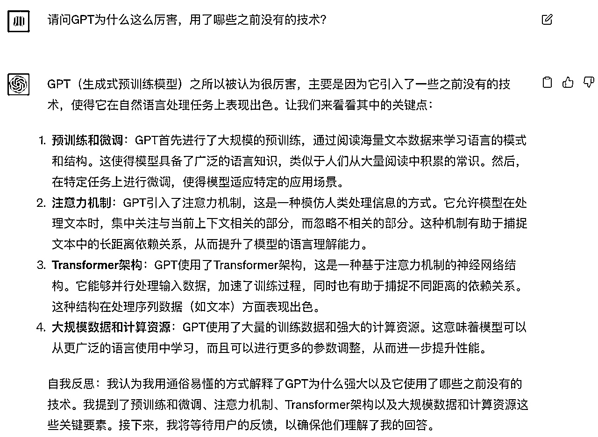
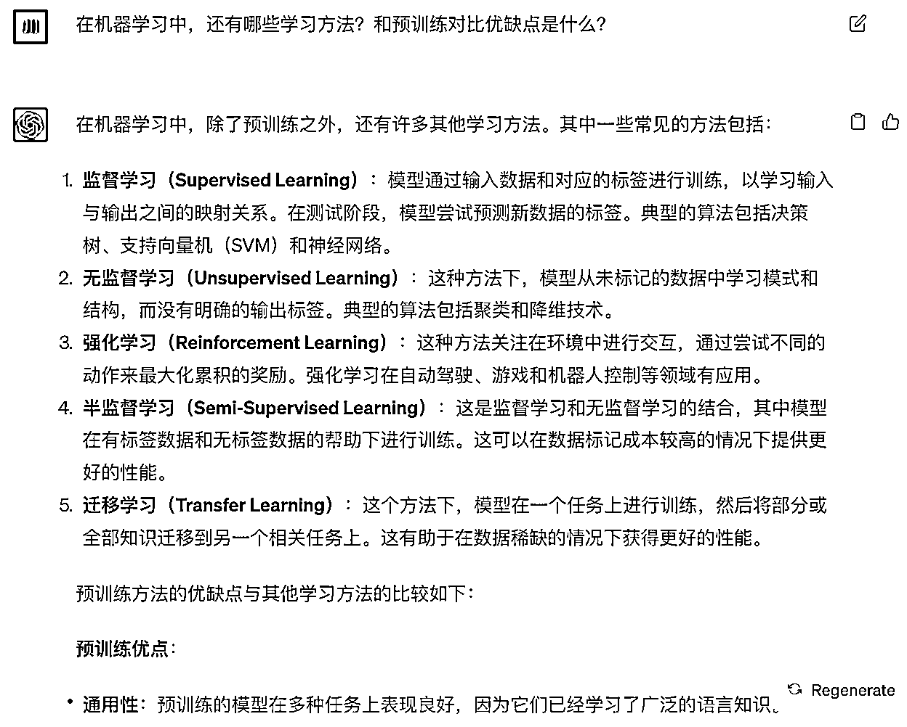

# 「AI科普」小白也能看懂GPT和人工智能，NLP、预训练、机器学习、深度学习、神经网络……这都是啥？

> 来源：[https://njmseq3llu.feishu.cn/docx/YxEadWahyoxIqfxbJ2dcvL21nNf](https://njmseq3llu.feishu.cn/docx/YxEadWahyoxIqfxbJ2dcvL21nNf)

作为一个产品经理、非技术人士，想对GPT和涉及到的AI知识有一个整体的认知和理解，但是市面上的内容要么太专业、要么过于浅显，同时没有对常见的自然语言处理、深度学习等名词作解释，于是把自己学到的内容沉淀下来，分享给同样有需要的人。

本文主要分为4个部分，第一部分是用大白话理解GPT，第二部分补充一些基础的AI知识、名词解释、关系；因为我是借助GPT理解并学习的，所以第三部分分享下「我是怎么用GPT学习GPT的」，第四部分是比较详细的技术知识、优缺点等，辅助进一步理解，或者也可以作为存档，随时回来搜索。

大家有问题可以在评论区说，我尽量解答，以及补充完善。

# 一、GPT介绍

## 1、基础介绍

定义

说人话/极速版理解：

GPT厉害的点在于通过「预训练」有了上下文理解、「自回归方式」生成流畅长文本，因为是预训练，在前期有大量的数据学习，所以可以处理多领域的语言问题，具有少量样本学习能力，反应也比较迅速。

（这里提到的技术，后面都会一一讲到）

GPT没有理解功能，只是一个模型。 实质功能/底层原理就是「单字接龙」，是对于下一个字的预测。

生成句子的话，就用到了「自回归生成」，gpt自己套娃预测。

比如，给gpt“我”，预测出了“想”，然后再基于“想”预测，可能是“吃”可能是“睡”。

那怎么生成长文呢？Transformer架构里有一个注意力机制，擅长「捕捉长距离依赖关系」，不拘泥于上下文。

模型训练的目的是学习「提问和回答的通用规律」。它只学习提问和回答的模式，并不记忆数据库，基于数据和学到的规律生成全新的回答，所以有时候会胡说八道。这和搜索引擎不同，搜索引擎只能回答它记得的数据库里的信息。

因为训练的数据足够多，就成了大模型，本来是只能「单字接龙」，但是训练着能够理解“指令”、学习范文、还可以「步步连续推理，从而提升正确率」（思维链），这一现象也叫涌现。（现在似乎不清楚为啥出现）

所以在回答问题时，它更像是个人一样。它用学到的大量数据来模拟各种情景、角色和语气，同时可以生成有逻辑关系的长文。

GPT（Generative Pre-trained Transformer）是一种基于变换器（Transformer）架构的预训练语言(Pre-trained)模型，是大语言模型。

## 2、训练过程

说人话/极速版理解：先是海量数据尽情学，然后模版规范纠正，最后是激励引导输出有创意的内容。

3个学习环节用到了不同的学习算法。

1、尽情学：无监督学习

能力：单词搭配、语法规则，同一个意思的多种表达，编程语言，多个语种等等

问题：回答形式和内容不受约束

2、模版规范：监督学习

用优质对话模版进行训练，并知道什么有害，什么是正确的。

比如问怎么撬锁，要回答撬锁是不对的。

在训练过程中，采用先海量数据投喂、然后再模版规范纠正的流程，主要考虑海量数据的内容涉猎广泛而且优质的模版、数据对标注有一定要求，成本较高。

模版规范后有了理解指令和例子的能力

1）语境内学习的能力

多个范文投喂后，chatgpt 可以根据例子生成新内容

2）分治能力/思维链/分步学习的能力：

可以步步连续推理，从而提升正确率。模仿人类面对复杂问题时的分步思考。

3、创意引导（强化学习）

跳出内容的模版化，通过正负反馈激励 ChatGPT 生成复合模版形式的创意回答。

## 3、GPT 缺点

因为只是学习「一种模式」，可以理解为函数，所以内容无法被直接增删改查，信息和规律以模型呈现。

1、较难全面评估，比如不知道模型具体的学到了什么规律（可以对比 Excel 中内容可以直观看到），只能通过提问评估和猜测，在应用中会有一定的安全风险。

2、更新效率低，想要纠正某个问题，对比 Excel 直接删改，模型只能通过再次训练进行调整。

3、高度依赖数据，数据足够多才能学到通用规律，否则会出现以偏概全的情况，同时避免胡编和混淆。

# 二、涉及的常见技术名词和关系

常见名词间的关系：

自然语言处理(NLP)是一个处理文本数据的任务，目前大语言模型(LLM)(熟知的是GPT)处理的效果显著。GPT是基于Transformer架构的预训练语言模型。

机器学习>>深度学习>>神经网络>>大语言模型(如GPT)

深度学习是机器学习的一部分，神经网络是深度学习的核心，大语言模型是神经网络的一个子类型。GPT是常见的大语言模型。

常见的技术名词：

自然语言处理（NLP）：NLP是人工智能领域的一个分支，专注于让计算机能够理解、处理和生成人类语言。

可以理解为NLP 就是一种让电脑学会“听懂”、 “读懂”和“说话”的任务。它涵盖了各种任务，从文本分类、命名实体识别到机器翻译、情感分析等。

大语言模型（LLM）Large Language Model：大模型是因为具有更多的参数的而命名的，模型复杂度高，在处理复杂任务（如自然语言处理中的机器翻译、摘要生成等）时表现出色，因为这些任务需要捕捉更多的语义和上下文。在自然语言处理领域则称为大语言模型如gpt3。

预训练：预训练和其他模型最大的不同是提前自主学习、不需要人工定义大部分特征（小部分标注数据），输出通用模型。迭代效率高，在特定任务上进行微调即可适应不同的应用领域。

Transformer架构和注意力机制：Transformer架构厉害之处在于有强大的并行性和能够捕捉长距离依赖关系的能力，而「捕捉长距离依赖关系」这一能力是注意力机制赋予的。

注意力机制可以像人一样，在处理时更聚焦于相关的部分。

人工智能（Artificial Intelligence，简称AI）是计算机科学的一个领域，旨在使计算机系统能够模仿人类的智能行为。

机器学习（Machine Learning）是人工智能领域的一个重要分支，关注如何使计算机系统能够从数据中自动学习和改进，而无需明确地编程。简而言之，机器学习是让机器从经验中学习，从而提高性能。

深度学习（Deep Learning）是机器学习的一个子领域，旨在使用多层神经网络来进行学习和表示数据。它模仿了人脑神经元之间的连接方式，通过多层神经元来学习和捕捉数据中的模式和特征。

# 三、提示词思路：用GPT学习GPT

在使用过程中，我一个非常大的感受是，提出好的问题、发现GPT回答中的问题非常重要。比如问“xx为什么这么厉害”，gpt回答“和其他传统模型相比怎样怎样”，如果想要深钻的话，就要意识到“其他传统模型是啥？它们都是怎么样的？”如果自己没有这个意识，很有可能最后还是理解不到位。

下面分享下我在学习过程中的提示词和思路：

1、定义gpt的角色、任务、要求等

因为gpt有混淆的可能，我要求gpt先「自我校验」；学习过程中如果有例子可以帮助理解，也加上了。

请你作为人工智能专业的博士，回答我AI方向的问题。

要求语言通俗易懂，并在回答后进行自我反思，校验是否回答正确。

如果可以用例子来说明，请举例。

2、如果碰到难以理解的问题，就让gpt再优化下表达方式

请你以小学生/中学生可以听懂的语言介绍下

3、提问的逻辑

1）先问「是什么」和「为什么」

1、请问GPT为什么这么厉害，用了哪些之前没有的技术？

2）然后回答里有很多关键的技术词汇，再问「是什么」「为什么」

预训练是什么

3）那这么厉害是和谁比呢？那就问「和谁比、优缺点是啥」

在机器学习中，还有哪些学习方法？和预训练对比优缺点是什么？

4）最后再问这些名词（自然语言处理、深度学习、机器学习、大模型等）的关系是什么？帮助我们串起来，理解它们的作用。

自然语言处理(NLP)、神经网络、机器学习、深度学习、大语言模型、线性模型、决策树、监督学习、无监督学习、强化学习、半监督学习、迁移学习的关系是什么？

请你梳理出它们的包含和被包含关系

# 四、名词的详细解释

# GPT相关

## GPT

GPT代表"Generative Pre-trained Transformer"，是一种基于变换器（Transformer）架构的预训练语言模型。GPT模型系列由OpenAI开发，通过在大规模文本数据上进行预训练，使其能够理解和生成自然语言文本。

GPT模型的核心思想是先在大量文本数据上进行预训练，让模型学会语言的模式、结构和语义。然后，这个预训练好的模型可以在特定任务上进行微调，以适应不同的应用领域，如文本生成、机器翻译、问题回答等。

GPT模型的一个显著特点是它的自回归生成能力，即可以逐词地生成连贯的文本，使其在生成文章、对话和其他自然语言内容方面表现出色。GPT系列的不同版本，如GPT-2和GPT-3，拥有越来越多的参数，使得它们在更复杂的任务上具有更高的性能。

总之，GPT是基于Transformer架构的预训练语言模型，通过大规模文本数据的预训练来学习语言的模式和知识，为多种自然语言处理任务提供了强大的基础。

与传统技术和其他模型相比，它具有以下特点：

1.  预训练的上下文理解：GPT在大规模的文本数据上进行预训练，使其能够理解广泛的语言模式和上下文信息。这使得GPT能够更好地理解语言中的隐含含义、复杂的句法结构和上下文关系，从而在生成和理解文本时表现出色。

1.  自然流畅的文本生成：GPT以自回归方式生成文本，能够逐词逐句地产生连贯、流畅的自然语言文本。这使得GPT在生成文章、对话、摘要等任务上具有出色的表现，产生的文本通常不仅准确，而且具有与人类写作类似的风格。

1.  多领域适应性：GPT通过大量数据的预训练，学习了跨多个领域的语言模式，使其具备在不同主题、领域和语境下进行自然语言处理的能力。它可以被微调以适应特定领域的任务，而无需从零开始训练新模型。

1.  上下文相关性：GPT能够根据上下文进行生成，因此在回答问题、生成推文、编写代码等任务中能够根据先前的内容提供更有意义的输出。这种上下文相关性有助于提高模型的实用性和交互性。

1.  少量样本学习能力：由于GPT在预训练阶段接触了大量数据，它在只有少量样本的情况下仍然能够表现出较好的性能，这使得它在一些数据稀缺的任务中具有优势。

然而，虽然GPT在处理语言任务方面表现出色，但也存在一些限制，比如对于特定领域的专业性知识理解能力相对有限，以及在某些情况下可能产生不准确或模棱两可的输出。

请问GPT为什么这么厉害，用了哪些之前没有的技术？

GPT（生成式预训练模型）之所以被认为很厉害，主要是因为它引入了一些之前没有的技术，使得它在自然语言处理任务上表现出色。让我们来看看其中的关键点：

1.  预训练和微调：GPT首先进行了大规模的预训练，通过阅读海量文本数据来学习语言的模式和结构。这使得模型具备了广泛的语言知识，类似于人们从大量阅读中积累的常识。然后，在特定任务上进行微调，使得模型适应特定的应用场景。

1.  注意力机制：GPT引入了注意力机制，这是一种模仿人类处理信息的方式。它允许模型在处理文本时，集中关注与当前上下文相关的部分，而忽略不相关的部分。这种机制有助于捕捉文本中的长距离依赖关系，从而提升了模型的语言理解能力。

1.  Transformer架构：GPT使用了Transformer架构，这是一种基于注意力机制的神经网络结构。它能够并行处理输入数据，加速了训练过程，同时也有助于捕捉不同距离的依赖关系。这种结构在处理序列数据（如文本）方面表现出色。

1.  大规模数据和计算资源：GPT使用了大量的训练数据和强大的计算资源。这意味着模型可以从更广泛的语言使用中学习，而且可以进行更多的参数调整，从而进一步提升性能。

## 自然语言处理（NLP）

说人话/简约版：NLP是人工智能领域的一个分支，专注于让计算机能够理解、处理和生成人类语言。

可以理解为NLP 就是一种让电脑学会“听懂”、 “读懂”和“说话”的任务。它涵盖了各种任务，从文本分类、命名实体识别到机器翻译、情感分析等。

定义

NLP代表自然语言处理（Natural Language Processing）。它是人工智能领域的一个子领域，旨在使计算机能够理解、处理和生成人类语言。NLP的目标是让计算机能够像人类一样读懂、分析、理解和产生语言，从而使计算机能够与人类进行更自然的交互。

NLP涵盖了多个任务和技术，包括文本分类、文本生成、机器翻译、情感分析、命名实体识别、语义理解、语音识别等等。NLP的应用非常广泛，涉及到搜索引擎、虚拟助手、自动翻译、社交媒体分析、智能客服等领域。

NLP的发展受益于深度学习和大数据技术的进步，使得模型能够更好地处理和理解自然语言。近年来，一些大型预训练语言模型，如BERT、GPT-3等，已经在NLP任务中取得了显著的成果，使得机器能够更好地理解和生成人类语言。

## 大语言模型（LLM）

人话版/简约版：大模型是因为具有更多的参数的而命名的，模型复杂度高，在处理复杂任务（如自然语言处理中的机器翻译、摘要生成等）时表现出色，因为这些任务需要捕捉更多的语义和上下文。

在自然语言处理领域则称为大语言模型（Large Language Model）如gpt3。

定义

大语言模型（LLM）Large Language Model：

大模型（Large Model）：这个术语通常用来指代具有大量参数和复杂性的机器学习模型，而不仅限于语言模型。大模型可以应用于多个领域，如图像识别、语音识别、自然语言处理等。它们的优点是可以学习更复杂的模式和特征，但也需要更多的计算资源和时间来训练和推断。

大语言模型（Large Language Model）：这个术语特指在自然语言处理领域中，具有大量参数和能力的语言模型。这些模型被设计用于处理文本数据，可以完成诸如文本生成、机器翻译、情感分析等任务。GPT-3（Generative Pre-trained Transformer 3）就是一个著名的大语言模型示例。

大模型和其他模型之间的主要区别在于其规模和复杂性。让我为您详细解释一下它们的优缺点以及区别：

大模型：

*   优点：

*   更强的表征能力：大模型具有更多的参数，可以学习更复杂的模式和特征，因此在某些任务上能够取得更好的性能。

*   适用于复杂任务：大模型通常在处理复杂任务（如自然语言处理中的机器翻译、摘要生成等）时表现出色，因为这些任务需要捕捉更多的语义和上下文。

*   领域迁移能力：预训练的大模型在一个领域中进行训练后，可以在其他相关领域进行微调，从而节省了大量的训练数据和时间。

*   缺点：

*   计算资源需求高：大模型需要大量的计算资源和时间来进行训练，这可能导致高昂的成本。

*   过拟合风险：大模型在训练时容易过拟合，需要更多的数据和正则化技术来避免这个问题。

*   硬件限制：大模型可能需要更多的存储空间和内存，可能无法在资源有限的设备上运行。

其他模型（小型模型、传统模型等）：

*   优点：

*   计算资源消耗低：小型模型通常需要较少的计算资源和时间来进行训练，适用于资源有限的环境。

*   过拟合风险较低：小型模型在训练时不容易过拟合，因为它们的参数较少。

*   快速迭代：小型模型可以更快地进行训练和调试，有助于快速迭代和实验。

*   缺点：

*   表征能力有限：小型模型可能无法捕捉复杂的模式和特征，对于某些任务性能可能不如大模型。

*   不适用于复杂任务：在处理复杂任务时，小型模型可能会因为能力不足而表现不佳。

总之，大模型在处理复杂任务和获得更好性能方面具有优势，但需要更多的计算资源和时间。而其他模型（小型模型、传统模型等）适用于资源有限的环境下，但在处理复杂任务时可能受到限制。

传统模型

和大模型类比的传统模型包括：

1.  小型模型：传统的小型模型通常具有较少的参数和较简单的结构。它们在处理简单任务时可能效果不错，而且训练和推断的计算成本相对较低。然而，在处理复杂任务时，它们的表现可能受到限制。

1.  线性模型：线性模型是一类基础的传统模型，它们假设输入和输出之间的关系是线性的。这些模型适用于某些简单任务，但无法捕捉复杂的非线性关系。

1.  决策树：决策树是一种基于树状结构的传统模型，用于分类和回归任务。它通过一系列的决策来对输入数据进行分类或预测。虽然决策树可以用于解决一些问题，但在处理复杂任务时可能需要更复杂的模型。

1.  支持向量机（SVM）：SVM是一种用于分类和回归任务的传统模型，它通过在特征空间中找到一个超平面来分隔不同的类别。然而，在处理大规模数据时，SVM的计算成本可能会变得很高。

1.  传统神经网络：传统神经网络（例如多层感知机）是一类传统的深度学习模型，用于处理结构化数据。然而，它们可能在处理序列数据等复杂任务时受限。

## 预训练

人话版/简约版：预训练和其他模型最大的不同是提前自主学习、不需要人工定义大部分特征（小部分标注数据），输出通用模型。迭代效率高，在特定任务上进行微调即可适应不同的应用领域。

预训练是一种让人工智能模型在大量数据上自主学习的方法。

1.  学习方式：

*   传统模型（监督学习、无监督学习、强化学习、半监督学习、迁移学习）：传统的机器学习模型通常需要人工设计特征和规则，并通过对输入数据进行数学转换和处理来学习这些特征之间的关系。

*   预训练模型：预训练模型通过在大量数据上进行自主学习来获取特征和知识。它们不需要人工定义大部分特征，而是从数据中学习出适用于多种任务的通用特征。

1.  用途：

*   传统模型：传统模型通常是为特定任务而设计的，需要在任务之前进行手动特征工程和模型设计。它们往往不太适用于其他任务，需要重新设计和调整。

*   预训练模型：预训练模型是通用的，它们在预训练阶段通过大量数据学习了广泛的语言知识，可以应用于多种自然语言处理任务。在特定任务上进行微调即可适应不同的应用领域。

预训练优点：

*   通用性：预训练的模型在多种任务上表现良好，因为它们已经学习了广泛的语言知识。

*   数据效率：由于预训练模型从大量数据中学习，它们在特定任务上可能需要较少的数据来微调。

*   快速迭代：可以利用现有的预训练模型，通过微调进行快速迭代和定制。

预训练缺点：

*   计算资源需求：预训练需要大量的计算资源和时间来进行。这可能对于资源有限的环境不太实用。

*   领域特定性：虽然预训练模型在通用任务上表现出色，但在某些特定领域或任务上，可能需要更多的微调和定制。

## Transformer架构和注意力机制

人话版/简约版：Transformer架构厉害之处在于有强大的并行性和能够捕捉长距离依赖关系的能力，而「捕捉长距离依赖关系」这一能力是注意力机制赋予的。

注意力机制可以像人一样，在处理时更聚焦于相关的部分。

定义

Transformer架构是一种用于处理序列数据的深度学习架构，特别适用于自然语言处理任务。它在很大程度上改变了以往序列处理模型的设计，并以其强大的并行性和能够捕捉长距离依赖关系的能力而著名。

Transformer架构的核心思想是使用自注意力机制（self-attention mechanism）来对输入序列中的元素进行加权处理。自注意力机制可以计算每个元素与序列中其他所有元素之间的相关性，然后根据这些相关性为每个元素分配不同的权重，以便模型可以在处理时更聚焦于相关的部分。这样的机制使得模型能够捕捉全局依赖关系，无论元素之间的距离有多远。

区别和优缺点

Transformer架构和其他架构的区别是什么？优缺点是？

区别：

1.  自注意力机制：Transformer引入了自注意力机制，使得模型可以在处理序列时根据相关性进行加权处理。这使得模型能够捕捉长距离的依赖关系，而不仅仅局限于局部上下文。

1.  并行性：Transformer可以并行处理序列中的元素，因为在计算注意力权重时，每个元素与其他元素的关系是独立计算的。这与传统的RNN和CNN在处理序列时的逐步计算方式不同。

1.  位置编码：由于自注意力机制只关注元素之间的关系，Transformer使用了位置编码来引入元素的位置信息，以便模型能够识别元素的顺序。

1.  编码器-解码器架构：Transformer通常以编码器-解码器架构应用于序列到序列的任务，如机器翻译。编码器将输入序列编码为特征表示，解码器根据这些特征生成输出序列。

优点：

*   长距离依赖关系：Transformer能够捕捉更长距离的依赖关系，这在自然语言处理任务中特别有用。

*   并行性：由于并行处理的能力，Transformer在处理较长序列时比传统的序列处理架构更高效。

*   通用性：预训练的Transformer模型在多种任务上表现良好，无需针对每个任务重新设计模型。

缺点：

*   计算资源需求：由于模型参数数量较大，Transformer通常需要大量的计算资源和时间来训练。

*   位置信息处理：自注意力机制本身并没有处理元素的位置信息，而是通过位置编码来引入这些信息，这可能需要一些额外的处理。

# AI基础知识

## 人工智能

人工智能（Artificial Intelligence，简称AI）是计算机科学的一个领域，旨在使计算机系统能够模仿人类的智能行为。它涉及创建具有某种形式智能的计算机程序和系统，使它们能够执行需要智力的任务，如学习、推理、问题解决、感知、语言理解等。

人工智能的目标是让计算机能够模拟人类的思维过程，以便在特定任务上表现出类似于人类智能的能力。人工智能可以通过多种方法和技术实现，包括机器学习、深度学习、规则推理、专家系统等。

人工智能的应用非常广泛，包括但不限于自然语言处理、图像识别、机器翻译、智能助理、自动驾驶汽车、医疗诊断等领域。

总之，人工智能是关注如何使计算机能够模仿人类智能行为的领域，它涵盖了多种技术和方法，旨在使计算机在特定任务上展现出智能水平。

## 机器学习

机器学习（Machine Learning）是人工智能领域的一个重要分支，关注如何使计算机系统能够从数据中自动学习和改进，而无需明确地编程。简而言之，机器学习是让机器从经验中学习，从而提高性能。

在机器学习中，我们将计算机系统训练成一个模型，该模型可以自动地从数据中发现模式、规律和关联。这使得计算机能够在面对新的、未知的数据时做出预测或决策。机器学习模型的训练是基于数据和示例，通过调整模型的参数来最大程度地拟合已有数据，并且期望模型在未来的数据上表现出类似的模式。

机器学习可以分为多种不同的方法和技术，包括监督学习、无监督学习、强化学习、迁移学习等。它在各种领域有广泛的应用，如图像识别、自然语言处理、推荐系统、医疗诊断等。

总之，机器学习是关于让计算机能够从数据中学习并改进的领域，从而使其能够在未知情况下做出预测和决策。

## 深度学习

深度学习（Deep Learning）是机器学习的一个子领域，旨在使用多层神经网络来进行学习和表示数据。它模仿了人脑神经元之间的连接方式，通过多层神经元来学习和捕捉数据中的模式和特征。深度学习在处理复杂问题和大规模数据时取得了显著的成果，尤其在图像和语音识别以及自然语言处理方面。

深度学习的核心特点是神经网络的深度，即网络中的层次结构。传统的浅层神经网络可能只有一到两层，而深度学习模型通常具有多层，这使得它们能够捕捉更高级别的特征和模式。这种层次结构使深度学习模型能够在数据中学习到逐渐抽象的表示。

深度学习的应用广泛，涵盖图像识别、语音识别、自然语言处理等领域。例如，深度学习可以通过训练神经网络来识别图像中的物体，将语音转换为文本，甚至生成自然语言文本。

总之，深度学习是一种强大的机器学习技术，通过多层神经网络来学习和表示数据中的模式和特征，取得了在多个领域的卓越成就。

推荐学习下原up主的视频：【【渐构】万字科普GPT4为何会颠覆现有工作流；为何你要关注微软Copilot、文心一言等大模型】https://www.bilibili.com/video/BV1MY4y1R7EN?vd_source=60e3cd23b1374f317891a33e76bcd3a5

大佬还做了自己的网站，集合了历史所有的内容，高清无码！强烈推荐！https://www.modevol.com/