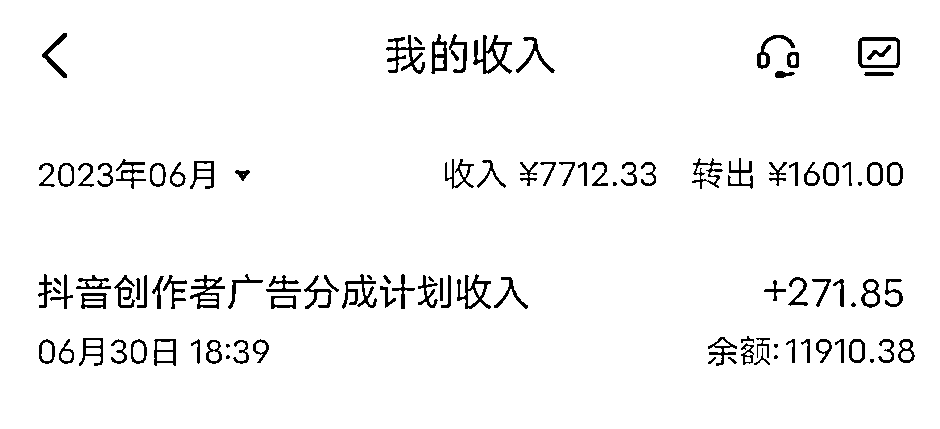
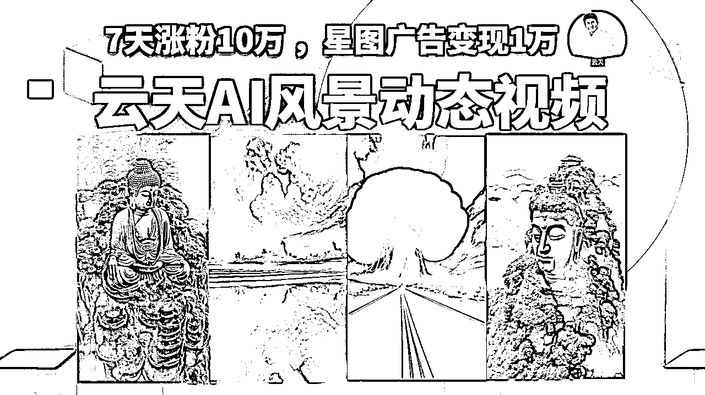
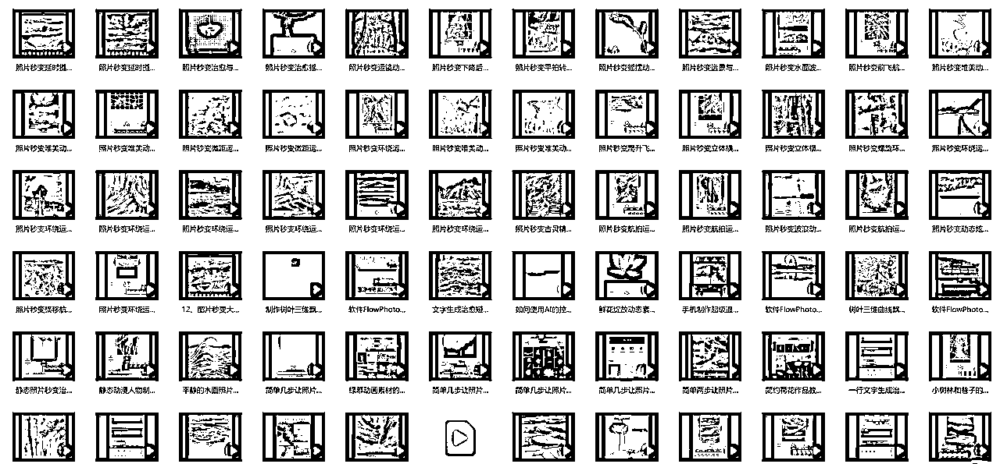
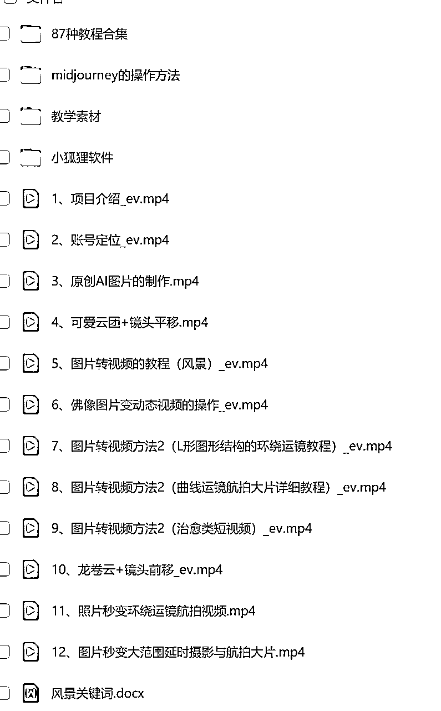

# 治愈类风景航拍动图视频制作，7天涨粉10万 ，星图广告变现1万

> 来源：[https://ixy2s5ruvqf.feishu.cn/docx/YrsGdbgWJoxCjWxTShWc26kYnVf](https://ixy2s5ruvqf.feishu.cn/docx/YrsGdbgWJoxCjWxTShWc26kYnVf)

# 前言

各位小伙伴们，大家好，我是云天，前段时间出了小和尚和老者说话、AI头像的课程，很受大家欢迎，这里也感谢各位圈友的认可。

最近很多人问我像上面这类治愈类风景视频是如何做的，看上去不像是现场拍摄的，应该是AI生成的，经过我的多方打探，发现竟然有人7天涨粉10万 ，星图广告变现1万。

于是按耐不住我爱分享的精神，结合以往大家并不喜欢看文字教程，给大家出了一套保姆级的详细的视频课程，供大家参考学习。

我们将通过如下几个方面进行展示：

1、玩法介绍

2、账号定位

3、准备工作和环境搭建

4、原创图片的制作过程

5、图片转视频的教程

6、佛像图片变动态视频的操作

7、图片转视频方法2 (L形图形结构的环绕运镜教程)

8、图片转视频方法2 (曲线运镜航拍大片详细教程)

9、图片转视频方法2(治愈类短视频)

10、龙卷云+镜头前移

11、可爱云团+镜头平移

# 1、玩法介绍

# 2、账号定位

# 3、原创图片的制作过程

用到的小程序：

# 4、图片转视频的教程

软件在文章最后，提供了网盘版本。

# 5、佛像图片变动态视频的操作.mp4

# 6、图片转视频方法2 (L形图形结构的环绕运镜教程)

# 7、图片转视频方法2 (曲线运镜航拍大片详细教程)

# 8、图片转视频方法2(治愈类短视频)

# 9、龙卷云+镜头前移

# 10、可爱云团+镜头平移

# 11、素材和软件安装包

包含90多种软件操作细节教程!!!

另外还有大量的素材和安装包，可以在下方网盘获取。

链接：https://pan.baidu.com/s/1C0NP8vs-md0WE0FekIF9LQ?pwd=d1dt

提取码：d1dt

--来自百度网盘超级会员V10的分享

# 写在最后：

好了，写这么多，如果你对我拆解的项目比较感兴趣，可以去实际操作下这个项目

因为现在这种视频流量确实很大，实操一遍之后你会发现，做起来真的很简单，外面有培训这个项目都要499-999，也别让人家去割你韭菜，你看完我拆解的基本上可以去测试了，如果你有问题在找我交流哈！