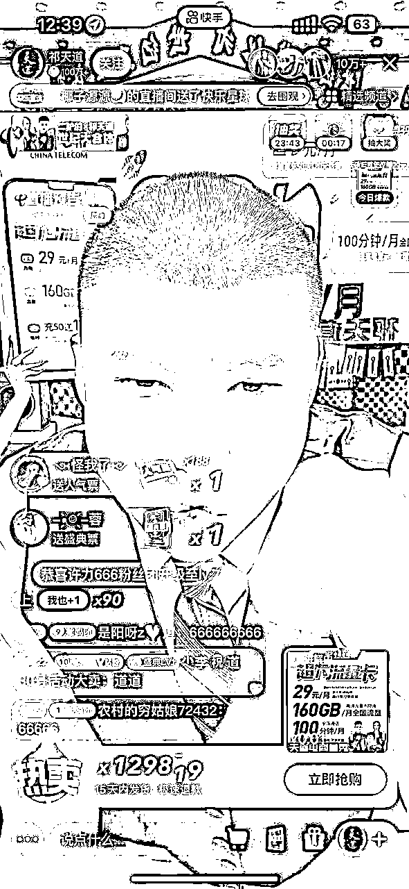
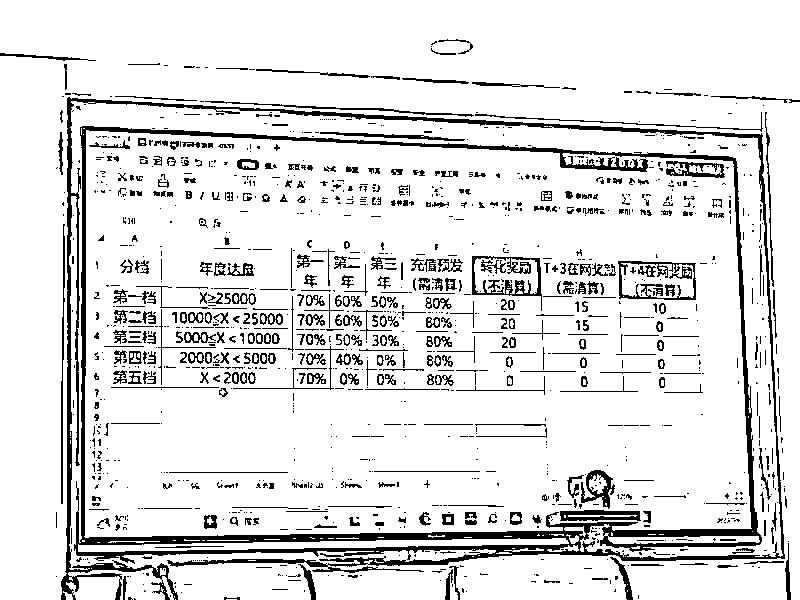
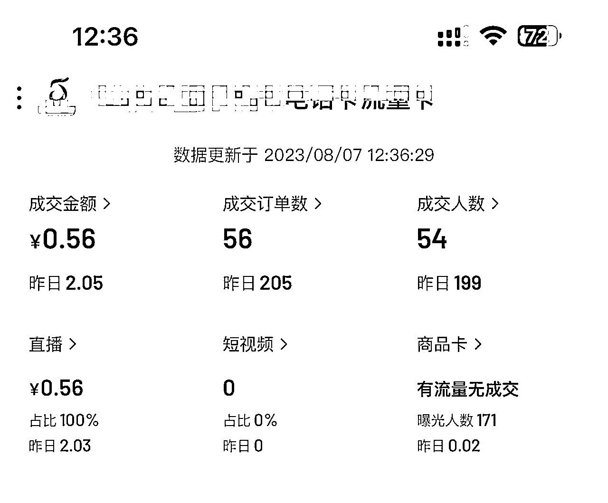

# 直播间售卖手机卡，实现年入百万

> 来源：[https://rad7nmnpd6.feishu.cn/docx/ZRUIdkOYyodJkfxdreJcrVQYnx7](https://rad7nmnpd6.feishu.cn/docx/ZRUIdkOYyodJkfxdreJcrVQYnx7)

大家好，我是阿阳，一个来自哈尔滨创业的95后，主业目前从事通信行业，在做手机号卡，已经有2年多的时间，虽然接触这个行业有点晚，但是也从中抓住了很多的机会，因为线上办理流量卡的资费要比线下办理的套餐优惠的很多，现在手机大家一般都是2个卡槽，一个作为主号常用，一个作为副卡，主要使用流量，这就衍生了很大的市场，

目前这个行业很多上市公司集团也都在做，上图是某个大公司找达人带货1小时左右的出的单量，现在大家基本都刷到过这种直播间，有达人带货的，电影直播间挂小雪花的，视频带货的，还有一些商家自播的直播间，总之现在比之前能看到的更多，也有越来越多的人涌入了这个行业，直播赛道的成本也越来越高。

## 项目利润如何

为什么越来越多的人会涌入到这个行业中来，不明白的人是真的不知道卖0.01这个钱是怎么赚的，所以说这个行业很暴力的，具体模式主要有二种：主要分为分销和直签，分销分为秒返和次月返，秒返比次月返要低一些，次月返大概佣金80-200左右一张，每张卡的套餐资费不一样，返的佣金价格也不一样，我们每张按130来算，每天激活100单，100*130=13000每天毛利，当然现在自然流量很难（表单30左右）200*30=6000 再去1000人工房租水电成本13000-7000=6000左右 一个月30天 30*6000=18W

还有一种是直签，也就是按月拿钱，月月返的模式，根据体量大小，运营商会给出相应的政策，这种回本周期会时间长一点，但是用户用的时间越长佣金越高，适合资金流充裕的。

（新店铺目前直播数据）

## 项目人员配置

项目目前需要的人员配置，一般2-3个主播一个直播间，每天直播8-12小时左右，运营2个人，运营可以兼职运营助理的工作，只需要做一些公屏的互动维护就可以了，一个直播间大概需要3-4个人的客服团队处理咨询问题，直播间搭建很简单，一台电脑，一个绿幕，摄像头，或者用手机播，付费 千川通投拉满就可以了。

## 项目实操

直播售卖：小黄车的形式、小雪花的形式（如何提升运营转化，有更多的人拍下），跟传统直播流程差不多，只是传统的直播出售的是大家常见的实实在在的商品，而这个是一张手机卡，但是也是需要邮寄到消费者手中的，所有，其实原理都一样，客户进到直播间就是主播话术的培训，话术基本上差不多，无非就是介绍一下具体的套餐，流量多少，通话多少，比你正常使用的手机卡便宜很多，一分钱你可以下单买回去试试，不合适可以直接退，一分钱包邮，你只需要花一分钱，就可以每个月节约多少钱之类的话术。这个行业还有一个特别大的优点，那就是又是实物，又零库存，还有人一件代发，不仅仅一件代发，还不要运费，（运费运营商那边承担）

直播卖卡的流量怎么获取：

第一种方式就是简单粗暴，也是这个行业大部分商家的方式，投流，狠狠的投流，一个月几百万几千万的投，只要能投出去，只卖一分钱；

第二种方式，就是纯自然流，反正白送，每天怎么也能送出去几张，送出去客户充值了，你就赚钱了，客户不充值你只浪费了时间；（起号时间周期会长一些，会慢一些）做个人IP，每天介绍一些手机知识，手机卡的知识，积累了垂直粉丝，然后在开播，开播的时候也会相应的投流，这种转化率，激活率，成本都会低很多，又有量成本又低，也是最赚钱的模式。

私域：在朋友圈，线下销售也可以的，通过专属的订单链接，只要有人下单，你就会有佣金，这个流程目前已经很通畅了，很多供应商都有这个能力。（激活率最高的渠道，有资源的可以考虑）

## 门槛

这个行业入门主要有两点：第一，要找到供应商或者有人带你入门，否则货源去哪里找你都没法搜索，当然您也可以直接去跟运营商自己签约，但是自己签约会有很多问题，比如你要有技术对接能力，你要有大量的资金垫付，你还需要完成最高的量才能拿到最高的佣金，完不成任务你能拿到的佣金要远远低于从供应商那边拿到的佣金。如果遇到不良的上游供应商会出现偷量的情况，比如你卖了100张，实际激活了80张，但是给你结算的时候说你只激活了50张，那30张的佣金就给你偷走了，甚至有中间骗单的情况，直接不给你结算，你人都找不到，所以，这个行业的合作要选择有实力有规模的公司，并且口碑好的，没有拖欠佣金的行为。关于选择靠谱的供应商，这个大家最好找一个领路人，然后入行，入行以后，你会接触到很多的合作伙伴

行业缺点：这个行业受政策影响比较重，早期的时候，是没有实名制的，后来实名制实习很长时间不能继续卖，后来终于打通了合规，可以实现线上实名，快递员上门激活等等流程，现在又迎来了新的问题，因为行业发展太快，严重影响了运营商的利益，所以，每年都有那么几天，运营商要竞和（就是移动联通电信老大做在一起喝喝茶，聊聊天，然后说，兄弟们最近咱们资费太便宜了，咱们能不能一起涨价一下，三个大哥一拍即合，我们就没有产品卖了），过了一段时间，可能联通哥哥说，最近用户增长压力有点大，我不管你们了，我要降价，我们就开始了特别舒服的日子。