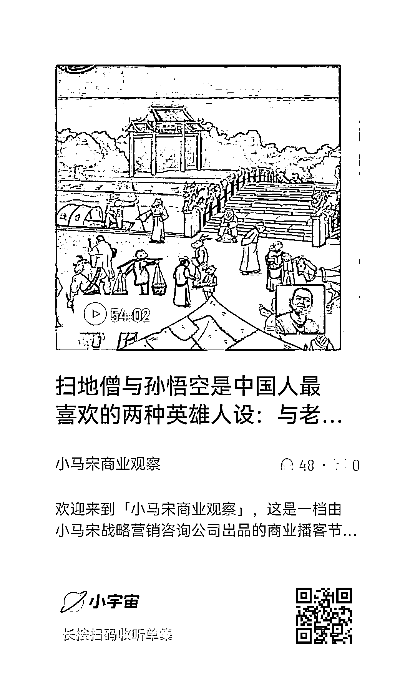

# 聊聊刀郎的新歌《罗刹海市》这个事件

> 原文：[`www.yuque.com/for_lazy/thfiu8/ugllkrgc17eiffoa`](https://www.yuque.com/for_lazy/thfiu8/ugllkrgc17eiffoa)

<ne-h2 id="82715bb2" data-lake-id="82715bb2"><ne-heading-ext><ne-heading-anchor></ne-heading-anchor><ne-heading-fold></ne-heading-fold></ne-heading-ext><ne-heading-content><ne-text id="u779b7ee8">(77 赞)聊聊刀郎的新歌《罗刹海市》这个事件</ne-text></ne-heading-content></ne-h2> <ne-p id="u4efacf41" data-lake-id="u4efacf41"><ne-text id="ubfea2d90">作者： 小马宋</ne-text></ne-p> <ne-p id="u9e951cd6" data-lake-id="u9e951cd6"><ne-text id="u5bb6ffba">日期：2023-08-04</ne-text></ne-p> <ne-p id="u94e666bd" data-lake-id="u94e666bd"><ne-text id="u9a52891d">刀郎，扫地僧与孙悟空</ne-text></ne-p> <ne-p id="ua61bdc4b" data-lake-id="ua61bdc4b"><ne-text id="ua195d107">跟老范做了一期播客，聊了聊刀郎的新歌《罗刹海市》这个事件，以下是我们两人的观点集合。</ne-text></ne-p> <ne-p id="u19846bc8" data-lake-id="u19846bc8"><ne-text id="u4cdca332">1、关心刀郎新歌的人，集中在 60，70，80 后，90 后明显对刀郎普遍缺少认知，既不了解，也不关心。我们两个人就是 70 后，做了这样一个选题，明显也是 70 后视角。所以在 40 岁以上人群中这件事热火朝天，年轻群体中默默无闻。</ne-text></ne-p> <ne-p id="uf5797929" data-lake-id="uf5797929"><ne-text id="ua98cf7a9">2、有人问我刀郎的歌好不好听，首先我不是一个酷爱歌曲的人，第二是人的音乐品味大概在 25 岁前就成型了，我自小在山东农村听我太爷爷唱民间小调，所以欣赏品味有限，但我觉得刀郎的歌挺好听。</ne-text></ne-p> <ne-p id="uc3ff7098" data-lake-id="uc3ff7098"><ne-text id="ubee687bd">3、《罗刹海市》故事来自《聊斋志异》，这跟《西游记》、《官场现形记》等等古代的通俗作品都很像，讽刺、反抗这些主题是人人喜欢的，放到今天也依然有效。</ne-text></ne-p> <ne-p id="ud80bb394" data-lake-id="ud80bb394"><ne-text id="ub8627ba7">4、这首歌的流行，可以用格拉德维尔的《引爆点》中提到的流行三要素来解释，这三个要素是个别人物法则，附着力法则，环境威力法则。</ne-text></ne-p> <ne-p id="u6c121756" data-lake-id="u6c121756"><ne-text id="ufc131737">首先需要有重要人物作为中心，刀郎，那英，汪峰等等都是个别人物。其次是内容要有附着力，就是吸引大众关注的内容，这里面的复仇戏码，刀郎的粉丝，围观性，拆字游戏都有附着力和社交货币的作用。</ne-text></ne-p> <ne-p id="u4542da25" data-lake-id="u4542da25"><ne-text id="u87c723f6">舆论环境和平台的推送规则，则进一步助推了这件事发酵。</ne-text></ne-p> <ne-p id="u99494ab4" data-lake-id="u99494ab4"><ne-text id="ub89e59c1">5、某自媒体公司总结了内容的 11 种爆款模式，刀郎这个就是典型的 w 型结构，这也是英雄电影的典型故事结构。</ne-text></ne-p> <ne-p id="u016173ad" data-lake-id="u016173ad"><ne-text id="u218ebc8e">少年侠客，挑战权威，权威打压后少年复仇，名动江湖。就是一个 W 型的结构，崛起，低落，复出这种结构是观众最喜欢看的故事类型。</ne-text></ne-p> <ne-p id="u31e853cf" data-lake-id="u31e853cf"><ne-text id="ua245d2d1">这也与《千面英雄》中讲述的全世界神话中英雄的普遍成长故事类似：启程，启蒙，考验，归来。</ne-text></ne-p> <ne-p id="uff850ecf" data-lake-id="uff850ecf"><ne-text id="ue6b59b60">6、中国人最喜欢的两种英雄设定，一个是扫地僧，一个是孙悟空。扫地僧是佛家类型的代表，默默无闻但身怀绝技，关键时刻能大展身手；孙悟空是道家类型的，逍遥自在，藐视权威。</ne-text></ne-p> <ne-p id="u6cfb346d" data-lake-id="u6cfb346d"><ne-text id="ued9120f7">当然儒家类型的英雄，很受敬佩，但没法作为娱乐话题，比如乔峰。</ne-text> <ne-text id="uf63b5f2c">刀郎在大众的眼中，就是扫地僧和孙悟空的合体。</ne-text></ne-p> <ne-p id="ufcf6dbf7" data-lake-id="ufcf6dbf7"><ne-text id="ua530d2b9">7、当时的几个音乐大佬为什么会被攻击？一个是当年有一些“不当”言论，但最主要的是，他们这么多年没有好作品了。</ne-text></ne-p> <ne-p id="u72966ba9" data-lake-id="u72966ba9"><ne-text id="ua4df117a">如果当年嘲笑苹果的诺基亚依然牛逼，今天大家也不会嘲笑诺基亚。就像巴菲特看不上马斯克，也没多少人嘲笑巴菲特，但如果换成许家印，那今天估计会被喷死。</ne-text></ne-p> <ne-p id="u18fbcd99" data-lake-id="u18fbcd99"><ne-text id="u0551576e">8、当年的音乐界，还是偏精英的。今天的音乐领域，被抖音等大众媒体通俗化了，当普遍精英的时候，你俗，就会被嘲笑；当普遍庸俗的时候，你反倒是看起来有点精英了，就是参照物发生了变化。</ne-text></ne-p> <ne-p id="u980a1572" data-lake-id="u980a1572"><ne-text id="ucea2b9b9">9、视频和播客的流行，是技术造成的，但技术造成的这种流行，是一种文化返祖现象。</ne-text></ne-p> <ne-p id="ub61a1afe" data-lake-id="ub61a1afe"><ne-text id="u30f29ccd">因为人类历史上识字和愿意阅读的人本来一直就不多，人类文字的历史也很短，早期内容大部分都是口口相传。</ne-text></ne-p> <ne-p id="u2a870e0e" data-lake-id="u2a870e0e"><ne-text id="u32eee6ba">10、《罗刹海市》被大家认为词曲俱佳，其实，文字好不好，也是分阶层的，每个人认为的好也不一样。</ne-text></ne-p> <ne-p id="ube68e9ad" data-lake-id="ube68e9ad"><ne-text id="u2e261136">它的好处是“有文化”到了恰到好粗，既不是早年那么俗气，也不是太有文化，这样就切中了最大公约数的受众。</ne-text></ne-p> <ne-p id="ud256badd" data-lake-id="ud256badd"><ne-text id="u2fe0b7d3">拆字这种文字游戏有很多人都玩，但是马户这种拆字，是最初级的拆字。你看《西游记》中，孙悟空拜师的灵台方寸山，斜月三星洞，就是一个更深一点的拆字游戏，古人称“心”为灵台，而它只有方寸一点；心这个字，就是一弯斜月，三颗星星陪衬。</ne-text></ne-p> <ne-p id="ua4abf42c" data-lake-id="ua4abf42c"><ne-text id="u8d3cf561">作者的意思是神仙其实就在自己心里，不用往外求。但这种过于内涵，很多现代人看不懂了，也就传不起来。</ne-text></ne-p> <ne-p id="uc4162dd3" data-lake-id="uc4162dd3"><ne-text id="u935c4c4e">11、平面设计中放几个英文，立刻就是觉得洋气。这就是元素的作用，这首歌用了一些古文元素，立刻就是让人觉得比较有文化，这就是形式上的有文化。</ne-text></ne-p> <ne-p id="u3503d287" data-lake-id="u3503d287"><ne-text id="uaa0811c7">形式很多时候直接决定内容，《理解媒介》中说媒介即内容，也是这个意思。</ne-text></ne-p> <ne-p id="u0fa9c1a0" data-lake-id="u0fa9c1a0"><ne-text id="u1b50b1c1">12、民歌曲调，聊斋故事，古文文风，复仇戏码，一组合，就是一种创新。这在创意中叫做旧元素新组合，是一种典型的创新手法。</ne-text></ne-p> <ne-p id="udf01ae12" data-lake-id="udf01ae12"><ne-text id="ua7eb835e">13、刀郎的歌，其实我看不出有多少所谓复仇的内容，它基本是取自《罗刹海市》原故事内容，但文艺作品往往被过度解读，按照解读者的理解去发挥，早就偏离了作者原意。</ne-text></ne-p> <ne-p id="uc1e44a29" data-lake-id="uc1e44a29"><ne-text id="u0481c020">14、但人民群众喜欢这种戏码，而且大家普遍同情弱者，不会详细了解和思考当事人个人的观点对错。</ne-text></ne-p> <ne-p id="udcc8d4b4" data-lake-id="udcc8d4b4"><ne-text id="u31c93b67">比如李子柒和资本方闹翻了，96%的网友第一反应肯定是支持李子柒，在不了解任何内幕或者真相细节的情况下，他们会觉得李子柒被欺负，资本就是丑陋的嘴脸。刀郎这件事上，也是一样的。</ne-text></ne-p> <ne-p id="uca97dfe3" data-lake-id="uca97dfe3"><ne-text id="uca344e70">15、其实作为传统音乐人，对词曲或者风格有要求，那也是应该的，如果他这么认为，我觉得表达个人观点没有错。</ne-text></ne-p> <ne-p id="u9e1a7ce1" data-lake-id="u9e1a7ce1"><ne-text id="u09bd598f">而且既然是大赛的评委，那就应该坚持自己的看法，如果说一个歌流行就可以评上十大金曲，那就不用评委了，按照销量选不就好了，为啥还要评委呢？</ne-text></ne-p> <ne-p id="u32fcda05" data-lake-id="u32fcda05"><ne-text id="u1cae2e16">16、任何行业都有鄙视链，当年的主流音乐季鄙视刀郎是有道理的，我当年在国际广告公司的时候，也很鄙视国内广告同行做的那些作品，但那时就是我真实的想法，只不过今天我改变了看法。</ne-text></ne-p> <ne-p id="uc67d83d8" data-lake-id="uc67d83d8"><ne-text id="uda16c00a">了解更多观点和看法，欢迎去小宇宙《小马宋商业观察》听这一期播客。</ne-text><ne-card data-card-name="image" data-card-type="inline" id="ppJDV" data-event-boundary="card">  <ne-hole id="u605d7404" data-lake-id="u605d7404"><ne-card data-card-name="hr" data-card-type="block" id="I2N9C" data-event-boundary="card"><ne-p id="u0b905814" data-lake-id="u0b905814"><ne-text id="u61ba8ecb">评论区：</ne-text></ne-p> <ne-p id="u94fa39c4" data-lake-id="u94fa39c4"><ne-text id="u7ab2e363">Y024 : 恰到好粗[社会社会]</ne-text> <ne-text id="u6f1227e8">春夏 : 写的真好呀</ne-text> <ne-text id="u94d36e65">Alex : 写的真好呀</ne-text> <ne-text id="ub88260f5">周彦充 : 90 后也很火，那个时候大家都在唱 2002 年的第一场雪，刀郎这个名字起得很好，一下子就记住了</ne-text> <ne-text id="u24e92617">苏明波 : 我是 95 后，小时候跟着老爸听刀郎的歌，我也很喜欢</ne-text></ne-p> <ne-p id="uc8a8a38a" data-lake-id="uc8a8a38a"><ne-card data-card-name="image" data-card-type="inline" id="Gv8B5" data-event-boundary="card">  <ne-hole id="u5decfb30" data-lake-id="u5decfb30"><ne-card data-card-name="hr" data-card-type="block" id="VdG8V" data-event-boundary="card"></ne-card></ne-hole></ne-card></ne-p></ne-card></ne-hole></ne-card></ne-p>