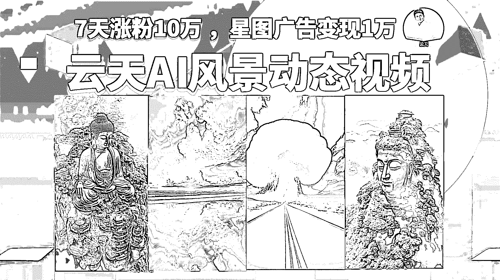

# 治愈类风景航拍动图视频制作，7 天涨粉 10 万 ，星图广告变现 1 万

> 原文：[`www.yuque.com/for_lazy/thfiu8/yh9supiatfy37ncg`](https://www.yuque.com/for_lazy/thfiu8/yh9supiatfy37ncg)

<ne-h2 id="d6edf9e3" data-lake-id="d6edf9e3"><ne-heading-ext><ne-heading-anchor></ne-heading-anchor><ne-heading-fold></ne-heading-fold></ne-heading-ext><ne-heading-content><ne-text id="u5f0c351d">(精华帖)(103 赞)治愈类风景航拍动图视频制作，7 天涨粉 10 万 ，星图广告变现 1 万</ne-text></ne-heading-content></ne-h2> <ne-p id="ub3490a33" data-lake-id="ub3490a33"><ne-text id="u6bf4c752">作者： 云天</ne-text></ne-p> <ne-p id="u4796bd85" data-lake-id="u4796bd85"><ne-text id="uc689506b">日期：2023-07-31</ne-text></ne-p> <ne-p id="u179d60a0" data-lake-id="u179d60a0"><ne-card data-card-name="image" data-card-type="inline" id="yzGE6" data-event-boundary="card">  <ne-h1 id="935da5d8" data-lake-id="935da5d8"><ne-heading-ext><ne-heading-anchor></ne-heading-anchor><ne-heading-fold></ne-heading-fold></ne-heading-ext><ne-heading-content><ne-text id="u4de3651a" style="color: rgb(216, 57, 49); background-color: rgba(255, 246, 122, 0.8);">前言</ne-text></ne-heading-content></ne-h1> <ne-p id="u439dcd44" data-lake-id="u439dcd44"><ne-text id="u918c7f3b">各位小伙伴们，大家好，我是云天，前段时间出了小和尚和老者说话、AI 头像的课程，很受大家欢迎，这里也感谢各位圈友的认可。</ne-text></ne-p> <ne-p id="u070d724e" data-lake-id="u070d724e"><ne-text id="ue303d3a8">最近很多人问我像上面这类治愈类风景视频是如何做的，看上去不像是现场拍摄的，应该是 AI 生成的，经过我的多方打探，发现竟然有人 7 天涨粉 10 万 ，星图广告变现 1 万。</ne-text></ne-p> <ne-p id="u56c06861" data-lake-id="u56c06861"><ne-card data-card-name="image" data-card-type="inline" id="yP4jo" data-event-boundary="card">  <ne-p id="u0cc27e08" data-lake-id="u0cc27e08"><ne-text id="u99a2a6b3">于是按耐不住我爱分享的精神，结合以往大家并不喜欢看文字教程，给大家出了一套保姆级的详细的视频课程，供大家参考学习。</ne-text></ne-p> <ne-p id="u7eaae4ae" data-lake-id="u7eaae4ae"><ne-card data-card-name="image" data-card-type="inline" id="LqEtW" data-event-boundary="card">  <ne-p id="ub1d1433e" data-lake-id="ub1d1433e"><ne-text id="ue590188b">我们将通过如下几个方面进行展示：</ne-text></ne-p> <ne-p id="u5e883e6b" data-lake-id="u5e883e6b"><ne-text id="ud794b9bb">1、玩法介绍</ne-text></ne-p> <ne-p id="u2250748b" data-lake-id="u2250748b"><ne-text id="uf0cc665d">2、账号定位</ne-text></ne-p> <ne-p id="uf9a9b85c" data-lake-id="uf9a9b85c"><ne-text id="u59bd9f6c">3、准备工作和环境搭建</ne-text></ne-p> <ne-p id="u0a97ba21" data-lake-id="u0a97ba21"><ne-text id="u07f08f7a">4、原创图片的制作过程</ne-text></ne-p> <ne-p id="u83e67935" data-lake-id="u83e67935"><ne-text id="uf6730312">5、图片转视频的教程</ne-text></ne-p> <ne-p id="uf3b54016" data-lake-id="uf3b54016"><ne-text id="uf7cb2a28">6、佛像图片变动态视频的操作</ne-text></ne-p> <ne-p id="u00f32343" data-lake-id="u00f32343"><ne-text id="u40568335">7、图片转视频方法 2 (L 形图形结构的环绕运镜教程)</ne-text></ne-p> <ne-p id="u7e8f441b" data-lake-id="u7e8f441b"><ne-text id="ud6523fad">8、图片转视频方法 2 (曲线运镜航拍大片详细教程)</ne-text></ne-p> <ne-p id="ucf6e540b" data-lake-id="ucf6e540b"><ne-text id="u5f4bf0ed">9、图片转视频方法 2(治愈类短视频)</ne-text></ne-p> <ne-p id="u6a8c4015" data-lake-id="u6a8c4015"><ne-text id="ucfbe9163">10、龙卷云+镜头前移</ne-text></ne-p> <ne-p id="u049da5fa" data-lake-id="u049da5fa"><ne-text id="uece6f156">11、可爱云团+镜头平移</ne-text></ne-p> <ne-p id="ua2fa0843" data-lake-id="ua2fa0843"><ne-text id="u0f22f1b4">详情跳转：</ne-text></ne-p> <ne-p id="ub779a870" data-lake-id="ub779a870"><ne-text id="u7d838425">‌⁣⁢‌‌‬‍‬‍⁣‌‌⁤⁣⁡⁤‌⁣⁢⁢⁣⁤⁣‌‬⁢⁡‌⁢‌‌⁤‍‌‌⁤⁣治愈类风景航拍动图视频制作</ne-text>[<ne-text id="u0ff00f1c" ne-underline="true">https://ixy2s5ruvqf.feishu.cn/docx/YrsGdbgWJoxCjWxTShWc26kYnVf</ne-text>](https://ixy2s5ruvqf.feishu.cn/docx/YrsGdbgWJoxCjWxTShWc26kYnVf)</ne-p> <ne-hole id="u12dfb567" data-lake-id="u12dfb567"><ne-card data-card-name="hr" data-card-type="block" id="UvZn2" data-event-boundary="card"><ne-p id="ub80108d2" data-lake-id="ub80108d2"><ne-text id="u7d88578a">评论区：</ne-text></ne-p> <ne-p id="u356f00b7" data-lake-id="u356f00b7"><ne-text id="ub45aafe1">瑾糖 : 文档没权限呢～</ne-text> <ne-text id="u7e0d715c">旭日 : 没权限</ne-text> <ne-text id="uac707918">菜菜 : 没开权限</ne-text> <ne-text id="u1f175b65">文少 : 没有权限访问😂</ne-text> <ne-text id="u544410c5">小钱学长 : 没有查看权限吗</ne-text> <ne-text id="ub82d41a7">云天 : 好了</ne-text> <ne-text id="uf2ce9851">云天 : 好了</ne-text> <ne-text id="u5d19f565">云天 : 好了</ne-text></ne-p> <ne-p id="u2af9d06a" data-lake-id="u2af9d06a"><ne-card data-card-name="image" data-card-type="inline" id="gnMq7" data-event-boundary="card">  <ne-hole id="u26ba6422" data-lake-id="u26ba6422"><ne-card data-card-name="hr" data-card-type="block" id="Lv40t" data-event-boundary="card"></ne-card></ne-hole></ne-card></ne-p></ne-card></ne-hole></ne-card></ne-p></ne-card></ne-p></ne-card></ne-p>