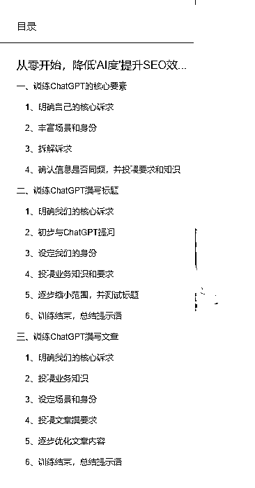
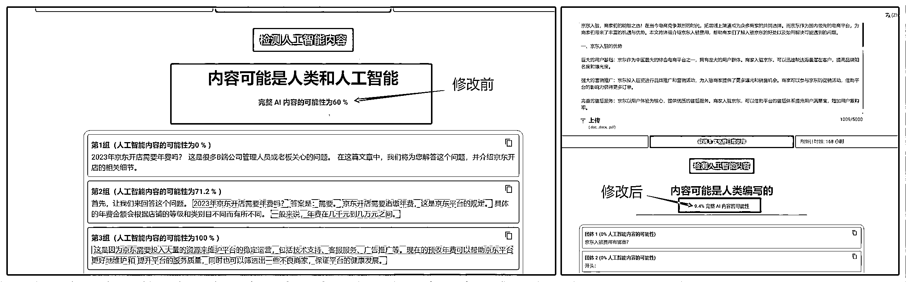

# 从 0 降低'AI 度'提升 SEO 效果，训练 ChatGPT 撰写 SEO 文章

> 原文：[`www.yuque.com/for_lazy/thfiu8/yrivogf7ksuk4dnu`](https://www.yuque.com/for_lazy/thfiu8/yrivogf7ksuk4dnu)

<ne-h2 id="c8e226cd" data-lake-id="c8e226cd"><ne-heading-ext><ne-heading-anchor></ne-heading-anchor><ne-heading-fold></ne-heading-fold></ne-heading-ext><ne-heading-content><ne-text id="ubdb26ee8">(38 赞)从 0 降低'AI 度'提升 SEO 效果，训练 ChatGPT 撰写 SEO 文章</ne-text></ne-heading-content></ne-h2> <ne-p id="uf2fde15b" data-lake-id="uf2fde15b"><ne-text id="ufec903e8">作者： 清风</ne-text></ne-p> <ne-p id="u15e47b48" data-lake-id="u15e47b48"><ne-text id="uba77bf11">日期：2023-08-01</ne-text></ne-p> <ne-p id="u7ad362ad" data-lake-id="u7ad362ad"><ne-text id="uf8a1b89e">👋大家好，我是 AI 热爱者“ ”。</ne-text> <ne-text id="uf7c95886">最近我朋友 AI 生成文章收录率下降的很快，让我帮忙看看什么原因，我怀疑可能与 AI 生成文章的“AI 度”过高有关。</ne-text> <ne-text id="u1eadee26">虽然不确定是不是这个原因，但是本着都尝试一下的心态，帮朋友搞了套提示语💡，降低“AI 度”的。</ne-text> <ne-text id="ud9f5e095">过段时间看看效果，如果有用，到时候我和大家反馈。</ne-text> <ne-text id="u75f08f53">顺便也整理输出了这个文档👉：</ne-text> <ne-text id="ub99d6d60">以此给大家参考，大家如果感觉不错，👍点个赞支持下呗~</ne-text> <ne-text id="u6b136f0d">另外，文中需要用到的相关提示语，📝专门给大家整理好了放在“代码块”中，</ne-text> <ne-text id="u7caa8c23">期待你的反馈和建议，🙏希望对大家有帮助~</ne-text>[<ne-text id="u68234e21">https://docs.qq.com/doc/DWGNSU3ZqbkdqZXZs</ne-text>](https://docs.qq.com/doc/DWGNSU3ZqbkdqZXZs)<ne-card data-card-name="image" data-card-type="inline" id="TBe82" data-event-boundary="card">  <ne-p id="u6d6fe5a3" data-lake-id="u6d6fe5a3"><ne-card data-card-name="image" data-card-type="inline" id="Q40Cx" data-event-boundary="card">  <ne-hole id="u4453e525" data-lake-id="u4453e525"><ne-card data-card-name="hr" data-card-type="block" id="MrxUZ" data-event-boundary="card"><ne-p id="u27206abc" data-lake-id="u27206abc"><ne-text id="ua4202d28">评论区：</ne-text></ne-p> <ne-p id="u9ab7f845" data-lake-id="u9ab7f845"><ne-text id="u69d549c4">暂无评论</ne-text></ne-p> <ne-p id="u488bfc2f" data-lake-id="u488bfc2f"><ne-card data-card-name="image" data-card-type="inline" id="Vz1Ue" data-event-boundary="card">  <ne-hole id="uea41f07e" data-lake-id="uea41f07e"><ne-card data-card-name="hr" data-card-type="block" id="FTjOg" data-event-boundary="card"></ne-card></ne-hole></ne-card></ne-p></ne-card></ne-hole></ne-card></ne-p></ne-card></ne-p>