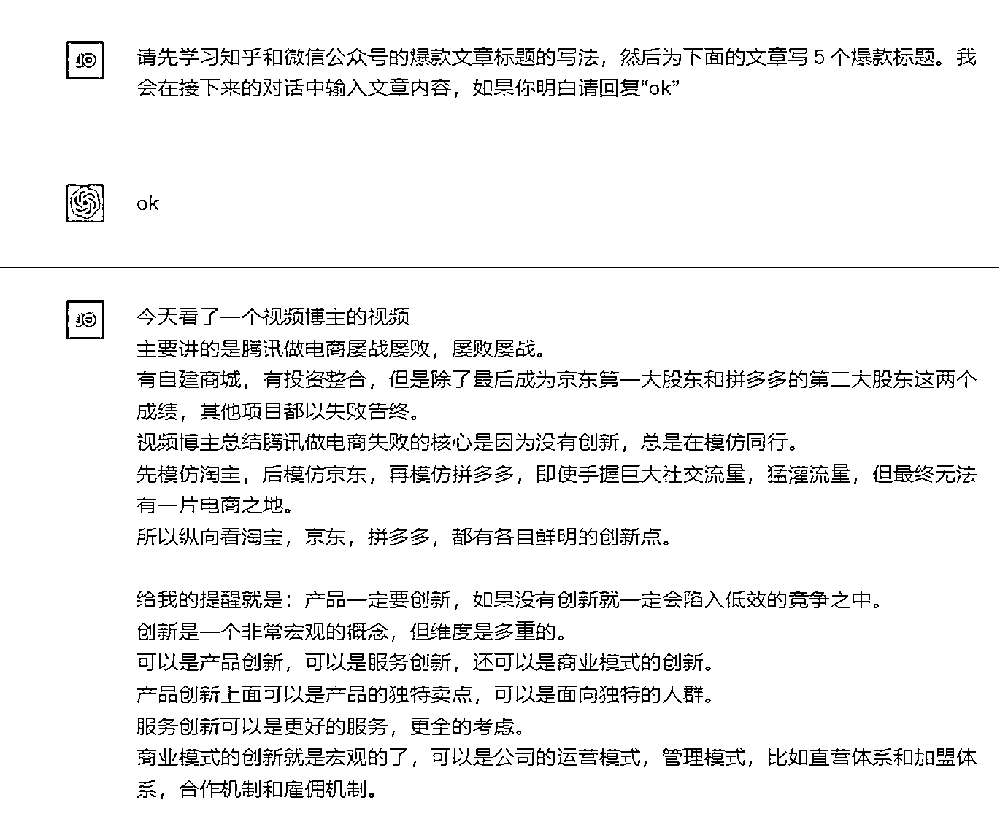
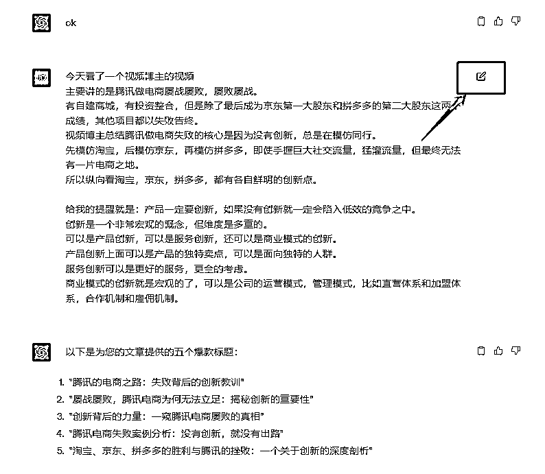
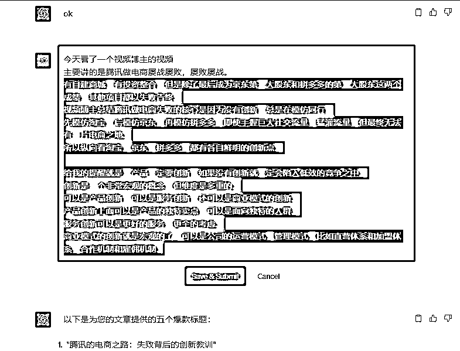
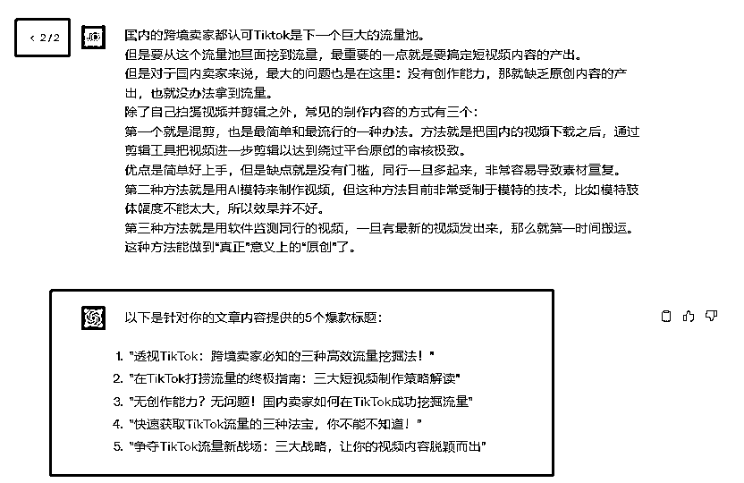
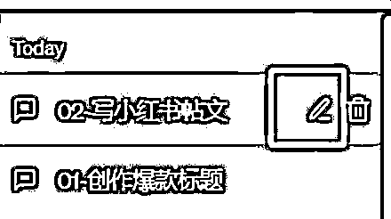

# 一个 ChatGPT 高效使用技巧—编辑原有内容

> 原文：[`www.yuque.com/for_lazy/thfiu8/vhmbn7086u7viggw`](https://www.yuque.com/for_lazy/thfiu8/vhmbn7086u7viggw)

<ne-h2 id="5673bc52" data-lake-id="5673bc52"><ne-heading-ext><ne-heading-anchor></ne-heading-anchor><ne-heading-fold></ne-heading-fold></ne-heading-ext><ne-heading-content><ne-text id="u05ad7208">(33 赞)一个 ChatGPT 高效使用技巧—编辑原有内容</ne-text></ne-heading-content></ne-h2> <ne-p id="uc272ff9c" data-lake-id="uc272ff9c"><ne-text id="u715056d5">作者： 希声</ne-text></ne-p> <ne-p id="u3a9897b8" data-lake-id="u3a9897b8"><ne-text id="u2f9cf3a0">日期：2023-07-31</ne-text></ne-p> <ne-p id="u85166367" data-lake-id="u85166367"><ne-text id="uc1195ebc">在日常使用 GPT 进行多次重复的任务时，你是否遇到过这样的问题：</ne-text></ne-p> <ne-p id="u9e4f79ce" data-lake-id="u9e4f79ce"><ne-text id="u38d0147d">为每个新的任务新建一个 chat，输入相同的提示词，再输入特定的内容，这不仅繁琐，而且在输入多个任务后，会导致界面充满了大量的信息，使我们难以集中注意力，同时也会对 GPT 的输出效果产生负面影响。</ne-text></ne-p> <ne-p id="uea97c726" data-lake-id="uea97c726"><ne-text id="u00c0697c">比如要使用 GPT 来为文章生成爆款标题，常见做法是：</ne-text></ne-p> <ne-p id="uaccce55c" data-lake-id="uaccce55c"><ne-text id="u7803d3ec">1\. 先新建一个 chat 中，输入提示词（比如：请先学习知乎和微信公众号的爆款文章标题的写法，然后为下面的文章写 5 个爆款标题。我会在接下来的对话中输入文章内容，如果你明白请回复“ok”）。</ne-text></ne-p> <ne-p id="u0435ae80" data-lake-id="u0435ae80"><ne-text id="udf59d1d9">2\. 然后我们会输入文章内容，等待 GPT 输出。</ne-text></ne-p> <ne-p id="u609f6ab9" data-lake-id="u609f6ab9"><ne-text id="ub06b51e0">但如果我们在短时间内有大量的文章需要生成标题，或者每隔一段时间我们就有文章需要生成标题，那我们的做法可能就是反复进行创建新的 chat 聊天、输入提示词。又或者我们会选择在同一个聊天窗口内连续输入文章内容，但是这样又很容易导致输出的内容变得杂乱，甚至可能会引发程序的混淆，最终生成的标题效果远不如预期。</ne-text></ne-p> <ne-p id="u2faabe70" data-lake-id="u2faabe70"><ne-text id="u5798ee58">最终我们是希望有一个能保持提示词不变，但能持续输入新的内容的方法。</ne-text></ne-p> <ne-p id="udcd7a255" data-lake-id="udcd7a255"><ne-text id="u8cc674a3">我的使用技巧是——编辑原有内容。</ne-text></ne-p> <ne-p id="uf25ddb46" data-lake-id="uf25ddb46"><ne-text id="ue2ef2663">操作流程：</ne-text></ne-p> <ne-p id="uba761c3a" data-lake-id="uba761c3a"><ne-text id="u6587c826">1\. 在新建的 chat 中输入你的提示词和第一次的任务内容，然后让 GPT 进行处理。</ne-text></ne-p> <ne-p id="ucdaba408" data-lake-id="ucdaba408"><ne-card data-card-name="image" data-card-type="inline" id="KY9ui" data-event-boundary="card">  <ne-p id="u96e361ae" data-lake-id="u96e361ae"><ne-card data-card-name="image" data-card-type="inline" id="b3of9" data-event-boundary="card">  <ne-p id="ufcfe4c78" data-lake-id="ufcfe4c78"><ne-text id="u245a8446">2\. 完成第一次任务后，不必再新建一个 chat，只需要点击你之前输入任务内容部分右侧的编辑按钮。</ne-text></ne-p> <ne-p id="u49fff31c" data-lake-id="u49fff31c"><ne-card data-card-name="image" data-card-type="inline" id="uYgRg" data-event-boundary="card">  <ne-p id="ueea3982c" data-lake-id="ueea3982c"><ne-text id="u65ea3a03">3\. 在打开的编辑窗口中，删除你之前的任务内容（比如下面红框的内容），然后输入你新的任务内容（比如这个为文章起标题的示范中我可以输入新的文章内容）。</ne-text></ne-p> <ne-p id="ueb35711b" data-lake-id="ueb35711b"><ne-text id="u1e6ee00f">删除旧的内容：</ne-text></ne-p> <ne-p id="ude7b68dc" data-lake-id="ude7b68dc"><ne-card data-card-name="image" data-card-type="inline" id="cmnLr" data-event-boundary="card">  <ne-p id="u797c0223" data-lake-id="u797c0223"><ne-text id="u40e99974">输入新的内容：</ne-text></ne-p> <ne-p id="ue3d6132d" data-lake-id="ue3d6132d"><ne-card data-card-name="image" data-card-type="inline" id="yI0Wn" data-event-boundary="card">  <ne-p id="uf79409c4" data-lake-id="uf79409c4"><ne-text id="uf1e83e22">4\. 输入完成后，点击保持和提交按钮（save&submit）</ne-text></ne-p> <ne-p id="u12e5f858" data-lake-id="u12e5f858"><ne-text id="u32a0443b">5\. 等待让 GPT 进行处理和输出。</ne-text></ne-p> <ne-p id="u6e7bc1ec" data-lake-id="u6e7bc1ec"><ne-card data-card-name="image" data-card-type="inline" id="JZ8ny" data-event-boundary="card">  <ne-p id="ud29611a9" data-lake-id="ud29611a9"><ne-text id="u8823b726">同时可以注意到左上角就会多了一个序列，我们可以点击切换按钮来查看之前输入的内容和 GPT 的输出结果。</ne-text></ne-p> <ne-p id="u63276936" data-lake-id="u63276936"><ne-card data-card-name="image" data-card-type="inline" id="fmAtS" data-event-boundary="card">  <ne-p id="ub31afdb5" data-lake-id="ub31afdb5"><ne-text id="uee71260a">GPT 说这个技巧有以下三个优点：</ne-text></ne-p> <ne-p id="u09f92e6a" data-lake-id="u09f92e6a"><ne-text id="u3ae6697a">避免了重复输入提示词的麻烦。</ne-text></ne-p> <ne-p id="u6e8d6d41" data-lake-id="u6e8d6d41"><ne-text id="uab140ff9">保证了每个任务都能得到清晰、独立的处理结果。</ne-text></ne-p> <ne-p id="ub5a3c4a0" data-lake-id="ub5a3c4a0"><ne-text id="u607e1da2">使得批量任务变得更加清晰和有序。</ne-text></ne-p> <ne-p id="u1adea990" data-lake-id="u1adea990"><ne-text id="uab55e44e">如果我们平时有很多的提示词针对不同的使用场景，我们就可以用这种方法，新开不同的 chat，同时做好 chat 的命名，需要用的时候直接点击这个 chat ，然后在原来提示词输入的内容中直接点击”编辑“按钮就可以开始使用了。</ne-text></ne-p> <ne-p id="u52fe3709" data-lake-id="u52fe3709"><ne-card data-card-name="image" data-card-type="inline" id="n38tw" data-event-boundary="card">  <ne-p id="ua11a515a" data-lake-id="ua11a515a"><ne-text id="u2a547bdc">怎么给 chat 命名？点击右侧的笔头按钮就行了。</ne-text></ne-p> <ne-p id="ub0a3235f" data-lake-id="ub0a3235f"><ne-card data-card-name="image" data-card-type="inline" id="V2UpB" data-event-boundary="card">  <ne-p id="u8a4591ac" data-lake-id="u8a4591ac"><ne-text id="u25c92c6f" ne-bold="true">如果分享对你有帮助希望点个赞哦~</ne-text></ne-p> <ne-p id="u7c3846f0" data-lake-id="u7c3846f0"><ne-text id="u24f0735c" ne-bold="true">————————</ne-text></ne-p> <ne-p id="ub5b3336c" data-lake-id="ub5b3336c"><ne-text id="u07ca5350" ne-bold="true">我在生财的其他文章链接：</ne-text></ne-p> <ne-p id="ue32f5bd2" data-lake-id="ue32f5bd2">[<ne-text id="ue621e57f">保姆级教程！注册 Midjourney 并开通付费订阅功能</ne-text>](https://articles.zsxq.com/id_gnm2x96buu9t.html)</ne-p> <ne-p id="u6cf84865" data-lake-id="u6cf84865">[<ne-text id="u2ade6984" ne-underline="true">跨境电商的 ChatGPT 应用指南全集 v3.0</ne-text>](https://articles.zsxq.com/id_eh50cr4chn8a.html)</ne-p> <ne-p id="u0adda863" data-lake-id="u0adda863">[<ne-text id="u37e17335" ne-underline="true">1 天内如何启动电商/外贸/跨境网站？ChatGPT 来助力！</ne-text>](https://articles.zsxq.com/id_1azlnfovac6q.html)</ne-p> <ne-p id="u10cf3b46" data-lake-id="u10cf3b46">[<ne-text id="u24d0603b" ne-underline="true">一个工具管理上百个社媒账号？指纹浏览器使用全攻略！</ne-text>](https://articles.zsxq.com/id_u2ub0iv60p1g.html)</ne-p> <ne-p id="u28f51c20" data-lake-id="u28f51c20">[<ne-text id="u15dbdf0f" ne-underline="true">白嫖！3000 元的谷歌广告优惠你要吗？</ne-text>](https://articles.zsxq.com/id_sa1bz4dckqeq.html)</ne-p> <ne-p id="u9e730dc8" data-lake-id="u9e730dc8">[<ne-text id="u72cd3203" ne-underline="true">Etsy 注册最新最全指南！一文回答如何注册、需要哪些材料、如何避免封店、如何申诉</ne-text>](https://articles.zsxq.com/id_590wii7jr4iu.html)</ne-p> <ne-p id="u432925bf" data-lake-id="u432925bf">[<ne-text id="u75f82f00" ne-underline="true">效率飙升！跨境电商领域的 ChatGPT 应用指南 v1.0</ne-text>](https://articles.zsxq.com/id_7wu5dtpkh4m4.html)</ne-p> <ne-p id="u1ad64fae" data-lake-id="u1ad64fae">[<ne-text id="ueac727a0" ne-underline="true">《段永平投资问答录-商业逻辑篇》精华金句摘录</ne-text>](https://articles.zsxq.com/id_xrltpwocer4p.html)</ne-p> <ne-p id="u766c334b" data-lake-id="u766c334b">[<ne-text id="ubc908f04" ne-underline="true">《段永平投资问答录-投资逻辑篇》精华金句摘录</ne-text>](https://articles.zsxq.com/id_2k5d3mdace44.html)</ne-p> <ne-p id="uce2bb861" data-lake-id="uce2bb861">[<ne-text id="u04d3d368" ne-underline="true">《穷查理宝典》精华金句摘录</ne-text>](https://articles.zsxq.com/id_er7b3dm8lx7w.html)</ne-p> <ne-p id="ub72bd8f5" data-lake-id="ub72bd8f5">[<ne-text id="ub0e6b5d8" ne-underline="true">《零编程知识怎么在 AI 帮助做一个贪吃蛇的游戏》</ne-text>](https://articles.zsxq.com/id_nqxxc79whz1t.html)</ne-p> <ne-hole id="ufacb9431" data-lake-id="ufacb9431"><ne-card data-card-name="hr" data-card-type="block" id="eCrx4" data-event-boundary="card"><ne-p id="u3dc51408" data-lake-id="u3dc51408"><ne-text id="u718cdc1d">评论区：</ne-text></ne-p> <ne-p id="u8ecc7d2b" data-lake-id="u8ecc7d2b"><ne-text id="uf2869599">金九渊 : 重复复制的问题其实用 keepgpt 插件就行，编辑按钮的作用主要是不用重复训练喂资料。</ne-text> <ne-text id="u348839cf">AI 训练师小凡 : 是个高手[强]</ne-text> <ne-text id="uec23e4f8">希声 : [强][强][强]</ne-text> <ne-text id="u55737705">Alex : 厉害👍🏻</ne-text> <ne-text id="u18e77272">书豪 : 牛🐮</ne-text></ne-p> <ne-p id="u2ce7ddd1" data-lake-id="u2ce7ddd1"><ne-card data-card-name="image" data-card-type="inline" id="JhaHH" data-event-boundary="card">  <ne-hole id="u264694d1" data-lake-id="u264694d1"><ne-card data-card-name="hr" data-card-type="block" id="BxC8x" data-event-boundary="card"></ne-card></ne-hole></ne-card></ne-p></ne-card></ne-hole></ne-card></ne-p></ne-card></ne-p></ne-card></ne-p></ne-card></ne-p></ne-card></ne-p></ne-card></ne-p></ne-card></ne-p></ne-card></ne-p></ne-card></ne-p>