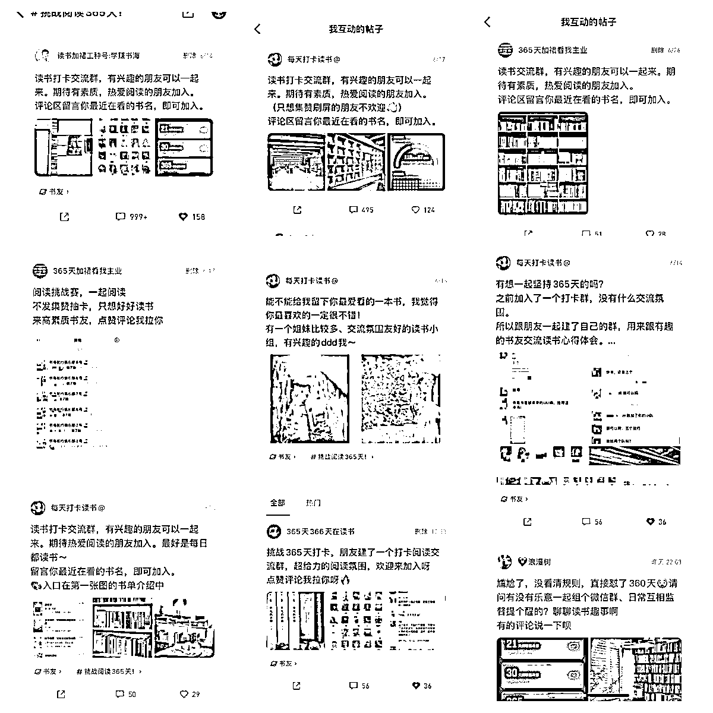

# 微信读书引流 15 天赚回生财门票，私域增加近 2000 精准读书粉以及 8 个社群

> 原文：[`www.yuque.com/for_lazy/thfiu8/ev8cdgrngzhaaba3`](https://www.yuque.com/for_lazy/thfiu8/ev8cdgrngzhaaba3)

## (精华帖)(114 赞)微信读书引流 15 天赚回生财门票，私域增加近 2000 精准读书粉以及 8 个社群 

作者： 许帅 

日期：2023-07-31 

微信读书引流 15 天赚回生财门票，私域增加近 2000 精准读书粉以及 8 个社群实践复盘 

大家好！我是生财 7 期新圈友许帅 首先感慨一句，生财的风向标是宝藏，各位不要错过，下场实操肯定比纯看来的赚！ 

微信读书引流（以下简称微读引流）是我在生财的第一个实操小项目。前两天看到@高杰老哥发了个微读引流风向标中标了，恰好我和圈友 在 6 月份已经有半个月左右的实操经验，所以今天这个帖子目的是，给想要实操微信读书引流精准读书粉的伙伴一些经验分享，包括以下内容： 

1、如何实操引流近 2000 人搭建 8 个社群 2、如何利用这个机会赚回生财门票？ 

也纯当我的复盘贴，以下是部分项目实战情况展示 

为了方便各位圈友阅读，请移步飞书： 

感谢阅读！[https://h7i1q54cm3.feishu.cn/docx/D2wudjBKGoGy4jxDUAFctpgKnTc?from=from_copylink](https://h7i1q54cm3.feishu.cn/docx/D2wudjBKGoGy4jxDUAFctpgKnTc?from=from_copylink)  

  

评论区： 

梦宸 : 这个有意思 王小竹 : 牛的 鞭炮 : 我是 ，补充一下我的理解。 微读这个项目，非常适合新手练手赚第一块钱的。 1.链条短，反馈快，快速测试。 2.微读机制宽松，不容易被平台限制。 3\. 把生财学到的知识都能运用到，如用户需求分析、引流、社群、筛选、转化。 4.沉淀一批好友到微信中，将来验证新项目需求。 芷蓝 : 这个有意思，微信读书的用户标签和用户量都是宝藏 许帅 : 过程很有意思[呲牙] 许帅 : 小小的试一下[呲牙] 许帅 : 是的，感谢大佬[玫瑰] 许帅 : 炮哥一针见血 

  