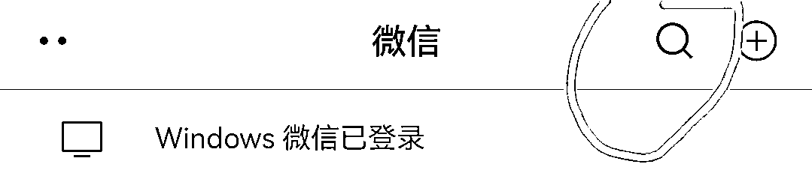
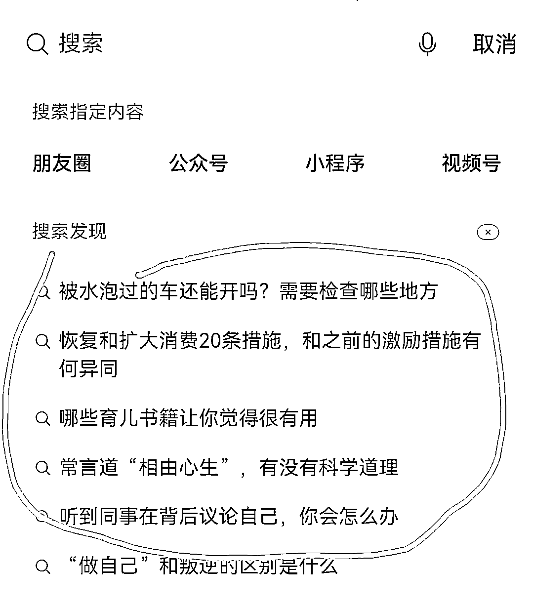
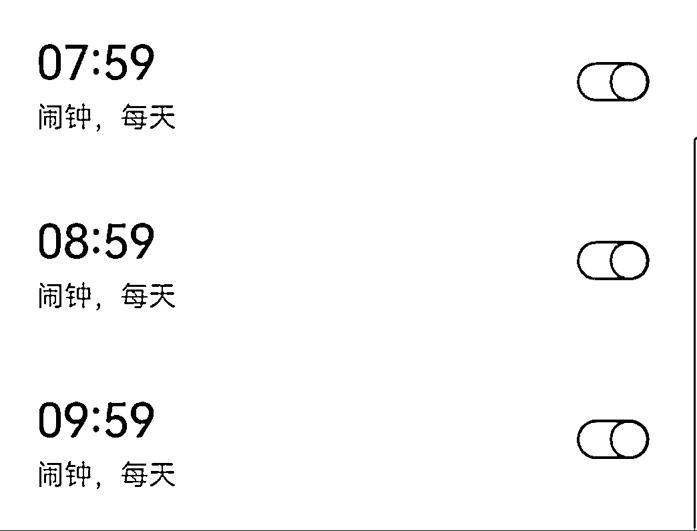
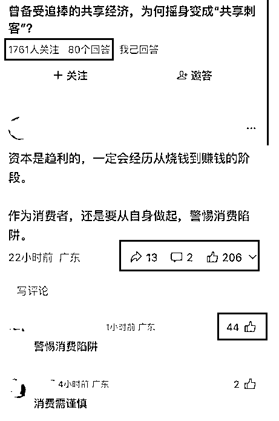
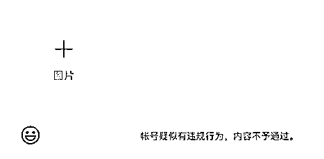
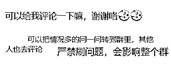
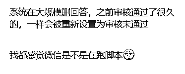
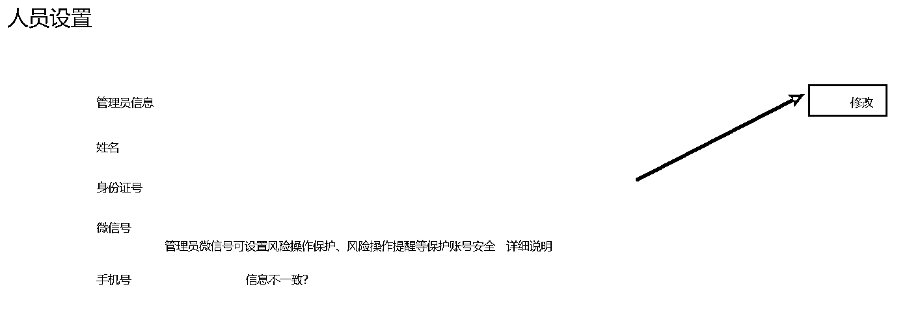
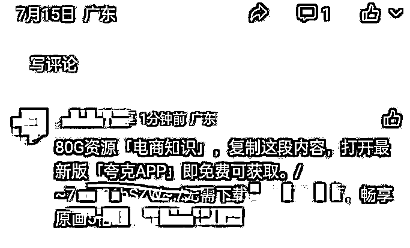

# 「微信问一问」踩坑经验，引流公众号半个月涨粉 2000+的复盘

> 原文：[`www.yuque.com/for_lazy/thfiu8/pq4kg7nctfxr2nv4`](https://www.yuque.com/for_lazy/thfiu8/pq4kg7nctfxr2nv4)

<ne-h2 id="d68f8107" data-lake-id="d68f8107"><ne-heading-ext><ne-heading-anchor></ne-heading-anchor><ne-heading-fold></ne-heading-fold></ne-heading-ext><ne-heading-content><ne-text id="ue5b66da1">(51 赞)「微信问一问」踩坑经验，引流公众号半个月涨粉 2000+的复盘</ne-text></ne-heading-content></ne-h2> <ne-p id="u3dd9206a" data-lake-id="u3dd9206a"><ne-text id="ub65d114f">作者： 深圳大冲</ne-text></ne-p> <ne-p id="ue76c2441" data-lake-id="ue76c2441"><ne-text id="u725c85a2">日期：2023-08-04</ne-text></ne-p> <ne-p id="u606d291f" data-lake-id="u606d291f"><ne-text id="u1a458b89">大家好啊，我是深圳大冲，今年 418 第一次加入生财，当时就推荐了几位新人一起加入，加入后一直在和前辈们学习。</ne-text></ne-p> <ne-p id="ufb2ab8a2" data-lake-id="ufb2ab8a2"><ne-text id="uceecd5ef">最近在和 IDO 老徐、飞巴 做「微信问一问」，做了差不多半个月，今天来和大家分享一下「微信问一问」的经验。</ne-text></ne-p> <ne-p id="uecae3f7a" data-lake-id="uecae3f7a"><ne-text id="u577a48ae" ne-bold="true">一、数据</ne-text></ne-p> <ne-p id="ud7cc7a71" data-lake-id="ud7cc7a71"><ne-text id="ue3199511">先看下这两周的成果：单个公众号，半个月涨粉 1600+，单日最高涨粉 220，另外还有一个公众号小号和视频号各涨粉几百。</ne-text></ne-p> <ne-p id="u11ae6740" data-lake-id="u11ae6740"><ne-card data-card-name="image" data-card-type="inline" id="wbLbr" data-event-boundary="card">  <ne-p id="u7b7c970d" data-lake-id="u7b7c970d"><ne-text id="u7229b815" ne-bold="true">二、开始入局</ne-text></ne-p> <ne-p id="u7070b036" data-lake-id="u7070b036"><ne-text id="ua6b749af">在 3 月份最早的时候，就有问一问的内测邀请，当时好像只能是认证的视频号才能体验，到 7 月份左右视频号用户都能使用问一问了，当时我也答了几道题目，有一道题目一天引流了 50 多个视频号粉丝，由于我不玩视频号，后面没管了。</ne-text></ne-p> <ne-p id="u06ee897f" data-lake-id="u06ee897f"><ne-text id="ud5770d93">在 7 月中旬的时候，</ne-text><ne-text id="uf560234c" style="color: rgb(77, 77, 77); background-color: rgb(255, 255, 255);">Clay（阿木）和 蛋黄巴巴 在 IDO 老徐的星球上分享了问一问的成果，他们在一周内给公众号增加了 1000 粉，震惊了所有人，这时我还不知道现在可以给公众号引流，所以马上在问一问中切换公众号身份，开始答题，那个时候还没有限制问答数量，当天只答了十几道题目，效率比较低。</ne-text></ne-p> <ne-p id="u08855dee" data-lake-id="u08855dee"><ne-text id="u86a6e04f" style="color: rgb(77, 77, 77); background-color: rgb(255, 255, 255);">为了和高人请教，我当天就把他俩请到我的微信群中交流，从那开始，我的群中只讨论问一问，从早搞到黑，分析大 V 的玩法，怎么高效涨粉，怎么抢题目，怎么评论涨粉，以及避坑，防止进小黑屋。</ne-text></ne-p> <ne-p id="ua3a33ed0" data-lake-id="ua3a33ed0"><ne-text id="u35dd99d9" style="background-color: rgb(255, 255, 255); color: rgb(77, 77, 77);">经过一周的摸索，我们经常在老徐的星球中分享收获，老徐敏锐地发现自己可以出个问一问的小报童专栏，来指导生财圈友更好地玩问一问，并把愿意玩的人拉到群中交流，当晚就和飞巴讨论建群的事情。</ne-text></ne-p> <ne-p id="uba91887c" data-lake-id="uba91887c"><ne-text id="ua17d0b3f" style="background-color: rgb(255, 255, 255); color: rgb(77, 77, 77);">可以说，我们的经验都是来自于老徐的生财圈友群的交流，只不过我和阿木，蛋黄巴巴比较积极地回答问题，一直在分享帮助新朋友，让许多人也增加了几百上千的粉丝，现在老徐的问一问交流一群已经满员，二群已经开放了。</ne-text></ne-p> <ne-p id="uebdb2011" data-lake-id="uebdb2011"><ne-text id="u9f51ddec" ne-bold="true">三、要做什么准备？</ne-text></ne-p> <ne-p id="u9be6fcb1" data-lake-id="u9be6fcb1"><ne-text id="ub6a54615">1、准备至少 2 个以上的微信（问一问规则变化频繁，防止进小黑屋），同一微信身份的公众号或视频号，公众号和视频号尽量绑定。</ne-text></ne-p> <ne-p id="uc50c2720" data-lake-id="uc50c2720"><ne-text id="uaa369b4d">2、公众号或视频号设置好名称，头像，简介，都不要带引流信息，容易违规。</ne-text></ne-p> <ne-p id="ud56a559f" data-lake-id="ud56a559f"><ne-text id="u7b07ccd1">3、公众号或视频号中发一条自我介绍的文章或视频，公众号的"被关注回复"中加上个人介绍的文章链接，"关键词回复"和"收到消息回复"也设置好相关引流信息。</ne-text></ne-p> <ne-p id="u0541c2d6" data-lake-id="u0541c2d6"><ne-text id="u4802ac17" ne-bold="true">四、如何得到高赞？</ne-text></ne-p> <ne-p id="ubf71ea0c" data-lake-id="ubf71ea0c"><ne-text id="u23ca9be9">回答问题和评论高赞的回答都可以引流，问题点赞后，会有关注按钮，直接就能关注你的公众号或视频号；评论点赞后是没有关注按钮的，需要点击头像才能进去关注，但是也能引来不少的关注。</ne-text></ne-p> <ne-p id="u87f3f473" data-lake-id="u87f3f473"><ne-text id="ueefee48c" ne-bold="true">1、找题目</ne-text></ne-p> <ne-p id="uad720bb4" data-lake-id="uad720bb4"><ne-text id="u89ee61c7">调好整点闹钟，整点回答热搜中的问题，抢到第一个回答，并有高质量的回复，用户点赞和评论后，排名会靠前，后续的长尾流量一直有，所以抢好问题，并在第一个给出高质量回答，绝对可以排名靠前。</ne-text></ne-p> <ne-p id="u0d971746" data-lake-id="u0d971746"><ne-text id="uaac7734b">另外一种方式是：找到高关注度的题目，比如社会民生，最近的台风，暴雨，洪水等，还有超导，比如关注在 100 人以上，当前回答人数较少的题目，这样的题目有较大概率会引爆，并再次上热搜。</ne-text></ne-p> <ne-p id="u668847c7" data-lake-id="u668847c7"><ne-card data-card-name="image" data-card-type="inline" id="NZA1C" data-event-boundary="card">  <ne-p id="u087a2919" data-lake-id="u087a2919"><ne-card data-card-name="image" data-card-type="inline" id="susAl" data-event-boundary="card">  <ne-p id="u84ce46c2" data-lake-id="u84ce46c2"><ne-card data-card-name="image" data-card-type="inline" id="DRfal" data-event-boundary="card">  <ne-p id="u2497586e" data-lake-id="u2497586e"><ne-text id="u9014e968" ne-bold="true">2、答题技巧：言简意赅，直击痛点，情绪共鸣。</ne-text></ne-p> <ne-p id="u5b7d794e" data-lake-id="u5b7d794e"><ne-text id="u4492f126">在这解释一下，不要啰嗦，50 字内简明回答，直接回答问题的核心，猜测提问者的意图，并能适当地引起情绪共鸣。</ne-text></ne-p> <ne-p id="u4df38895" data-lake-id="u4df38895"><ne-card data-card-name="image" data-card-type="inline" id="CiGav" data-event-boundary="card">  <ne-p id="u47432fe1" data-lake-id="u47432fe1"><ne-text id="u42c044c9" ne-bold="true">3、评论技巧：</ne-text><ne-text id="uc519eba0">同样找到高赞的问题，判断问题的质量，高质量的问答爆的可能性高，可以在下面评论，高质量的评论也可以有很多赞，可以引来很多关注，5 个以上的评论会折叠，所以 4 个以下评论的都可以继续评论。</ne-text></ne-p> <ne-p id="u7fe6c9c0" data-lake-id="u7fe6c9c0"><ne-card data-card-name="image" data-card-type="inline" id="v7RVS" data-event-boundary="card">  <ne-p id="u69906903" data-lake-id="u69906903"><ne-text id="u3c017ae5" ne-bold="true">五、防止进小黑屋</ne-text></ne-p> <ne-p id="uc90cc0a2" data-lake-id="uc90cc0a2"><ne-text id="ub82be938">什么是进小黑屋？</ne-text></ne-p> <ne-p id="u07005c1f" data-lake-id="u07005c1f"><ne-text id="u17f0dd71">提示账号有违规行为，不能再回答问题了，回答任何问题，都是审核中或者审核未通过，或者黑/灰产。</ne-text></ne-p> <ne-p id="ua7d3060a" data-lake-id="ua7d3060a"><ne-card data-card-name="image" data-card-type="inline" id="JUkgi" data-event-boundary="card">  <ne-p id="ub64fbe55" data-lake-id="ub64fbe55"><ne-card data-card-name="image" data-card-type="inline" id="lD8Rb" data-event-boundary="card">  <ne-p id="u0388a8e0" data-lake-id="u0388a8e0"><ne-text id="ubae03a33">由于「问一问」的规则变化太快，很多人半天就进小黑屋了，</ne-text><ne-text id="u23fe7e29" ne-bold="true">我玩了 15 天，到现在还没违规过</ne-text><ne-text id="u78aec96f">，我在群中也讲过多次，但是很多人太兴奋，根本不听不看不做，这里讲下我避坑的技巧。</ne-text></ne-p> <ne-p id="ubb5d21a2" data-lake-id="ubb5d21a2"><ne-text id="u089d98a3" ne-bold="true">以下给一些建议，都是实战经验：</ne-text></ne-p> <ne-p id="u9d636445" data-lake-id="u9d636445"><ne-text id="u1a21ede4">1、新人不要太兴奋，回答问题时要控制频率，节奏不要太快，</ne-text><ne-text id="u4dab5224" ne-bold="true">建议每小时答完 2 道题目，评论 3 个高赞的回答后</ne-text><ne-text id="u53058755">，暂停，</ne-text><ne-text id="ub6ec05e7" ne-bold="true">每次只要花 5 分钟，不影响上班</ne-text><ne-text id="u9aad0d8c">，有时候错过几个整点，影响也不大。</ne-text></ne-p> <ne-p id="u95afe8c4" data-lake-id="u95afe8c4"><ne-card data-card-name="image" data-card-type="inline" id="nbgGu" data-event-boundary="card">  <ne-p id="u991c3389" data-lake-id="u991c3389"><ne-text id="ub08f4cb3">2、现在问一问，开始讲究回答的质量和流量平衡，不再是谁早回答谁就置顶，后面的回答也有更多机会爆光。</ne-text></ne-p> <ne-p id="u7eca7b74" data-lake-id="u7eca7b74"><ne-text id="u1e704b2c">所以要注意回答的质量，提高回答的质量和深度，要正能量回答，点赞和评论多了，同样能排在前面，而不仅仅是像之前的按时间倒序排列。</ne-text></ne-p> <ne-p id="u14f6bdc5" data-lake-id="u14f6bdc5"><ne-card data-card-name="image" data-card-type="inline" id="BRYyB" data-event-boundary="card">  <ne-p id="u7cd2fe16" data-lake-id="u7cd2fe16"><ne-text id="ufd8ee130">3、不要互评，相互点赞，风控机制能检测到一个群聊中相互刷问题的情况，之前视频号就出现这种情况，群中一个号出问题，整个群可能会被一锅端。</ne-text></ne-p> <ne-p id="u59cfadb6" data-lake-id="u59cfadb6"><ne-card data-card-name="image" data-card-type="inline" id="FauR3" data-event-boundary="card">  <ne-p id="u6fd9d83b" data-lake-id="u6fd9d83b"><ne-text id="ua6f3ec44">4、不要复制评论，将一条评论复制到多个问答下面，机器会自动删除，可能进小黑屋。</ne-text></ne-p> <ne-p id="u5aada0dc" data-lake-id="u5aada0dc"><ne-card data-card-name="image" data-card-type="inline" id="N2gPq" data-event-boundary="card">  <ne-p id="u4e8313e5" data-lake-id="u4e8313e5"><ne-text id="u5c6bd6a6">5、不要频繁切换公众号身份，视频号身份，切换不同身份答题，并在短时间内回答和评论，同样会进小黑屋。</ne-text></ne-p> <ne-p id="u04db541c" data-lake-id="u04db541c"><ne-text id="u7f3db399">不要用同一个手机切换微信账号或者微信分身，不要用一个 wifi 切换账号或者身份，不要自问自答。</ne-text></ne-p> <ne-p id="uc5d7ace4" data-lake-id="uc5d7ace4"><ne-text id="u666aa5a8">总之你想刷的都不要做，正常回答已经有非常好的数据了，为什么要耍小聪明？</ne-text></ne-p> <ne-p id="u60db4242" data-lake-id="u60db4242"><ne-text id="u3c758152">6、不要用 AI 辅助回答，效率不高，还很容易被检测出来。</ne-text></ne-p> <ne-p id="u1d3af49a" data-lake-id="u1d3af49a"><ne-card data-card-name="image" data-card-type="inline" id="Cp1bw" data-event-boundary="card">  <ne-p id="u1e419b8c" data-lake-id="u1e419b8c"><ne-card data-card-name="image" data-card-type="inline" id="fONTG" data-event-boundary="card">  <ne-p id="ub97d4dd8" data-lake-id="ub97d4dd8"><ne-text id="u7e3dd3d2">7、一般不要放图片和视频，容易进入人工审核阶段，除非你保证能通过。</ne-text></ne-p> <ne-p id="u4765926b" data-lake-id="u4765926b"><ne-text id="u18422c70">文字答案由机器自动检测敏感词，没有就通过了，图片和视频容易进入人工审核，人工审核标准不一，很容易标为营销。</ne-text></ne-p> <ne-p id="uff84af3f" data-lake-id="uff84af3f"><ne-text id="ue4aab3a0">另外不要提第三方的产品或竞品，如知乎，淘宝，百度等。</ne-text></ne-p> <ne-p id="u4294afb1" data-lake-id="u4294afb1"><ne-card data-card-name="image" data-card-type="inline" id="YvMFI" data-event-boundary="card">  <ne-p id="ue1323722" data-lake-id="ue1323722"><ne-card data-card-name="image" data-card-type="inline" id="HDCPA" data-event-boundary="card">  <ne-p id="uc8e48068" data-lake-id="uc8e48068"><ne-text id="u378526b3" ne-bold="true">六、进小黑屋了怎么办？</ne-text></ne-p> <ne-p id="u6f44b57f" data-lake-id="u6f44b57f"><ne-text id="u48739f4e">1、</ne-text><ne-text id="u2a907e4a" ne-bold="true">更换公众号或视频号的管理员</ne-text><ne-text id="u9b55c7cd">：将公众号或视频号更换到你的新微信上，公众号后台-人员设置，视频号-设置-更换管理员，更换后可以使用问一问了，注意新注册的公众号或微信，只能在三天后使用问一问。</ne-text></ne-p> <ne-p id="u5cec0f7d" data-lake-id="u5cec0f7d"><ne-card data-card-name="image" data-card-type="inline" id="oyg1A" data-event-boundary="card">  <ne-p id="ufe71797b" data-lake-id="ufe71797b"><ne-card data-card-name="image" data-card-type="inline" id="zPmTl" data-event-boundary="card">  <ne-p id="u9156d5ef" data-lake-id="u9156d5ef"><ne-text id="u25c00834">2、</ne-text><ne-text id="u89e93356" ne-bold="true">删除违规问答</ne-text><ne-text id="uaed48c06">，等半天，半天尝试一次，有没有解封。</ne-text></ne-p> <ne-p id="u8dd425a4" data-lake-id="u8dd425a4"><ne-text id="u38063361">如果没有备用的微信，只能用当前这个号，把所有审核中，违规的回答，全部删除，甚至清空你的所有回答，或许半天后可以解封，可以半天尝试一次。</ne-text></ne-p> <ne-p id="ua356ac6e" data-lake-id="ua356ac6e"><ne-text id="u405f1a25" ne-bold="true">七、问一问商业化的一些思路</ne-text></ne-p> <ne-p id="u086c81a6" data-lake-id="u086c81a6"><ne-text id="u1c497b68" ne-bold="true">1、点赞后就会引流粉丝到公众号或视频号变现</ne-text></ne-p> <ne-p id="uf0996f51" data-lake-id="uf0996f51"><ne-text id="u013eb01c">这种是常规的玩法，不多讲。</ne-text></ne-p> <ne-p id="ud88626a0" data-lake-id="ud88626a0"><ne-text id="u9841bc2e" ne-bold="true">2、评论区替商家打广告或自己打广告</ne-text></ne-p> <ne-p id="u03a80307" data-lake-id="u03a80307"><ne-text id="ud6173813">可以在回答中提软广关键字，或者评论区，收钱回答。</ne-text></ne-p> <ne-p id="u29864641" data-lake-id="u29864641"><ne-text id="u4e461bda">比较容易费号，发现就可能直接封号了，多准备几个号也可玩。</ne-text></ne-p> <ne-p id="uf60f8887" data-lake-id="uf60f8887"><ne-card data-card-name="image" data-card-type="inline" id="pPpT3" data-event-boundary="card">  <ne-p id="udae2c556" data-lake-id="udae2c556"><ne-text id="u6e6aa5f8" ne-bold="true">3、搜一搜截流，流量主变现</ne-text></ne-p> <ne-p id="uc8aeb631" data-lake-id="uc8aeb631"><ne-text id="u0359f627">汇总问一问中的高频热点问题，将问题中的高赞回答汇总，整理成公众号文章，以</ne-text><ne-text id="u6a795ded" ne-bold="true">“发布”</ne-text><ne-text id="u8e2cd894">的形式发文章，开通流量主放广告，</ne-text><ne-text id="u36f31078" ne-bold="true">每天不限制发布次数</ne-text><ne-text id="udd0df67c">，只要有时间，就一直可以发，用户在微信中搜索时，会因为</ne-text><ne-text id="ub1404d8a" ne-bold="true">关键词</ne-text><ne-text id="u7057edaf">搜索到你的文章，可通过流量主变现。</ne-text></ne-p> <ne-p id="ufa70bb9f" data-lake-id="ufa70bb9f"><ne-text id="u511c9bb0" ne-bold="true">4、引流到私域变现</ne-text></ne-p> <ne-p id="u3cd164dd" data-lake-id="u3cd164dd"><ne-text id="u93a9d5f2">到了私域，可重复变现，方法太多了。</ne-text></ne-p> <ne-p id="ua596da44" data-lake-id="ua596da44"><ne-text id="u40d24edc" ne-bold="true">八、不足之处</ne-text></ne-p> <ne-p id="u31aa0c7c" data-lake-id="u31aa0c7c"><ne-text id="u9d27c0b8">由于时间比较紧，都是从 0 开始玩，所以也有许多不足之处，简要总结一下：</ne-text></ne-p> <ne-p id="u6eb83efb" data-lake-id="u6eb83efb"><ne-text id="u39864f89">1、敏感度不够：真正爆发是在 7 月初，我晚了 10 天，比别人少了 1000 粉，后面各种规则限制了，做起来更难。</ne-text></ne-p> <ne-p id="ud85fd13f" data-lake-id="ud85fd13f"><ne-text id="u73da7d87">2、没有及时在生财分享，分享得太晚了，分享意识还不够，这是我需要加强的。</ne-text></ne-p> <ne-p id="u32f04a76" data-lake-id="u32f04a76"><ne-text id="ue6dc5b2f">3、没有做矩阵号，主要是时间上不够用，不过也准备好了备用账号，只是没启用。</ne-text></ne-p> <ne-p id="u3c4846ae" data-lake-id="u3c4846ae"><ne-text id="u34f34168" ne-bold="true">九、最后</ne-text></ne-p> <ne-p id="uf09b9253" data-lake-id="uf09b9253"><ne-text id="uf3325407">目前的问一问，虽然规则更严厉了，但却是大力发挥的时候，规范才能长久。</ne-text></ne-p> <ne-p id="ub04bd311" data-lake-id="ub04bd311"><ne-text id="u48fd7847">信息差目前还只是在圈子内流动，圈外的好多人还不知道，老徐预计接下来半年都是好时机，大家可以尝试一下，有意想不到的惊喜。</ne-text></ne-p> <ne-hole id="u0f9e819e" data-lake-id="u0f9e819e"><ne-card data-card-name="hr" data-card-type="block" id="nX6AC" data-event-boundary="card"><ne-p id="u008bb393" data-lake-id="u008bb393"><ne-text id="uc12c5936">评论区：</ne-text></ne-p> <ne-p id="uc37b1998" data-lake-id="uc37b1998"><ne-text id="ud3764ac0">书情小跟班 : 优秀，看来要玩起来了</ne-text> <ne-text id="ua969bcdd">轻松学长 : 大冲哥厉害，学习了</ne-text> <ne-text id="u66697cc5">北柱 : 问一问商业化问的一些思路中的第三点，搜一搜截流应该是以“群发”的形式发文章，以“发布”的形式发文章用户无法在搜一搜中搜到文章。</ne-text> <ne-text id="u7dce9adc">深圳大冲 : 之前这么做过，刚刚又测试了一下，成功。</ne-text> <ne-text id="uff92c439">微信顶部搜索，选择文章：测试发布搜索 0623</ne-text> <ne-text id="u3c647f99">深圳大冲 : 学长一起来。</ne-text> <ne-text id="ue08debce">深圳大冲 : 书情一起玩问一问</ne-text> <ne-text id="u23ea26fe">书情小跟班 : ddddhm</ne-text> <ne-text id="uef956b5e">IDO 老徐 : 公众号 1600 👍</ne-text></ne-p> <ne-p id="u6d49fdea" data-lake-id="u6d49fdea"><ne-card data-card-name="image" data-card-type="inline" id="Ny3en" data-event-boundary="card">  <ne-hole id="u68664ce6" data-lake-id="u68664ce6"><ne-card data-card-name="hr" data-card-type="block" id="OGjlA" data-event-boundary="card"></ne-card></ne-hole></ne-card></ne-p></ne-card></ne-hole></ne-card></ne-p></ne-card></ne-p></ne-card></ne-p></ne-card></ne-p></ne-card></ne-p></ne-card></ne-p></ne-card></ne-p></ne-card></ne-p></ne-card></ne-p></ne-card></ne-p></ne-card></ne-p></ne-card></ne-p></ne-card></ne-p></ne-card></ne-p></ne-card></ne-p></ne-card></ne-p></ne-card></ne-p></ne-card></ne-p></ne-card></ne-p>