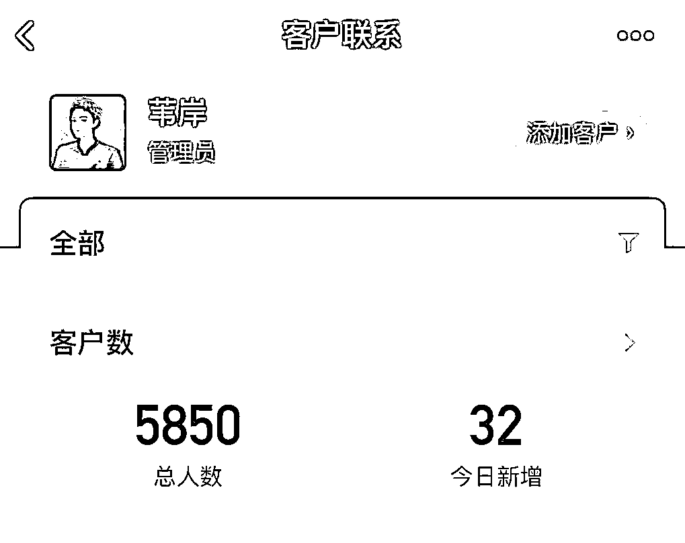
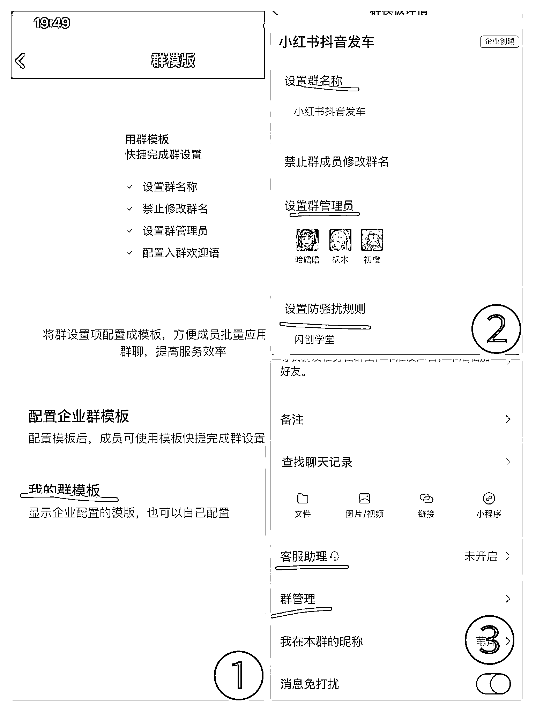
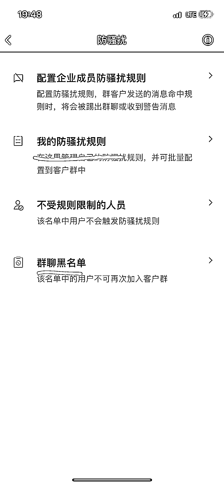
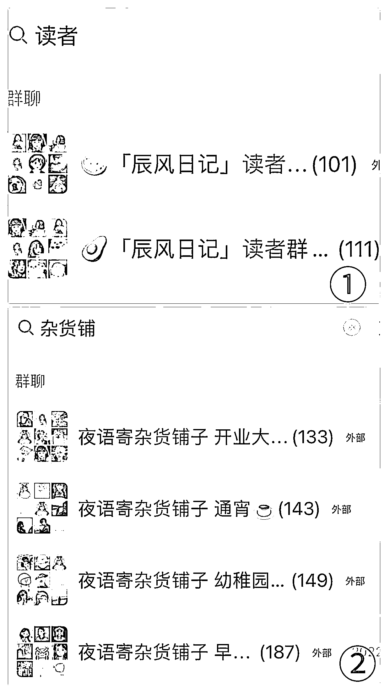

# 通过 40+社群，触达 9000+用户，如何批量搭建社群并实现精细化运营？

> 原文：[`www.yuque.com/for_lazy/thfiu8/cvlttx53bgg0xp05`](https://www.yuque.com/for_lazy/thfiu8/cvlttx53bgg0xp05)

## (27 赞)通过 40+社群，触达 9000+用户，如何批量搭建社群并实现精细化运营？ 

作者： 辰风 

日期：2023-07-31 

大家晚上好，我是辰风。 

我有一个 6 万粉，一个 2.6 万粉公众号。沉淀了近 40 个社群，私域用户有 9000+。 

通过副业项目，单月变现大概 6k 左右，不算很多，但都是被动收益。团队做推广、社群、变现项目，合作方做流量承接。投产比大概是 1:4。 

  

今天和大家分享的内容是关于企业微信群的批量搭建。我分成了三个部分，分别是: <ne-h3 id="53461d5c" data-lake-id="53461d5c">一、社群如何变现？</ne-h3> 

既然是做社群，那社群一定要达到我们想要的目的，那我想到的最直接的目的就是我能够通过社群赚到钱。 

我刚做社群的时候，那时候就是给自己的账号来提升阅读量的，当时我建了大概有十个左右的社群。 

然后我接了我的社群的第一个广告，帮猫老师去推广直播间，他给了我 60 块钱的佣金。 

虽然这笔钱不多，但是我只需要在社群里去转发一下，让大家去看一下这个直播就好了。 

## 1.做专门的广告副业社群 

因为我个人是比较抵触在读者群去发公众号广告的。 

所以一般我的账号阅读量还行的话，我不会怎么去往读者群去发广告。 

我觉得这是会对他们感觉不好，让他们觉得我好像天天在那里赚钱，然后也不关心他们。 

所以我专门成立了这样的兼职副业社群，然后去发广告。 

他们不是喜欢找工作找兼职吗？ 

那我就专门建这样的群，我每天在群里面去发我的公众号广告。 

通过搭建了几十个群，不断地进人，不断地往群内发兼职广告信息，也可以实现小几千的变现。 

  

## 2.对接广告项目 

这个就很直接了，比如说我们公众号可以接很多 CPA 的广告，大多数 CPA 广告的呈现形式就是关注后回复，别人关注我们的公众号，然后看到我们的这些内容。 

他回复关键词，或者点我们的广告链接进行报名，这些都是可以变现的一种方式。 

然后我的账号里也挂了一些 CPA 的合作项目，主要是主播，趣职业宝，ps 和原画这些。 

  

## 3.网赚项目 

我最近也在研究一些网赚的项目。 

比如说前段时间很火的美团圈圈，还有一个拉新活动。 

美团圈圈是美团的一个新推的小程序，主打的是做线下门店的运营。 

然后他有一个活动，就是你拉新一个人是十块钱，拉新成为达人，然后一个人最多可以赚 1000。 

我稍微测试了一下，通过微信群来进行拉新，变现了 500 左右。（目前已经提现） 

  

## 4.课程广告 

我做了年度社群，比较轻交付的模式，然后定价也不算太高，每个月都有固定的主题词，通过在社群做分享进行交付。 <ne-h3 id="990aea85" data-lake-id="990aea85">二、你想做什么社群？</ne-h3> 

我觉得这是首先要解决的一个问题，你想做什么样的社群，你想达到什么样的目的。 

如果你想提升公众号的阅读量，那你就可以多去运营一些读者群，如果你觉得运营几个对你来说有一点难度，那你就先做一个读者群，把它先盘活，然后我们再去复制，再去研究促活的玩法。 

社群一定要批量复制，流水线操作。 

社群的玩法其实跟公众号是相类似的，它都会有一定的时间周期和流程，需要不停的去拉新、维系、促活和留存，你必须经历这些步骤。 

如果这个群不活跃了，我们就去拉新的人进来，把现有的流量盘活，或者让那群死掉的复活。 

通过不断的去做活动，做话题，调动大家来参与，参与讨论，让大家感觉到这是一个温暖的家庭，而不是一个每天在这里发文章的工具。 

我个人也是比较抵触那种一发文章就会艾特全体成员的那种行为，所以我一般就会跟我的小助理说，没有什么事情就不要艾特大家。大家的注意力都是有限的，不会说大家为了看你一个公众号还去加你的群，然后天天点进来跟你互动。 

所以一定要站在读者的立场上，去做这件事情，大家为什么要去看你的社群。 

从利己的角度去讲，他们有一些人是为了来割韭菜的，想赚你的钱的。 

比如说你做话题征集，做投稿，你通过一些小的诱饵，然后让大家能够参与到你的活动，然后再通过深入的了解知道你的性格，或者知道你的账号的历程，参与到了你的账号搭建的过程。 

他觉得他是你的账号的一份子，包括你们在群里聊得来，成为了一些好朋友，这些都是能够让你的社群团员更有凝聚力的一种方式。 

## 1.读者群 

我有两个公众号，每个公众号都建立了两个读者群，交给了四个助理来进行运营。 

然后我主要用社群的一个目的就是可以不定期的组织一些活动。 

比如公众号的周年，或者特定的节日，或者一些重大的日子。 

第二个就是能够提升账号的粘性，让大家能够多点赞三连，然后提升公众号的阅读量。 

最重要的一点就是能够拉近读者之间的距离，让他们从一个社群成员的身份变成一个公众号的粉丝。 

## 2.副业群 

这个就很直接了，比如说我们需要去做广告的曝光量，我们就直接发到副业社群里。 

比如说我们投了一个博主的广告，我们需要一些助力去提升我们这个广告的一个曝光量，，那我们需要去通过这样的方式来提升这个点赞量。 

## 3.助理群 

这个就是做多平台的投放引流，也就是我们大家通常讲的上车。 

有的朋友他是找固定的助理，比如说找两三个助理，然后让他们固定找车，一个月要达到多少的指标。 

但是我的思路不一样，我做的是批量化的社群，可能我一个社群里有一两百号人，我最鼎盛的时期，我们当时搭建了六个社群，每个社群有 200 多号人，全都是负责找车的助理。 

然后我在群公告里放了一整套的找车投流的流程，告诉他们怎么去找，然后每个群里有专门负责对接的人，对接的小助理也是可以拿到提成的。 

然后不断在群里晒单，去刺激他们做这件事情，这也是为什么持续能有车上的一个原因。 

因为现在找车其实是比较困难的，而且博主的报价也相对参差不齐，我们很难找到一些稳定靠谱的助理。 

所以我们需要复制这种玩法，然后尽可能把自己的精力分散去做其他更重要的事情，不必要在这样的事情上花费更多的时间。 

擅长找车的人，他可能看完这套流程方案，他自己就可以实操了，但是他不擅长，不相信这件事情，他可能看完他一点想法都没有，甚至他都懒得去看这样的东西。 

流程:人从哪里来？ 

然后到了大家非常关心的一个问题，那你搭建这么多社群里的人是从哪里来的？ 

就是从公众号的后台来，从关键词回复，还有菜单栏。 

  

很多公众号后台，都是有设置很多钩子的，也有很多关键词，你可能随便回复一个内容就可以收到相应的关键词，包括我的菜单栏也搭建了很多社群。 

而且它这个关键词，它不止是一个群二维码，它可能还会附带一条推文，这个推文里面展开又是一个新的内容。 

1.关键词回复，社群搭建，图文设置 

2.菜单栏设置 

菜单栏我一开始也试过那种文艺的标题，但是我发现大家还是更喜欢简单暴力一些的。 

大家还是对钱这种字眼非常敏感。 

比如副业变现，兼职赚钱、小白赚钱，类似于这样的词汇，点击率会更高，转化效果也会更好。 <ne-h3 id="9039450f" data-lake-id="9039450f"> </ne-h3> <ne-h3 id="dfe094df" data-lake-id="dfe094df">三、 如何复制社群？</ne-h3> <ne-h4 id="9039450f-1" data-lake-id="9039450f-1"> </ne-h4> <ne-h4 id="d6427891" data-lake-id="d6427891">1.创建社群</ne-h4> 

我们这里会讲到一个使用活码，什么叫做活码？ 

就是这个码它是可以自己跳的，可以实现自动换码。 

普通的群二维码的一个特点就是这个二维码它是七天内有效，然后达到 200 人就上限了。 

这就会导致一个问题，你需要频繁的去更换你的二维码，一旦你忘记更换，你这个群就失效了，别人扫码就进不来。 

但是活码的一个好处，这个码它是永久有效的。 

而且它可以实现自动换码，你需不需要再自己去更换，然后群满员了，上线了，它还会自动创建新群。 

有一些小程序有这种活码，但是我大概看了一下，基本上都是要花钱的。 

然后你也需要去主动更换二维码，但是企业微信的群二维码的一个好处就是他不需要你花钱，这个是它自带的一个功能。 

最重要的就是它永久有效，你可以直接一直用，一直到它不能用为止，不能用的情况就是你这个账号违规了，或者你的社群违规了。 

  

入群设置活码： 

最上面有一个创建一个客户群，你就不需要再拉人，然后又踢出去，那么麻烦。 

你点它，它就可以自动生成一个微信用户可以进的群，你如果只是建普通的企业微信群的话，他只能拉你的企业员工。 

然后他这个可以选择你想设置加入的社群。 

总共可以选择五个，每个群成员上限是 200 人。 

也就是说你这五个群最多可以承载 1000 个人，你哪怕有很大的流量进来，你短时间内也是可以把它承接住的。 

在今年一二月份的时候，我的账号有增长了一两万的粉丝，我都是通过这种方式把他们沉淀到我的社群来的，这也是为什么我的社群的体量有这么大的一个原因。 

然后我还把这些流量全都转移过来了，就让他们成为了社群的成员，然后我可以做后端的变现。 <ne-h3 id="3e74c1ac" data-lake-id="3e74c1ac">2.群模板</ne-h3> 

群模板是什么东西，就是你可以直接把你的群一键设置，或者你可以直接在创建群的时候就把这些东西都设置好，包括你的群名称，方骚扰规则，你的管理员这些东西都可以设置。 

  

然后你还可以设置一个入群欢迎语，这样的话你就不用专人接待了。 

比如说他进来一个人三分钟回应一次，或者十分钟回应一次。 

你把文案设置好，然后让他们去看群公告，这样的话就可以实现一个完整的闭环，没有人在那里也可以管理你的社群。 <ne-h3 id="2c2c7a58" data-lake-id="2c2c7a58">3.社群成员查重</ne-h3> 

  

作为管理员和社群群主，你可以对你的社群进行查重的管理。 

这个群他不能同时存在多个社群当中，你可以一键就可以把他踢出群，可以选择，非常的方便。 

## 4.防骚扰规则 

  

企业微信群有一个防骚扰的功能，它可以设置两个，一个是只对本企业员工开放，这样的话，其他企业的员工想进来，你的群就进不来，他们也不能够在你的群里捣乱。 

第二个就是你可以对特定的一些人群或者一些内容来进行界定。 

比如说在群里发图片，在群里发链接，或者在群里发了关键词，或者他的名字里带有什么样的字。 

你都可以把它设置好，只要是符合这些条件的人，他进了你的社群就会被立马踢出去。 

还有比如说他发了消息达到多少多少字，或者它的换行多少多少字，或者他累计发了多少条消息，这些都是可以提前设置的，只要他达到了这个临界值，就会被立马踢出社群。 

这样的话也可以进行有效的删除那种广告党和那种捣乱的人。 

  

还有这个群聊的黑名单。 

这个是非常有用的。 

如果你讨厌这个人，不希望他后续再加到你的社群当中来，你可以直接设置黑名单，他会把他从你所有的社群当中移出，并且纳入黑名单。 

此后他不能再加入你创建的任何社群，任何场景都不能进来。 

然后要提醒大家注意的三件事情！ 

第一，你如果有过账号违规，你进入了开了防骚扰规则的企业微信群，你容易被永久封号，我之前的账号被封就是因为这个原因。 

第二，一旦你的企业微信违规，你的所有二维码都会失效，你的所有社群二维码。 

违规的场景就是你的消息在社群当中会出现红色感叹号，你发消息可能也会出现红色感叹号。 

它不会通过企业微信端提醒你的，然后他没有一个提醒你的截止时间，可能你第一次违规是一天，也可能是两三天或者是一周，这都是不一定的，它也是呈现一个阶梯形式的，可以申请解封。 

第三，你的微信群管理员不能设置个人微信，只能设置本企业员工，也就是他在你的企业微信团队里。 

其次，你的个人微信转让到你的企业微信群，他这种社群是属于外部社群，不属于企业微信社群，刚刚说的那些社群搭建的规则对这种社群不适用。 

要想设置好我们的社群，就需要对他们进行统一化的管理，给他们命名一个统一的名字，你能够分辨出来的是最好的。 

然后我们把适当的社群进行置顶操作，然后再按照我们刚刚所说的流程，我们把快捷回复、群模板这些都搭建好。 

  

你看像我命名的一些名字，它就是都是统一的，我也喜欢这种统一的名字，看起来很舒服，然后我可以一眼分辨的出来他这个群谁负责，然后是做什么的。 

然后呢，你一个人肯定是管理不过来这些社群的，你需要有一些小助理来帮你进行管理。 

我们主要做的工作是三个。 

第一个我们在读者群的促活，调动大家参与聊天，参与活动。 

第二个把那些打广告的踢出去，然后警告大家不要进群。 

第三个做社群的对接，比如说我们的找车对接。 

然后最后的一个点，企业微信他可以把员工的所有权限都可以收回。 

它可以设置继承或者删除成员，然后选择员工继承这些成员的社群或者是好友列表。 

对于我来说，这个社群他现在已经成为了一个附带的工作。 

虽然听我讲了这些，感觉这里面好多流程好复杂，但是你把这些内容都已经搭建好的情况下，它是可以带给你带来很多便利和方便的，你不需要去每天面对那些海量的信息。 

对我来说，社群就是一个自动成交系统，通过后台可以实现自动加群，机器人自动回复接待，社群助理维护，社群裂变，成交。 

可以直接走完一整套流程。 

最后感谢你看到这里。 

评论区： 

Kyo" : 可以链接一下吗 辰风 : 可以的 

  